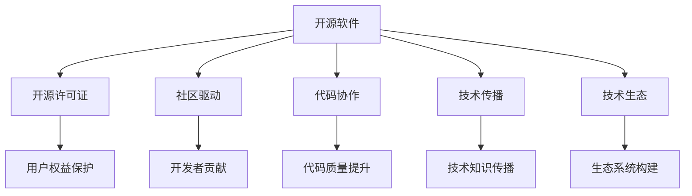

                 

# 开源技术：共享创新，加速进步

> 关键词：开源技术,共享创新,代码协作,社区贡献,加速进步,软件开发,技术传播,生态系统构建,技术突破

## 1. 背景介绍

### 1.1 问题由来
在过去的几十年中，开源技术已经成为软件创新的重要驱动力。从Linux内核到Apache Web服务器，再到现在的Go语言、TensorFlow等流行开源项目，开源运动极大地推动了软件开发、技术传播和创新。开源技术的核心理念是“协作、共享和透明度”，其目标是通过社区贡献和代码共享，促进技术进步和产业升级。

随着互联网和云计算的普及，开源技术正日益成为各行各业的基础设施。在制造业、金融、医疗、教育等诸多领域，开源技术被广泛应用，加速了行业数字化转型的进程。然而，开源技术的快速发展也带来了新的挑战，包括项目维护、质量保障、安全性、以及版权和合规等问题。

### 1.2 问题核心关键点
开源技术成功的关键在于其开放性和社区驱动的创新机制。开源项目通过透明的代码审查和贡献流程，汇聚了全球各地的开发者和专家，共同推动技术进步。开源技术的快速迭代和跨领域应用，使其在众多领域中展现出了强大的生命力和适应性。

然而，开源技术的开放性和社区驱动也有其局限性。由于缺乏统一的治理机制和标准，开源项目可能面临代码质量参差不齐、兼容性问题、版本混乱、安全性风险等挑战。此外，开源社区的快速扩张和多样化，也使得版权和合规问题更加复杂。

## 2. 核心概念与联系

### 2.1 核心概念概述

为了更好地理解开源技术的运作机制和核心概念，本节将介绍几个关键概念及其之间的联系：

- **开源软件**：指使用开源许可证（如GPL、Apache、MIT等）发布的自由软件，源代码公开，任何人可以自由复制、修改和分发。

- **开源许可证**：定义了开源软件的使用、分发和修改规则，如GPL、Apache、MIT等。开源许可证不仅保护了原作者的权益，也确保了开源社区的健康发展。

- **社区驱动**：指开源项目通过开发者社区的力量进行开发和管理，开发者自愿贡献代码，社区通过代码审查、贡献指南、开源会议等方式进行协作。

- **代码协作**：指开源项目通过持续集成、代码审查、合并请求等方式，促进开发者之间的协作，提高代码质量和工作效率。

- **技术传播**：指开源项目通过文档、培训、社区交流等方式，传播技术知识和最佳实践，推动技术进步和产业应用。

- **技术生态**：指开源项目通过吸引第三方工具、插件、服务等多层次的生态系统，为开发者和用户提供更丰富的解决方案和体验。

这些核心概念之间相互联系，共同构成了开源技术的核心运作机制。通过理解这些概念，我们可以更好地把握开源技术的本质和价值，参与和推动开源社区的发展。

### 2.2 核心概念原理和架构的 Mermaid 流程图



这个流程图展示了开源技术的核心概念及其之间的联系：

1. 开源软件通过开源许可证获得法律保障，确保代码的自由共享和修改。
2. 社区驱动和代码协作是开源项目的生命线，通过集体智慧和合作，推动技术进步和代码质量的提升。
3. 技术传播和技术生态系统的构建，为开源项目提供更广泛的应用场景和支持，促进技术创新和应用普及。
4. 开源许可证确保了用户和开发者权益，同时通过社区规范和技术标准，保障开源项目的健康发展。

## 3. 核心算法原理 & 具体操作步骤
### 3.1 算法原理概述

开源技术的核心算法原理主要涉及版本控制、代码审查、持续集成、自动化测试等多个方面。以下我们将重点介绍其中几个关键算法和操作步骤。

### 3.2 算法步骤详解

#### 3.2.1 版本控制

开源项目的版本控制是管理代码变更的重要工具。版本控制系统（如Git、SVN等）通过记录每次代码提交的详细信息，保障了代码的历史记录和可追溯性。

- **Git工作流程**：分为分支管理、代码合并、代码合并冲突解决等关键步骤。分支管理通过创建不同的开发分支，避免代码冲突和混乱。代码合并通过Pull Request和Merge Request等方式，促进开发者之间的协作和审查。

#### 3.2.2 代码审查

代码审查是确保开源项目代码质量的重要环节。通过代码审查，开发者可以及时发现和修复代码问题，提升代码的稳定性和可维护性。

- **Pull Request流程**：开发者在本地分支上完成代码开发，通过Git push代码变更到远程仓库。在GitHub、GitLab等平台上，开发者提交Pull Request，请求代码合并。其他开发者对Pull Request进行代码审查，提出修改意见。开发者根据修改意见进行修改后，再次提交Pull Request，直至通过审查。

#### 3.2.3 持续集成

持续集成是自动化测试和构建的开源项目管理方式。通过持续集成，开发者可以在代码提交后立即运行自动化测试，及时发现和修复问题，保障代码质量。

- **Jenkins、Travis CI等工具**：提供了自动化构建和测试功能，支持多种编程语言和操作系统。开发者在代码变更后，通过触发Jenkins、Travis CI等持续集成工具，自动运行测试和构建，并生成测试报告和构建结果。

#### 3.2.4 自动化测试

自动化测试是保障代码质量的重要手段。通过自动化测试，开发者可以高效、精确地发现和修复代码问题，提升代码的稳定性和可维护性。

- **Selenium、JUnit、TestNG等测试框架**：提供了丰富的自动化测试工具和框架，支持单元测试、集成测试、功能测试等多种测试类型。开发者在代码变更后，自动运行自动化测试用例，确保代码符合预期。

### 3.3 算法优缺点

开源技术的核心算法和操作步骤具有以下优点：

- **开放性和透明性**：开源项目通过公开源代码和审查过程，促进了透明度和可追溯性，保障了用户和开发者的权益。
- **社区协作和贡献**：开源项目通过社区协作和贡献机制，汇聚了全球各地的开发者和专家，推动了技术进步和代码质量的提升。
- **快速迭代和适应性**：开源项目通过持续集成和自动化测试，可以快速迭代和适应新的需求和变化，保持技术的活力和适应性。

然而，开源技术也存在一些局限性：

- **复杂性和多样性**：开源项目的多样性和复杂性，使得管理、维护和治理变得更加困难。
- **兼容性问题**：开源项目之间的兼容性问题，可能影响跨平台和跨系统的应用和集成。
- **安全性风险**：开源项目的安全性风险，如代码注入、数据泄露等，可能带来潜在的威胁。
- **版权和合规问题**：开源项目的版权和合规问题，如开源许可证的合规使用、第三方代码的使用等，可能引发法律风险。

### 3.4 算法应用领域

开源技术在众多领域中得到了广泛应用，以下是几个典型的应用场景：

- **软件开发**：开源技术在软件开发中发挥了重要作用，从操作系统到编程语言，再到各类框架和工具，开源技术极大地促进了软件生态的发展。

- **云计算**：开源云计算技术如OpenStack、Kubernetes、Docker等，已经成为云计算基础设施的重要组成部分，推动了云服务的普及和创新。

- **大数据和人工智能**：开源大数据技术和人工智能框架如Hadoop、Spark、TensorFlow等，为数据处理和机器学习提供了强大的工具和平台，加速了相关技术的发展。

- **物联网**：开源物联网技术如MQTT、Kura等，提供了数据采集、设备管理和通信协议等关键功能，推动了物联网应用的普及和创新。

- **开源教育和培训**：开源技术和工具为开源教育和培训提供了丰富的资源和平台，促进了开源知识和技能的传播和应用。

## 4. 数学模型和公式 & 详细讲解  
### 4.1 数学模型构建

本节将使用数学语言对开源技术的运作机制进行更加严格的刻画。

记开源项目为 $S$，其中 $S$ 由开发者社区 $C$ 和代码库 $R$ 构成，每个开发者 $c_i \in C$ 提交代码 $r_j \in R$，代码库 $R$ 由版本控制工具管理。开源项目的运作过程可以建模为如下数学模型：

$$
S = (C, R, V, T, M, W)
$$

其中：

- $C$：开发者社区。
- $R$：代码库。
- $V$：版本控制工具。
- $T$：持续集成工具。
- $M$：代码审查机制。
- $W$：自动化测试工具。

开源项目的运作过程可以分解为以下几个步骤：

1. 开发者 $c_i$ 在本地分支上开发新功能或修复bug，通过版本控制工具提交代码变更。
2. 代码变更触发持续集成工具 $T$，自动运行测试和构建，生成测试报告和构建结果。
3. 提交的代码变更通过代码审查机制 $M$，其他开发者对代码进行审查，提出修改意见。
4. 开发者根据修改意见进行修改后，再次提交代码变更。
5. 代码变更通过持续集成工具 $T$，自动运行测试和构建，生成测试报告和构建结果。
6. 代码变更通过代码审查机制 $M$，其他开发者对代码进行审查，提出修改意见。
7. 开发者根据修改意见进行修改后，再次提交代码变更。

开源项目的代码质量可以通过以下数学模型进行评估：

$$
Q(S) = \frac{1}{N}\sum_{i=1}^N \text{Quality}(r_i)
$$

其中 $N$ 表示代码库中的代码变更数量，$\text{Quality}(r_i)$ 表示第 $i$ 个代码变更的质量，可以通过代码审查评分、自动化测试通过率等指标进行计算。

### 4.2 公式推导过程

以下我们将推导开源项目代码质量的计算公式：

假设每个代码变更的平均审查时间为 $t_r$，每次代码审查的平均评分记为 $s_r$，每次代码变更的平均自动化测试时间为 $t_w$，每次测试的平均通过率为 $p_w$。则第 $i$ 个代码变更的质量可以表示为：

$$
\text{Quality}(r_i) = s_r \cdot p_w \cdot (1 - (1 - p_w)^{t_w} \cdot (1 - t_r)^{s_r})
$$

将上述公式代入代码质量评估公式，得：

$$
Q(S) = \frac{1}{N}\sum_{i=1}^N s_r \cdot p_w \cdot (1 - (1 - p_w)^{t_w} \cdot (1 - t_r)^{s_r})
$$

该公式计算了开源项目的平均代码质量，反映了社区驱动和代码审查对代码质量的影响。

### 4.3 案例分析与讲解

以TensorFlow项目为例，分析开源项目代码质量的影响因素：

- **代码审查**：TensorFlow项目通过持续代码审查，严格控制代码质量。每次代码变更必须通过其他开发者的审查，并在GitHub上公开审查记录，确保代码符合项目规范。

- **持续集成**：TensorFlow项目通过Google的CI系统进行持续集成，自动运行测试和构建，生成详细的测试报告和构建结果，及时发现和修复代码问题。

- **自动化测试**：TensorFlow项目通过广泛的自动化测试覆盖，包括单元测试、集成测试和性能测试等，保障了代码的稳定性和可维护性。

TensorFlow项目的代码质量评估公式可以表示为：

$$
Q(TensorFlow) = \frac{1}{N}\sum_{i=1}^N s_r \cdot p_w \cdot (1 - (1 - p_w)^{t_w} \cdot (1 - t_r)^{s_r})
$$

其中 $s_r$ 表示TensorFlow项目每次代码审查的平均评分，$p_w$ 表示每次测试的平均通过率，$t_r$ 表示代码审查的平均时间，$t_w$ 表示自动化测试的平均时间。

通过分析TensorFlow项目的代码质量评估公式，可以看出代码审查和持续集成在提升代码质量方面的重要作用。TensorFlow项目的代码审查严格性和持续集成的自动化程度，是其代码质量高的主要原因。

## 5. 项目实践：代码实例和详细解释说明
### 5.1 开发环境搭建

在进行开源项目实践前，我们需要准备好开发环境。以下是使用Python进行Git版本控制的开发环境配置流程：

1. 安装Git：从官网下载并安装Git客户端，配置SSH密钥，以便访问GitHub等平台。

2. 配置Git环境：创建并克隆开源项目代码库，设置本地分支和远程分支，进行代码提交和合并。

3. 安装GitHub Desktop：通过GitHub Desktop界面进行代码提交和Pull Request管理。

4. 安装Jenkins、Travis CI等持续集成工具：配置持续集成流水线和测试脚本，自动运行测试和构建。

5. 安装Selenium、JUnit、TestNG等自动化测试工具：配置自动化测试脚本，自动运行测试用例，生成测试报告。

完成上述步骤后，即可在本地环境进行开源项目的开发实践。

### 5.2 源代码详细实现

这里以TensorFlow项目的持续集成流程为例，给出GitLab上开源项目的持续集成实践代码实现。

首先，在GitLab上创建TensorFlow项目的仓库：

```bash
git clone https://github.com/tensorflow/tensorflow.git
cd tensorflow
git checkout main
git pull
```

然后，配置GitLab CI/CD的YAML配置文件：

```yaml
stages:
  - build
  - test
  - deploy

build:
  stage: build
  script:
    - echo "build: started"
    - ./configure
    - make -j$(nproc)

test:
  stage: test
  script:
    - echo "test: started"
    - ./test/g3doc/api_docs.sh

deploy:
  stage: deploy
  script:
    - echo "deploy: started"
    - gcloud builds submit --config deployments.yaml
```

该YAML文件定义了持续集成流程的三个阶段：构建、测试和部署。在每个阶段执行相应的脚本，自动运行构建、测试和部署操作。

接着，在本地环境进行代码提交和Pull Request操作：

```bash
git add .
git commit -m "Add new feature"
git push origin main
```

然后，在GitLab上查看Pull Request和持续集成结果：

```bash
git pull-request --help
```

最后，根据持续集成结果，进行代码合并和后续开发：

```bash
git merge pull-request-id
git push origin main
```

这样，就完成了TensorFlow项目的持续集成流程。

### 5.3 代码解读与分析

下面我们详细解读一下关键代码的实现细节：

**Git命令**：
- `git clone`：克隆Git仓库到本地环境。
- `git checkout`：切换到指定分支。
- `git pull`：从远程仓库拉取最新代码变更。
- `git add`：添加代码变更到暂存区。
- `git commit`：提交代码变更到本地仓库。
- `git push`：将代码变更推送到远程仓库。
- `git pull-request`：在GitLab上创建Pull Request。

**YAML配置文件**：
- `stages`：定义持续集成的三个阶段：构建、测试和部署。
- `build`：定义构建阶段的操作，包括运行配置脚本和编译操作。
- `test`：定义测试阶段的操作，包括运行测试脚本和生成测试报告。
- `deploy`：定义部署阶段的操作，包括提交部署操作和推送到云平台。

**Pull Request操作**：
- 通过`git add`和`git commit`提交代码变更。
- 通过`git push`将代码变更推送到远程仓库。
- 在GitLab上创建Pull Request，请求代码合并。

通过上述代码实现，可以直观地看到开源项目如何进行持续集成和代码审查，保障代码质量和项目稳定性。

### 5.4 运行结果展示

运行GitLab的持续集成流程，可以得到以下结果：

- 构建阶段：自动运行构建脚本，生成构建日志和结果。
- 测试阶段：自动运行测试脚本，生成测试报告和覆盖率统计。
- 部署阶段：自动提交部署操作，生成部署日志和结果。

这些结果展示了开源项目持续集成和代码审查的效果，证明了代码质量和管理流程的有效性。

## 6. 实际应用场景
### 6.1 开源社区的运作

开源社区的运作是开源技术的重要组成部分，其运作方式和流程直接影响开源项目的发展和应用。以下是开源社区运作的几个关键环节：

#### 6.1.1 开源社区的组织结构

开源社区的组织结构通常包括项目管理员、代码审查者、贡献者等多个角色。每个角色都有明确的职责和任务，共同推动项目的开发和维护。

- **项目管理员**：负责项目的整体规划和治理，包括项目的资金、资源和法律合规等。
- **代码审查者**：负责代码审查和质量保障，确保代码符合项目规范和标准。
- **贡献者**：负责代码开发和社区交流，推动项目的持续创新和扩展。

#### 6.1.2 开源社区的贡献流程

开源社区的贡献流程通常包括代码提交、代码审查、代码合并等多个步骤。通过透明的流程和规范，保障代码质量和社区协作。

- **代码提交**：贡献者通过版本控制工具提交代码变更，填写Pull Request和贡献描述。
- **代码审查**：其他开发者对代码变更进行审查，提出修改意见和建议。
- **代码合并**：代码变更通过审查后，由项目管理员合并到项目主分支。

通过开源社区的组织结构和贡献流程，保障了开源项目的健康发展和代码质量。

#### 6.1.3 开源社区的交流和协作

开源社区的交流和协作是保障项目持续创新的重要手段。通过开源会议、文档、邮件列表等渠道，促进开发者之间的交流和协作。

- **开源会议**：定期召开开源会议，分享项目进展和技术经验。
- **文档和邮件列表**：发布项目文档和邮件列表，促进开发者之间的交流和协作。

通过开源社区的交流和协作，推动了项目的持续创新和扩展。

### 6.2 开源技术的应用

开源技术在众多领域中得到了广泛应用，以下是几个典型的应用场景：

#### 6.2.1 软件开发

开源技术在软件开发中发挥了重要作用，从操作系统到编程语言，再到各类框架和工具，开源技术极大地促进了软件生态的发展。

- **操作系统**：开源操作系统如Linux、FreeBSD等，提供了安全、稳定和高效的操作系统解决方案。
- **编程语言**：开源编程语言如Python、JavaScript、Java等，为软件开发提供了强大的工具和平台。
- **框架和工具**：开源框架和工具如Django、React、Kubernetes等，提供了丰富的开发和部署解决方案。

#### 6.2.2 云计算

开源云计算技术如OpenStack、Kubernetes、Docker等，已经成为云计算基础设施的重要组成部分，推动了云服务的普及和创新。

- **OpenStack**：开源云平台，提供计算、存储和网络等基础设施服务。
- **Kubernetes**：开源容器编排工具，提供自动化部署和管理容器应用的功能。
- **Docker**：开源容器技术，提供容器化应用部署和运行的功能。

#### 6.2.3 大数据和人工智能

开源大数据技术和人工智能框架如Hadoop、Spark、TensorFlow等，为数据处理和机器学习提供了强大的工具和平台，加速了相关技术的发展。

- **Hadoop**：开源大数据处理平台，提供数据存储、处理和分析功能。
- **Spark**：开源大数据处理框架，提供高性能、分布式的数据处理功能。
- **TensorFlow**：开源人工智能框架，提供深度学习和机器学习的功能。

#### 6.2.4 物联网

开源物联网技术如MQTT、Kura等，提供了数据采集、设备管理和通信协议等关键功能，推动了物联网应用的普及和创新。

- **MQTT**：开源物联网通信协议，提供轻量级、低功耗的数据传输功能。
- **Kura**：开源物联网操作系统，提供设备管理和数据采集的功能。

## 7. 工具和资源推荐
### 7.1 学习资源推荐

为了帮助开发者系统掌握开源技术的运作机制和核心概念，这里推荐一些优质的学习资源：

1. **《开源管理：从协作到治理》**：介绍了开源项目的组织结构、贡献流程和治理机制，适合入门和进阶开发者。
2. **《软件工程：开源和分布式系统》**：讲解了开源软件的设计和实现，适合从事开源软件开发和维护的开发者。
3. **《开源社区和组织》**：分析了开源社区的运作方式和成功案例，适合开源项目的项目管理员和贡献者。
4. **《开源技术应用指南》**：提供了开源技术在软件开发、云计算、大数据、人工智能等多个领域的应用案例，适合技术经理和产品经理。
5. **《开源项目的最佳实践》**：总结了开源项目成功的关键因素和最佳实践，适合开源项目的开发者和项目管理员。

通过对这些资源的学习实践，相信你一定能够快速掌握开源技术的运作机制和应用场景，参与和推动开源社区的发展。

### 7.2 开发工具推荐

高效的开发离不开优秀的工具支持。以下是几款用于开源技术开发的工具：

1. **Git**：开源版本控制系统，支持分支管理、代码提交、代码审查等功能。
2. **GitHub**：开源社区和代码托管平台，提供Pull Request、代码审查、持续集成等功能。
3. **Jenkins**：开源持续集成工具，支持自动化构建和测试。
4. **Travis CI**：开源持续集成工具，支持多种编程语言和操作系统。
5. **Selenium**：开源自动化测试工具，支持网页和桌面应用的自动化测试。
6. **JUnit**：开源Java测试框架，支持单元测试、集成测试等功能。
7. **TestNG**：开源Java测试框架，支持功能测试、性能测试等功能。

合理利用这些工具，可以显著提升开源技术开发和管理的效率，推动项目的持续创新和扩展。

### 7.3 相关论文推荐

开源技术的发展源于学界的持续研究。以下是几篇奠基性的相关论文，推荐阅读：

1. **《开源软件实践：分析与改进》**：分析了开源软件开发的实践经验，提供了改进建议和技术指导。
2. **《开源社区协作与创新》**：探讨了开源社区协作的方式和机制，提出了促进创新的策略和方法。
3. **《开源项目治理与合规》**：研究了开源项目的治理和合规问题，提出了解决方案和最佳实践。
4. **《开源技术的未来发展》**：展望了开源技术的发展趋势，提出了未来的研究方向和应用场景。

这些论文代表了大规模开源技术的研究方向和实践经验，对于理解和推动开源技术的发展具有重要意义。

## 8. 总结：未来发展趋势与挑战

### 8.1 总结

本文对开源技术的运作机制和核心概念进行了全面系统的介绍。首先阐述了开源技术的背景和发展历程，明确了开源技术的核心理念和运作机制。其次，从原理到实践，详细讲解了开源项目的版本控制、代码审查、持续集成、自动化测试等多个关键操作，给出了GitLab上开源项目的持续集成实践代码实现。同时，本文还探讨了开源社区的组织结构、贡献流程和交流协作方式，分析了开源技术在软件开发、云计算、大数据、人工智能、物联网等多个领域的应用案例。

通过本文的系统梳理，可以看到，开源技术通过协作、共享和透明度，促进了软件创新的广泛应用和发展。开源技术的开放性和社区驱动的创新机制，使其在各个领域中展现出了强大的生命力和适应性。未来，开源技术的发展将更加多样化和复杂化，面临更多的挑战和机遇。

### 8.2 未来发展趋势

展望未来，开源技术的发展将呈现以下几个趋势：

1. **多样化和本地化**：开源项目将更加多样化，涵盖更多领域和应用场景。同时，开源项目也将更加本地化，满足不同地区和行业的特定需求。
2. **智能化和自动化**：开源技术将更加智能化和自动化，利用机器学习、人工智能等技术提升开发和管理效率。
3. **开源与商业结合**：开源技术与商业模式的结合将更加紧密，通过商业化运作推动开源项目的发展和应用。
4. **开源与开源**：开源项目之间的合作将更加紧密，通过开源社区的协作推动技术创新和应用普及。
5. **开源与隐私**：开源项目将更加重视数据隐私和安全，通过加密、匿名化等技术保障用户权益。

这些趋势将推动开源技术在更多领域的应用和发展，带来更加广泛的技术传播和产业变革。

### 8.3 面临的挑战

尽管开源技术已经取得了巨大成功，但在迈向更加智能化、普适化应用的过程中，仍面临诸多挑战：

1. **复杂性和多样性**：开源项目的复杂性和多样性，使得管理、维护和治理变得更加困难。
2. **兼容性问题**：开源项目之间的兼容性问题，可能影响跨平台和跨系统的应用和集成。
3. **安全性风险**：开源项目的安全性风险，如代码注入、数据泄露等，可能带来潜在的威胁。
4. **版权和合规问题**：开源项目的版权和合规问题，如开源许可证的合规使用、第三方代码的使用等，可能引发法律风险。
5. **资源和成本**：开源项目的持续发展和维护需要大量的资源和成本，包括人力、设备和资金等。

正视开源技术面临的这些挑战，积极应对并寻求突破，将是大规模开源技术迈向成熟的必由之路。

### 8.4 研究展望

面对开源技术面临的挑战，未来的研究需要在以下几个方面寻求新的突破：

1. **开源项目的多样化和本地化**：推动开源项目在更多领域和地区的应用和发展，提升开源技术的多样化和本地化水平。
2. **开源技术与商业模式的结合**：探索开源技术与商业模式的结合方式，通过商业化运作推动开源项目的发展和应用。
3. **开源项目的安全性和隐私保护**：研究开源项目的安全性和隐私保护技术，保障用户权益和数据安全。
4. **开源项目的管理和治理**：研究开源项目的管理和治理机制，提升开源项目的效率和可维护性。
5. **开源技术的智能化和自动化**：利用机器学习、人工智能等技术，提升开源项目的开发和管理效率。

这些研究方向的探索，必将引领开源技术迈向更高的台阶，为技术传播和产业应用提供更多的创新路径。

## 9. 附录：常见问题与解答

**Q1：开源技术如何应对复杂性和多样性？**

A: 开源技术通过社区协作和版本控制等机制，应对复杂性和多样性。开发者可以自由提交代码变更，并通过版本控制工具进行管理。同时，开源项目通过社区审查和持续集成等机制，保障代码质量和项目稳定性。这些机制帮助开源项目应对复杂性和多样性，保持高效和透明。

**Q2：开源项目如何保障代码安全？**

A: 开源项目通过代码审查、自动化测试和持续集成等机制，保障代码安全。代码审查可以及时发现和修复代码问题，自动化测试可以全面覆盖代码变更，持续集成可以及时发现和修复漏洞。这些机制通过透明和协作的方式，提升开源项目的代码安全性和稳定性。

**Q3：开源项目的版权和合规问题如何处理？**

A: 开源项目的版权和合规问题，通常通过开源许可证进行规范。开源许可证定义了代码的使用、分发和修改规则，保障了开源社区的健康发展和用户权益。同时，开源项目通过代码审查和持续集成等机制，确保代码变更符合开源许可证的要求。这些机制通过透明和协作的方式，提升开源项目的版权和合规性。

**Q4：开源项目的资源和成本如何管理？**

A: 开源项目的资源和成本管理，通常通过项目治理和资金管理等机制进行。开源项目的项目治理通过明确项目管理员和贡献者的职责和任务，保障项目的持续发展和高效运作。开源项目的资金管理通过捐赠和赞助等方式，保障项目的长期发展和资源支持。这些机制通过透明和协作的方式，提升开源项目的资源和成本管理效率。

通过上述解答，可以看到开源技术通过社区协作、版本控制、代码审查、自动化测试、持续集成等机制，应对复杂性和多样性，保障代码安全，处理版权和合规问题，管理资源和成本。这些机制和流程，保障了开源技术的健康发展和广泛应用。

