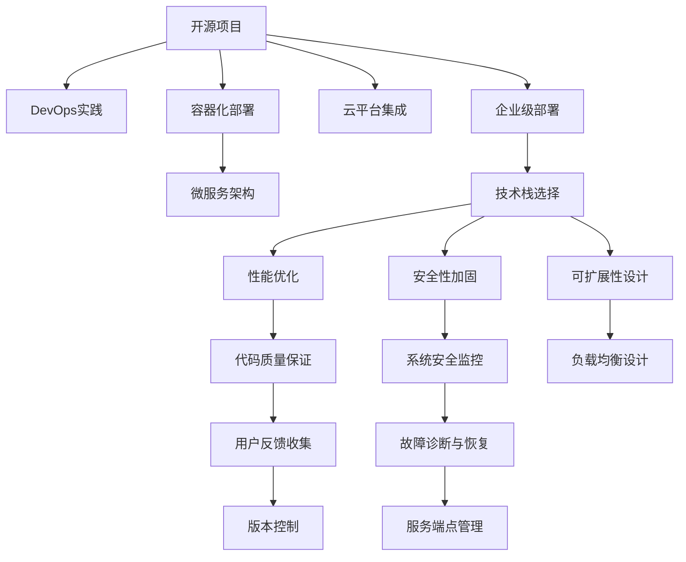

                 

# 开源项目的企业级部署服务：创造高价值机会

> 关键词：开源项目,企业级部署,技术栈,DevOps,容器化,微服务,云计算,DevOps实践

## 1. 背景介绍

### 1.1 问题由来
随着开源技术的日益成熟和普及，越来越多的企业开始采用开源项目进行技术创新和业务升级。然而，开源项目的企业级部署并非易事，其复杂度、安全性、可维护性等问题常常困扰企业开发者和运维人员。如何高效地将开源项目落地，为企业带来价值，成为开源社区和企业的共同关注点。

### 1.2 问题核心关键点
开源项目的企业级部署服务，主要包括技术栈选择、DevOps实践、容器化部署、微服务架构、云平台集成等环节。选择合适的开源技术和工具，利用高效的开源项目部署实践，才能最大化开源技术的价值，为企业带来高效、稳定、安全的服务。

### 1.3 问题研究意义
深入研究开源项目的企业级部署服务，对于推动开源技术在企业内部的广泛应用，加速企业数字化转型，提升技术创新能力具有重要意义：

1. **降低技术引入成本**：通过标准化、可复用的开源部署方案，减少技术引入和开发成本。
2. **提高开发效率**：利用开源社区成熟的开发实践和工具，提升开发效率和代码质量。
3. **保障系统稳定性**：通过容器化和微服务架构，实现高可用性和扩展性，保障系统稳定性。
4. **增强企业竞争力**：借助开源技术的强大功能和先进理念，提升企业的技术实力和市场竞争力。

## 2. 核心概念与联系

### 2.1 核心概念概述

为更好地理解开源项目的企业级部署服务，本节将介绍几个密切相关的核心概念：

- **开源项目(Open Source Project)**：指由社区维护、免费提供源码的软件项目，如Kubernetes、TensorFlow等。开源项目以其开放性、灵活性和创新性著称，广泛应用于企业内部和外部。

- **企业级部署(Enterprise-Level Deployment)**：指将开源项目部署到企业内部或云平台上，满足企业业务需求的过程。企业级部署要求兼顾性能、安全性、可扩展性等要求。

- **技术栈(Technology Stack)**：指构成一个系统所需的技术组件和工具，包括编程语言、框架、数据库、云服务等。选择合适技术栈是开源项目企业级部署的关键。

- **DevOps(Development & Operations)**：一种将开发和运维工作紧密结合的实践，旨在提升软件交付速度和质量。DevOps实践包括自动化构建、持续集成、持续部署、监控和报警等。

- **容器化(Containerization)**：通过将应用打包到容器镜像中，实现应用在不同环境中的一致性部署。容器化部署以Docker为代表，已广泛应用于开源项目的部署。

- **微服务架构(Microservices Architecture)**：将一个大应用拆分为多个小型服务，每个服务独立部署、独立运行，以提升系统的可扩展性和可靠性。

- **云平台(Cloud Platform)**：指提供计算、存储、网络等基础设施的云服务提供商，如AWS、Azure、Google Cloud等。云计算已成为开源项目企业级部署的重要手段。

这些核心概念之间的逻辑关系可以通过以下Mermaid流程图来展示：



这个流程图展示了几大关键概念及其之间的关系：

1. 开源项目通过DevOps实践、容器化部署、微服务架构等技术栈和工具，实现企业级部署。
2. 技术栈选择是开源项目企业级部署的基础，性能优化、安全性加固、可扩展性设计等是部署过程中的重要考虑因素。
3. 云平台集成进一步提升了企业级部署的便捷性和灵活性。
4. 企业级部署需要涵盖代码质量保证、系统安全监控、故障诊断与恢复等多个环节，才能确保系统的稳定性和可靠性。

## 3. 核心算法原理 & 具体操作步骤
### 3.1 算法原理概述

开源项目的企业级部署服务，本质上是将开源软件与企业需求相结合，构建高效、稳定、可扩展的IT系统。其核心思想是通过DevOps实践、容器化部署、微服务架构等技术手段，实现开源项目的高效落地。

形式化地，假设开源项目为 $S$，企业需求为 $D$，则企业级部署的目标是找到最优的部署方案 $T$，使得：

$$
T = \mathop{\arg\min}_{T} \mathcal{L}(S,D)
$$

其中 $\mathcal{L}$ 为部署损失函数，用于衡量部署方案与企业需求的契合度。常见的损失函数包括性能损失、安全性损失、可扩展性损失等。

通过梯度下降等优化算法，企业级部署过程不断调整部署方案 $T$，最小化损失函数 $\mathcal{L}$，使得开源项目 $S$ 在 $D$ 上运行得更加稳定和高效。

### 3.2 算法步骤详解

开源项目的企业级部署一般包括以下几个关键步骤：

**Step 1: 需求分析与规划**
- 收集企业内部和外部的业务需求，确定关键应用场景和性能指标。
- 评估现有IT架构的优缺点，决定需要引入哪些开源项目和技术栈。

**Step 2: 技术栈选择**
- 根据业务需求选择合适的开源项目，如Kubernetes、TensorFlow等。
- 设计合适的前端、后端、数据库、云服务等技术组件。

**Step 3: DevOps实践**
- 建立CI/CD流水线，实现代码自动化构建、测试和部署。
- 使用Docker、Jenkins等工具自动化运维操作，提升部署效率和稳定性。

**Step 4: 容器化部署**
- 将开源项目打包为Docker镜像，便于在不同环境中的部署和迁移。
- 使用Kubernetes等容器编排工具，实现应用的自动扩展、负载均衡和故障恢复。

**Step 5: 微服务架构**
- 将大应用拆分为多个小型服务，每个服务独立部署、独立运行。
- 使用Service Mesh等工具实现服务的互操作性和可靠性。

**Step 6: 云平台集成**
- 将微服务架构部署在云平台如AWS、Azure上，实现高可用性和高扩展性。
- 使用云平台提供的PaaS服务，如云数据库、云存储、云函数等，减少运维成本。

**Step 7: 性能优化与安全加固**
- 通过负载均衡、缓存、异步等技术手段，优化应用的性能和响应速度。
- 加强系统的安全性，包括数据加密、访问控制、漏洞扫描等。

**Step 8: 可扩展性设计与系统维护**
- 设计灵活的架构，支持未来业务需求的扩展。
- 定期收集用户反馈，进行系统维护和升级。

以上步骤概述了开源项目的企业级部署流程，每个环节都需要综合考虑性能、安全性、可扩展性等因素。

### 3.3 算法优缺点

开源项目的企业级部署服务，具有以下优点：
1. 成本低廉：开源软件免费使用，无需支付高昂的许可证费用。
2. 灵活高效：开源社区的创新和改进速度较快，企业可以快速跟进技术进步。
3. 广泛适用：开源软件适用于各种规模的企业，便于实现企业级部署。
4. 社区支持：开源社区提供丰富的文档和工具，便于问题排查和解决方案的获取。

同时，该方法也存在一些局限性：
1. 技术复杂度高：开源项目的技术栈复杂，需要较高的技术门槛和运维能力。
2. 生态兼容性差：开源项目之间的兼容性和互操作性问题可能影响系统稳定性。
3. 更新风险：开源项目频繁更新，可能引入新的风险和漏洞。
4. 维护成本高：开源项目的企业级部署，需要持续的运维和维护，成本较高。

尽管存在这些局限性，但就目前而言，开源项目的企业级部署服务仍是最主流和有效的技术方案。未来相关研究的重点在于如何降低技术门槛、提升系统稳定性、优化运维成本等方面。

### 3.4 算法应用领域

开源项目的企业级部署服务，在众多企业内部和外部项目中已经得到了广泛应用，覆盖了各种规模和类型的IT系统，例如：

- **企业内部应用**：如企业门户网站、客户关系管理系统、内部协作工具等。
- **公共云服务**：如AWS、Azure、Google Cloud等云平台上的应用部署。
- **大数据分析**：如Hadoop、Spark等开源大数据平台在企业内部的应用。
- **人工智能系统**：如TensorFlow、PyTorch等开源AI框架在企业内部的应用。
- **微服务架构**：如Kubernetes、Spring Cloud等微服务架构在企业内部的应用。
- **DevOps实践**：如Jenkins、GitLab CI/CD等DevOps工具在企业内部的应用。

除了上述这些经典应用外，开源项目的企业级部署服务还被创新性地应用到更多场景中，如可控部署、安全增强、数据治理等，为企业的数字化转型提供了新的技术路径。

## 4. 数学模型和公式 & 详细讲解 & 举例说明
### 4.1 数学模型构建

本节将使用数学语言对开源项目的企业级部署服务进行更加严格的刻画。

记开源项目为 $S$，企业需求为 $D$，则企业级部署的目标是找到最优的部署方案 $T$，使得：

$$
T = \mathop{\arg\min}_{T} \mathcal{L}(S,D)
$$

其中 $\mathcal{L}$ 为部署损失函数，用于衡量部署方案与企业需求的契合度。

假设企业需求 $D$ 包含多个性能指标，如响应时间、吞吐量、并发用户数等，则部署损失函数 $\mathcal{L}$ 可以定义为：

$$
\mathcal{L}(S,D) = \sum_{i=1}^n w_i f_i(S,D)
$$

其中 $f_i$ 为第 $i$ 个性能指标的函数，$w_i$ 为第 $i$ 个性能指标的权重，$n$ 为性能指标的个数。

### 4.2 公式推导过程

以下我们以Web应用为例，推导基于DevOps的部署损失函数及其优化过程。

假设企业需求 $D$ 为Web应用的响应时间和并发用户数，则基于DevOps的部署损失函数可以表示为：

$$
\mathcal{L}(S,D) = w_1 f_1(S,D) + w_2 f_2(S,D)
$$

其中 $f_1$ 为响应时间函数，$f_2$ 为并发用户数函数，$w_1$ 和 $w_2$ 分别为响应时间和并发用户数的权重。

根据性能指标的性质，响应时间函数 $f_1$ 可以表示为：

$$
f_1(S,D) = \frac{\text{实际响应时间}}{\text{期望响应时间}}
$$

并发用户数函数 $f_2$ 可以表示为：

$$
f_2(S,D) = \frac{\text{实际并发用户数}}{\text{期望并发用户数}}
$$

将这些函数代入部署损失函数中，得：

$$
\mathcal{L}(S,D) = w_1 \frac{\text{实际响应时间}}{\text{期望响应时间}} + w_2 \frac{\text{实际并发用户数}}{\text{期望并发用户数}}
$$

为了最小化部署损失函数，需要调整部署方案 $T$，使得实际响应时间和并发用户数尽量接近期望值。这个过程可以通过梯度下降算法求解，具体公式为：

$$
\theta \leftarrow \theta - \eta \nabla_{\theta}\mathcal{L}(S,T)
$$

其中 $\eta$ 为学习率，$\theta$ 为部署方案中的参数，$\nabla_{\theta}\mathcal{L}(S,T)$ 为损失函数对参数 $\theta$ 的梯度，可以通过自动微分技术高效计算。

在得到损失函数的梯度后，即可带入参数更新公式，完成部署方案的迭代优化。重复上述过程直至收敛，最终得到适应企业需求的最优部署方案 $T^*$。

## 5. 项目实践：代码实例和详细解释说明
### 5.1 开发环境搭建

在进行企业级部署实践前，我们需要准备好开发环境。以下是使用Python进行Docker和Kubernetes开发的常见环境配置流程：

1. 安装Docker：从官网下载并安装Docker，用于构建和部署容器镜像。

2. 安装Kubernetes：从官网下载并安装Kubernetes，用于容器编排和管理。

3. 安装Minikube：安装Minikube，用于在本地搭建Kubernetes集群。

4. 安装Kubectl：安装Kubectl，用于管理Minikube集群。

完成上述步骤后，即可在本地环境中进行Docker和Kubernetes的实践。

### 5.2 源代码详细实现

这里我们以Kubernetes为示例，给出使用Kubectl进行微服务架构部署的PyKubernetes代码实现。

首先，定义微服务架构的资源对象：

```python
from kubernetes import client, config

# 初始化Kubernetes API客户端
config.load_kube_config()

# 创建Kubernetes API客户端
v1 = client.CoreV1Api()
apps_v1 = client.AppsV1Api()
custom_api = client.CustomObjectsApi()
```

然后，定义微服务的Deployment和Service资源：

```python
# 定义微服务应用配置
service_name = 'my-app'
service_port = 80

# 定义微服务容器镜像和资源配置
container_image = 'your-image:latest'
cpu_limit = '1'
cpu_request = '0.5'
memory_limit = '2Gi'
memory_request = '1Gi'

# 创建微服务Deployment
deployment = apps_v1.create_namespaced_deployment(
    api_client=apps_v1,
    api_version='v1',
    body=client.V1Deployment(
        metadata=client.V1ObjectMeta(
            name=service_name,
            labels={'app': service_name},
            replicas=3,
        ),
        spec=client.V1DeploymentSpec(
            replicas=3,
            selector=client.V1LabelSelector(match_labels={'app': service_name}),
            template=client.V1PodTemplateSpec(
                metadata=client.V1ObjectMeta(
                    labels={'app': service_name},
                ),
                spec=client.V1PodSpec(
                    containers=[
                        client.V1Container(
                            name='service-container',
                            image=container_image,
                            ports=[client.V1ContainerPort(container_port=service_port)],
                            resources=client.V1ResourceRequirements(
                                limits={'cpu': cpu_limit, 'memory': memory_limit},
                                requests={'cpu': cpu_request, 'memory': memory_request},
                            ),
                        ),
                    ],
                ),
            ),
        ),
    )
)
```

接着，定义微服务的Service资源：

```python
# 创建微服务Service
service = v1.create_namespaced_service(
    api_client=v1,
    api_version='v1',
    body=client.V1Service(
        metadata=client.V1ObjectMeta(
            name=service_name,
            labels={'app': service_name},
        ),
        spec=client.V1ServiceSpec(
            selector=client.V1LabelSelector(match_labels={'app': service_name}),
            ports=[client.V1ServicePort(port=service_port, target_port=service_port)],
        ),
    )
)
```

最后，启动微服务架构的部署流程：

```python
# 启动微服务Deployment
apps_v1.create_namespaced_deployment(
    api_client=apps_v1,
    api_version='v1',
    body=client.V1Deployment(
        metadata=client.V1ObjectMeta(
            name=service_name,
            labels={'app': service_name},
            replicas=3,
        ),
        spec=client.V1DeploymentSpec(
            replicas=3,
            selector=client.V1LabelSelector(match_labels={'app': service_name}),
            template=client.V1PodTemplateSpec(
                metadata=client.V1ObjectMeta(
                    labels={'app': service_name},
                ),
                spec=client.V1PodSpec(
                    containers=[
                        client.V1Container(
                            name='service-container',
                            image=container_image,
                            ports=[client.V1ContainerPort(container_port=service_port)],
                            resources=client.V1ResourceRequirements(
                                limits={'cpu': cpu_limit, 'memory': memory_limit},
                                requests={'cpu': cpu_request, 'memory': memory_request},
                            ),
                        ),
                    ],
                ),
            ),
        ),
    )
)

# 启动微服务Service
v1.create_namespaced_service(
    api_client=v1,
    api_version='v1',
    body=client.V1Service(
        metadata=client.V1ObjectMeta(
            name=service_name,
            labels={'app': service_name},
        ),
        spec=client.V1ServiceSpec(
            selector=client.V1LabelSelector(match_labels={'app': service_name}),
            ports=[client.V1ServicePort(port=service_port, target_port=service_port)],
        ),
    )
)
```

以上就是使用Kubernetes进行微服务架构部署的完整代码实现。可以看到，得益于Kubernetes的强大封装和API支持，我们可以用相对简洁的代码完成微服务的部署和管理。

### 5.3 代码解读与分析

让我们再详细解读一下关键代码的实现细节：

**Kubernetes代码示例**：
- 首先，使用`config.load_kube_config()`加载Kubernetes的配置文件。
- 接着，创建Kubernetes API客户端`v1`和`apps_v1`，用于部署和管理资源。
- 然后，定义微服务应用的配置，如容器镜像、资源限制等。
- 最后，通过`v1.create_namespaced_deployment()`和`v1.create_namespaced_service()`函数，创建微服务的Deployment和Service资源。

通过上述步骤，微服务应用被成功部署到Kubernetes集群中，实现了容器化和服务的自动扩展和负载均衡。

## 6. 实际应用场景
### 6.1 智能客服系统

基于开源项目的企业级部署服务，可以广泛应用于智能客服系统的构建。传统客服往往需要配备大量人力，高峰期响应缓慢，且一致性和专业性难以保证。通过部署开源的智能客服系统，可以7x24小时不间断服务，快速响应客户咨询，用自然流畅的语言解答各类常见问题。

在技术实现上，可以部署开源的对话生成模型和自然语言处理模型，利用机器学习和深度学习技术，构建基于对话流的智能客服系统。系统通过客户输入的文本，自动生成回答，并进行情感分析，实现智能客服的互动和个性化推荐。

### 6.2 金融舆情监测

金融机构需要实时监测市场舆论动向，以便及时应对负面信息传播，规避金融风险。通过部署开源的文本分析模型和舆情监测工具，可以实现对金融领域相关新闻、评论、博客等文本数据的自动化分析，识别舆情动态。系统通过NLP技术提取关键信息，如情绪极性、情感倾向等，进行舆情预警和风险控制。

具体而言，可以利用开源的情感分析工具，如BERT、GPT等，对新闻和评论进行情感分类，识别出负面舆情。同时，结合搜索引擎和大数据技术，对舆情数据进行实时监控，并进行信息推送和预警。

### 6.3 个性化推荐系统

当前的推荐系统往往只依赖用户的历史行为数据进行物品推荐，无法深入理解用户的真实兴趣偏好。通过部署开源的推荐算法和机器学习模型，可以实现更加全面和个性化的推荐服务。

在实践中，可以部署开源的推荐系统框架，如TensorFlow、PyTorch等，利用用户的历史数据和行为特征，构建深度学习推荐模型。通过微调模型参数，优化推荐算法，实现精准的个性化推荐服务。

### 6.4 未来应用展望

随着开源项目的企业级部署服务不断发展，基于开源技术的应用场景将更加丰富和多样化。

在智慧医疗领域，开源的医疗问答系统、病历分析系统、药物研发平台等，将提升医疗服务的智能化水平，辅助医生诊疗，加速新药开发进程。

在智能教育领域，开源的学习管理系统、知识图谱、智能辅导系统等，将因材施教，促进教育公平，提高教学质量。

在智慧城市治理中，开源的城市事件监测、舆情分析、应急指挥系统等，将提高城市管理的自动化和智能化水平，构建更安全、高效的未来城市。

此外，在企业生产、社会治理、文娱传媒等众多领域，开源项目的企业级部署服务也将不断涌现，为传统行业数字化转型升级提供新的技术路径。相信随着技术的日益成熟，开源项目的企业级部署服务必将在更广阔的应用领域大放异彩，深刻影响人类的生产生活方式。

## 7. 工具和资源推荐
### 7.1 学习资源推荐

为了帮助开发者系统掌握开源项目的企业级部署服务的技术基础和实践技巧，这里推荐一些优质的学习资源：

1. **Kubernetes官方文档**：Kubernetes的官方文档详细介绍了容器编排、服务发现、负载均衡等关键功能，是学习Kubernetes的必备资源。

2. **TensorFlow官方文档**：TensorFlow的官方文档提供了深度学习模型、机器学习框架的详细介绍，是学习TensorFlow的重要参考。

3. **Hadoop官方文档**：Hadoop的官方文档介绍了大数据生态系统，包括HDFS、MapReduce等关键组件，是学习大数据技术的关键资料。

4. **AWS、Azure、Google Cloud官方文档**：这些云平台提供了丰富的云计算服务，包括云数据库、云存储、云函数等，是学习云平台的重要资源。

5. **Open Source Initiative官网**：开源组织官网提供开源项目的详细信息，包括项目源码、社区贡献、许可证等信息，是了解开源项目的重要渠道。

通过对这些资源的学习实践，相信你一定能够快速掌握开源项目的企业级部署服务的精髓，并用于解决实际的IT问题。

### 7.2 开发工具推荐

高效的开发离不开优秀的工具支持。以下是几款用于开源项目企业级部署开发的常用工具：

1. **Docker**：容器化部署的行业标准，用于构建、打包、部署容器镜像。

2. **Kubernetes**：容器编排工具，用于自动化管理和扩展容器化应用。

3. **Jenkins**：开源持续集成工具，用于自动化构建、测试和部署。

4. **GitLab**：开源代码托管平台，集成了CI/CD、DevOps等功能。

5. **Prometheus**：开源监控系统，用于实时监测应用性能和资源使用情况。

6. **ELK Stack**：开源日志管理系统，用于集中管理和分析日志数据。

合理利用这些工具，可以显著提升开源项目的企业级部署任务的开发效率，加快创新迭代的步伐。

### 7.3 相关论文推荐

开源项目的企业级部署服务的研究涉及多个领域，以下是几篇具有代表性的相关论文，推荐阅读：

1. **《Kubernetes: An Open Platform for Distributed Systems》**：介绍Kubernetes的基本概念、架构和功能，是了解Kubernetes的重要文献。

2. **《Deep Learning for Large-Scale Information Systems》**：介绍TensorFlow在大数据处理中的应用，是学习TensorFlow的优秀资料。

3. **《MapReduce: Simplified Data Processing on Large Clusters》**：介绍MapReduce的基本概念和应用场景，是学习Hadoop的重要参考。

4. **《Cloud Computing: Concepts, Technology and Architecture》**：介绍云计算的基本概念、技术和架构，是了解云平台的重要文献。

5. **《Mining of Massive Datasets》**：介绍大数据处理的基本概念和应用场景，是学习大数据技术的优秀资料。

这些论文代表了大数据、云计算、容器化、微服务等技术的发展脉络，通过学习这些前沿成果，可以帮助研究者把握学科前进方向，激发更多的创新灵感。

## 8. 总结：未来发展趋势与挑战
### 8.1 总结

本文对开源项目的企业级部署服务进行了全面系统的介绍。首先阐述了开源项目的企业级部署服务的背景和意义，明确了开源项目在企业内部的广泛应用和价值。其次，从原理到实践，详细讲解了开源项目的企业级部署的数学模型和关键步骤，给出了企业级部署任务开发的完整代码实例。同时，本文还探讨了开源项目的企业级部署服务在智能客服、金融舆情、个性化推荐等多个行业领域的应用前景，展示了开源项目企业级部署服务的巨大潜力。

通过本文的系统梳理，可以看到，开源项目的企业级部署服务正在成为企业内部的重要技术范式，极大地拓展了开源技术的适用边界，为企业的数字化转型提供了新的技术路径。

### 8.2 未来发展趋势

展望未来，开源项目的企业级部署服务将呈现以下几个发展趋势：

1. **Kubernetes的普及**：Kubernetes作为容器编排的标准，将进一步普及到更多企业内部和外部项目中。Kubernetes的生态系统和社区支持将不断完善，成为企业级部署的重要工具。

2. **微服务架构的普及**：微服务架构以其灵活性、可扩展性和可靠性，将成为企业内部和外部项目的主流架构。开源微服务框架和工具将不断涌现，帮助企业快速构建微服务系统。

3. **DevOps文化的普及**：DevOps文化将进一步普及到更多企业内部，加速软件交付速度和质量，提升企业的技术实力和市场竞争力。

4. **大数据技术的普及**：大数据技术将进一步普及到更多企业内部，帮助企业从海量数据中提取有价值的信息，提升决策支持能力。

5. **云计算的普及**：云计算将成为企业内部和外部项目的主要基础设施，提供高效、安全、可靠的计算和存储服务。

6. **人工智能技术的普及**：人工智能技术将进一步普及到更多企业内部，帮助企业提升自动化水平和决策智能。

以上趋势凸显了开源项目的企业级部署服务的广阔前景。这些方向的探索发展，必将进一步提升企业的技术实力和市场竞争力，为构建人机协同的智能系统铺平道路。

### 8.3 面临的挑战

尽管开源项目的企业级部署服务已经取得了瞩目成就，但在迈向更加智能化、普适化应用的过程中，它仍面临着诸多挑战：

1. **技术复杂度高**：开源项目的技术栈复杂，需要较高的技术门槛和运维能力。如何降低技术门槛，提高开发者和运维者的工作效率，将是重要的研究方向。

2. **生态兼容性差**：开源项目之间的兼容性和互操作性问题可能影响系统稳定性。如何构建统一的生态标准，促进开源项目的协同发展，将是重要的研究方向。

3. **更新风险高**：开源项目频繁更新，可能引入新的风险和漏洞。如何评估和控制开源项目的更新风险，保证系统的稳定性，将是重要的研究方向。

4. **运维成本高**：开源项目的企业级部署，需要持续的运维和维护，成本较高。如何优化开源项目的运维成本，提升系统的稳定性和可靠性，将是重要的研究方向。

5. **可扩展性设计难**：开源项目的企业级部署，需要设计灵活的架构，支持未来业务需求的扩展。如何设计高效、可扩展的架构，将是重要的研究方向。

6. **知识整合能力弱**：开源项目的企业级部署，需要整合不同类型的数据和知识，实现智能决策。如何整合外部知识和先验信息，提升系统的智能水平，将是重要的研究方向。

正视开源项目企业级部署面临的这些挑战，积极应对并寻求突破，将是大数据、云计算、容器化、微服务等技术进一步发展的关键。相信随着学界和产业界的共同努力，这些挑战终将一一被克服，开源项目的企业级部署服务必将在构建人机协同的智能系统，推动企业数字化转型中发挥越来越重要的作用。

### 8.4 研究展望

面向未来，开源项目的企业级部署服务需要在以下几个方向进行深入研究：

1. **引入无监督学习技术**：通过无监督学习技术，减少对标注数据的依赖，实现更加灵活和高效的开源项目部署。

2. **研究混合部署技术**：研究混合部署技术，将开源项目和自有系统进行无缝集成，提升系统的灵活性和扩展性。

3. **探索分布式计算技术**：探索分布式计算技术，如Spark、Flink等，提升大数据处理和实时计算能力。

4. **研究云平台集成技术**：研究云平台集成技术，提升开源项目在云平台上的部署和运行效率。

5. **研究人工智能技术**：研究人工智能技术，如深度学习、强化学习等，提升开源项目的智能决策能力。

6. **研究安全与隐私技术**：研究安全与隐私技术，如数据加密、访问控制、漏洞扫描等，提升开源项目的安全性和隐私性。

这些研究方向将引领开源项目的企业级部署服务走向更高台阶，为构建人机协同的智能系统，推动企业数字化转型提供新的技术路径。只有勇于创新、敢于突破，才能不断拓展开源项目的企业级部署服务的边界，让开源技术更好地造福人类社会。

## 9. 附录：常见问题与解答

**Q1：开源项目的企业级部署服务是否适用于所有类型的企业？**

A: 开源项目的企业级部署服务适用于多种类型的企业，包括初创企业、大型企业、政府机构等。然而，不同的企业可能有不同的业务需求和IT架构，需要根据具体情况进行选择和定制。

**Q2：开源项目的企业级部署服务是否需要大量的开发投入？**

A: 开源项目的企业级部署服务通常需要一定的开发投入，包括选型、部署、维护等环节。然而，开源项目的模块化和组件化设计，可以显著降低开发成本，提升开发效率。同时，开源社区提供了丰富的文档和工具，可以大大简化开发流程。

**Q3：开源项目的企业级部署服务如何保障系统的安全性？**

A: 开源项目的企业级部署服务需要通过多个环节保障系统的安全性，包括数据加密、访问控制、漏洞扫描等。同时，企业还需要定期进行安全评估和漏洞修复，确保系统的安全性和稳定性。

**Q4：开源项目的企业级部署服务如何进行性能优化？**

A: 开源项目的企业级部署服务可以通过多种技术手段进行性能优化，包括负载均衡、缓存、异步处理等。同时，企业还需要定期进行性能评估和优化，确保系统的响应速度和吞吐量。

**Q5：开源项目的企业级部署服务如何进行扩展性设计？**

A: 开源项目的企业级部署服务需要设计灵活的架构，支持未来业务需求的扩展。可以通过微服务架构、容器编排、云平台集成等技术手段，提升系统的可扩展性和灵活性。

这些问答展示了开源项目的企业级部署服务的常见问题，通过解答这些问题，可以帮助企业更好地理解开源项目的优势和挑战，制定适合自身业务需求的技术方案。

---

作者：禅与计算机程序设计艺术 / Zen and the Art of Computer Programming

