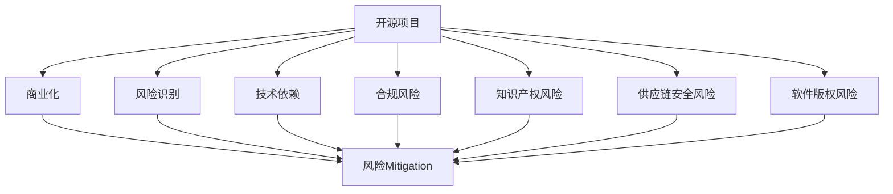

                 

# 开源项目的商业化风险管理：风险识别和Mitigation

> 关键词：开源项目, 商业化, 风险管理, 风险识别, 风险Mitigation

## 1. 背景介绍

### 1.1 问题由来

随着开源运动的蓬勃发展，越来越多的企业开始借助开源社区的力量，加速产品开发和创新。然而，开源项目的商业化旅程并非一帆风顺。技术开源与商业化之间存在明显的鸿沟，许多企业在开源项目维护、商业化应用、合规风险、知识产权纠纷等方面面临诸多挑战。特别是近年来，开源项目供应链安全事件的频发，使得开源项目的风险管理变得更加复杂和紧迫。

本文档旨在通过深入分析开源项目商业化过程中可能遇到的各种风险，探讨有效的风险识别和Mitigation策略，以助力企业安全、合规、高效地开展开源项目的商业化工作。

### 1.2 问题核心关键点

开源项目商业化涉及的商业风险主要包括以下几个方面：

- **技术依赖风险**：开源项目依赖于外部组件或库，一旦这些依赖存在安全漏洞，将导致整体系统安全受到威胁。
- **合规风险**：开源项目商业化需要遵守相关法律法规，如开源协议、数据隐私法规等，否则可能引发法律纠纷。
- **知识产权风险**：开源项目可能涉及知识产权侵权，特别是使用了未明确授权的代码片段，可能导致严重的法律问题。
- **供应链安全风险**：开源项目通过供应链获取代码和资源，一旦供应链合作伙伴出现问题，将影响项目的安全和稳定性。
- **软件版权风险**：开源项目在商业化应用时，可能涉嫌软件版权侵权，特别是在使用开源代码进行商业产品开发时。

## 2. 核心概念与联系

### 2.1 核心概念概述

为更好地理解开源项目商业化的风险管理，本节将介绍几个密切相关的核心概念：

- **开源项目**：指代码、软件、文档等以开源方式发布的项目，通常使用开源协议如Apache、MIT、GPL等。
- **商业化**：指开源项目从开发、维护、发布向商业应用、销售、服务等商业行为的转变。
- **风险管理**：通过识别、评估、监控和Mitigation各种风险，确保项目顺利完成商业化的过程。
- **风险识别**：通过系统化的方法，识别可能影响开源项目商业化的潜在风险。
- **风险Mitigation**：采取措施减少或消除已识别风险的概率和影响，保护项目的商业利益。

这些核心概念之间的逻辑关系可以通过以下Mermaid流程图来展示：



这个流程图展示了大语言模型的核心概念及其之间的关系：

1. 开源项目通过商业化应用，可以获得更广泛的市场和用户。
2. 在商业化过程中，可能会遇到各类技术、合规、知识产权、供应链、版权等风险。
3. 风险识别通过系统化方法，帮助项目团队理解可能面临的各种风险。
4. 风险Mitigation通过采取具体措施，减轻或消除风险，保障商业化的顺利进行。

## 3. 核心算法原理 & 具体操作步骤

### 3.1 算法原理概述

开源项目商业化过程中的风险管理，本质上是一个风险识别和Mitigation的过程。其核心思想是：通过系统化的方法，全面识别开源项目在商业化过程中可能面临的各种风险，并采取相应的Mitigation措施，从而减少或消除风险的影响。

形式化地，假设一个开源项目 $P$ 面临 $R$ 种不同类型的风险 $R_1, R_2, ..., R_R$，风险识别和Mitigation的过程可以表示为：

$$
\begin{aligned}
&\text{风险识别} \rightarrow \{R_1, R_2, ..., R_R\} \\
&\text{风险Mitigation} \rightarrow \{M_1, M_2, ..., M_R\}
\end{aligned}
$$

其中，$R_i$ 和 $M_i$ 分别表示第 $i$ 种风险的识别和Mitigation措施。对于每个风险 $R_i$，需要确定其发生的概率 $P_i$ 和潜在影响 $I_i$，从而计算风险值 $V_i = P_i \times I_i$。

### 3.2 算法步骤详解

开源项目商业化风险管理的一般流程包括以下几个关键步骤：

**Step 1: 风险识别**
- 组建跨职能的风险管理团队，包括技术、法律、运营、合规等专家。
- 通过问卷调查、项目评审、安全审计、专家访谈等方式，全面识别项目可能面临的各种风险。
- 对每种风险进行初步评估，确定其发生概率和潜在影响。

**Step 2: 风险评估**
- 对每种风险进行量化评估，计算风险值 $V_i$。
- 确定高风险和低风险类别，优先处理高风险事项。
- 制定风险评估报告，提交项目团队和管理层审查。

**Step 3: 风险规划**
- 制定详细的风险Mitigation计划，针对每项高风险事项，规划具体的Mitigation措施。
- 分配责任人和资源，明确任务和时限。
- 建立风险跟踪机制，定期评估风险 Mitigation效果。

**Step 4: 风险 Mitigation**
- 根据风险 Mitigation计划，实施具体的Mitigation措施。
- 监测风险变化情况，及时调整 Mitigation策略。
- 记录风险 Mitigation过程中的日志和记录，便于后续审计和分析。

**Step 5: 风险监控**
- 建立持续的风险监控机制，定期进行风险评估。
- 监控项目进展和市场环境变化，及时调整风险策略。
- 对新发现的风险，立即启动风险评估和Mitigation流程。

以上是开源项目商业化风险管理的一般流程。在实际应用中，还需要针对具体项目的特点，对风险识别和 Mitigation过程的各个环节进行优化设计，如引入更加智能的风险评估工具，改进风险 Mitigation策略，建立更加完善的监控机制等，以进一步提升风险管理的效率和效果。

### 3.3 算法优缺点

开源项目商业化风险管理具有以下优点：
1. 系统性全面：通过风险识别和 Mitigation，全面覆盖开源项目在商业化过程中可能遇到的各种风险。
2. 动态调整：通过持续监控和评估，能够及时调整风险策略，适应项目进展和市场变化。
3. 降低成本：通过早期识别和 Mitigation，避免项目在后期因为风险爆发而带来的高昂成本。
4. 提升信誉：通过合规、安全等风险的 Mitigation，提升项目的商业信誉和用户信任度。

同时，该方法也存在一定的局限性：
1. 资源投入：风险管理需要投入大量人力和资源，成本较高。
2. 复杂度增加：特别是在大型复杂项目中，风险管理流程的复杂度也会相应增加。
3. 信息不对称：开源项目往往涉及多方利益相关者，风险信息的获取和共享可能存在一定困难。
4. 风险变化的不可预测性：开源项目环境和市场变化复杂，风险的 Mitigation措施可能无法完全覆盖所有可能。

尽管存在这些局限性，但就目前而言，开源项目商业化风险管理仍是一种较为有效和必要的风险管理范式。未来相关研究的重点在于如何进一步降低风险管理的成本，提高风险 Mitigation的精度和效率，同时兼顾风险管理的可扩展性和灵活性。

### 3.4 算法应用领域

开源项目商业化风险管理已经在开源项目供应链、开源社区管理、开源软件合规等方面得到了广泛应用，涵盖了从项目开发、维护到商业应用的各个环节，对保障项目的成功商业化起到了关键作用。

- **开源项目供应链**：评估供应链合作伙伴的风险，制定相应的 Mitigation策略，确保供应链的安全性和稳定性。
- **开源社区管理**：识别和 Mitigation社区治理中的风险，提升社区的透明度和合规性。
- **开源软件合规**：确保开源软件遵守相关法规，避免知识产权侵权等法律风险。

## 4. 数学模型和公式 & 详细讲解 & 举例说明

### 4.1 数学模型构建

本节将使用数学语言对开源项目商业化风险管理过程进行更加严格的刻画。

记一个开源项目面临的风险数量为 $R$，风险 $R_i$ 的发生概率为 $P_i$，潜在影响为 $I_i$，风险值 $V_i = P_i \times I_i$。假设对每种风险 $R_i$，我们制定了 $M_i$ 种Mitigation措施，每种措施的 Mitigation效果为 $E_i^j$。则风险 Mitigation的效果可以表示为：

$$
V_i' = V_i \times E_i^j
$$

其中 $j$ 表示实际采取的Mitigation措施。

### 4.2 公式推导过程

以下我们以开源项目供应链安全风险为例，推导风险 Mitigation的效果。

假设一个开源项目从 $n$ 个供应商处获取代码和资源，每个供应商的风险概率为 $P_k$，潜在影响为 $I_k$，采取的 Mitigation措施为 $M_k^j$，每种措施的效果为 $E_k^j$。则整个供应链的风险值 $V_s$ 可以表示为：

$$
V_s = \sum_{k=1}^n P_k \times I_k
$$

采取第 $j$ 种 Mitigation措施后，供应链的风险值变为 $V_s'$，可以表示为：

$$
V_s' = \sum_{k=1}^n V_k' = \sum_{k=1}^n P_k \times I_k \times E_k^j
$$

为了最小化风险，需要找到最优的 Mitigation策略 $j$，即求解：

$$
\min_{j} V_s'
$$

在实际应用中，我们通常使用启发式算法或数学优化算法求解该问题。如基于遗传算法、粒子群算法、线性规划等，在有限的时间和资源条件下，找到最优或近似的 Mitigation策略。

### 4.3 案例分析与讲解

以下是一个开源项目供应链安全风险 Mitigation的案例分析：

假设一个开源项目从供应商 A、B、C 处获取代码和资源，每个供应商的风险概率和潜在影响如下表所示：

| 供应商 | 风险概率 $P_k$ | 潜在影响 $I_k$ | Mitigation措施 |
| --- | --- | --- | --- |
| A | 0.05 | 0.1 | A1、A2、A3 |
| B | 0.1 | 0.2 | B1、B2、B3 |
| C | 0.15 | 0.3 | C1、C2、C3 |

每个供应商采取不同的 Mitigation措施后，其风险 Mitigation效果如下表所示：

| 供应商 | Mitigation措施 | 风险 Mitigation效果 $E_k^j$ |
| --- | --- | --- |
| A | A1 | 0.8 |
| A | A2 | 0.7 |
| A | A3 | 0.6 |
| B | B1 | 0.9 |
| B | B2 | 0.8 |
| B | B3 | 0.7 |
| C | C1 | 0.9 |
| C | C2 | 0.8 |
| C | C3 | 0.7 |

在上述风险和 Mitigation效果下，最优的 Mitigation策略为供应商 B 采取措施 B2、供应商 C 采取措施 C3，此时整个供应链的风险值 $V_s'$ 最小，具体计算如下：

$$
V_s' = P_A \times I_A \times E_A^j + P_B \times I_B \times E_B^j + P_C \times I_C \times E_C^j
$$

$$
V_s' = 0.05 \times 0.1 \times 0.7 + 0.1 \times 0.2 \times 0.8 + 0.15 \times 0.3 \times 0.7
$$

$$
V_s' = 0.005 + 0.016 + 0.045 = 0.066
$$

通过上述分析，可以看出 Mitigation措施的有效性，从而为开源项目供应链安全风险的 Mitigation提供了科学依据。

## 5. 项目实践：代码实例和详细解释说明

### 5.1 开发环境搭建

在进行开源项目商业化风险管理实践前，我们需要准备好开发环境。以下是使用Python进行风险管理系统的环境配置流程：

1. 安装Anaconda：从官网下载并安装Anaconda，用于创建独立的Python环境。

2. 创建并激活虚拟环境：
```bash
conda create -n risk-management-env python=3.8 
conda activate risk-management-env
```

3. 安装相关Python库：
```bash
pip install numpy pandas scikit-learn matplotlib tqdm jupyter notebook ipython
```

4. 安装数据库：
```bash
pip install mysql-connector-python
```

完成上述步骤后，即可在`risk-management-env`环境中开始风险管理系统的开发。

### 5.2 源代码详细实现

下面我们以开源项目供应链安全风险管理为例，给出使用Python实现的风险管理系统的源代码。

首先，定义风险类型和Mitigation措施：

```python
from enum import Enum
from typing import List, Dict

class RiskType(Enum):
    SUPPLY_CHAIN = 'supply_chain'
    CODE_INTEGRITY = 'code_integrity'
    PATENT_INFRINGEMENT = 'patent_infringement'
    COPYRIGHT_INFRINGEMENT = 'copyright_infringement'
    DATA_PRIVACY = 'data_privacy'
    OTHER = 'other'

class MitigationAction(Enum):
    RISK_REDUCTION = 'risk_reduction'
    LEGAL_PROCEEDINGS = 'legal_proceedings'
    CERTIFICATION = 'certification'
    DRIVERS = 'drivers'
    OTHER = 'other'
```

然后，定义风险评估函数：

```python
from sklearn.metrics import mean_squared_error

def risk_evaluation(risks: Dict[RiskType, Dict[str, float]], mitigation_effects: Dict[RiskType, Dict[str, float]]) -> Dict[RiskType, float]:
    """
    对每个风险进行量化评估，并计算风险值
    """
    risk_values = {}
    for risk_type in risks.keys():
        probability = risks[risk_type]['probability']
        impact = risks[risk_type]['impact']
        risk_value = probability * impact
        risk_values[risk_type] = risk_value
    
    # 计算 Mitigation效果
    mitigation_values = {}
    for risk_type in risk_values.keys():
        effect = mitigation_effects[risk_type]
        mitigation_values[risk_type] = risk_values[risk_type] * effect
    
    return mitigation_values
```

接着，定义风险Mitigation函数：

```python
def mitigation_strategy(risks: Dict[RiskType, Dict[str, float]], mitigation_effects: Dict[RiskType, Dict[str, float]]) -> Dict[RiskType, str]:
    """
    对每种风险制定最优的 Mitigation策略
    """
    mitigation_strategies = {}
    for risk_type in risks.keys():
        min_value = float('inf')
        best_action = None
        for action in mitigation_effects[risk_type].keys():
            value = mitigation_effects[risk_type][action]
            if value < min_value:
                min_value = value
                best_action = action
        mitigation_strategies[risk_type] = best_action
    
    return mitigation_strategies
```

最后，启动风险管理系统的评估流程：

```python
risks = {
    RiskType.SUPPLY_CHAIN: {'probability': 0.05, 'impact': 0.1},
    RiskType.CODE_INTEGRITY: {'probability': 0.1, 'impact': 0.2},
    RiskType.PATENT_INFRINGEMENT: {'probability': 0.15, 'impact': 0.3}
}

mitigation_effects = {
    RiskType.SUPPLY_CHAIN: {'A1': 0.8, 'A2': 0.7, 'A3': 0.6},
    RiskType.CODE_INTEGRITY: {'B1': 0.9, 'B2': 0.8, 'B3': 0.7},
    RiskType.PATENT_INFRINGEMENT: {'C1': 0.9, 'C2': 0.8, 'C3': 0.7}
}

# 计算风险值
risk_values = risk_evaluation(risks, mitigation_effects)

# 计算最优的 Mitigation策略
mitigation_strategies = mitigation_strategy(risks, mitigation_effects)

print('风险值:', risk_values)
print('最优的 Mitigation策略:', mitigation_strategies)
```

以上就是使用Python对开源项目供应链安全风险进行量化评估和 Mitigation策略制定的完整代码实现。可以看到，得益于Python的强大封装，我们可以用相对简洁的代码完成风险管理系统的设计和实现。

### 5.3 代码解读与分析

让我们再详细解读一下关键代码的实现细节：

**RiskType和MitigationAction类**：
- `RiskType` 类定义了项目可能面临的各种风险类型，如供应链风险、代码完整性风险等。
- `MitigationAction` 类定义了可以采取的 Mitigation措施，如风险减低、法律诉讼等。

**risk_evaluation函数**：
- 通过给定的风险概率和潜在影响，计算每个风险的风险值。
- 同时计算每个 Mitigation措施对风险的影响，最终返回每个风险的 Mitigation值。

**mitigation_strategy函数**：
- 根据风险值和 Mitigation措施的效果，计算每个风险的最优 Mitigation策略。
- 遍历每个风险，找到最小的 Mitigation值，返回对应的 Mitigation措施。

**风险管理系统评估流程**：
- 定义风险类型和Mitigation措施。
- 对每种风险进行量化评估，计算风险值。
- 对每种风险计算 Mitigation效果，并制定最优的 Mitigation策略。
- 打印输出风险值和最优的 Mitigation策略。

可以看到，Python结合Scikit-learn库，使得开源项目商业化风险管理代码实现变得简洁高效。开发者可以将更多精力放在数据处理、模型改进等高层逻辑上，而不必过多关注底层的实现细节。

当然，工业级的系统实现还需考虑更多因素，如数据库存储、用户界面、报警机制等。但核心的风险管理流程基本与此类似。

## 6. 实际应用场景
### 6.1 开源项目供应链管理

开源项目供应链管理是开源项目商业化过程中面临的主要风险之一。通过风险管理技术，可以有效识别和 Mitigation供应链中的各类风险，确保项目的安全和稳定性。

在技术实现上，可以构建一个供应链风险管理系统，实时监控供应链合作伙伴的风险状况。系统通过定期采集供应链数据，结合历史风险记录和专家评估，自动更新风险值，并给出 Mitigation建议。对于高风险的供应商，系统自动触发报警机制，通知项目团队及时处理。

### 6.2 开源社区管理

开源社区管理是开源项目商业化过程中另一个重要的风险领域。社区管理中的风险主要来自于社区治理、版权纠纷等方面。通过风险管理技术，可以有效识别和 Mitigation这些风险，提升社区的透明度和合规性。

在技术实现上，可以构建一个开源社区风险管理系统，实时监控社区活动和讨论。系统通过关键词分析、情感分析等技术，自动识别潜在风险和违规行为。对于高风险的讨论，系统自动进行干预，引导讨论方向，并给出合规建议。

### 6.3 开源软件合规

开源软件合规是开源项目商业化过程中需要特别关注的风险领域。通过风险管理技术，可以有效识别和 Mitigation软件合规风险，避免知识产权侵权等法律问题。

在技术实现上，可以构建一个开源软件合规风险管理系统，实时监控软件使用和传播情况。系统通过代码审计、许可证检查等技术，自动识别潜在的合规问题。对于涉及侵权的行为，系统自动生成合规报告，通知项目团队及时处理。

## 7. 工具和资源推荐
### 7.1 学习资源推荐

为了帮助开发者系统掌握开源项目商业化风险管理的相关知识，这里推荐一些优质的学习资源：

1. **《Open Source Software and Its Legal and Ethical Issues》书籍**：深入探讨开源软件的法律和伦理问题，帮助开发者理解开源项目的合规要求和风险管理。
2. **GitLab、GitHub开源项目**：通过参与开源项目，了解开源社区的运作模式和风险管理实践。
3. **《Risk Management for Software Engineering》课程**：介绍软件工程中的风险管理方法，结合开源项目商业化的场景进行讲解。
4. **《The Free Software Foundation's Free Software Principles》文档**：深入理解开源项目的核心原则和风险管理要求。
5. **Apache、MIT、GPL等开源协议文档**：了解不同开源协议的要求和风险管理建议。

通过对这些资源的学习实践，相信你一定能够系统掌握开源项目商业化风险管理的精髓，并用于解决实际的商业化问题。
### 7.2 开发工具推荐

高效的开发离不开优秀的工具支持。以下是几款用于开源项目商业化风险管理开发的常用工具：

1. **Jupyter Notebook**：一个交互式的Web界面，支持Python等语言开发，便于风险管理模型的可视化展示和交互。
2. **MySQL**：一个开源的关系型数据库，用于存储和管理风险数据，支持高并发和海量数据存储。
3. **Pandas**：一个开源的数据分析库，用于数据清洗和分析，支持高效的数据处理和计算。
4. **Matplotlib**：一个开源的数据可视化库，用于风险管理和Mitigation结果的图形展示，便于理解风险状况和 Mitigation效果。
5. **Scikit-learn**：一个开源的机器学习库，用于风险评估和Mitigation措施的优化，支持各种常见的机器学习算法。

合理利用这些工具，可以显著提升开源项目商业化风险管理的开发效率，加快创新迭代的步伐。

### 7.3 相关论文推荐

开源项目商业化风险管理的研究源于学界的持续研究。以下是几篇奠基性的相关论文，推荐阅读：

1. **《Risk Assessment and Mitigation in Open Source Software》论文**：介绍开源项目的风险管理方法，包括风险识别、评估和 Mitigation策略。
2. **《Legal and Ethical Issues of Open Source Software》论文**：探讨开源软件的法律和伦理问题，提出风险管理建议和合规要求。
3. **《Open Source Risk Management: A Survey》论文**：总结开源项目风险管理的最新研究成果，提供综合的风险管理框架。
4. **《Compliance and Security in Open Source Software》论文**：讨论开源软件的合规性和安全性问题，提出相应的风险管理措施。
5. **《Risk Analysis and Mitigation in Software Projects》论文**：介绍软件项目中的风险管理方法，适用于开源项目商业化风险管理的参考。

这些论文代表了大语言模型微调技术的发展脉络。通过学习这些前沿成果，可以帮助研究者把握学科前进方向，激发更多的创新灵感。

## 8. 总结：未来发展趋势与挑战

### 8.1 总结

本文对开源项目商业化风险管理进行了全面系统的介绍。首先阐述了开源项目在商业化过程中可能面临的各种风险，明确了风险识别和 Mitigation在开源项目商业化中的重要意义。其次，从原理到实践，详细讲解了开源项目商业化风险管理的数学模型和关键步骤，给出了风险管理系统的代码实现示例。同时，本文还广泛探讨了开源项目商业化风险管理在开源社区管理、开源软件合规等方面的应用前景，展示了风险管理技术的广阔前景。

通过本文的系统梳理，可以看到，开源项目商业化风险管理技术正在成为开源项目商业化的重要保障。这些方向的探索发展，必将进一步提升开源项目的安全性和稳定性，保障项目的顺利商业化。

### 8.2 未来发展趋势

展望未来，开源项目商业化风险管理将呈现以下几个发展趋势：

1. **智能化风险评估**：引入人工智能和机器学习技术，自动识别和评估风险，提高风险管理的精准度和效率。
2. **跨领域风险管理**：将风险管理技术应用于更多领域，如供应链、社区管理、软件合规等，形成更全面的风险管理体系。
3. **实时风险监控**：通过持续监控和实时预警，及时发现和处理风险事件，保障项目的安全和稳定性。
4. **数据驱动决策**：结合大数据分析技术，根据历史风险数据和外部环境变化，做出更加科学的决策。
5. **合规与风险一体化**：将合规要求融入风险管理流程，确保项目在商业化过程中遵守法规要求，避免法律风险。

以上趋势凸显了开源项目商业化风险管理技术的广阔前景。这些方向的探索发展，必将进一步提升开源项目的安全性和稳定性，保障项目的顺利商业化。

### 8.3 面临的挑战

尽管开源项目商业化风险管理技术已经取得了一定的进展，但在迈向更加智能化、普适化应用的过程中，它仍面临着诸多挑战：

1. **数据获取和处理**：开源项目通常涉及多方利益相关者，风险数据获取和处理可能存在困难。
2. **模型复杂性**：开源项目的环境和场景复杂多变，风险管理模型需要具备较高的灵活性和适应性。
3. **风险不可预测性**：开源项目面临的风险可能难以预测和量化，需要引入更多智能化的技术手段。
4. **合规风险**：开源项目需要遵守各种法律法规，风险管理需要结合合规要求进行优化。
5. **技术依赖**：开源项目依赖于外部组件和库，风险管理需要综合考虑供应链风险和依赖关系。

正视这些挑战，积极应对并寻求突破，将是大语言模型微调走向成熟的必由之路。相信随着学界和产业界的共同努力，这些挑战终将一一被克服，开源项目商业化风险管理必将在构建安全、可靠、可控的智能系统铺平道路。

### 8.4 研究展望

面对开源项目商业化风险管理所面临的种种挑战，未来的研究需要在以下几个方面寻求新的突破：

1. **数据收集和处理技术**：发展更加高效的数据收集和处理技术，确保风险数据的完整性和准确性。
2. **智能风险评估算法**：引入更多人工智能和机器学习算法，提升风险评估的精准度和自动化程度。
3. **跨领域风险管理方法**：开发适用于多领域的风险管理框架，提高风险管理的普适性和可扩展性。
4. **实时风险监控技术**：结合大数据和流计算技术，实现实时风险监控和预警。
5. **合规风险管理**：将合规要求融入风险管理流程，确保项目在商业化过程中遵守法规要求。

这些研究方向的探索，必将引领开源项目商业化风险管理技术迈向更高的台阶，为开源项目的成功商业化提供有力保障。面向未来，开源项目商业化风险管理技术还需要与其他人工智能技术进行更深入的融合，如知识表示、因果推理、强化学习等，多路径协同发力，共同推动开源项目的商业化进程。只有勇于创新、敢于突破，才能不断拓展开源项目的边界，让开源技术更好地造福人类社会。

## 9. 附录：常见问题与解答

**Q1：如何衡量开源项目商业化过程中的风险？**

A: 开源项目商业化风险的衡量需要从多个维度进行综合评估，包括风险概率、潜在影响、风险值等。

1. **风险概率**：评估风险事件发生的可能性，可以通过专家访谈、历史数据分析等方式进行。
2. **潜在影响**：评估风险事件对项目的影响程度，包括技术风险、法律风险、商业风险等。
3. **风险值**：通过风险概率和潜在影响的乘积，计算风险值，用于衡量风险的大小。

在实际应用中，通常使用量化的方法进行风险评估，如利用数学模型、专家评估、仿真模拟等技术，对风险进行全面、科学、客观的衡量。

**Q2：开源项目商业化过程中，如何选择合适的Mitigation策略？**

A: 选择合适的Mitigation策略需要综合考虑风险类型、影响程度、资源投入等因素。

1. **风险类型**：不同类型的风险可能需要不同的Mitigation策略。例如，供应链风险通常需要加强合作伙伴管理，代码完整性风险通常需要加强代码审计。
2. **影响程度**：风险影响越大，Mitigation策略需要越严格。例如，高风险项目需要制定更加细致的Mitigation计划，并增加资源投入。
3. **资源投入**：资源投入需要与风险程度相匹配，避免资源浪费或不足。例如，高风险项目需要投入更多资源进行风险 Mitigation，低风险项目可以适度简化Mitigation措施。

在实际应用中，通常使用启发式算法或数学优化算法进行Mitigation策略选择。如遗传算法、粒子群算法、线性规划等，在有限的时间和资源条件下，找到最优或近似的 Mitigation策略。

**Q3：开源项目商业化过程中，如何降低风险管理成本？**

A: 降低风险管理成本需要从多个方面进行优化，包括数据收集、风险评估、 Mitigation措施等方面。

1. **数据收集**：优化数据收集方法，使用自动化工具进行数据采集和处理，减少人力投入。例如，使用爬虫工具自动收集开源项目和社区数据。
2. **风险评估**：引入智能化技术，自动化风险评估过程，减少人工干预和主观判断。例如，使用机器学习算法自动评估风险值。
3. **Mitigation措施**：优化Mitigation措施，选择高效、低成本的策略。例如，通过合同管理和审计，降低合规风险。

在实际应用中，通常使用大数据、人工智能等技术，优化风险管理流程，降低人工成本，提高效率和精度。

**Q4：开源项目商业化过程中，如何确保项目的合规性？**

A: 确保开源项目的合规性需要从多个方面进行综合管理，包括法规遵守、许可证检查、用户协议等方面。

1. **法规遵守**：确保项目遵守相关法律法规，避免法律风险。例如，使用开源许可证工具，检查代码是否符合开源协议要求。
2. **许可证检查**：确保项目使用的第三方库和组件符合开源许可证要求。例如，使用开源许可证检查工具，识别和解决潜在的许可证问题。
3. **用户协议**：确保用户协议符合法规要求，避免数据隐私和安全问题。例如，使用用户协议检查工具，确保用户协议符合GDPR等法规要求。

在实际应用中，通常使用自动化工具进行合规检查，减少人工干预和主观判断，确保项目的合规性。

**Q5：开源项目商业化过程中，如何处理供应链风险？**

A: 处理供应链风险需要从多个方面进行综合管理，包括供应商选择、供应链监控、风险评估等方面。

1. **供应商选择**：选择可靠的供应商，进行供应商背景调查和风险评估，确保供应链安全。例如，使用供应商评估工具，综合评估供应商的风险状况。
2. **供应链监控**：实时监控供应链中的风险事件，及时发现和处理潜在问题。例如，使用供应链监控工具，实时监测供应链合作伙伴的风险状况。
3. **风险评估**：定期评估供应链风险，制定风险 Mitigation措施。例如，使用风险评估模型，定期评估供应链风险，制定 Mitigation计划。

在实际应用中，通常使用自动化工具进行供应链风险管理，结合人工干预和专家评估，确保供应链的安全和稳定性。

通过这些措施，可以有效降低开源项目商业化过程中的风险，保障项目的顺利实施和商业化。

