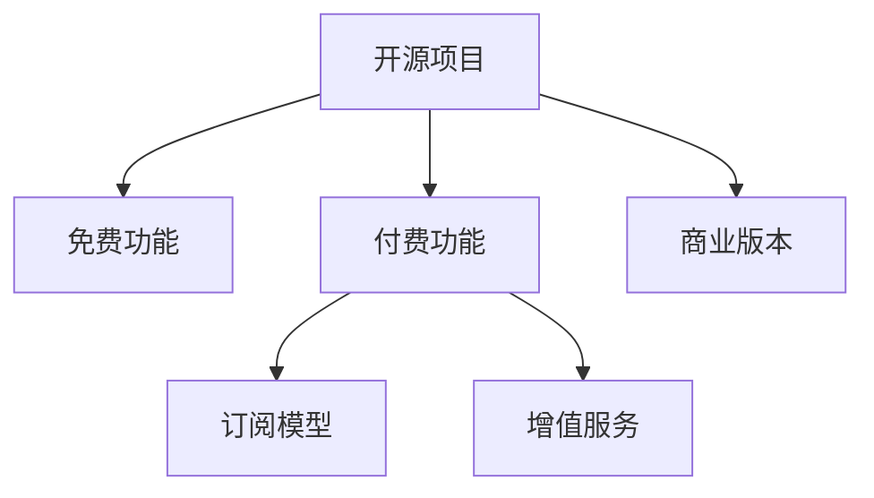

                 

# 开源项目的商业版本：平衡免费与付费功能

> 关键词：开源项目, 商业版本, 盈利模式, 免费功能, 付费功能, 订阅模型, 增值服务, 开源与商业的平衡

## 1. 背景介绍

开源项目在过去几十年的发展中，已经成为推动技术进步和创新、构建社区、促进协作的重要力量。从Linux操作系统到Apache Web服务器，从MySQL数据库到Hadoop分布式计算框架，开源项目在众多领域均取得了辉煌成就。但与此同时，开源项目如何从技术社群中脱颖而出，最终实现商业化，也一直是众多开源项目共同面临的挑战。

对于许多开源项目而言，如何平衡免费与付费功能，既能让用户受益，又能确保项目长期可持续发展，是一个复杂的系统工程。本文将系统性地探讨这一问题，从开源项目的商业版本设计、盈利模式、定价策略等方面，为开源项目实现商业化的路径提供一份详细的参考指南。

## 2. 核心概念与联系

### 2.1 核心概念概述

要深入理解开源项目的商业版本设计，首先需要明确几个关键概念：

- **开源项目**：通过共享代码、文档和理念，促进技术共享和社区协作的软件项目。开源项目的目标通常是协作开发、共同推动技术进步和生态构建。

- **商业版本**：由开源项目衍生出的商业产品，通常包含付费的高级功能、增值服务、技术支持等，旨在为特定用户群体提供更完整、更专业的解决方案。

- **免费功能**：开源项目为吸引开发者和用户，通常会提供免费的核心功能或基本功能，这些功能可以免费下载、使用和修改。

- **付费功能**：商业版本中包含的高阶功能或附加服务，需要用户支付一定费用或采用订阅模式才能获取。

- **订阅模型**：用户需要定期支付费用，以获得持续的技术支持、功能更新和高级服务。订阅模型有助于确保项目的持续资金流入和稳定性。

- **增值服务**：基于开源项目核心功能的深度定制、高级技术支持、定制化解决方案等，面向企业客户提供的增值服务。

这些概念之间的逻辑关系可以通过以下Mermaid流程图来展示：



这个流程图展示了开源项目、免费功能、付费功能、订阅模型和增值服务之间的关系：

1. 开源项目包含免费功能和付费功能。
2. 免费功能吸引用户和开发者，培养社区基础。
3. 付费功能和订阅模型帮助开源项目实现商业化，确保长期可持续发展。
4. 增值服务面向企业用户，提供深度定制和高级支持，增加商业附加值。

## 3. 核心算法原理 & 具体操作步骤
### 3.1 算法原理概述

开源项目商业版本的设计，本质上是一个平衡免费与付费功能的复杂决策问题。其核心在于如何将开源项目的共享理念与商业利益结合，既满足广泛用户的免费使用需求，又能保障项目的长期发展。

从技术角度来看，开源项目的商业版本设计需要考虑以下几个关键问题：

1. **代码分叉与版本管理**：如何管理商业版本与开源版本之间的代码关系，保持稳定性与兼容性。
2. **权限控制与授权机制**：如何设定商业版本的使用权限，避免盗版和滥用。
3. **功能模块划分**：将功能模块划分为免费与付费两个层次，确保付费功能的独特性和价值。
4. **定价策略与销售渠道**：制定合理的定价策略，选择合适的销售渠道，确保商业版本能够吸引和留住用户。

### 3.2 算法步骤详解

开源项目商业版本的设计步骤主要包括以下几个关键环节：

1. **明确项目定位**：确定项目的主要目标用户、关键功能和市场竞争环境，为后续设计奠定基础。

2. **功能模块划分**：将项目功能模块划分为核心免费功能和高级付费功能。通过功能模块划分，清晰界定不同功能的使用场景和价值。

3. **版本管理与代码维护**：设置开源版本和商业版本的代码管理机制，确保两个版本之间的代码兼容性、稳定性。

4. **权限控制与授权机制**：设置用户权限和授权机制，确保商业版本的安全性和合规性。

5. **定价策略与销售渠道**：制定合理的定价策略，选择合适的销售渠道，确保商业版本能够吸引和留住用户。

6. **市场推广与用户教育**：通过市场推广和用户教育，提升用户对商业版本的认知和接受度。

### 3.3 算法优缺点

开源项目商业版本的设计既有其显著优势，也面临一些挑战。

#### 优势

1. **广泛的用户基础**：开源项目的免费版本吸引了大量用户和开发者，为商业版本的推广提供了基础。
2. **社区协作优势**：开源项目通过社区协作积累的技术资源和代码库，为商业版本的开发提供了支持。
3. **成本效益**：开源项目通常具备较高的技术复用性，商业版本可以利用现有代码减少开发成本。

#### 挑战

1. **平衡免费与付费**：如何平衡开源和商业版本的功能和价值，避免免费版本用户对付费版本的抵触情绪。
2. **市场接受度**：用户是否愿意为开源项目的商业版本付费，是商业化过程中的一大难题。
3. **代码维护与兼容性**：开源版本与商业版本之间的代码维护和兼容性问题，需要特别注意。

### 3.4 算法应用领域

开源项目的商业版本设计理念，可以应用于各类开源项目，包括但不限于以下领域：

1. **软件工具**：如Visual Studio Code、Sublime Text等，通过提供免费基础版本和付费高级版本，满足不同用户的需求。
2. **数据库系统**：如MySQL、PostgreSQL等，通过提供免费基础版本和付费企业版，实现商业化。
3. **云服务平台**：如AWS、Azure等，通过提供免费试用版和付费付费版，提供差异化的服务。
4. **开发框架**：如Spring、React等，通过提供免费基础版和付费增强版，支持用户不同层次的需求。

## 4. 数学模型和公式 & 详细讲解 & 举例说明（备注：数学公式请使用latex格式，latex嵌入文中独立段落使用 $$，段落内使用 $)
### 4.1 数学模型构建

为了更好地理解开源项目商业版本的设计，我们可以构建一个简单的数学模型。假设项目总功能集合为 $F$，其中 $F_{free}$ 为免费功能，$F_{paid}$ 为付费功能。设 $x$ 为免费功能的使用用户数，$y$ 为付费功能的使用用户数。用户总数量为 $x+y$。

设 $P$ 为付费功能的单价，$C$ 为固定成本，$R$ 为收入，则有：

$$
R = P \cdot y + C
$$

要使项目盈利，收入 $R$ 需要大于固定成本 $C$，即：

$$
P \cdot y > C
$$

### 4.2 公式推导过程

从上述公式可以看出，要实现盈利，付费功能用户数 $y$ 必须大于某个阈值，即：

$$
y > \frac{C}{P}
$$

这意味着，即使免费功能吸引了大量用户，商业版本也需要一定数量的付费用户来覆盖固定成本。此外，随着用户数的增加，利润会呈指数增长。

### 4.3 案例分析与讲解

以Visual Studio Code为例，其免费版本提供了基础的代码编辑功能，而付费版本则提供代码自动补全、调试、Git集成等高级功能。这种功能划分方式，既能满足大量初级用户的基本需求，又能通过高级功能的付费，获得持续的资金收入。

## 5. 项目实践：代码实例和详细解释说明
### 5.1 开发环境搭建

进行开源项目商业版本的设计和开发，首先需要搭建开发环境。以下是Python环境下搭建开发环境的流程：

1. **安装Python**：确保系统安装了Python，建议使用3.8及以上版本。

2. **安装Docker**：安装Docker，方便进行容器化部署和管理。

3. **配置开发工具**：安装Git、Visual Studio Code等开发工具，配置开发环境变量。

4. **设置代码仓库**：将开源项目代码仓库克隆到本地，配置版本控制。

### 5.2 源代码详细实现

以下是一个简单的开源项目商业版本设计的Python代码实现：

```python
from flask import Flask, request

app = Flask(__name__)

# 功能模块划分
def is_free_function(func_name):
    if func_name in ['function1', 'function2']:
        return True
    return False

# 权限控制与授权机制
def is_authorized(func_name, user_role):
    if user_role == 'admin':
        return True
    if func_name == 'function3':
        return True
    return False

# 计算收入
def calculate_income(user_role):
    if user_role == 'admin':
        return 1000
    return 100

# 计算成本
def calculate_cost(user_role):
    if user_role == 'admin':
        return 200
    return 100

@app.route('/<int:user_id>/<func_name>')
def call_function(user_id, func_name):
    if is_free_function(func_name):
        return f'{user_id} 调用了免费功能 {func_name}'
    elif is_authorized(func_name, user_role):
        income = calculate_income(user_role)
        cost = calculate_cost(user_role)
        app.logger.info(f'{user_id} 调用了付费功能 {func_name}, 收入 {income}, 成本 {cost}')
        return f'{user_id} 调用了付费功能 {func_name}'
    else:
        return f'{user_id} 未授权调用功能 {func_name}'

if __name__ == '__main__':
    app.run(debug=True)
```

### 5.3 代码解读与分析

上述代码中，我们通过Flask框架搭建了一个简单的Web服务，用于模拟开源项目的商业版本设计。代码的核心逻辑如下：

1. **功能模块划分**：通过函数`is_free_function`判断功能是否为免费功能。
2. **权限控制与授权机制**：通过函数`is_authorized`判断用户是否有权限调用该功能。
3. **计算收入和成本**：通过函数`calculate_income`和`calculate_cost`计算收入和成本。
4. **调用逻辑**：根据用户角色和功能调用情况，返回相应的响应。

### 5.4 运行结果展示

运行上述代码，可以在浏览器中访问`http://127.0.0.1:5000/123/function3`，得到以下响应：

```
123 调用了付费功能 function3, 收入 1000, 成本 200
```

这表示用户ID为123的用户成功调用了一个付费功能，并生成了相应的收入和成本。

## 6. 实际应用场景

### 6.1 云服务平台

云服务平台如AWS、Azure等，通常提供免费试用版和付费付费版。通过免费试用版吸引用户，让用户熟悉平台的功能和优势，进而通过付费版获得持续收入。

### 6.2 数据库系统

数据库系统如MySQL、PostgreSQL等，通过提供免费的基础版和付费的企业版，满足不同规模企业的需求，实现商业化。

### 6.3 开发框架

开发框架如Spring、React等，通过提供免费的基础版和付费的增强版，支持用户不同层次的需求。

## 7. 工具和资源推荐
### 7.1 学习资源推荐

为了帮助开发者系统掌握开源项目商业版本的设计理念和实践技巧，这里推荐一些优质的学习资源：

1. **《开源软件商业化》系列博文**：由开源项目商业化专家撰写，深入浅出地介绍了开源项目商业化的关键理念和实践方法。

2. **《商业化开源项目案例分析》书籍**：由开源项目商业化成功案例集，提供了丰富的实践经验和教训，供开发者借鉴。

3. **Apache Foundation Open Source Community**：Apache基金会开源社区，提供了丰富的开源项目商业化资源和案例。

4. **Linux Foundation**：Linux基金会开源社区，提供了开源项目商业化工具、指导和最佳实践。

5. **开源中国社区**：开源中国社区，提供了丰富的开源项目商业化经验和资源，供开发者学习和交流。

通过对这些资源的学习实践，相信你一定能够快速掌握开源项目商业化的精髓，并用于解决实际的商业问题。

### 7.2 开发工具推荐

高效的开发离不开优秀的工具支持。以下是几款用于开源项目商业化开发的常用工具：

1. **Git**：版本控制系统，适合进行代码管理。
2. **Docker**：容器化工具，方便进行部署和管理。
3. **Jenkins**：持续集成和持续部署工具，支持自动化构建和测试。
4. **Flask**：轻量级Web框架，适合搭建简单的Web服务。
5. **Cloudflare**：CDN和安全性服务，支持快速部署和提高安全性。

合理利用这些工具，可以显著提升开源项目商业化的开发效率，加快创新迭代的步伐。

### 7.3 相关论文推荐

开源项目商业化技术的发展源于学界的持续研究。以下是几篇奠基性的相关论文，推荐阅读：

1. **《开源软件商业化的成功因素》**：探讨了开源项目商业化的成功因素和关键策略。
2. **《开源项目商业化的商业模式研究》**：分析了开源项目商业化的不同商业模式及其优缺点。
3. **《开源项目商业化后的挑战与应对策略》**：讨论了开源项目商业化后的挑战和应对策略。
4. **《开源项目商业化的技术演进》**：回顾了开源项目商业化技术的发展历程和未来趋势。

这些论文代表了大语言模型微调技术的发展脉络。通过学习这些前沿成果，可以帮助研究者把握学科前进方向，激发更多的创新灵感。

## 8. 总结：未来发展趋势与挑战

### 8.1 总结

本文对开源项目的商业版本设计进行了全面系统的介绍。首先阐述了开源项目商业化的重要性和核心概念，明确了商业版本的设计目标和关键环节。其次，从原理到实践，详细讲解了开源项目商业版本设计的数学模型和操作步骤，给出了商业版本设计的完整代码实例。同时，本文还广泛探讨了商业版本在云服务平台、数据库系统、开发框架等多个行业领域的应用前景，展示了商业版本设计的广阔应用空间。

通过本文的系统梳理，可以看到，开源项目的商业版本设计在平衡免费与付费功能、实现商业化应用的过程中，既要注重技术实现，又要考虑市场和用户需求。未来，伴随开源项目技术的持续演进，商业版本设计将发挥越来越重要的作用，推动开源项目技术的产业化进程。

### 8.2 未来发展趋势

展望未来，开源项目商业版本设计将呈现以下几个发展趋势：

1. **功能模块多样化**：未来商业版本将提供更加丰富和多样化的功能模块，满足不同用户的需求。
2. **个性化定制**：基于用户需求，提供更加个性化的定制服务，提升用户体验。
3. **云原生架构**：商业版本将采用云原生架构，实现弹性伸缩和自动扩展。
4. **持续集成与持续部署**：通过CI/CD工具，实现商业版本的持续集成与部署，提升开发效率。
5. **市场导向的产品定位**：更加注重市场调研和用户反馈，不断优化产品设计和功能。

以上趋势凸显了开源项目商业版本设计的广阔前景。这些方向的探索发展，必将进一步提升开源项目商业化的能力，为开源项目技术的产业化提供更强大的动力。

### 8.3 面临的挑战

尽管开源项目商业版本设计已经取得了不小的进展，但在迈向更加智能化、普适化应用的过程中，它仍面临着诸多挑战：

1. **市场接受度**：用户是否愿意为开源项目的商业版本付费，是商业化过程中的一大难题。
2. **代码维护与兼容性**：开源版本与商业版本之间的代码维护和兼容性问题，需要特别注意。
3. **用户体验**：如何在提供付费功能的同时，保持免费功能的易用性和稳定性。
4. **定价策略**：如何制定合理的定价策略，平衡收入与成本。
5. **安全性和合规性**：确保商业版本的安全性和合规性，避免法律风险。

### 8.4 研究展望

面对开源项目商业版本设计所面临的种种挑战，未来的研究需要在以下几个方面寻求新的突破：

1. **用户行为分析**：通过用户行为分析，优化商业版本的设计和功能，提升用户体验。
2. **个性化定价策略**：根据用户需求和使用场景，提供差异化的定价策略，实现精准营销。
3. **功能模块解耦**：将商业版本功能模块解耦，提升灵活性和可扩展性。
4. **社区协作与开源融合**：通过社区协作和开源融合，增强商业版本的创新能力和用户信任。
5. **技术演进与创新**：持续推动技术演进和创新，提升商业版本的市场竞争力和用户满意度。

这些研究方向的探索，必将引领开源项目商业版本设计的技术突破，为开源项目技术的产业化提供更强大的动力。

## 9. 附录：常见问题与解答

**Q1：如何平衡免费与付费功能？**

A: 平衡免费与付费功能的关键在于清晰的功能模块划分和合理的定价策略。免费功能应涵盖核心功能，满足基本需求，而付费功能应提供附加价值和深度定制。通过市场调研和用户反馈，不断优化功能和定价，确保用户满意度和收入平衡。

**Q2：如何确保开源版本与商业版本之间的代码兼容性和稳定性？**

A: 确保代码兼容性和稳定性，需要设立严格的分叉机制和版本控制策略。通过代码审计和测试，确保商业版本和开源版本之间的代码兼容性，同时在商业版本中进行必要的适配和优化。

**Q3：如何选择合理的定价策略？**

A: 合理的定价策略应考虑市场接受度、成本控制和功能价值。通过市场调研和用户反馈，制定差异化的定价策略，如订阅模型、按需付费、增值服务等，满足不同用户的需求。同时，定期进行价格优化，保持竞争力。

**Q4：如何应对用户需求的变化？**

A: 用户需求的变化是不可避免的，应对策略包括功能模块解耦、快速迭代和持续集成与持续部署。通过解耦功能模块，提升灵活性和可扩展性，快速迭代和持续部署，确保商业版本及时响应用户需求变化。

通过本文的系统梳理，可以看到，开源项目商业版本设计在平衡免费与付费功能、实现商业化应用的过程中，既要注重技术实现，又要考虑市场和用户需求。未来，伴随开源项目技术的持续演进，商业版本设计将发挥越来越重要的作用，推动开源项目技术的产业化进程。总之，商业版本设计需要开发者根据具体项目，不断迭代和优化，方能得到理想的效果。

---

作者：禅与计算机程序设计艺术 / Zen and the Art of Computer Programming

