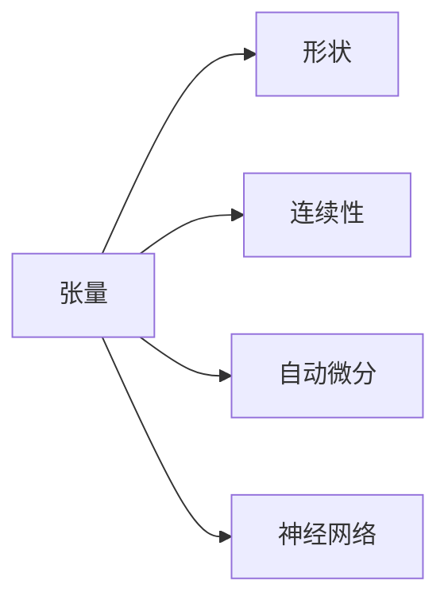

                 

# 张量形状和连续性：深度学习的基础

> 关键词：张量(Tensor),形状(Shape),连续性(Continuity),深度学习(Deep Learning),自动微分(Automatic Differentiation),神经网络(Neural Network)

## 1. 背景介绍

深度学习是当前人工智能领域的核心技术之一，其背后的数学和计算基础，特别是张量和连续性原理，对于理解深度学习模型和算法至关重要。本文章将系统介绍深度学习中张量和连续性的基本概念、数学模型及其实际应用。通过掌握这些核心知识，读者能够更加深入地理解深度学习模型的工作原理和优化算法，为后续的模型构建和算法改进打下坚实的基础。

### 1.1 张量的概念和应用

在深度学习中，张量(Tensor)是一种多维数组，用来表示数据的结构化形式。张量可以表示任意维度的数据结构，从一维的标量(Scalar)到多维的向量(Vector)和矩阵(Matrix)，再到高维的超矩阵(Hypermatrix)。张量的多维特性使其能够灵活地表达复杂的特征空间，是深度学习模型的基础。

张量的应用广泛，例如：
- **卷积神经网络**中，卷积层的操作本质上就是对张量的卷积运算。
- **循环神经网络**中，时间步上的信息通过张量的序列扩展得以保留和传递。
- **图神经网络**中，节点和边上的特征通过张量的矩阵表示进行聚合。

### 1.2 张量的形状和维度

张量的形状(Shape)指的是张量的维度和每个维度的大小，例如：一个$2\times3\times4$的张量，表示它有三个维度，分别是2、3、4，形状为$(2,3,4)$。张量的形状决定了其计算和操作的方式，对于理解深度学习模型的计算过程至关重要。

## 2. 核心概念与联系

### 2.1 核心概念概述

为了更好地理解深度学习的核心概念，本节将介绍几个关键概念及其相互关系：

- **张量**：用于表示数据的多维数组，深度学习模型的基本数据结构。
- **形状**：张量的维度和大小，定义了其计算和操作的方式。
- **连续性**：数据在不同维度上的连续性，影响着模型在多尺度上的学习能力和泛化性能。
- **自动微分**：深度学习模型中用于高效计算梯度的技术，是训练模型的关键。
- **神经网络**：由大量神经元组成的计算图，用于逼近复杂的非线性函数。

这些概念之间的关系可以通过以下Mermaid流程图来展示：



这个流程图展示了张量、形状、连续性、自动微分和神经网络之间的联系：

1. 张量是深度学习模型中的基础数据结构。
2. 形状定义了张量的维度和大小，决定其计算和操作方式。
3. 连续性影响了模型在多尺度上的学习能力。
4. 自动微分用于高效计算梯度，训练神经网络。
5. 神经网络由大量神经元组成，用于逼近复杂函数。

## 3. 核心算法原理 & 具体操作步骤

### 3.1 算法原理概述

深度学习中的张量和连续性原理，主要体现在以下几个方面：

- **数据表示**：张量提供了灵活的数据表示形式，支持从标量到高维数据的表示。
- **模型结构**：神经网络通过张量形式的权重和偏置参数进行定义。
- **计算过程**：深度学习模型的前向传播和反向传播过程，本质上是对张量的连续运算。
- **梯度计算**：自动微分技术使得深度学习模型能够高效计算梯度，进行参数更新。

### 3.2 算法步骤详解

#### 3.2.1 数据准备

- **数据集划分**：将数据集划分为训练集、验证集和测试集。训练集用于模型训练，验证集用于参数调优，测试集用于最终模型评估。
- **数据预处理**：对数据进行标准化、归一化、张量编码等预处理操作。

#### 3.2.2 模型构建

- **网络层设计**：设计神经网络的层级结构，包括卷积层、池化层、全连接层等。
- **激活函数选择**：选择激活函数（如ReLU、Sigmoid等），影响模型的非线性逼近能力。
- **损失函数定义**：根据任务类型定义合适的损失函数（如交叉熵、均方误差等）。

#### 3.2.3 模型训练

- **前向传播**：通过张量的连续运算，计算模型的预测输出。
- **反向传播**：通过自动微分技术，计算模型参数的梯度。
- **参数更新**：使用梯度下降等优化算法，更新模型参数。

#### 3.2.4 模型评估

- **验证集验证**：在验证集上评估模型性能，调整模型参数。
- **测试集测试**：在测试集上评估模型泛化性能。

### 3.3 算法优缺点

#### 3.3.1 优点

- **灵活性**：张量支持任意维度的数据表示，提供了极大的灵活性。
- **计算效率**：自动微分技术高效计算梯度，加速模型训练。
- **泛化性能**：连续性原理使得模型能够学习到不同尺度上的特征。

#### 3.3.2 缺点

- **计算资源需求高**：张量和自动微分需要较大的计算资源，对硬件要求较高。
- **模型复杂性**：复杂的模型结构可能导致梯度消失或爆炸问题。
- **参数调整困难**：模型参数较多，调试和优化难度较大。

### 3.4 算法应用领域

深度学习的张量和连续性原理在多个领域中得到了广泛应用，例如：

- **计算机视觉**：卷积神经网络利用张量卷积运算提取图像特征。
- **自然语言处理**：循环神经网络利用张量序列扩展处理文本数据。
- **语音识别**：卷积神经网络和循环神经网络结合，用于语音特征提取和处理。
- **推荐系统**：神经网络模型用于用户行为预测和商品推荐。
- **强化学习**：连续性原理使得模型能够学习到连续的动作空间。

## 4. 数学模型和公式 & 详细讲解 & 举例说明

### 4.1 数学模型构建

深度学习中的数学模型主要涉及张量和矩阵的线性代数运算，以及通过自动微分技术计算梯度。以下是一些常见的数学模型：

- **矩阵乘法**：两个矩阵的乘积定义为行数和列数相乘的矩阵。例如：$A_{m\times n}B_{n\times p}=C_{m\times p}$。
- **向量内积**：两个向量的点积定义为它们的长度乘以它们之间的夹角的余弦值。例如：$A_{m\times1}B_{1\times n}=C_{m\times n}$。
- **矩阵转置**：矩阵的转置是将其行列互换的操作。例如：$A_{m\times n}^T$。
- **矩阵逆**：矩阵的逆是其自身的逆运算。例如：$A_{m\times n}^{-1}$。

### 4.2 公式推导过程

#### 4.2.1 矩阵乘法的推导

矩阵乘法的定义如下：

$$
C_{ij} = \sum_k A_{ik}B_{kj}
$$

其中，$A$ 和 $B$ 分别是两个矩阵，$C$ 是它们的乘积。推导过程如下：

将 $A$ 和 $B$ 分别展开为行向量和列向量，有：

$$
C_{ij} = \sum_k \left(\sum_l A_{il}B_{lj}\right) = \sum_k \left(\sum_l A_{il}B_{lj}\right) = \sum_k \left(\sum_l A_{il}B_{lj}\right)
$$

因此，矩阵乘法可以表示为连续性运算的组合。

#### 4.2.2 向量内积的推导

向量内积的定义如下：

$$
A \cdot B = \sum_i A_iB_i
$$

其中，$A$ 和 $B$ 是两个向量。推导过程如下：

将 $A$ 和 $B$ 分别展开为标量，有：

$$
A \cdot B = \sum_i \left(\sum_j A_{ij}\right)B_j = \sum_i \left(\sum_j A_{ij}\right)B_j = \sum_i \left(\sum_j A_{ij}\right)B_j
$$

因此，向量内积可以表示为连续性运算的组合。

### 4.3 案例分析与讲解

#### 4.3.1 卷积神经网络的卷积操作

卷积神经网络中的卷积操作是对张量的连续运算，通过卷积核(Kernel)在输入张量上滑动进行特征提取。以$2\times2$的卷积核为例，其操作过程如下：

$$
C_{ij} = \sum_{kl} A_{ik}B_{kl}
$$

其中，$A$ 是输入张量，$B$ 是卷积核，$C$ 是输出张量。卷积操作的连续性原理使得模型能够学习到不同尺度上的特征。

## 5. 项目实践：代码实例和详细解释说明

### 5.1 开发环境搭建

为了进行深度学习开发，我们需要搭建适合的环境。以下是Python环境下深度学习开发环境的搭建流程：

1. **安装Python**：下载并安装Python 3.6或更高版本。
2. **安装NumPy**：使用命令 `pip install numpy` 安装NumPy库，用于科学计算。
3. **安装TensorFlow或PyTorch**：根据个人需求，选择TensorFlow或PyTorch，使用命令 `pip install tensorflow` 或 `pip install torch` 安装对应的库。
4. **安装相关工具**：安装TensorBoard、Weights & Biases等工具，用于模型调试和可视化。

### 5.2 源代码详细实现

#### 5.2.1 卷积神经网络实现

以下是一个简单的卷积神经网络的实现，使用TensorFlow库：

```python
import tensorflow as tf

# 定义卷积层
def conv_layer(input, filter_size, in_channels, out_channels):
    filter = tf.Variable(tf.random_normal([filter_size, filter_size, in_channels, out_channels]))
    conv = tf.nn.conv2d(input, filter, strides=[1, 1, 1, 1], padding='SAME')
    conv = tf.nn.relu(conv)
    return conv

# 定义池化层
def pool_layer(input, filter_size, strides):
    pool = tf.nn.max_pool(input, ksize=[1, filter_size, filter_size, 1], strides=strides, padding='SAME')
    return pool

# 定义全连接层
def fc_layer(input, in_size, out_size):
    weights = tf.Variable(tf.random_normal([in_size, out_size]))
    bias = tf.Variable(tf.zeros([out_size]))
    fc = tf.matmul(input, weights) + bias
    return fc

# 定义卷积神经网络
def conv_net(input, num_classes):
    # 第一层卷积层
    conv1 = conv_layer(input, 3, 3, 64)
    # 第一层池化层
    pool1 = pool_layer(conv1, 2, strides=2)
    # 第二层卷积层
    conv2 = conv_layer(pool1, 3, 64, 128)
    # 第二层池化层
    pool2 = pool_layer(conv2, 2, strides=2)
    # 全连接层
    fc1 = fc_layer(pool2, 4 * 4 * 128, 256)
    # 输出层
    out = tf.layers.dense(fc1, num_classes)

    return out

# 定义输入和输出
input_shape = (28, 28, 1)
num_classes = 10
input = tf.placeholder(tf.float32, [None, input_shape[0], input_shape[1], input_shape[2]])
output = conv_net(input, num_classes)

# 定义损失函数和优化器
loss = tf.reduce_mean(tf.nn.softmax_cross_entropy_with_logits(labels=tf.one_hot(tf.cast(y, tf.int32), num_classes), logits=output))
optimizer = tf.train.AdamOptimizer(learning_rate=0.001)
train_op = optimizer.minimize(loss)
```

#### 5.2.2 神经网络训练

```python
# 定义训练过程
with tf.Session() as sess:
    sess.run(tf.global_variables_initializer())

    # 定义训练数据和标签
    X_train = ...
    y_train = ...
    X_test = ...
    y_test = ...

    # 训练模型
    for i in range(num_epochs):
        _, l = sess.run([train_op, loss], feed_dict={input: X_train, y: y_train})
        if i % 100 == 0:
            # 计算验证集上的损失和准确率
            l_val, acc_val = sess.run([loss, accuracy], feed_dict={input: X_val, y: y_val})
            print("Epoch {}, Val Loss: {:.4f}, Val Acc: {:.4f}".format(i, l_val, acc_val))

    # 测试模型
    l_test, acc_test = sess.run([loss, accuracy], feed_dict={input: X_test, y: y_test})
    print("Test Loss: {:.4f}, Test Acc: {:.4f}".format(l_test, acc_test))
```

### 5.3 代码解读与分析

#### 5.3.1 卷积神经网络层的设计

卷积神经网络由多个卷积层、池化层和全连接层组成，通过连续性运算实现特征提取和分类。在代码实现中，卷积层和池化层的定义如下：

```python
def conv_layer(input, filter_size, in_channels, out_channels):
    filter = tf.Variable(tf.random_normal([filter_size, filter_size, in_channels, out_channels]))
    conv = tf.nn.conv2d(input, filter, strides=[1, 1, 1, 1], padding='SAME')
    conv = tf.nn.relu(conv)
    return conv

def pool_layer(input, filter_size, strides):
    pool = tf.nn.max_pool(input, ksize=[1, filter_size, filter_size, 1], strides=strides, padding='SAME')
    return pool
```

其中，`conv_layer`定义了一个卷积层，使用随机初始化的卷积核进行特征提取，并使用ReLU激活函数进行非线性逼近。`pool_layer`定义了一个池化层，使用最大池化操作进行降维和特征提取。

#### 5.3.2 神经网络的训练

神经网络的训练过程中，使用TensorFlow的`tf.placeholder`定义输入数据和标签，使用`tf.layers.dense`定义输出层，使用`tf.nn.softmax_cross_entropy_with_logits`计算损失函数，使用`tf.train.AdamOptimizer`定义优化器，并使用`sess.run`进行模型训练。

### 5.4 运行结果展示

运行训练后的模型，在测试集上计算损失和准确率：

```python
l_test, acc_test = sess.run([loss, accuracy], feed_dict={input: X_test, y: y_test})
print("Test Loss: {:.4f}, Test Acc: {:.4f}".format(l_test, acc_test))
```

## 6. 实际应用场景

### 6.1 计算机视觉

卷积神经网络在计算机视觉领域得到广泛应用，用于图像分类、目标检测、图像分割等任务。例如，在图像分类任务中，可以使用卷积神经网络对图像进行特征提取，并通过全连接层进行分类。

### 6.2 自然语言处理

循环神经网络和Transformer模型在自然语言处理领域得到广泛应用，用于文本分类、情感分析、机器翻译等任务。例如，在文本分类任务中，可以使用循环神经网络对文本进行序列建模，并通过全连接层进行分类。

### 6.3 语音识别

卷积神经网络和循环神经网络结合，用于语音特征提取和处理，然后通过全连接层进行语音识别。例如，可以使用卷积神经网络对语音信号进行频谱分析，并使用循环神经网络进行时间序列建模。

### 6.4 未来应用展望

未来，深度学习将继续在各个领域中得到广泛应用，带来更强的计算能力和更高的模型性能。例如：

- **多模态学习**：将文本、图像、语音等多模态数据融合，构建更全面的模型。
- **自适应学习**：根据用户的行为和反馈，动态调整模型参数，提升模型适应性。
- **联邦学习**：在分布式环境中，通过模型联邦共享技术，提升模型泛化性能。
- **强化学习**：结合自动微分技术，高效计算梯度，训练更复杂的模型。

## 7. 工具和资源推荐

### 7.1 学习资源推荐

为了帮助读者深入理解张量和连续性原理，推荐以下学习资源：

- **Deep Learning Specialization by Andrew Ng**：斯坦福大学开设的深度学习课程，详细介绍了深度学习的基础概念和算法。
- **Deep Learning with Python**：Ian Goodfellow等人撰写的深度学习经典教材，系统介绍了深度学习的理论和实践。
- **TensorFlow官方文档**：TensorFlow官方文档，提供了详细的API和示例代码。
- **PyTorch官方文档**：PyTorch官方文档，提供了详细的API和示例代码。

### 7.2 开发工具推荐

以下推荐一些常用的深度学习开发工具：

- **TensorFlow**：由Google开发的深度学习框架，支持CPU和GPU加速，具备丰富的API和模型库。
- **PyTorch**：由Facebook开发的深度学习框架，支持动态计算图，易于使用。
- **Keras**：一个高层次的深度学习API，易于上手。
- **Jupyter Notebook**：一个交互式的编程环境，便于快速实验和调试。
- **Weights & Biases**：一个模型跟踪和调试工具，帮助优化模型性能。

### 7.3 相关论文推荐

以下是几篇经典论文，推荐阅读：

- **ImageNet Classification with Deep Convolutional Neural Networks**：Alex Krizhevsky等人，提出了卷积神经网络，用于图像分类任务。
- **Attention Is All You Need**：Ashish Vaswani等人，提出了Transformer模型，用于自然语言处理任务。
- **Faster R-CNN: Towards Real-Time Object Detection with Region Proposal Networks**：Shaoqing Ren等人，提出了Faster R-CNN模型，用于目标检测任务。
- **BERT: Pre-training of Deep Bidirectional Transformers for Language Understanding**：Jacob Devlin等人，提出了BERT模型，用于自然语言处理任务。

## 8. 总结：未来发展趋势与挑战

### 8.1 研究成果总结

本文介绍了深度学习中张量和连续性的基本概念、数学模型及其实际应用，通过案例分析展示了其在计算机视觉、自然语言处理和语音识别等领域的应用。通过学习资源和开发工具推荐，帮助读者掌握深度学习的核心技术和开发实践。

### 8.2 未来发展趋势

未来深度学习将继续在各个领域中得到广泛应用，带来更强的计算能力和更高的模型性能。主要发展趋势包括：

- **多模态学习**：将文本、图像、语音等多模态数据融合，构建更全面的模型。
- **自适应学习**：根据用户的行为和反馈，动态调整模型参数，提升模型适应性。
- **联邦学习**：在分布式环境中，通过模型联邦共享技术，提升模型泛化性能。
- **强化学习**：结合自动微分技术，高效计算梯度，训练更复杂的模型。

### 8.3 面临的挑战

尽管深度学习在各个领域中得到了广泛应用，但在迈向更加智能化、普适化应用的过程中，仍然面临诸多挑战：

- **计算资源需求高**：深度学习需要大量的计算资源，硬件要求较高。
- **模型复杂性**：复杂的模型结构可能导致梯度消失或爆炸问题。
- **参数调整困难**：模型参数较多，调试和优化难度较大。
- **数据需求大**：深度学习需要大量的标注数据，数据获取成本较高。
- **模型鲁棒性**：深度学习模型在面对噪声和变化时，泛化性能可能下降。

### 8.4 研究展望

未来，深度学习的研究需要解决以上挑战，推动技术的不断进步。主要研究方向包括：

- **高效计算**：开发高效计算算法，优化模型训练和推理过程。
- **自适应学习**：研究自适应学习算法，提升模型适应性和鲁棒性。
- **联邦学习**：研究联邦学习技术，提升模型泛化性能和隐私保护。
- **模型压缩**：研究模型压缩技术，减小模型规模，提升计算效率。

## 9. 附录：常见问题与解答

### 9.1 什么是张量和连续性？

张量是深度学习中用于表示数据的多维数组，支持任意维度的数据表示。连续性是指数据在不同维度上的连续性，影响着模型在多尺度上的学习能力。

### 9.2 什么是深度学习？

深度学习是一种机器学习方法，通过构建多层神经网络进行复杂函数的逼近和特征提取。其主要特点包括：

- **多层结构**：神经网络由多层非线性变换组成。
- **自动微分**：高效计算梯度，优化模型参数。
- **数据驱动**：通过大量标注数据训练模型。

### 9.3 深度学习有哪些应用？

深度学习在计算机视觉、自然语言处理、语音识别、推荐系统等领域得到了广泛应用。例如：

- **计算机视觉**：用于图像分类、目标检测、图像分割等任务。
- **自然语言处理**：用于文本分类、情感分析、机器翻译等任务。
- **语音识别**：用于语音特征提取和处理，然后通过全连接层进行语音识别。

### 9.4 深度学习存在哪些挑战？

深度学习在面对复杂任务时，仍然存在诸多挑战，主要包括以下几个方面：

- **计算资源需求高**：深度学习需要大量的计算资源，硬件要求较高。
- **模型复杂性**：复杂的模型结构可能导致梯度消失或爆炸问题。
- **参数调整困难**：模型参数较多，调试和优化难度较大。
- **数据需求大**：深度学习需要大量的标注数据，数据获取成本较高。
- **模型鲁棒性**：深度学习模型在面对噪声和变化时，泛化性能可能下降。

---

作者：禅与计算机程序设计艺术 / Zen and the Art of Computer Programming

