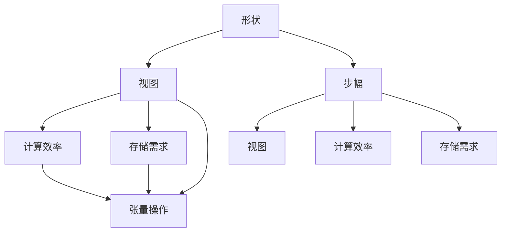

                 

# 张量操作：形状、视图和步幅的重要性

## 1. 背景介绍

张量（Tensor）是现代深度学习的基础数据结构。在深度学习中，我们通常将数据以张量的形式输入到模型中，并通过一系列张量操作进行网络计算和模型训练。张量操作不仅仅是深度学习的核心算法，更是整个科学计算的基石。本文将从张量的形状、视图和步幅等关键概念入手，探讨这些概念对深度学习模型的影响和优化方法。

## 2. 核心概念与联系

### 2.1 核心概念概述

- **形状(Shape)**：张量的形状描述了其维度和每个维度的大小。形状用一维整数序列表示，例如`[2, 3, 4]`表示一个3维张量，其第一个维度的大小为2，第二个维度的大小为3，第三个维度的大小为4。
- **视图(View)**：张量的视图描述了其在内存中的存储布局。视图通常通过改变形状和步幅来实现，例如通过切片、转置、连接等操作。
- **步幅(Stride)**：步幅描述了张量在不同维度上的跨度。步幅决定了张量在内存中的布局方式，从而影响其计算效率和存储需求。

这些概念之间存在密切的联系。例如，改变张量的形状和步幅会影响其视图，而不同的视图又会影响其计算和存储效率。

### 2.2 核心概念原理和架构的 Mermaid 流程图



这个流程图展示了形状、视图和步幅之间的逻辑关系。形状决定了视图和步幅，而视图和步幅又分别影响了计算效率和存储需求，最终通过张量操作进行计算。

## 3. 核心算法原理 & 具体操作步骤

### 3.1 算法原理概述

张量操作的核心算法原理包括矩阵乘法、卷积、池化等经典计算方法。这些操作通常通过改变张量的形状和步幅来实现，以适应特定的计算需求。

- **矩阵乘法**：两个矩阵相乘时，形状必须满足要求，即第一个矩阵的列数等于第二个矩阵的行数。在实现时，可以通过改变张量的形状和步幅，使矩阵乘法在GPU或CPU上高效运行。
- **卷积**：卷积操作通常需要改变张量的形状和步幅，以适应不同的卷积核大小和步幅。卷积操作的核心在于卷积核的滑动和元素提取，因此步幅的选择直接影响计算效率。
- **池化**：池化操作通常包括最大池化和平均池化，可以通过改变张量的形状和步幅，实现池化操作的多样性和灵活性。

### 3.2 算法步骤详解

以卷积操作为例，介绍卷积操作的详细步骤：

1. **定义输入和卷积核**：
   ```python
   import torch
   import torch.nn as nn
   import torch.nn.functional as F
   
   input_shape = [1, 3, 224, 224]  # 输入形状：1个通道，3x3的卷积核，224x224的输入图像
   conv_shape = [3, 32, 3, 3]  # 卷积核形状：3x3的卷积核，32个输出通道
   ```

2. **构建卷积层**：
   ```python
   class Conv2d(nn.Module):
       def __init__(self, in_channels, out_channels):
           super(Conv2d, self).__init__()
           self.conv = nn.Conv2d(in_channels, out_channels, kernel_size=3, stride=1, padding=1)
       
       def forward(self, x):
           return self.conv(x)
   ```

3. **计算卷积**：
   ```python
   conv_layer = Conv2d(input_shape[1], conv_shape[1])
   output = conv_layer(torch.randn(input_shape))
   ```

4. **分析卷积操作的计算和存储需求**：
   - **计算需求**：卷积操作需要计算输入张量与卷积核的元素乘积，并将结果累加到输出张量中。计算需求与输入张量的形状、卷积核大小和步幅有关。
   - **存储需求**：卷积操作需要保存输入张量、卷积核和输出张量。存储需求与输入张量的大小、卷积核大小和步幅有关。

### 3.3 算法优缺点

- **优点**：
  - **灵活性**：通过改变张量的形状和步幅，可以实现各种复杂的计算需求，适应不同的任务。
  - **高效性**：通过优化步幅和内存布局，可以在GPU或CPU上高效运行，提升计算效率。
- **缺点**：
  - **复杂性**：张量操作的实现需要考虑形状、步幅和视图等多方面因素，增加了开发难度。
  - **内存占用**：张量操作的内存占用较大，特别是在处理大规模数据时，可能会造成内存不足的问题。

### 3.4 算法应用领域

张量操作在深度学习中具有广泛的应用，包括：

- **卷积神经网络**：卷积神经网络中的卷积、池化和非线性激活等操作，都依赖于张量操作。
- **循环神经网络**：循环神经网络中的时间序列处理，依赖于张量操作对序列数据的处理和记忆。
- **自然语言处理**：自然语言处理中的词嵌入、句子表示和语言模型，都需要张量操作来处理文本数据。

## 4. 数学模型和公式 & 详细讲解 & 举例说明

### 4.1 数学模型构建

以矩阵乘法为例，展示张量操作的数学模型：

设输入张量 $A$ 和输出张量 $B$ 的形状分别为 $(m, n)$ 和 $(n, p)$，则它们的矩阵乘积 $C$ 为：

$$
C_{ij} = \sum_{k=1}^{n} A_{ik} B_{kj}
$$

其中，$A_{ik}$ 和 $B_{kj}$ 分别为 $A$ 和 $B$ 矩阵中的元素。

### 4.2 公式推导过程

以卷积操作为例，展示卷积操作的公式推导过程：

设输入张量 $X$ 的形状为 $(b, c, h_{in}, w_{in})$，卷积核 $K$ 的形状为 $(c, f, k_h, k_w)$，步幅为 $s_h$ 和 $s_w$，则卷积操作 $Y$ 的形状为 $(b, f, h_{out}, w_{out})$，其中：

$$
h_{out} = \frac{h_{in} - k_h + 2p}{s_h} + 1
$$

$$
w_{out} = \frac{w_{in} - k_w + 2p}{s_w} + 1
$$

其中，$p$ 为填充（Padding）的大小。

### 4.3 案例分析与讲解

以图像分类为例，展示张量操作在图像分类中的具体应用：

1. **数据预处理**：
   - **标准化**：将图像像素值标准化到 $[0, 1]$ 或 $[-1, 1]$ 范围内。
   - **归一化**：将图像像素值归一化到 $[0, 1]$ 范围内。

2. **卷积操作**：
   - **卷积核**：通常使用 $3x3$ 的卷积核进行特征提取。
   - **步幅**：通常使用 $1$ 的步幅进行滑动，避免信息丢失。

3. **池化操作**：
   - **最大池化**：使用 $2x2$ 的最大池化窗口，步幅为 $2$，进行特征压缩。
   - **平均池化**：使用 $2x2$ 的平均池化窗口，步幅为 $2$，进行特征压缩。

4. **全连接层**：
   - **线性变换**：将池化后的特征进行线性变换，得到分类结果。
   - **激活函数**：通常使用 ReLU 或 Softmax 激活函数。

## 5. 项目实践：代码实例和详细解释说明

### 5.1 开发环境搭建

为实现张量操作，我们推荐使用 PyTorch 作为开发环境。

首先，安装 PyTorch 和相关依赖：

```bash
pip install torch torchvision torchtext
```

然后，创建 Python 环境，设置必要的路径和库：

```bash
mkdir project
cd project
python -m venv venv
source venv/bin/activate
```

### 5.2 源代码详细实现

以下是一个简单的卷积神经网络实现，展示张量操作在深度学习中的应用：

```python
import torch
import torch.nn as nn
import torch.nn.functional as F

class ConvNet(nn.Module):
    def __init__(self):
        super(ConvNet, self).__init__()
        self.conv1 = nn.Conv2d(3, 32, kernel_size=3, stride=1, padding=1)
        self.pool1 = nn.MaxPool2d(kernel_size=2, stride=2)
        self.conv2 = nn.Conv2d(32, 64, kernel_size=3, stride=1, padding=1)
        self.pool2 = nn.MaxPool2d(kernel_size=2, stride=2)
        self.fc1 = nn.Linear(64 * 4 * 4, 128)
        self.fc2 = nn.Linear(128, 10)
    
    def forward(self, x):
        x = self.pool1(F.relu(self.conv1(x)))
        x = self.pool2(F.relu(self.conv2(x)))
        x = x.view(x.size(0), -1)
        x = F.relu(self.fc1(x))
        x = self.fc2(x)
        return F.softmax(x, dim=1)
```

在上述代码中，我们定义了一个包含两个卷积层和两个全连接层的卷积神经网络。通过改变卷积核大小和步幅，可以实现不同的卷积操作。

### 5.3 代码解读与分析

- **卷积层**：定义了两个卷积层，第一个卷积层使用 $3x3$ 的卷积核，第二个卷积层使用 $3x3$ 的卷积核，步幅为 $1$。
- **池化层**：使用 $2x2$ 的最大池化窗口，步幅为 $2$，进行特征压缩。
- **全连接层**：将池化后的特征进行线性变换，使用 ReLU 激活函数。

## 6. 实际应用场景

### 6.1 计算机视觉

在计算机视觉中，卷积操作是图像处理和特征提取的核心。通过卷积操作，可以从图像中提取有用的特征，例如边缘、纹理、角点等。卷积操作还可以实现图像的变换和处理，例如平移、旋转、缩放等。

### 6.2 自然语言处理

在自然语言处理中，张量操作同样具有广泛的应用。通过张量操作，可以将文本数据转换为向量形式，进行语言模型训练和文本分类等任务。例如，可以使用卷积操作提取文本中的关键特征，使用池化操作进行特征压缩，使用全连接层进行分类。

### 6.3 信号处理

在信号处理中，张量操作可以用于时频域转换、滤波器设计、信号压缩等任务。例如，可以使用卷积操作实现滤波器设计，使用池化操作进行信号压缩，使用全连接层进行信号分类。

### 6.4 未来应用展望

未来，随着深度学习的发展，张量操作将在更多的领域得到应用。例如，在生物信息学中，张量操作可以用于基因序列分析和蛋白质结构预测。在医疗影像中，张量操作可以用于医学图像处理和诊断。在金融分析中，张量操作可以用于时间序列分析和预测。

## 7. 工具和资源推荐

### 7.1 学习资源推荐

- **《深度学习》课程**：斯坦福大学的《深度学习》课程（CS231n）和杨鸣的《深度学习基础》课程（UFLDL），涵盖了深度学习的基本概念和张量操作。
- **PyTorch官方文档**：PyTorch官方文档详细介绍了张量操作的实现和使用，是学习张量操作的必备资源。
- **TensorFlow官方文档**：TensorFlow官方文档提供了丰富的张量操作示例，适合对深度学习感兴趣的读者。

### 7.2 开发工具推荐

- **PyTorch**：PyTorch是深度学习的开源框架，提供了丰富的张量操作和深度学习模型，易于使用和调试。
- **TensorFlow**：TensorFlow是另一个流行的深度学习框架，提供了丰富的张量操作和深度学习模型，适合大规模分布式训练。
- **MXNet**：MXNet是一个高效、灵活的深度学习框架，提供了丰富的张量操作和深度学习模型，支持多种编程语言。

### 7.3 相关论文推荐

- **《深度学习》书籍**：Ian Goodfellow的《深度学习》一书详细介绍了深度学习的核心算法和张量操作。
- **《Python深度学习》书籍**：Francois Chollet的《Python深度学习》一书详细介绍了张量操作的实现和使用。

## 8. 总结：未来发展趋势与挑战

### 8.1 研究成果总结

本文详细介绍了张量操作的原理和实现方法，探讨了形状、视图和步幅对张量操作的影响，并通过实际应用展示了张量操作的广泛应用。通过这些分析，可以看出张量操作在深度学习中的重要性。

### 8.2 未来发展趋势

未来，随着深度学习的发展，张量操作将继续演化和扩展。例如，稀疏张量操作、量子张量操作、动态张量操作等新兴技术将为张量操作带来更多的可能性。

### 8.3 面临的挑战

张量操作在未来也面临一些挑战，例如：

- **计算资源**：随着数据规模和模型复杂度的增加，张量操作的计算需求将不断增长，如何高效利用计算资源是一个重要问题。
- **存储需求**：随着数据规模和模型复杂度的增加，张量操作的存储需求也将不断增长，如何优化存储需求是一个重要问题。
- **可扩展性**：随着张量操作的应用场景不断扩展，如何设计可扩展、灵活的张量操作是一个重要问题。

### 8.4 研究展望

未来，张量操作的优化将涉及更多的领域，例如：

- **计算并行化**：通过计算并行化技术，提高张量操作的计算效率。
- **存储压缩**：通过存储压缩技术，降低张量操作的存储需求。
- **自动微分**：通过自动微分技术，实现张量操作的自动计算和优化。
- **模型压缩**：通过模型压缩技术，优化张量操作的模型结构，提升计算和存储效率。

## 9. 附录：常见问题与解答

**Q1：什么是张量操作？**

A: 张量操作是指在深度学习中，对张量进行一系列的计算和变换。常见的张量操作包括矩阵乘法、卷积、池化、拼接等。

**Q2：张量操作的形状、视图和步幅有什么区别？**

A: 形状描述了张量的维度和大小，视图描述了张量在内存中的存储布局，步幅描述了张量在不同维度上的跨度。

**Q3：如何优化张量操作的计算和存储效率？**

A: 可以通过改变张量的形状、视图和步幅，优化张量操作的计算和存储效率。例如，使用较小的步幅可以减少内存占用，使用较小的形状可以减少计算开销。

**Q4：什么是自动微分？**

A: 自动微分是指通过程序自动计算函数的导数。在深度学习中，自动微分技术可以用于计算损失函数对模型参数的梯度，加速模型的训练和优化。

**Q5：张量操作在深度学习中有哪些应用？**

A: 张量操作在深度学习中具有广泛的应用，包括卷积神经网络、循环神经网络、自然语言处理、计算机视觉等。

通过本文的介绍，相信你对张量操作的原理和应用有了更深入的理解。掌握张量操作，将有助于你在深度学习领域取得更好的成果。

