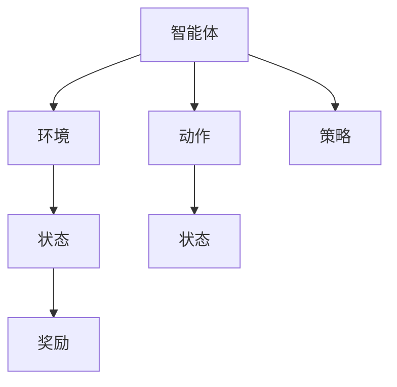

                 

# 强化学习基础：奖励和策略

> 关键词：强化学习, 奖励函数, 策略, 状态-动作, 最大熵

## 1. 背景介绍

### 1.1 问题由来

强化学习(Reinforcement Learning, RL)是人工智能领域的一个核心分支，旨在让智能体(Agent)通过与环境的交互，学会在特定环境中采取最优策略以实现最大化的长期奖励。强化学习的提出源自人工智能学派的理论基础——控制论和最优化理论，与经典机器学习算法相比，强化学习更具灵活性和适应性。在智能体与环境的交互过程中，其策略的学习和优化能力将不断提升，从而最终能够解决复杂的决策问题。

但相较于传统机器学习，强化学习的理论和实践仍然面临不少挑战，其中奖励函数的设计和策略的选择是关键难点。合理设计的奖励函数不仅需要保证智能体的行为与预期目标一致，还需要尽量避免陷入局部最优。同时，如何选取有效的策略，使其在各状态下始终能够采取最优动作，是强化学习的另一个核心问题。

### 1.2 问题核心关键点

在强化学习中，奖励函数和策略是决定智能体行为的两个关键因素。奖励函数用于评估智能体的行为结果，策略用于指导智能体如何采取行动。两者互相影响，共同构成了一个完整的强化学习过程。

- **奖励函数(Reward Function)**：定义智能体在不同状态下采取不同动作所获得的奖励值，用于指导智能体追求的目标。
- **策略(Policy)**：智能体在每个状态下选择动作的概率分布，用于决定智能体如何进行决策。
- **状态-动作(State-Action)**：智能体在环境中的状态和采取的动作，是智能体与环境交互的基本单位。
- **最大熵方法(MaxEnt)**：一种概率模型学习方法，在强化学习中常用于优化策略，使得智能体在各种状态下采取动作的概率分布更加均匀。

本文将系统介绍强化学习中的核心概念，通过深入浅出的解释，帮助读者理解强化学习的原理和思想。

## 2. 核心概念与联系

### 2.1 核心概念概述

强化学习的核心在于智能体与环境的交互，通过智能体对环境的探索和适应，学习最优策略以实现最大化的长期奖励。这一过程涉及三个基本组件：

- **智能体(Agent)**：智能体是强化学习的主体，负责在环境中进行探索和决策。
- **环境(Environment)**：环境是智能体行动的场所，其状态和奖励函数将指导智能体的行为。
- **状态(State)**：状态是环境中的基本信息单元，智能体与环境之间的交互总是基于当前状态进行的。

此外，还有两个重要概念：

- **动作(Action)**：智能体在每个状态下采取的具体行为，直接影响了后续状态和奖励的获取。
- **奖励(Reward)**：智能体在每个状态下根据行为得到的反馈值，用于指导智能体如何调整策略。

通过奖励函数和策略的相互作用，智能体在环境中不断学习和优化，最终找到最优解。

### 2.2 核心概念原理和架构的 Mermaid 流程图



以上图展示了智能体与环境的交互过程。智能体通过采取动作来改变环境状态，环境根据当前状态返回奖励值，智能体再根据奖励和当前状态，调整策略以决定下一个动作。策略是智能体在每个状态下选择动作的概率分布，奖励函数则是评价每个动作的好坏。

## 3. 核心算法原理 & 具体操作步骤
### 3.1 算法原理概述

强化学习的核心是构建一个代理(Agent)，使其在特定环境中通过与环境的交互，学会在特定状态下采取最优动作。强化学习的目标是最大化智能体的长期奖励，即预期奖励的累积和。具体步骤如下：

1. **初始化**：设置环境状态为初始状态，智能体在初始状态下随机选择一个动作。
2. **执行动作**：智能体在当前状态下执行所选动作，环境状态根据动作变化，并返回一个奖励值。
3. **策略更新**：智能体根据奖励值和当前状态，调整策略以选择下一个动作。
4. **迭代执行**：重复步骤2和3，直至达到终止状态或满足预设条件。

强化学习的目标是最小化长期奖励的方差，从而使得智能体的行为更加稳定和可预测。这一过程可以通过蒙特卡罗(Monte Carlo)、时序差分(Temporal Difference)、策略梯度(Policy Gradient)等多种方法实现。

### 3.2 算法步骤详解

以下以蒙特卡罗方法为例，详细介绍强化学习中奖励和策略的具体实现步骤：

#### 3.2.1 蒙特卡罗方法

蒙特卡罗方法基于样本轨迹(Sample Trajectory)，通过不断模拟智能体的行为，收集足够的数据来评估和优化策略。具体步骤如下：

1. **轨迹模拟**：从当前状态开始，智能体根据策略随机选择一个动作，环境根据动作变化并返回奖励值。持续模拟直到达到终止状态。
2. **轨迹存储**：将模拟的轨迹（状态-动作序列）存储下来，供后续分析使用。
3. **奖励累积**：对轨迹中的每个状态，计算其从当前状态到终止状态所获得的总奖励。
4. **策略评估**：根据轨迹中的策略，计算每个状态-动作对的Q值(Q-value)，即该状态-动作对从当前状态到终止状态所获得的总奖励的预测值。
5. **策略优化**：利用Q值更新策略参数，使得智能体在每个状态下选择动作的概率分布更加符合最优策略。

#### 3.2.2 时序差分方法

时序差分方法基于当前状态和下一个状态的奖励差值(Temporal Difference)，通过更新当前状态的Q值，逐步逼近最优策略。具体步骤如下：

1. **当前状态Q值计算**：根据当前状态，计算Q值的初始值。
2. **下一个状态Q值计算**：根据下一个状态，计算Q值的预测值。
3. **差值更新**：计算当前状态和下一个状态的Q值差值，更新当前状态的Q值。
4. **策略更新**：根据更新后的Q值，调整策略参数，使得智能体在每个状态下选择动作的概率分布更加符合最优策略。

#### 3.2.3 策略梯度方法

策略梯度方法直接优化策略参数，通过梯度上升的方法，使智能体在每个状态下选择动作的概率分布更加符合最优策略。具体步骤如下：

1. **策略参数初始化**：设置策略参数的初始值。
2. **梯度计算**：根据当前策略，计算每个状态-动作对的梯度值。
3. **参数更新**：利用梯度上升的方法，逐步更新策略参数，使智能体在每个状态下选择动作的概率分布更加符合最优策略。
4. **迭代执行**：重复步骤2和3，直至策略收敛或达到预设条件。

### 3.3 算法优缺点

#### 3.3.1 优点

- **自适应性强**：强化学习能够适应复杂环境，学习出更符合实际情况的策略。
- **灵活性高**：强化学习可以处理连续动作空间、高维状态空间等多种复杂问题。
- **实时优化**：强化学习在不断探索和优化中，能够逐步提高智能体的性能。

#### 3.3.2 缺点

- **样本效率低**：强化学习通常需要大量的样本数据，收集和处理这些数据的过程往往耗时耗力。
- **局部最优风险**：强化学习可能陷入局部最优，无法找到全局最优解。
- **策略优化困难**：策略优化需要大量的计算资源，当状态空间过大时，优化过程可能难以收敛。

### 3.4 算法应用领域

强化学习已经在多个领域得到了广泛应用，涵盖了自动驾驶、机器人控制、游戏智能、推荐系统等多个方向。以下列举几个具体应用场景：

- **自动驾驶**：通过强化学习，智能车能够在复杂的道路环境中学习最优驾驶策略，避免交通事故，提升行车安全。
- **机器人控制**：通过强化学习，机器人能够学习在各种环境中完成任务，如抓取、移动等，提升操作精度和效率。
- **游戏智能**：通过强化学习，游戏中的AI角色能够学习出最优的策略，提升游戏体验和竞争力。
- **推荐系统**：通过强化学习，推荐系统能够学习用户的偏好和行为，提供更加个性化和精准的推荐。

## 4. 数学模型和公式 & 详细讲解 & 举例说明

### 4.1 数学模型构建

强化学习的数学模型可以表示为：

1. **状态-动作空间**：智能体在环境中的状态和动作空间可以表示为：
   - 状态空间 $S$：环境的所有可能状态集合。
   - 动作空间 $A$：智能体在每个状态下可以采取的所有动作集合。

2. **策略**：策略 $\pi$ 表示智能体在每个状态下选择动作的概率分布，可以表示为：
   - 策略函数 $\pi(a|s)$：在状态 $s$ 下选择动作 $a$ 的概率。

3. **奖励函数**：奖励函数 $r(s,a)$ 表示智能体在状态 $s$ 下采取动作 $a$ 所获得的奖励值。

4. **值函数**：值函数 $V$ 表示在状态 $s$ 下，智能体采取某种策略进行 $\epsilon$ 次迭代后的平均奖励，可以表示为：
   - 状态值函数 $V(s)$：在状态 $s$ 下，智能体采取最优策略进行 $\epsilon$ 次迭代后的平均奖励。
   - 动作值函数 $Q(s,a)$：在状态 $s$ 下采取动作 $a$ 后的期望奖励。

### 4.2 公式推导过程

以下以蒙特卡罗方法为例，推导Q值的计算公式。

假设智能体在状态 $s$ 下采取动作 $a$，环境根据动作变化为状态 $s'$，并返回奖励 $r$。根据蒙特卡罗方法，状态 $s$ 的Q值可以通过以下公式计算：

$$
Q(s,a) = r + \gamma V(s')
$$

其中 $\gamma$ 为折扣因子，用于考虑长期奖励的影响。

### 4.3 案例分析与讲解

**案例：求解迷宫问题**

迷宫问题是一个经典的强化学习案例。假设智能体在迷宫中，需要从起点到达终点。迷宫的状态由当前位置和方向组成，动作包括上、下、左、右四种。智能体在每个状态下采取动作，环境根据动作变化并返回奖励值。

1. **状态空间**：假设迷宫大小为 $m \times n$，则状态空间大小为 $m \times n$。
2. **动作空间**：假设智能体在每个状态下有四种动作，则动作空间大小为 $4$。
3. **奖励函数**：假设智能体到达终点后获得 $100$ 奖励，否则获得 $0$ 奖励。

通过蒙特卡罗方法，智能体可以通过不断模拟探索迷宫，逐步学习到最优策略，最终成功到达终点。

## 5. 项目实践：代码实例和详细解释说明

### 5.1 开发环境搭建

在进行强化学习项目实践前，我们需要准备好开发环境。以下是使用Python进行OpenAI Gym环境搭建的过程：

1. 安装Python和pip：
   ```bash
   sudo apt-get update
   sudo apt-get install python3-pip
   ```

2. 安装OpenAI Gym：
   ```bash
   pip install gym
   ```

3. 安装具体的Gym环境：
   ```bash
   pip install gym-flatland
   ```

4. 安装必要的库：
   ```bash
   pip install numpy matplotlib
   ```

完成上述步骤后，即可在Python环境中进行强化学习项目的开发。

### 5.2 源代码详细实现

下面我们以迷宫问题为例，给出使用OpenAI Gym进行强化学习的PyTorch代码实现。

首先，定义迷宫问题：

```python
from gym_flatland.envs.maze import MazeEnv
import gym_flatland
import gym
import numpy as np

env = MazeEnv(maze=np.array([...]))
```

然后，定义智能体的策略和值函数：

```python
class QLearningAgent:
    def __init__(self, env):
        self.env = env
        self.q_table = np.zeros((env.observation_space.n, env.action_space.n))
        self.learning_rate = 0.1
        self.discount_factor = 0.9
        self.epsilon = 0.1
        self.epsilon_min = 0.01
        self.epsilon_decay = 0.999

    def choose_action(self, state):
        if np.random.rand() < self.epsilon:
            return self.env.action_space.sample()
        else:
            return np.argmax(self.q_table[state])

    def update_q_table(self, state, action, reward, next_state):
        best_next_action = self.env.action_space.sample()
        current_q = self.q_table[state, action]
        next_q = self.q_table[next_state, best_next_action]
        new_q = (1 - self.learning_rate) * current_q + self.learning_rate * (reward + self.discount_factor * next_q)
        self.q_table[state, action] = new_q
```

最后，启动强化学习过程：

```python
agent = QLearningAgent(env)

total_reward = 0
for i in range(10000):
    state = env.reset()
    done = False
    while not done:
        action = agent.choose_action(state)
        next_state, reward, done, _ = env.step(action)
        agent.update_q_table(state, action, reward, next_state)
        state = next_state
        total_reward += reward
```

以上就是使用PyTorch和OpenAI Gym进行迷宫问题的强化学习代码实现。可以看到，利用Q表来记录每个状态-动作对的值，通过策略选择和更新Q表，智能体逐步学习到迷宫问题的最优解。

### 5.3 代码解读与分析

让我们再详细解读一下关键代码的实现细节：

**定义QTable类**：
- `choose_action`方法：根据当前状态和策略，选择动作。策略根据探索-利用平衡策略实现，随机选择动作的概率为 $\epsilon$，否则选择Q值最大的动作。
- `update_q_table`方法：根据当前状态、动作、奖励和下一个状态，更新Q表。利用当前状态的动作值和下一个状态的最大动作值，结合学习率和折扣因子，计算新的Q值。

**启动训练过程**：
- 在每个时间步中，智能体选择一个动作，执行并观察环境返回的状态和奖励，更新Q表并累计奖励。

**结果展示**：
- 通过不断训练，智能体逐渐学习到迷宫问题的最优策略，最终成功到达终点。

## 6. 实际应用场景

### 6.1 智能驾驶系统

强化学习在智能驾驶系统中的应用，主要体现在自动驾驶汽车的路径规划和行为决策上。通过收集大量的驾驶数据和环境信息，强化学习模型能够学习出最优的驾驶策略，使得车辆在复杂的路况下能够安全、高效地行驶。

在具体实现中，智能体可以选择不同的动作，如加速、减速、转向等，环境根据智能体的行为变化并返回奖励值。通过不断探索和优化，智能体能够学习出最优的驾驶策略，以适应不同的道路环境和交通状况。

### 6.2 机器人控制

强化学习在机器人控制中的应用，主要体现在工业机器人和服务机器人的操作和路径规划上。通过模拟和训练，强化学习模型能够学习出最优的机器人操作策略，使得机器人在复杂的环境下能够高效完成任务。

在具体实现中，智能体可以选择不同的动作，如抓取、移动、旋转等，环境根据智能体的行为变化并返回奖励值。通过不断探索和优化，智能体能够学习出最优的机器人操作策略，以适应不同的任务需求和环境条件。

### 6.3 游戏智能

强化学习在游戏智能中的应用，主要体现在游戏角色的决策和行为上。通过收集大量的游戏数据和环境信息，强化学习模型能够学习出最优的游戏策略，使得游戏角色在复杂的游戏环境中能够获胜。

在具体实现中，智能体可以选择不同的动作，如移动、攻击、防御等，环境根据智能体的行为变化并返回奖励值。通过不断探索和优化，智能体能够学习出最优的游戏策略，以适应不同的游戏环境和玩家行为。

### 6.4 未来应用展望

随着强化学习技术的不断进步，其在实际应用中也将展现出更广阔的前景。未来，强化学习将在以下领域得到更广泛的应用：

- **智能交通**：通过强化学习，智能交通系统能够优化交通流量和路径规划，提升道路使用效率和交通安全。
- **医疗诊断**：通过强化学习，医疗系统能够学习出最优的诊断策略，提升疾病的诊断准确率和效率。
- **金融交易**：通过强化学习，金融交易系统能够学习出最优的交易策略，提升投资回报和风险控制能力。
- **智慧城市**：通过强化学习，智慧城市系统能够优化资源分配和环境管理，提升城市运行效率和生活质量。

## 7. 工具和资源推荐

### 7.1 学习资源推荐

为了帮助开发者系统掌握强化学习的理论基础和实践技巧，这里推荐一些优质的学习资源：

1. 《强化学习》书籍：由Richard S. Sutton和Andrew G. Barto所著，详细介绍了强化学习的理论基础和算法实现。
2. 《Deep Reinforcement Learning》课程：斯坦福大学开设的强化学习课程，有Lecture视频和配套作业，带你深入了解强化学习的原理和应用。
3. 《Reinforcement Learning with PyTorch》书籍：作者介绍如何使用PyTorch实现强化学习算法，包括蒙特卡罗方法、时序差分方法、策略梯度方法等。
4. OpenAI Gym官方文档：OpenAI Gym的官方文档，提供了丰富的环境和算法的实现细节，是强化学习实践的必备资料。
5. DeepMind官方博客：DeepMind的研究团队在博客中分享了大量强化学习的研究成果和实现方法，值得关注和借鉴。

通过对这些资源的学习实践，相信你一定能够快速掌握强化学习的精髓，并用于解决实际的强化学习问题。

### 7.2 开发工具推荐

高效的开发离不开优秀的工具支持。以下是几款用于强化学习开发的常用工具：

1. OpenAI Gym：OpenAI开发的强化学习框架，提供了丰富的环境和算法实现。
2. TensorFlow：由Google主导开发的开源深度学习框架，支持强化学习算法的实现。
3. PyTorch：由Facebook主导开发的开源深度学习框架，灵活的计算图使得强化学习算法易于实现。
4. PyBullet：基于MuJoCo的物理引擎，用于模拟机器人控制和路径规划。
5. Gazebo：用于模拟虚拟环境和机器人操作，支持多线程和分布式计算。

合理利用这些工具，可以显著提升强化学习项目的开发效率，加快创新迭代的步伐。

### 7.3 相关论文推荐

强化学习的研究始于20世纪70年代，近年来随着深度学习技术的发展，强化学习在理论和应用方面都取得了显著进展。以下是几篇奠基性的相关论文，推荐阅读：

1. Q-Learning：由Watkins和Henderson提出，是强化学习中最经典的算法之一，奠定了深度强化学习的基础。
2. Deep Q-Network：由Silver等提出，结合深度学习和强化学习的优势，成功解决了复杂的AlphaGo问题。
3. Actor-Critic方法：由Sutton和Barto提出，将策略和值函数结合起来，解决了深度强化学习中的探索-利用平衡问题。
4. Trust Region Policy Optimization：由Schulman等提出，通过优化策略的梯度，提高了深度强化学习的训练效率和稳定性。
5. Human-AI Cooperative Planning：由Amort等提出，将人类与智能体合作，解决复杂环境中的规划问题。

这些论文代表了大强化学习的发展脉络。通过学习这些前沿成果，可以帮助研究者把握学科前进方向，激发更多的创新灵感。

## 8. 总结：未来发展趋势与挑战

### 8.1 总结

本文对强化学习的核心概念、算法原理和实际应用进行了全面系统的介绍。通过深入浅出的解释，帮助读者理解强化学习的原理和思想。

- 强化学习的核心在于智能体与环境的交互，通过不断探索和优化，学习最优策略以实现最大化的长期奖励。
- 奖励函数和策略是强化学习的关键组成部分，合理设计和优化这两个组件将极大影响智能体的性能。
- 强化学习已经在自动驾驶、机器人控制、游戏智能等多个领域得到应用，展示了强大的应用前景。

### 8.2 未来发展趋势

展望未来，强化学习的发展将呈现以下几个趋势：

1. **多智能体学习**：强化学习将不再是单个智能体的学习，而是多个智能体之间的交互和协作。通过多智能体学习，可以解决更复杂的问题，提高系统的稳定性和鲁棒性。
2. **迁移学习**：强化学习模型可以在多个任务之间迁移，通过迁移学习，智能体可以更快地适应新任务，提升学习效率。
3. **元学习**：强化学习模型能够在多个任务之间共享知识和经验，通过元学习，智能体可以更快地学习新任务，提升学习效率和性能。
4. **自适应强化学习**：强化学习模型能够自适应环境变化，通过自适应强化学习，智能体可以更好地应对不确定性，提升鲁棒性。
5. **分布式强化学习**：强化学习模型可以在多个设备上分布式运行，通过分布式强化学习，智能体可以更快地学习和优化策略。

### 8.3 面临的挑战

尽管强化学习取得了显著进展，但仍面临诸多挑战：

1. **样本效率低**：强化学习通常需要大量的样本数据，收集和处理这些数据的过程往往耗时耗力。
2. **策略优化困难**：策略优化需要大量的计算资源，当状态空间过大时，优化过程可能难以收敛。
3. **局部最优风险**：强化学习可能陷入局部最优，无法找到全局最优解。
4. **可解释性不足**：强化学习模型通常是"黑盒"系统，难以解释其内部工作机制和决策逻辑。
5. **安全性有待保障**：强化学习模型可能学习到有害行为，导致安全风险。

### 8.4 研究展望

面对强化学习面临的挑战，未来的研究需要在以下几个方面寻求新的突破：

1. **样本效率优化**：通过数据增强、迁移学习等方法，提高样本收集和处理效率。
2. **策略优化方法**：开发更加高效的策略优化算法，提高策略优化的收敛速度和稳定性。
3. **模型可解释性**：通过引入因果分析和博弈论工具，增强模型的可解释性和可理解性。
4. **安全性和鲁棒性**：通过引入伦理导向的评估指标和监控机制，提高系统的安全性和鲁棒性。
5. **多智能体学习和元学习**：通过多智能体学习和元学习，提升系统的复杂性和适应性。

这些研究方向将推动强化学习技术的进一步发展，为人工智能技术在更多领域的应用提供新的思路和方法。相信随着学界和产业界的共同努力，强化学习必将在构建智能系统方面发挥更大的作用。

## 9. 附录：常见问题与解答

**Q1：强化学习与监督学习的区别是什么？**

A: 强化学习与监督学习的主要区别在于数据的表现形式和任务目标。监督学习通常需要标注数据，通过模型预测与真实标签的差异进行优化，任务目标明确，模型需要学习输入到输出的映射关系。而强化学习没有标注数据，智能体通过与环境的交互，通过奖励和惩罚信号学习最优策略，任务目标不一定明确，模型需要学习最优行为。

**Q2：如何选择奖励函数？**

A: 选择奖励函数需要考虑任务的具体需求和环境特性。通常需要满足以下几个条件：
1. 奖励函数应与任务目标一致。
2. 奖励函数应尽可能简单、易于计算。
3. 奖励函数应避免过度惩罚或过度奖励，避免智能体陷入局部最优。
4. 奖励函数应具有良好的连续性和可导性，方便梯度计算。

**Q3：如何缓解强化学习中的探索-利用平衡问题？**

A: 探索-利用平衡是强化学习中的核心问题之一，可以通过以下方法缓解：
1. $\epsilon$-贪心策略：在每步选择动作时，以$\epsilon$的概率随机选择动作，以$1-\epsilon$的概率选择当前策略下的动作。
2. UCB策略：利用不确定性探索，选择高不确定性动作进行探索，选择确定性动作进行利用。
3. Softmax策略：将动作值函数进行softmax归一化，选择概率最高的动作进行利用。

**Q4：如何优化强化学习的计算效率？**

A: 强化学习的计算效率可以通过以下几个方法优化：
1. 使用GPU或TPU进行加速计算。
2. 使用分布式计算框架，如TensorFlow、PyTorch等。
3. 使用模型压缩和剪枝技术，减少模型大小和计算量。
4. 使用自适应算法，如Adam、Adagrad等，提高算法效率和稳定性。

**Q5：强化学习在多智能体系统中的应用有哪些？**

A: 强化学习在多智能体系统中的应用包括：
1. 无人驾驶车辆协作：多智能体学习使得多辆车协同工作，提高道路使用效率和安全性。
2. 机器人协作：多智能体学习使得多机器人协作完成任务，提高操作效率和精度。
3. 智能电网调度：多智能体学习使得多智能体协同工作，优化电网资源分配和调度。

通过对这些问题的解答，相信你能够更全面地理解强化学习的核心概念和实际应用。

---

作者：禅与计算机程序设计艺术 / Zen and the Art of Computer Programming

