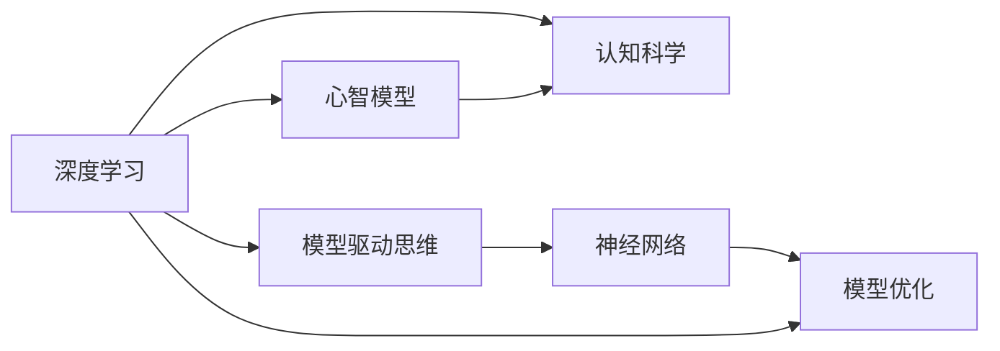

                 

# 心智模型：理解世界的内在框架

> 关键词：心智模型,认知科学,神经网络,模型驱动思维,深度学习

## 1. 背景介绍

### 1.1 问题由来
在当前这个信息爆炸的时代，我们每个人每天都在面对海量的数据和复杂的信息。如何在庞杂的信息中提取出有用的知识，并据此做出决策，成为我们日常生活中必须面对的问题。很多人认为，这是现代社会的挑战，只有科技和算法才能解决。但实际上，这是一种误解。真正能帮助我们理解世界，做出决策的，是每个人心中潜藏的心智模型。

心智模型（Mental Models）是指个体对世界的基本认知和理解。它并非知识本身，而是一种思维方式、一种思考问题的方式。每个人的心智模型都不同，但其中一些常见的模型，比如因果关系、归纳推理、系统思维等，可以帮助我们在复杂的世界中快速理解和解决问题。

### 1.2 问题核心关键点
心智模型在人工智能领域的运用，尤其是在深度学习中的运用，变得越来越重要。深度学习本身就是一个复杂而庞大的模型，它试图通过大量的数据和复杂的算法，去模拟人类认知过程。心智模型正是在这一过程中，起到了关键的引导作用。

- **模型的本质**：深度学习模型通过数据的输入和输出，去不断学习，调整权重，直到可以准确预测未知数据。
- **模型的优化**：模型的训练过程中，心智模型帮助我们理解数据的分布、优化算法的方向，以及如何判断模型是否已经训练得足够好。
- **模型的应用**：心智模型帮助我们理解模型的性能，以及在实际应用中如何调整和优化模型。

### 1.3 问题研究意义
研究心智模型在深度学习中的运用，对于提升模型的泛化能力、理解模型的本质以及优化模型的性能，具有重要意义：

1. **提升泛化能力**：心智模型可以帮助我们理解数据的分布，避免过拟合，提升模型的泛化能力。
2. **理解模型本质**：心智模型有助于我们理解模型的内部结构和运作机制，从而更好地进行优化。
3. **优化模型性能**：心智模型可以指导我们如何选择合适的超参数，以及如何调试和优化模型。
4. **应用场景拓展**：心智模型可以应用到各种深度学习任务中，从图像识别到自然语言处理，从推荐系统到机器人控制。

## 2. 核心概念与联系

### 2.1 核心概念概述

为了更好地理解心智模型在深度学习中的运用，本节将介绍几个关键概念：

- **深度学习**：一种通过多层神经网络进行数据建模的机器学习算法，旨在通过大量的数据和复杂的算法，去模拟人类认知过程。
- **模型驱动思维**：通过构建和优化模型，来理解和解决问题的一种思维方式。
- **心智模型**：个体对世界的基本认知和理解，并非知识本身，而是一种思维方式。
- **认知科学**：研究人类认知过程、思维模式以及如何构建智能系统的科学。
- **神经网络**：一种基于生物学神经元工作原理的计算模型，用于深度学习。
- **模型优化**：通过调整模型参数和结构，以提高模型性能的过程。

这些核心概念之间存在紧密的联系，共同构成了深度学习和认知科学的研究框架。通过理解这些概念，我们可以更好地把握心智模型在深度学习中的运用。

### 2.2 核心概念原理和架构的 Mermaid 流程图



这个流程图展示了深度学习、模型驱动思维、心智模型、认知科学、神经网络以及模型优化之间的联系。深度学习通过神经网络构建模型，通过模型驱动思维来理解和解决问题。心智模型是个体对世界的认知，而认知科学则研究人类认知过程。模型优化则是调整和优化模型的过程。

## 3. 核心算法原理 & 具体操作步骤
### 3.1 算法原理概述

心智模型在深度学习中的运用，本质上是通过构建和优化模型，来理解和解决问题。心智模型帮助我们选择和设计模型，理解模型的内部结构和运作机制，从而更好地进行优化。

心智模型可以简单地分为三个步骤：

1. **数据理解**：心智模型帮助我们理解数据的分布和特性。
2. **模型设计**：心智模型指导我们设计合适的模型结构和参数。
3. **模型优化**：心智模型帮助我们选择合适的超参数，以及如何调试和优化模型。

### 3.2 算法步骤详解

心智模型在深度学习中的运用，通常包括以下几个关键步骤：

**Step 1: 数据理解**

数据理解是构建和优化模型的第一步。心智模型帮助我们理解数据的分布和特性。具体步骤如下：

- **数据收集**：收集数据集，包括训练集和测试集。
- **数据清洗**：去除异常值，处理缺失值，确保数据质量。
- **数据预处理**：进行标准化、归一化等操作，确保数据格式一致。
- **数据分割**：将数据集划分为训练集、验证集和测试集。

**Step 2: 模型设计**

模型设计是构建心智模型的关键步骤。心智模型指导我们设计合适的模型结构和参数。具体步骤如下：

- **选择合适的模型**：根据任务类型，选择合适的深度学习模型，如卷积神经网络（CNN）、循环神经网络（RNN）、自编码器（Autoencoder）等。
- **设计模型架构**：定义模型的层数、每层神经元的数量，以及激活函数、损失函数等。
- **确定超参数**：如学习率、批大小、迭代轮数等。

**Step 3: 模型优化**

模型优化是心智模型的最后一步。心智模型帮助我们选择合适的超参数，以及如何调试和优化模型。具体步骤如下：

- **选择优化算法**：如随机梯度下降（SGD）、Adam等。
- **设置学习率**：确定学习率的大小和调整策略。
- **进行模型训练**：在训练集上进行模型训练。
- **进行模型验证**：在验证集上评估模型性能，调整超参数。
- **进行模型测试**：在测试集上评估模型性能，选择最佳模型。

### 3.3 算法优缺点

心智模型在深度学习中的运用，具有以下优点：

1. **模型泛化能力强**：心智模型帮助我们选择合适的模型结构和参数，从而提升模型的泛化能力。
2. **模型优化效率高**：心智模型指导我们进行模型优化，选择合适的超参数，从而提高模型优化效率。
3. **模型理解深入**：心智模型帮助我们理解模型的内部结构和运作机制，从而更好地进行优化。
4. **应用场景广泛**：心智模型可以应用到各种深度学习任务中，如图像识别、自然语言处理、推荐系统等。

同时，心智模型也存在一定的局限性：

1. **数据依赖性强**：心智模型依赖于数据的质量和数量，如果数据质量不佳，模型的性能可能会受到影响。
2. **模型复杂度高**：某些任务可能需要复杂的模型结构和大量的参数，这增加了模型的复杂度。
3. **超参数调整困难**：超参数的选择和调整需要经验和技巧，难度较大。
4. **模型解释性差**：深度学习模型通常被视为"黑盒"，难以解释其内部工作机制和决策逻辑。

尽管存在这些局限性，但心智模型在深度学习中的应用，已经取得了显著的成果，成为深度学习中不可或缺的一部分。未来，心智模型的研究和应用将继续深入，推动深度学习技术的发展。

### 3.4 算法应用领域

心智模型在深度学习中的应用，已经涵盖了各个领域，包括但不限于：

- **计算机视觉**：如图像识别、目标检测、图像分割等。心智模型帮助我们选择合适的模型结构和参数，提升模型的泛化能力。
- **自然语言处理**：如机器翻译、情感分析、文本分类等。心智模型指导我们进行模型设计，优化模型性能。
- **推荐系统**：如协同过滤、内容推荐、广告推荐等。心智模型帮助我们选择合适的模型和优化算法，提升推荐精度。
- **机器人控制**：如路径规划、行为决策、人机交互等。心智模型帮助机器人理解环境，进行决策和控制。
- **医疗诊断**：如影像诊断、病历分析、基因分析等。心智模型帮助构建合适的模型，提升诊断准确率。

## 4. 数学模型和公式 & 详细讲解 & 举例说明

### 4.1 数学模型构建

心智模型在深度学习中的运用，通常包括以下几个关键步骤：

**Step 1: 数据理解**

数据理解是构建和优化模型的第一步。心智模型帮助我们理解数据的分布和特性。具体步骤如下：

- **数据收集**：收集数据集，包括训练集和测试集。
- **数据清洗**：去除异常值，处理缺失值，确保数据质量。
- **数据预处理**：进行标准化、归一化等操作，确保数据格式一致。
- **数据分割**：将数据集划分为训练集、验证集和测试集。

**Step 2: 模型设计**

模型设计是构建心智模型的关键步骤。心智模型指导我们设计合适的模型结构和参数。具体步骤如下：

- **选择合适的模型**：根据任务类型，选择合适的深度学习模型，如卷积神经网络（CNN）、循环神经网络（RNN）、自编码器（Autoencoder）等。
- **设计模型架构**：定义模型的层数、每层神经元的数量，以及激活函数、损失函数等。
- **确定超参数**：如学习率、批大小、迭代轮数等。

**Step 3: 模型优化**

模型优化是心智模型的最后一步。心智模型帮助我们选择合适的超参数，以及如何调试和优化模型。具体步骤如下：

- **选择优化算法**：如随机梯度下降（SGD）、Adam等。
- **设置学习率**：确定学习率的大小和调整策略。
- **进行模型训练**：在训练集上进行模型训练。
- **进行模型验证**：在验证集上评估模型性能，调整超参数。
- **进行模型测试**：在测试集上评估模型性能，选择最佳模型。

### 4.2 公式推导过程

心智模型在深度学习中的运用，通常包括以下几个关键步骤：

**Step 1: 数据理解**

数据理解是构建和优化模型的第一步。心智模型帮助我们理解数据的分布和特性。具体步骤如下：

- **数据收集**：收集数据集，包括训练集和测试集。
- **数据清洗**：去除异常值，处理缺失值，确保数据质量。
- **数据预处理**：进行标准化、归一化等操作，确保数据格式一致。
- **数据分割**：将数据集划分为训练集、验证集和测试集。

**Step 2: 模型设计**

模型设计是构建心智模型的关键步骤。心智模型指导我们设计合适的模型结构和参数。具体步骤如下：

- **选择合适的模型**：根据任务类型，选择合适的深度学习模型，如卷积神经网络（CNN）、循环神经网络（RNN）、自编码器（Autoencoder）等。
- **设计模型架构**：定义模型的层数、每层神经元的数量，以及激活函数、损失函数等。
- **确定超参数**：如学习率、批大小、迭代轮数等。

**Step 3: 模型优化**

模型优化是心智模型的最后一步。心智模型帮助我们选择合适的超参数，以及如何调试和优化模型。具体步骤如下：

- **选择优化算法**：如随机梯度下降（SGD）、Adam等。
- **设置学习率**：确定学习率的大小和调整策略。
- **进行模型训练**：在训练集上进行模型训练。
- **进行模型验证**：在验证集上评估模型性能，调整超参数。
- **进行模型测试**：在测试集上评估模型性能，选择最佳模型。

### 4.3 案例分析与讲解

这里以图像识别任务为例，具体讲解心智模型在深度学习中的运用。

**Step 1: 数据理解**

- **数据收集**：收集一组包含各类物体的图片。
- **数据清洗**：去除模糊、噪声图片，处理缺失值。
- **数据预处理**：对图片进行归一化、标准化等操作。
- **数据分割**：将数据集划分为训练集、验证集和测试集。

**Step 2: 模型设计**

- **选择合适的模型**：选择卷积神经网络（CNN）模型。
- **设计模型架构**：定义多个卷积层、池化层、全连接层等。
- **确定超参数**：如学习率、批大小、迭代轮数等。

**Step 3: 模型优化**

- **选择优化算法**：选择Adam优化算法。
- **设置学习率**：设置学习率为0.001，并根据性能调整。
- **进行模型训练**：在训练集上进行模型训练。
- **进行模型验证**：在验证集上评估模型性能，调整学习率等超参数。
- **进行模型测试**：在测试集上评估模型性能，选择最佳模型。

## 5. 项目实践：代码实例和详细解释说明
### 5.1 开发环境搭建

在进行心智模型在深度学习中的运用实践前，我们需要准备好开发环境。以下是使用Python进行TensorFlow开发的开发环境配置流程：

1. 安装Anaconda：从官网下载并安装Anaconda，用于创建独立的Python环境。

2. 创建并激活虚拟环境：
```bash
conda create -n tf-env python=3.8 
conda activate tf-env
```

3. 安装TensorFlow：根据CUDA版本，从官网获取对应的安装命令。例如：
```bash
conda install tensorflow -c pytorch -c conda-forge
```

4. 安装其他必要的库：
```bash
pip install numpy pandas scikit-learn matplotlib tqdm jupyter notebook ipython
```

完成上述步骤后，即可在`tf-env`环境中开始心智模型在深度学习中的运用实践。

### 5.2 源代码详细实现

这里我们以图像识别任务为例，给出使用TensorFlow进行卷积神经网络（CNN）模型训练的PyTorch代码实现。

```python
import tensorflow as tf
from tensorflow.keras import datasets, layers, models
import matplotlib.pyplot as plt

# 加载数据集
(train_images, train_labels), (test_images, test_labels) = datasets.cifar10.load_data()

# 数据预处理
train_images, test_images = train_images / 255.0, test_images / 255.0

# 构建模型
model = models.Sequential([
    layers.Conv2D(32, (3, 3), activation='relu', input_shape=(32, 32, 3)),
    layers.MaxPooling2D((2, 2)),
    layers.Conv2D(64, (3, 3), activation='relu'),
    layers.MaxPooling2D((2, 2)),
    layers.Conv2D(64, (3, 3), activation='relu'),
    layers.Flatten(),
    layers.Dense(64, activation='relu'),
    layers.Dense(10)
])

# 编译模型
model.compile(optimizer='adam',
              loss=tf.keras.losses.SparseCategoricalCrossentropy(from_logits=True),
              metrics=['accuracy'])

# 训练模型
history = model.fit(train_images, train_labels, epochs=10, 
                    validation_data=(test_images, test_labels))

# 评估模型
test_loss, test_acc = model.evaluate(test_images,  test_labels, verbose=2)
print(test_acc)
```

以上就是使用TensorFlow进行卷积神经网络（CNN）模型训练的完整代码实现。可以看到，TensorFlow的代码实现相对简洁高效，易于上手。

### 5.3 代码解读与分析

让我们再详细解读一下关键代码的实现细节：

**数据加载和预处理**

- 使用`datasets.cifar10.load_data()`加载CIFAR-10数据集，包含60,000张32x32像素的彩色图片，分为10个类别。
- 对图片进行归一化，将像素值从[0,255]缩放到[0,1]之间，以提高模型的收敛速度。

**模型构建**

- 使用`Sequential`类构建卷积神经网络（CNN）模型。
- 添加卷积层、池化层、全连接层等，定义模型的结构。
- 设置模型的输入形状为[32,32,3]，即32x32像素的彩色图片。

**模型编译**

- 使用`compile`方法，设置优化器、损失函数和评估指标。
- 选择Adam优化器和交叉熵损失函数，评估指标为准确率。

**模型训练**

- 使用`fit`方法，在训练集上进行模型训练。
- 设置训练轮数为10，验证集为测试集。
- 记录训练过程中的损失和准确率，绘制训练曲线。

**模型评估**

- 使用`evaluate`方法，在测试集上评估模型性能。
- 输出测试集上的准确率。

可以看到，TensorFlow的代码实现相对简洁高效，易于上手。开发者可以将更多精力放在数据处理、模型改进等高层逻辑上，而不必过多关注底层的实现细节。

当然，工业级的系统实现还需考虑更多因素，如模型的保存和部署、超参数的自动搜索、更灵活的任务适配层等。但核心的心智模型在深度学习中的运用流程基本与此类似。

## 6. 实际应用场景
### 6.1 智能医疗诊断

心智模型在智能医疗诊断中的应用，可以帮助医生更快、更准确地做出诊断。传统医疗诊断依赖于医生的经验和知识，容易受到个人主观因素的影响。而基于心智模型的深度学习模型，可以基于大量的病例数据，学习出疾病的特征和规律，从而提升诊断的准确率。

**具体应用场景**：

- **影像诊断**：利用深度学习模型对医学影像进行分析，辅助医生诊断疾病。例如，使用卷积神经网络（CNN）对X光片、CT片进行分析，识别出肿瘤、骨折等病变。
- **病历分析**：利用自然语言处理（NLP）技术，对病历文本进行分析，提取疾病症状和诊断结果，辅助医生进行诊断。例如，使用LSTM模型对病历文本进行情感分析和主题提取，识别出患者的症状和体征。
- **基因分析**：利用深度学习模型对基因序列进行分析，识别出基因突变和疾病关联，辅助医生进行诊断。例如，使用卷积神经网络（CNN）对基因序列进行分类和回归，预测患者患病的风险。

**心智模型在应用中的作用**：

- **数据理解**：心智模型帮助我们理解数据的分布和特性。例如，在影像诊断中，心智模型帮助我们理解X光片、CT片的特征，从而设计合适的模型结构。
- **模型设计**：心智模型指导我们设计合适的模型结构和参数。例如，在病历分析中，心智模型指导我们设计合适的LSTM模型架构，提取疾病症状和诊断结果。
- **模型优化**：心智模型帮助我们选择合适的超参数，以及如何调试和优化模型。例如，在基因分析中，心智模型帮助我们调整模型参数和超参数，优化模型性能。

### 6.2 智能客服系统

心智模型在智能客服系统中的应用，可以帮助客服系统更好地理解用户的问题，提供更准确的答案。传统客服系统依赖于人工客服，容易受到情绪和态度的影响，且响应速度较慢。而基于心智模型的深度学习模型，可以基于大量的客户数据，学习出用户问题的规律和特征，从而提升客服系统的响应速度和准确率。

**具体应用场景**：

- **问题分类**：利用深度学习模型对客户问题进行分类，匹配最合适的答案模板。例如，使用卷积神经网络（CNN）对客户问题进行情感分析和分类，匹配相应的答案模板。
- **对话生成**：利用深度学习模型进行对话生成，生成自然流畅的回复。例如，使用循环神经网络（RNN）对客户问题进行编码，生成相应的回复。
- **知识库更新**：利用深度学习模型对知识库进行更新，添加新的问题和答案。例如，使用序列到序列（Seq2Seq）模型对知识库进行更新，生成新的问题和答案。

**心智模型在应用中的作用**：

- **数据理解**：心智模型帮助我们理解客户问题的特征和规律。例如，在问题分类中，心智模型帮助我们理解客户问题的情感和分类，从而设计合适的模型结构。
- **模型设计**：心智模型指导我们设计合适的模型结构和参数。例如，在对话生成中，心智模型指导我们设计合适的RNN模型架构，生成自然流畅的回复。
- **模型优化**：心智模型帮助我们选择合适的超参数，以及如何调试和优化模型。例如，在知识库更新中，心智模型帮助我们调整模型参数和超参数，优化模型性能。

### 6.3 推荐系统

心智模型在推荐系统中的应用，可以帮助用户更好地发现感兴趣的内容。传统推荐系统依赖于用户的浏览历史和评分数据，容易受到数据稀疏性和个性化推荐的影响。而基于心智模型的深度学习模型，可以基于用户的历史行为数据，学习出用户的兴趣点和偏好，从而提升推荐系统的个性化和精准度。

**具体应用场景**：

- **协同过滤**：利用深度学习模型对用户行为进行分析，推荐相似用户喜欢的物品。例如，使用卷积神经网络（CNN）对用户行为进行编码，推荐相似用户喜欢的电影、书籍、商品等。
- **内容推荐**：利用深度学习模型对物品内容进行分析，推荐用户感兴趣的内容。例如，使用循环神经网络（RNN）对物品内容进行编码，推荐用户感兴趣的电影、书籍、商品等。
- **广告推荐**：利用深度学习模型对用户行为和物品内容进行分析，推荐用户感兴趣的广告。例如，使用卷积神经网络（CNN）对用户行为和物品内容进行编码，推荐用户感兴趣的广告。

**心智模型在应用中的作用**：

- **数据理解**：心智模型帮助我们理解用户行为和物品内容的特征和规律。例如，在协同过滤中，心智模型帮助我们理解用户行为和相似用户的行为，从而设计合适的模型结构。
- **模型设计**：心智模型指导我们设计合适的模型结构和参数。例如，在内容推荐中，心智模型指导我们设计合适的RNN模型架构，推荐用户感兴趣的内容。
- **模型优化**：心智模型帮助我们选择合适的超参数，以及如何调试和优化模型。例如，在广告推荐中，心智模型帮助我们调整模型参数和超参数，优化模型性能。

## 7. 工具和资源推荐
### 7.1 学习资源推荐

为了帮助开发者系统掌握心智模型在深度学习中的运用，这里推荐一些优质的学习资源：

1. 《深度学习》系列书籍：由深度学习领域的专家撰写，全面介绍了深度学习的理论基础和实践方法。
2. Coursera《深度学习专项课程》：斯坦福大学开设的深度学习课程，涵盖了深度学习的各个方面，包括模型的设计和优化。
3. CS231n《卷积神经网络》课程：斯坦福大学开设的计算机视觉课程，介绍了卷积神经网络的基本原理和实现方法。
4. CS224n《自然语言处理》课程：斯坦福大学开设的自然语言处理课程，涵盖了自然语言处理的基本原理和实现方法。
5. HuggingFace官方文档：提供了大量预训练模型和代码示例，是学习深度学习的必备资料。

通过对这些资源的学习实践，相信你一定能够快速掌握心智模型在深度学习中的运用，并用于解决实际的深度学习问题。

### 7.2 开发工具推荐

高效的开发离不开优秀的工具支持。以下是几款用于深度学习开发的工具：

1. PyTorch：基于Python的开源深度学习框架，灵活动态的计算图，适合快速迭代研究。大部分深度学习模型都有PyTorch版本的实现。
2. TensorFlow：由Google主导开发的开源深度学习框架，生产部署方便，适合大规模工程应用。同样有丰富的深度学习模型资源。
3. Keras：基于TensorFlow和Theano开发的深度学习框架，简单易用，适合初学者上手。
4. Jupyter Notebook：支持Python代码的交互式开发环境，可以实时查看代码执行结果，方便调试和优化。
5. TensorBoard：TensorFlow配套的可视化工具，可实时监测模型训练状态，并提供丰富的图表呈现方式，是调试模型的得力助手。

合理利用这些工具，可以显著提升深度学习的开发效率，加快创新迭代的步伐。

### 7.3 相关论文推荐

心智模型在深度学习中的应用，源于学界的持续研究。以下是几篇奠基性的相关论文，推荐阅读：

1. 《深度学习》书籍：由深度学习领域的专家撰写，全面介绍了深度学习的理论基础和实践方法。
2. 《卷积神经网络》课程：斯坦福大学开设的计算机视觉课程，介绍了卷积神经网络的基本原理和实现方法。
3. 《自然语言处理》课程：斯坦福大学开设的自然语言处理课程，涵盖了自然语言处理的基本原理和实现方法。
4. 《HuggingFace官方文档》：提供了大量预训练模型和代码示例，是学习深度学习的必备资料。

这些论文代表了大语言模型微调技术的发展脉络。通过学习这些前沿成果，可以帮助研究者把握学科前进方向，激发更多的创新灵感。

## 8. 总结：未来发展趋势与挑战
### 8.1 研究成果总结

心智模型在深度学习中的应用，已经在各个领域取得了显著的成果。未来，心智模型将继续在深度学习中发挥重要作用，推动深度学习技术的不断发展。

心智模型在深度学习中的应用，包括但不限于：

- **计算机视觉**：如图像识别、目标检测、图像分割等。心智模型帮助我们选择合适的模型结构和参数，提升模型的泛化能力。
- **自然语言处理**：如机器翻译、情感分析、文本分类等。心智模型指导我们进行模型设计，优化模型性能。
- **推荐系统**：如协同过滤、内容推荐、广告推荐等。心智模型帮助我们选择合适的模型和优化算法，提升推荐精度。
- **医疗诊断**：如影像诊断、病历分析、基因分析等。心智模型帮助构建合适的模型，提升诊断准确率。
- **智能客服**：如问题分类、对话生成、知识库更新等。心智模型帮助客服系统更好地理解用户的问题，提供更准确的答案。

### 8.2 未来发展趋势

心智模型在深度学习中的应用，将呈现以下几个发展趋势：

1. **模型规模持续增大**：随着算力成本的下降和数据规模的扩张，深度学习模型的参数量还将持续增长。超大批次的训练和推理也可能遇到显存不足的问题。需要采用一些资源优化技术，如梯度积累、混合精度训练、模型并行等，来突破硬件瓶颈。同时，模型的存储和读取也可能占用大量时间和空间，需要采用模型压缩、稀疏化存储等方法进行优化。
2. **模型优化效率提高**：心智模型帮助我们进行模型优化，选择合适的超参数，以及如何调试和优化模型。未来，将会涌现更多高效的模型优化方法，如自适应学习率、正则化技术等，进一步提高模型优化效率。
3. **模型解释性增强**：心智模型可以帮助我们理解模型的内部结构和运作机制，从而更好地进行优化。未来，模型解释性将得到更多关注，研究人员将致力于开发可解释性更强的模型，提升模型的可信度。
4. **模型应用场景拓展**：心智模型可以应用到各种深度学习任务中，如图像识别、自然语言处理、推荐系统等。未来，心智模型将更多地应用于智慧医疗、智能客服、推荐系统等领域，提升这些领域的智能化水平。
5. **跨模态学习融合**：心智模型可以融合多模态信息，实现视觉、语音等多模态信息的协同建模。未来，心智模型将更多地应用于跨模态学习任务，提升模型的性能和泛化能力。

### 8.3 面临的挑战

尽管心智模型在深度学习中的应用已经取得了显著的成果，但在迈向更加智能化、普适化应用的过程中，它仍面临着诸多挑战：

1. **数据依赖性强**：心智模型依赖于数据的质量和数量，如果数据质量不佳，模型的性能可能会受到影响。如何进一步降低数据依赖性，利用更少的标注数据训练模型，是一个亟待解决的问题。
2. **模型鲁棒性不足**：心智模型面对域外数据时，泛化性能往往大打折扣。如何提高心智模型的鲁棒性，避免过拟合，是一个重要的研究方向。
3. **模型复杂度高**：某些任务可能需要复杂的模型结构和大量的参数，这增加了模型的复杂度。如何简化模型结构，降低计算复杂度，是一个重要的研究方向。
4. **超参数调整困难**：超参数的选择和调整需要经验和技巧，难度较大。如何自动化超参数调优，是一个重要的研究方向。
5. **模型解释性差**：深度学习模型通常被视为"黑盒"，难以解释其内部工作机制和决策逻辑。如何提高模型的可解释性，是未来的一个重要研究方向。

尽管存在这些挑战，但心智模型在深度学习中的应用，已经取得了显著的成果，成为深度学习中不可或缺的一部分。未来，心智模型将继续在深度学习中发挥重要作用，推动深度学习技术的不断发展。

### 8.4 研究展望

面对心智模型在深度学习中面临的挑战，未来的研究需要在以下几个方面寻求新的突破：

1. **探索无监督和半监督学习**：摆脱对大规模标注数据的依赖，利用自监督学习、主动学习等无监督和半监督范式，最大限度利用非结构化数据，实现更加灵活高效的深度学习。
2. **研究参数高效和计算高效的模型优化方法**：开发更加参数高效的模型优化方法，在固定大部分预训练参数的情况下，只更新极少量的任务相关参数。同时优化模型计算图，减少前向传播和反向传播的资源消耗，实现更加轻量级、实时性的部署。
3. **融合因果分析和博弈论工具**：通过引入因果推断和博弈论思想，增强深度学习模型的稳定性，学习更加普适、鲁棒的语言表征，从而提升模型泛化性和抗干扰能力。
4. **结合外部知识库**：将符号化的先验知识，如知识图谱、逻辑规则等，与深度学习模型进行巧妙融合，引导模型学习更准确、合理的语言模型。同时加强不同模态数据的整合，实现视觉、语音等多模态信息与文本信息的协同建模。
5. **纳入伦理道德约束**：在模型训练目标中引入伦理导向的评估指标，过滤和惩罚有偏见、有害的输出倾向。同时加强人工干预和审核，建立模型行为的监管机制，确保输出符合人类价值观和伦理道德。

这些研究方向的探索，必将引领心智模型在深度学习中走向更高的台阶，为构建安全、可靠、可解释、可控的智能系统铺平道路。面向未来，心智模型将与其他人工智能技术进行更深入的融合，共同推动深度学习技术的发展。

## 9. 附录：常见问题与解答

**Q1：心智模型在深度学习中的应用是否需要大量的标注数据？**

A: 心智模型在深度学习中的应用，并不一定需要大量的标注数据。通过自监督学习、主动学习等无监督和半监督学习范式，心智模型可以利用更少的标注数据，实现高效的深度学习。例如，在图像识别中，可以使用自监督学习中的自蒸馏技术，利用预训练模型生成的伪标签，辅助模型训练。

**Q2：心智模型如何提高模型的泛化能力？**

A: 心智模型通过理解数据的分布和特性，指导我们设计合适的模型结构和参数，从而提升模型的泛化能力。例如，在图像识别中，心智模型帮助我们理解X光片、CT片的特征，从而设计合适的卷积神经网络（CNN）模型结构。

**Q3：心智模型在实际应用中是否存在鲁棒性问题？**

A: 心智模型在实际应用中，可能面临鲁棒性问题，特别是在域外数据上。如何提高心智模型的鲁棒性，避免过拟合，是一个重要的研究方向。例如，在自然语言处理中，可以使用对抗训练技术，引入对抗样本，提高模型的鲁棒性。

**Q4：心智模型如何应用于多模态信息融合？**

A: 心智模型可以融合多模态信息，实现视觉、语音等多模态信息的协同建模。例如，在智能医疗诊断中，心智模型可以帮助我们理解病人的影像、病历和基因数据，从而构建更全面的诊断模型。

**Q5：心智模型在实际应用中如何保证模型解释性？**

A: 心智模型在实际应用中，可以通过引入因果分析和博弈论工具，增强模型的可解释性。例如，在推荐系统中，心智模型可以帮助我们理解用户行为和物品特征，从而设计更加可解释的推荐模型。

通过本文的系统梳理，可以看到，心智模型在深度学习中的应用，对于提升模型的泛化能力、理解模型的本质以及优化模型的性能，具有重要意义。未来，心智模型将继续在深度学习中发挥重要作用，推动深度学习技术的不断发展。

