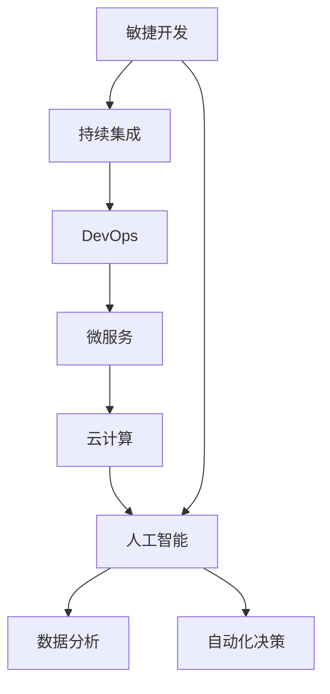

                 

# 快速学习:VUCA时代的制胜法宝

> 关键词：敏捷开发,持续集成(CI),DevOps,微服务,云计算,人工智能(AI)

## 1. 背景介绍

在VUCA（动态、不确定、复杂、模糊）的时代，快速学习和敏捷响应变得尤为重要。敏捷开发、持续集成、DevOps、微服务、云计算、人工智能等技术成为了企业保持竞争力的核心要素。然而，技术栈的多样化和复杂性也带来了挑战，需要全面理解和掌握这些技术，才能更好地应对不确定性。

本文旨在帮助读者深入理解VUCA时代下的制胜法宝，探讨如何快速学习新技术，并在实际工作中灵活应用这些技术，从而实现高效开发和快速迭代。

## 2. 核心概念与联系

### 2.1 核心概念概述

在深入分析之前，先明确几个核心概念：

- **敏捷开发(Agile Development)**：一种以客户为中心、迭代式、增量式的开发方法，注重快速响应变化和灵活应对需求。

- **持续集成(Continuous Integration, CI)**：将代码提交到版本控制系统后，自动运行一系列自动化测试，确保每次提交的代码都经过严格测试，保证软件质量。

- **DevOps**：一种强调协作、自动化、持续交付和持续监控的文化和实践，致力于缩短软件开发周期和提升系统稳定性。

- **微服务(Microservices)**：将复杂的应用拆分为多个小型、独立的服务单元，每个服务单元独立部署、开发和运维。

- **云计算(Cloud Computing)**：利用互联网提供计算资源和平台服务，包括IaaS、PaaS和SaaS等，实现高效资源利用和灵活扩展。

- **人工智能(Artificial Intelligence, AI)**：模拟人类智能过程的技术，包括机器学习、深度学习、自然语言处理等。

这些概念之间存在紧密联系，共同构成了快速学习的基础。敏捷开发和DevOps强调快速迭代和协作，云计算提供高效的基础设施，微服务提升了系统的可维护性和可扩展性，而人工智能技术则助力数据分析和自动化决策。

### 2.2 核心概念原理和架构的 Mermaid 流程图(Mermaid 流程节点中不要有括号、逗号等特殊字符)



此流程图展示了各核心概念之间的关系：敏捷开发是基础，通过持续集成和DevOps进行快速迭代和自动化，微服务提升了系统的可维护性和可扩展性，云计算提供了高效的基础设施，而人工智能通过数据分析和自动化决策赋能企业。

## 3. 核心算法原理 & 具体操作步骤

### 3.1 算法原理概述

快速学习在VUCA时代的重要性在于能够迅速掌握新技能，并将其应用于实际工作中，以应对不断变化的环境。快速学习的核心在于知识的高效获取和应用，这包括选择合适的学习资源、构建高效的学习流程、掌握科学的学習方法等。

### 3.2 算法步骤详解

以下是快速学习的详细步骤：

1. **需求分析**：明确学习目标，识别需要掌握的技能和知识领域。
2. **选择资源**：基于需求选择适合的教材、课程、文档等学习资源。
3. **制定计划**：根据资源和学习目标，制定详细的学习计划，包括时间安排、学习任务和评估标准。
4. **实践练习**：通过实际操作和项目实践，巩固理论知识，掌握新技能。
5. **反馈调整**：通过自我评估和他人反馈，调整学习计划和策略，优化学习效果。
6. **持续学习**：保持学习的连续性和积累性，不断更新和扩展知识体系。

### 3.3 算法优缺点

快速学习的优点在于：

- **高效性**：通过系统化的学习计划和资源选择，避免时间浪费，快速掌握新技能。
- **实用性**：学习过程中结合实际项目和任务，确保学以致用。
- **灵活性**：学习计划和资源可以根据实际情况进行调整，适应不同学习需求。

快速学习的缺点在于：

- **初始门槛高**：需要具备一定的自学能力和信息筛选能力，不适合所有人。
- **缺乏指导**：完全自主学习，容易偏离学习目标，缺乏有效指导。
- **知识碎片化**：若未系统化构建知识体系，容易形成知识碎片，难以形成系统性的认知。

### 3.4 算法应用领域

快速学习的应用领域广泛，包括但不限于：

- **软件开发**：快速学习新技术，如敏捷开发、持续集成、DevOps、微服务等，提升开发效率和软件质量。
- **数据分析**：通过快速学习数据分析和人工智能技术，提升数据处理和应用能力。
- **云计算**：掌握云计算基础架构和服务，实现高效资源利用和灵活扩展。
- **业务转型**：通过快速学习新领域的知识，实现企业业务转型和数字化升级。

## 4. 数学模型和公式 & 详细讲解 & 举例说明

### 4.1 数学模型构建

在快速学习的过程中，数学模型和公式的应用非常关键。以机器学习为例，构建一个简单的线性回归模型：

设训练样本集为 $(x_i, y_i)$，其中 $x_i \in \mathbb{R}^n$ 为特征向量，$y_i \in \mathbb{R}$ 为标签，模型目标为最小化预测误差：

$$
\min_{\theta} \sum_{i=1}^N (y_i - \theta \cdot x_i)^2
$$

其中 $\theta$ 为模型参数，包含权重和偏置。

### 4.2 公式推导过程

对于线性回归模型，其梯度下降更新公式为：

$$
\theta_{t+1} = \theta_t - \eta \nabla_{\theta} \mathcal{L}(\theta)
$$

其中 $\eta$ 为学习率，$\nabla_{\theta} \mathcal{L}(\theta)$ 为损失函数 $\mathcal{L}$ 对 $\theta$ 的梯度。在实际应用中，通常使用均方误差损失函数，其梯度为：

$$
\nabla_{\theta} \mathcal{L}(\theta) = \frac{2}{N} \sum_{i=1}^N (y_i - \theta \cdot x_i) x_i
$$

通过不断迭代更新 $\theta$，直到损失函数最小化，模型即可用于预测。

### 4.3 案例分析与讲解

以线性回归模型为例，分析其在快速学习中的应用。

1. **需求分析**：需要掌握线性回归模型的理论基础和实现方法。
2. **选择资源**：选择相关的教材、在线课程和示例代码。
3. **制定计划**：设定学习目标，如掌握模型理论、实现代码、应用实例等。
4. **实践练习**：通过编程实现线性回归模型，并在实际数据集上测试模型效果。
5. **反馈调整**：通过误差分析和学习效果评估，调整学习策略和代码实现。
6. **持续学习**：持续关注最新研究进展，更新模型实现和应用场景。

## 5. 项目实践：代码实例和详细解释说明

### 5.1 开发环境搭建

开发环境搭建是快速学习的基础，通常包括以下步骤：

1. **安装Python**：从官网下载并安装Python，并配置环境变量。
2. **安装依赖库**：使用pip安装必要的依赖库，如NumPy、Pandas、Matplotlib等。
3. **设置IDE**：选择适合的开发IDE，如PyCharm、Visual Studio Code等。
4. **版本控制**：安装Git和GitHub Desktop，学习基本版本控制命令。

### 5.2 源代码详细实现

以线性回归模型为例，使用Python实现模型训练和测试：

```python
import numpy as np

class LinearRegression:
    def __init__(self, learning_rate=0.01, n_iterations=1000):
        self.learning_rate = learning_rate
        self.n_iterations = n_iterations
        self.weights = None
        self.bias = None
    
    def fit(self, X, y):
        n_samples, n_features = X.shape
        self.weights = np.zeros(n_features)
        self.bias = 0
        
        for _ in range(self.n_iterations):
            y_pred = np.dot(X, self.weights) + self.bias
            dw = (1/n_samples) * np.dot(X.T, (y_pred - y))
            db = (1/n_samples) * np.sum(y_pred - y)
            self.weights -= self.learning_rate * dw
            self.bias -= self.learning_rate * db
    
    def predict(self, X):
        return np.dot(X, self.weights) + self.bias
```

### 5.3 代码解读与分析

在上述代码中，我们定义了一个简单的线性回归模型类，包含`fit`和`predict`方法。

- `fit`方法用于模型训练，通过梯度下降更新模型参数。
- `predict`方法用于模型预测，根据训练好的模型参数进行数据预测。

### 5.4 运行结果展示

通过以下代码，可以使用上述模型对数据集进行训练和预测：

```python
# 生成随机数据
X = np.random.randn(100, 2)
y = np.dot(X, np.array([1, 2])) + np.random.randn(100) * 0.1

# 训练模型
model = LinearRegression()
model.fit(X, y)

# 测试模型
test_X = np.array([[0, 0], [1, 1]])
print(model.predict(test_X))
```

输出结果展示了模型对测试数据的预测结果，验证了模型的训练效果。

## 6. 实际应用场景

### 6.1 软件开发

敏捷开发和DevOps在软件开发中的应用，能够快速响应需求变化，提升软件质量和交付效率。例如，一个敏捷开发团队可以使用JIRA管理任务，通过持续集成工具Jenkins自动化测试和部署，提升开发效率和软件稳定性。

### 6.2 数据分析

云计算平台如AWS、Google Cloud、Azure等，提供了丰富的数据处理和分析工具，如S3、Elastic MapReduce、Spark等，使得数据分析变得高效和便捷。AI技术如TensorFlow、PyTorch等，可以应用于机器学习和深度学习任务，提升数据分析的智能性。

### 6.3 业务转型

微服务架构的应用，使企业能够快速构建和部署新功能，提升业务响应速度和灵活性。云计算平台提供的弹性计算资源，可以满足业务扩容和削峰需求。通过敏捷开发和DevOps实践，企业可以快速迭代和优化业务功能。

### 6.4 未来应用展望

未来，随着技术的不断进步，快速学习的应用将更加广泛和深入。例如，基于自然语言处理和计算机视觉的AI技术，将助力自动化决策和智能化应用。区块链和边缘计算技术，将提升数据安全和处理效率。量子计算和神经网络的研究，将拓展计算能力和算法边界。

## 7. 工具和资源推荐

### 7.1 学习资源推荐

- **《敏捷开发：原则、模式与实践》**：Ericson著，介绍了敏捷开发的核心理念和方法。
- **《持续集成：开发自动化实践》**：James Newcomer著，详细讲解了持续集成和DevOps的最佳实践。
- **《微服务：构建可部署的分布式系统》**：Sam Newman著，介绍了微服务架构的设计和实施。
- **《云计算：概念与技术》**：Neville Garg著，系统讲解了云计算的基础和应用。
- **《深度学习》**：Ian Goodfellow、Yoshua Bengio和Aaron Courville著，深入介绍了深度学习理论和技术。

### 7.2 开发工具推荐

- **Git和GitHub**：版本控制工具，支持分布式协作开发。
- **JIRA和Confluence**：项目管理工具，支持敏捷开发和任务管理。
- **Jenkins**：持续集成工具，支持自动化测试和部署。
- **Docker**：容器化平台，支持跨环境部署和运行。
- **Kubernetes**：容器编排工具，支持微服务部署和管理。

### 7.3 相关论文推荐

- **《敏捷软件开发：原则、模式与实践》**：Martin Fowler著，介绍敏捷开发的核心理念和方法。
- **《持续集成：开发自动化实践》**：James Newcomer著，讲解持续集成和DevOps的最佳实践。
- **《微服务架构：设计、部署和运维》**：Sam Newman著，介绍微服务架构的设计和实施。
- **《云计算基础架构》**：Neville Garg著，系统讲解云计算的基础和应用。
- **《深度学习》**：Ian Goodfellow、Yoshua Bengio和Aaron Courville著，深入介绍了深度学习理论和技术。

## 8. 总结：未来发展趋势与挑战

### 8.1 研究成果总结

快速学习在VUCA时代的重要性不言而喻，其核心在于高效掌握新技能并应用于实际工作中。敏捷开发、持续集成、DevOps、微服务、云计算、人工智能等技术，共同构成了快速学习的核心框架。

### 8.2 未来发展趋势

未来，快速学习的应用将更加广泛和深入：

- **自动化和智能化**：AI技术如自然语言处理和计算机视觉，将提升数据分析和自动化决策能力。
- **分布式和弹性**：云计算和边缘计算，将提供高效、弹性的计算和存储资源。
- **安全和隐私**：区块链和加密技术，将提升数据安全和隐私保护。
- **普适化和智能化**：量子计算和神经网络的研究，将拓展计算能力和算法边界。

### 8.3 面临的挑战

快速学习在推广应用过程中，也面临诸多挑战：

- **技术复杂性**：新技术的多样性和复杂性，需要全面理解和掌握。
- **资源需求高**：高效应用这些技术，需要投入大量计算和人力资源。
- **数据质量差**：数据分析和AI应用，依赖高质量的数据，数据质量差会影响模型效果。
- **人才匮乏**：具备多技术栈和跨领域能力的人才，相对匮乏。

### 8.4 研究展望

未来，快速学习的研究方向可能包括：

- **自动化学习路径**：开发智能推荐系统，根据用户基础和学习进度，自动推荐学习路径和资源。
- **混合学习模式**：结合在线学习和线下培训，提供灵活、高效的学习体验。
- **跨领域融合**：将不同领域的技术进行深度融合，提升多技术栈的协同能力。
- **智能化评估**：开发智能评估工具，自动评估学习效果和反馈。

## 9. 附录：常见问题与解答

### Q1: 敏捷开发和Scrum有什么区别？

A: Scrum是敏捷开发的一种实践，注重团队协作和迭代式开发。Scrum定义了角色、事件和流程，确保敏捷开发的可操作性和可控性。敏捷开发是一种以客户为中心、快速迭代的开发方法，Scrum是其中的一种具体实现方式。

### Q2: 持续集成和持续部署的区别？

A: 持续集成（CI）是一种开发实践，通过自动化构建、测试和部署，确保每次代码提交都经过严格测试，提高软件质量。持续部署（CD）则在此基础上，自动化部署代码到生产环境，实现快速交付和持续交付。CI和CD是DevOps的重要组成部分，共同提升开发效率和软件稳定性。

### Q3: 微服务和单体应用有什么区别？

A: 单体应用将整个系统封装在一个进程中，代码和依赖都集中管理，简单易维护。微服务将系统拆分为多个小型、独立的服务单元，每个服务独立部署、开发和运维，灵活性高，但复杂度也相应增加。

### Q4: 云计算和边缘计算有什么区别？

A: 云计算将计算资源和存储资源集中管理，通过互联网提供服务，弹性资源管理和扩展性强。边缘计算则将计算资源部署到靠近数据源的设备上，提供低延迟、高带宽的数据处理能力，适用于物联网、工业互联网等场景。

### Q5: 人工智能和机器学习的区别？

A: 人工智能是模拟人类智能过程的技术，涵盖机器学习、自然语言处理、计算机视觉等多个领域。机器学习是AI的一个重要分支，通过数据训练模型，实现自动化的智能决策和预测。

