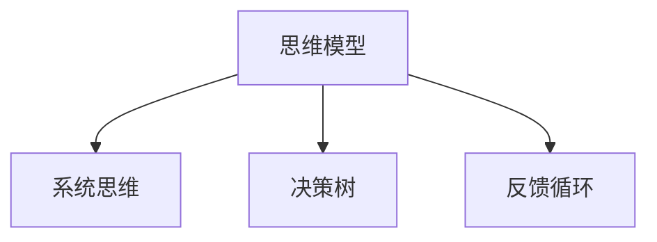
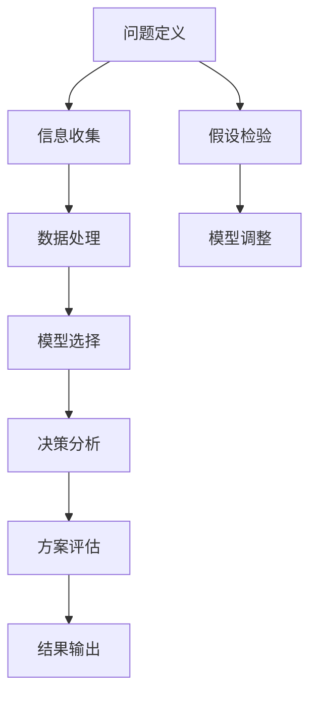

                 

## 1. 背景介绍

### 1.1 问题由来

在当今快速变化和信息过载的时代，个人和组织面临复杂的决策环境。如何高效地处理海量信息，做出明智的决策，成为摆在每一个决策者面前的难题。而传统的决策方式，如依赖直觉、依靠经验，已经难以应对日趋复杂的决策场景。

这一背景催生了“思维模型”的兴起。思维模型是一种结构化的分析框架，旨在帮助决策者快速把握问题的本质，高效解决问题，做出准确判断。思维模型不仅能提高理解力，还能提升决策能力，是现代决策者的必备工具。

### 1.2 问题核心关键点

思维模型的核心关键点在于其系统性和结构化特点：

- **系统性**：思维模型通常由一系列相互关联的元素组成，这些元素按照特定的逻辑结构组织起来，形成一个完整且封闭的系统。
- **结构化**：思维模型通过明确的框架和规则，引导决策者系统地分析问题，评估选项，最终做出决策。

这种系统性和结构化的特点，使得思维模型在处理复杂问题时具有显著的优势，帮助决策者在混乱的信息中理清头绪，制定出更加合理的决策方案。

## 2. 核心概念与联系

### 2.1 核心概念概述

为更好地理解思维模型的工作原理和应用方法，本节将介绍几个核心概念：

- **思维模型(Mental Models)**：是一种系统化的思维框架，用于帮助决策者快速把握问题的本质，高效解决问题。常见的思维模型包括五力模型、波特价值链、SWOT分析等。
- **系统思维(Systems Thinking)**：强调系统内各元素之间的相互依赖和影响，倡导从整体角度分析问题。
- **决策树(Decision Trees)**：一种树状结构，用于模型化决策过程，帮助决策者评估不同选择路径的后果。
- **反馈循环(Feedback Loops)**：系统内各元素之间通过不断的反馈和调整，维持系统的稳定性和适应性。

这些核心概念之间的逻辑关系可以通过以下Mermaid流程图来展示：



这个流程图展示了几大核心概念及其之间的关系：

1. 思维模型作为一种系统化的框架，以系统思维为指导，帮助决策者进行整体分析。
2. 决策树是思维模型中的重要工具，用于模型化决策过程。
3. 反馈循环则是系统内部的动态调整机制，帮助系统维持稳定性和适应性。

这些概念共同构成了思维模型的核心思想，指导着决策者系统地分析问题，做出准确判断。

### 2.2 核心概念原理和架构的 Mermaid 流程图



上述流程图展示了思维模型的一般流程：

1. 定义问题：明确决策目标，识别问题核心。
2. 收集信息：获取与问题相关的数据和信息。
3. 数据处理：清洗、整理数据，准备进行分析。
4. 模型选择：选择合适的思维模型，进行问题分析和解构。
5. 决策分析：根据模型推导出决策建议。
6. 方案评估：评估各方案的优劣，选择最佳方案。
7. 结果输出：根据方案制定具体行动计划。
8. 假设检验：通过实验和反馈调整模型，确保决策的有效性。

## 3. 核心算法原理 & 具体操作步骤

### 3.1 算法原理概述

思维模型通常依赖于一系列特定的分析框架和规则，帮助决策者系统地处理问题。其核心算法原理如下：

1. **问题定义**：明确决策目标，识别问题的关键因素。
2. **数据收集**：获取与问题相关的数据和信息。
3. **数据处理**：对数据进行清洗、整理、分析，提取关键特征。
4. **模型选择**：根据问题的性质选择合适的思维模型。
5. **决策分析**：根据模型推导出决策建议。
6. **方案评估**：评估各方案的优劣，选择最佳方案。
7. **结果输出**：根据方案制定具体行动计划。
8. **假设检验**：通过实验和反馈调整模型，确保决策的有效性。

### 3.2 算法步骤详解

以下以五力模型为例，详细介绍其操作步骤：

#### 3.2.1 问题定义

明确决策目标，识别问题核心。例如，假设某公司想要进入新市场，需要评估该市场的竞争力和盈利潜力。

#### 3.2.2 数据收集

获取与问题相关的数据和信息。对于新市场评估，需要收集该市场的销售额、市场规模、主要竞争对手、消费者需求等数据。

#### 3.2.3 数据处理

对数据进行清洗、整理、分析，提取关键特征。例如，计算主要竞争对手的市场份额，分析消费者需求的变化趋势。

#### 3.2.4 模型选择

选择合适的思维模型。五力模型适用于评估市场竞争环境，识别潜在的竞争威胁和机会。

#### 3.2.5 决策分析

根据模型推导出决策建议。通过五力模型，分析市场中供应商的议价能力、买家的议价能力、替代品威胁、新进入者的威胁以及现有竞争者的竞争程度。

#### 3.2.6 方案评估

评估各方案的优劣，选择最佳方案。根据五力模型的分析结果，评估进入该市场的风险和收益，选择最佳策略。

#### 3.2.7 结果输出

根据方案制定具体行动计划。例如，根据市场分析结果，制定市场进入策略，包括产品定位、价格策略、市场推广计划等。

#### 3.2.8 假设检验

通过实验和反馈调整模型，确保决策的有效性。例如，进行市场测试，验证市场进入策略的有效性，根据反馈调整策略。

### 3.3 算法优缺点

思维模型作为一种分析框架，具有以下优点：

1. **系统性**：通过系统化的分析，帮助决策者理清思路，避免遗漏关键因素。
2. **结构化**：提供清晰的分析流程和决策路径，提高决策的准确性和效率。
3. **可重复性**：思路和方法可重复使用，便于在类似问题上应用。

同时，思维模型也存在一些局限性：

1. **复杂度高**：设计和管理复杂的思维模型需要一定的专业知识和经验。
2. **静态性**：思维模型需要根据实际情况进行调整，保持动态更新。
3. **主观性强**：模型的选择和解读很大程度上依赖于决策者的经验和判断。

### 3.4 算法应用领域

思维模型广泛应用于多个领域，包括但不限于：

- **商业决策**：如市场进入策略、产品定价、供应链管理等。
- **项目管理**：如项目计划制定、风险评估、进度控制等。
- **技术创新**：如产品开发、技术选型、研发路线规划等。
- **财务分析**：如财务预算、投资决策、风险控制等。
- **人力资源**：如招聘策略、员工培训、绩效评估等。

## 4. 数学模型和公式 & 详细讲解 & 举例说明

### 4.1 数学模型构建

思维模型中的数学模型通常用于量化分析，帮助决策者进行数据驱动的决策。以下以决策树为例，介绍其数学模型构建方法。

### 4.2 公式推导过程

决策树的基本数学模型为：

$$
\text{Decision Tree} = \{ (T_0, O_0), (T_1, O_1), ..., (T_n, O_n) \}
$$

其中，$T_i$ 表示决策树的节点，$O_i$ 表示节点对应的输出结果。

### 4.3 案例分析与讲解

假设某公司想要评估新产品的市场潜力，构建如下决策树模型：

```
root
|        > 销售额 > 高
|           > 市场潜力 > 高
|                   > 进入市场 > 是
|                   |            > 广告投放 > 否
|                   |             > 调整价格 > 否
|                   |             |            > 研发新产品 > 否
|                   |             |              > 退出市场 > 是
|                   |             |              > 继续研发 > 否
|                   |             |               > 终止研发 > 是
|                   |             |               > 市场测试 > 否
|                   |              > 否
|                  > 销售额 > 低
|                       > 市场潜力 > 低
|                           > 进入市场 > 否
|                               > 调整策略 > 否
|                                > 退出市场 > 是
|                                > 继续研发 > 否
|                                 > 终止研发 > 是
|                                 > 市场测试 > 否
```

通过决策树，公司可以系统地分析不同销售额下，市场潜力的变化情况，评估不同策略的优劣，做出合理的决策。

## 5. 项目实践：代码实例和详细解释说明

### 5.1 开发环境搭建

在进行思维模型实践前，我们需要准备好开发环境。以下是Python环境下搭建开发环境的步骤：

1. 安装Anaconda：从官网下载并安装Anaconda，用于创建独立的Python环境。

2. 创建并激活虚拟环境：
```bash
conda create -n decision-tree python=3.8 
conda activate decision-tree
```

3. 安装必要的Python库：
```bash
pip install pandas matplotlib numpy scikit-learn sklearn-trees
```

4. 准备数据集：
```python
import pandas as pd
from sklearn.datasets import make_classification

X, y = make_classification(n_samples=1000, n_features=10, n_classes=2)
df = pd.DataFrame(X, columns=['feature_1', 'feature_2', 'feature_3', 'feature_4', 'feature_5', 'feature_6', 'feature_7', 'feature_8', 'feature_9', 'feature_10'])
df['label'] = y
```

### 5.2 源代码详细实现

接下来，我们以决策树为例，使用Python和scikit-learn库实现思维模型的计算过程。

```python
from sklearn.tree import DecisionTreeClassifier
from sklearn.model_selection import train_test_split
from sklearn.metrics import accuracy_score

# 划分训练集和测试集
X_train, X_test, y_train, y_test = train_test_split(df.drop('label', axis=1), df['label'], test_size=0.2, random_state=42)

# 构建决策树模型
clf = DecisionTreeClassifier()
clf.fit(X_train, y_train)

# 预测并评估模型
y_pred = clf.predict(X_test)
accuracy = accuracy_score(y_test, y_pred)
print(f"Accuracy: {accuracy:.2f}")
```

这段代码实现了简单的决策树模型构建、训练、预测和评估过程，展示了如何使用Python进行思维模型的开发。

### 5.3 代码解读与分析

让我们再详细解读一下关键代码的实现细节：

**数据处理**：
```python
# 使用make_classification生成随机数据
X, y = make_classification(n_samples=1000, n_features=10, n_classes=2)

# 将数据转换为DataFrame格式，方便处理
df = pd.DataFrame(X, columns=['feature_1', 'feature_2', 'feature_3', 'feature_4', 'feature_5', 'feature_6', 'feature_7', 'feature_8', 'feature_9', 'feature_10'])
df['label'] = y
```

这段代码使用了Python的pandas库生成随机数据，并将其转换为DataFrame格式，以便进行数据处理和分析。

**模型构建**：
```python
from sklearn.tree import DecisionTreeClassifier
clf = DecisionTreeClassifier()
```

这里使用scikit-learn库中的DecisionTreeClassifier类，构建了一个决策树模型。

**模型训练**：
```python
clf.fit(X_train, y_train)
```

这段代码使用训练集对模型进行训练，将特征和标签作为输入，训练出模型。

**模型评估**：
```python
y_pred = clf.predict(X_test)
accuracy = accuracy_score(y_test, y_pred)
```

这段代码使用测试集对模型进行预测，并计算预测结果与真实标签之间的准确率。

**结果输出**：
```python
print(f"Accuracy: {accuracy:.2f}")
```

这段代码输出模型的准确率，结果以浮点数格式显示，保留两位小数。

## 6. 实际应用场景

### 6.1 商业决策

在商业决策中，思维模型可以用于评估市场进入、产品定价、供应链管理等关键问题。例如，某公司想要进入新的市场，可以使用五力模型评估该市场的竞争环境和盈利潜力。

### 6.2 项目管理

在项目管理中，思维模型可以帮助制定项目计划、评估风险和进度控制。例如，使用甘特图模型可视化项目进度，使用PERT图模型评估关键路径。

### 6.3 技术创新

在技术创新中，思维模型可以用于产品开发、技术选型和研发路线规划。例如，使用技术成熟度模型评估技术方案的可行性和成熟度，使用创新扩散模型预测新技术的市场接受度。

### 6.4 财务分析

在财务分析中，思维模型可以用于财务预算、投资决策和风险控制。例如，使用现金流模型评估投资项目的回报率，使用财务风险模型评估企业的财务风险。

### 6.5 人力资源

在人力资源管理中，思维模型可以用于招聘策略、员工培训和绩效评估。例如，使用胜任力模型评估应聘者的胜任力，使用绩效模型评估员工的工作绩效。

## 7. 工具和资源推荐

### 7.1 学习资源推荐

为了帮助开发者系统掌握思维模型的理论和实践方法，这里推荐一些优质的学习资源：

1. **《决策分析与判断》**：这是一本经典的决策分析教材，详细介绍了各种思维模型的原理和应用。
2. **Coursera《数据科学基础》课程**：由斯坦福大学开设，系统讲解了数据科学和决策分析的基本概念和方法。
3. **Khan Academy《统计学与概率》课程**：详细介绍了统计学和概率论的基本原理，为思维模型提供了数学基础。
4. **《系统思考的艺术》**：这是一本系统思考的经典书籍，深入浅出地介绍了系统思考的方法和应用。
5. **思科《系统思考》课程**：由思科公司开设，通过实例展示了系统思考在实际项目中的应用。

通过学习这些资源，相信你一定能够系统掌握思维模型的理论和实践方法，并用于解决实际的决策问题。

### 7.2 开发工具推荐

高效的开发离不开优秀的工具支持。以下是几款用于思维模型开发的常用工具：

1. **Python**：作为一种通用的编程语言，Python具有丰富的库和框架，适合快速迭代研究和开发。
2. **R语言**：R语言在数据分析和统计方面具有强大的功能，适合处理复杂的数据分析任务。
3. **Power BI**：微软推出的数据可视化工具，可以快速创建交互式的报告和仪表盘，帮助决策者进行数据分析和可视化。
4. **Tableau**：一款流行的数据可视化工具，支持复杂的数据分析和可视化，提供直观的交互式界面。
5. **SAS**：SAS是一款商业统计分析软件，具有丰富的统计分析功能和强大的数据管理能力。

合理利用这些工具，可以显著提升思维模型开发的效率和效果。

### 7.3 相关论文推荐

思维模型的研究和应用是一个持续发展的领域，以下是几篇奠基性的相关论文，推荐阅读：

1. **《系统思维：一种新的管理思维方式》**：这篇文章介绍了系统思维的基本概念和应用方法，具有重要的理论意义。
2. **《决策树算法》**：这篇文章详细介绍了决策树算法的原理和实现，是思维模型中的重要工具。
3. **《创新扩散模型》**：这篇文章介绍了创新扩散模型的基本原理和应用，为技术创新提供了科学依据。
4. **《五力模型》**：这篇文章详细介绍了五力模型的原理和应用，是商业决策中的重要工具。
5. **《财务风险模型》**：这篇文章介绍了财务风险模型的基本原理和应用，为财务决策提供了科学依据。

这些论文代表了大模型微调技术的发展脉络。通过学习这些前沿成果，可以帮助研究者把握学科前进方向，激发更多的创新灵感。

## 8. 总结：未来发展趋势与挑战

### 8.1 总结

本文对思维模型在决策分析中的应用进行了全面系统的介绍。首先阐述了思维模型的研究背景和意义，明确了思维模型在提高理解力和决策能力方面的独特价值。其次，从原理到实践，详细讲解了决策树等思维模型的数学原理和操作步骤，给出了具体的应用案例。同时，本文还探讨了思维模型在商业决策、项目管理、技术创新、财务分析等多个领域的应用前景，展示了思维模型在解决实际问题中的强大能力。此外，本文还精选了思维模型的各类学习资源，力求为读者提供全方位的技术指引。

通过本文的系统梳理，可以看到，思维模型作为一种系统化的分析框架，在处理复杂问题时具有显著的优势，帮助决策者在混乱的信息中理清思路，制定出更加合理的决策方案。未来，伴随决策技术的发展和普及，思维模型必将在更多领域得到应用，为决策者提供科学、高效的工具支持。

### 8.2 未来发展趋势

展望未来，思维模型将呈现以下几个发展趋势：

1. **智能化**：未来的思维模型将与人工智能技术进一步融合，实现自动化的决策分析和预测，提高决策的准确性和效率。
2. **可视化**：更多的思维模型将具备可视化界面，通过直观的图表展示分析结果，帮助决策者更好地理解和应用模型。
3. **集成化**：未来的思维模型将与其他决策支持系统（DSS）集成，形成统一、高效的多源数据融合平台。
4. **定制化**：根据不同的决策场景和需求，定制化设计思维模型，提供个性化的决策支持服务。
5. **集成化**：未来的思维模型将与其他决策支持系统（DSS）集成，形成统一、高效的多源数据融合平台。

这些趋势将使得思维模型在决策支持领域发挥更大的作用，帮助决策者更好地理解和应用复杂的决策问题。

### 8.3 面临的挑战

尽管思维模型在决策分析中已经取得了显著成效，但在迈向更加智能化、集成化、定制化的应用过程中，它仍面临诸多挑战：

1. **数据质量问题**：数据质量直接影响到模型的准确性和可靠性，低质量的数据会导致模型失效。
2. **模型复杂性**：复杂性高的思维模型需要大量的专业知识和经验，难以推广应用。
3. **模型解释性**：一些高级模型（如深度学习模型）缺乏解释性，难以满足高风险应用的需求。
4. **模型可维护性**：复杂的思维模型难以维护，需要持续更新和迭代。
5. **模型适用性**：思维模型需要根据实际问题进行调整和优化，难以泛化应用。

这些挑战需要通过不断的研究和实践，逐步克服。

### 8.4 研究展望

未来的研究需要在以下几个方面寻求新的突破：

1. **数据质量管理**：建立数据质量管理体系，提高数据的准确性和可靠性，保障模型效果。
2. **模型自动化**：开发自动化的模型训练和优化工具，降低模型的复杂性和维护难度。
3. **模型解释性**：引入可解释性技术，增强模型的透明性和可信度。
4. **模型集成化**：将思维模型与其他决策支持系统集成，形成统一、高效的多源数据融合平台。
5. **模型定制化**：根据不同的决策场景和需求，定制化设计思维模型，提供个性化的决策支持服务。

这些研究方向的探索，必将引领思维模型在决策支持领域迈向更高的台阶，为决策者提供更加科学、高效的工具支持。

## 9. 附录：常见问题与解答

**Q1: 如何选择合适的思维模型？**

A: 选择合适的思维模型需要考虑问题的性质和复杂性。一般来说，简单的决策问题可以使用决策树、SWOT分析等模型；复杂的决策问题则需要使用系统思维、五力模型等更为复杂的模型。

**Q2: 如何评估思维模型的效果？**

A: 评估思维模型的效果通常通过交叉验证和对比实验来实现。例如，使用决策树模型时，可以通过计算模型的准确率、召回率和F1分数来评估其性能。

**Q3: 如何处理不确定性和风险？**

A: 处理不确定性和风险需要使用概率模型和风险评估模型。例如，使用蒙特卡罗模拟来评估决策的不确定性，使用敏感性分析来评估决策的风险。

**Q4: 如何处理多目标决策问题？**

A: 处理多目标决策问题需要使用多目标优化模型，如Pareto最优模型、层次分析模型等。这些模型能够同时考虑多个目标，找到最优的决策方案。

**Q5: 如何处理动态变化的环境？**

A: 处理动态变化的环境需要使用动态系统模型，如动态规划模型、预测模型等。这些模型能够根据环境变化，实时调整决策策略。

通过这些问题和解答，相信你一定能够更好地理解和应用思维模型，提升决策的科学性和有效性。

---

作者：禅与计算机程序设计艺术 / Zen and the Art of Computer Programming

