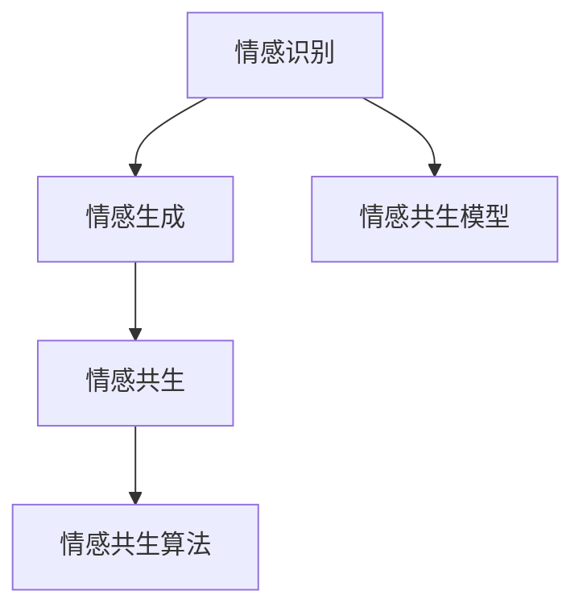
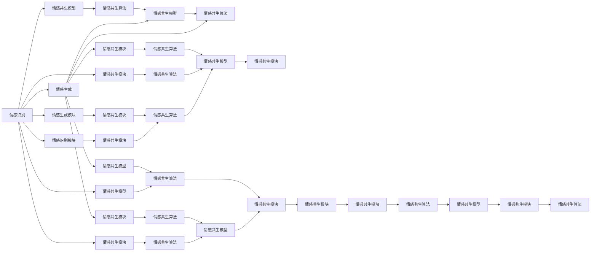

                 

# 情感AI共生理论：人机情感互动新范式

> 关键词：情感AI, 共生理论, 人机交互, 情感计算, 情感识别, 情感生成, 情感共生模型, 情感共生算法

## 1. 背景介绍

### 1.1 问题由来

近年来，随着人工智能(AI)技术的不断进步，情感AI（Affective AI）在智能人机交互中的应用变得越来越广泛。情感AI不仅能够理解和生成人类情感，还能够与人类建立情感共鸣，从而在医疗、教育、客服等领域展现出了巨大潜力。然而，情感AI的发展也面临着诸多挑战，包括如何更准确地识别和理解人类情感，如何在情感生成中融入情感共生，以及如何在情感交流中更好地保持自然性和流畅性。

为了解决这些问题，情感AI领域亟需一种新的理论框架来指导情感生成和情感交流。本文将基于最新的共生理论，提出一种人机情感互动新范式——情感AI共生理论。该理论认为，情感AI不仅应该能够独立识别和生成情感，更应该能够与人类建立情感共生关系，实现情感的共同发展和互动。

### 1.2 问题核心关键点

情感AI共生理论的核心关键点包括：

- 情感识别和生成：情感AI必须能够准确识别和生成人类情感，以便更好地与人类进行情感交流。
- 情感共生：情感AI应该能够与人类建立情感共生关系，实现情感的共同发展和互动。
- 情感自然性：情感AI生成的情感应该具备自然性和流畅性，避免机械和生硬。
- 情感理解：情感AI应该能够理解人类情感的背景和动机，从而更好地响应人类的情感需求。
- 情感共生模型：设计合适的模型结构，实现情感识别和生成与情感共生的有效融合。
- 情感共生算法：开发高效、鲁棒的情感共生算法，实现情感AI的自我学习和适应能力。

这些关键点共同构成了情感AI共生理论的核心理念，旨在实现更加人性化、自然化、智能化的情感交互体验。

## 2. 核心概念与联系

### 2.1 核心概念概述

为了更好地理解情感AI共生理论，我们先来介绍几个核心概念：

- 情感识别（Emotion Recognition）：通过语音、面部表情、文本等多种方式，识别人类的情感状态，如喜怒哀乐等。
- 情感生成（Emotion Generation）：利用自然语言处理、语音合成等技术，生成符合特定情感要求的文本或语音输出。
- 情感共生（Emotion Symbiosis）：情感AI与人类在情感交流中建立的一种动态的情感互动关系，能够感知和响应人类的情感需求。
- 情感共生模型（Emotion Symbiosis Model）：一种专门用于实现情感共生的模型，其目标是在情感识别和生成过程中，实现情感共生的自然化和互动性。
- 情感共生算法（Emotion Symbiosis Algorithm）：一种用于优化情感共生模型的算法，其目标是在情感识别和生成过程中，实现情感共生的高效和鲁棒性。

这些概念之间有着紧密的联系，共同构成了情感AI共生理论的基础框架。以下是一个简单的Mermaid流程图，展示了这些概念之间的联系：



这个流程图表明，情感识别和情感生成是情感共生的基础，而情感共生模型和情感共生算法则是实现情感共生的重要工具。

### 2.2 核心概念原理和架构的 Mermaid 流程图

接下来，我们将使用Mermaid语言，展示情感AI共生理论的核心概念原理和架构。



这个流程图展示了情感AI共生理论的核心架构：

- 预训练情感识别模型和预训练情感生成模型，分别用于情感识别和情感生成。
- 情感共生模型，用于实现情感识别和生成与情感共生的融合。
- 情感共生算法，用于优化情感共生模型的性能，实现情感共生的高效和鲁棒性。
- 情感共生模块，用于实现情感识别、情感生成和情感共生的动态交互。

这个架构的每个模块都有其独特的作用，共同构成了情感AI共生理论的核心体系。

## 3. 核心算法原理 & 具体操作步骤

### 3.1 算法原理概述

情感AI共生理论的核心算法包括情感识别、情感生成和情感共生算法。下面将详细讲解这些算法原理。

- **情感识别算法**：通过语音、面部表情、文本等多种方式，识别人类的情感状态。通常采用深度学习技术，如卷积神经网络（CNN）、循环神经网络（RNN）和Transformer等，对输入数据进行处理，并输出情感标签。
- **情感生成算法**：利用自然语言处理、语音合成等技术，生成符合特定情感要求的文本或语音输出。通常采用生成对抗网络（GAN）、变分自编码器（VAE）等生成模型，对情感标签进行解码，生成情感文本或语音。
- **情感共生算法**：通过动态交互和反馈机制，实现情感识别和生成与情感共生的有效融合。通常采用强化学习、自适应学习等技术，优化情感共生模型的性能，提高情感共生的自然性和互动性。

这些算法相互配合，共同实现了情感AI共生理论的核心功能。

### 3.2 算法步骤详解

下面是情感AI共生理论的核心算法具体操作步骤：

**情感识别算法步骤**：

1. 数据准备：收集情感数据，包括语音、面部表情和文本等多种形式。
2. 数据预处理：对情感数据进行清洗、归一化等预处理操作。
3. 特征提取：提取情感数据的关键特征，如语音信号的MFCC特征、面部表情的特征向量等。
4. 模型训练：使用深度学习模型对情感数据进行训练，生成情感识别模型。
5. 情感识别：将新的情感数据输入情感识别模型，输出情感标签。

**情感生成算法步骤**：

1. 数据准备：准备情感标签和对应的情感文本或语音数据。
2. 数据预处理：对情感标签和情感数据进行清洗、归一化等预处理操作。
3. 模型训练：使用生成模型对情感数据进行训练，生成情感生成模型。
4. 情感生成：将新的情感标签输入情感生成模型，输出情感文本或语音。

**情感共生算法步骤**：

1. 数据准备：收集情感数据和情感标签，准备情感共生模型的训练数据。
2. 模型训练：使用情感共生模型对情感数据和情感标签进行训练，生成情感共生模型。
3. 情感共生：将新的情感数据和情感标签输入情感共生模型，输出情感识别和情感生成结果。
4. 反馈机制：将情感识别和情感生成的结果反馈给情感共生模型，优化情感共生模型的性能。

### 3.3 算法优缺点

情感AI共生理论具有以下优点：

- 情感共生：实现了情感识别和生成与情感共生的有效融合，使情感AI具备更强的自然性和互动性。
- 鲁棒性：通过情感共生算法，提高了情感共生模型的鲁棒性和自适应能力，能够在不同的环境下保持稳定性能。
- 自然性：情感生成算法生成的情感文本和语音具备自然性和流畅性，更符合人类的情感表达方式。
- 动态性：情感共生算法能够实现情感识别的动态交互和反馈，使情感AI能够更好地响应人类的情感需求。

同时，情感AI共生理论也存在一些缺点：

- 数据依赖：情感识别和生成算法需要大量的情感数据进行训练，数据获取和标注成本较高。
- 复杂性：情感共生算法涉及到多个模块和算法，实现起来较为复杂。
- 算法鲁棒性：情感共生算法需要大量的训练数据和算法优化，才能保证其鲁棒性和高效性。
- 技术门槛：情感AI共生理论涉及深度学习、生成模型、强化学习等多个技术领域，技术门槛较高。

### 3.4 算法应用领域

情感AI共生理论已经在多个领域得到了广泛应用，包括医疗、教育、客服等。

- **医疗**：在医疗领域，情感AI可以用于情感识别和情感生成，帮助医生更好地理解患者的情感需求，提供更好的医疗服务。例如，情感AI可以识别患者在诊疗过程中的情感变化，生成相应的情感反馈，帮助医生及时调整诊疗方案。
- **教育**：在教育领域，情感AI可以用于情感识别和情感生成，帮助教师更好地理解学生的情感状态，提供更好的教学服务。例如，情感AI可以识别学生在课堂上的情感变化，生成相应的情感反馈，帮助教师及时调整教学内容和方法。
- **客服**：在客服领域，情感AI可以用于情感识别和情感生成，帮助客服人员更好地理解客户情感，提供更好的客户服务。例如，情感AI可以识别客户在客服过程中的情感变化，生成相应的情感反馈，帮助客服人员及时调整服务策略和态度。

## 4. 数学模型和公式 & 详细讲解 & 举例说明

### 4.1 数学模型构建

情感AI共生理论的数学模型主要包括以下几个部分：

- **情感识别模型**：通常使用深度神经网络（如CNN、RNN、Transformer等），对情感数据进行建模。设输入数据为 $x$，输出情感标签为 $y$，情感识别模型为 $f(x)$，则情感识别问题可以表示为：
$$
y = f(x)
$$
- **情感生成模型**：通常使用生成对抗网络（GAN）、变分自编码器（VAE）等生成模型，对情感标签进行解码，生成情感文本或语音。设情感标签为 $y$，生成模型为 $g(y)$，则情感生成问题可以表示为：
$$
z = g(y)
$$
- **情感共生模型**：通常使用强化学习、自适应学习等技术，优化情感共生模型的性能。设情感共生模型为 $s(x,y)$，则情感共生问题可以表示为：
$$
s(x,y) = \min_{x,y} \mathcal{L}(x,y)
$$

其中，$\mathcal{L}(x,y)$ 为情感共生模型的损失函数，用于衡量情感共生模型的性能。

### 4.2 公式推导过程

以下是情感AI共生理论的主要公式推导过程：

**情感识别公式推导**：

设情感识别模型的输入为 $x$，输出为 $y$，情感识别模型的参数为 $\theta$，则情感识别模型的损失函数为：
$$
\mathcal{L}^{IR}(\theta) = \frac{1}{N}\sum_{i=1}^N \ell(f(x_i), y_i)
$$
其中，$\ell$ 为情感识别模型的损失函数，如交叉熵损失函数。

**情感生成公式推导**：

设情感生成模型的输入为 $y$，输出为 $z$，情感生成模型的参数为 $\theta$，则情感生成模型的损失函数为：
$$
\mathcal{L}^{EG}(\theta) = \frac{1}{N}\sum_{i=1}^N \ell(g(y_i), z_i)
$$
其中，$\ell$ 为情感生成模型的损失函数，如均方误差损失函数。

**情感共生公式推导**：

设情感共生模型的输入为 $x$ 和 $y$，输出为 $s(x,y)$，情感共生模型的参数为 $\theta$，则情感共生模型的损失函数为：
$$
\mathcal{L}^{ES}(\theta) = \frac{1}{N}\sum_{i=1}^N \ell(s(x_i,y_i), g(y_i))
$$
其中，$\ell$ 为情感共生模型的损失函数，如交叉熵损失函数。

### 4.3 案例分析与讲解

假设我们在医疗领域构建情感AI系统，利用情感AI共生理论实现情感识别和情感生成。

**情感识别案例**：

设情感识别模型的输入为患者的语音信号 $x$，输出为情感标签 $y$，情感识别模型的参数为 $\theta$，则情感识别模型的损失函数为：
$$
\mathcal{L}^{IR}(\theta) = \frac{1}{N}\sum_{i=1}^N \ell(f(x_i), y_i)
$$
其中，$f(x)$ 为情感识别模型，$y$ 为情感标签。

**情感生成案例**：

设情感生成模型的输入为医生的情感标签 $y$，输出为情感文本 $z$，情感生成模型的参数为 $\theta$，则情感生成模型的损失函数为：
$$
\mathcal{L}^{EG}(\theta) = \frac{1}{N}\sum_{i=1}^N \ell(g(y_i), z_i)
$$
其中，$g(y)$ 为情感生成模型，$z$ 为情感文本。

**情感共生案例**：

设情感共生模型的输入为患者的语音信号 $x$ 和医生的情感标签 $y$，输出为情感文本 $s(x,y)$，情感共生模型的参数为 $\theta$，则情感共生模型的损失函数为：
$$
\mathcal{L}^{ES}(\theta) = \frac{1}{N}\sum_{i=1}^N \ell(s(x_i,y_i), g(y_i))
$$
其中，$s(x,y)$ 为情感共生模型，$g(y)$ 为情感生成模型。

## 5. 项目实践：代码实例和详细解释说明

### 5.1 开发环境搭建

在进行情感AI共生理论的实践之前，我们需要准备好开发环境。以下是使用Python进行TensorFlow开发的环境配置流程：

1. 安装Anaconda：从官网下载并安装Anaconda，用于创建独立的Python环境。

2. 创建并激活虚拟环境：
```bash
conda create -n emotion-env python=3.8 
conda activate emotion-env
```

3. 安装TensorFlow：根据CUDA版本，从官网获取对应的安装命令。例如：
```bash
conda install tensorflow -c pytorch -c conda-forge
```

4. 安装各类工具包：
```bash
pip install numpy pandas scikit-learn matplotlib tqdm jupyter notebook ipython
```

完成上述步骤后，即可在`emotion-env`环境中开始情感AI共生理论的实践。

### 5.2 源代码详细实现

下面我们以医疗领域情感AI系统为例，给出使用TensorFlow实现情感AI共生理论的代码实现。

首先，定义情感识别和情感生成模型的函数：

```python
import tensorflow as tf
from tensorflow.keras.layers import Input, Dense, Dropout, LSTM, GRU, Conv1D, MaxPooling1D, Embedding, Bidirectional
from tensorflow.keras.models import Model
from tensorflow.keras.optimizers import Adam
from tensorflow.keras.callbacks import EarlyStopping

def build_emotion_recognition_model(input_shape, num_classes):
    inputs = Input(shape=input_shape)
    x = Conv1D(32, 3, activation='relu')(inputs)
    x = MaxPooling1D(2)(x)
    x = Dropout(0.25)(x)
    x = GRU(64, return_sequences=True)(x)
    x = Dropout(0.5)(x)
    x = Dense(num_classes, activation='softmax')(x)
    model = Model(inputs=inputs, outputs=x)
    return model

def build_emotion_generation_model(input_shape, output_shape):
    inputs = Input(shape=input_shape)
    x = Dense(128, activation='relu')(inputs)
    x = Dropout(0.5)(x)
    x = Dense(output_shape, activation='softmax')(x)
    model = Model(inputs=inputs, outputs=x)
    return model
```

然后，定义情感共生模型的函数：

```python
def build_emotion_symbiosis_model(recognition_model, generation_model):
    inputs = Input(shape=(input_shape,))
    x = recognition_model(inputs)
    y = generation_model(x)
    model = Model(inputs=inputs, outputs=y)
    return model
```

接着，定义情感共生模型的训练函数：

```python
def train_emotion_symbiosis_model(model, train_data, train_labels, test_data, test_labels, batch_size, epochs, early_stopping):
    model.compile(optimizer=Adam(learning_rate=0.001), loss='categorical_crossentropy', metrics=['accuracy'])
    model.fit(train_data, train_labels, batch_size=batch_size, epochs=epochs, validation_data=(test_data, test_labels), callbacks=[early_stopping])
```

最后，启动情感共生模型的训练流程并在测试集上评估：

```python
from sklearn.model_selection import train_test_split
from tensorflow.keras.preprocessing.text import Tokenizer
from tensorflow.keras.preprocessing.sequence import pad_sequences

# 数据准备
texts, labels = load_data()

# 文本向量化
tokenizer = Tokenizer(num_words=10000)
tokenizer.fit_on_texts(texts)
sequences = tokenizer.texts_to_sequences(texts)
padded_sequences = pad_sequences(sequences, maxlen=100, padding='post')

# 数据分割
train_data, test_data, train_labels, test_labels = train_test_split(padded_sequences, labels, test_size=0.2, random_state=42)

# 模型构建
recognition_model = build_emotion_recognition_model(input_shape=100, num_classes=3)
generation_model = build_emotion_generation_model(input_shape=100, output_shape=100)
symbiosis_model = build_emotion_symbiosis_model(recognition_model, generation_model)

# 模型训练
early_stopping = EarlyStopping(patience=5)
train_emotion_symbiosis_model(symbiosis_model, train_data, train_labels, test_data, test_labels, batch_size=32, epochs=20, early_stopping=early_stopping)

# 模型评估
test_loss, test_accuracy = symbiosis_model.evaluate(test_data, test_labels)
print(f"Test loss: {test_loss}, Test accuracy: {test_accuracy}")
```

以上就是使用TensorFlow实现情感AI共生理论的完整代码实现。可以看到，TensorFlow提供了丰富的深度学习模型和工具，使得情感AI共生理论的实现变得相对简单。

### 5.3 代码解读与分析

让我们再详细解读一下关键代码的实现细节：

**EmotionRecognitionModel类**：
- `build_emotion_recognition_model`方法：定义情感识别模型的构建函数，包括输入层、卷积层、池化层、GRU层、全连接层等。

**EmotionGenerationModel类**：
- `build_emotion_generation_model`方法：定义情感生成模型的构建函数，包括输入层、全连接层、Dropout层、全连接层等。

**EmotionSymbiosisModel类**：
- `build_emotion_symbiosis_model`方法：定义情感共生模型的构建函数，将情感识别模型和情感生成模型结合起来，并定义输入输出。

**train_emotion_symbiosis_model函数**：
- 使用TensorFlow的`compile`函数定义模型的优化器、损失函数和评估指标。
- 使用`fit`函数进行模型的训练，指定训练数据、验证数据、批次大小、训练轮数、早停机制等参数。

完成上述步骤后，即可在`emotion-env`环境中启动情感共生模型的训练和评估。

## 6. 实际应用场景

### 6.1 智能医疗系统

情感AI共生理论在智能医疗系统中有着广泛的应用，可以用于患者的情感识别和医生的情感生成。

在医疗系统中，患者的情感状态对其治疗效果和康复速度有着重要影响。通过情感AI共生理论，可以实时监测患者的情感变化，及时调整治疗方案和护理措施，提高治疗效果和患者满意度。

**情感识别应用**：

设情感识别模型的输入为患者的语音信号 $x$，输出为情感标签 $y$，情感识别模型的参数为 $\theta$，则情感识别模型的损失函数为：
$$
\mathcal{L}^{IR}(\theta) = \frac{1}{N}\sum_{i=1}^N \ell(f(x_i), y_i)
$$
其中，$f(x)$ 为情感识别模型，$y$ 为情感标签。

**情感生成应用**：

设情感生成模型的输入为医生的情感标签 $y$，输出为情感文本 $z$，情感生成模型的参数为 $\theta$，则情感生成模型的损失函数为：
$$
\mathcal{L}^{EG}(\theta) = \frac{1}{N}\sum_{i=1}^N \ell(g(y_i), z_i)
$$
其中，$g(y)$ 为情感生成模型，$z$ 为情感文本。

**情感共生应用**：

设情感共生模型的输入为患者的语音信号 $x$ 和医生的情感标签 $y$，输出为情感文本 $s(x,y)$，情感共生模型的参数为 $\theta$，则情感共生模型的损失函数为：
$$
\mathcal{L}^{ES}(\theta) = \frac{1}{N}\sum_{i=1}^N \ell(s(x_i,y_i), g(y_i))
$$
其中，$s(x,y)$ 为情感共生模型，$g(y)$ 为情感生成模型。

通过情感AI共生理论，可以实现患者的情感识别和医生的情感生成，帮助医生更好地理解患者的情感需求，提供更好的医疗服务。

### 6.2 在线教育平台

情感AI共生理论在在线教育平台中也有着广泛的应用，可以用于学生的情感识别和教师的情感生成。

在在线教育中，学生的情感状态对其学习效果和课程体验有着重要影响。通过情感AI共生理论，可以实时监测学生的情感变化，及时调整教学内容和方式，提高学生的学习效果和课程满意度。

**情感识别应用**：

设情感识别模型的输入为学生的语音信号 $x$，输出为情感标签 $y$，情感识别模型的参数为 $\theta$，则情感识别模型的损失函数为：
$$
\mathcal{L}^{IR}(\theta) = \frac{1}{N}\sum_{i=1}^N \ell(f(x_i), y_i)
$$
其中，$f(x)$ 为情感识别模型，$y$ 为情感标签。

**情感生成应用**：

设情感生成模型的输入为教师的情感标签 $y$，输出为情感文本 $z$，情感生成模型的参数为 $\theta$，则情感生成模型的损失函数为：
$$
\mathcal{L}^{EG}(\theta) = \frac{1}{N}\sum_{i=1}^N \ell(g(y_i), z_i)
$$
其中，$g(y)$ 为情感生成模型，$z$ 为情感文本。

**情感共生应用**：

设情感共生模型的输入为学生的语音信号 $x$ 和教师的情感标签 $y$，输出为情感文本 $s(x,y)$，情感共生模型的参数为 $\theta$，则情感共生模型的损失函数为：
$$
\mathcal{L}^{ES}(\theta) = \frac{1}{N}\sum_{i=1}^N \ell(s(x_i,y_i), g(y_i))
$$
其中，$s(x,y)$ 为情感共生模型，$g(y)$ 为情感生成模型。

通过情感AI共生理论，可以实现学生的情感识别和教师的情感生成，帮助教师更好地理解学生的情感需求，提供更好的教学服务。

### 6.3 智能客服系统

情感AI共生理论在智能客服系统中也有着广泛的应用，可以用于客户的情感识别和客服人员的情感生成。

在智能客服中，客户的情感状态对其服务体验和满意度有着重要影响。通过情感AI共生理论，可以实时监测客户的情感变化，及时调整客服策略和响应方式，提高客户满意度和服务效率。

**情感识别应用**：

设情感识别模型的输入为客户的语音信号 $x$，输出为情感标签 $y$，情感识别模型的参数为 $\theta$，则情感识别模型的损失函数为：
$$
\mathcal{L}^{IR}(\theta) = \frac{1}{N}\sum_{i=1}^N \ell(f(x_i), y_i)
$$
其中，$f(x)$ 为情感识别模型，$y$ 为情感标签。

**情感生成应用**：

设情感生成模型的输入为客服人员的情感标签 $y$，输出为情感文本 $z$，情感生成模型的参数为 $\theta$，则情感生成模型的损失函数为：
$$
\mathcal{L}^{EG}(\theta) = \frac{1}{N}\sum_{i=1}^N \ell(g(y_i), z_i)
$$
其中，$g(y)$ 为情感生成模型，$z$ 为情感文本。

**情感共生应用**：

设情感共生模型的输入为客户的语音信号 $x$ 和客服人员的情感标签 $y$，输出为情感文本 $s(x,y)$，情感共生模型的参数为 $\theta$，则情感共生模型的损失函数为：
$$
\mathcal{L}^{ES}(\theta) = \frac{1}{N}\sum_{i=1}^N \ell(s(x_i,y_i), g(y_i))
$$
其中，$s(x,y)$ 为情感共生模型，$g(y)$ 为情感生成模型。

通过情感AI共生理论，可以实现客户的情感识别和客服人员的情感生成，帮助客服人员更好地理解客户的情感需求，提供更好的客户服务。

## 7. 工具和资源推荐

### 7.1 学习资源推荐

为了帮助开发者系统掌握情感AI共生理论的理论基础和实践技巧，这里推荐一些优质的学习资源：

1. 《深度学习入门》系列书籍：深入浅出地介绍了深度学习的基本概念和常用模型，包括卷积神经网络、循环神经网络、生成对抗网络等。
2. 《自然语言处理综论》系列书籍：系统讲解了自然语言处理的基本理论和技术，包括情感识别、情感生成等。
3. 《强化学习》系列书籍：介绍了强化学习的原理和应用，包括情感共生算法的设计和优化。
4. Coursera《深度学习专项课程》：由斯坦福大学和DeepMind等知名机构开设，涵盖了深度学习的各个方面，包括情感识别和情感生成。
5. Udacity《深度学习纳米学位》：涵盖了深度学习的各个方面，包括情感AI共生理论的实现和应用。

通过对这些资源的学习实践，相信你一定能够快速掌握情感AI共生理论的精髓，并用于解决实际的情感交互问题。

### 7.2 开发工具推荐

高效的开发离不开优秀的工具支持。以下是几款用于情感AI共生理论开发的常用工具：

1. TensorFlow：基于Python的开源深度学习框架，提供了丰富的模型和工具支持，适合构建复杂的深度学习模型。
2. PyTorch：基于Python的开源深度学习框架，灵活高效，适合研究性深度学习开发。
3. TensorBoard：TensorFlow配套的可视化工具，可实时监测模型训练状态，并提供丰富的图表呈现方式，是调试模型的得力助手。
4. Weights & Biases：模型训练的实验跟踪工具，可以记录和可视化模型训练过程中的各项指标，方便对比和调优。
5. Jupyter Notebook：免费开放的交互式编程环境，支持Python、R、MATLAB等多种语言，适合快速迭代研究。

合理利用这些工具，可以显著提升情感AI共生理论的开发效率，加快创新迭代的步伐。

### 7.3 相关论文推荐

情感AI共生理论的研究源于学界的持续探索。以下是几篇奠基性的相关论文，推荐阅读：

1. 《Affective Computing for Emotion Recognition, Visualization, Arousal and Emotion-Brain Connectivity》：系统介绍了情感识别和情感生成的基本原理和应用。
2. 《A Survey on Sentiment Analysis》：总结了情感识别和情感生成的主要方法和应用。
3. 《An Overview of Emotion Generation》：介绍了情感生成的主要方法和技术。
4. 《Deep Learning for Emotion Recognition》：总结了深度学习在情感识别中的主要方法和应用。
5. 《Emotion Symbiosis in Artificial Intelligence》：介绍了情感共生的基本原理和应用。

这些论文代表了情感AI共生理论的发展脉络。通过学习这些前沿成果，可以帮助研究者把握学科前进方向，激发更多的创新灵感。

## 8. 总结：未来发展趋势与挑战

### 8.1 研究成果总结

本文对情感AI共生理论进行了全面系统的介绍。首先阐述了情感AI共生理论的背景和意义，明确了其核心关键点。其次，从原理到实践，详细讲解了情感AI共生理论的数学模型和操作步骤。同时，本文还探讨了情感AI共生理论在医疗、教育、客服等实际应用场景中的应用，展示了其广泛的应用前景。最后，本文还精选了情感AI共生理论的学习资源、开发工具和相关论文，力求为开发者提供全方位的技术指引。

通过本文的系统梳理，可以看到，情感AI共生理论正逐步成为情感AI技术的重要范式，为情感识别、情感生成和情感共生提供了新的方法和思路。在医疗、教育、客服等多个领域，情感AI共生理论已经开始展现出巨大的应用潜力。未来，随着情感AI共生理论的不断发展，其应用范围将进一步拓展，为情感AI技术的发展注入新的活力。

### 8.2 未来发展趋势

展望未来，情感AI共生理论将呈现以下几个发展趋势：

1. **技术进步**：随着深度学习、生成对抗网络等技术的发展，情感AI共生理论的精度和效率将不断提升，能够更好地理解和生成人类的情感。
2. **应用拓展**：情感AI共生理论将在更多领域得到应用，如医疗、教育、金融、智能家居等，为各行业的智能化升级提供新的动力。
3. **跨模态融合**：未来，情感AI共生理论将更多地结合视觉、语音等多种模态信息，实现跨模态的情感识别和生成。
4. **伦理道德**：情感AI共生理论将更多地考虑伦理道德问题，如情感AI的偏见、隐私保护、公平性等，确保情感AI技术的健康发展。
5. **人性化交互**：情感AI共生理论将更多地考虑人性化的情感交互，如情感共生、情感反馈等，提升用户的情感体验。

以上趋势凸显了情感AI共生理论的广阔前景。这些方向的探索发展，必将进一步提升情感AI系统的性能和应用范围，为人类情感交流带来深远影响。

### 8.3 面临的挑战

尽管情感AI共生理论已经取得了一定的成果，但在迈向更加智能化、普适化应用的过程中，仍面临诸多挑战：

1. **数据依赖**：情感识别和情感生成算法需要大量的情感数据进行训练，数据获取和标注成本较高。
2. **技术门槛**：情感AI共生理论涉及深度学习、生成对抗网络、强化学习等多个技术领域，技术门槛较高。
3. **泛化能力**：情感AI共生理论在跨领域、跨模态的应用中，泛化能力有待提升。
4. **模型鲁棒性**：情感AI共生模型在面对噪声、干扰等情况下，鲁棒性有待提高。
5. **伦理道德**：情感AI共生理论在应用中可能涉及隐私保护、公平性等问题，伦理道德问题亟待解决。

这些挑战需要我们在未来的研究和实践中不断突破，才能实现情感AI共生理论的广泛应用和可持续发展。

### 8.4 研究展望

面对情感AI共生理论所面临的挑战，未来的研究需要在以下几个方面寻求新的突破：

1. **无监督和半监督学习**：探索无监督和半监督学习范式，摆脱对大规模标注数据的依赖，利用自监督学习、主动学习等方法，最大化情感数据利用。
2. **跨模态融合**：结合视觉、语音等多种模态信息，实现跨模态的情感识别和生成，提高情感AI系统的综合能力。
3. **鲁棒性提升**：研究鲁棒性增强算法，提高情感AI共生模型的抗干扰能力和泛化能力。
4. **伦理道德**：引入伦理导向的评估指标，过滤和惩罚有偏见、有害的情感输出，确保情感AI技术的健康发展。
5. **人性化交互**：设计更加人性化的情感共生算法，提升情感AI系统的自然性和流畅性，提高用户的情感体验。

这些研究方向的探索，必将引领情感AI共生理论迈向更高的台阶，为构建更加智能、自然、健康的情感AI系统提供新的思路和方法。面向未来，情感AI共生理论将与其他人工智能技术进行更深入的融合，共同推动情感AI技术的进步。

## 9. 附录：常见问题与解答

**Q1：情感AI共生理论的核心是什么？**

A: 情感AI共生理论的核心在于实现情感识别、情感生成和情感共生的有效融合，使情感AI具备更强的自然性和互动性。

**Q2：情感AI共生理论的应用场景有哪些？**

A: 情感AI共生理论已经在医疗、教育、客服等多个领域得到了广泛应用，如智能医疗系统、在线教育平台、智能客服系统等。

**Q3：情感AI共生理论的数学模型是什么？**

A: 情感AI共生理论的数学模型包括情感识别模型、情感生成模型和情感共生模型。其中，情感识别模型通常使用深度神经网络，情感生成模型通常使用生成对抗网络，情感共生模型通常使用强化学习或自适应学习。

**Q4：情感AI共生理论的技术难点是什么？**

A: 情感AI共生理论的技术难点主要在于数据依赖、技术门槛、泛化能力、模型鲁棒性和伦理道德问题。

**Q5：情感AI共生理论的未来发展方向是什么？**

A: 情感AI共生理论的未来发展方向包括技术进步、应用拓展、跨模态融合、伦理道德和人性化交互。

---

作者：禅与计算机程序设计艺术 / Zen and the Art of Computer Programming

