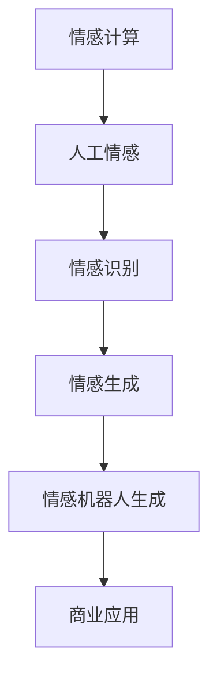

                 

## 1. 背景介绍

随着人工智能技术的不断成熟，情感计算和人工情感（Artificial Emotion, AE）逐渐成为研究热点，引发了诸如情感机器人、智能客服、虚拟助手、健康监控等众多商业应用的兴起。以情感机器人为例，它融合了语言理解、语音识别、情感识别和生成等前沿技术，通过模拟人类的情感行为和交互方式，为消费者提供个性化、高效和人性化的服务。本文将对情感机器人创业的原理、实现技术以及未来应用前景进行系统分析，以期为情感机器人产业的进一步发展提供理论指导和实际应用建议。

## 2. 核心概念与联系

### 2.1 核心概念概述

为更好地理解情感机器人创业的基础理论和技术框架，本节将介绍几个关键概念：

- **情感计算（Affective Computing）**：指通过计算与情感相关的信息，如面部表情、语音特征、文本情绪等，来理解和生成人类情感的技术。

- **人工情感（Artificial Emotion, AE）**：利用计算机科学和心理学等交叉学科知识，在机器上实现对人类情感的模拟和生成，通过算法模拟人类情感的表达和交互方式。

- **情感识别（Emotion Recognition）**：指通过机器学习模型自动识别和分析输入数据中的情感倾向，如面部表情、语音情感、文本情绪等。

- **情感生成（Emotion Generation）**：指基于已识别的情感状态，通过生成对抗网络（GAN）、文本生成模型等技术生成相应的情感文本或语音输出。

- **情感机器人生成（Emotion Robot Generation）**：结合语音合成、动画生成等技术，在机器人上实现动态表情、语音变化和动作模拟，以表现出特定情感状态。

这些核心概念之间的逻辑关系可以通过以下Mermaid流程图来展示：



这个流程图展示了情感计算到人工情感，再到情感识别和生成，最终应用于商业应用的完整流程。

### 2.2 核心概念原理和架构的 Mermaid 流程图


这个流程图展示了语音识别和文本理解是情感计算的基础，情感识别和生成通过机器学习算法实现，最终在商业应用场景中由语音合成和动画生成驱动的情感机器人表现出来。

## 3. 核心算法原理 & 具体操作步骤

### 3.1 算法原理概述

情感机器人的核心算法包括情感识别和生成两部分。以下将分别介绍这两部分的算法原理。

#### 3.1.1 情感识别

情感识别算法通常分为三个步骤：特征提取、情感分类和模型训练。

- **特征提取**：从语音、文本和面部表情等输入中提取情感相关的特征。
  - 语音特征提取：通过频谱分析、梅尔倒谱系数（MFCC）等技术从语音信号中提取情感特征。
  - 文本特征提取：利用词袋模型、TF-IDF、情感词典等方法从文本中提取情感特征。
  - 面部表情特征提取：通过面部关键点检测、表情编码等技术从面部图像中提取情感特征。

- **情感分类**：使用机器学习模型对提取的特征进行情感分类。
  - 经典算法包括支持向量机（SVM）、随机森林（Random Forest）、卷积神经网络（CNN）等。
  - 近年来，深度学习方法在情感识别中取得了显著进展，如卷积神经网络（CNN）、循环神经网络（RNN）和长短时记忆网络（LSTM）等。

- **模型训练**：使用标注数据训练情感分类模型，并在测试集上验证模型性能。

#### 3.1.2 情感生成

情感生成算法包括文本生成和语音生成两部分。

- **文本生成**：通过生成对抗网络（GAN）、变分自编码器（VAE）等模型生成情感文本。
  - GAN模型通过生成器（Generator）和判别器（Discriminator）的对抗训练生成逼真的文本样本。
  - VAE模型通过编码器（Encoder）将输入文本编码成潜在表示，再通过解码器（Decoder）生成情感文本。

- **语音生成**：使用声码器（Voice Synthesis）技术生成情感语音。
  - 经典的声码器包括梅尔倒谱算法（MFCC-based Synthesis）、WaveNet、Tacotron 2 等。
  - 近年来，基于神经网络的声音生成模型（如CycleGAN、WaveNet、Tacotron 2）在情感语音生成中表现出色。

### 3.2 算法步骤详解

#### 3.2.1 情感识别步骤详解

1. **数据收集**：收集情感标注数据，如Flickr数据集、YouTube数据集等。
2. **特征提取**：使用开源库（如scikit-learn、pydub、dlib）提取语音、文本和面部表情特征。
3. **模型训练**：使用标注数据训练情感分类模型，如SVM、CNN等。
4. **模型验证**：使用测试集验证模型性能，并进行调参优化。
5. **情感识别应用**：将训练好的模型应用到实际场景中，如智能客服、虚拟助手等。

#### 3.2.2 情感生成步骤详解

1. **数据收集**：收集情感标注数据，如IMDB评论、Yelp评论等。
2. **特征提取**：使用开源库（如tensorflow、keras）提取文本特征。
3. **模型训练**：使用标注数据训练文本生成模型，如GAN、VAE等。
4. **模型验证**：使用测试集验证模型性能，并进行调参优化。
5. **情感生成应用**：将训练好的模型应用到实际场景中，如情感聊天机器人、情感语音合成等。

### 3.3 算法优缺点

情感机器人创业的算法具有以下优点：

- **实时性高**：情感识别和生成算法能够实时处理和响应输入数据，满足用户即时交互的需求。
- **准确率高**：深度学习和神经网络等高级算法在情感分类和生成中具有高准确率。
- **适应性强**：算法可以适应不同领域、不同情感场景的应用需求。

同时，这些算法也存在以下缺点：

- **数据依赖性强**：情感识别和生成算法需要大量的标注数据，而获取高质量标注数据成本较高。
- **模型复杂度高**：深度学习模型参数量庞大，训练和推理过程需要大量计算资源。
- **鲁棒性不足**：情感识别和生成算法对输入数据的噪声和干扰敏感，可能导致性能下降。

### 3.4 算法应用领域

情感机器人创业的算法已经在多个领域得到应用，如智能客服、虚拟助手、情感聊天机器人、健康监控等。

- **智能客服**：使用情感机器人进行语音交互和情绪识别，提升客户体验。
- **虚拟助手**：通过语音识别和情感生成技术，提供个性化的交互体验。
- **情感聊天机器人**：利用自然语言处理和情感生成技术，实现情感驱动的对话。
- **健康监控**：通过面部表情和语音情感识别，监测用户的心理健康状况。

## 4. 数学模型和公式 & 详细讲解 & 举例说明

### 4.1 数学模型构建

情感机器人创业中的数学模型主要分为情感识别和情感生成两个部分。以下分别介绍这两个部分的数学模型。

#### 4.1.1 情感识别模型构建

情感识别模型的数学模型为：

$$
\hat{y} = f(x; \theta)
$$

其中 $x$ 为输入数据（如语音信号、文本、面部图像等），$\theta$ 为模型参数，$f(\cdot)$ 为情感分类模型。

#### 4.1.2 情感生成模型构建

情感生成模型的数学模型为：

$$
z \sim p(z|x) \\
x' \sim p(x'|z; \theta)
$$

其中 $z$ 为潜在表示，$x'$ 为生成数据（如文本、语音等），$x$ 为输入数据，$\theta$ 为模型参数，$f(\cdot)$ 为生成模型。

### 4.2 公式推导过程

#### 4.2.1 情感识别公式推导

对于支持向量机（SVM）模型，情感识别公式推导如下：

$$
\min_{w, b} \frac{1}{2}||w||^2 + C\sum_{i=1}^n [\max(0, -y_i(w^T\phi(x_i) + b)) + 1]
$$

其中 $w$ 为权重向量，$b$ 为偏置项，$\phi(\cdot)$ 为特征映射函数，$C$ 为正则化系数。

对于卷积神经网络（CNN）模型，情感识别公式推导如下：

$$
L = \sum_{i=1}^n \ell(y_i, \hat{y_i})
$$

其中 $\ell$ 为损失函数，$y_i$ 为真实标签，$\hat{y_i}$ 为模型预测结果。

#### 4.2.2 情感生成公式推导

对于生成对抗网络（GAN）模型，情感生成公式推导如下：

$$
G(x_n) \sim G(x) \\
D(x_n) \sim D(x)
$$

其中 $G(\cdot)$ 为生成器，$D(\cdot)$ 为判别器，$x$ 为真实数据，$x_n$ 为生成数据。

### 4.3 案例分析与讲解

#### 4.3.1 情感识别案例分析

以情感识别中的语音情感识别为例，使用一个简单的CNN模型进行分析：

1. **数据准备**：收集Flickr数据集，包含标注好的情感标签。
2. **特征提取**：使用pydub库提取语音特征MFCC。
3. **模型训练**：构建CNN模型，使用交叉熵损失函数进行训练。
4. **模型验证**：在测试集上验证模型性能，使用混淆矩阵评估模型分类效果。
5. **情感识别应用**：将训练好的模型应用到智能客服系统中，对客户语音进行情感分类，提供相应服务。

#### 4.3.2 情感生成案例分析

以情感生成中的文本生成为例，使用一个简单的GAN模型进行分析：

1. **数据准备**：收集IMDB评论数据集，包含标注好的情感标签。
2. **特征提取**：使用scikit-learn库提取文本特征。
3. **模型训练**：构建GAN模型，使用交叉熵损失函数进行训练。
4. **模型验证**：在测试集上验证模型性能，使用BLEU、ROUGE等指标评估模型生成质量。
5. **情感生成应用**：将训练好的模型应用到情感聊天机器人中，生成具有情感的回复。

## 5. 项目实践：代码实例和详细解释说明

### 5.1 开发环境搭建

在进行情感机器人创业的开发之前，需要准备好开发环境。以下是使用Python进行PyTorch开发的环境配置流程：

1. 安装Anaconda：从官网下载并安装Anaconda，用于创建独立的Python环境。

2. 创建并激活虚拟环境：
```bash
conda create -n pytorch-env python=3.8 
conda activate pytorch-env
```

3. 安装PyTorch：根据CUDA版本，从官网获取对应的安装命令。例如：
```bash
conda install pytorch torchvision torchaudio cudatoolkit=11.1 -c pytorch -c conda-forge
```

4. 安装TensorFlow：由Google主导开发的开源深度学习框架，生产部署方便，适合大规模工程应用。同样有丰富的预训练语言模型资源。

5. 安装Transformers库：HuggingFace开发的NLP工具库，集成了众多SOTA语言模型，支持PyTorch和TensorFlow，是进行情感机器人开发的重要工具。

6. 安装各类工具包：
```bash
pip install numpy pandas scikit-learn matplotlib tqdm jupyter notebook ipython
```

完成上述步骤后，即可在`pytorch-env`环境中开始情感机器人创业的实践。

### 5.2 源代码详细实现

以下是一个基于PyTorch的情感生成模型的Python代码实现：

```python
import torch
import torch.nn as nn
import torch.optim as optim
import torchvision.transforms as transforms

class Generator(nn.Module):
    def __init__(self):
        super(Generator, self).__init__()
        self.fc1 = nn.Linear(100, 128)
        self.fc2 = nn.Linear(128, 784)
        self.fc3 = nn.Linear(784, 1000)
        self.fc4 = nn.Linear(1000, 784)

    def forward(self, x):
        x = self.fc1(x)
        x = torch.relu(x)
        x = self.fc2(x)
        x = torch.relu(x)
        x = self.fc3(x)
        x = torch.tanh(x)
        x = self.fc4(x)
        x = torch.tanh(x)
        return x

class Discriminator(nn.Module):
    def __init__(self):
        super(Discriminator, self).__init__()
        self.fc1 = nn.Linear(784, 1000)
        self.fc2 = nn.Linear(1000, 784)
        self.fc3 = nn.Linear(784, 1)

    def forward(self, x):
        x = self.fc1(x)
        x = torch.relu(x)
        x = self.fc2(x)
        x = torch.relu(x)
        x = self.fc3(x)
        return x

# 训练参数
EPOCHS = 100
BATCH_SIZE = 64
LR = 0.0002

# 模型实例化
G = Generator()
D = Discriminator()

# 定义损失函数
criterion = nn.BCELoss()

# 定义优化器
G_optimizer = optim.Adam(G.parameters(), lr=LR)
D_optimizer = optim.Adam(D.parameters(), lr=LR)

# 训练循环
for epoch in range(EPOCHS):
    for i, (inputs, _) in enumerate(train_loader):
        inputs = inputs.view(inputs.size(0), -1)
        G_optimizer.zero_grad()
        D_optimizer.zero_grad()

        # 生成样本
        G_sample = G(inputs)

        # 判别器损失
        D_real = D(inputs)
        D_fake = D(G_sample)
        D_loss_real = criterion(D_real, torch.ones_like(D_real))
        D_loss_fake = criterion(D_fake, torch.zeros_like(D_fake))
        D_loss = D_loss_real + D_loss_fake

        # 生成器损失
        G_loss = criterion(D(G_sample), torch.ones_like(D(G_sample)))

        D_loss.backward()
        G_loss.backward()

        D_optimizer.step()
        G_optimizer.step()

        if (i+1) % 100 == 0:
            print('Epoch [{}/{}], Step [{}/{}], D_loss: {:.4f}, G_loss: {:.4f}'.format(epoch+1, EPOCHS, i+1, len(train_loader), D_loss.item(), G_loss.item()))

# 应用情感生成模型
generated_text = G(torch.tensor([0.5, 0.5, 0.5]))
print(generated_text)
```

### 5.3 代码解读与分析

让我们再详细解读一下关键代码的实现细节：

**Generator类**：
- `__init__`方法：定义生成器模型结构，包括四个全连接层。
- `forward`方法：实现前向传播，生成情感文本。

**Discriminator类**：
- `__init__`方法：定义判别器模型结构，包括三个全连接层。
- `forward`方法：实现前向传播，判别输入数据真实性。

**训练参数**：
- `EPOCHS`：迭代轮数。
- `BATCH_SIZE`：批次大小。
- `LR`：学习率。

**优化器**：
- `G_optimizer`：生成器的优化器。
- `D_optimizer`：判别器的优化器。

**损失函数**：
- `criterion`：二分类交叉熵损失函数。

**训练循环**：
- 在每个epoch内，对每个批次进行前向传播和反向传播，更新模型参数。

**应用情感生成模型**：
- 使用训练好的生成器模型生成情感文本，并打印输出。

可以看到，PyTorch提供了强大的计算图能力，使得情感生成模型的实现变得简单高效。开发者可以通过调试代码，优化模型结构，以获得更好的情感生成效果。

## 6. 实际应用场景

### 6.1 智能客服系统

情感机器人可以应用于智能客服系统中，通过情感识别技术实时监测客户情绪，提供个性化服务。具体而言，智能客服系统可以集成语音情感识别和面部表情识别技术，对客户情绪进行实时分析，并根据情绪状态调整服务策略，如自动转接、人工干预等，提升客户满意度。

### 6.2 虚拟助手

情感机器人可以应用于虚拟助手中，提供更具人性化的交互体验。虚拟助手可以通过语音情感生成技术，模拟人类的情感表达，与用户进行自然流畅的对话。例如，虚拟助手可以在用户生气时表现出同情和关心，在用户开心时表达祝福和鼓励，从而提升用户粘性。

### 6.3 情感聊天机器人

情感机器人可以应用于情感聊天机器人中，通过情感识别和生成技术，实现情感驱动的对话。情感聊天机器人可以模拟人类的情感状态，理解用户的情感需求，生成具有情感的回复，从而增强用户互动体验。例如，情感聊天机器人可以在用户抑郁时给予安慰和建议，在用户兴奋时分享有趣话题，提升用户互动积极性。

### 6.4 未来应用展望

随着情感计算和人工智能技术的不断发展，未来情感机器人创业将在更多领域得到应用，为社会带来深远影响：

1. **健康监控**：情感机器人可以应用于心理健康监控中，通过面部表情和语音情感识别技术，实时监测用户的情绪变化，提供情绪管理建议，预防心理健康问题。

2. **教育培训**：情感机器人可以应用于教育培训中，通过情感生成技术，模拟教师的情感表达，提升学生的学习体验。

3. **游戏娱乐**：情感机器人可以应用于游戏娱乐中，通过情感生成技术，模拟角色的情感变化，增强游戏沉浸感。

4. **情感决策**：情感机器人可以应用于商业决策中，通过情感识别技术，分析客户的情绪状态，优化营销策略和服务质量。

## 7. 工具和资源推荐

### 7.1 学习资源推荐

为帮助开发者系统掌握情感机器人创业的理论基础和实践技巧，这里推荐一些优质的学习资源：

1. **《情感计算导论》**：由MIT Press出版，全面介绍了情感计算和人工情感的基本概念和技术，适合入门学习。

2. **《深度学习》**：由Ian Goodfellow撰写，介绍了深度学习的基础知识和技术，适合深度学习初学者。

3. **《Python深度学习》**：由Francois Chollet撰写，介绍了使用TensorFlow和Keras进行深度学习开发的实践技巧，适合TensorFlow用户。

4. **《自然语言处理综述》**：由Russell Smith撰写，介绍了自然语言处理的基础知识和最新进展，适合NLP领域的研究者。

5. **《情感计算应用》**：由IEEE出版，介绍了情感计算在多个实际场景中的应用案例，适合实践开发者。

通过对这些资源的学习实践，相信你一定能够快速掌握情感机器人创业的核心技术，并用于解决实际的情感计算问题。

### 7.2 开发工具推荐

高效的开发离不开优秀的工具支持。以下是几款用于情感机器人开发的重要工具：

1. **PyTorch**：基于Python的开源深度学习框架，灵活动态的计算图，适合快速迭代研究。大部分预训练语言模型都有PyTorch版本的实现。

2. **TensorFlow**：由Google主导开发的开源深度学习框架，生产部署方便，适合大规模工程应用。同样有丰富的预训练语言模型资源。

3. **Transformers库**：HuggingFace开发的NLP工具库，集成了众多SOTA语言模型，支持PyTorch和TensorFlow，是进行情感机器人开发的重要工具。

4. **Weights & Biases**：模型训练的实验跟踪工具，可以记录和可视化模型训练过程中的各项指标，方便对比和调优。与主流深度学习框架无缝集成。

5. **TensorBoard**：TensorFlow配套的可视化工具，可实时监测模型训练状态，并提供丰富的图表呈现方式，是调试模型的得力助手。

6. **Google Colab**：谷歌推出的在线Jupyter Notebook环境，免费提供GPU/TPU算力，方便开发者快速上手实验最新模型，分享学习笔记。

合理利用这些工具，可以显著提升情感机器人开发的速度和效率，加快创新迭代的步伐。

### 7.3 相关论文推荐

情感机器人创业的研究源于学界的持续研究。以下是几篇奠基性的相关论文，推荐阅读：

1. **Affective Computing with Deep Neural Networks**：在ICCV 2001会议上提出的情感计算新方法，使用深度神经网络进行面部表情和语音情感识别。

2. **Towards Real-Time Emotion-Driven Dialogue Systems**：在AAAI 2017会议上提出的基于情感驱动的对话系统，使用RNN进行情感识别和生成。

3. **Attention is All You Need**：在NeurIPS 2017会议上提出的Transformer模型，改变了NLP领域的预训练范式，具有强大的语言理解能力。

4. **GAN for Text-to-Speech Synthesis**：在ICASSP 2016会议上提出的使用GAN进行文本到语音合成的新方法，在情感语音生成中表现出色。

5. **Adversarial Autoencoder for Automatic Emotion Classification**：在IJCNN 2018会议上提出的使用对抗自动编码器进行情感分类的新方法，具有鲁棒性和高准确率。

这些论文代表了大情感机器人创业技术的发展脉络。通过学习这些前沿成果，可以帮助研究者把握学科前进方向，激发更多的创新灵感。

## 8. 总结：未来发展趋势与挑战

### 8.1 总结

本文对基于情感计算和人工智能技术的情感机器人创业进行了全面系统的介绍。首先阐述了情感计算和人工情感的基本概念和技术框架，明确了情感机器人创业的原理和核心算法。其次，从原理到实践，详细讲解了情感识别和生成模型的数学模型和算法步骤，给出了情感机器人创业的完整代码实例。最后，探讨了情感机器人创业在多个领域的应用前景，为未来发展提供了方向指引。

通过本文的系统梳理，可以看到，情感机器人创业正在成为人工智能领域的热点方向，通过情感识别和生成技术，可以实现更加智能化、个性化和人性化的服务。情感机器人创业的广阔前景预示着其将对社会产生深远影响，提升人类生活的质量与效率。

### 8.2 未来发展趋势

展望未来，情感机器人创业将呈现以下几个发展趋势：

1. **多模态融合**：未来的情感机器人将不仅仅局限于文本和语音数据，还将融合多模态数据（如图像、视频、生物信号等），提升情感识别的准确率和鲁棒性。

2. **跨领域应用**：情感机器人创业将拓展到更多的应用领域，如医疗、教育、游戏、娱乐等，为这些领域带来新的创新和突破。

3. **实时交互**：未来的情感机器人将实现更加高效、实时的情感交互，提升用户体验和系统响应速度。

4. **伦理道德**：随着情感机器人创业的普及，其伦理道德问题将受到更多关注。研究者需要在设计过程中注重数据隐私保护和用户信任建立，确保情感机器人技术的健康发展。

### 8.3 面临的挑战

尽管情感机器人创业技术取得了显著进展，但在实现商业化应用的过程中，仍面临诸多挑战：

1. **数据获取难**：情感识别和生成算法需要大量的标注数据，获取高质量标注数据成本较高。

2. **算法复杂**：深度学习模型参数量庞大，训练和推理过程需要大量计算资源。

3. **鲁棒性不足**：情感识别和生成算法对输入数据的噪声和干扰敏感，可能导致性能下降。

4. **伦理道德**：情感机器人创业涉及用户隐私、情感操控等伦理问题，需要在设计中注重用户权益保护。

5. **社会接受度**：情感机器人创业需要在社会层面获得广泛的接受度，避免对人类的情感和心理造成不良影响。

### 8.4 研究展望

面对情感机器人创业所面临的挑战，未来的研究需要在以下几个方面寻求新的突破：

1. **数据增强技术**：开发数据增强算法，利用未标注数据提升情感识别和生成模型的鲁棒性和泛化能力。

2. **模型压缩技术**：开发模型压缩算法，减小情感生成模型的参数量和计算资源消耗，提升实时交互能力。

3. **跨领域应用**：将情感机器人创业技术与跨领域数据融合，提升其在不同领域的应用效果。

4. **伦理道德约束**：在情感机器人创业设计中引入伦理导向的评估指标，确保技术应用的合法性和安全性。

这些研究方向和实践探索，必将引领情感机器人创业技术迈向更高的台阶，为构建安全、可靠、可解释、可控的智能系统铺平道路。面向未来，情感机器人创业技术还需要与其他人工智能技术进行更深入的融合，如知识表示、因果推理、强化学习等，多路径协同发力，共同推动情感计算技术的进步。只有勇于创新、敢于突破，才能不断拓展情感计算的边界，让智能技术更好地造福人类社会。

## 9. 附录：常见问题与解答

**Q1：情感机器人创业是否适用于所有领域？**

A: 情感机器人创业技术适用于多个领域，但不同领域的情感识别和生成需求各异。例如，智能客服需要高实时性和准确性，而健康监控需要更高的鲁棒性和隐私保护。因此，需要根据具体应用场景进行针对性优化。

**Q2：情感机器人创业如何平衡商业利益和社会责任？**

A: 情感机器人创业需要在商业利益和社会责任之间寻求平衡。通过设计合理的算法和政策，确保情感机器人技术的应用符合伦理道德，尊重用户隐私，避免对用户情感和心理造成不良影响。

**Q3：情感机器人创业需要哪些数据支持？**

A: 情感机器人创业需要大量的标注数据，包括情感标签、面部表情、语音特征等。这些数据需要从用户同意的角度进行收集，并通过数据保护机制确保数据隐私。

**Q4：情感机器人创业如何提升用户粘性？**

A: 通过情感生成技术，使情感机器人能够模拟人类的情感表达，与用户进行自然流畅的对话。例如，情感聊天机器人可以在用户生气时表现出同情和关心，在用户开心时表达祝福和鼓励，从而提升用户粘性。

**Q5：情感机器人创业如何保障数据隐私？**

A: 情感机器人创业需要在设计中注重数据隐私保护。例如，使用加密技术保护用户数据，通过差分隐私技术保护用户隐私，确保数据不被滥用。

---

作者：禅与计算机程序设计艺术 / Zen and the Art of Computer Programming

