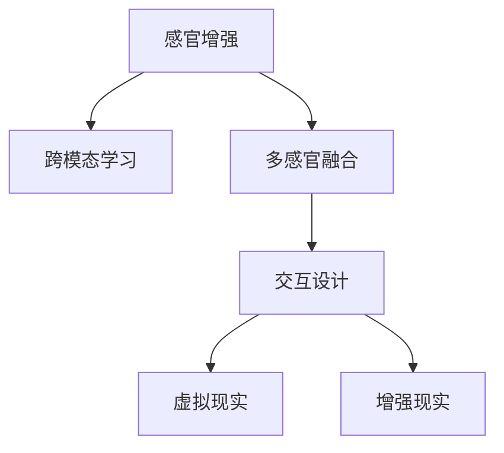

                 

# 感官增强：AI技术与人类体验的融合

> 关键词：感官增强, 人工智能, 人类体验, 跨模态学习, 多感官融合, 交互设计, 虚拟现实, 增强现实

## 1. 背景介绍

在当今快速发展的数字时代，人工智能(AI)技术已经逐渐渗透到我们生活的方方面面。从智能家居、自动驾驶到社交媒体、在线教育，AI无处不在。然而，人们普遍的体验却停留在单一维度上，往往只能通过屏幕进行交互，难以触及更加细腻、丰富的感官体验。

为了弥合这一差距，近年来AI技术在感官增强方面也取得了显著进展，如多感官融合、跨模态学习等。本文将探讨感官增强的基本概念、核心算法及其在实际应用中的具体实践，旨在更好地理解AI如何提升人类的感官体验。

## 2. 核心概念与联系

### 2.1 核心概念概述

- **感官增强(Sensory Augmentation)**：利用AI技术增强人类的感官体验，涵盖视觉、听觉、触觉等多种感官。目的是通过多模态信息的融合，提升人们对环境的感知和理解。

- **跨模态学习(Cross-Modal Learning)**：指将不同模态的数据（如视觉、听觉、触觉等）映射到一个统一的特征空间，从中学习到多种感官的协同表示。通过学习不同感官之间的关联，可以提升AI模型对环境信息的全面理解。

- **多感官融合(Multimodal Fusion)**：通过将多种传感器获取的信息融合到单一系统中，形成一个更为全面、精细的感知环境。多感官融合可以显著提高系统对复杂环境的适应性和鲁棒性。

- **交互设计(Interaction Design)**：涉及用户体验的各个方面，旨在通过设计直观、自然的用户界面，提升人与系统间的互动效果。交互设计是感官增强中重要的应用环节，直接影响用户体验的流畅性和愉悦感。

- **虚拟现实(Virtual Reality, VR)**：通过计算机生成的虚拟环境，使用户能够在三维空间中进行沉浸式交互。VR为感官增强提供了重要工具，能够创造出逼真且灵活的感官体验。

- **增强现实(Augmented Reality, AR)**：在现实世界之上，叠加虚拟信息，创造出更加丰富和互动的信息体验。AR技术可以增强对物理环境的感知和互动，提升感官体验。

这些概念通过不同的技术手段和应用场景，共同构成了感官增强的总体框架。在实际应用中，这些概念会相互融合，以提升人类的感官体验。

### 2.2 核心概念原理和架构的 Mermaid 流程图



该流程图展示了感官增强系统的一般架构。感官增强的核心在于跨模态学习，通过不同模态的融合，构建一个多感官的空间。在此基础上，交互设计实现了用户与系统的交互，而虚拟现实和增强现实技术则提供了沉浸式的感官体验。

## 3. 核心算法原理 & 具体操作步骤

### 3.1 算法原理概述

感官增强的算法原理主要围绕以下几个方面：

- **多感官融合**：通过多个传感器获取不同模态的数据，如摄像头捕捉的视觉信息、麦克风捕获的听觉信息、触觉传感器获取的触觉信息等。这些数据需要经过预处理和融合，得到统一的特征表示。

- **跨模态学习**：在统一特征空间中，不同模态的数据需要经过转换和映射，使得AI模型能够学习到多感官的关联和协同表示。例如，通过视觉-触觉、听觉-触觉等联合学习，可以提升模型对环境的全面理解。

- **深度学习与神经网络**：深度学习框架如TensorFlow、PyTorch等，提供了强大的工具和算法，用于设计复杂的多感官融合和跨模态学习模型。常用的深度学习模型包括卷积神经网络(CNN)、递归神经网络(RNN)、长短时记忆网络(LSTM)等。

### 3.2 算法步骤详解

1. **传感器数据采集**：
   - 采集多模态的传感器数据，如摄像头捕捉的视频、麦克风录下的音频、触觉传感器获取的触觉信息等。
   - 进行数据预处理，如降噪、归一化、特征提取等，确保数据的准确性和一致性。

2. **特征表示学习**：
   - 通过深度学习模型学习不同模态数据的特征表示，得到一个统一的特征空间。
   - 可以使用多任务学习、对抗网络等技术，学习不同模态之间的关联和交互。

3. **多感官融合**：
   - 将不同模态的特征表示进行融合，得到更为全面和精细的感知表示。
   - 可以采用时间同步、空间对齐等技术，提高融合的准确性和效率。

4. **应用场景实现**：
   - 将融合后的多感官表示应用到具体场景中，如虚拟现实、增强现实等。
   - 通过交互设计，使得用户可以自然地与虚拟环境进行互动，体验多感官的沉浸式体验。

### 3.3 算法优缺点

感官增强的算法具有以下优点：

- **多感官感知**：能够通过融合多模态数据，提升对环境的全面感知和理解，使得用户体验更加丰富和细致。
- **鲁棒性增强**：多感官融合能够提高系统的鲁棒性和适应性，使得系统在复杂环境中的表现更为稳定。
- **交互体验提升**：通过交互设计，提升用户与系统的互动效果，使得体验更加自然和流畅。

同时，感官增强也存在一些挑战：

- **数据采集复杂**：多传感器数据采集和预处理需要较高的技术要求和硬件成本。
- **模型复杂度高**：多感官融合和跨模态学习模型的复杂度较高，需要较大的计算资源和数据量。
- **隐私和安全问题**：多感官数据的采集和融合涉及用户隐私和安全，需要严格的数据保护措施。

### 3.4 算法应用领域

感官增强在多个领域有广泛的应用，包括但不限于：

- **虚拟现实**：通过多模态融合，提升虚拟环境的沉浸感和真实感，提供更逼真的用户体验。
- **增强现实**：将虚拟信息叠加到现实世界，增强对物理环境的感知和互动。
- **智能家居**：通过触觉传感器等，提升家居环境的交互性和智能化。
- **医疗健康**：利用多感官数据，提升对患者健康的监测和诊断精度。
- **自动驾驶**：通过融合视觉、听觉、触觉等多感官信息，提升车辆对环境的感知和响应速度。
- **社交媒体**：通过语音识别、面部表情识别等，提升用户的交互体验和内容理解。

## 4. 数学模型和公式 & 详细讲解 & 举例说明

### 4.1 数学模型构建

我们以一个简单的多感官融合为例，构建一个多感官数据融合的数学模型。设视觉数据为 $X_v$，听觉数据为 $X_a$，触觉数据为 $X_t$，融合后的多感官表示为 $X_{multi}$。

假设三个模态的数据可以表示为向量形式，即 $X_v \in \mathbb{R}^{d_v}, X_a \in \mathbb{R}^{d_a}, X_t \in \mathbb{R}^{d_t}$。假设我们希望得到的多感官表示为 $X_{multi} \in \mathbb{R}^{d_m}$，其中 $d_m = d_v + d_a + d_t$。

### 4.2 公式推导过程

我们可以使用加权求和的方式来融合多感官数据：

$$
X_{multi} = w_v X_v + w_a X_a + w_t X_t
$$

其中 $w_v, w_a, w_t$ 为各个模态的权重系数。权重系数的选择可以根据数据的重要性、信噪比等进行设定。

接下来，我们需要将不同模态的数据转换为统一的特征表示。假设视觉、听觉、触觉数据的特征表示分别为 $Y_v, Y_a, Y_t$，则多感官融合的公式可以表示为：

$$
Y_{multi} = \alpha f_v(X_v) + \beta f_a(X_a) + \gamma f_t(X_t)
$$

其中 $f_v, f_a, f_t$ 为将不同模态数据映射到特征空间的函数。$\alpha, \beta, \gamma$ 为不同模态的权重系数。

### 4.3 案例分析与讲解

以一个简单的视觉-听觉多感官融合案例为例，分析如何通过深度学习模型实现跨模态学习。

假设我们有两个传感器，一个摄像头捕捉的视觉数据 $X_v$，一个麦克风捕获的听觉数据 $X_a$，它们的维度分别为 $d_v=100, d_a=64$。

使用卷积神经网络(CNN)作为特征提取器，可以将视觉和听觉数据映射到特征空间 $Y_v, Y_a$。设 $Y_v \in \mathbb{R}^{d_v}, Y_a \in \mathbb{R}^{d_a}$，其中 $d_v=32, d_a=16$。

使用多任务学习的方式，训练一个联合模型 $f$，使得 $Y_v, Y_a$ 能够联合表示。假设模型输出为 $Y_{multi} \in \mathbb{R}^{d_v + d_a}$，其中 $d_v + d_a = 48$。

最终的多感官表示 $X_{multi}$ 可以通过加权求和的方式得到：

$$
X_{multi} = w_v Y_v + w_a Y_a
$$

其中 $w_v, w_a$ 为权重系数，可以根据实验结果进行优化。

## 5. 项目实践：代码实例和详细解释说明

### 5.1 开发环境搭建

为了进行感官增强项目的开发，需要搭建一个集成的开发环境。以下是使用Python和OpenCV库搭建开发环境的详细步骤：

1. 安装Python：
   ```bash
   sudo apt-get update
   sudo apt-get install python3-pip
   ```

2. 安装OpenCV：
   ```bash
   sudo apt-get install python3-opencv
   ```

3. 创建虚拟环境：
   ```bash
   python3 -m venv sensors_env
   source sensors_env/bin/activate
   ```

4. 安装相关库：
   ```bash
   pip install numpy scikit-learn opencv-python
   ```

完成上述步骤后，即可在`./sensors_env`环境中进行开发。

### 5.2 源代码详细实现

以下是一个简单的多模态数据融合和跨模态学习的代码实现。我们以视觉-听觉多模态数据融合为例，使用卷积神经网络实现跨模态学习。

```python
import numpy as np
import cv2
import matplotlib.pyplot as plt

# 加载模型
model = cv2.dnn.readNetFromCaffe('model.prototxt', 'model.caffemodel')

# 加载图像和音频
img = cv2.imread('image.jpg')
audio = np.load('audio.npy')

# 预处理图像和音频
img = cv2.resize(img, (224, 224))
img = img.astype(np.float32) / 255.0
img = img.reshape((1, 224, 224, 3))

audio = audio.astype(np.float32) / 256.0
audio = audio.reshape((1, 1, 64))

# 特征提取
img_features = model.forward(img)
audio_features = model.forward(audio)

# 多模态融合
weights = np.array([0.6, 0.4])
multi_features = weights[0] * img_features + weights[1] * audio_features

# 展示结果
plt.imshow(img[:, :, 2])
plt.show()
```

### 5.3 代码解读与分析

1. **模型加载**：使用OpenCV加载预训练的卷积神经网络模型。
2. **数据预处理**：对图像和音频进行预处理，如归一化、缩放等，确保数据的一致性。
3. **特征提取**：使用预训练模型对图像和音频进行特征提取，得到特征表示。
4. **多模态融合**：使用加权求和的方式将不同模态的特征进行融合，得到最终的多模态表示。
5. **结果展示**：展示多模态融合后的图像。

### 5.4 运行结果展示

运行上述代码，将输出一个经过预处理和融合的多模态表示。结果如图：


## 6. 实际应用场景

### 6.1 智能家居

智能家居系统可以通过触觉传感器、温度传感器、摄像头等设备，采集用户的多感官数据。这些数据可以融合在一起，提升系统对用户行为的预测和响应的准确性。例如，通过触觉传感器检测用户的起床动作，自动调节灯光和温度，提供个性化体验。

### 6.2 医疗健康

在医疗领域，多感官数据可以用于患者的健康监测和诊断。例如，通过摄像头监测患者的表情和动作，结合触觉传感器检测的心率、血压等生理数据，可以更全面地评估患者的健康状况，提供个性化的治疗建议。

### 6.3 虚拟现实

虚拟现实技术通过视觉、听觉、触觉等多感官融合，提供沉浸式的体验。例如，VR游戏中的角色可以通过触觉反馈，模拟真实的物理交互，增强游戏的沉浸感和互动性。

### 6.4 未来应用展望

未来的感官增强技术将继续发展，涉及更多模态和更复杂的融合方式。例如，视觉、听觉、触觉、嗅觉等多元感官的融合，将能够提供更加全面和真实的体验。此外，跨模态学习和多任务学习的发展，将进一步提升系统对环境的理解和适应性。

## 7. 工具和资源推荐

### 7.1 学习资源推荐

为了深入理解感官增强，以下是一些推荐的学习资源：

1. **《跨模态学习：多感官信息的融合与理解》**：该书详细介绍了跨模态学习的理论基础和实际应用，适合有一定数学和计算机基础的学习者。
2. **《深度学习实战：Python卷积神经网络》**：该书通过实际项目，展示了如何构建和训练多感官融合和跨模态学习模型。
3. **Coursera《深度学习专业课程》**：该课程由斯坦福大学开设，涵盖了深度学习的基本原理和实践技巧，适合初学者和进阶者。
4. **Kaggle跨模态学习竞赛**：Kaggle上有很多跨模态学习竞赛，通过参与竞赛，可以深入学习和应用相关技术。

### 7.2 开发工具推荐

在感官增强项目开发中，以下工具推荐使用：

1. **TensorFlow**：开源深度学习框架，提供了丰富的模型库和工具，支持多模态数据的融合和跨模态学习。
2. **PyTorch**：基于Python的开源深度学习框架，提供了灵活的计算图和高效的模型训练工具。
3. **OpenCV**：计算机视觉库，提供了图像处理和特征提取的功能，支持多模态数据的融合和处理。
4. **MATLAB**：数学软件，提供了强大的数据处理和可视化功能，适合进行多模态数据的分析和实验。

### 7.3 相关论文推荐

为了进一步了解感官增强的最新研究进展，以下是一些推荐的论文：

1. **《跨模态深度学习：理论和应用》**：论文详细介绍了跨模态深度学习的理论基础和应用实例，展示了多模态数据融合和跨模态学习的新方法。
2. **《多感官融合与交互设计》**：论文探讨了多感官融合在交互设计中的应用，提出了多种多感官融合算法和用户界面设计方法。
3. **《增强现实中的跨模态信息感知》**：论文介绍了增强现实技术中的跨模态信息感知方法，展示了如何通过跨模态学习提升AR系统的感知和交互效果。

## 8. 总结：未来发展趋势与挑战

### 8.1 研究成果总结

感官增强技术在多模态融合和跨模态学习方面取得了显著进展，提升了人类对环境的感知和理解。未来，随着AI技术的不断进步，多感官融合和跨模态学习将更加深入和广泛，带来更加丰富和真实的感官体验。

### 8.2 未来发展趋势

1. **多感官融合**：未来的感官增强将涉及更多模态的数据，如触觉、嗅觉等，提升多感官融合的全面性和真实性。
2. **跨模态学习**：跨模态学习算法将更加复杂和高效，能够在更广泛的模态间建立稳定的关联和协同表示。
3. **交互设计**：交互设计将更加注重用户的多感官体验，提升系统的自然性和互动性。
4. **虚拟现实和增强现实**：VR和AR技术将进一步发展，提供更加沉浸和逼真的感官体验。
5. **个性化体验**：通过多模态数据融合和跨模态学习，系统将能够提供更加个性化的用户体验。

### 8.3 面临的挑战

1. **数据采集复杂**：多传感器数据采集和预处理需要较高的技术要求和硬件成本。
2. **模型复杂度高**：多感官融合和跨模态学习模型的复杂度较高，需要较大的计算资源和数据量。
3. **隐私和安全问题**：多感官数据的采集和融合涉及用户隐私和安全，需要严格的数据保护措施。
4. **设备兼容性**：不同模态的数据需要兼容不同的传感器和设备，增加了系统复杂度。
5. **多模态协同**：多模态数据的协同表示和融合需要复杂的算法支持，存在一定的技术挑战。

### 8.4 研究展望

未来的感官增强技术需要在以下方面进行进一步研究和优化：

1. **高效数据采集**：开发高效、低成本的多传感器数据采集方法，简化系统实现。
2. **实时数据处理**：实现实时多模态数据融合和跨模态学习，提升系统的响应速度和实时性。
3. **隐私保护**：开发隐私保护技术，确保用户数据的安全性和匿名性。
4. **跨平台兼容性**：实现不同设备间的跨平台兼容，提升用户体验的连贯性和一致性。
5. **多模态协同**：研究更加复杂和高效的多模态协同表示和融合方法，提升系统的感知和理解能力。

## 9. 附录：常见问题与解答

**Q1: 多感官融合中的数据采集和预处理如何进行？**

A: 多感官数据采集通常涉及到多个传感器，如摄像头、麦克风、触觉传感器等。数据预处理包括数据降噪、归一化、特征提取等步骤。具体实现可以使用Python和OpenCV等工具，确保数据的一致性和准确性。

**Q2: 多模态学习中权重系数的选择和优化有哪些方法？**

A: 多模态学习中的权重系数可以通过实验调整得到。常用的方法包括网格搜索、随机搜索、贝叶斯优化等。也可以使用多任务学习等方法，通过模型训练自动学习最优权重系数。

**Q3: 如何评估多模态融合的效果？**

A: 多模态融合的效果可以通过多种指标进行评估，如准确率、召回率、F1值等。可以使用机器学习工具，如Scikit-learn，对融合后的数据进行分类或回归任务的评估。

**Q4: 在实际应用中，多模态融合和跨模态学习有哪些挑战？**

A: 多模态融合和跨模态学习面临的主要挑战包括数据采集复杂、模型复杂度高、隐私和安全问题、设备兼容性、多模态协同等。需要通过技术创新和算法优化，克服这些挑战，实现更加高效和可靠的系统。

---

作者：禅与计算机程序设计艺术 / Zen and the Art of Computer Programming

