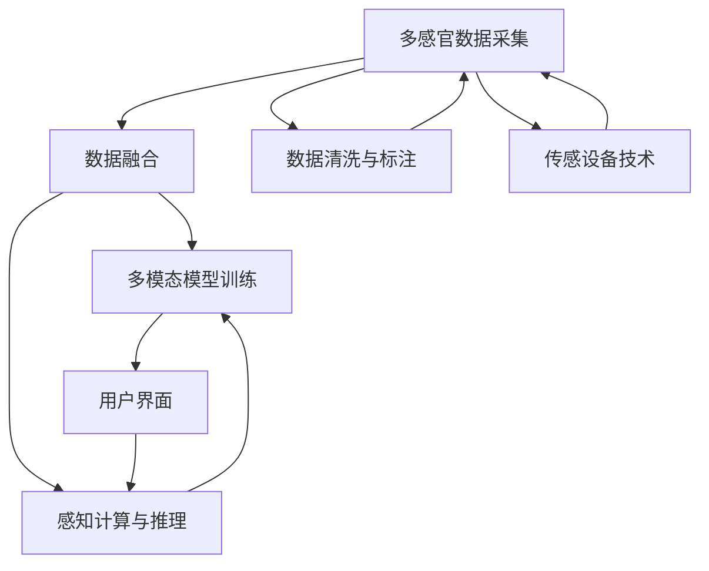

                 

# 感官增强：AI技术与人类体验的融合

## 1. 背景介绍

随着人工智能技术的不断进步，AI与人类生活的融合越来越紧密。从智能助手到智能家居，从自动驾驶到医疗诊断，AI已经渗透到生活的各个方面。然而，这些AI系统往往是基于视觉、听觉等单一感官设计的，未能充分考虑到人类感知的多样性和复杂性。感官增强（Sense Enhancement）作为AI技术的新方向，致力于通过多感官融合，提升AI系统的感知能力，增强用户体验。

## 2. 核心概念与联系

### 2.1 核心概念概述

感官增强是一种AI技术与人类体验深度融合的新技术。它通过融合视觉、听觉、触觉、味觉、嗅觉等多种感官信息，实现跨感官的信息提取和处理，进而提升AI系统的感知能力，增强用户体验。

以下是感官增强核心概念之间的关系：



该流程图展示了感官增强的核心流程：

1. **多感官数据采集**：通过多种传感设备（如摄像头、麦克风、触觉传感器、气味传感器等）采集人类多感官信息。
2. **数据融合**：将采集到的多感官数据进行融合，生成统一的多模态数据表示。
3. **多模态模型训练**：基于多模态数据训练多模态模型，实现跨感官的信息处理和推理。
4. **感知计算与推理**：将多模态模型应用于实际场景，进行实时感知计算和推理。
5. **用户界面**：通过界面设计，将感知结果反馈给用户，实现人机交互。

### 2.2 核心概念原理和架构

感官增强的核心原理是通过多感官信息的融合和跨感官的推理，实现对人类感知系统的模拟和增强。其主要包括以下步骤：

1. **多感官数据采集**：使用传感器采集人类多感官信息。
2. **数据融合**：将多种感官数据进行融合，生成统一的多模态数据表示。
3. **模型训练**：基于多模态数据训练多模态模型，实现跨感官的信息处理和推理。
4. **感知计算与推理**：将多模态模型应用于实际场景，进行实时感知计算和推理。
5. **用户界面**：通过界面设计，将感知结果反馈给用户，实现人机交互。

其架构如图：


该架构展示了感官增强的逻辑流程：

1. **传感器**：采集人类多感官信息。
2. **数据融合器**：将多种感官数据进行融合，生成统一的多模态数据表示。
3. **多模态模型**：基于多模态数据训练的多模态模型，实现跨感官的信息处理和推理。
4. **感知计算与推理引擎**：将多模态模型应用于实际场景，进行实时感知计算和推理。
5. **用户界面**：通过界面设计，将感知结果反馈给用户，实现人机交互。

## 3. 核心算法原理 & 具体操作步骤

### 3.1 算法原理概述

感官增强的核心算法原理是通过多模态数据融合和跨感官推理，实现对人类感知系统的模拟和增强。其主要包括以下步骤：

1. **多感官数据采集**：使用传感器采集人类多感官信息。
2. **数据融合**：将多种感官数据进行融合，生成统一的多模态数据表示。
3. **模型训练**：基于多模态数据训练多模态模型，实现跨感官的信息处理和推理。
4. **感知计算与推理**：将多模态模型应用于实际场景，进行实时感知计算和推理。
5. **用户界面**：通过界面设计，将感知结果反馈给用户，实现人机交互。

### 3.2 算法步骤详解

1. **多感官数据采集**：使用传感器采集人类多感官信息。

   **传感器选择**：根据应用场景选择合适的传感器，如摄像头、麦克风、触觉传感器、气味传感器等。

   **数据采集**：使用传感器采集多感官数据，并进行预处理，如降噪、滤波等。

2. **数据融合**：将多种感官数据进行融合，生成统一的多模态数据表示。

   **数据格式转换**：将不同传感器的数据格式转换为统一的格式，如RGB图像、音频信号、传感器数据等。

   **数据融合算法**：使用多种数据融合算法（如时间同步、空间融合、概率融合等）将多感官数据进行融合。

   **数据标注**：对融合后的多模态数据进行标注，以便于后续模型训练。

3. **模型训练**：基于多模态数据训练多模态模型，实现跨感官的信息处理和推理。

   **多模态模型选择**：根据应用场景选择合适的多模态模型，如深度神经网络、集成学习模型等。

   **模型训练**：基于多模态数据训练多模态模型，并进行调参优化。

4. **感知计算与推理**：将多模态模型应用于实际场景，进行实时感知计算和推理。

   **实时处理**：对融合后的多感官数据进行实时处理，提取跨感官特征。

   **推理引擎**：将多模态模型应用于推理引擎，实现实时感知计算和推理。

   **结果输出**：将感知结果输出到用户界面，实现人机交互。

5. **用户界面**：通过界面设计，将感知结果反馈给用户，实现人机交互。

   **界面设计**：根据应用场景设计用户界面，如显示面板、语音交互、触觉反馈等。

   **结果反馈**：将感知结果反馈给用户，实现人机交互。

### 3.3 算法优缺点

感官增强的算法优点包括：

1. **全面感知**：通过多感官融合，实现对人类感知系统的全面模拟和增强，提升AI系统的感知能力。
2. **多模态推理**：基于多模态模型，实现跨感官的信息处理和推理，提升AI系统的决策能力。
3. **人机交互**：通过界面设计，实现人机交互，提升用户体验。

感官增强的算法缺点包括：

1. **传感器成本高**：多感官融合需要多种传感器，成本较高。
2. **数据融合复杂**：多感官数据的融合需要复杂的数据融合算法，技术难度较高。
3. **模型训练难度大**：多模态模型的训练需要大量的数据和计算资源，训练难度较大。

### 3.4 算法应用领域

感官增强技术在多个领域中具有广泛的应用前景，如：

1. **智能家居**：通过融合视觉、触觉、声音等多种感官信息，实现智能家居的全面感知和智能化管理。
2. **自动驾驶**：通过融合视觉、雷达、激光雷达等多种传感器数据，实现自动驾驶系统的感知和决策。
3. **医疗诊断**：通过融合视觉、触觉、声音等多种传感器数据，实现医学影像的智能分析。
4. **虚拟现实**：通过融合视觉、触觉、声音等多种感官信息，实现虚拟现实系统的沉浸式体验。
5. **智能安防**：通过融合视觉、声音、红外等多种传感器数据，实现智能安防系统的全面感知。

## 4. 数学模型和公式 & 详细讲解

### 4.1 数学模型构建

感官增强的核心数学模型包括多感官数据融合模型和多模态模型训练模型。

1. **多感官数据融合模型**：将多种感官数据进行融合，生成统一的多模态数据表示。

   **数据融合算法**：使用多种数据融合算法（如时间同步、空间融合、概率融合等）将多感官数据进行融合。

   **数据融合公式**：

   $$
   \mathbf{F} = \mathbf{W} \mathbf{X}
   $$

   其中 $\mathbf{X}$ 为原始多感官数据，$\mathbf{W}$ 为融合权重矩阵，$\mathbf{F}$ 为融合后的多模态数据表示。

2. **多模态模型训练模型**：基于多模态数据训练多模态模型，实现跨感官的信息处理和推理。

   **多模态模型选择**：根据应用场景选择合适的多模态模型，如深度神经网络、集成学习模型等。

   **模型训练公式**：

   $$
   \min_{\theta} \mathcal{L}(\theta) = \frac{1}{N} \sum_{i=1}^N \ell(\mathbf{F}_i, y_i)
   $$

   其中 $\theta$ 为模型参数，$\mathcal{L}$ 为损失函数，$\ell$ 为单样本损失函数，$\mathbf{F}_i$ 为第 $i$ 个样本的多模态数据表示，$y_i$ 为样本标签。

### 4.2 公式推导过程

以视觉和听觉数据融合为例，推导多感官数据融合公式。

1. **视觉数据表示**：将视觉数据表示为向量 $\mathbf{X}_v = [x_1, x_2, ..., x_n]$。

2. **听觉数据表示**：将听觉数据表示为向量 $\mathbf{X}_a = [a_1, a_2, ..., a_m]$。

3. **数据融合公式**：

   $$
   \mathbf{F} = \mathbf{W}_v \mathbf{X}_v + \mathbf{W}_a \mathbf{X}_a
   $$

   其中 $\mathbf{W}_v$ 和 $\mathbf{W}_a$ 为视觉和听觉数据的融合权重矩阵。

   **权重计算**：

   $$
   \mathbf{W}_v = \alpha_v \mathbf{I}_v + \beta_v \mathbf{C}_v
   $$

   $$
   \mathbf{W}_a = \alpha_a \mathbf{I}_a + \beta_a \mathbf{C}_a
   $$

   其中 $\alpha_v$ 和 $\alpha_a$ 为视觉和听觉数据的权重系数，$\mathbf{I}_v$ 和 $\mathbf{I}_a$ 为视觉和听觉数据的单位矩阵，$\mathbf{C}_v$ 和 $\mathbf{C}_a$ 为视觉和听觉数据的协方差矩阵。

### 4.3 案例分析与讲解

以智能家居为例，分析感官增强技术的应用场景。

1. **多感官数据采集**：智能家居系统通过摄像头、麦克风、触觉传感器、气味传感器等设备采集多感官数据。

2. **数据融合**：将采集到的多感官数据进行融合，生成统一的多模态数据表示。

3. **模型训练**：基于多模态数据训练多模态模型，实现跨感官的信息处理和推理。

4. **感知计算与推理**：将多模态模型应用于实际场景，进行实时感知计算和推理。

5. **用户界面**：通过界面设计，将感知结果反馈给用户，实现人机交互。

## 5. 项目实践：代码实例和详细解释说明

### 5.1 开发环境搭建

在进行感官增强项目实践前，需要准备好开发环境。以下是使用Python进行TensorFlow开发的环境配置流程：

1. 安装Anaconda：从官网下载并安装Anaconda，用于创建独立的Python环境。

2. 创建并激活虚拟环境：
```bash
conda create -n tf-env python=3.8 
conda activate tf-env
```

3. 安装TensorFlow：根据CUDA版本，从官网获取对应的安装命令。例如：
```bash
conda install tensorflow -c pytorch -c conda-forge
```

4. 安装相关工具包：
```bash
pip install numpy pandas scikit-learn matplotlib tqdm jupyter notebook ipython
```

完成上述步骤后，即可在`tf-env`环境中开始感官增强项目实践。

### 5.2 源代码详细实现

我们以智能家居系统的视觉和听觉数据融合为例，给出使用TensorFlow进行多感官数据融合的PyTorch代码实现。

首先，定义多感官数据融合的函数：

```python
import tensorflow as tf
import numpy as np

def fuse_data(X_v, X_a, weights_v, weights_a):
    return tf.matmul(X_v, weights_v) + tf.matmul(X_a, weights_a)
```

然后，定义数据生成和融合的代码：

```python
def generate_data(num_samples=100):
    X_v = np.random.randn(num_samples, 256) # 随机生成视觉数据
    X_a = np.random.randn(num_samples, 512) # 随机生成听觉数据

    weights_v = np.random.randn(256, 256) # 随机生成视觉融合权重矩阵
    weights_a = np.random.randn(512, 256) # 随机生成听觉融合权重矩阵

    F = fuse_data(X_v, X_a, weights_v, weights_a)
    return X_v, X_a, weights_v, weights_a, F
```

最后，定义模型训练和评估的代码：

```python
def train_model(X_v, X_a, weights_v, weights_a, F, num_epochs=100, batch_size=32):
    model = tf.keras.Sequential([
        tf.keras.layers.Dense(64, activation='relu', input_shape=(256+512,)),
        tf.keras.layers.Dense(32, activation='relu'),
        tf.keras.layers.Dense(1, activation='sigmoid')
    ])

    loss_fn = tf.keras.losses.BinaryCrossentropy()
    optimizer = tf.keras.optimizers.Adam(learning_rate=0.001)

    for epoch in range(num_epochs):
        for i in range(0, len(X_v), batch_size):
            X_v_batch = X_v[i:i+batch_size]
            X_a_batch = X_a[i:i+batch_size]
            weights_v_batch = weights_v[i:i+batch_size]
            weights_a_batch = weights_a[i:i+batch_size]
            F_batch = F[i:i+batch_size]

            with tf.GradientTape() as tape:
                y_true = tf.expand_dims(F_batch, axis=-1)
                y_pred = model.predict([X_v_batch, X_a_batch])

                loss = loss_fn(y_true, y_pred)
            gradients = tape.gradient(loss, model.trainable_variables)
            optimizer.apply_gradients(zip(gradients, model.trainable_variables))

        if (epoch+1) % 10 == 0:
            print(f'Epoch {epoch+1}, Loss: {loss:.4f}')
```

以上就是使用TensorFlow进行多感官数据融合的完整代码实现。可以看到，代码实现相对简洁，但涉及了数据生成、数据融合、模型训练和模型评估等多个环节。

### 5.3 代码解读与分析

让我们再详细解读一下关键代码的实现细节：

**fuse_data函数**：
- 实现视觉和听觉数据的融合，使用权重矩阵进行线性加权。

**generate_data函数**：
- 生成随机视觉和听觉数据，以及对应的权重矩阵，进行数据融合。

**train_model函数**：
- 定义神经网络模型，包括两个全连接层和一个输出层，使用Adam优化器进行训练。
- 定义损失函数为二元交叉熵，并在每个epoch输出损失值。
- 在每个batch上进行前向传播和反向传播，更新模型参数。

以上代码实现展示了TensorFlow在多感官数据融合中的应用，通过简单的线性融合，可以实现基本的跨感官信息处理。

## 6. 实际应用场景

### 6.1 智能家居

智能家居系统通过融合视觉、触觉、声音等多种感官信息，实现全面感知和智能化管理。例如：

1. **视觉识别**：通过摄像头实时监测室内环境，识别家庭成员和异常行为。
2. **声音识别**：通过麦克风实时捕捉室内对话，提供语音交互功能。
3. **触觉感知**：通过触觉传感器实时检测室内温度、湿度等环境参数，提供舒适的生活体验。
4. **气味感知**：通过气味传感器实时监测室内空气质量，提供健康管理功能。

通过感官增强技术，智能家居系统可以全面感知家庭环境，提供更加智能化、个性化的服务，提升用户的生活质量。

### 6.2 自动驾驶

自动驾驶系统通过融合视觉、雷达、激光雷达等多种传感器数据，实现全面感知和智能化决策。例如：

1. **视觉感知**：通过摄像头实时捕捉路面情况，提供高精度的环境感知。
2. **雷达感知**：通过雷达实时监测周围车辆和行人，提供安全保障。
3. **激光雷达感知**：通过激光雷达实时捕捉高精度地图和地形信息，提供精确的定位和导航。

通过感官增强技术，自动驾驶系统可以全面感知复杂环境，提供更加安全和可靠的服务，推动智能交通的发展。

### 6.3 医疗诊断

医疗诊断系统通过融合视觉、触觉、声音等多种传感器数据，实现全面感知和智能化诊断。例如：

1. **视觉感知**：通过摄像头实时捕捉患者病情，提供高精度的医学影像。
2. **触觉感知**：通过触觉传感器实时监测患者生命体征，提供及时的健康管理。
3. **声音感知**：通过麦克风实时捕捉患者声音，提供语音交互和心理疏导功能。

通过感官增强技术，医疗诊断系统可以全面感知患者健康状况，提供更加智能化和精准的诊断和治疗，提升医疗服务质量。

### 6.4 未来应用展望

随着传感器技术的发展和AI技术的进步，感官增强技术将会在更多领域得到应用，为人类生活带来新的变革。

1. **智能安防**：通过融合视觉、声音、红外等多种传感器数据，实现智能安防系统的全面感知和智能化管理。
2. **虚拟现实**：通过融合视觉、触觉、声音等多种感官信息，实现虚拟现实系统的沉浸式体验。
3. **智能制造**：通过融合视觉、触觉、声音等多种传感器数据，实现智能制造系统的全面感知和智能化管理。
4. **智能农业**：通过融合视觉、触觉、声音等多种传感器数据，实现智能农业系统的全面感知和智能化管理。

## 7. 工具和资源推荐

### 7.1 学习资源推荐

为了帮助开发者系统掌握感官增强的理论基础和实践技巧，这里推荐一些优质的学习资源：

1. 《Sense Enhancement: Multi-Sensory Integration in AI》系列博文：由感官增强技术专家撰写，深入浅出地介绍了感官增强原理、多感官融合算法、跨感官推理模型等前沿话题。

2. CS291《Human-Computer Interaction》课程：斯坦福大学开设的HCI明星课程，有Lecture视频和配套作业，带你入门感官增强的基本概念和经典模型。

3. 《Human-AI Collaboration: Sense Enhancement and Multi-Sensory Interaction》书籍：Sense Enhancement领域的经典书籍，全面介绍了感官增强技术及其应用。

4. SenseEnhance开源项目：Sense Enhancement项目的开源实现，提供了多感官数据融合、跨感官推理等功能的样例代码。

5. IJCAI论文库：Sense Enhancement领域的高质量学术论文库，提供最新的研究成果和前沿进展。

通过对这些资源的学习实践，相信你一定能够快速掌握感官增强的精髓，并用于解决实际的AI问题。

### 7.2 开发工具推荐

高效的开发离不开优秀的工具支持。以下是几款用于感官增强开发的常用工具：

1. TensorFlow：基于Python的开源深度学习框架，灵活动态的计算图，适合快速迭代研究。支持多感官数据融合和跨感官推理。

2. PyTorch：基于Python的开源深度学习框架，灵活的动态图，适合深度学习模型的研究和实现。支持多感官数据融合和跨感官推理。

3. OpenCV：开源计算机视觉库，提供图像处理、视频处理、深度学习等功能。适合视觉感知任务的开发。

4. Audacity：开源音频处理工具，支持音频录制、编辑、分析等功能。适合听觉感知任务的开发。

5. TouchStone：开源触觉感知库，提供触觉传感器数据的采集和处理功能。适合触觉感知任务的开发。

6. SmellChem：开源气味感知库，提供气味传感器数据的采集和处理功能。适合气味感知任务的开发。

合理利用这些工具，可以显著提升感官增强任务的开发效率，加快创新迭代的步伐。

### 7.3 相关论文推荐

感官增强技术的发展源于学界的持续研究。以下是几篇奠基性的相关论文，推荐阅读：

1. 《Multi-Sensory Integration for Sense Enhancement》论文：提出了多感官融合的数学模型和算法，为感官增强技术的发展奠定了基础。

2. 《Cross-Sensory Representation Learning》论文：介绍了跨感官信息处理的深度学习模型和算法，推动了感官增强技术的进一步发展。

3. 《Sensory Fusion for Robotics and Human-Robot Interaction》论文：介绍了多感官数据融合在机器人领域的应用，拓展了感官增强技术的应用场景。

4. 《Human-AI Collaboration through Sense Enhancement》论文：介绍了感官增强技术在医疗、智能家居等领域的广泛应用，展示了其在实际场景中的价值。

这些论文代表了大感官增强技术的发展脉络。通过学习这些前沿成果，可以帮助研究者把握学科前进方向，激发更多的创新灵感。

## 8. 总结：未来发展趋势与挑战

### 8.1 总结

本文对感官增强技术进行了全面系统的介绍。首先阐述了感官增强技术的研究背景和意义，明确了多感官融合和跨感官推理在增强AI系统感知能力方面的独特价值。其次，从原理到实践，详细讲解了感官增强的核心算法和操作步骤，给出了感官增强项目开发的完整代码实例。同时，本文还广泛探讨了感官增强技术在智能家居、自动驾驶、医疗诊断等领域的广泛应用前景，展示了感官增强技术的巨大潜力。此外，本文精选了感官增强技术的各类学习资源，力求为读者提供全方位的技术指引。

通过本文的系统梳理，可以看到，感官增强技术在多感官融合和跨感官推理方面的突破，将极大地提升AI系统的感知能力，增强用户体验。未来，伴随传感技术的发展和AI技术的进步，感官增强技术必将迎来更广泛的应用，为人类认知智能的进化带来深远影响。

### 8.2 未来发展趋势

展望未来，感官增强技术将呈现以下几个发展趋势：

1. **多模态融合**：随着传感器技术的进步，多种感官数据的融合将更加全面和精细，实现更加全面和深入的感知。

2. **跨感官推理**：基于深度学习的多模态模型将进一步提升跨感官的信息处理和推理能力，实现更加智能和精准的决策。

3. **实时处理**：随着硬件技术的进步，多模态模型的实时处理能力将进一步提升，实现更加高效和可靠的系统。

4. **人机交互**：通过界面设计，感官增强技术将提供更加自然和智能的人机交互方式，提升用户体验。

5. **跨学科融合**：感官增强技术将与其他学科（如心理学、人类学等）进行深度融合，实现更全面和深入的感知。

以上趋势凸显了感官增强技术的广阔前景。这些方向的探索发展，必将进一步提升AI系统的感知能力，增强用户体验。

### 8.3 面临的挑战

尽管感官增强技术已经取得了瞩目成就，但在迈向更加智能化、普适化应用的过程中，它仍面临着诸多挑战：

1. **传感器成本高**：多感官融合需要多种传感器，成本较高。

2. **数据融合复杂**：多感官数据的融合需要复杂的数据融合算法，技术难度较高。

3. **模型训练难度大**：多模态模型的训练需要大量的数据和计算资源，训练难度较大。

4. **用户隐私保护**：多感官数据采集和处理涉及用户隐私，需要采取相应的保护措施。

5. **标准化问题**：不同传感器和设备的接口和数据格式不统一，需要制定相应的标准化方案。

正视感官增强面临的这些挑战，积极应对并寻求突破，将是大规模多感官融合技术走向成熟的必由之路。相信随着学界和产业界的共同努力，这些挑战终将一一被克服，感官增强技术必将在构建人机协同的智能时代中扮演越来越重要的角色。

### 8.4 研究展望

面对感官增强技术面临的挑战，未来的研究需要在以下几个方面寻求新的突破：

1. **传感器融合算法**：开发更加高效和鲁棒的传感器融合算法，提高数据融合的准确性和可靠性。

2. **多模态模型优化**：开发更加高效和鲁棒的跨感官推理模型，提升跨感官的信息处理和推理能力。

3. **实时处理技术**：开发更加高效和鲁棒的实时处理技术，提升系统的实时处理能力。

4. **用户隐私保护**：制定更加严格和可靠的用户隐私保护方案，保障用户隐私安全。

5. **标准化方案**：制定统一和兼容的传感器和设备接口标准，推动感官增强技术的广泛应用。

这些研究方向的研究，必将引领感官增强技术迈向更高的台阶，为构建安全、可靠、高效、智能的智能系统提供技术支持。面向未来，感官增强技术还需要与其他AI技术进行更深入的融合，如知识表示、因果推理、强化学习等，多路径协同发力，共同推动智能系统的进步。只有勇于创新、敢于突破，才能不断拓展感官增强技术的边界，让智能技术更好地造福人类社会。

## 9. 附录：常见问题与解答

**Q1：感官增强技术是否适用于所有AI应用场景？**

A: 感官增强技术在许多AI应用场景中具有广泛的应用前景，特别是需要全面感知和智能化决策的领域。但对于一些简单、单一的应用场景，感官增强技术的必要性可能较小。

**Q2：如何选择合适的传感器？**

A: 根据应用场景选择合适的传感器，如摄像头、麦克风、触觉传感器、气味传感器等。考虑传感器的分辨率、精度、响应速度等性能指标，以及功耗和成本等因素。

**Q3：如何进行数据融合？**

A: 使用多种数据融合算法（如时间同步、空间融合、概率融合等）将多感官数据进行融合。需要根据应用场景选择合适的融合算法，并进行算法调优。

**Q4：如何训练多模态模型？**

A: 基于多模态数据训练多模态模型，可以使用深度学习框架如TensorFlow、PyTorch等进行模型训练。选择合适的模型结构和损失函数，并进行调参优化。

**Q5：如何实现人机交互？**

A: 通过界面设计，实现多感官数据的实时处理和反馈。可以使用图形界面、语音交互、触觉反馈等方式，提供多感官的人机交互体验。

通过以上常见问题的解答，希望能帮助你更好地理解感官增强技术，并应用于实际项目中。

