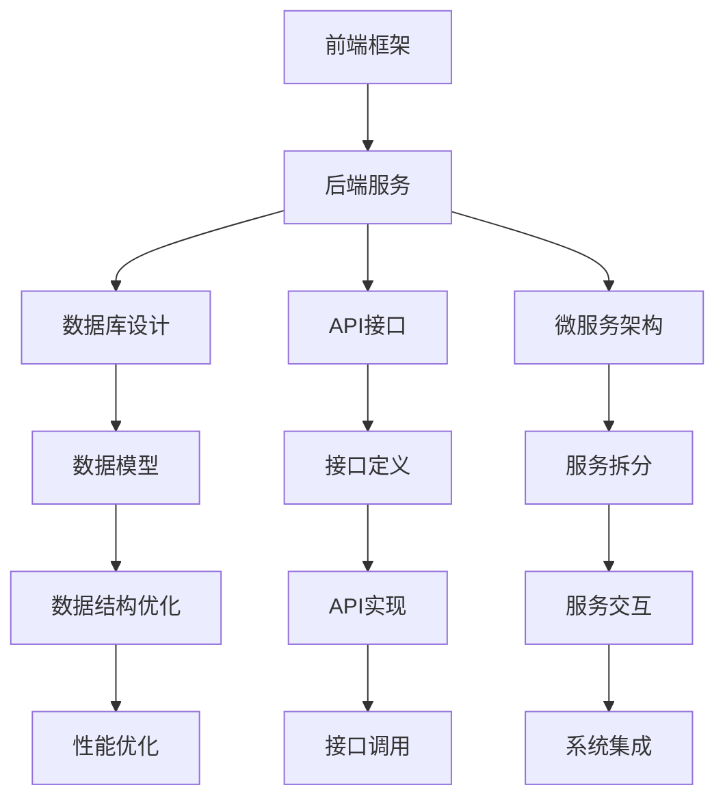

                 

## 1. 背景介绍

在当今信息爆炸的时代，个人知识管理（KM）已经成为人们高效学习和工作的关键。随着数字技术的迅猛发展，各种知识库管理工具应运而生，如Evernote、Notion、OneNote等。这些工具大多基于Web技术，支持跨平台操作，能够帮助用户存储、组织和管理海量信息，但大多数用户往往缺乏系统性的知识管理思维，导致大量信息的无序堆砌。本文将详细介绍基于全栈技术方案的个人知识库构建方法，涵盖前端框架、后端服务、数据库设计、API接口、应用集成等关键环节，以期为个人知识管理提供一套高效、可靠的技术解决方案。

## 2. 核心概念与联系

### 2.1 核心概念概述

个人知识库是一个集成了文档、笔记、代码、图片、音视频等多媒体元素的数字化信息管理平台。其核心功能包括文档创建、笔记整理、标签分类、多媒体存储、搜索过滤、同步备份等。核心概念包括：

- **全栈技术**：指前端、后端、数据库、API接口等各技术层面的综合集成方案。
- **知识管理**：对个人知识进行结构化整理、分类、存储、检索和管理的过程。
- **Web技术**：指基于Web的标准和协议，如HTTP、HTML、CSS、JavaScript等。
- **微服务架构**：指将应用拆分成多个独立部署的服务，每个服务负责单一业务逻辑，以提高系统的可维护性和扩展性。
- **数据库设计**：指合理设计数据库结构，以支持高效的查询和存储，优化数据库性能。
- **API接口**：指通过定义标准的接口协议，使得不同系统或组件能够交互沟通，实现数据的共享和协同。

### 2.2 核心概念原理和架构的 Mermaid 流程图



## 3. 核心算法原理 & 具体操作步骤

### 3.1 算法原理概述

个人知识库构建的核心算法主要包括知识分类、搜索过滤、同步备份等。这些算法依赖于高效的数据存储和检索技术，实现方式包括：

- **知识分类算法**：利用聚类、分类等机器学习算法，将知识按照主题、领域等维度进行划分，方便用户检索和浏览。
- **搜索过滤算法**：利用全文搜索、倒排索引等技术，快速定位特定关键词或标签的知识信息，提高查询效率。
- **同步备份算法**：通过增量更新和版本控制技术，实时备份用户数据，保证数据的完整性和可用性。

### 3.2 算法步骤详解

#### 3.2.1 数据模型设计

数据模型是个人知识库构建的基础。需设计包含文档、笔记、标签、多媒体、用户等实体的数据表结构，并通过外键关联，形成稳定的数据关系。

#### 3.2.2 数据库优化策略

采用优化策略，如索引、分片、缓存等，提高数据库的读写性能和扩展性。

#### 3.2.3 索引和倒排索引

在文档、笔记、标签等关键字段上建立索引，并利用倒排索引技术，快速定位包含特定关键词的文档。

#### 3.2.4 版本控制和增量备份

实现基于版本控制的数据备份策略，确保每次更新都能保留历史版本，并通过增量备份技术，减小备份空间。

### 3.3 算法优缺点

#### 3.3.1 优点

1. **综合性强**：覆盖了前端、后端、数据库、API接口等全栈技术，形成一体化的解决方案。
2. **高效性**：通过数据模型优化和索引技术，提高数据检索和存储效率。
3. **可扩展性**：采用微服务架构，便于后期系统的模块化扩展和升级。
4. **可靠性**：通过数据备份和版本控制技术，保证数据的完整性和可用性。

#### 3.3.2 缺点

1. **开发复杂度较高**：涉及多技术层面的集成，开发难度较大。
2. **数据同步问题**：不同平台和设备间的数据同步较为复杂，容易产生数据不一致问题。
3. **性能优化难度大**：如何在大规模数据下保持高效的数据检索和存储，是一个技术难题。

### 3.4 算法应用领域

个人知识库技术可以应用于多个领域，如科研、教育、商业、工程等，通过结构化的知识管理，提升个人学习、研究和工作的效率和质量。

## 4. 数学模型和公式 & 详细讲解 & 举例说明

### 4.1 数学模型构建

个人知识库的数学模型主要由文档、笔记、标签、多媒体、用户等实体组成，通过关系型数据库进行存储和管理。

### 4.2 公式推导过程

以文档实体为例，其数据模型可表示为：

- `doc_id`：文档ID
- `doc_title`：文档标题
- `doc_content`：文档内容
- `doc_tags`：文档标签，以逗号分隔
- `doc_author`：文档作者
- `doc_creation_date`：文档创建日期
- `doc_last_update`：文档最后更新日期

### 4.3 案例分析与讲解

以某个人知识库的文档实体为例，其数据模型设计如下：

```sql
CREATE TABLE docs (
    doc_id INT PRIMARY KEY AUTO_INCREMENT,
    doc_title VARCHAR(255) NOT NULL,
    doc_content TEXT NOT NULL,
    doc_tags VARCHAR(255) NOT NULL,
    doc_author VARCHAR(255) NOT NULL,
    doc_creation_date DATE NOT NULL,
    doc_last_update DATE NOT NULL
);
```

其中，`doc_tags`字段用于标签分类，如`#AI #Python #机器学习`，支持多标签。

## 5. 项目实践：代码实例和详细解释说明

### 5.1 开发环境搭建

个人知识库的开发环境搭建需要考虑以下几个方面：

1. **前端框架**：可以选择React、Vue.js等现代前端框架，支持响应式布局和跨平台操作。
2. **后端服务**：可以选择Node.js、Java等语言和框架，支持RESTful API接口。
3. **数据库**：可以选择MySQL、PostgreSQL等关系型数据库，支持复杂的数据关系查询。
4. **API接口**：可以选择Express、Spring Boot等框架，支持RESTful API接口。

### 5.2 源代码详细实现

以下是一个基于Node.js和Express框架的个人知识库API接口实现：

```javascript
const express = require('express');
const app = express();
const bodyParser = require('body-parser');

app.use(bodyParser.urlencoded({ extended: false }));
app.use(bodyParser.json());

// 文档相关API
app.post('/docs', (req, res) => {
    // 创建新文档
    const doc = {
        doc_title: req.body.doc_title,
        doc_content: req.body.doc_content,
        doc_tags: req.body.doc_tags,
        doc_author: req.body.doc_author,
        doc_creation_date: new Date(),
        doc_last_update: new Date()
    };

    // 保存到数据库
    // ...

    // 返回文档ID
    res.json({ doc_id: doc.doc_id });
});

// 获取文档API
app.get('/docs/:id', (req, res) => {
    // 根据ID查询文档
    // ...

    // 返回文档信息
    res.json(doc);
});

// 标签相关API
app.post('/tags', (req, res) => {
    // 创建新标签
    // ...

    // 保存到数据库
    // ...

    // 返回标签ID
    res.json({ tag_id: tag.tag_id });
});

// 搜索文档API
app.get('/docs/search', (req, res) => {
    // 根据关键词查询文档
    // ...

    // 返回搜索结果
    res.json(results);
});

app.listen(3000, () => {
    console.log('Server started on port 3000');
});
```

### 5.3 代码解读与分析

上述代码展示了个人知识库的核心API接口实现，主要包含文档创建、文档获取、标签创建和搜索等基本功能。其中，`body-parser`中间件用于解析HTTP请求体，支持JSON和URL编码格式。

### 5.4 运行结果展示

启动服务器后，可以通过HTTP客户端或API测试工具，如Postman，测试API接口的响应。

## 6. 实际应用场景

个人知识库技术可以应用于多个实际场景，如个人学习、项目管理、软件开发、企业知识管理等，提升用户的工作和学习效率。

### 6.1 个人学习

个人知识库可以帮助学生整理和回顾学习笔记、学术论文、教材讲义等资源，提供结构化的学习路径和知识框架，提升学习效果。

### 6.2 项目管理

个人知识库可以用于记录和管理项目文档、任务清单、代码示例等，支持项目协作和版本控制，提高团队协作效率。

### 6.3 软件开发

个人知识库可以用于记录和整理代码片段、设计文档、技术博客等，提供丰富的代码资源和开发经验，加速开发进程。

### 6.4 企业知识管理

个人知识库可以集成到企业知识管理系统，支持企业内部知识的分类、存储和共享，提升企业知识资产的利用效率。

## 7. 工具和资源推荐

### 7.1 学习资源推荐

- **React官方文档**：https://reactjs.org/docs/getting-started.html
- **Node.js官方文档**：https://nodejs.org/en/docs/
- **MongoDB官方文档**：https://docs.mongodb.com/
- **Spring Boot官方文档**：https://spring.io/guides/tutorials/spring-boot/

### 7.2 开发工具推荐

- **Visual Studio Code**：支持多语言开发，强大的插件生态，提升开发效率。
- **Git**：版本控制工具，支持代码的增量更新和版本回退。
- **Docker**：容器化技术，支持跨平台部署和扩展。

### 7.3 相关论文推荐

- **KM-Edge: Knowledge Management for a Knowledge-Sharing Platform**：文献分析知识管理系统的框架和应用。
- **Knowledge Discovery in Databases**：书籍介绍数据挖掘和知识发现的基本方法和技术。
- **Knowledge Graphs: Concepts, Approaches, and Applications**：书籍介绍知识图谱的概念和应用。

## 8. 总结：未来发展趋势与挑战

### 8.1 研究成果总结

本文详细介绍了基于全栈技术方案的个人知识库构建方法，涵盖前端框架、后端服务、数据库设计、API接口等关键环节，为个人知识管理提供了系统性的解决方案。

### 8.2 未来发展趋势

个人知识库技术将呈现以下几个发展趋势：

1. **智能化**：利用自然语言处理和机器学习技术，实现智能搜索和推荐，提升用户体验。
2. **多模态**：支持文档、图片、音视频等多媒体内容的存储和管理，丰富知识库的呈现形式。
3. **社交化**：支持知识共享和协作，构建知识社交网络，促进知识传播和创新。
4. **移动化**：支持移动端应用，实现随时随地访问和管理知识库。

### 8.3 面临的挑战

个人知识库技术面临的挑战包括：

1. **数据隐私和安全**：如何保护用户数据的隐私和安全，防止数据泄露和滥用。
2. **数据同步问题**：如何实现不同平台和设备间的数据同步，避免数据不一致。
3. **性能优化**：如何在大规模数据下保持高效的数据检索和存储，是一个技术难题。

### 8.4 研究展望

未来，个人知识库技术需要在以下几个方面进行探索：

1. **数据隐私保护**：采用加密技术和区块链技术，保护用户数据的隐私和安全。
2. **多模态知识管理**：支持图片、音视频等多媒体内容的存储和管理，实现知识的多元化呈现。
3. **社交化知识共享**：构建知识社交网络，促进知识传播和创新。
4. **移动化应用**：开发移动端应用，实现随时随地访问和管理知识库。

总之，个人知识库技术的发展前景广阔，需要从数据、算法、工程、应用等多个维度进行全面的优化和创新，才能更好地服务于个人学习和工作，提升社会的知识利用效率。

## 9. 附录：常见问题与解答

### Q1: 个人知识库如何支持大规模数据存储和检索？

A: 采用分片技术和分布式存储，如Hadoop、Elasticsearch等，实现大规模数据的存储和高效检索。

### Q2: 如何保障个人知识库的数据安全？

A: 采用数据加密技术，如AES、RSA等，保护用户数据的安全。同时，建立访问控制机制，确保只有授权用户才能访问知识库。

### Q3: 个人知识库如何进行跨平台同步？

A: 利用云服务技术，如Dropbox、Google Drive等，实现跨平台的数据同步和备份。

### Q4: 如何提升个人知识库的智能化水平？

A: 利用自然语言处理技术，如NLP、NLP，实现智能搜索和推荐。同时，引入机器学习算法，进行知识分类和标注。

### Q5: 个人知识库如何支持多模态知识管理？

A: 采用多模态数据存储技术，如NoSQL数据库，支持文档、图片、音视频等不同类型的数据存储和管理。

---

作者：禅与计算机程序设计艺术 / Zen and the Art of Computer Programming

