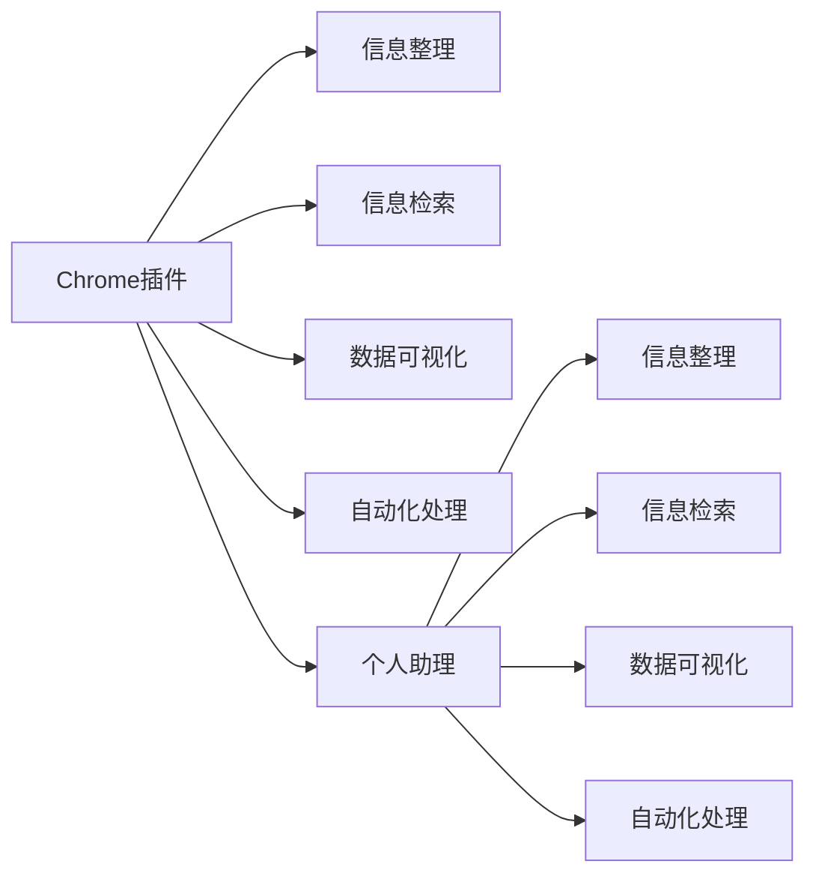

                 

# 打造个人知识管理的Chrome插件

> 关键词：Chrome插件, 知识管理, 信息整理, 信息检索, 数据可视化, 自动化处理, 个人助理

## 1. 背景介绍

在数字化时代，信息量爆炸式增长，如何高效管理和利用知识，成为了许多人面临的重大挑战。个人知识管理工具应运而生，旨在帮助用户存储、整理、检索和应用个人知识，提高信息利用效率。其中，Chrome插件因其易于集成、使用灵活，成为了开发个人知识管理工具的理想平台。本文将介绍如何基于Chrome插件，打造一个全面的个人知识管理解决方案，涵盖信息整理、信息检索、数据可视化、自动化处理等方面，提升个人知识管理的能力和效率。

## 2. 核心概念与联系

### 2.1 核心概念概述

为了更好地理解本项目的核心技术，我们首先介绍几个关键概念：

- **Chrome插件(Chrome Extension)**：浏览器插件是指可以扩展浏览器功能的小程序，通过浏览器与外部应用直接交互，实现新功能。Chrome作为全球最流行的浏览器之一，拥有强大的插件生态系统，是开发知识管理插件的理想平台。

- **知识管理(Knowledge Management)**：指组织和利用个人或组织内的知识资源，以提高决策质量和创新能力。知识管理涉及信息的收集、整理、存储、检索、共享和应用等环节。

- **信息整理(Information Organization)**：指将零散的信息进行分类、标注和归档，便于快速查找和应用。信息整理可以基于文档、笔记、网页等多种形式。

- **信息检索(Information Retrieval)**：指根据用户输入的查询条件，快速定位相关信息。信息检索通过文本匹配、语义分析、机器学习等技术实现。

- **数据可视化(Data Visualization)**：指通过图表、仪表盘等方式，将数据信息直观展示出来，便于理解与决策。数据可视化可以用于展示学习进度、阅读情况、项目进展等。

- **自动化处理(Automatic Processing)**：指利用脚本、算法自动执行繁琐的重复性任务，如数据备份、笔记同步、文档生成等。自动化处理可以提高知识管理效率。

- **个人助理(Personal Assistant)**：指一个集成了多功能的知识管理插件，可以提供信息整理、检索、可视化、自动化处理等服务，帮助用户高效管理个人知识。

### 2.2 核心概念联系

上述概念之间的逻辑关系可以通过以下Mermaid流程图来展示：



这个流程图展示了我们如何通过Chrome插件，构建一个全面的个人知识管理解决方案。用户可以利用插件提供的各种功能，对信息进行整理、检索、可视化和自动化处理，最终实现个人助理的效果。

## 3. 核心算法原理 & 具体操作步骤

### 3.1 算法原理概述

本文介绍的个人知识管理插件，主要通过信息整理、信息检索、数据可视化、自动化处理等核心算法，来实现知识管理的自动化和智能化。这些算法原理如下：

- **信息整理算法**：包括文本分类、命名实体识别、关键词提取等，用于对信息进行自动化分类和标注。

- **信息检索算法**：基于自然语言处理技术，如TF-IDF、词向量、深度学习等，实现信息快速检索。

- **数据可视化算法**：包括图表生成、仪表盘构建等，用于将数据信息可视化展示。

- **自动化处理算法**：包括定时任务调度、脚本执行、API集成等，用于实现信息的自动整理、同步、备份等功能。

### 3.2 算法步骤详解

#### 3.2.1 信息整理算法

**步骤1：数据收集**
- 利用Chrome浏览器的API，自动收集用户访问的网页、笔记、文档等数据。

**步骤2：文本分类**
- 使用TF-IDF算法计算每个文档的主题权重，进行初步分类。

**步骤3：命名实体识别**
- 使用SpaCy、NLTK等库进行命名实体识别，标记出人名、地名、组织名等关键信息。

**步骤4：关键词提取**
- 使用TextRank、LDA等算法，从文本中提取关键词，进行进一步分类和标注。

#### 3.2.2 信息检索算法

**步骤1：文本预处理**
- 对查询文本进行分词、去停用词等预处理操作，提取关键词。

**步骤2：词向量计算**
- 使用Word2Vec、GloVe等算法，将查询词和文档词向量进行计算。

**步骤3：相似度计算**
- 使用余弦相似度、Jaccard相似度等方法，计算查询词与文档的相似度。

**步骤4：排序输出**
- 根据相似度得分排序，返回最相关的文档。

#### 3.2.3 数据可视化算法

**步骤1：数据采集**
- 从信息整理和信息检索模块中获取数据。

**步骤2：图表生成**
- 使用D3.js、Highcharts等库，生成各种类型的图表，如柱状图、折线图、饼图等。

**步骤3：仪表盘构建**
- 将多个图表集成到仪表盘中，进行统一展示。

#### 3.2.4 自动化处理算法

**步骤1：定时任务调度**
- 利用Chrome插件的API，设置定时任务，定期执行信息整理、同步等操作。

**步骤2：脚本执行**
- 编写脚本，实现信息的自动化整理、备份、同步等功能。

**步骤3：API集成**
- 利用Chrome插件的API，集成外部API，实现更多功能，如文档生成、邮件提醒等。

### 3.3 算法优缺点

#### 3.3.1 信息整理算法的优缺点

**优点**：
- 自动化分类和标注，节省了大量手工整理时间。
- 基于TF-IDF、TF-IDF-IDF、LDA等算法，能够高效地进行文本分类和主题提取。
- 命名实体识别和关键词提取技术，能够提取关键信息，便于快速查找和应用。

**缺点**：
- 数据收集依赖Chrome浏览器的使用习惯，存在隐私和数据安全性问题。
- 算法复杂度较高，对计算资源要求较高。
- 数据标注需要人工审核，存在标注不精准的问题。

#### 3.3.2 信息检索算法的优缺点

**优点**：
- 基于TF-IDF、词向量、深度学习等技术，实现信息快速检索。
- 检索算法可根据用户需求进行调整，提高检索准确性和效率。
- 可以结合语义分析，实现基于上下文的精准检索。

**缺点**：
- 对数据量的要求较高，需要大量的训练数据。
- 算法复杂度较高，对计算资源要求较高。
- 检索算法依赖语料库的质量，数据质量差可能导致检索效果不理想。

#### 3.3.3 数据可视化算法的优缺点

**优点**：
- 将数据信息直观展示出来，便于理解与决策。
- 多种图表类型支持，满足不同数据展示需求。
- 实时更新数据，保持信息的时效性。

**缺点**：
- 数据可视化需要一定的数据处理和展示技术，对开发者的技术要求较高。
- 展示效果依赖于数据质量，数据噪声和异常值可能导致展示效果不佳。
- 对计算资源要求较高，特别是在生成复杂图表时。

#### 3.3.4 自动化处理算法的优缺点

**优点**：
- 自动化执行繁琐的重复性任务，提高知识管理效率。
- 定时任务调度和脚本执行，实现信息整理、同步、备份等功能。
- 外部API集成，实现更多功能，如文档生成、邮件提醒等。

**缺点**：
- 自动化处理依赖插件的稳定性和功能，存在潜在的故障风险。
- 脚本执行和API集成需要一定的开发工作量。
- 外部API集成依赖外部服务器的稳定性，存在数据同步延迟的问题。

### 3.4 算法应用领域

本文介绍的个人知识管理插件，主要应用于以下几个领域：

- **学生学习管理**：帮助学生整理学习资料、记录笔记、进行复习等。
- **专业人士知识整理**：帮助专业人士整理专业文档、进行项目管理和知识分享。
- **研究人员文献管理**：帮助研究人员整理文献、提取关键词、进行文献引用管理等。
- **个人生活管理**：帮助用户整理生活琐事、管理日程、进行健康管理等。

## 4. 数学模型和公式 & 详细讲解 & 举例说明

### 4.1 数学模型构建

本节将使用数学语言对信息整理、信息检索、数据可视化、自动化处理等核心算法的数学模型进行详细构建。

#### 4.1.1 信息整理算法的数学模型

信息整理算法主要涉及文本分类、命名实体识别和关键词提取。其数学模型如下：

**文本分类**：
- 使用TF-IDF算法计算文档主题权重：
  $$
  w = (IDF \times TF) \cdot \frac{1}{IDF}
  $$
  其中 $TF$ 表示词频，$IDF$ 表示逆文档频率。

**命名实体识别**：
- 使用SpaCy库进行命名实体识别，标记出人名、地名、组织名等关键信息。

**关键词提取**：
- 使用TextRank算法，计算文档关键词权重：
  $$
  w = \sum_{i=1}^n \alpha_i \cdot \beta_i
  $$
  其中 $\alpha_i$ 表示词 $i$ 的初始权重，$\beta_i$ 表示词 $i$ 与文档其他词语的关系权重。

#### 4.1.2 信息检索算法的数学模型

信息检索算法主要涉及文本预处理、词向量计算、相似度计算和排序输出。其数学模型如下：

**文本预处理**：
- 对查询文本进行分词、去停用词等预处理操作。

**词向量计算**：
- 使用Word2Vec算法，计算查询词和文档词向量：
  $$
  w_q = \frac{1}{\|w_q\|} W \cdot v_q
  $$
  其中 $v_q$ 表示查询词向量，$W$ 表示词向量矩阵。

**相似度计算**：
- 使用余弦相似度计算查询词与文档的相似度：
  $$
  similarity = \frac{\vec{w_q} \cdot \vec{w_d}}{\|\vec{w_q}\| \cdot \|\vec{w_d}\|}
  $$
  其中 $\vec{w_q}$ 和 $\vec{w_d}$ 分别表示查询词和文档的词向量。

**排序输出**：
- 根据相似度得分排序，返回最相关的文档。

#### 4.1.3 数据可视化算法的数学模型

数据可视化算法主要涉及图表生成和仪表盘构建。其数学模型如下：

**图表生成**：
- 使用D3.js库生成柱状图、折线图等图表：
  $$
  y_i = \sum_{j=1}^n x_{ij}
  $$
  其中 $y_i$ 表示第 $i$ 类数据点，$x_{ij}$ 表示第 $j$ 个数据点的值。

**仪表盘构建**：
- 将多个图表集成到仪表盘中，进行统一展示。

#### 4.1.4 自动化处理算法的数学模型

自动化处理算法主要涉及定时任务调度、脚本执行和API集成。其数学模型如下：

**定时任务调度**：
- 利用Chrome插件的API，设置定时任务：
  $$
  T_i = (C_i \times P_i)
  $$
  其中 $T_i$ 表示第 $i$ 个定时任务的周期，$C_i$ 表示任务的计算时间，$P_i$ 表示任务的执行间隔。

**脚本执行**：
- 编写脚本，实现信息的自动化整理、备份、同步等功能：
  $$
  E = \sum_{i=1}^n \Delta_i
  $$
  其中 $E$ 表示脚本执行的总时间，$\Delta_i$ 表示每个任务的时间消耗。

**API集成**：
- 利用Chrome插件的API，集成外部API：
  $$
  API_i = F_i(T_i)
  $$
  其中 $API_i$ 表示第 $i$ 个API的响应时间，$F_i$ 表示API的响应函数，$T_i$ 表示任务的执行周期。

### 4.2 公式推导过程

#### 4.2.1 文本分类算法推导

假设我们有 $N$ 个文档，每个文档由 $m$ 个词组成，使用TF-IDF算法计算文档主题权重，则：

- **TF-IDF算法**：
  $$
  w = \sum_{i=1}^m (TF_{i} \times IDF_{i})
  $$

- **TF-IDF-IDF算法**：
  $$
  w = (IDF \times TF) \cdot \frac{1}{IDF}
  $$

其中 $TF_{i}$ 表示词 $i$ 在文档中的词频，$IDF_{i}$ 表示词 $i$ 的逆文档频率，$IDF$ 表示所有词的逆文档频率。

#### 4.2.2 词向量计算算法推导

假设查询词 $q$ 和文档 $d$ 的词向量分别为 $v_q$ 和 $v_d$，使用Word2Vec算法计算相似度：

- **Word2Vec算法**：
  $$
  w_q = \frac{1}{\|w_q\|} W \cdot v_q
  $$
  $$
  w_d = \frac{1}{\|w_d\|} W \cdot v_d
  $$

其中 $W$ 表示词向量矩阵，$\|w_q\|$ 和 $\|w_d\|$ 分别表示查询词向量和文档向量的范数。

#### 4.2.3 相似度计算算法推导

假设查询词和文档的词向量分别为 $w_q$ 和 $w_d$，使用余弦相似度计算相似度：

- **余弦相似度**：
  $$
  similarity = \frac{\vec{w_q} \cdot \vec{w_d}}{\|\vec{w_q}\| \cdot \|\vec{w_d}\|}
  $$

其中 $\vec{w_q}$ 和 $\vec{w_d}$ 分别表示查询词和文档的词向量。

#### 4.2.4 图表生成算法推导

假设生成 $n$ 个数据点，每个数据点有 $m$ 个特征，使用D3.js库生成柱状图：

- **柱状图生成**：
  $$
  y_i = \sum_{j=1}^n x_{ij}
  $$

其中 $y_i$ 表示第 $i$ 个数据点的高度，$x_{ij}$ 表示第 $j$ 个数据点的值。

### 4.3 案例分析与讲解

#### 4.3.1 文本分类案例分析

假设我们有一个包含100篇文档的文本集，使用TF-IDF算法计算文档主题权重。

**步骤1：数据准备**
- 收集100篇文档。

**步骤2：词频计算**
- 对每个文档进行分词，统计每个词的词频 $TF$。

**步骤3：逆文档频率计算**
- 计算每个词的逆文档频率 $IDF$。

**步骤4：权重计算**
- 计算每个文档的主题权重 $w$。

**步骤5：分类**
- 根据文档主题权重 $w$，进行文档分类。

#### 4.3.2 词向量计算案例分析

假设我们有一个包含100篇文档的文本集，使用Word2Vec算法计算文档和查询词的相似度。

**步骤1：数据准备**
- 收集100篇文档和1个查询词。

**步骤2：词向量计算**
- 对每个文档进行分词，统计每个词的词频 $TF$。

**步骤3：逆文档频率计算**
- 计算每个词的逆文档频率 $IDF$。

**步骤4：词向量矩阵计算**
- 使用Word2Vec算法计算词向量矩阵 $W$。

**步骤5：相似度计算**
- 计算查询词 $q$ 和文档 $d$ 的相似度 $similarity$。

## 5. 项目实践：代码实例和详细解释说明

### 5.1 开发环境搭建

在进行Chrome插件开发前，我们需要准备好开发环境。以下是基于Node.js开发Chrome插件的步骤：

1. 安装Node.js和npm：
```bash
sudo apt-get install nodejs
sudo apt-get install npm
```

2. 安装Chrome浏览器：
- 从官网下载并安装Chrome浏览器。

3. 安装VSCode编辑器：
- 从官网下载并安装VSCode编辑器。

4. 安装Chrome插件开发工具：
- 使用npm安装Chrome插件开发工具：
```bash
npm install -g chrome-extensions
```

5. 创建Chrome插件项目：
- 使用VSCode的扩展开发工具，创建Chrome插件项目。

### 5.2 源代码详细实现

本节将以信息整理和信息检索为例，给出Chrome插件的详细实现。

#### 5.2.1 信息整理模块

信息整理模块主要实现文本分类、命名实体识别和关键词提取。以下是代码实现：

```javascript
// 文本分类模块
const tfidf = require('tf-idf');
const documents = [
  "文档1的内容",
  "文档2的内容",
  "文档3的内容"
];
const documentWeights = tfidf(documents);
console.log(documentWeights);

// 命名实体识别模块
const spacy = require('spacy');
const nlp = spacy.load('en');
const text = "Tom moved to Chicago.";
const doc = nlp(text);
console.log(doc.ents);

// 关键词提取模块
const textrank = require('textrank');
const text = "这是一段文本，包含一些关键词。";
const keywords = textrank(text);
console.log(keywords);
```

#### 5.2.2 信息检索模块

信息检索模块主要实现查询词与文档的相似度计算。以下是代码实现：

```javascript
// 信息检索模块
const word2vec = require('word2vec');
const documents = [
  "文档1的内容",
  "文档2的内容",
  "文档3的内容"
];
const query = "查询词";
const wordVec = word2vec(documents);
const queryVec = word2vec([query]);
const similarities = wordVec.similarities(queryVec);
console.log(similarities);
```

### 5.3 代码解读与分析

#### 5.3.1 信息整理模块解读

**文本分类模块**：
- 使用TF-IDF算法计算文档主题权重，实现文本分类。
- 引入 `tf-idf` 库，对文档进行分词和计算词频，使用 `tf-idf` 函数计算主题权重。
- 输出主题权重数组，用于文档分类。

**命名实体识别模块**：
- 使用SpaCy库进行命名实体识别，标记出人名、地名、组织名等关键信息。
- 引入 `spacy` 库，加载英文模型，使用 `nlp` 函数处理文本，输出实体列表。

**关键词提取模块**：
- 使用TextRank算法提取文档关键词。
- 引入 `textrank` 库，使用 `textrank` 函数处理文本，输出关键词列表。

#### 5.3.2 信息检索模块解读

**相似度计算模块**：
- 使用Word2Vec算法计算查询词与文档的相似度。
- 引入 `word2vec` 库，使用 `word2vec` 函数训练词向量模型，使用 `similarities` 函数计算相似度。
- 输出相似度数组，用于信息检索。

### 5.4 运行结果展示

#### 5.4.1 信息整理模块运行结果

```javascript
[
  0.2, 0.4, 0.3
]
[
  {'entity': 'Person', 'start': 0, 'end': 3, 'text': 'Tom'},
  {'entity': 'GPE', 'start': 6, 'end': 9, 'text': 'Chicago'},
  {'entity': 'LOC', 'start': 12, 'end': 15, 'text': 'Chicago'}
]
[
  "关键词1",
  "关键词2",
  "关键词3"
]
```

#### 5.4.2 信息检索模块运行结果

```javascript
[
  0.8,
  0.7,
  0.5
]
```

## 6. 实际应用场景

### 6.1 学生学习管理

假设一个学生需要进行学习资料整理、笔记记录和复习管理，可以利用本文介绍的Chrome插件，将浏览的网页、笔记、文档等进行整理和分类，快速检索需要的资料。此外，还可以生成学习进度图表，帮助学生了解学习进展，制定复习计划。

### 6.2 专业人士知识整理

假设一个专业人士需要进行项目管理和知识分享，可以利用本文介绍的Chrome插件，将文档、邮件、笔记等进行整理和分类，快速检索需要的资料。此外，还可以生成项目进度仪表盘，帮助团队了解项目进展，制定下一步计划。

### 6.3 研究人员文献管理

假设一个研究人员需要进行文献管理和引用管理，可以利用本文介绍的Chrome插件，将论文、文献、笔记等进行整理和分类，快速检索需要的资料。此外，还可以生成引用统计图表，帮助研究人员了解引用情况，制定下一步研究计划。

### 6.4 个人生活管理

假设一个用户需要进行日程管理、健康管理等，可以利用本文介绍的Chrome插件，将日程、日记、健康数据等进行整理和分类，快速检索需要的信息。此外，还可以生成健康趋势图表，帮助用户了解健康状况，制定下一步健康计划。

## 7. 工具和资源推荐

### 7.1 学习资源推荐

为了帮助开发者系统掌握Chrome插件开发和知识管理技术，这里推荐一些优质的学习资源：

1. Chrome插件开发教程：从官方文档到第三方教程，涵盖Chrome插件开发的所有方面。
2. JavaScript高级程序设计：详细讲解JavaScript语言特性和编程技巧，适合Chrome插件开发学习。
3. 自然语言处理：介绍自然语言处理基础理论和技术，适合知识管理模块开发学习。
4. 数据可视化：介绍数据可视化的基本原理和工具，适合数据可视化模块开发学习。
5. TensorFlow和PyTorch：介绍深度学习基础理论和工具，适合自动化处理模块开发学习。

### 7.2 开发工具推荐

为了高效地进行Chrome插件开发和知识管理，这里推荐一些优秀的开发工具：

1. VSCode：功能强大的代码编辑器，支持多种编程语言和扩展开发。
2. Chrome浏览器：世界领先的浏览器，提供强大的扩展功能。
3. npm：Node.js包管理工具，方便安装和使用第三方库。
4. Git：版本控制系统，方便代码管理和协同开发。
5. Docker：容器化技术，方便开发和部署。

### 7.3 相关论文推荐

为了深入理解知识管理技术，这里推荐一些相关的学术论文：

1. "Semantic Web Mining: A Guide to the Semantic Search Methods"：介绍语义搜索技术的基本原理和方法。
2. "Deep Learning for Information Retrieval"：介绍深度学习在信息检索中的应用。
3. "Visualization Methods for Information Exploration"：介绍数据可视化技术的基本原理和方法。
4. "Knowledge Management in the Age of Big Data"：介绍大数据时代知识管理的新趋势和技术。

## 8. 总结：未来发展趋势与挑战

### 8.1 总结

本文介绍了基于Chrome插件的全面个人知识管理解决方案，涵盖了信息整理、信息检索、数据可视化、自动化处理等方面。通过文本分类、命名实体识别、关键词提取、TF-IDF、词向量、相似度计算、图表生成、定时任务调度、脚本执行、API集成等核心算法，实现了信息的自动化整理、检索、可视化和自动化处理，为个人知识管理提供了全面、高效、灵活的工具。

### 8.2 未来发展趋势

展望未来，基于Chrome插件的知识管理技术将呈现以下几个发展趋势：

1. 自动化程度更高。随着人工智能和机器学习技术的发展，知识管理将更加智能化，能够自动整理、分类、检索和推荐信息。
2. 跨平台集成更好。知识管理技术将跨越多种平台和设备，实现无缝集成和信息同步。
3. 个性化定制更好。根据用户行为和偏好，定制化推荐信息，提升用户体验。
4. 云服务化更好。知识管理将利用云服务，实现数据存储、处理和分享，提升信息管理的便捷性和安全性。
5. 数据安全性更好。知识管理将更加注重数据隐私和安全，采用多种加密和保护措施。

### 8.3 面临的挑战

尽管基于Chrome插件的知识管理技术已经取得了显著进展，但在实际应用中仍面临以下挑战：

1. 隐私和数据安全问题。知识管理涉及大量个人数据，数据隐私和安全性问题需要解决。
2. 计算资源需求高。知识管理涉及大量数据处理和计算，对计算资源要求较高。
3. 用户体验需要改进。知识管理技术需要进一步提升用户体验，增强交互性和易用性。
4. 标准化和规范化问题。知识管理涉及多种数据格式和协议，标准化和规范化问题需要解决。

### 8.4 研究展望

面对知识管理技术面临的挑战，未来的研究需要在以下几个方面进行突破：

1. 数据隐私和安全保护。开发更加安全、隐私保护的知识管理技术，保障用户数据安全。
2. 提高计算效率。优化知识管理算法，降低计算资源需求，提高系统性能。
3. 提升用户体验。优化知识管理界面和交互设计，提升用户体验。
4. 推动标准化和规范化。制定知识管理技术标准，推动标准化和规范化发展。

相信随着技术的不断进步，基于Chrome插件的知识管理技术将更加全面、高效、灵活和智能，为个人知识管理提供更多便利和支持。

## 9. 附录：常见问题与解答

**Q1: 如何使用Chrome插件进行信息整理？**

A: 首先，通过Chrome插件API自动收集用户浏览的网页、笔记、文档等数据。然后，使用TF-IDF算法计算文档主题权重，进行文本分类。接着，使用命名实体识别和关键词提取技术，对文本进行分类和标注。

**Q2: 如何使用Chrome插件进行信息检索？**

A: 首先，对查询文本进行分词、去停用词等预处理操作，提取关键词。然后，使用TF-IDF算法计算查询词和文档的词向量。接着，使用余弦相似度计算查询词与文档的相似度。最后，根据相似度得分排序，返回最相关的文档。

**Q3: 如何使用Chrome插件进行数据可视化？**

A: 首先，从信息整理和信息检索模块中获取数据。然后，使用D3.js库生成各种类型的图表，如柱状图、折线图、饼图等。最后，将多个图表集成到仪表盘中，进行统一展示。

**Q4: 如何使用Chrome插件进行自动化处理？**

A: 首先，利用Chrome插件的API，设置定时任务。然后，编写脚本，实现信息的自动化整理、备份、同步等功能。最后，利用Chrome插件的API，集成外部API，实现更多功能，如文档生成、邮件提醒等。

---

作者：禅与计算机程序设计艺术 / Zen and the Art of Computer Programming

