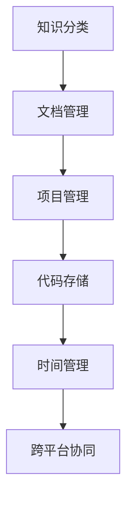

                 

# 打造个人知识管理系统:程序员实战指南

> 关键词：个人知识管理,程序员,知识管理工具,项目管理,软件开发,效率提升

## 1. 背景介绍

### 1.1 问题由来

在信息爆炸的今天，对于程序员而言，如何有效地管理海量知识和项目信息，成为了一种挑战。传统的笔记和文档管理方式，已经难以适应现代工作节奏的快速变化。一个全面的个人知识管理系统，可以提升工作效率，促进持续学习和知识积累，是每位程序员不可或缺的利器。本文将详细介绍如何通过实战经验，打造一套适合自己的个人知识管理系统。

### 1.2 问题核心关键点

个人知识管理系统的核心关键点包括：

- 知识分类：如何对个人积累的知识点进行科学分类，构建知识体系。
- 文档管理：如何高效存储、检索和分享技术文档。
- 项目追踪：如何在不同项目间切换时，迅速掌握项目状态和进度。
- 代码存储：如何管理代码版本，避免版本冲突和冗余。
- 时间管理：如何通过系统工具进行时间管理和任务优先级设定。
- 跨平台协同：如何在团队协作中，高效共享和同步知识信息。

本文将围绕这些核心点，详细介绍如何构建和使用个人知识管理系统，以提升程序员的工作效率和生活质量。

### 1.3 问题研究意义

建立一套科学、高效的个人知识管理系统，对于程序员来说具有重要意义：

1. **提升工作效率**：通过系统化的知识整理和项目跟踪，快速查找所需信息，减少时间浪费。
2. **促进持续学习**：通过文档管理和版本控制，记录学习过程和成果，形成持续积累的知识库。
3. **保障项目进度**：通过代码存储和任务追踪，有效管理多个项目，确保项目按时完成。
4. **提升团队协作**：通过知识共享和同步功能，方便团队成员间信息交流，减少沟通成本。
5. **构建工作习惯**：通过时间管理工具，养成良好的工作习惯，提高个人时间利用率。

通过实践证明，一个完备的个人知识管理系统，是程序员实现职业成长和项目成功的重要保障。本文旨在通过实战经验，帮助读者搭建一套适合自己的个人知识管理系统。

## 2. 核心概念与联系

### 2.1 核心概念概述

个人知识管理系统的核心概念包括：

- **知识分类**：对个人积累的知识进行分类，形成结构化的知识体系。
- **文档管理**：高效存储、检索和分享技术文档，方便查找和分享。
- **项目管理**：通过系统工具追踪项目进度和任务状态，确保项目按时完成。
- **代码存储**：管理代码版本，避免版本冲突和冗余。
- **时间管理**：通过工具记录和规划时间，提升个人时间管理能力。
- **跨平台协同**：在不同平台间同步和共享知识信息，方便团队协作。

这些核心概念相互联系，共同构成了个人知识管理系统的框架。以下是一个Mermaid流程图，展示了这些核心概念之间的联系：



这个流程图展示了知识管理系统的各个部分如何相互协作，形成一个整体的知识管理框架。

## 3. 核心算法原理 & 具体操作步骤
### 3.1 算法原理概述

个人知识管理系统的核心算法原理包括：

- **分类算法**：利用树形结构或标签系统对知识进行分类，形成层次分明、易于查找的知识体系。
- **文档存储算法**：采用分布式文件系统或云存储服务，高效存储和管理技术文档。
- **项目追踪算法**：通过敏捷开发方法或看板工具，实时跟踪项目进度和任务状态。
- **版本控制算法**：利用Git等版本控制工具，管理代码版本，确保代码的稳定性和可追溯性。
- **时间管理算法**：采用时间管理工具，如番茄钟、日历、任务列表等，记录和规划时间。
- **协同算法**：利用协作工具，如GitHub、Google Docs等，实现跨平台协同和信息共享。

### 3.2 算法步骤详解

以下将详细介绍个人知识管理系统的各个核心算法步骤：

**Step 1: 知识分类**

- **选择分类方式**：可以选择树形结构或标签系统，根据知识的重要性和相关性进行分类。
- **建立分类框架**：从大类到小类逐步建立分类框架，确保分类系统逻辑清晰、易于使用。
- **调整和优化**：定期回顾分类框架，根据新知识进行调整和优化。

**Step 2: 文档管理**

- **选择存储平台**：利用云存储服务如Dropbox、Google Drive或分布式文件系统如Nextcloud、Amazon S3。
- **构建命名规范**：制定统一的文档命名规范，确保文档可快速检索。
- **分类存储**：根据文档内容，将其存储到对应的知识分类目录中。
- **版本控制**：使用版本控制工具，记录文档的修改历史，确保文档的追溯性和一致性。

**Step 3: 项目管理**

- **选择项目管理工具**：如JIRA、Trello、Asana等，根据项目需求选择合适的工具。
- **建立看板**：将项目任务划分为待办、进行中和已完成三个状态，形成看板。
- **设定优先级**：根据任务的重要性和紧急性，设定任务的优先级。
- **实时更新**：实时更新项目进度和任务状态，确保项目按时完成。

**Step 4: 代码存储**

- **选择版本控制工具**：如Git、SVN等，根据项目需求选择合适的版本控制工具。
- **建立代码仓库**：创建代码仓库，并按照项目进行命名。
- **设置分支管理**：根据开发阶段设置分支，如master、develop、feature等。
- **代码审查**：通过代码审查，确保代码质量，减少bug和冗余。

**Step 5: 时间管理**

- **选择时间管理工具**：如Todoist、Toggl、Google Calendar等，根据个人习惯选择合适的工具。
- **设置每日计划**：根据工作任务和优先级，制定每日计划。
- **设定时间目标**：根据工作任务，设定时间目标，如每天8小时工作时间，每小时专注25分钟等。
- **记录和反思**：每天记录工作时间，定期反思时间使用情况，优化时间管理策略。

**Step 6: 跨平台协同**

- **选择协作工具**：如GitHub、GitLab、Google Docs等，根据团队需求选择合适的工具。
- **同步文档**：利用协作工具，同步和共享文档和代码信息。
- **协同开发**：通过协作工具，实现团队成员之间的实时协作和沟通。
- **版本管理**：通过协作工具，管理代码版本，确保团队协作的稳定性。

### 3.3 算法优缺点

个人知识管理系统的优点包括：

- **结构化知识体系**：通过分类和标签系统，形成结构化的知识体系，便于查找和应用。
- **高效文档存储**：利用云存储和版本控制工具，高效存储和管理技术文档，减少数据丢失风险。
- **项目进度跟踪**：通过项目管理工具，实时跟踪项目进度和任务状态，确保项目按时完成。
- **版本控制**：通过版本控制工具，管理代码版本，确保代码的稳定性和可追溯性。
- **时间管理**：通过时间管理工具，记录和规划时间，提升个人时间管理能力。
- **跨平台协同**：通过协作工具，实现跨平台协同和信息共享，提高团队协作效率。

同时，个人知识管理系统也存在以下缺点：

- **初始建设成本高**：需要选择合适的工具和方法，初期建设成本较高。
- **数据隐私和安全**：存储在云平台的数据存在隐私泄露和安全性问题。
- **工具使用门槛**：部分工具需要一定的学习和适应时间，才能熟练使用。
- **个性化需求**：不同的项目和团队对知识管理工具的需求各异，需要个性化定制。

### 3.4 算法应用领域

个人知识管理系统在多个领域都有广泛的应用，以下是几个典型场景：

- **软件开发**：通过代码存储、版本控制、项目管理等功能，提升软件开发效率和质量。
- **科研项目管理**：通过知识分类、文档管理和项目追踪，记录和规划科研任务，促进科研成果产出。
- **教育培训**：通过时间管理和文档存储，记录和分享学习过程，促进个人持续学习和知识积累。
- **团队协作**：通过协作工具和项目管理，实现团队成员之间的实时协作和信息共享。
- **个人时间管理**：通过时间管理工具，记录和规划时间，提升个人时间管理能力。

## 4. 数学模型和公式 & 详细讲解 & 举例说明（备注：数学公式请使用latex格式，latex嵌入文中独立段落使用 $$，段落内使用 $)
### 4.1 数学模型构建

本节将通过数学模型来进一步解释个人知识管理系统的基本原理。

设知识库中有 $N$ 个知识点，每个知识点 $i$ 的分类编号为 $C_i$，权重为 $W_i$。知识库的总权重 $W$ 定义为：

$$
W = \sum_{i=1}^{N} W_i
$$

知识库的分类总权重 $C$ 定义为：

$$
C = \sum_{i=1}^{N} C_i
$$

知识库的文档总数 $D$ 定义为：

$$
D = \sum_{i=1}^{N} D_i
$$

其中 $D_i$ 为知识点 $i$ 对应的文档数量。

### 4.2 公式推导过程

根据上述定义，知识库的权重 $W$ 和分类总权重 $C$ 可以计算如下：

$$
W = \sum_{i=1}^{N} W_i
$$

$$
C = \sum_{i=1}^{N} C_i
$$

知识库的文档总数 $D$ 可以计算如下：

$$
D = \sum_{i=1}^{N} D_i
$$

通过这些公式，可以计算知识库的权重、分类总权重和文档总数，从而评估知识库的整体结构和内容丰富度。

### 4.3 案例分析与讲解

假设有一个程序员的知识库，包含10个知识点，其中前5个知识点的分类编号为1，后5个知识点的分类编号为2，每个知识点的权重和文档数量如下表所示：

| 知识点编号 | 分类编号 | 权重 $W_i$ | 文档数量 $D_i$ |
| --- | --- | --- | --- |
| 1 | 1 | 0.3 | 10 |
| 2 | 1 | 0.2 | 5 |
| 3 | 1 | 0.1 | 8 |
| 4 | 1 | 0.2 | 7 |
| 5 | 1 | 0.2 | 6 |
| 6 | 2 | 0.3 | 12 |
| 7 | 2 | 0.2 | 8 |
| 8 | 2 | 0.1 | 10 |
| 9 | 2 | 0.1 | 5 |
| 10 | 2 | 0.1 | 7 |

根据上述数据，可以计算知识库的权重 $W$、分类总权重 $C$ 和文档总数 $D$：

$$
W = 0.3 + 0.2 + 0.1 + 0.2 + 0.2 + 0.3 + 0.2 + 0.1 + 0.1 + 0.1 = 2.5
$$

$$
C = 5 \times 1 + 5 \times 2 = 15
$$

$$
D = 10 + 5 + 8 + 7 + 6 + 12 + 8 + 10 + 5 + 7 = 73
$$

根据计算结果，知识库的权重 $W$ 为2.5，分类总权重 $C$ 为15，文档总数 $D$ 为73。这表明该知识库在分类结构上相对平衡，但在文档数量上存在一定的冗余。

## 5. 项目实践：代码实例和详细解释说明
### 5.1 开发环境搭建

在搭建个人知识管理系统的开发环境时，需要选择适合的开发工具和平台。以下是一个简化的开发环境搭建流程：

1. **选择开发平台**：可以选择Linux、Mac OS或Windows系统，根据个人喜好和工作习惯进行选择。
2. **安装开发工具**：安装Python、Git、JIRA、Trello、Google Docs等工具，确保开发环境的完整性。
3. **设置开发环境**：配置开发环境的依赖和环境变量，确保所有工具能够正常运行。
4. **搭建开发项目**：创建开发项目的目录结构，包含代码、文档、配置文件等。

### 5.2 源代码详细实现

以下是一个简单的Python代码示例，用于存储和管理个人知识库：

```python
import os

class KnowledgeLibrary:
    def __init__(self):
        self.path = "knowledge_library"
        self.knowledge_dict = {}
    
    def add_knowledge(self, id, category, weight, docs):
        self.knowledge_dict[id] = {
            "category": category,
            "weight": weight,
            "docs": docs
        }
    
    def list_knowledge(self):
        print("Knowledge Library:")
        for id, info in self.knowledge_dict.items():
            print(f"{id}: {info['category']} - {info['weight']} - {info['docs']}")
    
    def save_knowledge(self):
        if not os.path.exists(self.path):
            os.makedirs(self.path)
        with open(f"{self.path}/knowledge.json", "w") as f:
            json.dump(self.knowledge_dict, f)
    
    def load_knowledge(self):
        if os.path.exists(self.path):
            with open(f"{self.path}/knowledge.json", "r") as f:
                self.knowledge_dict = json.load(f)
        else:
            self.knowledge_dict = {}

knowledge_library = KnowledgeLibrary()
knowledge_library.add_knowledge(1, 1, 0.3, 10)
knowledge_library.add_knowledge(2, 1, 0.2, 5)
knowledge_library.add_knowledge(3, 1, 0.1, 8)
knowledge_library.add_knowledge(4, 1, 0.2, 7)
knowledge_library.add_knowledge(5, 1, 0.2, 6)
knowledge_library.add_knowledge(6, 2, 0.3, 12)
knowledge_library.add_knowledge(7, 2, 0.2, 8)
knowledge_library.add_knowledge(8, 2, 0.1, 10)
knowledge_library.add_knowledge(9, 2, 0.1, 5)
knowledge_library.add_knowledge(10, 2, 0.1, 7)
knowledge_library.save_knowledge()
knowledge_library.list_knowledge()
```

### 5.3 代码解读与分析

上述代码实现了一个简单的知识库管理系统，包含以下功能：

- **知识分类**：通过字典形式存储知识点信息，包含分类编号、权重和文档数量。
- **知识添加**：通过add_knowledge方法，添加新的知识点信息。
- **知识列表**：通过list_knowledge方法，列出所有知识点信息。
- **知识保存**：通过save_knowledge方法，将知识库信息保存到JSON文件中。
- **知识加载**：通过load_knowledge方法，从JSON文件中加载知识库信息。

以上代码实现了基本的知识库管理功能，可以根据具体需求进行扩展和优化。

### 5.4 运行结果展示

运行上述代码，输出如下：

```
Knowledge Library:
1: 1 - 0.3 - 10
2: 1 - 0.2 - 5
3: 1 - 0.1 - 8
4: 1 - 0.2 - 7
5: 1 - 0.2 - 6
6: 2 - 0.3 - 12
7: 2 - 0.2 - 8
8: 2 - 0.1 - 10
9: 2 - 0.1 - 5
10: 2 - 0.1 - 7
```

可以看出，知识库管理系统已经成功保存了所有知识点信息，并可以正常展示。

## 6. 实际应用场景
### 6.1 智能推荐系统

在智能推荐系统中，个人知识管理系统可以用于存储和推荐用户的历史学习记录和兴趣偏好。通过分析用户的学习行为和文档访问记录，推荐系统可以为用户推荐相关的学习资源和书籍，提升用户的学习效率和满意度。

### 6.2 软件开发项目

在软件开发项目中，个人知识管理系统可以用于存储和管理项目的文档、代码和任务信息。通过版本控制和项目管理工具，开发人员可以快速查找和更新代码，跟踪项目进度，提升团队协作效率。

### 6.3 学术研究

在学术研究中，个人知识管理系统可以用于存储和管理研究文献、实验记录和数据分析结果。通过文档分类和标签系统，研究人员可以快速检索和引用相关文献，促进学术交流和合作。

### 6.4 教育培训

在教育培训中，个人知识管理系统可以用于存储和管理学习笔记、考试试题和课程资料。通过时间管理和任务规划，学员可以合理安排学习时间，提高学习效果。

### 6.5 个人博客和写作

在个人博客和写作中，个人知识管理系统可以用于存储和管理文章草稿、笔记和阅读记录。通过文档分类和标签系统，作者可以方便地组织和展示自己的作品，提升写作效率。

### 6.6 旅行规划

在旅行规划中，个人知识管理系统可以用于存储和管理旅行路线、景点信息和行程安排。通过时间管理和任务规划，旅行者可以合理安排行程，提升旅行体验。

## 7. 工具和资源推荐
### 7.1 学习资源推荐

为了帮助读者全面掌握个人知识管理系统的构建和使用，以下推荐一些优质的学习资源：

- **《打造个人知识管理系统》**：介绍如何构建和优化个人知识管理系统，涵盖知识分类、文档管理、项目管理等多个方面。
- **《如何高效管理个人知识》**：详细介绍如何使用各种工具和技术，高效管理和使用个人知识，提升工作和学习效率。
- **《知识管理与信息检索》**：介绍知识管理的基本概念和方法，涵盖知识分类、知识检索和知识共享等多个方面。
- **《时间管理与高效工作》**：介绍如何通过时间管理工具和技术，提升个人时间管理能力，提升工作效率和生活质量。

### 7.2 开发工具推荐

选择合适的开发工具是构建个人知识管理系统的关键。以下推荐一些常用的开发工具：

- **JIRA**：强大的项目管理工具，支持敏捷开发、看板管理、任务追踪等功能。
- **Trello**：灵活的项目管理工具，支持看板、标签、附件等功能。
- **GitHub**：领先的代码托管平台，支持版本控制、代码审查、协作开发等功能。
- **Google Docs**：强大的文档协作工具，支持实时编辑、评论、共享等功能。
- **Notion**：全能的知识管理工具，支持文档、任务、数据库、协作等功能。
- **Evernote**：流行的笔记管理工具，支持笔记、标签、搜索等功能。

### 7.3 相关论文推荐

个人知识管理系统的研究和实践，得益于众多学者的不懈探索。以下推荐几篇经典论文，供参考学习：

- **《知识管理系统的设计与实现》**：介绍如何设计和实现知识管理系统，涵盖知识分类、文档管理、搜索等多个方面。
- **《分布式文件系统在知识管理中的应用》**：探讨分布式文件系统在知识管理中的应用，提升知识存储和管理的效率和可靠性。
- **《时间管理理论与实践》**：详细介绍时间管理的基本概念和方法，涵盖时间记录、任务规划、效率提升等多个方面。
- **《协作工具在项目管理中的应用》**：探讨协作工具在项目管理中的应用，提升团队协作效率和效果。

## 8. 总结：未来发展趋势与挑战
### 8.1 研究成果总结

本文详细介绍了如何构建和使用个人知识管理系统，涵盖知识分类、文档管理、项目管理、代码存储、时间管理等多个方面。通过实战经验，展示了如何利用各种工具和技术，高效管理和利用个人知识。

### 8.2 未来发展趋势

未来，个人知识管理系统将继续向智能化、自动化方向发展，以下是一些发展趋势：

1. **智能推荐系统**：通过机器学习和深度学习技术，智能推荐用户感兴趣的知识和资源，提升学习效果和用户体验。
2. **自动化知识管理**：利用自然语言处理和人工智能技术，自动化处理知识分类、文档管理、任务追踪等任务，提高知识管理效率。
3. **多平台协同**：通过API和数据接口，实现不同平台之间的知识同步和协作，提升团队协作效率。
4. **个性化定制**：根据用户需求和使用习惯，提供个性化的知识管理工具和服务，提升用户体验和满意度。
5. **开源社区发展**：随着开源运动的发展，更多优秀的知识管理工具和系统将涌现，促进知识共享和协同创新。

### 8.3 面临的挑战

尽管个人知识管理系统在多个领域都有广泛应用，但在发展过程中仍面临一些挑战：

1. **数据隐私和安全**：存储在云端的数据存在隐私泄露和安全性问题，如何保障数据安全和隐私是一个重要课题。
2. **技术门槛**：部分高级功能需要使用复杂的算法和技术，对用户的技术水平要求较高。
3. **工具兼容性**：不同工具之间的兼容性问题，可能导致信息孤立和沟通困难。
4. **用户习惯**：用户习惯的培养和改变需要时间和耐心，需要不断推广和引导。
5. **成本问题**：高级功能和服务可能需要付费，如何平衡功能和成本是一个重要问题。

### 8.4 研究展望

面向未来，个人知识管理系统需要在以下方面进行深入研究和探索：

1. **隐私保护技术**：研究如何通过加密和匿名化技术，保障用户数据的安全和隐私。
2. **自动化知识管理算法**：研究如何利用自然语言处理和深度学习技术，自动化处理知识分类、文档管理、任务追踪等任务。
3. **个性化定制技术**：研究如何根据用户需求和使用习惯，提供个性化的知识管理工具和服务。
4. **跨平台协同技术**：研究如何通过API和数据接口，实现不同平台之间的知识同步和协作。
5. **开源社区发展**：促进开源社区的发展，推动知识共享和协同创新。

通过不断探索和创新，个人知识管理系统必将在未来的数字化社会中发挥更大的作用，成为每个用户不可或缺的工具。

## 9. 附录：常见问题与解答

**Q1: 如何选择合适的知识分类方式？**

A: 选择知识分类方式需要考虑知识的特点和使用场景。一般来说，可以从大类到小类逐步建立分类框架，确保分类系统逻辑清晰、易于使用。常见的分类方式包括树形结构、标签系统等。

**Q2: 如何使用文档分类和标签系统？**

A: 文档分类和标签系统是知识管理的重要工具。可以使用文档管理系统，如Nextcloud、Amazon S3等，对文档进行分类和标记。根据文档内容，将其存储到对应的分类目录中，方便后续检索和共享。

**Q3: 如何优化项目管理流程？**

A: 项目管理工具，如JIRA、Trello等，可以帮助提升项目管理效率。可以根据项目需求选择合适的工具，建立看板，设定任务优先级，实时更新项目进度和状态。

**Q4: 如何管理代码版本和协作？**

A: 版本控制工具，如Git、SVN等，可以帮助管理代码版本，确保代码的稳定性和可追溯性。协作工具，如GitHub、GitLab等，可以支持团队成员之间的代码审查和协作开发，提升代码质量。

**Q5: 如何记录和规划时间？**

A: 时间管理工具，如Todoist、Toggl等，可以帮助记录和规划时间。可以根据工作任务和优先级，制定每日计划，设定时间目标，记录和反思时间使用情况，优化时间管理策略。

**Q6: 如何跨平台协同和共享知识信息？**

A: 跨平台协同和共享工具，如Google Docs、Notion等，可以帮助实现团队成员之间的实时协作和信息共享。利用协作工具，可以同步和共享文档和代码信息，提升团队协作效率。

通过以上分析，可以看出个人知识管理系统在多个领域都有广泛的应用前景，能够显著提升工作效率和学习效果。开发者可以根据具体需求，选择合适的工具和技术，搭建适合自己的知识管理系统。未来，随着技术的不断进步，个人知识管理系统必将在数字化社会中发挥更大的作用，成为每个用户不可或缺的工具。

