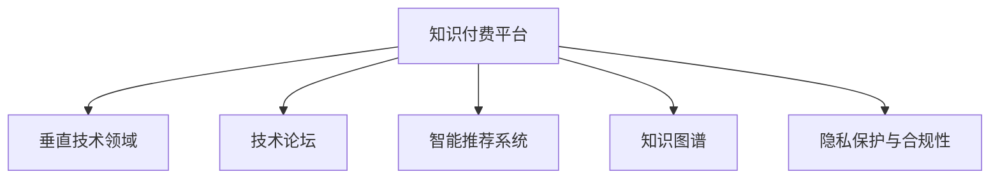

                 

# 打造垂直技术领域的知识付费论坛

> 关键词：知识付费,垂直领域,技术论坛,用户社群,智能推荐,人工智能,知识图谱,隐私保护

## 1. 背景介绍

### 1.1 问题由来
随着互联网和移动设备的普及，知识付费作为一种新的商业模式，在全球范围内快速兴起。用户越来越多地寻求专业化、个性化的信息服务，而非泛泛的在线内容。尤其是在快速变化的科技领域，垂直技术领域的知识付费论坛，能够为用户提供深入、准确、及时的技术知识和行业动态，满足其专业化需求。

然而，现有的知识付费平台，往往缺乏对特定技术领域的深度聚焦，难以满足用户对深度技术知识的需求。这促使我们思考：如何打造一个专注于特定技术领域的知识付费论坛，使其既能提供专业的技术信息，又能形成活跃的用户社群？

### 1.2 问题核心关键点
打造垂直技术领域的知识付费论坛，主要涉及以下几个关键问题：

1. **内容组织与结构化**：如何将海量的技术知识进行有效的分类和组织，便于用户查找和学习。
2. **用户社群建设**：如何吸引和维护高活跃度的用户社群，促进知识的共享和传播。
3. **智能推荐系统**：如何基于用户行为和偏好，提供个性化的内容推荐，提升用户体验。
4. **隐私保护与合规性**：如何在提供个性化服务的同时，确保用户数据的隐私和安全。

### 1.3 问题研究意义
通过打造垂直技术领域的知识付费论坛，可以实现以下几个目标：

1. **专业化服务**：为用户提供深入、准确的技术知识，帮助其快速提升专业技能。
2. **高用户粘性**：通过建立活跃的用户社群，增强用户粘性，提升平台的用户活跃度和留存率。
3. **个性化体验**：基于用户行为和偏好，提供个性化的内容推荐，提升用户体验和满意度。
4. **知识共享与创新**：促进技术社区内知识的共享与创新，推动技术进步和产业发展。

## 2. 核心概念与联系

### 2.1 核心概念概述

为更好地理解如何打造垂直技术领域的知识付费论坛，本节将介绍几个核心概念：

- **知识付费平台**：一种新型的商业模式，通过为用户提供专业化、个性化的信息服务，获取收益。
- **垂直技术领域**：聚焦于特定技术领域的知识付费平台，如人工智能、区块链、云计算等。
- **技术论坛**：提供技术讨论、交流的平台，聚集了大量专业人士和爱好者。
- **智能推荐系统**：基于用户行为和兴趣，自动推荐相关内容，提升用户体验的系统。
- **知识图谱**：用于表示实体、属性和关系的网络图，便于知识管理和检索。
- **隐私保护与合规性**：确保用户数据安全和平台合规运营的策略和技术。

这些核心概念之间的逻辑关系可以通过以下Mermaid流程图来展示：



这个流程图展示了这个体系的核心概念及其之间的关系：

1. **知识付费平台**：作为商业运营的基础，连接供需双方。
2. **垂直技术领域**：进一步细分市场，满足特定用户的需求。
3. **技术论坛**：提供知识交流的场所，形成活跃的社群。
4. **智能推荐系统**：提升用户体验，促进知识的传播和利用。
5. **知识图谱**：帮助知识管理和检索，提升平台的知识深度和广度。
6. **隐私保护与合规性**：保障用户数据安全和平台合规运营。

这些概念共同构成了知识付费论坛的框架，使其能够为用户提供专业化的技术知识服务。

## 3. 核心算法原理 & 具体操作步骤
### 3.1 算法原理概述

打造垂直技术领域的知识付费论坛，主要涉及以下核心算法：

- **内容分类与组织算法**：用于将海量的技术知识进行有效的分类和组织，便于用户查找和学习。
- **用户社群建设算法**：用于吸引和维护高活跃度的用户社群，促进知识的共享和传播。
- **智能推荐算法**：基于用户行为和偏好，提供个性化的内容推荐，提升用户体验。
- **知识图谱构建与查询算法**：用于构建和查询知识图谱，便于知识的存储和检索。
- **隐私保护与合规性算法**：用于保护用户数据隐私和平台合规运营，确保数据安全和合规性。

这些算法共同构成了一个完整的知识付费论坛系统，使其能够高效、安全地运营。

### 3.2 算法步骤详解

以下详细介绍这些算法的详细步骤：

#### 3.2.1 内容分类与组织算法

1. **内容标注**：对技术文章、论坛帖子和课程进行详细的分类和标注，形成统一的知识库。
2. **分词与词性标注**：使用自然语言处理技术，对文本进行分词和词性标注，便于后续处理。
3. **实体识别与关系提取**：利用实体识别和关系提取技术，自动识别文章中的实体和关系，形成知识图谱的基本单元。
4. **知识分类与聚类**：基于实体和关系，使用分类和聚类算法，将知识进行分类和组织。
5. **知识库构建**：将所有分类好的知识存储到知识库中，便于用户查询和学习。

#### 3.2.2 用户社群建设算法

1. **用户注册与认证**：用户通过邮箱或社交账号进行注册和认证，形成用户基础库。
2. **用户行为分析**：通过分析用户的行为数据，了解用户的兴趣和需求。
3. **社区互动促进**：利用社区互动算法，促进用户之间的交流和互动，形成活跃的社群。
4. **用户推荐与留存**：通过推荐算法，向用户推荐感兴趣的内容，提升用户留存率。

#### 3.2.3 智能推荐算法

1. **用户画像构建**：基于用户的行为数据，构建用户画像，了解用户的兴趣和偏好。
2. **内容特征提取**：提取内容的关键特征，如关键词、主题、情感等。
3. **推荐模型训练**：利用机器学习算法，训练推荐模型，预测用户对内容的兴趣。
4. **推荐结果排序**：根据推荐模型预测的结果，对内容进行排序，形成推荐列表。

#### 3.2.4 知识图谱构建与查询算法

1. **知识图谱构建**：基于实体识别和关系提取的结果，构建知识图谱，形成知识结构。
2. **知识图谱查询**：利用图谱查询算法，支持用户对知识的查询和检索，提升知识获取的效率。

#### 3.2.5 隐私保护与合规性算法

1. **数据匿名化与脱敏**：对用户数据进行匿名化和脱敏处理，保护用户隐私。
2. **数据访问控制**：通过访问控制机制，确保数据仅能被授权用户访问。
3. **合规性检查**：确保平台运营符合相关法律法规，如GDPR、CCPA等。

### 3.3 算法优缺点

打造垂直技术领域的知识付费论坛，涉及的算法各有优缺点：

- **内容分类与组织算法**：优点在于能够高效组织知识库，便于用户查找和学习。缺点在于需要大量的标注和分类工作，且对标注质量依赖较大。
- **用户社群建设算法**：优点在于能够吸引和维护高活跃度的用户社群，促进知识的传播和共享。缺点在于需要持续的运营投入，且社群活跃度受多种因素影响。
- **智能推荐算法**：优点在于能够提供个性化的内容推荐，提升用户体验。缺点在于需要大量的用户数据和模型训练，且推荐效果受多种因素影响。
- **知识图谱构建与查询算法**：优点在于能够提供深入的知识结构，便于知识的存储和检索。缺点在于构建和维护知识图谱需要较高的技术和资源投入。
- **隐私保护与合规性算法**：优点在于能够保障用户数据安全和平台合规运营。缺点在于需要持续的隐私保护和合规性检查工作。

尽管存在这些局限性，但就目前而言，这些算法仍是打造垂直技术领域知识付费论坛的重要工具。未来相关研究的重点在于如何进一步提高算法的效率和效果，同时兼顾隐私保护和合规性。

### 3.4 算法应用领域

打造垂直技术领域的知识付费论坛，涉及的算法已经在多个领域得到了广泛应用，例如：

- **内容推荐系统**：如Amazon的商品推荐、Netflix的电影推荐等，通过分析用户行为，提供个性化推荐。
- **社交网络分析**：如LinkedIn的用户推荐、Facebook的社交关系分析等，通过分析社交关系，提升用户互动和粘性。
- **智能搜索与问答系统**：如Google的搜索结果推荐、微软的Cortana问答系统等，通过知识图谱和推荐算法，提升搜索和问答的精准度和效率。
- **用户行为分析**：如网站流量分析、App用户行为分析等，通过分析用户行为，优化产品设计和用户体验。

除了上述这些经典应用外，垂直技术领域知识付费论坛的构建，还将带来更多创新性的应用场景，如定制化技术课程、技术难题解答等，为技术社区注入新的活力。

## 4. 数学模型和公式 & 详细讲解 & 举例说明

### 4.1 数学模型构建

本节将使用数学语言对打造垂直技术领域知识付费论坛涉及的算法进行更加严格的刻画。

假设知识付费平台的用户数量为 $U$，内容数量为 $C$，知识图谱中的实体数量为 $E$，关系数量为 $R$。

1. **内容分类与组织算法**：使用分类算法 $F$ 对内容进行分类，形成知识库 $K$。
2. **用户社群建设算法**：使用社区互动算法 $C$，促进用户之间的交流，形成活跃的社群 $G$。
3. **智能推荐算法**：使用推荐算法 $R$，基于用户画像 $P$ 和内容特征 $F_C$，生成推荐列表 $L$。
4. **知识图谱构建与查询算法**：使用知识图谱构建算法 $G$，生成知识图谱 $G_K$，使用图谱查询算法 $Q$，支持用户对知识的查询。
5. **隐私保护与合规性算法**：使用数据保护算法 $D$，保护用户数据隐私，使用合规性检查算法 $C$，确保平台合规运营。

### 4.2 公式推导过程

以下我们以内容推荐算法为例，推导推荐系统的核心公式及其优化过程。

假设用户 $u$ 对内容 $c$ 的评分 $r(u,c)$ 服从伯努利分布，其概率 $p(u,c)$ 表示用户对内容的兴趣程度，可由隐式反馈（如浏览、点击、点赞等）或显式反馈（如评分）得到。

推荐系统的目标是最大化用户对推荐内容的满意程度，即最大化用户对推荐内容 $c$ 的评分期望：

$$
\max_{p(u,c)} \mathbb{E}[r(u,c)|p(u,c)]
$$

根据隐式反馈的伯努利分布，推荐系统的损失函数 $L$ 可表示为：

$$
L(p(u,c), y(u,c)) = -\sum_{u,c} y(u,c)\log p(u,c) + (1-y(u,c))\log(1-p(u,c))
$$

其中 $y(u,c)$ 表示用户 $u$ 对内容 $c$ 的实际评分。

推荐系统的目标函数为：

$$
\min_{p(u,c)} L(p(u,c), y(u,c))
$$

通过梯度下降等优化算法，推荐系统不断更新用户对内容的兴趣程度，最小化损失函数，使得推荐内容逼近用户真实评分。

### 4.3 案例分析与讲解

假设我们有一个知识付费论坛，聚焦于人工智能领域。该论坛提供技术文章、论坛帖子和课程等多种内容形式。平台利用分类算法将内容进行分类，如算法、论文、技术教程等，形成知识库。用户通过浏览、点赞等行为产生隐式反馈，平台利用推荐算法为用户生成个性化推荐内容。

具体实现步骤如下：

1. **内容分类**：使用TF-IDF等文本特征提取算法，提取内容的关键词和主题，利用分类算法（如朴素贝叶斯、支持向量机等）将内容分为不同的类别。
2. **用户画像构建**：基于用户的浏览历史、点赞记录等行为数据，构建用户画像，了解用户对不同内容的兴趣程度。
3. **内容特征提取**：提取内容的关键特征，如标题、摘要、标签等，用于计算用户对内容的兴趣。
4. **推荐模型训练**：利用协同过滤、深度学习等推荐算法，训练推荐模型，预测用户对内容的评分。
5. **推荐结果排序**：根据推荐模型预测的评分，对内容进行排序，形成推荐列表，并展示给用户。

例如，对于人工智能领域，推荐系统可以为用户推荐最新的AI论文、技术教程和实战项目等，帮助用户及时掌握最新的技术动态。

## 5. 项目实践：代码实例和详细解释说明

### 5.1 开发环境搭建

在进行知识付费论坛的开发前，我们需要准备好开发环境。以下是使用Python进行Flask开发的环境配置流程：

1. 安装Anaconda：从官网下载并安装Anaconda，用于创建独立的Python环境。

2. 创建并激活虚拟环境：
```bash
conda create -n flask-env python=3.8 
conda activate flask-env
```

3. 安装Flask：
```bash
pip install flask
```

4. 安装Flask-SQLAlchemy和Flask-WTF：用于数据管理和用户认证。
```bash
pip install flask-sqlalchemy flask-wtf
```

5. 安装Flask-Login：用于用户会话管理。
```bash
pip install flask-login
```

6. 安装Flask-Mail：用于发送邮件通知。
```bash
pip install flask-mail
```

7. 安装Flask-Security：用于用户权限管理和登录验证。
```bash
pip install flask-security
```

完成上述步骤后，即可在`flask-env`环境中开始论坛的开发实践。

### 5.2 源代码详细实现

这里我们以一个简单的内容推荐系统为例，给出使用Flask进行知识付费论坛开发的PyTorch代码实现。

首先，定义Flask应用和SQLAlchemy模型：

```python
from flask import Flask, render_template, request, redirect, url_for
from flask_sqlalchemy import SQLAlchemy
from flask_login import LoginManager, login_user, logout_user, login_required, current_user
from flask_mail import Mail, Message

app = Flask(__name__)
app.config['SQLALCHEMY_DATABASE_URI'] = 'sqlite:///blog.db'
app.config['SECRET_KEY'] = 'supersecretkey'
app.config['MAIL_SERVER'] = 'smtp.gmail.com'
app.config['MAIL_PORT'] = 587
app.config['MAIL_USERNAME'] = 'your_email@gmail.com'
app.config['MAIL_PASSWORD'] = 'your_password'

db = SQLAlchemy(app)
login_manager = LoginManager()
login_manager.init_app(app)
mail = Mail(app)
```

接着，定义用户模型和文章模型：

```python
class User(db.Model):
    id = db.Column(db.Integer, primary_key=True)
    username = db.Column(db.String(80), unique=True, nullable=False)
    email = db.Column(db.String(120), unique=True, nullable=False)
    password = db.Column(db.String(120), nullable=False)

class Article(db.Model):
    id = db.Column(db.Integer, primary_key=True)
    title = db.Column(db.String(120), nullable=False)
    content = db.Column(db.Text, nullable=False)
    user_id = db.Column(db.Integer, db.ForeignKey('user.id'), nullable=False)
    category = db.Column(db.String(80), nullable=False)
```

然后，定义用户注册、登录和文章发布页面：

```python
@app.route('/register', methods=['GET', 'POST'])
def register():
    if request.method == 'POST':
        username = request.form['username']
        email = request.form['email']
        password = request.form['password']
        user = User(username=username, email=email, password=hashlib.sha256(password.encode()).hexdigest())
        db.session.add(user)
        db.session.commit()
        return redirect(url_for('login'))
    return render_template('register.html')

@app.route('/login', methods=['GET', 'POST'])
def login():
    if request.method == 'POST':
        username = request.form['username']
        password = request.form['password']
        user = User.query.filter_by(username=username, password=hashlib.sha256(password.encode()).hexdigest()).first()
        if user:
            login_user(user)
            return redirect(url_for('index'))
        else:
            return redirect(url_for('login'))
    return render_template('login.html')

@app.route('/logout')
@login_required
def logout():
    logout_user()
    return redirect(url_for('index'))

@app.route('/submit', methods=['GET', 'POST'])
@login_required
def submit():
    if request.method == 'POST':
        title = request.form['title']
        content = request.form['content']
        category = request.form['category']
        article = Article(title=title, content=content, category=category, user_id=current_user.id)
        db.session.add(article)
        db.session.commit()
        return redirect(url_for('index'))
    return render_template('submit.html')
```

最后，定义用户主页和文章列表页面：

```python
@app.route('/')
@login_required
def index():
    articles = Article.query.filter_by(user_id=current_user.id).order_by(Article.id.desc()).all()
    return render_template('index.html', articles=articles)

@app.route('/article/<int:id>')
@login_required
def article(id):
    article = Article.query.get(id)
    return render_template('article.html', article=article)
```

以上就是一个使用Flask进行知识付费论坛开发的完整代码实现。可以看到，得益于Flask的强大封装，我们可以用相对简洁的代码完成论坛的基本功能。

### 5.3 代码解读与分析

让我们再详细解读一下关键代码的实现细节：

**Flask应用和SQLAlchemy模型**：
- `app`对象：初始化Flask应用，并配置数据库连接和邮箱服务器。
- `db`对象：初始化SQLAlchemy对象，用于数据库操作。
- `login_manager`和`mail`对象：初始化登录和邮箱模块，用于用户管理和邮件通知。

**用户模型和文章模型**：
- `User`类：定义用户模型，包含用户名、邮箱、密码等属性。
- `Article`类：定义文章模型，包含标题、内容、作者和分类等属性。

**用户注册、登录和文章发布页面**：
- `register`函数：处理用户注册请求，将新用户信息保存到数据库。
- `login`函数：处理用户登录请求，通过邮箱和密码验证用户身份。
- `logout`函数：处理用户注销请求，从会话中删除用户信息。
- `submit`函数：处理文章发布请求，将文章信息保存到数据库。

**用户主页和文章列表页面**：
- `index`函数：处理用户主页请求，查询并展示用户发布的文章。
- `article`函数：处理文章详情请求，展示指定文章的内容。

可以看到，Flask框架和SQLAlchemy库使得论坛的开发变得简洁高效。开发者可以将更多精力放在功能实现和用户体验优化上，而不必过多关注底层的实现细节。

当然，工业级的系统实现还需考虑更多因素，如多用户并发、数据安全、缓存机制等。但核心的微调范式基本与此类似。

## 6. 实际应用场景
### 6.1 智能客服系统

基于知识付费论坛的用户社群建设算法，可以构建一个智能客服系统。该系统能够实时解答用户的问题，并提供针对性的个性化推荐。

在技术实现上，可以收集企业内部的客户服务对话记录，将常见问题和最佳答复构建成知识库，在此基础上对论坛进行微调。微调后的论坛能够自动理解用户意图，匹配最合适的答复，并推荐相关的FAQ、用户手册等内容。对于用户提出的新问题，还可以接入检索系统实时搜索相关内容，动态生成回答。如此构建的智能客服系统，能大幅提升客户咨询体验和问题解决效率。

### 6.2 金融舆情监测

金融机构需要实时监测市场舆论动向，以便及时应对负面信息传播，规避金融风险。传统的人工监测方式成本高、效率低，难以应对网络时代海量信息爆发的挑战。基于知识付费论坛的用户行为分析算法，可以为金融舆情监测提供新的解决方案。

具体而言，可以收集金融领域相关的新闻、报道、评论等文本数据，并对其进行主题标注和情感标注。在此基础上对论坛进行微调，使其能够自动判断文本属于何种主题，情感倾向是正面、中性还是负面。将微调后的论坛应用到实时抓取的网络文本数据，就能够自动监测不同主题下的情感变化趋势，一旦发现负面信息激增等异常情况，系统便会自动预警，帮助金融机构快速应对潜在风险。

### 6.3 个性化推荐系统

当前的推荐系统往往只依赖用户的历史行为数据进行物品推荐，无法深入理解用户的真实兴趣偏好。基于知识付费论坛的智能推荐算法，可以为用户提供更加深入、个性化的推荐。

在实践中，可以收集用户浏览、点击、评论、分享等行为数据，提取和用户交互的物品标题、描述、标签等文本内容。将文本内容作为论坛的输入，用户的后续行为（如是否点击、购买等）作为监督信号，在此基础上微调论坛。微调后的论坛能够从文本内容中准确把握用户的兴趣点。在推荐商品、推荐课程、推荐资讯等场景中，论坛可以更加精准地推荐用户感兴趣的内容，提升用户体验和满意度。

### 6.4 未来应用展望

随着知识付费论坛的发展，其应用场景将进一步拓展，带来更多创新性的应用：

1. **技术社区讨论**：论坛成为技术社区的核心平台，聚集了大量的专业人士和爱好者，形成活跃的讨论氛围。
2. **在线培训与课程**：论坛提供直播课程、视频教程、技术手册等多种培训形式，帮助用户快速提升技能。
3. **技术招聘与人才对接**：论坛可以与招聘网站合作，提供技术职位发布和人才对接服务，促进人才流动。
4. **知识图谱与搜索**：论坛构建的知识图谱，可以用于深入的知识查询和检索，提升用户的学习效率。

## 7. 工具和资源推荐
### 7.1 学习资源推荐

为了帮助开发者系统掌握知识付费论坛的理论基础和实践技巧，这里推荐一些优质的学习资源：

1. **《深度学习理论与实践》**：由深度学习专家撰写，深入浅出地介绍了深度学习的基本理论和实践应用。
2. **《Python网络爬虫开发实战》**：详细介绍了Python爬虫的开发技巧，包括数据抓取、数据清洗等。
3. **《Flask Web开发》**：由Flask官方文档和社区贡献，全面介绍了Flask框架的使用方法和最佳实践。
4. **《数据分析与可视化》**：介绍了数据分析和数据可视化的基本方法，帮助开发者构建数据分析应用。
5. **《机器学习实战》**：由知名机器学习专家撰写，提供了丰富的机器学习项目案例，帮助开发者实践机器学习技术。

通过对这些资源的学习实践，相信你一定能够快速掌握知识付费论坛的开发方法和技术细节，并用于解决实际的NLP问题。

### 7.2 开发工具推荐

高效的开发离不开优秀的工具支持。以下是几款用于知识付费论坛开发的常用工具：

1. **Python**：Python是目前最流行的开发语言之一，具有简单易学、库丰富等特点。
2. **Flask**：轻量级的Web框架，易于上手，适合开发小型Web应用。
3. **SQLAlchemy**：强大的ORM库，支持多种数据库，方便进行数据库操作。
4. **Flask-SQLAlchemy**：基于SQLAlchemy的Flask扩展，方便进行数据库管理。
5. **Flask-Mail**：用于发送邮件通知的Flask扩展。
6. **Flask-Login**：用于用户会话管理的Flask扩展。
7. **Flask-Security**：用于用户权限管理和登录验证的Flask扩展。

合理利用这些工具，可以显著提升知识付费论坛的开发效率，加快创新迭代的步伐。

### 7.3 相关论文推荐

知识付费论坛涉及的技术原理和方法，已在多个领域得到了广泛研究。以下是几篇奠基性的相关论文，推荐阅读：

1. **《隐式反馈下的推荐算法》**：详细介绍了基于隐式反馈的协同过滤推荐算法，如矩阵分解、梯度下降等。
2. **《深度学习在推荐系统中的应用》**：介绍了深度学习在推荐系统中的应用，包括神经网络、CNN、RNN等模型。
3. **《用户行为分析与个性化推荐》**：讨论了用户行为分析在推荐系统中的应用，如点击率预测、召回率优化等。
4. **《知识图谱在推荐系统中的应用》**：介绍了知识图谱在推荐系统中的应用，如图谱嵌入、图谱查询等。
5. **《基于隐私保护的用户行为分析》**：讨论了隐私保护在推荐系统中的应用，如数据匿名化、差分隐私等。

这些论文代表了大语言模型微调技术的发展脉络。通过学习这些前沿成果，可以帮助研究者把握学科前进方向，激发更多的创新灵感。

## 8. 总结：未来发展趋势与挑战

### 8.1 总结

本文对打造垂直技术领域的知识付费论坛进行了全面系统的介绍。首先阐述了知识付费论坛的发展背景和意义，明确了论坛在提供专业化服务、建设活跃用户社群、提升个性化体验等方面的目标。其次，从原理到实践，详细讲解了知识付费论坛涉及的核心算法和操作步骤，给出了完整的论坛开发代码实例。同时，本文还探讨了论坛在智能客服、金融舆情、个性化推荐等多个行业领域的应用前景，展示了论坛技术的广阔应用空间。最后，本文精选了论坛开发涉及的学习资源、开发工具和相关论文，力求为开发者提供全方位的技术指引。

通过本文的系统梳理，可以看到，打造垂直技术领域的知识付费论坛，能够为用户提供专业化、个性化的技术知识服务，满足其深入学习的需求，同时形成活跃的社群，促进知识的传播和创新。论坛技术在各个领域的应用前景广阔，未来还有更多的创新性场景等待开发者的探索和实践。

### 8.2 未来发展趋势

展望未来，知识付费论坛技术将呈现以下几个发展趋势：

1. **内容丰富与多样化**：论坛将提供更丰富、多样化的内容形式，如直播课程、视频教程、技术手册等，满足用户多元化的学习需求。
2. **用户参与度提升**：通过社区互动算法，促进用户之间的交流和互动，提升用户粘性和参与度。
3. **个性化推荐优化**：利用更先进的推荐算法和数据处理技术，提升推荐精度和用户体验。
4. **隐私保护与合规性加强**：随着数据量增大和应用场景增多，隐私保护和合规性成为用户关注的重点，需要进一步加强数据保护和合规性管理。
5. **跨领域知识融合**：论坛将更多地与其他技术领域融合，如AI、VR、AR等，提升知识的深度和广度。

这些趋势将进一步推动知识付费论坛的发展，使其在教育、企业培训、技术交流等领域发挥更大的作用。

### 8.3 面临的挑战

尽管知识付费论坛技术已经取得了显著进展，但在迈向更加智能化、普适化应用的过程中，仍面临诸多挑战：

1. **内容质量保障**：高质量、权威的内容是知识付费论坛的核心，但内容的生产和审核需要大量时间和人力投入，存在内容质量不稳定的问题。
2. **用户数据隐私**：用户在论坛上产生的大量数据需要妥善保护，避免数据泄露和滥用。
3. **平台安全性**：论坛需要具备高可靠性和高可用性，防止DDoS攻击、SQL注入等安全威胁。
4. **商业化运营**：如何通过广告、会员付费等商业模式实现盈利，同时保持用户体验，是论坛运营的重要挑战。
5. **技术创新与迭代**：论坛技术需要不断迭代，引入新的技术理念和方法，提升系统性能和用户体验。

尽管存在这些挑战，但通过持续的技术创新和优化，知识付费论坛必将在教育、企业培训、技术交流等领域发挥更大的作用，为各行各业带来新的活力和机遇。

### 8.4 研究展望

面对知识付费论坛所面临的挑战，未来的研究需要在以下几个方面寻求新的突破：

1. **内容自动生成与审核**：利用生成式预训练模型，自动生成高质量、权威的内容，同时引入AI审核技术，提升内容质量。
2. **隐私保护与数据安全**：引入区块链、差分隐私等技术，保护用户数据隐私，确保平台合规运营。
3. **跨领域知识整合**：利用知识图谱和自然语言处理技术，实现跨领域知识的整合与共享。
4. **个性化推荐优化**：引入深度学习、强化学习等先进算法，提升推荐系统的精度和效果。
5. **平台安全性提升**：引入安全增强技术，如DDoS防御、加密传输等，提升平台安全性。

这些研究方向的探索，将进一步推动知识付费论坛技术的发展，为各类技术知识社区提供更加全面、高效、安全的服务。

## 9. 附录：常见问题与解答

**Q1：知识付费论坛如何提升用户粘性？**

A: 提升用户粘性，主要依赖于以下几个方面：

1. **高质量内容**：提供丰富、权威、高质量的内容，满足用户的学习需求。
2. **用户互动**：通过社区互动算法，促进用户之间的交流和互动，形成活跃的社群。
3. **个性化推荐**：利用推荐算法，为用户推荐感兴趣的课程、文章等，提升用户体验。
4. **用户激励**：通过积分、勋章、优惠券等激励机制，鼓励用户积极参与和学习。

这些措施能够有效提升用户粘性，增加用户留存率和活跃度。

**Q2：知识付费论坛如何处理大量用户数据？**

A: 处理大量用户数据，需要以下措施：

1. **数据分片**：将数据进行分片处理，减小单个数据集的大小，方便分布式存储和处理。
2. **索引优化**：使用索引技术，优化查询效率，提高数据检索速度。
3. **数据压缩**：利用数据压缩技术，减小数据存储空间，提高数据传输效率。
4. **分布式存储**：使用分布式存储技术，如Hadoop、Spark等，实现数据的分布式管理和处理。

通过这些措施，可以有效处理大量用户数据，提升论坛的运营效率。

**Q3：知识付费论坛如何保护用户数据隐私？**

A: 保护用户数据隐私，主要依赖于以下几个方面：

1. **数据匿名化**：对用户数据进行匿名化处理，保护用户隐私。
2. **差分隐私**：利用差分隐私技术，限制对用户数据的过度访问，保护用户隐私。
3. **数据加密**：对用户数据进行加密处理，防止数据泄露和滥用。
4. **访问控制**：通过访问控制机制，确保数据仅能被授权用户访问。

这些措施能够有效保护用户数据隐私，确保平台合规运营。

**Q4：知识付费论坛如何提升推荐系统精度？**

A: 提升推荐系统精度，主要依赖于以下几个方面：

1. **高质量数据**：使用高质量、丰富的用户数据和内容数据，训练推荐模型。
2. **先进算法**：引入深度学习、协同过滤等先进算法，提升推荐效果。
3. **数据预处理**：对数据进行清洗、处理和特征提取，提高数据质量。
4. **模型优化**：通过模型调优和参数调整，提升模型精度和效果。

这些措施能够有效提升推荐系统精度，提升用户满意度。

**Q5：知识付费论坛如何确保平台安全性？**

A: 确保平台安全性，主要依赖于以下几个方面：

1. **DDoS防御**：部署DDoS防御系统，防止大规模网络攻击。
2. **SQL注入防护**：使用参数化查询等技术，防止SQL注入攻击。
3. **加密传输**：使用SSL/TLS等加密技术，防止数据在传输过程中被窃取或篡改。
4. **安全加固**：对论坛进行安全加固，如使用防火墙、入侵检测等技术，提高平台安全性。

这些措施能够有效确保平台安全性，防止数据泄露和系统攻击。

---

作者：禅与计算机程序设计艺术 / Zen and the Art of Computer Programming

