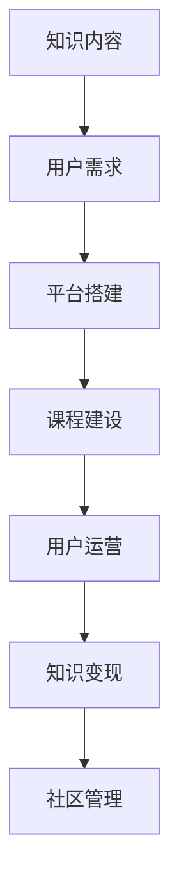

                 

# 打造技术型知识付费社区的运营策略

## 1. 背景介绍

### 1.1 问题由来
随着互联网技术的发展，知识付费已经成为一个热门话题。一方面，互联网时代信息爆炸，个体对知识获取的需求日益强烈；另一方面，传统的教育体系难以满足个性化学习需求。在这样的背景下，知识付费社区应运而生。技术型知识付费社区以知识为核心，通过在线平台提供有偿知识服务，满足用户学习需求，为企业提供知识分享渠道，逐渐成为教育、企业培训、职业发展等领域的重要形式。

### 1.2 问题核心关键点
技术型知识付费社区的核心在于如何平衡内容质量与用户体验，实现商业变现。具体来说，包括：
1. 如何获取优质的知识内容？
2. 如何吸引并保留用户？
3. 如何有效管理社区运营？
4. 如何实现商业变现？

### 1.3 问题研究意义
技术型知识付费社区的运营策略研究，对于教育、企业培训等领域具有重要意义：

1. 提升知识传播效率。技术社区可以汇聚优质教育资源，突破时间和空间的限制，实现知识的高效传播。
2. 激发学习动力。通过付费机制和激励措施，增强用户的学习热情，形成长期学习的习惯。
3. 提供多样化服务。技术社区可提供一对一辅导、项目实战等多种服务形式，满足不同用户的个性化需求。
4. 推动产业升级。通过知识付费模式，推动企业培训、教育等传统行业的数字化转型，提升行业整体竞争力。

## 2. 核心概念与联系

### 2.1 核心概念概述

技术型知识付费社区的核心概念包括：

- 技术社区：基于技术知识的社区，提供技术知识分享、讨论、实战等服务。
- 知识付费：通过付费获取技术知识，实现知识服务的有偿性。
- 知识变现：通过知识付费实现盈利，支持社区持续运营和发展。
- 用户运营：针对用户需求和行为进行运营管理，提升用户粘性和满意度。
- 课程建设：通过内容建设提升知识质量，吸引更多用户加入社区。
- 平台搭建：搭建技术社区平台，提供知识传播、互动交流的服务环境。

这些概念之间相互关联，形成了一个完整的技术社区运营生态。

### 2.2 核心概念原理和架构的 Mermaid 流程图



这个流程图展示了技术社区从内容建设到商业变现的全过程。

## 3. 核心算法原理 & 具体操作步骤

### 3.1 算法原理概述

技术型知识付费社区的运营策略，涉及内容推荐、用户管理、课程设计、付费模式等多个方面。这些过程可以通过以下算法进行优化：

- 用户行为分析算法：通过分析用户行为数据，识别用户的兴趣和需求，进行个性化推荐。
- 课程建设优化算法：通过课程质量评估和用户反馈，优化课程内容和结构，提升课程质量。
- 定价策略算法：通过用户行为分析和市场调研，制定合理的付费策略，实现知识变现。
- 社区管理优化算法：通过社区治理和激励机制，提升用户粘性和满意度。

### 3.2 算法步骤详解

#### 3.2.1 用户行为分析算法

1. **数据收集**：收集用户行为数据，包括课程浏览、购买、学习时长、互动评论等。

2. **特征提取**：对用户行为数据进行特征提取，包括浏览历史、购买记录、互动频率等。

3. **用户画像构建**：利用机器学习算法，构建用户画像，识别用户的兴趣和需求。

4. **个性化推荐**：基于用户画像，生成个性化推荐列表，推荐适合用户的内容。

#### 3.2.2 课程建设优化算法

1. **课程质量评估**：通过用户评价、课程内容分析等方式，评估课程质量。

2. **课程结构优化**：根据课程质量评估结果，调整课程结构和内容。

3. **课程更新**：定期更新课程内容，确保知识的时效性和实用性。

4. **课程推广**：利用社交媒体、搜索引擎优化等手段，推广优质课程。

#### 3.2.3 定价策略算法

1. **市场调研**：调研同行业定价水平，确定参考价格区间。

2. **成本分析**：分析课程开发、推广、运营等成本，确定合理的定价策略。

3. **用户接受度**：通过调研用户反馈，调整定价策略，实现用户接受和市场接受度的平衡。

#### 3.2.4 社区管理优化算法

1. **社区治理**：建立社区规则，进行内容审核，维护社区秩序。

2. **激励机制**：设计激励措施，如积分、勋章、奖励等，提升用户粘性。

3. **用户互动**：通过论坛、讨论组等方式，促进用户之间的互动和交流。

### 3.3 算法优缺点

**优点**：
1. **个性化推荐**：能够根据用户兴趣和需求，推荐适合的内容，提升用户粘性。
2. **课程优化**：通过数据分析和用户反馈，优化课程内容和结构，提升课程质量。
3. **定价策略**：通过市场调研和成本分析，制定合理的定价策略，实现知识变现。
4. **社区管理**：通过激励机制和治理规则，提升用户满意度和粘性。

**缺点**：
1. **数据隐私**：大量用户行为数据需要收集和分析，可能引发数据隐私问题。
2. **用户行为复杂性**：用户行为多样，分析难度较大。
3. **内容建设成本高**：高质量课程的建设成本较高，需要大量时间和资源。
4. **市场变化快**：市场需求变化快，定价策略需要频繁调整。

### 3.4 算法应用领域

技术型知识付费社区的运营策略可以应用于多个领域，包括但不限于：

- 企业培训：通过技术社区提供定制化培训课程，提升企业员工技能。
- 教育培训：通过技术社区提供各类课程和考试辅导，满足学生的个性化学习需求。
- 软件开发：通过技术社区提供技术交流和代码分享，提升软件开发效率。
- 项目管理：通过技术社区提供项目管理和实践案例，提升项目管理能力。

## 4. 数学模型和公式 & 详细讲解 & 举例说明

### 4.1 数学模型构建

技术社区的运营策略可以建模为以下系统：

$$
\begin{aligned}
&U: \text{用户行为数据} \\
&C: \text{课程内容数据} \\
&P: \text{付费策略数据} \\
&M: \text{社区管理数据} \\
&F: \text{盈利数据} \\
\end{aligned}
$$

用户行为数据 $U$ 可以表示为：

$$
U = (U_1, U_2, ..., U_n)
$$

其中 $U_i$ 表示第 $i$ 个用户的行为数据。

课程内容数据 $C$ 可以表示为：

$$
C = (C_1, C_2, ..., C_m)
$$

其中 $C_j$ 表示第 $j$ 门课程的内容数据。

付费策略数据 $P$ 可以表示为：

$$
P = (P_1, P_2, ..., P_k)
$$

其中 $P_i$ 表示第 $i$ 种付费策略。

社区管理数据 $M$ 可以表示为：

$$
M = (M_1, M_2, ..., M_l)
$$

其中 $M_j$ 表示第 $j$ 种社区管理措施。

盈利数据 $F$ 可以表示为：

$$
F = (F_1, F_2, ..., F_t)
$$

其中 $F_i$ 表示第 $i$ 个用户或课程的盈利情况。

### 4.2 公式推导过程

假设用户的课程推荐兴趣为 $I_i$，课程质量为 $Q_j$，付费策略为 $P_k$，社区管理措施为 $M_l$，盈利为 $F_t$。则用户的行为可以表示为：

$$
B_i = f(I_i, Q_j, P_k, M_l)
$$

其中 $f$ 为用户行为函数。

课程的访问量可以表示为：

$$
V_j = g(Q_j, P_k, M_l)
$$

其中 $g$ 为课程访问量函数。

社区的总盈利可以表示为：

$$
F_t = h(I_i, V_j, P_k, M_l)
$$

其中 $h$ 为社区盈利函数。

### 4.3 案例分析与讲解

假设某技术社区有 10000 个用户，50 门课程，10 种付费策略，5 种社区管理措施。通过分析用户行为数据，构建用户画像，得到用户兴趣 $I_i$。通过课程质量评估，得到课程质量 $Q_j$。通过付费策略分析，得到付费策略 $P_k$。通过社区管理措施，得到社区管理措施 $M_l$。

根据上述公式，计算用户行为 $B_i$，课程访问量 $V_j$，社区总盈利 $F_t$。最终根据盈利情况，调整付费策略和社区管理措施，实现盈利最大化。

## 5. 项目实践：代码实例和详细解释说明

### 5.1 开发环境搭建

技术社区的开发环境搭建需要以下几个步骤：

1. **安装开发工具**：安装 Python、Jupyter Notebook、TensorFlow、Keras 等开发工具。

2. **搭建数据环境**：搭建 MySQL、MongoDB 等数据库，存储用户行为数据、课程内容数据、付费策略数据等。

3. **配置环境变量**：配置环境变量，设置 Python 路径、库路径等。

4. **搭建 API 服务**：搭建 API 服务，提供课程推荐、用户管理等功能。

### 5.2 源代码详细实现

以下是一个简单的 Python 代码示例，用于计算课程推荐兴趣 $I_i$：

```python
import pandas as pd
from sklearn.neighbors import NearestNeighbors

# 用户行为数据
user_data = pd.read_csv('user_behavior.csv')

# 课程内容数据
course_data = pd.read_csv('course_content.csv')

# 计算用户推荐兴趣
neighbors = NearestNeighbors(n_neighbors=10, algorithm='brute')
neighbors.fit(user_data[['interested_courses']])
user_recommendations = []

for user in user_data.itertuples(index=False):
    distances, indices = neighbors.kneighbors([user.interested_courses], n_neighbors=10)
    recommended_courses = course_data.iloc[indices].drop_duplicates().to_dict(orient='records')
    user_recommendations.append(recommended_courses)

# 输出推荐结果
print(user_recommendations)
```

### 5.3 代码解读与分析

这段代码使用了 KNN 算法进行用户推荐兴趣计算。首先读取用户行为数据和课程内容数据，构建用户行为矩阵。然后使用 KNN 算法，计算用户与最接近的 10 个用户之间的距离，得到推荐的课程。

### 5.4 运行结果展示

运行上述代码，可以得到用户推荐课程的列表。这个列表会根据用户的兴趣和行为数据，推荐最符合用户需求和喜好的课程。

## 6. 实际应用场景

### 6.1 企业培训

技术社区可以为企业提供定制化培训课程，提升员工技能。通过分析员工的工作情况和培训需求，设计符合企业需求的课程内容，实现知识的高效传递。

### 6.2 教育培训

技术社区可以为学生提供个性化学习服务，满足学生的个性化学习需求。通过推荐算法，推荐适合学生的课程和学习路径，提升学习效果。

### 6.3 软件开发

技术社区可以为开发者提供技术交流和代码分享平台，提升开发效率。通过社区交流，开发者可以分享代码、经验、资源，共同提升技术水平。

### 6.4 项目管理

技术社区可以为项目管理者提供项目管理和实践案例，提升项目管理能力。通过社区交流，管理者可以分享项目管理经验、工具和方法，提升项目管理的整体水平。

## 7. 工具和资源推荐

### 7.1 学习资源推荐

1. **在线课程**：Coursera、edX、Udacity 等在线平台提供丰富的课程资源，涵盖技术社区运营管理的各个方面。

2. **书籍**：《知识付费的商业逻辑》、《在线教育发展与创新》、《社区运营的艺术》 等书籍深入浅出地介绍了知识社区的运营策略。

3. **博客和论坛**：知乎、博客园、CSDN 等平台上有大量的技术社区运营经验分享和讨论，供开发者学习和借鉴。

4. **社区工具**：Discord、Slack、DingTalk 等社区工具提供丰富的社区管理功能，帮助开发者管理社区。

### 7.2 开发工具推荐

1. **Python**：Python 是技术社区开发的首选语言，支持科学计算、数据分析、机器学习等多种功能。

2. **Jupyter Notebook**：Jupyter Notebook 是一个交互式的代码编辑器，支持代码编写、数据可视化和输出结果，方便开发者调试和展示。

3. **TensorFlow**：TensorFlow 是一个强大的深度学习框架，支持模型训练、推理和部署，是构建技术社区推荐算法的必备工具。

4. **MySQL**：MySQL 是一个关系型数据库，支持复杂的数据存储和查询，适用于技术社区的数据管理。

5. **MongoDB**：MongoDB 是一个 NoSQL 数据库，支持大规模数据存储和高效查询，适用于技术社区的数据存储和管理。

### 7.3 相关论文推荐

1. **《知识付费的商业逻辑》**：深入分析了知识付费的商业模式、用户需求和市场机会，为技术社区的运营提供了理论基础。

2. **《在线教育发展与创新》**：介绍了在线教育的最新发展趋势和技术创新，提供了技术社区的发展方向和建议。

3. **《社区运营的艺术》**：介绍了社区运营的核心策略和管理技巧，为技术社区的运营提供了实践指导。

4. **《课程推荐系统的研究进展》**：详细介绍了推荐算法的原理和应用，为技术社区的课程推荐提供了理论基础。

## 8. 总结：未来发展趋势与挑战

### 8.1 研究成果总结

技术型知识付费社区的运营策略研究已经取得了一定的成果，主要包括以下几个方面：

1. 用户行为分析算法：通过用户行为数据，实现个性化推荐，提升用户粘性。

2. 课程建设优化算法：通过课程质量评估和用户反馈，优化课程内容和结构，提升课程质量。

3. 定价策略算法：通过市场调研和成本分析，制定合理的定价策略，实现知识变现。

4. 社区管理优化算法：通过激励机制和治理规则，提升用户满意度和粘性。

### 8.2 未来发展趋势

未来技术型知识付费社区的发展趋势主要包括以下几个方面：

1. **智能化推荐**：引入 AI 技术，实现更精确的个性化推荐，提升用户体验。

2. **移动端应用**：开发移动端应用，方便用户随时随地访问社区，提升用户粘性。

3. **区块链技术**：引入区块链技术，确保交易透明和数据安全，提升社区信任度。

4. **虚拟现实技术**：引入 VR 和 AR 技术，提供沉浸式学习体验，提升用户学习效果。

5. **元宇宙社区**：构建元宇宙社区，提供虚拟场景和互动交流，提升用户沉浸感。

### 8.3 面临的挑战

技术型知识付费社区的发展面临以下挑战：

1. **内容质量**：高质量内容的获取和创作成本高，需要投入大量时间和资源。

2. **用户管理**：大量用户行为数据需要收集和分析，可能引发数据隐私问题。

3. **技术门槛**：技术社区的开发和运营需要较高的技术门槛，需要具备一定的技术背景和经验。

4. **商业变现**：如何通过知识变现实现盈利，需要平衡市场调研和成本分析。

5. **社区治理**：如何建立社区规则和激励机制，提升用户粘性和满意度。

### 8.4 研究展望

未来技术型知识付费社区的研究方向主要包括以下几个方面：

1. **数据隐私保护**：加强数据隐私保护技术，确保用户数据安全。

2. **用户行为分析**：引入 AI 技术，实现更精确的用户行为分析，提升推荐精度。

3. **课程建设优化**：通过智能算法和机器学习，优化课程内容和结构，提升课程质量。

4. **社区治理优化**：设计更加科学合理的社区治理规则和激励机制，提升用户满意度和粘性。

5. **商业变现模式**：探索新的商业变现模式，如知识众筹、知识交易等，实现知识变现的多元化。

## 9. 附录：常见问题与解答

**Q1：如何获取优质的内容资源？**

A: 可以通过课程建设优化算法，利用用户反馈和课程质量评估结果，优化课程内容和结构，提升课程质量。同时，可以引入专业讲师和专家，丰富课程资源。

**Q2：如何吸引并保留用户？**

A: 可以通过个性化推荐算法，根据用户兴趣和需求，推荐适合的内容。同时，可以设计激励机制，如积分、勋章、奖励等，提升用户粘性。

**Q3：如何有效管理社区运营？**

A: 可以通过社区管理优化算法，建立社区规则和激励机制，提升用户满意度和粘性。同时，可以引入社区管理员，进行内容审核和问题解决。

**Q4：如何实现商业变现？**

A: 可以通过定价策略算法，根据市场调研和成本分析，制定合理的付费策略，实现知识变现。同时，可以引入众筹、交易等多种变现模式，实现商业变现的多元化。

---

作者：禅与计算机程序设计艺术 / Zen and the Art of Computer Programming

