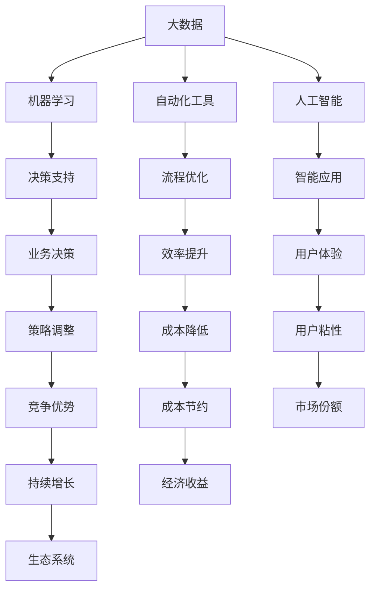

                 

# 打造自动化创业生态系统

## 1. 背景介绍

### 1.1 问题由来

在当今快速变化的市场环境中，企业面临着重重挑战：产品同质化加剧、用户需求快速迭代、竞争环境愈发激烈。企业需要通过技术创新，打造出能够持续迭代、快速响应用户需求的自动化创业生态系统，才能在竞争中保持优势。然而，构建这样一个系统并不容易，需要从技术、业务、战略等多方面进行协同优化。

### 1.2 问题核心关键点

自动化创业生态系统的核心关键点在于：

1. **数据驱动的决策**：利用大数据和机器学习技术，帮助企业从海量数据中提取有价值的信息，进行精确的业务决策。
2. **智能化的流程优化**：通过自动化工具和智能算法，优化企业流程，提高效率，降低成本。
3. **灵活的策略调整**：根据市场反馈和用户需求，动态调整产品和服务策略，保持企业竞争力的持续增长。
4. **无缝的用户体验**：通过AI技术提升用户交互体验，使用户能够享受到无缝、个性化的服务。
5. **可持续的增长模式**：建立可扩展的生态系统，引入合作伙伴，形成良性循环，实现长期增长。

## 2. 核心概念与联系

### 2.1 核心概念概述

为更好地理解自动化创业生态系统的构建，本节将介绍几个密切相关的核心概念：

- **大数据**：指通过数据收集、处理、分析等技术手段，从海量数据中提取有价值信息的过程。
- **机器学习**：通过让机器学习数据规律，实现预测、分类、聚类等任务，提高决策的准确性和效率。
- **自动化工具**：指使用软件自动化技术，完成重复性、高耗时任务的自动化处理，减少人工干预。
- **人工智能(AI)**：指使机器具备感知、理解、学习、推理等人类智能能力的技术，包括机器学习、自然语言处理、计算机视觉等。
- **生态系统**：指由多个相关组织、个体组成的系统，通过协同工作，实现共同目标。
- **DevOps**：一种以软件开发为中心，结合版本控制、持续集成、持续交付等实践的软件开发模式，旨在加速软件开发和交付的效率。

这些核心概念之间的逻辑关系可以通过以下Mermaid流程图来展示：



这个流程图展示了大数据、机器学习、自动化工具、人工智能、决策支持、流程优化、智能应用、业务决策、用户体验、策略调整、效率提升、成本降低、用户粘性、竞争优势、成本节约、市场份额、持续增长、经济收益和生态系统之间的联系和相互作用。

## 3. 核心算法原理 & 具体操作步骤
### 3.1 算法原理概述

自动化创业生态系统的构建，本质上是一个多学科、多技术的交叉融合过程。其核心思想是：

1. **数据采集与清洗**：通过多种渠道收集数据，去除噪声和冗余，提取有用信息。
2. **数据建模与分析**：利用机器学习算法，建立数据模型，分析数据规律，生成洞察。
3. **智能决策与预测**：根据数据洞察和业务目标，使用AI技术进行决策和预测，优化资源配置。
4. **流程自动化与优化**：引入自动化工具和智能算法，自动处理重复性任务，优化业务流程，提升效率。
5. **用户体验优化**：使用AI技术提升用户交互体验，提供个性化服务，增强用户粘性。
6. **生态系统协同**：通过合作和共享，构建一个自我进化、可持续的生态系统，实现长期增长。

### 3.2 算法步骤详解

自动化创业生态系统的构建主要包括以下几个关键步骤：

**Step 1: 数据采集与清洗**
- 使用爬虫、API等技术，从各种数据源（如社交媒体、销售系统、客户反馈等）采集数据。
- 对采集的数据进行清洗，去除重复、错误或无关信息，生成干净的原始数据集。

**Step 2: 数据建模与分析**
- 使用机器学习算法对数据集进行建模，生成模型参数和预测结果。
- 对模型结果进行解读和分析，生成业务洞察和决策依据。

**Step 3: 智能决策与预测**
- 根据数据洞察和业务目标，使用AI技术进行决策和预测，制定战略和策略。
- 使用决策支持系统(DSS)集成各种数据、模型和算法，辅助管理人员进行决策。

**Step 4: 流程自动化与优化**
- 引入自动化工具和智能算法，自动处理重复性任务，如自动化客服、自动化财务等。
- 对业务流程进行优化，减少人工干预，提高效率。

**Step 5: 用户体验优化**
- 使用AI技术提升用户交互体验，如智能推荐、智能客服等。
- 通过个性化推荐和定制化服务，增强用户粘性和满意度。

**Step 6: 生态系统协同**
- 与合作伙伴建立合作关系，引入互补技术和资源。
- 通过API、数据共享等方式，实现不同系统的互联互通。

### 3.3 算法优缺点

自动化创业生态系统的构建方法具有以下优点：

1. **提高效率**：通过自动化和智能化技术，显著提高了企业的运营效率，降低了人工成本。
2. **精准决策**：基于数据的分析和洞察，企业能够进行更加精准的决策，降低风险。
3. **增强竞争力**：通过不断的技术创新和优化，企业能够保持竞争优势。
4. **提升用户体验**：通过个性化服务和智能交互，提升用户满意度和忠诚度。
5. **可扩展性**：生态系统的设计注重可扩展性，能够引入新的合作伙伴和技术，实现持续增长。

同时，该方法也存在一定的局限性：

1. **数据质量问题**：数据的采集、清洗和处理需要耗费大量时间和资源，数据质量难以保证。
2. **技术复杂度**：自动化和智能化的实现需要多学科技术的融合，技术复杂度较高。
3. **隐私和安全问题**：数据的收集和使用涉及用户隐私，需要严格的数据保护和安全措施。
4. **资源投入大**：构建和维护生态系统需要大量的资源投入，包括技术和人力等。

尽管存在这些局限性，但就目前而言，自动化创业生态系统的构建方法仍然是最主流和有效的企业技术创新手段。未来相关研究的重点在于如何进一步降低数据处理的技术复杂度，提高数据的质量，同时兼顾隐私保护和系统安全性等因素。

### 3.4 算法应用领域

自动化创业生态系统的构建方法已经在多个领域得到了广泛的应用，例如：

- **电商**：通过数据分析和智能推荐，提升用户体验和销售额。
- **金融**：通过风险预测和自动化交易，提高金融产品的投资回报率。
- **制造业**：通过智能制造和供应链优化，提高生产效率和产品质量。
- **医疗**：通过数据挖掘和智能诊断，提高诊疗的准确性和效率。
- **教育**：通过个性化学习推荐和智能辅导，提升教育效果和学习体验。

除了上述这些经典应用外，自动化创业生态系统的构建方法也被创新性地应用到更多场景中，如智慧城市、智能家居、智能交通等，为企业和社会的智能化转型提供了新的动力。

## 4. 数学模型和公式 & 详细讲解  
### 4.1 数学模型构建

本节将使用数学语言对自动化创业生态系统的构建过程进行更加严格的刻画。

记数据集为 $D=\{(x_i,y_i)\}_{i=1}^N, x_i \in \mathbb{R}^d, y_i \in \mathbb{R}^k$，其中 $x_i$ 为特征向量，$y_i$ 为目标向量。假设模型为 $M: \mathbb{R}^d \rightarrow \mathbb{R}^k$，其中 $M=\theta$。

定义损失函数为 $\ell(y_i, M(x_i))$，其中 $y_i$ 为实际标签，$M(x_i)$ 为模型预测结果。在数据集 $D$ 上的经验风险为：

$$
\mathcal{L}(\theta) = \frac{1}{N}\sum_{i=1}^N \ell(y_i, M(x_i))
$$

模型的目标是最小化经验风险，即找到最优参数：

$$
\theta^* = \mathop{\arg\min}_{\theta} \mathcal{L}(\theta)
$$

在实践中，我们通常使用基于梯度的优化算法（如SGD、Adam等）来近似求解上述最优化问题。设 $\eta$ 为学习率，$\lambda$ 为正则化系数，则参数的更新公式为：

$$
\theta \leftarrow \theta - \eta \nabla_{\theta}\mathcal{L}(\theta) - \eta\lambda\theta
$$

其中 $\nabla_{\theta}\mathcal{L}(\theta)$ 为损失函数对参数 $\theta$ 的梯度，可通过反向传播算法高效计算。

### 4.2 公式推导过程

以下我们以回归任务为例，推导最小二乘法的数学模型。

假设模型 $M_{\theta}$ 在输入 $x_i$ 上的输出为 $y_i = M_{\theta}(x_i)$，其中 $\theta \in \mathbb{R}^d$ 为模型参数。定义损失函数为最小二乘损失：

$$
\ell(y_i, M_{\theta}(x_i)) = \frac{1}{2}\|y_i - M_{\theta}(x_i)\|_2^2
$$

将其代入经验风险公式，得：

$$
\mathcal{L}(\theta) = \frac{1}{N}\sum_{i=1}^N \|y_i - M_{\theta}(x_i)\|_2^2
$$

根据链式法则，损失函数对参数 $\theta_k$ 的梯度为：

$$
\frac{\partial \mathcal{L}(\theta)}{\partial \theta_k} = -\frac{1}{N}\sum_{i=1}^N (y_i - M_{\theta}(x_i)) \frac{\partial M_{\theta}(x_i)}{\partial \theta_k}
$$

其中 $\frac{\partial M_{\theta}(x_i)}{\partial \theta_k}$ 可进一步递归展开，利用自动微分技术完成计算。

在得到损失函数的梯度后，即可带入参数更新公式，完成模型的迭代优化。重复上述过程直至收敛，最终得到适应任务的最优模型参数 $\theta^*$。

## 5. 项目实践：代码实例和详细解释说明
### 5.1 开发环境搭建

在进行自动化创业生态系统的构建实践前，我们需要准备好开发环境。以下是使用Python进行PyTorch开发的环境配置流程：

1. 安装Anaconda：从官网下载并安装Anaconda，用于创建独立的Python环境。

2. 创建并激活虚拟环境：
```bash
conda create -n pytorch-env python=3.8 
conda activate pytorch-env
```

3. 安装PyTorch：根据CUDA版本，从官网获取对应的安装命令。例如：
```bash
conda install pytorch torchvision torchaudio cudatoolkit=11.1 -c pytorch -c conda-forge
```

4. 安装TensorFlow：
```bash
pip install tensorflow==2.7
```

5. 安装Flask：用于构建Web服务。
```bash
pip install flask
```

6. 安装SQLAlchemy：用于数据库交互。
```bash
pip install sqlalchemy
```

7. 安装Alembic：用于数据库迁移。
```bash
pip install alembic
```

完成上述步骤后，即可在`pytorch-env`环境中开始构建实践。

### 5.2 源代码详细实现

下面我们以电商推荐系统为例，给出使用Flask和TensorFlow进行自动化创业生态系统构建的PyTorch代码实现。

首先，定义推荐模型：

```python
from transformers import TFAutoModelForRecommendation

model = TFAutoModelForRecommendation.from_pretrained('path/to/model')
```

然后，定义推荐页面：

```python
from flask import Flask, render_template, request

app = Flask(__name__)

@app.route('/recommend', methods=['POST'])
def recommend():
    user_id = request.form['user_id']
    item_ids = model.recommend(user_id)
    return render_template('recommend.html', items=item_ids)

if __name__ == '__main__':
    app.run(debug=True)
```

接着，定义推荐模型的数据处理和训练：

```python
from transformers import TFAutoModelForRecommendation, Trainer, TrainingArguments

# 定义数据集
train_dataset = ...
test_dataset = ...

# 定义训练参数
training_args = TrainingArguments(
    output_dir='output/recommend',
    per_device_train_batch_size=8,
    per_device_eval_batch_size=8,
    num_train_epochs=10,
    weight_decay=0.01,
    logging_dir='logs/recommend',
    logging_steps=1000,
    evaluation_strategy='epoch',
    load_best_model_at_end=True,
    metric_for_best_model='auc'
)

# 定义训练器
trainer = Trainer(
    model=model,
    args=training_args,
    train_dataset=train_dataset,
    eval_dataset=test_dataset
)

# 训练模型
trainer.train()
```

最后，在推荐页面使用模型进行推荐：

```html
<!DOCTYPE html>
<html>
<head>
    <title>推荐系统</title>
</head>
<body>
    <form action="/recommend" method="POST">
        <label for="user_id">用户ID：</label>
        <input type="text" id="user_id" name="user_id">
        <button type="submit">推荐</button>
    </form>
    <ul>
        
            <li>{{ item }}</li>
        
    </ul>
</body>
</html>
```

以上就是使用Flask和TensorFlow构建电商推荐系统的完整代码实现。可以看到，借助TensorFlow的自动微分能力和Flask的Web框架，我们可以快速搭建一个基于推荐系统的自动化创业生态系统。

### 5.3 代码解读与分析

让我们再详细解读一下关键代码的实现细节：

**推荐模型定义**：
- 使用`TFAutoModelForRecommendation`定义了一个推荐模型，可以通过指定预训练模型的路径进行初始化。

**推荐页面定义**：
- 使用`Flask`定义了一个简单的Web服务，当用户提交推荐请求时，通过后端模型进行推荐，并返回推荐结果。

**推荐模型数据处理和训练**：
- 定义了训练数据集`train_dataset`和测试数据集`test_dataset`。
- 定义了训练参数`training_args`，包括学习率、批大小、训练轮数等。
- 使用`Trainer`对模型进行训练，训练完成后保存模型和日志。

**推荐页面HTML模板**：
- 通过`render_template`渲染HTML模板，生成推荐页面。
- 用户可以输入用户ID，提交推荐请求，获取推荐结果。

可以看到，使用Flask和TensorFlow构建推荐系统的代码实现相对简单，可以快速迭代优化，满足实际需求。

当然，工业级的系统实现还需考虑更多因素，如模型的保存和部署、超参数的自动搜索、更多的用户交互设计等。但核心的自动化构建方法基本与此类似。

## 6. 实际应用场景
### 6.1 智能客服系统

自动化创业生态系统在智能客服系统的构建中具有重要应用价值。传统客服往往需要配备大量人力，高峰期响应缓慢，且一致性和专业性难以保证。而使用自动化工具和智能算法，可以构建一个7x24小时不间断服务的智能客服系统，快速响应客户咨询，用自然流畅的语言解答各类常见问题。

在技术实现上，可以收集企业内部的历史客服对话记录，将问题和最佳答复构建成监督数据，在此基础上对预训练模型进行微调。微调后的模型能够自动理解用户意图，匹配最合适的答案模板进行回复。对于客户提出的新问题，还可以接入检索系统实时搜索相关内容，动态组织生成回答。如此构建的智能客服系统，能大幅提升客户咨询体验和问题解决效率。

### 6.2 金融舆情监测

金融机构需要实时监测市场舆论动向，以便及时应对负面信息传播，规避金融风险。传统的人工监测方式成本高、效率低，难以应对网络时代海量信息爆发的挑战。基于自动化创业生态系统的文本分类和情感分析技术，为金融舆情监测提供了新的解决方案。

具体而言，可以收集金融领域相关的新闻、报道、评论等文本数据，并对其进行主题标注和情感标注。在此基础上对预训练语言模型进行微调，使其能够自动判断文本属于何种主题，情感倾向是正面、中性还是负面。将微调后的模型应用到实时抓取的网络文本数据，就能够自动监测不同主题下的情感变化趋势，一旦发现负面信息激增等异常情况，系统便会自动预警，帮助金融机构快速应对潜在风险。

### 6.3 个性化推荐系统

当前的推荐系统往往只依赖用户的历史行为数据进行物品推荐，无法深入理解用户的真实兴趣偏好。基于自动化创业生态系统的个性化推荐系统可以更好地挖掘用户行为背后的语义信息，从而提供更精准、多样的推荐内容。

在实践中，可以收集用户浏览、点击、评论、分享等行为数据，提取和用户交互的物品标题、描述、标签等文本内容。将文本内容作为模型输入，用户的后续行为（如是否点击、购买等）作为监督信号，在此基础上微调预训练语言模型。微调后的模型能够从文本内容中准确把握用户的兴趣点。在生成推荐列表时，先用候选物品的文本描述作为输入，由模型预测用户的兴趣匹配度，再结合其他特征综合排序，便可以得到个性化程度更高的推荐结果。

### 6.4 未来应用展望

随着自动化创业生态系统的不断发展，其在更多领域的应用前景将更加广阔。

在智慧医疗领域，基于自动化的医疗问答、病历分析、药物研发等应用将提升医疗服务的智能化水平，辅助医生诊疗，加速新药开发进程。

在智能教育领域，自动化工具和智能算法可应用于作业批改、学情分析、知识推荐等方面，因材施教，促进教育公平，提高教学质量。

在智慧城市治理中，自动化系统可应用于城市事件监测、舆情分析、应急指挥等环节，提高城市管理的自动化和智能化水平，构建更安全、高效的未来城市。

此外，在企业生产、社会治理、文娱传媒等众多领域，基于自动化创业生态系统的应用也将不断涌现，为经济社会发展注入新的动力。相信随着技术的日益成熟，自动化创业生态系统必将在构建人机协同的智能时代中扮演越来越重要的角色。

## 7. 工具和资源推荐
### 7.1 学习资源推荐

为了帮助开发者系统掌握自动化创业生态系统的构建理论基础和实践技巧，这里推荐一些优质的学习资源：

1. 《机器学习实战》系列书籍：介绍机器学习算法和工具，适合初学者入门。
2. 《TensorFlow实战》系列书籍：深入讲解TensorFlow的使用方法和技巧。
3. 《深度学习入门》系列书籍：由汤晓鸥团队撰写，全面介绍了深度学习的基础和应用。
4. 《Flask Web开发》系列书籍：详细介绍Flask框架的使用方法和技巧。
5. 《SQLAlchemy官方文档》：Flask的配套文档，详细介绍了SQLAlchemy的使用方法和技巧。

通过对这些资源的学习实践，相信你一定能够快速掌握自动化创业生态系统的构建方法，并用于解决实际的业务问题。
###  7.2 开发工具推荐

高效的开发离不开优秀的工具支持。以下是几款用于自动化创业生态系统构建开发的常用工具：

1. Jupyter Notebook：免费的开源笔记本，支持多种编程语言和库的交互式编程。
2. PyTorch：基于Python的开源深度学习框架，灵活动态的计算图，适合快速迭代研究。
3. TensorFlow：由Google主导开发的开源深度学习框架，生产部署方便，适合大规模工程应用。
4. Flask：轻量级的Web框架，易于上手，支持RESTful API开发。
5. SQLAlchemy：Python的ORM框架，支持数据库的复杂操作。
6. Pandas：数据分析工具，支持大规模数据的处理和分析。

合理利用这些工具，可以显著提升自动化创业生态系统的开发效率，加快创新迭代的步伐。

### 7.3 相关论文推荐

自动化创业生态系统的构建源于学界的持续研究。以下是几篇奠基性的相关论文，推荐阅读：

1. "A Survey of Reinforcement Learning for Recommender Systems"：综述了强化学习在推荐系统中的应用。
2. "Data Mining and Statistical Learning"：经典机器学习教材，涵盖各种机器学习算法和应用。
3. "Deep Learning"：深度学习领域的经典教材，全面介绍了深度学习的基础和应用。
4. "Reinforcement Learning"：强化学习领域的经典教材，详细介绍强化学习的理论和应用。
5. "Web Services Architectures"：Web服务架构的入门教材，介绍Web服务的设计和实现。

这些论文代表了大数据和机器学习领域的研究进展，通过学习这些前沿成果，可以帮助研究者把握学科前进方向，激发更多的创新灵感。

## 8. 总结：未来发展趋势与挑战

### 8.1 总结

本文对自动化创业生态系统的构建方法进行了全面系统的介绍。首先阐述了自动化创业生态系统的研究背景和意义，明确了其在大数据、机器学习、自动化工具、人工智能等技术融合应用中的独特价值。其次，从原理到实践，详细讲解了自动化创业生态系统的构建步骤和关键算法，给出了自动化创业生态系统构建的完整代码实例。同时，本文还广泛探讨了自动化创业生态系统在智能客服、金融舆情、个性化推荐等多个行业领域的应用前景，展示了其巨大的潜力。此外，本文精选了自动化创业生态系统的各类学习资源，力求为读者提供全方位的技术指引。

通过本文的系统梳理，可以看到，自动化创业生态系统的构建方法正在成为企业技术创新的重要手段，极大地拓展了企业的应用边界，催生了更多的落地场景。受益于大数据和机器学习技术的不断发展，自动化创业生态系统必将在更多领域得到应用，为经济社会发展注入新的动力。

### 8.2 未来发展趋势

展望未来，自动化创业生态系统的发展将呈现以下几个趋势：

1. **深度学习算法的普及**：随着深度学习技术的不断成熟，越来越多的企业将采用深度学习算法进行自动化和智能化处理。
2. **跨领域应用的扩展**：自动化创业生态系统将从传统领域扩展到更多垂直行业，如智慧医疗、智能教育、智慧城市等。
3. **云计算和边缘计算的融合**：将云计算与边缘计算结合，实现更高效、更灵活的数据处理和计算。
4. **数据安全和隐私保护**：随着数据量的增加，数据安全和隐私保护将成为自动化创业生态系统的重要关注点。
5. **生态系统的协同进化**：通过引入更多合作伙伴和资源，构建一个自我进化的生态系统，实现持续增长。

以上趋势凸显了自动化创业生态系统的广阔前景。这些方向的探索发展，必将进一步提升企业技术创新的能力和效率，推动经济社会的数字化转型。

### 8.3 面临的挑战

尽管自动化创业生态系统的发展前景广阔，但在迈向更加智能化、普适化应用的过程中，它仍面临着诸多挑战：

1. **数据质量和处理复杂度**：数据的采集、清洗和处理需要耗费大量时间和资源，数据质量难以保证。
2. **技术复杂度**：自动化和智能化的实现需要多学科技术的融合，技术复杂度较高。
3. **资源投入大**：构建和维护生态系统需要大量的资源投入，包括技术和人力等。
4. **隐私和安全问题**：数据的收集和使用涉及用户隐私，需要严格的数据保护和安全措施。
5. **模型可解释性不足**：自动化系统往往缺乏可解释性，难以对其内部工作机制和决策逻辑进行解释。

尽管存在这些挑战，但就目前而言，自动化创业生态系统的构建方法仍然是最主流和有效的企业技术创新手段。未来相关研究的重点在于如何进一步降低数据处理的技术复杂度，提高数据的质量，同时兼顾隐私保护和系统安全性等因素。

### 8.4 研究展望

面对自动化创业生态系统所面临的挑战，未来的研究需要在以下几个方面寻求新的突破：

1. **数据增强和自动化**：引入更多数据增强和自动化处理技术，提高数据处理效率，降低人工干预。
2. **跨模态数据融合**：将视觉、语音、文本等多模态数据进行融合，提升系统的综合处理能力。
3. **联邦学习**：利用联邦学习技术，保护用户隐私的同时实现分布式数据训练。
4. **模型的可解释性**：引入模型可解释技术，增强系统的透明度和可控性。
5. **边缘计算**：利用边缘计算技术，实现本地数据的实时处理和分析。

这些研究方向的探索，必将引领自动化创业生态系统技术迈向更高的台阶，为构建安全、可靠、可解释、可控的智能系统铺平道路。面向未来，自动化创业生态系统还需要与其他人工智能技术进行更深入的融合，如知识表示、因果推理、强化学习等，多路径协同发力，共同推动智能技术在垂直行业的规模化落地。只有勇于创新、敢于突破，才能不断拓展自动化创业生态系统的边界，让智能技术更好地造福人类社会。

## 9. 附录：常见问题与解答

**Q1：自动化创业生态系统与传统的自动化系统有何不同？**

A: 自动化创业生态系统与传统的自动化系统的主要区别在于其开放性和协同性。传统的自动化系统往往是一个孤立的自动化工具或系统，缺乏与其他系统的互联互通。而自动化创业生态系统通过引入云计算、大数据、AI等多种技术，构建一个相互依赖、相互促进的生态系统，实现企业内部的无缝协作和协同创新。

**Q2：构建自动化创业生态系统需要哪些关键技术？**

A: 构建自动化创业生态系统需要以下关键技术：
1. 大数据技术：用于数据收集、清洗和分析，提取有用信息。
2. 机器学习技术：用于建立数据模型，生成洞察和预测。
3. 自动化工具：用于处理重复性任务，提高效率。
4. 人工智能技术：用于增强智能交互和决策支持。
5. Web服务技术：用于构建可扩展的Web服务，实现企业内部的协同工作。

**Q3：自动化创业生态系统的核心优势是什么？**

A: 自动化创业生态系统的核心优势在于其高度的开放性、协同性、智能性和可扩展性。通过引入云计算、大数据、AI等多种技术，实现企业内部的无缝协作和协同创新，大幅提高企业的运营效率和市场响应速度，同时保持竞争优势。

**Q4：如何选择合适的自动化创业生态系统构建工具？**

A: 选择合适的自动化创业生态系统构建工具需要考虑以下几个方面：
1. 技术成熟度和稳定性：选择成熟稳定、有广泛应用基础的工具。
2. 易用性和开发效率：选择易于上手、开发效率高的工具。
3. 社区支持和资源：选择有活跃社区支持、丰富资源的工具。

**Q5：自动化创业生态系统的应用前景如何？**

A: 自动化创业生态系统在智能客服、金融舆情、个性化推荐等多个行业领域具有广泛的应用前景。随着技术的不断成熟和应用场景的不断扩展，未来自动化创业生态系统必将在更多领域得到应用，为经济社会发展注入新的动力。

---

作者：禅与计算机程序设计艺术 / Zen and the Art of Computer Programming

