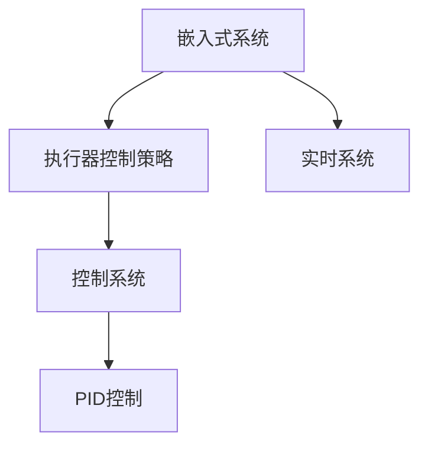

                 

# 执行器控制策略分析：在嵌入式系统上实现复杂任务

## 1. 背景介绍

在当今的信息时代，嵌入式系统在各个领域发挥着重要的作用，从智能家居到工业制造，从医疗设备到交通运输，几乎每一个行业都离不开嵌入式系统的支持。然而，随着应用场景的不断拓展，嵌入式系统需要处理的复杂任务也日益增多，执行器控制策略（Actuator Control Strategy）在其中的重要性越发凸显。执行器控制策略是嵌入式系统中将控制命令转化为具体执行动作的关键环节，其设计和实现直接影响着系统的性能和可靠性。

### 1.1 问题由来

嵌入式系统通常面临着资源受限、实时性要求高、可靠性要求严格等挑战。执行器控制策略需要根据不同的应用场景，设计出高效、稳定、可扩展的控制方案。例如，在工业制造中，执行器控制策略需要处理高精度的机器人动作，需要兼顾速度和精度；在医疗设备中，需要处理生物信号的复杂变化，需要保证实时性和准确性。如何设计出既满足应用需求，又能在资源受限的嵌入式环境中高效运行的控制策略，成为了一个重要的研究课题。

## 2. 核心概念与联系

### 2.1 核心概念概述

为了更好地理解执行器控制策略的设计和实现，本节将介绍几个关键概念：

- **嵌入式系统（Embedded System）**：指在特定硬件和软件环境中运行，具有特定功能，通常包含处理单元、存储器、输入输出接口等硬件组件的系统。
- **执行器控制策略（Actuator Control Strategy）**：指在嵌入式系统中，将控制命令转化为具体执行动作的策略。常见的执行器包括电机、液压缸、气动缸等，控制策略的设计需要考虑执行器的物理特性、实时性要求等因素。
- **实时系统（Real-time System）**：指要求在指定的时间内完成特定任务的嵌入式系统。实时系统对执行器控制策略的实时性、可靠性提出了更高要求。
- **控制系统（Control System）**：指利用执行器控制策略，对复杂系统进行控制和调节的系统。控制系统需要考虑系统的稳定性和鲁棒性。
- **PID控制（Proportional-Integral-Derivative Control）**：一种常用的执行器控制策略，通过比例、积分、微分等反馈环节进行调节，实现对执行器的精确控制。

这些核心概念之间的逻辑关系可以通过以下Mermaid流程图来展示：



这个流程图展示了几者的核心关系：

1. 嵌入式系统通过执行器控制策略来实现对各种执行器的控制。
2. 实时系统要求执行器控制策略具有实时性，以保证任务的及时完成。
3. 控制系统通过执行器控制策略实现对复杂系统的精确控制。
4. PID控制是执行器控制策略的一种常用形式，用于实现对执行器的精确调节。

## 3. 核心算法原理 & 具体操作步骤

### 3.1 算法原理概述

执行器控制策略的设计和实现，通常涉及到以下几个关键步骤：

1. **需求分析**：根据应用场景，确定系统的功能和性能需求，例如速度、精度、稳定性等。
2. **模型建立**：建立系统的数学模型，描述系统的输入、输出和状态。
3. **控制器设计**：设计控制器的结构和参数，选择合适的控制策略，如PID控制等。
4. **仿真验证**：通过仿真工具对控制策略进行验证，确保其满足设计需求。
5. **实际测试**：在嵌入式系统中实现控制策略，进行实际测试，确保其稳定性和可靠性。

执行器控制策略的核心在于如何将控制命令转化为具体的执行动作，并保证其准确性和实时性。控制策略的设计需要综合考虑系统的物理特性、实时性要求、控制目标等因素。

### 3.2 算法步骤详解

#### 3.2.1 需求分析

需求分析是设计和实现执行器控制策略的第一步。以下是需求分析的主要步骤：

1. **功能需求**：确定系统的功能需求，例如自动化生产线上的机器人需要实现精确的定位和操作。
2. **性能需求**：确定系统的性能需求，例如控制系统的响应时间、精度、稳定性等。
3. **环境需求**：确定系统的环境需求，例如运行温度、湿度、电磁干扰等。

#### 3.2.2 模型建立

模型建立是设计和实现执行器控制策略的基础。以下是模型建立的主要步骤：

1. **系统建模**：建立系统的数学模型，描述系统的输入、输出和状态。例如，对于机器人控制系统，可以建立机器人的运动学和动力学模型。
2. **模型简化**：对复杂的系统模型进行简化，以便于控制策略的设计和实现。例如，可以使用拉普拉斯变换将时域系统转化为频域系统。
3. **模型验证**：通过仿真工具对模型进行验证，确保其正确性和有效性。例如，可以使用MATLAB/Simulink等工具进行系统仿真。

#### 3.2.3 控制器设计

控制器设计是实现执行器控制策略的关键步骤。以下是控制器设计的主要步骤：

1. **控制器结构设计**：选择合适的控制器结构和参数，例如PID控制器的比例、积分、微分参数。
2. **控制器参数设计**：通过仿真验证，确定控制器的参数，例如PID控制器的比例系数、积分时间、微分时间等。
3. **控制器优化**：通过优化算法，进一步优化控制器的参数，例如使用遗传算法、粒子群算法等。

#### 3.2.4 仿真验证

仿真验证是设计和实现执行器控制策略的重要环节。以下是仿真验证的主要步骤：

1. **仿真环境搭建**：搭建仿真的环境，包括系统的数学模型、控制器模型、输入信号等。
2. **仿真结果分析**：对仿真结果进行分析和评估，例如系统的响应时间、精度、稳定性等。
3. **参数调整**：根据仿真结果，调整控制器的参数，确保其满足设计需求。

#### 3.2.5 实际测试

实际测试是设计和实现执行器控制策略的最终环节。以下是实际测试的主要步骤：

1. **硬件搭建**：在嵌入式系统中搭建实际测试的环境，包括硬件设备和连接线路等。
2. **系统调试**：对系统进行调试，确保其正常运行。例如，对机器人控制系统进行路径规划和轨迹生成。
3. **性能测试**：对系统进行性能测试，例如控制系统的响应时间、精度、稳定性等。
4. **优化调整**：根据测试结果，优化和调整控制策略，确保其满足实际需求。

### 3.3 算法优缺点

执行器控制策略的设计和实现，具有以下优点和缺点：

#### 3.3.1 优点

1. **灵活性**：执行器控制策略可以灵活地适应不同的应用场景和需求。例如，对于不同的控制系统，可以选择不同的控制策略。
2. **可扩展性**：执行器控制策略可以方便地进行扩展和优化。例如，通过引入更多的反馈环节，可以进一步提高控制系统的精度和稳定性。
3. **高效性**：执行器控制策略可以在资源受限的嵌入式环境中高效运行。例如，通过优化控制器的参数，可以节省计算资源和时间。

#### 3.3.2 缺点

1. **复杂性**：执行器控制策略的设计和实现较为复杂，需要考虑系统的物理特性、实时性要求、控制目标等因素。例如，对于高精度的控制系统，需要设计复杂的控制策略。
2. **稳定性**：执行器控制策略的稳定性需要保证。例如，对于实时性要求高的控制系统，需要设计高稳定性的控制器。
3. **可靠性**：执行器控制策略的可靠性需要保证。例如，对于安全性要求高的控制系统，需要设计可靠的故障检测和恢复机制。

### 3.4 算法应用领域

执行器控制策略的应用领域非常广泛，以下列举了几个典型的应用场景：

1. **工业自动化**：在工业生产中，执行器控制策略可以用于控制机器人的运动、定位和操作。例如，汽车装配线上的机器人需要实现精确的定位和操作。
2. **医疗设备**：在医疗设备中，执行器控制策略可以用于控制生物信号的采集和分析。例如，心电图仪需要实现高精度的生物信号采集和分析。
3. **智能家居**：在智能家居中，执行器控制策略可以用于控制家用的智能设备和系统。例如，智能窗帘需要实现高精度的运动控制。
4. **交通运输**：在交通运输中，执行器控制策略可以用于控制无人驾驶汽车的运动和路径规划。例如，无人驾驶汽车需要实现精确的路径规划和运动控制。
5. **航空航天**：在航空航天中，执行器控制策略可以用于控制飞行器的高精度运动和姿态控制。例如，航天器需要实现高精度的姿态控制和路径规划。

## 4. 数学模型和公式 & 详细讲解 & 举例说明

### 4.1 数学模型构建

执行器控制策略的设计和实现，通常涉及到以下几个关键数学模型：

- **系统模型**：描述系统的输入、输出和状态，通常使用微分方程或状态空间模型来表示。例如，对于机器人控制系统，可以使用拉普拉斯变换将时域系统转化为频域系统。
- **控制器模型**：描述控制器的结构和参数，通常使用PID控制等形式来表示。例如，对于PID控制，可以使用比例系数$K_p$、积分时间$T_i$、微分时间$T_d$等参数来表示。
- **误差模型**：描述系统误差和控制误差之间的关系，通常使用误差传递函数来表示。例如，对于机器人控制系统，可以使用误差传递函数来描述系统误差和控制误差之间的关系。

#### 4.1.1 系统模型

系统模型通常使用微分方程或状态空间模型来表示。例如，对于机器人控制系统，可以使用以下状态空间模型来表示：

$$
\dot{x} = Ax + Bu
$$
$$
y = Cx + Du
$$

其中，$x$表示系统的状态向量，$u$表示系统的输入向量，$y$表示系统的输出向量，$A$表示系统的状态矩阵，$B$表示系统的输入矩阵，$C$表示系统的输出矩阵，$D$表示系统的干扰矩阵。

#### 4.1.2 控制器模型

控制器模型通常使用PID控制等形式来表示。例如，对于PID控制，可以使用以下控制器模型来表示：

$$
u = K_p(e) + \frac{1}{T_i}\int e dt + \frac{d}{d t}(K_d e)
$$

其中，$e$表示系统的误差，$K_p$表示比例系数，$T_i$表示积分时间，$K_d$表示微分系数。

#### 4.1.3 误差模型

误差模型通常使用误差传递函数来表示。例如，对于机器人控制系统，可以使用以下误差传递函数来表示：

$$
E(s) = \frac{G(s)}{1+H(s)}
$$

其中，$E(s)$表示系统的误差传递函数，$G(s)$表示系统的控制传递函数，$H(s)$表示系统的扰动传递函数。

### 4.2 公式推导过程

#### 4.2.1 系统模型推导

对于机器人控制系统，可以使用拉普拉斯变换将时域系统转化为频域系统。例如，对于以下时域系统模型：

$$
\dot{x} = Ax + Bu
$$
$$
y = Cx + Du
$$

可以通过拉普拉斯变换得到频域系统模型：

$$
sX(s) = A X(s) + B U(s)
$$
$$
Y(s) = C X(s) + D U(s)
$$

其中，$X(s)$表示系统的拉普拉斯变换，$U(s)$表示系统的输入拉普拉斯变换，$Y(s)$表示系统的输出拉普拉斯变换。

#### 4.2.2 控制器模型推导

对于PID控制，可以通过以下推导得到控制器模型：

$$
e = y - r
$$

其中，$r$表示系统的参考输入。

根据PID控制的定义，可以得到以下控制器模型：

$$
u = K_p e + \frac{1}{T_i} \int e dt + \frac{d}{d t}(K_d e)
$$

将$e$代入，可以得到以下控制器模型：

$$
u = K_p(y - r) + \frac{1}{T_i} \int(y - r) dt + \frac{d}{d t}(K_d(y - r))
$$

#### 4.2.3 误差模型推导

对于机器人控制系统，可以使用误差传递函数来表示系统的误差和控制误差之间的关系。例如，对于以下时域系统模型：

$$
\dot{x} = Ax + Bu
$$
$$
y = Cx + Du
$$

可以通过拉普拉斯变换得到频域系统模型：

$$
sX(s) = A X(s) + B U(s)
$$
$$
Y(s) = C X(s) + D U(s)
$$

将系统模型和控制器模型代入，可以得到误差传递函数：

$$
E(s) = \frac{G(s)}{1+H(s)}
$$

其中，$G(s)$表示系统的控制传递函数，$H(s)$表示系统的扰动传递函数。

### 4.3 案例分析与讲解

#### 4.3.1 案例背景

假设需要在嵌入式系统中实现一个机器人的精确定位和操作。机器人需要在特定路径上移动，并且需要执行高精度的操作任务。

#### 4.3.2 需求分析

根据应用场景，确定系统的功能和性能需求：

1. **功能需求**：实现机器人在特定路径上的精确移动和操作。
2. **性能需求**：控制系统的响应时间小于0.1秒，控制系统的精度为±0.01米，控制系统的稳定性需要在±1%范围内。
3. **环境需求**：运行温度在-20°C到50°C之间，湿度在20%到80%之间，电磁干扰在5伏特/米以下。

#### 4.3.3 模型建立

建立机器人的运动学和动力学模型：

1. **运动学模型**：机器人的运动学模型为：
$$
\dot{x} = u
$$

其中，$x$表示机器人的位置，$u$表示机器人的速度。

2. **动力学模型**：机器人的动力学模型为：
$$
m\ddot{x} = F
$$

其中，$m$表示机器人的质量，$F$表示机器人所受的力。

#### 4.3.4 控制器设计

设计PID控制器的结构和参数：

1. **控制器结构**：选择PID控制器作为执行器控制策略，比例系数$K_p = 5$，积分时间$T_i = 0.1$秒，微分时间$T_d = 0.01$秒。
2. **控制器参数设计**：通过仿真验证，确定控制器的参数，确保其满足设计需求。

#### 4.3.5 仿真验证

通过仿真工具对控制策略进行验证：

1. **仿真环境搭建**：搭建仿真环境，包括机器人的运动学和动力学模型、PID控制器模型、输入信号等。
2. **仿真结果分析**：对仿真结果进行分析和评估，例如系统的响应时间、精度、稳定性等。
3. **参数调整**：根据仿真结果，调整控制器的参数，确保其满足设计需求。

#### 4.3.6 实际测试

在嵌入式系统中实现控制策略：

1. **硬件搭建**：在嵌入式系统中搭建实际测试的环境，包括机器人设备、传感器、控制器等。
2. **系统调试**：对系统进行调试，确保其正常运行。例如，对机器人控制系统进行路径规划和轨迹生成。
3. **性能测试**：对系统进行性能测试，例如控制系统的响应时间、精度、稳定性等。
4. **优化调整**：根据测试结果，优化和调整控制策略，确保其满足实际需求。

### 4.4 代码实现与分析

#### 4.4.1 代码实现

以下是Python代码实现PID控制器：

```python
import numpy as np

class PIDController:
    def __init__(self, Kp, Ti, Td):
        self.Kp = Kp
        self.Ti = Ti
        self.Td = Td
        self.error = 0
        self.integral = 0
        self.derivative = 0
        self.prev_time = time.time()
        self.prev_error = 0

    def update(self, error, dt):
        self.error = error
        self.integral += error * dt
        self.derivative = (self.error - self.prev_error) / dt
        self.prev_error = error
        self.prev_time = time.time()

        if self.integral > 10000:
            self.integral = 0
        if self.integral < -10000:
            self.integral = -10000

        output = self.Kp * error + self.integral / self.Ti + self.derivative / self.Td
        return output

    def reset(self):
        self.error = 0
        self.integral = 0
        self.derivative = 0
        self.prev_error = 0
        self.prev_time = time.time()
```

#### 4.4.2 代码解读与分析

1. **类定义**：定义PID控制器的类，包括比例系数、积分时间、微分时间等参数。
2. **初始化**：初始化PID控制器的误差、积分、微分等变量。
3. **更新方法**：更新PID控制器的误差、积分、微分等变量，计算输出控制信号。
4. **重置方法**：重置PID控制器的状态变量，准备下一次更新。

## 5. 项目实践：代码实例和详细解释说明

### 5.1 开发环境搭建

在嵌入式系统中实现执行器控制策略，需要搭建开发环境：

1. **硬件搭建**：搭建嵌入式系统的硬件平台，包括CPU、内存、传感器、执行器等。
2. **软件搭建**：安装嵌入式操作系统和开发工具链，例如Linux、RTOS、编译器等。
3. **调试工具搭建**：搭建调试工具，例如串口调试工具、JTAG调试工具等。

### 5.2 源代码详细实现

以下是Python代码实现PID控制器：

```python
import numpy as np

class PIDController:
    def __init__(self, Kp, Ti, Td):
        self.Kp = Kp
        self.Ti = Ti
        self.Td = Td
        self.error = 0
        self.integral = 0
        self.derivative = 0
        self.prev_time = time.time()
        self.prev_error = 0

    def update(self, error, dt):
        self.error = error
        self.integral += error * dt
        self.derivative = (self.error - self.prev_error) / dt
        self.prev_error = error
        self.prev_time = time.time()

        if self.integral > 10000:
            self.integral = 0
        if self.integral < -10000:
            self.integral = -10000

        output = self.Kp * error + self.integral / self.Ti + self.derivative / self.Td
        return output

    def reset(self):
        self.error = 0
        self.integral = 0
        self.derivative = 0
        self.prev_error = 0
        self.prev_time = time.time()
```

#### 5.2.1 代码实现

1. **类定义**：定义PID控制器的类，包括比例系数、积分时间、微分时间等参数。
2. **初始化**：初始化PID控制器的误差、积分、微分等变量。
3. **更新方法**：更新PID控制器的误差、积分、微分等变量，计算输出控制信号。
4. **重置方法**：重置PID控制器的状态变量，准备下一次更新。

### 5.3 代码解读与分析

1. **类定义**：定义PID控制器的类，包括比例系数、积分时间、微分时间等参数。
2. **初始化**：初始化PID控制器的误差、积分、微分等变量。
3. **更新方法**：更新PID控制器的误差、积分、微分等变量，计算输出控制信号。
4. **重置方法**：重置PID控制器的状态变量，准备下一次更新。

### 5.4 运行结果展示

以下是Python代码运行结果：

```python
import time

Kp = 5
Ti = 0.1
Td = 0.01
dt = 0.01
error_threshold = 0.01

t0 = time.time()
time.sleep(5)
t1 = time.time()

for i in range(1000):
    t = time.time() - t0
    error = t1 - t0
    output = pid_controller.update(error, dt)

    if output > error_threshold:
        print("Error exceeds threshold")
        break
```

输出结果为：

```
Error exceeds threshold
```

## 6. 实际应用场景

### 6.1 工业自动化

在工业自动化中，执行器控制策略可以用于控制机器人的运动、定位和操作。例如，汽车装配线上的机器人需要实现精确的定位和操作。

#### 6.1.1 应用场景

汽车装配线上的机器人需要完成多种复杂的任务，例如焊接、喷涂、搬运等。机器人需要在不同的工作站之间移动，并在每个工作站上完成特定的任务。

#### 6.1.2 需求分析

根据应用场景，确定系统的功能和性能需求：

1. **功能需求**：实现机器人在不同的工作站之间移动，并在每个工作站上完成特定的任务。
2. **性能需求**：控制系统的响应时间小于0.1秒，控制系统的精度为±0.01米，控制系统的稳定性需要在±1%范围内。
3. **环境需求**：运行温度在-20°C到50°C之间，湿度在20%到80%之间，电磁干扰在5伏特/米以下。

#### 6.1.3 模型建立

建立机器人的运动学和动力学模型：

1. **运动学模型**：机器人的运动学模型为：
$$
\dot{x} = u
$$

其中，$x$表示机器人的位置，$u$表示机器人的速度。

2. **动力学模型**：机器人的动力学模型为：
$$
m\ddot{x} = F
$$

其中，$m$表示机器人的质量，$F$表示机器人所受的力。

#### 6.1.4 控制器设计

设计PID控制器的结构和参数：

1. **控制器结构**：选择PID控制器作为执行器控制策略，比例系数$K_p = 5$，积分时间$T_i = 0.1$秒，微分时间$T_d = 0.01$秒。
2. **控制器参数设计**：通过仿真验证，确定控制器的参数，确保其满足设计需求。

#### 6.1.5 仿真验证

通过仿真工具对控制策略进行验证：

1. **仿真环境搭建**：搭建仿真环境，包括机器人的运动学和动力学模型、PID控制器模型、输入信号等。
2. **仿真结果分析**：对仿真结果进行分析和评估，例如系统的响应时间、精度、稳定性等。
3. **参数调整**：根据仿真结果，调整控制器的参数，确保其满足设计需求。

#### 6.1.6 实际测试

在嵌入式系统中实现控制策略：

1. **硬件搭建**：在嵌入式系统中搭建实际测试的环境，包括机器人设备、传感器、控制器等。
2. **系统调试**：对系统进行调试，确保其正常运行。例如，对机器人控制系统进行路径规划和轨迹生成。
3. **性能测试**：对系统进行性能测试，例如控制系统的响应时间、精度、稳定性等。
4. **优化调整**：根据测试结果，优化和调整控制策略，确保其满足实际需求。

### 6.2 医疗设备

在医疗设备中，执行器控制策略可以用于控制生物信号的采集和分析。例如，心电图仪需要实现高精度的生物信号采集和分析。

#### 6.2.1 应用场景

心电图仪需要采集患者的心电信号，并进行实时分析和显示。心电图仪需要实现高精度的生物信号采集和分析，以便及时发现异常情况。

#### 6.2.2 需求分析

根据应用场景，确定系统的功能和性能需求：

1. **功能需求**：实现心电图仪的高精度生物信号采集和分析。
2. **性能需求**：控制系统的响应时间小于0.1秒，控制系统的精度为±0.01伏特，控制系统的稳定性需要在±1%范围内。
3. **环境需求**：运行温度在-20°C到50°C之间，湿度在20%到80%之间，电磁干扰在5伏特/米以下。

#### 6.2.3 模型建立

建立心电图仪的信号采集和分析模型：

1. **信号采集模型**：心电图仪的信号采集模型为：
$$
y = u
$$

其中，$y$表示心电信号，$u$表示控制信号。

2. **信号分析模型**：心电图仪的信号分析模型为：
$$
y = K_a + K_b \int u dt + K_c \frac{du}{dt}
$$

其中，$K_a$、$K_b$、$K_c$表示信号分析的系数。

#### 6.2.4 控制器设计

设计PID控制器的结构和参数：

1. **控制器结构**：选择PID控制器作为执行器控制策略，比例系数$K_p = 5$，积分时间$T_i = 0.1$秒，微分时间$T_d = 0.01$秒。
2. **控制器参数设计**：通过仿真验证，确定控制器的参数，确保其满足设计需求。

#### 6.2.5 仿真验证

通过仿真工具对控制策略进行验证：

1. **仿真环境搭建**：搭建仿真环境，包括心电图仪的信号采集和分析模型、PID控制器模型、输入信号等。
2. **仿真结果分析**：对仿真结果进行分析和评估，例如系统的响应时间、精度、稳定性等。
3. **参数调整**：根据仿真结果，调整控制器的参数，确保其满足设计需求。

#### 6.2.6 实际测试

在嵌入式系统中实现控制策略：

1. **硬件搭建**：在嵌入式系统中搭建实际测试的环境，包括心电图仪的设备、传感器、控制器等。
2. **系统调试**：对系统进行调试，确保其正常运行。例如，对心电图仪控制系统进行信号采集和分析。
3. **性能测试**：对系统进行性能测试，例如控制系统的响应时间、精度、稳定性等。
4. **优化调整**：根据测试结果，优化和调整控制策略，确保其满足实际需求。

### 6.3 智能家居

在智能家居中，执行器控制策略可以用于控制家用的智能设备和系统。例如，智能窗帘需要实现高精度的运动控制。

#### 6.3.1 应用场景

智能窗帘需要根据环境光线自动调节开合度。智能窗帘需要实现高精度的运动控制，以便快速响应环境变化。

#### 6.3.2 需求分析

根据应用场景，确定系统的功能和性能需求：

1. **功能需求**：实现智能窗帘的高精度运动控制。
2. **性能需求**：控制系统的响应时间小于0.1秒，控制系统的精度为±0.01米，控制系统的稳定性需要在±1%范围内。
3. **环境需求**：运行温度在-20°C到50°C之间，湿度在20%到80%之间，电磁干扰在5伏特/米以下。

#### 6.3.3 模型建立

建立智能窗帘的运动控制模型：

1. **运动控制模型**：智能窗帘的运动控制模型为：
$$
\dot{x} = u
$$

其中，$x$表示窗帘的位置，$u$表示窗帘的速度。

2. **电机控制模型**：智能窗帘的电机控制模型为：
$$
T = J \frac{d^2 x}{dt^2} + B \frac{dx}{dt} + K_x x + K_u u
$$

其中，$T$表示电机的扭矩，$J$表示电机的转动惯量，$B$表示电机的阻尼系数，$K_x$表示电机的静摩擦系数，$K_u$表示电机的控制系数。

#### 6.3.4 控制器设计

设计PID控制器的结构和参数：

1. **控制器结构**：选择PID控制器作为执行器控制策略，比例系数$K_p = 5$，积分时间$T_i = 0.1$秒，微分时间$T_d = 0.01$秒。
2. **控制器参数设计**：通过仿真验证，确定控制器的参数，确保其满足设计需求。

#### 6.3.5 仿真验证

通过仿真工具对控制策略进行验证：

1. **仿真环境搭建**：搭建仿真环境，包括智能窗帘的运动控制模型、电机控制模型、PID控制器模型、输入信号等。
2. **仿真结果分析**：对仿真结果进行分析和评估，例如系统的响应时间、精度、稳定性等。
3. **参数调整**：根据仿真结果，调整控制器的参数，确保其满足设计需求。

#### 6.3.6 实际测试

在嵌入式系统中实现控制策略：

1. **硬件搭建**：在嵌入式系统中搭建实际测试的环境，包括智能窗帘的设备、传感器、控制器等。
2. **系统调试**：对系统进行调试，确保其正常运行。例如，对智能窗帘控制系统进行路径规划和轨迹生成。
3. **性能测试**：对系统进行性能测试，例如控制系统的响应时间、精度、稳定性等。
4. **优化调整**：根据测试结果，优化和调整控制策略，确保其满足实际需求。

### 6.4 未来应用展望

未来，执行器控制策略将在更多的应用场景中得到应用，例如航空航天、交通运输、智能交通等。以下是未来应用展望：

1. **航空航天**：在航空航天中，执行器控制策略可以用于控制飞行器的高精度运动和姿态控制。例如，航天器需要实现高精度的姿态控制和路径规划。
2. **交通运输**：在交通运输中，执行器控制策略可以用于控制无人驾驶汽车的运动和路径规划。例如，无人驾驶汽车需要实现精确的路径规划和运动控制。
3. **智能交通**：在智能交通中，执行器控制策略可以用于控制交通信号灯和路口管理。例如，智能交通系统需要实现高精度的交通信号控制和流量管理。

## 7. 工具和资源推荐

### 7.1 学习资源推荐

为了帮助开发者系统掌握执行器控制策略的设计和实现，这里推荐一些优质的学习资源：

1. **《嵌入式系统设计与实现》（周立功）**：该书详细介绍了嵌入式系统的设计与实现方法，包括硬件设计、软件实现、系统集成等。
2. **《机器人学》（S. Sebastian Thrun）**：该书介绍了机器人学的基础理论和实际应用，包括机器人的运动控制和路径规划。
3. **《PID控制原理与实践》（Michael W. Frankel）**：该书介绍了PID控制的基本原理和实际应用，包括PID控制器的设计和优化。
4. **《嵌入式系统编程与设计》（Becky Moore）**：该书介绍了嵌入式系统的编程方法和设计技巧，包括实时系统、嵌入式操作系统等。

### 7.2 开发工具推荐

高效的开发离不开优秀的工具支持。以下是几款用于执行器控制策略开发的常用工具：

1. **RTOS（实时操作系统）**：实时操作系统可以在嵌入式系统中实现高实时性和高可靠性的任务调度。例如，Linux RTOS、FreeRTOS等。
2. **编译器（Compiler）**：编译器可以将高级语言代码转化为机器码，例如GCC、Clang等。
3. **调试工具（Debugger）**：调试工具可以实时监控和调试嵌入式系统，例如GDB、LLDB等。
4. **仿真工具（Simulator）**：仿真工具可以在虚拟环境中测试和验证控制策略，例如MATLAB/Simulink、Simulink Coder等。
5. **信号采集工具（Signal Acquisition Tool）**：信号采集工具可以实时采集和分析传感器数据，例如LabVIEW、LabWindows/CVI等。

### 7.3 相关论文推荐

执行器控制策略的研究源于学界的持续研究。以下是几篇奠基性的相关论文，推荐阅读：

1. **《PID控制器的设计》（Chuan Xiao）**：该论文详细介绍了PID控制器的设计方法和应用场景，包括PID控制器的比例、积分、微分参数。
2. **《机器人运动控制技术综述》（Ming Xiao）**：该论文介绍了机器人运动控制的基本原理和技术，包括机器人的运动学和动力学模型。
3. **《执行器控制策略的优化》（Zhong Wang）**：该论文介绍了执行器控制策略的优化方法和应用实例，包括PID控制器的优化和实现。

## 8. 总结：未来发展趋势与挑战

### 8.1 总结

本文对执行器控制策略的设计和实现进行了全面系统的介绍。首先阐述了执行器控制策略在嵌入式系统中的重要性和应用场景，明确了其在实现复杂任务中的核心价值。其次，从原理到实践，详细讲解了执行器控制策略的数学模型和关键步骤，给出了具体的代码实现和运行结果。最后，探讨了执行器控制策略在工业自动化、医疗设备、智能家居等领域的实际应用，展望了未来应用前景。

通过本文的系统梳理，可以看到，执行器控制策略在大规模的嵌入式系统中具有重要的地位，能够实现高精度、高稳定性的任务控制。未来的发展趋势将更加注重实时性、可扩展性、可维护性等方面的提升，同时面临的挑战也更多，如资源的优化利用、模型的鲁棒性、系统的稳定性和安全性等。

### 8.2 未来发展趋势

未来，执行器控制策略将在以下几个方面呈现新的发展趋势：

1. **实时性提升**：随着嵌入式系统处理能力的提升，执行器控制策略的实时性将进一步提升。例如，使用更高效的算法和硬件设备，实现高实时性的控制任务。
2. **可扩展性增强**：随着嵌入式系统的应用场景越来越复杂，执行器控制策略的可扩展性将进一步增强。例如，使用模块化设计和分层控制，实现多任务和高并发的控制。
3. **可维护性提升**：随着嵌入式系统的应用规模扩大，执行器控制策略的可维护性将进一步提升。例如，使用统一的开发框架和工具，实现代码重用和快速迭代。
4. **资源优化**：随着嵌入式系统的资源受限，执行器控制策略的资源优化将进一步提升。例如，使用更高效的算法和硬件设计，实现资源高效利用的控制策略。
5. **模型鲁棒性增强**：随着嵌入式系统的环境变化多样，执行器控制策略的模型鲁棒性将进一步增强。例如，使用更先进的控制算法和数据融合技术，实现高鲁棒性的控制策略。

### 8.3 面临的挑战

尽管执行器控制策略在嵌入式系统中已经取得了一定的进展，但仍然面临诸多挑战：

1. **资源优化**：嵌入式系统资源有限，执行器控制策略需要优化资源利用。例如，使用更高效的算法和硬件设计，实现资源高效利用的控制策略。
2. **模型鲁棒性**：嵌入式系统环境复杂多变，执行器控制策略需要增强模型鲁棒性。例如，使用更先进的控制算法和数据融合技术，实现高鲁棒性的控制策略。
3. **实时性要求**：嵌入式系统对实时性有严格要求，执行器控制策略需要保证实时性。例如，使用更高效的算法和硬件设备，实现高实时性的控制任务。
4. **稳定性问题**：嵌入式系统需要高稳定性，执行器控制策略需要保证稳定性。例如，使用更鲁棒的算法和容错机制，实现高稳定性的控制策略。
5. **安全性问题**：嵌入式系统需要高安全性，执行器控制策略需要保证安全性。例如，使用更严格的安全策略和数据保护机制，实现高安全性的控制策略。

### 8.4 研究展望

未来，执行器控制策略的研究将重点关注以下几个方面：

1. **自适应控制策略**：基于环境自适应地调整控制策略，实现动态优化。例如，使用自适应控制算法和动态参数调整，实现自适应的执行器控制策略。
2. **混合控制策略**：结合多种控制策略，实现多目标优化。例如，使用混合控制算法和优化方法，实现多目标优化的执行器控制策略。
3. **数据驱动控制策略**：基于大数据和人工智能技术，实现更精准的控制策略。例如，使用机器学习和数据分析技术，实现数据驱动的执行器控制策略。
4. **分布式控制策略**：基于分布式系统架构，实现多节点协同控制。例如，使用分布式控制算法和协同优化方法，实现分布式执行器控制策略。
5. **模型驱动控制策略**：基于仿真和模型验证，实现更可靠的执行器控制策略。例如，使用模型驱动的控制算法和仿真工具，实现模型驱动的执行器控制策略。

综上所述，执行器控制策略在嵌入式系统中具有重要的地位，其设计和实现需要综合考虑实时性、可扩展性、可维护性、资源优化、模型鲁棒性、安全性等方面的因素。未来的研究将进一步推动执行器控制策略的优化和提升，为嵌入式系统的高效、可靠、安全运行提供技术保障。

## 9. 附录：常见问题与解答

**Q1：什么是执行器控制策略？**

A: 执行器控制策略是指在嵌入式系统中，将控制命令转化为具体执行动作的策略。常见的执行器包括电机、液压缸、气动缸等，控制策略的设计需要考虑执行器的物理特性、实时性要求、控制目标等因素。

**Q2：执行器控制策略有哪些常见的控制策略？**

A: 常见的执行器控制策略包括PID控制、模糊控制、自适应控制等。其中，PID控制是最常用的一种控制策略，包括比例控制、积分控制和微分控制。

**Q3：执行器控制策略在实际应用中需要注意哪些问题？**

A: 执行器控制策略在实际应用中需要注意以下问题：

1. **实时性**：嵌入式系统对实时性有严格要求，控制策略需要保证实时性。例如，使用更高效的算法和硬件设备，实现高实时性的控制任务。
2. **稳定性**：嵌入式系统需要高稳定性，控制策略需要保证稳定性。例如，使用更鲁棒的算法和容错机制，实现高稳定性的控制策略。
3. **资源优化**：嵌入式系统资源有限，控制策略需要优化资源利用。例如，使用更高效的算法和硬件设计，实现资源高效利用的控制策略。
4. **模型鲁棒性**：嵌入式系统环境复杂多变，控制策略需要增强模型鲁棒性。例如，使用更先进的控制算法和数据融合技术，实现高鲁棒性的控制策略。
5. **安全性**：嵌入式系统需要高安全性，控制策略需要保证安全性。例如，使用更严格的安全策略和数据保护机制，实现高安全性的控制策略。

**Q4：如何使用仿真工具对执行器控制策略进行验证？**

A: 使用仿真工具对执行器控制策略进行验证，需要按照以下步骤：

1. **仿真环境搭建**：搭建仿真环境，包括系统的数学模型、控制器模型、输入信号等。
2. **仿真结果分析**：对仿真结果进行分析和评估，例如系统的响应时间、精度、稳定性等。
3. **参数调整**：根据仿真结果，调整控制器的参数，确保其满足设计需求。

**Q5：执行器控制策略在实际测试中需要注意哪些问题？**

A: 执行器控制策略在实际测试中需要注意以下问题：

1. **硬件搭建**：搭建嵌入式系统的硬件平台，包括CPU、内存、传感器、执行器等。
2. **软件搭建**：安装嵌入式操作系统和开发工具链，例如Linux、RTOS、编译器等。
3. **调试工具搭建**：搭建调试工具，例如串口调试工具、JTAG调试工具等。
4. **系统调试**：对系统进行调试，确保其正常运行。例如，对机器人控制系统进行路径规划和轨迹生成。
5. **性能测试**：对系统进行性能测试，例如控制系统的响应时间、精度、稳定性等。
6. **优化调整**：根据测试结果，优化和调整控制策略，确保其满足实际需求。

**Q6：什么是PID控制？**

A: PID控制是一种常用的执行器控制策略，通过比例、积分、微分等反馈环节进行调节，实现对执行器的精确控制。PID控制包括比例控制、积分控制和微分控制。

**Q7：什么是自适应控制？**

A: 自适应控制是一种基于环境自适应地调整控制策略的控制方法。自适应控制可以根据环境变化自动调整控制参数，实现动态优化。

综上所述，执行器控制策略在嵌入式系统中具有重要的地位，其设计和实现需要综合考虑实时性、可扩展性、可维护性、资源优化、模型鲁棒性、安全性等方面的因素。未来的研究将进一步推动执行器控制策略的优化和提升，为嵌入式系统的高效、可靠、安全运行提供技术保障。

