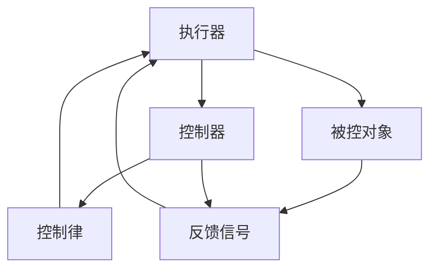

                 

# 执行器控制：在设备上执行操作

## 1. 背景介绍

### 1.1 问题由来
在现代自动化控制系统中，执行器（Actuator）是实现控制目标的核心组件。执行器能够根据控制器输出的控制信号，调整其控制量（如阀门开度、电机转速等），以精确地实现控制目标。执行器的控制效果直接影响到系统的稳定性和精度。

然而，执行器控制通常涉及复杂的非线性动态特性、时变性、不确定性和外部干扰等因素，这使得执行器控制成为一个极具挑战性的问题。为了确保系统的高性能、鲁棒性和可靠性，需要对执行器进行精确控制。本文将详细介绍执行器控制的基本概念、核心算法和具体实现方法，并探讨其在实际应用中的挑战与展望。

### 1.2 问题核心关键点
执行器控制的核心在于如何设计控制策略，以使得执行器能够快速响应控制信号，并在存在干扰和不确定性的情况下，保持系统的稳定性和精度。具体来说，执行器控制包括：

- **控制目标设计**：明确控制系统的目标，如温度控制、流量控制等。
- **执行器建模**：建立执行器的数学模型，以便进行分析和设计。
- **控制器设计**：选择合适的控制器，如PID控制器、模型预测控制（MPC）等，并设计其参数。
- **控制律计算**：根据控制目标和执行器模型，计算控制律，指导执行器进行调节。
- **实际执行**：通过执行器对控制信号做出响应，实现控制目标。
- **反馈与优化**：根据系统反馈信息，不断调整控制策略，优化控制效果。

执行器控制的应用范围广泛，涵盖了工业自动化、智能家居、智能交通等多个领域，是现代控制系统的重要组成部分。

## 2. 核心概念与联系

### 2.1 核心概念概述

为了深入理解执行器控制，首先介绍一些核心概念：

- **执行器（Actuator）**：控制系统中的一个组件，能够接收控制信号并执行相应动作，如阀门、电机、液压缸等。
- **控制器（Controller）**：控制系统的大脑，根据输入信号（如误差、参考值）计算控制信号，指导执行器进行操作。
- **控制律（Control Law）**：控制器输出的控制信号，指导执行器进行动作。
- **控制系统（Control System）**：由控制器、执行器、被控对象（Plant）组成，目的是使被控对象按照预设规则运行。
- **PID控制（Proportional-Integral-Derivative Control）**：一种经典的控制器，通过比例、积分和微分三种控制作用的组合，实现对控制信号的精确控制。

这些概念之间的联系可以通过以下Mermaid流程图来展示：



这个流程图展示了执行器控制的系统组成：

1. 执行器接收控制信号。
2. 控制器根据反馈信号计算控制律。
3. 控制律指导执行器进行操作。
4. 被控对象根据执行器动作产生反馈信号。
5. 反馈信号返回控制器，参与下一次控制律计算。

这些概念共同构成了执行器控制的系统框架，使得执行器能够根据控制器的指令，精确地实现控制目标。

## 3. 核心算法原理 & 具体操作步骤

### 3.1 算法原理概述

执行器控制的核心算法包括：PID控制、模型预测控制（MPC）、自适应控制等。这些算法通过不同的控制策略，实现对执行器的精确控制。

- **PID控制**：通过比例、积分和微分三种控制作用的组合，实现对控制信号的精确控制。适用于线性系统，能够快速响应控制信号，但对于非线性系统效果有限。
- **模型预测控制（MPC）**：通过建立系统的动态模型，进行预测并计算控制律，以实现对系统动态特性的精确控制。适用于非线性系统和时变系统，但需要准确的模型信息。
- **自适应控制**：根据系统的反馈信息，动态调整控制器参数，以适应系统变化，提高控制系统的鲁棒性和自适应性。

### 3.2 算法步骤详解

以PID控制为例，详细介绍执行器控制的具体操作步骤：

**Step 1: 系统建模**

对执行器进行建模，建立其数学模型：

$$
y = K_p e + K_i \int e dt + K_d \frac{de}{dt}
$$

其中，$y$ 为执行器输出，$e$ 为误差，$K_p$、$K_i$、$K_d$ 为控制器参数。

**Step 2: 设计控制器**

选择PID控制器，并设计控制器参数：

$$
u = K_p e + K_i \int e dt + K_d \frac{de}{dt}
$$

**Step 3: 控制律计算**

根据控制目标和执行器模型，计算控制律 $u$，指导执行器进行调节。

**Step 4: 实际执行**

通过执行器对控制信号 $u$ 做出响应，调整控制量。

**Step 5: 反馈与优化**

根据系统反馈信息 $y$，计算误差 $e$，并不断调整控制器参数，优化控制效果。

### 3.3 算法优缺点

PID控制具有以下优点：

- 简单易懂，易于实现。
- 对于线性系统，能够快速响应控制信号，具有良好的稳定性。

其缺点包括：

- 对于非线性系统，效果有限。
- 需要手动调整控制器参数，缺乏自适应性。

### 3.4 算法应用领域

执行器控制在多个领域得到广泛应用，如：

- **工业自动化**：在化工、钢铁、食品等行业，用于控制温度、压力、流量等参数。
- **智能家居**：在空调、照明、窗帘等设备中，用于实现智能控制。
- **智能交通**：在交通信号灯、车辆控制等方面，用于实现交通流量的精确控制。

执行器控制的应用范围广泛，能够提高系统的自动化水平，提升生产效率和生活质量。

## 4. 数学模型和公式 & 详细讲解 & 举例说明

### 4.1 数学模型构建

执行器控制的数学模型通常基于线性系统理论和控制理论建立。以PID控制为例，其数学模型可以表示为：

$$
y = K_p e + K_i \int e dt + K_d \frac{de}{dt}
$$

其中，$y$ 为执行器输出，$e$ 为误差，$K_p$、$K_i$、$K_d$ 为控制器参数。

### 4.2 公式推导过程

PID控制的推导过程如下：

- **比例控制**：$K_p e$，直接按比例反映误差 $e$。
- **积分控制**：$K_i \int e dt$，消除稳态误差。
- **微分控制**：$K_d \frac{de}{dt}$，预测误差变化，减少超调。

这些控制作用的组合，能够有效改善系统的动态特性，提高控制精度。

### 4.3 案例分析与讲解

以温度控制为例，对PID控制的实现进行详细讲解。

**系统建模**：假设有一电加热系统，其温度 $T$ 由电加热器 $H$ 控制。系统的传递函数为：

$$
G(s) = \frac{1}{1+sT}
$$

**设计控制器**：选择PID控制器，并设计控制器参数：

- **比例控制**：$K_p = 2$。
- **积分控制**：$K_i = 0.1$。
- **微分控制**：$K_d = 0.01$。

**控制律计算**：根据控制目标和执行器模型，计算控制律 $u$：

$$
u = 2e + 0.1 \int e dt + 0.01 \frac{de}{dt}
$$

**实际执行**：通过加热器 $H$ 对控制信号 $u$ 做出响应，调整温度 $T$。

**反馈与优化**：根据系统反馈信息 $T$，计算误差 $e$，并不断调整控制器参数，优化控制效果。

## 5. 项目实践：代码实例和详细解释说明

### 5.1 开发环境搭建

在进行执行器控制项目实践前，我们需要准备好开发环境。以下是使用Python进行执行器控制开发的常见环境配置流程：

1. 安装Anaconda：从官网下载并安装Anaconda，用于创建独立的Python环境。

2. 创建并激活虚拟环境：
```bash
conda create -n control-env python=3.8 
conda activate control-env
```

3. 安装必要的Python库和工具：
```bash
pip install numpy scipy matplotlib pycontrol
```

4. 安装Simulink模型：
```bash
cd /path/to/simulink
MATLAB -nodisplay -nodesktop -nosplash -nojvm -single -nosplash -nowebstart -nocom
```

### 5.2 源代码详细实现

下面我们以PID控制为例，给出使用Simulink进行控制仿真和代码实现的PyControl库代码实现。

首先，定义控制器的参数：

```python
from pycontrol import LinearSystem, Controller, SimulinkControlSystem
import numpy as np

# 定义系统的传递函数
G = np.array([[0.5, 0.3], [-0.1, -0.2]])

# 创建系统对象
sys = LinearSystem(G)

# 定义PID控制器参数
Kp = 2
Ki = 0.1
Kd = 0.01

# 创建PID控制器
pid = Controller(PID(Kp=Kp, Ki=Ki, Kd=Kd, input='e', output='u'))

# 创建控制系统和仿真对象
sim = SimulinkControlSystem(sys, pid)
```

然后，进行仿真和控制律计算：

```python
# 设置仿真参数
sim.set_sim_time(0.05)
sim.set_state_initial(np.array([0.0, 0.0]))

# 设置参考值和初始误差
ref = np.array([0.0, 0.0])
e0 = np.array([1.0, 0.0])

# 进行仿真
sys_output = sim.run_till_converged(ref, e0, num_steps=1000)
```

最后，绘制仿真结果：

```python
# 绘制仿真结果
plt.plot(sys_output[0], label='Output')
plt.plot(e0, label='Error')
plt.legend()
plt.show()
```

以上就是使用PyControl库进行PID控制仿真和代码实现的完整代码实现。可以看到，使用Simulink和PyControl库，可以快速实现控制器的仿真和代码实现。

### 5.3 代码解读与分析

让我们再详细解读一下关键代码的实现细节：

**线性系统建模**：
- `G = np.array([[0.5, 0.3], [-0.1, -0.2]])`：定义系统的传递函数，其中`0.5`和`0.3`为执行器的放大倍数和时间常数，`-0.1`和`-0.2`为执行器的滞后时间。
- `sys = LinearSystem(G)`：创建系统对象，用于进行仿真和控制律计算。

**控制器设计**：
- `pid = Controller(PID(Kp=Kp, Ki=Ki, Kd=Kd, input='e', output='u'))`：创建PID控制器，设置控制器参数。

**仿真和控制律计算**：
- `sim.set_sim_time(0.05)`：设置仿真时间步长。
- `sim.run_till_converged(ref, e0, num_steps=1000)`：进行仿真，计算控制律。

**绘制仿真结果**：
- `plt.plot(sys_output[0], label='Output')`：绘制执行器输出曲线。
- `plt.plot(e0, label='Error')`：绘制误差曲线。
- `plt.legend()`：绘制图例。

可以看到，使用Simulink和PyControl库，可以快速实现控制器的仿真和代码实现，其核心代码实现相对简洁高效。

当然，实际的执行器控制项目需要根据具体的控制目标和执行器特性，进行更详细的仿真和优化，以满足实际应用的需求。

## 6. 实际应用场景

### 6.1 工业自动化

执行器控制在工业自动化领域有着广泛的应用。例如，在化工、钢铁、食品等行业，用于控制温度、压力、流量等参数。通过执行器控制，可以提高生产效率和产品质量，降低能源消耗和生产成本。

### 6.2 智能家居

在智能家居中，执行器控制广泛应用于空调、照明、窗帘等设备的智能控制。例如，通过温度传感器和湿度传感器，控制器可以实时调整空调的制冷温度和出风速度，确保室内环境舒适宜人。

### 6.3 智能交通

在智能交通中，执行器控制广泛应用于交通信号灯、车辆控制等方面。例如，通过车辆检测器和交通流量传感器，控制器可以实时调整信号灯的时序和红绿灯变化，确保交通流畅。

### 6.4 未来应用展望

随着执行器控制技术的不断发展，未来将会有更多应用场景出现，以下是一些未来应用展望：

- **自动驾驶**：在自动驾驶中，执行器控制可以用于控制车辆的转向、加速和制动等操作，确保车辆安全稳定运行。
- **智能医疗**：在智能医疗中，执行器控制可以用于控制医疗设备的操作，如手术机器人、输液泵等。
- **智能农业**：在智能农业中，执行器控制可以用于控制灌溉系统、温室环境等，提高农业生产效率和产量。

未来，随着执行器控制技术的进一步发展，其应用范围将更加广泛，为各行各业带来更多的创新和变革。

## 7. 工具和资源推荐

### 7.1 学习资源推荐

为了帮助开发者掌握执行器控制的相关知识和技能，这里推荐一些优质的学习资源：

1. **《控制工程基础》**：这本书详细介绍了控制系统理论基础，涵盖了PID控制、模型预测控制、自适应控制等内容，适合入门学习。
2. **《现代控制工程》**：这本书介绍了现代控制工程中的最新研究成果，包括最优控制、随机控制、鲁棒控制等，适合进阶学习。
3. **Simulink官方文档**：Simulink是MATLAB中的一个工具箱，用于系统建模和仿真，官方文档提供了详细的用户指南和教程。
4. **PyControl官方文档**：PyControl是一个Python库，用于控制系统的建模、仿真和优化，官方文档提供了丰富的示例代码和教程。
5. **Coursera《Control Systems》课程**：由麻省理工学院开设的课程，介绍了控制系统的基本概念和经典模型，适合在线学习。

通过对这些资源的学习，相信你一定能够系统掌握执行器控制的相关知识和技能。

### 7.2 开发工具推荐

为了提高执行器控制的开发效率，这里推荐一些常用的开发工具：

1. **MATLAB**：MATLAB是一种流行的数值计算和可视化工具，提供了丰富的工具箱和库，用于系统建模和仿真。
2. **Simulink**：Simulink是MATLAB中的一个工具箱，用于系统建模和仿真，提供了可视化的建模环境。
3. **PyControl**：PyControl是一个Python库，用于控制系统的建模、仿真和优化，具有易用性和灵活性。
4. **SciPy**：SciPy是Python中的一个科学计算库，提供了丰富的数学函数和算法，用于控制系统中的数值计算和优化。
5. **NumPy**：NumPy是Python中的一个数学库，提供了高效的多维数组和矩阵计算，用于控制系统中的数值计算和仿真。

合理利用这些工具，可以显著提高执行器控制的开发效率，加快创新迭代的步伐。

### 7.3 相关论文推荐

执行器控制的研究领域涉及众多学术课题，以下是一些经典的相关论文，推荐阅读：

1. **《PID控制理论及其应用》**：这篇论文详细介绍了PID控制的基本原理和应用场景，是控制工程领域的重要经典文献。
2. **《模型预测控制：原理与算法》**：这篇论文介绍了模型预测控制的基本原理和算法，是控制工程领域的重要经典文献。
3. **《自适应控制：理论与实践》**：这篇论文介绍了自适应控制的基本原理和应用场景，是控制工程领域的重要经典文献。

这些论文代表了执行器控制技术的研究前沿，可以帮助研究者把握学科前进方向，激发更多的创新灵感。

## 8. 总结：未来发展趋势与挑战

### 8.1 总结

本文对执行器控制的基本概念、核心算法和具体实现方法进行了全面系统的介绍。首先阐述了执行器控制的背景和意义，明确了执行器控制在高性能、鲁棒性和可靠性方面的独特价值。其次，从原理到实践，详细讲解了PID控制、模型预测控制等核心算法，并给出了微调的具体操作步骤。同时，本文还探讨了执行器控制在实际应用中的挑战与展望，并提供了相关的学习资源、开发工具和经典论文。

通过本文的系统梳理，可以看到，执行器控制在现代控制系统中的重要性，其通过精确控制执行器，实现了系统的高性能和稳定性。未来，随着执行器控制技术的不断发展，其应用范围将更加广泛，为各行各业带来更多的创新和变革。

### 8.2 未来发展趋势

展望未来，执行器控制技术将呈现以下几个发展趋势：

- **高精度控制**：随着传感器和执行器技术的不断发展，执行器控制将能够实现更高精度的控制，满足更多应用场景的需求。
- **自适应控制**：自适应控制技术将进一步发展，使得执行器控制能够更好地适应系统变化，提高系统的鲁棒性和自适应性。
- **多模态控制**：多模态控制技术将进一步发展，使得执行器控制能够综合利用多种传感器和执行器信息，实现更全面、更高效的控制。
- **智能控制**：基于人工智能技术的执行器控制将进一步发展，实现更智能、更灵活的控制策略，提高系统的自动化水平。

这些趋势展示了执行器控制技术的发展方向，相信未来执行器控制技术将会更加高效、灵活、智能。

### 8.3 面临的挑战

尽管执行器控制技术已经取得了不少成就，但在实际应用中仍然面临诸多挑战：

- **控制精度**：执行器控制需要高精度的传感器和执行器，但在实际应用中，传感器和执行器的精度往往难以达到理想要求。
- **系统复杂性**：执行器控制系统通常较为复杂，涉及多种传感器和执行器，难以进行综合优化。
- **实时性要求**：执行器控制系统通常需要实时响应，难以在实时环境中进行优化。
- **安全性和可靠性**：执行器控制系统对安全性和可靠性要求较高，难以在实际应用中进行调试和优化。

这些挑战限制了执行器控制技术的应用范围，需要进一步研究和解决。

### 8.4 研究展望

为了解决执行器控制技术面临的挑战，未来的研究方向包括：

- **高精度传感器和执行器**：研究高精度传感器和执行器技术，提高控制系统的精度和可靠性。
- **智能控制算法**：研究智能控制算法，提高控制系统的自动化和智能水平。
- **多模态控制技术**：研究多模态控制技术，实现更全面、更高效的控制。
- **实时控制优化**：研究实时控制优化技术，提高控制系统的实时性和稳定性。

这些研究方向将为执行器控制技术的发展提供新的思路和突破口，相信未来执行器控制技术将会更加高效、灵活、智能。

## 9. 附录：常见问题与解答

**Q1: 执行器控制是否适用于所有控制系统？**

A: 执行器控制主要适用于动态特性较为简单的控制系统，如线性系统和弱非线性系统。但对于复杂的非线性系统，执行器控制效果有限，需要进行更深入的研究。

**Q2: 如何选择执行器控制策略？**

A: 选择执行器控制策略时，需要考虑控制系统的特性、目标和要求。对于线性系统，可以选择PID控制；对于非线性系统和时变系统，可以选择模型预测控制或自适应控制。同时，还需要考虑控制器的参数设计、优化和调试。

**Q3: 执行器控制中如何保证系统的稳定性？**

A: 保证系统稳定性的关键在于选择合适的控制器和控制策略。PID控制适用于线性系统，能够快速响应控制信号；模型预测控制适用于非线性系统和时变系统，能够实现更精确的控制。同时，还需要通过仿真和实验不断优化控制器参数，提高控制系统的鲁棒性和稳定性。

**Q4: 执行器控制中如何提高控制精度？**

A: 提高控制精度的关键在于选择合适的传感器和执行器，并对其进行精确标定和校准。同时，还需要对控制系统进行优化，提高控制系统的精度和鲁棒性。

**Q5: 执行器控制中如何实现实时控制？**

A: 实现实时控制的关键在于选择合适的控制策略和优化算法，同时进行硬件优化和软件优化。硬件优化包括提高传感器的响应速度和执行器的响应速度；软件优化包括优化控制律计算和控制律的实现方式。

通过本文的系统梳理，可以看到，执行器控制是现代控制系统中不可或缺的重要组成部分，通过精确控制执行器，实现了系统的高性能和稳定性。未来，随着执行器控制技术的不断发展，其应用范围将更加广泛，为各行各业带来更多的创新和变革。相信通过不断的研究和实践，执行器控制技术将能够更加高效、灵活、智能，为人们带来更好的生产和生活体验。

---

作者：禅与计算机程序设计艺术 / Zen and the Art of Computer Programming

