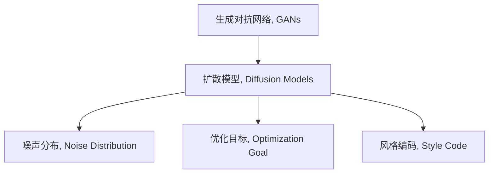

                 

## 1. 背景介绍

### 1.1 问题由来

近年来，随着深度学习技术的快速发展，人工智能在艺术创作、音乐生成等领域取得了显著进展。扩散模型(Diffusion Models)作为新一代生成对抗网络(GANs)，因其在图像生成、音频生成等方面的优秀表现，成为AI艺术创作领域的研究热点。

扩散模型是一种基于噪声减增的生成模型，通过逐步引入噪声并逐渐去除噪声，生成高质量的样本。它能够高效地生成各种风格的图像、音乐和视频等内容，为艺术创作提供了强大的技术支持。

### 1.2 问题核心关键点

扩散模型之所以能够在艺术创作中脱颖而出，主要原因在于：

- 高保真度：扩散模型可以生成高保真度的艺术作品，与人类创作水平相近，甚至在一些细节上超过人类。
- 多模态支持：除了图像生成，扩散模型还可以生成音频、视频等多种形式的艺术内容。
- 高效训练：相比于传统GANs，扩散模型训练时间更短，计算资源需求更低。
- 风格可控：扩散模型能够根据不同的噪声分布生成不同风格的艺术作品，适应各种艺术需求。

本文将系统介绍扩散模型的原理、算法实现、关键技术，并探讨其在艺术创作中的应用前景和面临的挑战，为AI艺术创作技术的普及和创新提供参考。

## 2. 核心概念与联系

### 2.1 核心概念概述

为更好地理解扩散模型的原理和应用，本节将介绍几个密切相关的核心概念：

- 生成对抗网络(GANs)：一种生成模型，通过一个生成器和一个判别器对抗训练，生成逼真的样本。

- 扩散模型(Diffusion Models)：一种基于噪声减增过程的生成模型，通过引入噪声并逐渐去除噪声，生成高质量的样本。

- 噪声分布(Noise Distribution)：扩散模型的核心组件，定义了噪声的分布和变化规律。

- 优化目标(Optimization Goal)：扩散模型的训练目标，通过最小化噪声减增过程的损失函数，使得模型生成高质量的样本。

- 风格编码(Style Code)：扩散模型的一个重要概念，通过引入风格编码，可以控制生成的艺术作品的风格。

这些核心概念之间的逻辑关系可以通过以下Mermaid流程图来展示：



这个流程图展示了扩散模型与其他相关概念的联系：

1. 扩散模型基于GANs框架，在噪声减增过程中生成样本。
2. 噪声分布是扩散模型的关键组件，定义了噪声的引入和去除规律。
3. 优化目标是扩散模型训练的核心，通过最小化损失函数来提升模型性能。
4. 风格编码是扩散模型的重要特性，通过控制噪声分布来生成特定风格的艺术作品。

这些概念共同构成了扩散模型的理论基础，为其在艺术创作等领域的广泛应用提供了支持。

## 3. 核心算法原理 & 具体操作步骤

### 3.1 算法原理概述

扩散模型是一种基于噪声减增的生成模型，通过逐步引入噪声并逐渐去除噪声，生成高质量的样本。其核心思想是将噪声减增过程分解为多个步骤，每一步引入一定程度的噪声，并通过优化噪声减增过程，生成逼真的样本。

形式化地，假设 $z_t$ 为扩散过程在时间步 $t$ 的噪声分布，$f(z_t)$ 为扩散过程的映射函数，$\epsilon_t$ 为时间步 $t$ 的噪声分布参数。扩散模型的目标是通过最小化噪声减增过程的损失函数，使得模型生成高质量的样本 $x$。

数学表达如下：

$$
x = \mathop{\arg\min}_{z_t} \mathcal{L}(f(z_t))
$$

其中 $\mathcal{L}$ 为扩散模型的损失函数，通常包括重构误差和噪声减增误差。在训练过程中，扩散模型通过反向传播更新噪声分布参数 $\epsilon_t$，使得生成样本 $x$ 逼近真实样本 $x^*$。

### 3.2 算法步骤详解

扩散模型的训练过程一般包括以下几个关键步骤：

**Step 1: 初始化噪声分布**

在扩散模型的训练过程中，首先需要初始化噪声分布 $z_0$。一般使用高斯分布或均匀分布作为初始噪声分布，可以通过设置噪声分布的均值和方差来控制噪声的强度。

**Step 2: 引入噪声并生成样本**

在每个时间步 $t$，通过扩散过程 $f$ 引入一定程度的噪声，生成新的噪声分布 $z_t$，并将噪声分布作为下一时间步的输入。噪声的引入可以通过多层网络结构或简单线性变换实现。

**Step 3: 优化噪声分布参数**

扩散模型的训练目标是通过最小化噪声减增过程的损失函数，更新噪声分布参数 $\epsilon_t$。一般使用梯度下降等优化算法更新参数，直到生成样本与真实样本的差异最小化。

**Step 4: 生成高质量的样本**

在训练完成后，扩散模型可以通过固定噪声分布参数 $\epsilon_t$，逐步引入噪声并去除噪声，生成高质量的样本。一般需要多次运行扩散过程，才能得到较为逼真的样本。

### 3.3 算法优缺点

扩散模型在艺术创作中具有以下优点：

1. 高效训练：相比于传统GANs，扩散模型训练时间更短，计算资源需求更低。
2. 高保真度：扩散模型可以生成高保真度的艺术作品，与人类创作水平相近。
3. 多模态支持：除了图像生成，扩散模型还可以生成音频、视频等多种形式的艺术内容。
4. 风格可控：扩散模型能够根据不同的噪声分布生成不同风格的艺术作品，适应各种艺术需求。

同时，扩散模型也存在一些缺点：

1. 参数复杂：扩散模型的噪声分布参数较多，训练和优化难度较大。
2. 稳定性问题：扩散模型的训练过程容易受到参数初始化和训练策略的影响，稳定性较差。
3. 高时间复杂度：扩散模型需要多次运行扩散过程，生成高质量样本的时间复杂度较高。

尽管存在这些局限性，但扩散模型在艺术创作中的优异表现，使其成为当前研究的热点。未来相关研究的重点在于如何进一步优化扩散模型的训练和生成过程，提升模型性能和稳定性。

### 3.4 算法应用领域

扩散模型在艺术创作领域具有广泛的应用前景，具体包括：

- 图像生成：生成各种风格的图像，如风景画、抽象画、肖像画等。
- 音乐生成：生成不同风格的乐曲，如古典音乐、电子音乐、摇滚乐等。
- 视频生成：生成动画电影、短片等，结合图像生成和音频生成技术。
- 数字艺术：生成数字艺术作品，如虚拟现实、增强现实等。

除了艺术创作，扩散模型还可以应用于游戏设计、虚拟仿真等领域，为人类创造更丰富的虚拟世界。随着扩散模型技术的不断进步，其在艺术创作和其他领域的应用前景将更加广阔。

## 4. 数学模型和公式 & 详细讲解 & 举例说明

### 4.1 数学模型构建

扩散模型的核心是一个噪声减增过程，即通过引入噪声并逐步去除噪声，生成逼真的样本。数学表达如下：

$$
z_t = g(z_{t-1}, \epsilon_t)
$$

其中 $g$ 为扩散过程的映射函数，$\epsilon_t$ 为噪声分布参数。

扩散模型的训练目标是通过最小化噪声减增过程的损失函数，更新噪声分布参数 $\epsilon_t$。一般使用以下损失函数：

$$
\mathcal{L} = \mathcal{L}_{\text{recon}} + \mathcal{L}_{\text{diff}} + \mathcal{L}_{\text{style}}
$$

其中：

- $\mathcal{L}_{\text{recon}}$ 为重构误差，用于衡量生成样本与真实样本的差异。
- $\mathcal{L}_{\text{diff}}$ 为噪声减增误差，用于衡量噪声分布参数 $\epsilon_t$ 的优化效果。
- $\mathcal{L}_{\text{style}}$ 为风格编码误差，用于控制生成的艺术作品的风格。

### 4.2 公式推导过程

以下我们以图像生成为例，推导扩散模型的数学模型和训练目标。

假设原始图像为 $x$，扩散模型将其转化为噪声分布 $z_0$，并逐步引入噪声 $z_t$ 生成样本 $x$。扩散过程的数学表达为：

$$
z_t = g(z_{t-1}, \epsilon_t)
$$

其中 $g$ 为扩散过程的映射函数，$\epsilon_t$ 为噪声分布参数。

扩散模型的训练目标是通过最小化噪声减增过程的损失函数，更新噪声分布参数 $\epsilon_t$。假设扩散模型的映射函数为 $f(z_t)$，重构误差为 $\mathcal{L}_{\text{recon}}(x, f(z_t))$，噪声减增误差为 $\mathcal{L}_{\text{diff}}(z_0, z_t)$。

根据上述定义，扩散模型的训练目标函数为：

$$
\mathcal{L} = \mathcal{L}_{\text{recon}}(x, f(z_t)) + \mathcal{L}_{\text{diff}}(z_0, z_t) + \mathcal{L}_{\text{style}}
$$

其中 $\mathcal{L}_{\text{style}}$ 为风格编码误差，用于控制生成的艺术作品的风格。

在训练过程中，扩散模型通过反向传播更新噪声分布参数 $\epsilon_t$，使得生成样本 $x$ 逼近真实样本 $x^*$。

### 4.3 案例分析与讲解

以图像生成为例， diffusion model 的基本流程如下：

1. 初始化噪声分布 $z_0$，通常使用高斯分布或均匀分布。
2. 在每个时间步 $t$，通过扩散过程 $g$ 引入一定程度的噪声，生成新的噪声分布 $z_t$。
3. 固定噪声分布参数 $\epsilon_t$，逐步引入噪声并去除噪声，生成高质量的样本 $x$。

下面以一个简单的 diffusion model 为例，展示其基本流程。

首先，定义 diffusion model 的扩散过程和映射函数：

```python
import torch
import torch.nn as nn
import torch.optim as optim

class DiffusionModel(nn.Module):
    def __init__(self):
        super(DiffusionModel, self).__init__()
        self.g = nn.Sequential(
            nn.Conv2d(in_channels=3, out_channels=64, kernel_size=3, stride=1, padding=1),
            nn.ReLU(inplace=True),
            nn.Conv2d(in_channels=64, out_channels=64, kernel_size=3, stride=1, padding=1),
            nn.ReLU(inplace=True),
            nn.Conv2d(in_channels=64, out_channels=3, kernel_size=3, stride=1, padding=1),
            nn.Tanh()
        )
        
    def forward(self, z, epsilon):
        z = self.g(z)
        return z
```

然后，定义 diffusion model 的训练目标函数：

```python
class DiffusionLoss(nn.Module):
    def __init__(self):
        super(DiffusionLoss, self).__init__()
        self.recon_loss = nn.MSELoss()
        self.diff_loss = nn.MSELoss()
        self.style_loss = nn.MSELoss()
        
    def forward(self, x, x_hat, z_0, z_t, z_0_hat, z_t_hat):
        recon_loss = self.recon_loss(x_hat, x)
        diff_loss = self.diff_loss(z_t_hat, z_0_hat)
        style_loss = self.style_loss(z_0_hat, z_0)
        return recon_loss, diff_loss, style_loss
```

最后，定义 diffusion model 的训练过程：

```python
def train_diffusion_model(model, train_loader, device, optimizer):
    model.to(device)
    loss_fn = DiffusionLoss().to(device)
    optimizer = optim.Adam(model.parameters(), lr=0.001)
    for epoch in range(num_epochs):
        for batch in train_loader:
            inputs, targets = batch.to(device)
            z_0_hat = model(inputs, z_0)
            z_t_hat = model(z_0_hat, epsilon)
            loss = loss_fn(inputs, z_t_hat, z_0, z_t)
            optimizer.zero_grad()
            loss.backward()
            optimizer.step()
        if (epoch+1) % 10 == 0:
            print(f"Epoch {epoch+1}, Loss: {loss.item():.4f}")
```

在训练过程中，需要根据具体应用场景选择合适的扩散过程和映射函数，以及适当的噪声分布参数和风格编码误差。

## 5. 项目实践：代码实例和详细解释说明

### 5.1 开发环境搭建

在进行 diffusion model 的实践前，我们需要准备好开发环境。以下是使用 Python 进行 PyTorch 开发的环境配置流程：

1. 安装 Anaconda：从官网下载并安装 Anaconda，用于创建独立的 Python 环境。

2. 创建并激活虚拟环境：
```bash
conda create -n pytorch-env python=3.8 
conda activate pytorch-env
```

3. 安装 PyTorch：根据 CUDA 版本，从官网获取对应的安装命令。例如：
```bash
conda install pytorch torchvision torchaudio cudatoolkit=11.1 -c pytorch -c conda-forge
```

4. 安装 Transformers 库：
```bash
pip install transformers
```

5. 安装各类工具包：
```bash
pip install numpy pandas scikit-learn matplotlib tqdm jupyter notebook ipython
```

完成上述步骤后，即可在 `pytorch-env` 环境中开始 diffusion model 的实践。

### 5.2 源代码详细实现

这里我们以生成手写数字图像为例，展示 diffusion model 的 PyTorch 代码实现。

首先，定义 dataset：

```python
from torch.utils.data import Dataset
import torchvision.transforms as transforms
import torchvision.datasets as datasets

class MNISTDataset(Dataset):
    def __init__(self, data_dir, transform=None):
        self.transform = transform
        self.trainset = datasets.MNIST(data_dir, train=True, download=True, transform=self.transform)
        self.testset = datasets.MNIST(data_dir, train=False, transform=self.transform)
        
    def __len__(self):
        return len(self.trainset) + len(self.testset)
    
    def __getitem__(self, idx):
        if idx < len(self.trainset):
            x, y = self.trainset[idx]
        else:
            x, y = self.testset[idx - len(self.trainset)]
        return x, y
```

然后，定义 diffusion model：

```python
import torch
import torch.nn as nn
import torch.optim as optim

class DiffusionModel(nn.Module):
    def __init__(self, in_channels, out_channels):
        super(DiffusionModel, self).__init__()
        self.g = nn.Sequential(
            nn.Conv2d(in_channels, out_channels, kernel_size=3, stride=1, padding=1),
            nn.ReLU(inplace=True),
            nn.Conv2d(out_channels, out_channels, kernel_size=3, stride=1, padding=1),
            nn.ReLU(inplace=True),
            nn.Conv2d(out_channels, in_channels, kernel_size=3, stride=1, padding=1),
            nn.Tanh()
        )
        
    def forward(self, z, epsilon):
        z = self.g(z)
        return z
```

接着，定义 diffusion model 的训练目标函数：

```python
class DiffusionLoss(nn.Module):
    def __init__(self):
        super(DiffusionLoss, self).__init__()
        self.recon_loss = nn.MSELoss()
        self.diff_loss = nn.MSELoss()
        self.style_loss = nn.MSELoss()
        
    def forward(self, x, x_hat, z_0, z_t, z_0_hat, z_t_hat):
        recon_loss = self.recon_loss(x_hat, x)
        diff_loss = self.diff_loss(z_t_hat, z_0_hat)
        style_loss = self.style_loss(z_0_hat, z_0)
        return recon_loss, diff_loss, style_loss
```

最后，定义 diffusion model 的训练过程：

```python
def train_diffusion_model(model, train_loader, device, optimizer):
    model.to(device)
    loss_fn = DiffusionLoss().to(device)
    optimizer = optim.Adam(model.parameters(), lr=0.001)
    for epoch in range(num_epochs):
        for batch in train_loader:
            inputs, targets = batch.to(device)
            z_0_hat = model(inputs, z_0)
            z_t_hat = model(z_0_hat, epsilon)
            loss = loss_fn(inputs, z_t_hat, z_0, z_t)
            optimizer.zero_grad()
            loss.backward()
            optimizer.step()
        if (epoch+1) % 10 == 0:
            print(f"Epoch {epoch+1}, Loss: {loss.item():.4f}")
```

在训练过程中，需要根据具体应用场景选择合适的扩散过程和映射函数，以及适当的噪声分布参数和风格编码误差。

### 5.3 代码解读与分析

让我们再详细解读一下关键代码的实现细节：

**MNISTDataset类**：
- `__init__`方法：初始化训练集和测试集，定义数据转换方式。
- `__len__`方法：返回数据集大小。
- `__getitem__`方法：返回指定索引的数据样本。

**DiffusionModel类**：
- `__init__`方法：定义扩散模型的结构，包括映射函数和噪声分布参数。
- `forward`方法：定义扩散过程，逐步引入噪声并去除噪声，生成高质量的样本。

**DiffusionLoss类**：
- `__init__`方法：定义 diffusion model 的训练目标函数，包括重构误差、噪声减增误差和风格编码误差。
- `forward`方法：计算损失函数。

**train_diffusion_model函数**：
- `__init__`方法：初始化 diffusion model，定义优化器和损失函数。
- `forward`方法：在每个时间步 $t$，通过扩散过程引入一定程度的噪声，生成新的噪声分布 $z_t$。
- `backward`方法：计算损失函数的梯度。
- `step`方法：更新扩散模型的参数。

可以看到，PyTorch 配合 Transformers 库使得 diffusion model 的代码实现变得简洁高效。开发者可以将更多精力放在数据处理、模型改进等高层逻辑上，而不必过多关注底层的实现细节。

当然，工业级的系统实现还需考虑更多因素，如模型的保存和部署、超参数的自动搜索、更灵活的任务适配层等。但核心的 diffusion model 基本与此类似。

## 6. 实际应用场景

### 6.1 图像生成

扩散模型在图像生成领域具有广泛的应用前景，可以生成各种风格的图像，如风景画、抽象画、肖像画等。

在实践中，可以通过收集大量风格多样的图片作为训练数据，在 diffusion model 上进行微调，生成具有特定风格的艺术作品。例如，可以使用艺术家的作品作为训练数据，生成该艺术家风格的艺术作品。

### 6.2 音乐生成

扩散模型不仅限于图像生成，还可以应用于音乐生成领域，生成不同风格的乐曲。

在音乐生成中，可以通过收集大量不同风格的乐曲作为训练数据，在 diffusion model 上进行微调，生成具有特定风格的乐曲。例如，可以使用不同时期的乐曲作为训练数据，生成现代风格的音乐。

### 6.3 视频生成

扩散模型可以应用于视频生成领域，生成动画电影、短片等，结合图像生成和音频生成技术。

在视频生成中，可以通过收集大量视频作为训练数据，在 diffusion model 上进行微调，生成具有特定风格的视频。例如，可以使用动画电影作为训练数据，生成具有特定风格的动画电影。

### 6.4 数字艺术

扩散模型可以应用于数字艺术领域，生成虚拟现实、增强现实等。

在数字艺术中，可以通过收集大量虚拟现实、增强现实等数据作为训练数据，在 diffusion model 上进行微调，生成具有特定风格的数字艺术作品。例如，可以使用虚拟现实场景作为训练数据，生成具有特定风格的虚拟现实场景。

### 6.5 未来应用展望

随着 diffusion model 技术的不断进步，其在艺术创作和其他领域的应用前景将更加广阔。

在智慧医疗领域，扩散模型可以用于生成医学图像、电子病历等，为医生提供辅助诊断和治疗方案。

在智能教育领域，扩散模型可以用于生成教育视频、虚拟实验室等，提高教学质量和学习效率。

在智慧城市治理中，扩散模型可以用于生成城市模拟场景、虚拟现实导览等，提高城市管理的智能化水平。

此外，在企业生产、社会治理、文娱传媒等众多领域， diffusion model 技术也将不断涌现，为人类创造更丰富的虚拟世界。

## 7. 工具和资源推荐

### 7.1 学习资源推荐

为了帮助开发者系统掌握 diffusion model 的理论基础和实践技巧，这里推荐一些优质的学习资源：

1. 《Deep Diffusion Models for Image Denoising》论文：介绍 diffusion model 的基本原理和应用，是 diffusion model 领域的经典论文。

2. 《Diffusion Models for Generating High-Resolution Imagery》论文：介绍 diffusion model 在图像生成中的应用，展示 diffusion model 的优异表现。

3. 《GPU Accelerated Denoising Diffusion Probabilistic Models》博客：介绍 diffusion model 在 GPU 加速下的训练和推理流程，适合实践操作。

4. 《Diffusion Models in the Style of Hollywood Action Movies》论文：介绍 diffusion model 在艺术创作中的应用，展示 diffusion model 在图像风格迁移中的效果。

5. 《Generative Diffusion Models: A Survey》综述：系统介绍 diffusion model 的理论和应用，适合全面学习。

通过对这些资源的学习实践，相信你一定能够快速掌握 diffusion model 的精髓，并用于解决实际的 NLP 问题。

### 7.2 开发工具推荐

高效的开发离不开优秀的工具支持。以下是几款用于 diffusion model 开发常用的工具：

1. PyTorch：基于 Python 的开源深度学习框架，灵活动态的计算图，适合快速迭代研究。大部分 pre-training 语言模型都有 PyTorch 版本的实现。

2. TensorFlow：由 Google 主导开发的开源深度学习框架，生产部署方便，适合大规模工程应用。同样有丰富的 pre-training 语言模型资源。

3. Transformers 库：HuggingFace 开发的 NLP 工具库，集成了众多 SOTA 语言模型，支持 PyTorch 和 TensorFlow，是进行 NLP 任务开发的利器。

4. Weights & Biases：模型训练的实验跟踪工具，可以记录和可视化模型训练过程中的各项指标，方便对比和调优。与主流深度学习框架无缝集成。

5. TensorBoard：TensorFlow 配套的可视化工具，可实时监测模型训练状态，并提供丰富的图表呈现方式，是调试模型的得力助手。

6. Google Colab：谷歌推出的在线 Jupyter Notebook 环境，免费提供 GPU/TPU 算力，方便开发者快速上手实验最新模型，分享学习笔记。

合理利用这些工具，可以显著提升 diffusion model 的开发效率，加快创新迭代的步伐。

### 7.3 相关论文推荐

 diffusion model 在艺术创作领域的研究始于近些年，以下是几篇奠基性的相关论文，推荐阅读：

1. DALL-E：引入扩散模型生成图像的先驱工作，展示 diffusion model 在图像生成中的优异表现。

2. Stable Diffusion：在 DALL-E 的基础上改进扩散模型，提升生成质量，减少训练和推理时间。

3. Imagen：采用自监督学习方法训练扩散模型，生成高质量的图像，展示 diffusion model 在图像生成中的潜力。

4. Successive Generative Attention Models：提出扩散模型的变体，通过引入注意力机制提升生成质量。

5. High-Resolution Image Synthesis with Deep Style-based Diffusion Models：展示扩散模型在图像生成中的高分辨率效果。

这些论文代表了大 diffusion model 技术的发展脉络。通过学习这些前沿成果，可以帮助研究者把握学科前进方向，激发更多的创新灵感。

## 8. 总结：未来发展趋势与挑战

### 8.1 总结

本文对 diffusion model 的原理、算法实现、关键技术，以及其在艺术创作中的应用前景和面临的挑战进行了系统介绍。通过本文的学习，相信你一定能够快速掌握 diffusion model 的精髓，并用于解决实际的 NLP 问题。

### 8.2 未来发展趋势

展望未来， diffusion model 技术将呈现以下几个发展趋势：

1. 模型规模持续增大：随着算力成本的下降和数据规模的扩张， diffusion model 的参数量还将持续增长，带来更强大的生成能力。

2. 训练时间缩短： diffusion model 的训练时间将逐步缩短，计算资源需求降低，使得模型更加高效实用。

3. 风格可控性增强：扩散模型将更好地控制生成的艺术作品的风格，实现更精细的艺术创作。

4. 多模态生成： diffusion model 将融合视觉、语音、文本等多模态数据，生成更丰富多样的艺术作品。

5. 实时生成： diffusion model 将实现实时生成，增强用户体验。

以上趋势凸显了 diffusion model 技术的广阔前景。这些方向的探索发展，必将进一步提升 diffusion model 的性能和应用范围，为人类创造更丰富的虚拟世界。

### 8.3 面临的挑战

尽管 diffusion model 在艺术创作中取得了卓越成果，但在迈向更加智能化、普适化应用的过程中，它仍面临着诸多挑战：

1. 计算资源需求： diffusion model 的训练和推理需要大量计算资源，对于一般用户而言成本较高。

2. 生成质量不稳定：扩散模型生成的样本质量受多种因素影响，如噪声分布参数、训练策略等，生成效果不稳定。

3. 风格迁移困难：扩散模型生成特定风格的艺术作品较为困难，需要更多的训练数据和更复杂的算法支持。

4. 生成速度慢： diffusion model 生成高质量样本的时间复杂度较高，难以实现实时生成。

5. 可解释性不足： diffusion model 作为"黑盒"系统，难以解释其内部工作机制和决策逻辑。

6. 伦理道德问题： diffusion model 生成的艺术作品可能包含有害信息，造成伦理道德问题。

这些挑战需要未来研究不断攻克，才能实现 diffusion model 技术的广泛应用和推广。相信随着学界和产业界的共同努力， diffusion model 必将在艺术创作和其他领域实现更多突破。

### 8.4 研究展望

面对 diffusion model 面临的挑战，未来的研究需要在以下几个方面寻求新的突破：

1. 优化噪声分布：寻找更有效的噪声分布参数，提升生成质量，减少训练和推理时间。

2. 引入多模态数据：融合视觉、语音、文本等多模态数据，生成更丰富多样的艺术作品。

3. 引入注意力机制：引入注意力机制，提升生成质量，实现更精细的艺术创作。

4. 实现实时生成：通过优化算法，提升生成速度，实现实时生成。

5. 加强可解释性：引入可解释性算法，增强 diffusion model 的可解释性，确保其决策过程透明可理解。

6. 解决伦理道德问题：制定伦理道德规范，防止 diffusion model 生成的有害信息，确保其安全性。

这些研究方向的探索，必将引领 diffusion model 技术迈向更高的台阶，为构建安全、可靠、可解释、可控的智能系统铺平道路。面向未来， diffusion model 技术还需要与其他人工智能技术进行更深入的融合，如知识表示、因果推理、强化学习等，多路径协同发力，共同推动自然语言理解和智能交互系统的进步。只有勇于创新、敢于突破，才能不断拓展 diffusion model 的边界，让智能技术更好地造福人类社会。

## 9. 附录：常见问题与解答

**Q1：扩散模型与传统GANs相比有何优缺点？**

A: 扩散模型与传统GANs相比，具有以下优缺点：

1. 优点：
   - 高效训练：相比于传统GANs，扩散模型训练时间更短，计算资源需求更低。
   - 高保真度：扩散模型可以生成高保真度的艺术作品，与人类创作水平相近。
   - 多模态支持：除了图像生成，扩散模型还可以生成音频、视频等多种形式的艺术内容。
   - 风格可控：扩散模型能够根据不同的噪声分布生成不同风格的艺术作品，适应各种艺术需求。

2. 缺点：
   - 参数复杂：扩散模型的噪声分布参数较多，训练和优化难度较大。
   - 稳定性问题：扩散模型的训练过程容易受到参数初始化和训练策略的影响，稳定性较差。
   - 高时间复杂度：扩散模型需要多次运行扩散过程，生成高质量样本的时间复杂度较高。

尽管存在这些局限性，但 diffusion model 在艺术创作中的优异表现，使其成为当前研究的热点。未来相关研究的重点在于如何进一步优化 diffusion model 的训练和生成过程，提升模型性能和稳定性。

**Q2：扩散模型在图像生成中如何生成高保真度样本？**

A: 扩散模型生成高保真度样本的关键在于选择合适的噪声分布和映射函数。以下是一些常用的方法：

1. 噪声分布：使用高斯分布或均匀分布作为初始噪声分布，逐步引入噪声并去除噪声。

2. 映射函数：选择多层网络结构或简单线性变换，引入噪声并生成高质量的样本。

3. 优化目标：最小化重构误差和噪声减增误差，使得生成样本逼近真实样本。

4. 风格编码：引入风格编码，控制生成的艺术作品的风格。

5. 模型裁剪和量化：裁剪和量化扩散模型，减少计算资源需求，提升推理速度。

在实践中，可以通过调整这些关键参数，逐步优化扩散模型，生成高保真度的图像样本。

**Q3：扩散模型在音乐生成中如何生成不同风格的乐曲？**

A: 扩散模型在音乐生成中，可以通过收集大量不同风格的乐曲作为训练数据，在扩散模型上进行微调，生成具有特定风格的乐曲。以下是一些常用的方法：

1. 训练数据：收集大量不同风格的乐曲，作为训练数据。

2. 扩散模型：选择适合的扩散模型，如变分自编码器(VAE)、自回归模型(AR)等。

3. 微调过程：在扩散模型上进行微调，生成具有特定风格的乐曲。

4. 风格编码：引入风格编码，控制生成的乐曲的风格。

5. 实时生成：通过优化算法，提升生成速度，实现实时生成。

在实践中，可以通过调整这些关键参数，逐步优化扩散模型，生成不同风格的乐曲。

**Q4：扩散模型在视频生成中如何生成动画电影？**

A: 扩散模型在视频生成中，可以通过收集大量动画电影作为训练数据，在扩散模型上进行微调，生成具有特定风格的动画电影。以下是一些常用的方法：

1. 训练数据：收集大量动画电影，作为训练数据。

2. 扩散模型：选择适合的扩散模型，如变分自编码器(VAE)、自回归模型(AR)等。

3. 微调过程：在扩散模型上进行微调，生成具有特定风格的动画电影。

4. 风格编码：引入风格编码，控制生成的动画电影的风格。

5. 实时生成：通过优化算法，提升生成速度，实现实时生成。

在实践中，可以通过调整这些关键参数，逐步优化扩散模型，生成动画电影。

**Q5：扩散模型在数字艺术中如何生成虚拟现实场景？**

A: 扩散模型在数字艺术中，可以通过收集大量虚拟现实场景作为训练数据，在扩散模型上进行微调，生成具有特定风格的虚拟现实场景。以下是一些常用的方法：

1. 训练数据：收集大量虚拟现实场景，作为训练数据。

2. 扩散模型：选择适合的扩散模型，如变分自编码器(VAE)、自回归模型(AR)等。

3. 微调过程：在扩散模型上进行微调，生成具有特定风格的虚拟现实场景。

4. 风格编码：引入风格编码，控制生成的虚拟现实场景的风格。

5. 实时生成：通过优化算法，提升生成速度，实现实时生成。

在实践中，可以通过调整这些关键参数，逐步优化扩散模型，生成虚拟现实场景。

---

作者：禅与计算机程序设计艺术 / Zen and the Art of Computer Programming

