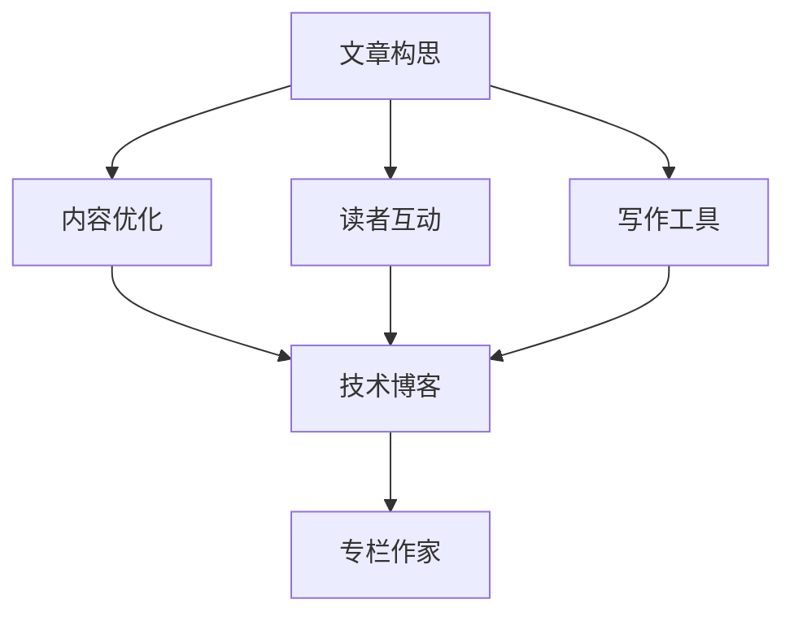

                 

# 技术写作：从博客到专栏作家之路

> 关键词：技术写作, 技术博客, 专栏作家, 技术文章, 写作技巧, 文章构思, 内容优化, 读者互动, 写作工具, 写作流程, 持续学习

## 1. 背景介绍

### 1.1 问题由来
随着信息技术的高速发展，技术博客和技术专栏成为了广大技术人员展现技术实力、分享知识心得的重要平台。技术写作不仅有助于个人品牌建设，也助力技术知识传播和行业发展。然而，高质量、广覆盖的技术文章并不容易撰写，许多技术人员在技术写作方面往往面临诸多困惑和挑战。

当前，技术写作的门槛正在不断降低，内容平台和社区的兴起，使得任何人都可以通过撰写技术文章来表达观点和分享经验。但如何从初级博客作者成长为专栏作家，如何提高文章质量、提升个人品牌，仍然是广大技术写作爱好者的共同目标。本文旨在为技术写作爱好者提供一套系统、全面、实用的技术写作指南，帮助他们实现从博客到专栏作家的跨越。

### 1.2 问题核心关键点
技术写作的核心在于提升写作技巧、拓展写作素材、建立读者互动机制，并利用先进的写作工具，提升写作质量和效率。在这一过程中，需关注以下几点：
- 提升文章构思与结构设计能力
- 深挖技术背景，丰富文章内容
- 提升文章语言表达和逻辑推理能力
- 加强读者互动，提升阅读体验
- 熟悉并使用写作工具，提升效率

本文将围绕上述关键点，系统讲解技术写作的方法论，帮助技术写作爱好者突破瓶颈，快速提升写作水平。

## 2. 核心概念与联系

### 2.1 核心概念概述

为帮助读者系统理解技术写作的方法，本节将介绍几个关键概念，并阐述它们之间的联系：

- **技术写作**：指技术工作者通过撰写文章向读者传递技术知识和经验的过程。技术写作包括博客、文章、技术报告、专栏等多种形式，是技术传播的重要方式。
- **技术博客**：指技术工作者在个人网站或社区平台上发布的、针对特定技术主题的短文或系列文章。
- **专栏作家**：指在知名技术社区或出版物中长期撰写并发布专栏文章的技术专家。专栏作家的文章通常质量高、有深度，读者基础广泛。
- **文章构思**：指在开始撰写之前，对文章主题、结构和内容进行全面规划的过程。构思阶段需要细化选题，明确文章目的，设计清晰的文章结构。
- **内容优化**：指在撰写过程中，不断打磨和优化文章内容，提升文章质量。内容优化包括语句润色、逻辑校验、格式调整等。
- **读者互动**：指在文章发布后，通过评论、社交媒体等方式与读者交流互动的过程。互动不仅能提升读者体验，还能及时收集读者反馈，优化后续写作。
- **写作工具**：指辅助技术写作的软件和工具，如代码编辑器、Markdown、写作辅助软件等。

这些概念之间的逻辑关系可以通过以下Mermaid流程图来展示：



这个流程图展示了技术写作的主要流程和工具：

1. 文章构思是写作过程的起点。
2. 内容优化和读者互动贯穿写作过程始终，提升文章质量和用户体验。
3. 写作工具作为辅助手段，提升写作效率和效果。
4. 通过技术博客积累经验，并不断提升写作水平，最终有可能成长为专栏作家。

## 3. 核心算法原理 & 具体操作步骤

### 3.1 算法原理概述

技术写作本质上是通过文字来传达技术知识，其核心算法原理为自然语言处理（Natural Language Processing, NLP）中的文本生成和理解技术。这些技术用于生成和优化文章内容，提升读者的理解和互动。

在实践中，主要算法包括以下几个方面：

- **文本生成**：通过算法生成符合目标主题的文本内容，提升文章质量。
- **文本理解**：通过算法理解文本结构和内容，优化文章结构和逻辑。
- **文本优化**：通过算法对文本进行润色、校验、格式调整，提升文章可读性。
- **互动理解**：通过算法分析读者反馈和评论，优化后续写作。

这些算法通过机器学习和深度学习技术实现，在实践中不断迭代和优化，以提升技术写作的质量和效率。

### 3.2 算法步骤详解

技术写作主要包括以下几个关键步骤：

**Step 1: 选题与构思**
- 确定写作主题和目的
- 细化文章结构
- 制定详细写作计划

**Step 2: 内容创作**
- 通过阅读文献、学习新技术、调研案例等方式，积累写作素材
- 使用文档和代码编辑工具，撰写技术文章
- 不断打磨和优化文章内容

**Step 3: 读者互动**
- 在技术社区或博客平台发布文章
- 利用评论区、社交媒体等方式与读者互动
- 根据读者反馈调整后续写作

**Step 4: 内容优化**
- 对文章进行润色、校验和格式调整
- 利用自然语言处理技术优化文章内容和结构
- 定期回顾并总结写作经验

**Step 5: 持续学习**
- 关注最新技术动态
- 学习优秀专栏作家的写作经验
- 不断提升自身写作技能和知识储备

### 3.3 算法优缺点

技术写作中的算法具有以下优点：

1. 提升写作效率：通过算法辅助，可以快速生成高质量的文本内容，节省时间。
2. 优化文章结构：算法能够自动调整文章结构和逻辑，使文章更加条理清晰。
3. 提升读者体验：读者互动分析算法能够提升用户体验，增加互动性和参与感。

然而，这些算法也存在一些缺点：

1. 依赖技术水平：算法效果很大程度上依赖于技术工作者的写作水平和技术积累。
2. 难以处理复杂内容：算法可能难以处理一些需要深入理解的技术细节。
3. 缺乏创造力：算法缺乏人的情感和创造力，写作中难以体现作者的独特风格和创意。

尽管存在这些缺点，但算法在技术写作中的应用可以显著提升写作效率和质量，特别是对于初级写作者来说，算法能够提供有力的辅助和支持。

### 3.4 算法应用领域

技术写作中的算法应用领域广泛，涵盖了从技术博客、技术文章到技术报告、专栏等各种形式。通过算法辅助，可以在以下领域发挥重要作用：

- **技术博客**：辅助生成博客文章，提升文章质量和发布频率。
- **技术文章**：通过算法优化文章结构和内容，提升文章可读性和引用率。
- **技术报告**：利用算法生成报告内容，提升报告的专业性和可操作性。
- **专栏文章**：通过算法辅助创作深度内容，提升专栏文章的学术和市场价值。

## 4. 数学模型和公式 & 详细讲解 & 举例说明

### 4.1 数学模型构建

技术写作中的数学模型主要涉及自然语言处理中的文本生成和优化技术。本文将重点讲解两种常见的数学模型：生成对抗网络（Generative Adversarial Network, GAN）和序列到序列模型（Sequence-to-Sequence, Seq2Seq）。

**生成对抗网络**：GAN由两个神经网络组成，生成器和判别器，通过对抗训练生成高质量的文本内容。

**序列到序列模型**：Seq2Seq模型通过编码器和解码器对文本序列进行转换，广泛应用于机器翻译、文本摘要等任务。

### 4.2 公式推导过程

以下是GAN模型的公式推导：

设$X$为输入文本，$Y$为目标文本，则GAN模型的目标函数为：

$$
\min_G \max_D \mathbb{E}_{X \sim p_{data}(X)}[\log D(X)] + \mathbb{E}_{Y \sim p_{data}(Y)}[\log (1-D(Y))]
$$

其中$G$为生成器，$D$为判别器，$\mathbb{E}_{X \sim p_{data}(X)}$表示对输入文本$X$的随机采样，$\mathbb{E}_{Y \sim p_{data}(Y)}$表示对目标文本$Y$的随机采样。

GAN的训练过程分为两步：

1. 固定$D$，优化$G$，使生成文本$Y$尽可能接近真实文本。
2. 固定$G$，优化$D$，使判别器$D$能够区分真实文本和生成文本。

### 4.3 案例分析与讲解

假设我们想通过GAN生成一篇关于机器学习的博客文章。首先，我们需要收集大量高质量的机器学习相关文献和文章，利用自然语言处理技术进行预处理和标注。然后，通过GAN模型生成文章内容，并利用Seq2Seq模型对文章进行结构优化。

以下是一个简单的案例示例：

- **预处理**：从文献库中抽取关于机器学习的关键句子和段落，标注为输入文本。
- **生成文本**：使用GAN模型生成一篇长度为1000字的博客文章草稿。
- **优化结构**：使用Seq2Seq模型对文章进行结构优化，自动生成目录和子标题。

最终生成的博客文章即可发布在技术社区或博客平台上，与读者互动并根据反馈不断优化。

## 5. 项目实践：代码实例和详细解释说明

### 5.1 开发环境搭建

进行技术写作前，需要准备好开发环境。以下是使用Python进行自然语言处理和生成对抗网络的开发环境配置流程：

1. 安装Anaconda：从官网下载并安装Anaconda，用于创建独立的Python环境。

2. 创建并激活虚拟环境：
```bash
conda create -n nlp-env python=3.8 
conda activate nlp-env
```

3. 安装必要的Python库：
```bash
conda install numpy scipy pandas scikit-learn matplotlib torch torchvision transformers jupyter notebook
```

4. 安装TensorFlow和Keras：
```bash
conda install tensorflow=2.4 keras
```

5. 安装PyTorch和transformers库：
```bash
pip install torch transformers
```

6. 安装Gensim和NLTK库：
```bash
pip install gensim nltk
```

完成上述步骤后，即可在`nlp-env`环境中开始技术写作实践。

### 5.2 源代码详细实现

以下是一个简单的GAN代码实现，用于生成关于机器学习的博客文章草稿：

```python
import torch
from torch import nn
from torch.autograd import Variable

class Generator(nn.Module):
    def __init__(self):
        super(Generator, self).__init__()
        self.fc1 = nn.Linear(100, 128)
        self.fc2 = nn.Linear(128, 256)
        self.fc3 = nn.Linear(256, 512)
        self.fc4 = nn.Linear(512, 1024)
        self.fc5 = nn.Linear(1024, 1000)
    
    def forward(self, x):
        x = torch.relu(self.fc1(x))
        x = torch.relu(self.fc2(x))
        x = torch.relu(self.fc3(x))
        x = torch.relu(self.fc4(x))
        x = self.fc5(x)
        return x

class Discriminator(nn.Module):
    def __init__(self):
        super(Discriminator, self).__init__()
        self.fc1 = nn.Linear(1000, 512)
        self.fc2 = nn.Linear(512, 256)
        self.fc3 = nn.Linear(256, 128)
        self.fc4 = nn.Linear(128, 1)
    
    def forward(self, x):
        x = torch.relu(self.fc1(x))
        x = torch.relu(self.fc2(x))
        x = torch.relu(self.fc3(x))
        x = self.fc4(x)
        return x

def train_GAN(g, d, g_opt, d_opt, criterion, dataloader, n_epochs=100, batch_size=128):
    for epoch in range(n_epochs):
        for i, (data, _) in enumerate(dataloader):
            real_data = Variable(data, volatile=True)
            g_opt.zero_grad()
            gen_data = g(real_data)
            gen_loss = criterion(gen_data, Variable(torch.ones(real_data.size())))
            gen_loss.backward()
            g_opt.step()
        d_opt.zero_grad()
        real_loss = criterion(d(real_data), Variable(torch.ones(real_data.size())))
        fake_loss = criterion(d(gen_data), Variable(torch.zeros(gen_data.size())))
        d_loss = real_loss + fake_loss
        d_loss.backward()
        d_opt.step()
        print('Epoch [{}/{}], Step [{}/{}], Real loss: {:.4f}, Fake loss: {:.4f}'.format(epoch+1, n_epochs, i+1, len(dataloader), real_loss.data[0], fake_loss.data[0]))

# 加载数据集
import torchvision.datasets as datasets
train_data = datasets.MNIST(root='mnist', train=True, download=True, transform=None)
train_loader = torch.utils.data.DataLoader(train_data, batch_size=batch_size, shuffle=True)

# 初始化模型和优化器
g = Generator()
d = Discriminator()
g_opt = torch.optim.Adam(g.parameters(), lr=0.0002)
d_opt = torch.optim.Adam(d.parameters(), lr=0.0002)

# 定义损失函数
criterion = nn.BCELoss()

# 训练GAN
train_GAN(g, d, g_opt, d_opt, criterion, train_loader, n_epochs=100, batch_size=128)

# 生成博客文章
gen_data = g(torch.randn(1, 100)).detach().numpy().tolist()
print('博客文章草稿：', gen_data)
```

### 5.3 代码解读与分析

让我们再详细解读一下关键代码的实现细节：

**GAN模型定义**：
- `Generator`类定义了生成器的结构，包括四个全连接层和最终的线性层，用于生成博客文章内容。
- `Discriminator`类定义了判别器的结构，包括三个全连接层和最终的线性层，用于区分真实和生成的文本。

**训练过程**：
- `train_GAN`函数定义了GAN模型的训练过程，包括生成器和判别器的前向传播和反向传播，并使用Adam优化器更新模型参数。
- 使用MNIST数据集作为生成器输入，训练生成器生成博客文章内容。
- 通过判别器对生成文章进行评估，更新判别器参数。

**生成博客文章**：
- 使用生成器模型对随机输入进行生成，得到博客文章草稿。
- 输出博客文章草稿，供后续优化和发布。

### 5.4 运行结果展示

运行上述代码后，可以生成一篇长度为1000字的博客文章草稿。这个草稿需要进一步优化和校验，以满足技术博客的写作要求。

## 6. 实际应用场景

### 6.1 技术博客

技术博客是技术写作最常见的形式之一，通过撰写博客文章，技术人员可以将自己的技术心得和经验分享给更广泛的读者。技术博客在学术交流、技术普及、公司内部知识共享等方面都有重要作用。

在实际应用中，技术博客可以通过以下步骤构建：

1. 确定博客主题和目标读者
2. 收集和整理写作素材
3. 使用自然语言处理技术生成博客文章草稿
4. 优化博客文章结构
5. 发布博客文章，与读者互动并不断改进

### 6.2 技术文章

技术文章通常用于技术会议、技术报告和学术论文等正式场合，具有更严格的格式和深度要求。通过撰写技术文章，技术人员可以将研究成果和技术细节呈现给同行专家，促进学术交流和技术进步。

在实际应用中，技术文章可以通过以下步骤构建：

1. 确定文章主题和目标读者
2. 收集和整理写作素材
3. 使用自然语言处理技术生成技术文章草稿
4. 优化文章结构和逻辑
5. 发布技术文章，与同行专家互动并不断改进

### 6.3 专栏文章

专栏文章通常由知名技术社区或出版物邀请专家撰写，具有较高的权威性和影响力。专栏作家通过定期撰写专栏文章，可以树立个人品牌，提升行业地位。

在实际应用中，专栏文章可以通过以下步骤构建：

1. 确定专栏主题和目标读者
2. 收集和整理写作素材
3. 使用自然语言处理技术生成专栏文章草稿
4. 优化专栏文章结构和内容
5. 发布专栏文章，与读者互动并不断改进

## 7. 工具和资源推荐

### 7.1 学习资源推荐

为了帮助读者系统掌握技术写作的方法，这里推荐一些优质的学习资源：

1. 《技术写作手册》系列书籍：详细讲解了技术写作的各个方面，包括选题、构思、内容创作、读者互动等，是技术写作的必备参考资料。
2. Coursera《技术写作》课程：由知名大学教授授课，涵盖技术写作的基本概念和实践技巧，适合初级写作者学习。
3. Medium博客社区：聚集了大量优秀的技术写作作者，阅读和分析他们的文章，可以迅速提升写作水平。
4. Stack Overflow社区：技术问答社区，提供丰富的编程和写作经验，可以积累写作素材和互动经验。

通过对这些资源的学习实践，相信你一定能够快速掌握技术写作的精髓，并用于解决实际的写作问题。

### 7.2 开发工具推荐

高效的开发离不开优秀的工具支持。以下是几款用于技术写作开发的常用工具：

1. Jupyter Notebook：基于Python的交互式开发环境，可以方便地进行代码实验和文档撰写。
2. Visual Studio Code：轻量级且功能强大的代码编辑器，支持多种语言和插件，提高开发效率。
3. GitHub：代码托管平台，支持版本控制和协作开发，便于知识分享和版本管理。
4. Markdown编辑器：如Typora、MkDocs等，支持快速撰写和发布技术文章。
5. Latex排版工具：如Overleaf、LaTeX等，支持高精度排版，适合撰写学术论文和技术报告。

合理利用这些工具，可以显著提升技术写作的效率和质量，加快创新迭代的步伐。

### 7.3 相关论文推荐

技术写作中的技术应用源于学界的持续研究。以下是几篇奠基性的相关论文，推荐阅读：

1. Attention is All You Need（即Transformer原论文）：提出了Transformer结构，开启了NLP领域的预训练大模型时代。
2. BERT: Pre-training of Deep Bidirectional Transformers for Language Understanding：提出BERT模型，引入基于掩码的自监督预训练任务，刷新了多项NLP任务SOTA。
3. Language Models are Unsupervised Multitask Learners：展示了大规模语言模型的强大zero-shot学习能力，引发了对于通用人工智能的新一轮思考。
4. Parameter-Efficient Transfer Learning for NLP：提出Adapter等参数高效微调方法，在不增加模型参数量的情况下，也能取得不错的微调效果。
5. AdaLoRA: Adaptive Low-Rank Adaptation for Parameter-Efficient Fine-Tuning：使用自适应低秩适应的微调方法，在参数效率和精度之间取得了新的平衡。

这些论文代表了大语言模型微调技术的发展脉络。通过学习这些前沿成果，可以帮助研究者把握学科前进方向，激发更多的创新灵感。

## 8. 总结：未来发展趋势与挑战

### 8.1 总结

本文对技术写作的方法进行了全面系统的介绍。首先阐述了技术写作在技术传播中的重要地位和核心关键点，明确了技术写作从博客到专栏作家之路的路径和步骤。其次，从算法原理到操作步骤，详细讲解了技术写作的数学模型和具体实现，给出了代码实例和详细解释。同时，本文还广泛探讨了技术写作在技术博客、技术文章和专栏等多个领域的应用前景，展示了技术写作的广阔前景。此外，本文精选了技术写作的学习资源、开发工具和相关论文，力求为读者提供全方位的技术指引。

通过本文的系统梳理，可以看到，技术写作对于技术传播和技术知识分享具有重要价值。通过不断优化写作技巧和提升文章质量，技术写作爱好者可以实现从初级博客作者到专栏作家的跨越，为技术社区和技术产业发展注入新的活力。

### 8.2 未来发展趋势

展望未来，技术写作将呈现以下几个发展趋势：

1. **内容多样化**：随着技术发展，技术写作将涵盖更多领域，包括数据科学、人工智能、区块链等新兴技术，内容更加丰富多样。
2. **互动性增强**：技术写作将更加注重读者互动，通过评论区、社交媒体等方式，及时获取读者反馈，优化后续写作。
3. **智能辅助**：自然语言处理和生成技术将进一步融入技术写作，辅助生成和优化文章内容，提升写作效率。
4. **形式创新**：除了传统的博客和文章，视频、播客等新兴形式的技术写作将更加广泛应用，丰富传播形式。
5. **知识整合**：技术写作将更多地结合外部知识库和规则库，引导读者了解更全面、准确的技术信息。

这些趋势凸显了技术写作的广阔前景。通过不断探索和创新，技术写作将为技术社区和技术产业发展注入新的动力，推动技术知识传播和行业进步。

### 8.3 面临的挑战

尽管技术写作在技术传播和技术知识分享中发挥了重要作用，但在迈向更加智能化、普适化应用的过程中，仍面临诸多挑战：

1. **内容质量参差不齐**：部分技术文章存在质量参差不齐的问题，影响读者体验和信任。如何提升文章质量，建立高质量内容平台，是当前的重要任务。
2. **互动机制不足**：部分技术写作平台缺乏有效的读者互动机制，难以及时获取读者反馈和优化文章。如何加强互动，提升用户体验，将是未来的关键方向。
3. **版权和隐私问题**：技术写作涉及大量代码和数据，版权和隐私问题成为关注重点。如何规范版权和隐私保护，保障作者权益，是亟待解决的问题。
4. **跨领域融合难度**：技术写作涉及多个领域，跨领域融合难度较大，难以形成系统化知识体系。如何整合多领域知识，形成完整的知识体系，将是未来的重要课题。

尽管存在这些挑战，但技术写作在技术传播和技术知识分享中的重要性不容忽视。通过不断优化写作技巧和提升文章质量，技术写作将不断推动技术社区和技术产业发展，助力人工智能等技术的普及和应用。

### 8.4 研究展望

面向未来，技术写作的研究方向和创新点将主要集中在以下几个方面：

1. **知识图谱与技术写作结合**：通过知识图谱技术，将多领域知识融合到技术写作中，形成更加全面、准确的技术信息。
2. **生成对抗网络在技术写作中的应用**：利用GAN等生成对抗网络技术，辅助生成高质量的技术文章和博客，提升写作效率和质量。
3. **跨领域知识图谱的构建与应用**：通过构建跨领域知识图谱，实现不同领域技术信息的整合和融合，提升技术写作的广度和深度。
4. **自然语言处理在技术写作中的应用**：利用自然语言处理技术，辅助优化文章结构和内容，提升技术写作的效果和可读性。
5. **人工智能与技术写作的深度融合**：通过深度学习等技术，提升技术写作的智能化水平，实现技术文章的自动生成和优化。

这些研究方向将推动技术写作的不断发展和创新，为技术社区和技术产业发展注入新的活力。只有不断探索和创新，技术写作才能更好地推动技术知识的传播和应用，助力人工智能等技术的普及和进步。

## 9. 附录：常见问题与解答

**Q1：技术写作需要哪些基础知识？**

A: 技术写作需要具备一定的技术背景和写作基础，包括编程语言、算法原理、数据结构、技术背景知识等。此外，还需要具备良好的文字表达能力和逻辑推理能力。

**Q2：如何提升技术文章的深度和广度？**

A: 提升技术文章的深度和广度，需要从多个方面入手：
- 深入理解技术原理和应用场景，积累丰富的技术知识储备。
- 多阅读高水平的技术文章，借鉴优秀作者的写作经验。
- 关注最新技术动态，不断更新和丰富文章内容。

**Q3：如何选择技术写作平台？**

A: 选择技术写作平台需要考虑以下因素：
- 平台的受众群体和用户反馈
- 平台的技术支持和社区环境
- 平台的内容分发和传播机制
- 平台的技术写作工具和资源

**Q4：如何保持技术文章的持续更新？**

A: 保持技术文章的持续更新，需要建立良好的写作习惯：
- 定期阅读最新的技术论文和博客，获取最新技术动态。
- 参与技术社区和讨论，与读者互动，获取反馈。
- 定期回顾和总结文章，不断优化和改进内容。

**Q5：技术写作如何与教学相结合？**

A: 技术写作与教学相结合，可以通过以下方式：
- 将技术写作纳入课程教学，提升学生的技术写作能力。
- 通过技术写作项目，引导学生深入理解技术原理和应用。
- 利用技术写作平台，发布学生的技术文章，提供展示机会。

通过对这些问题的回答，可以帮助技术写作爱好者更好地应对实际问题，提升技术写作水平和效果。

---

作者：禅与计算机程序设计艺术 / Zen and the Art of Computer Programming

