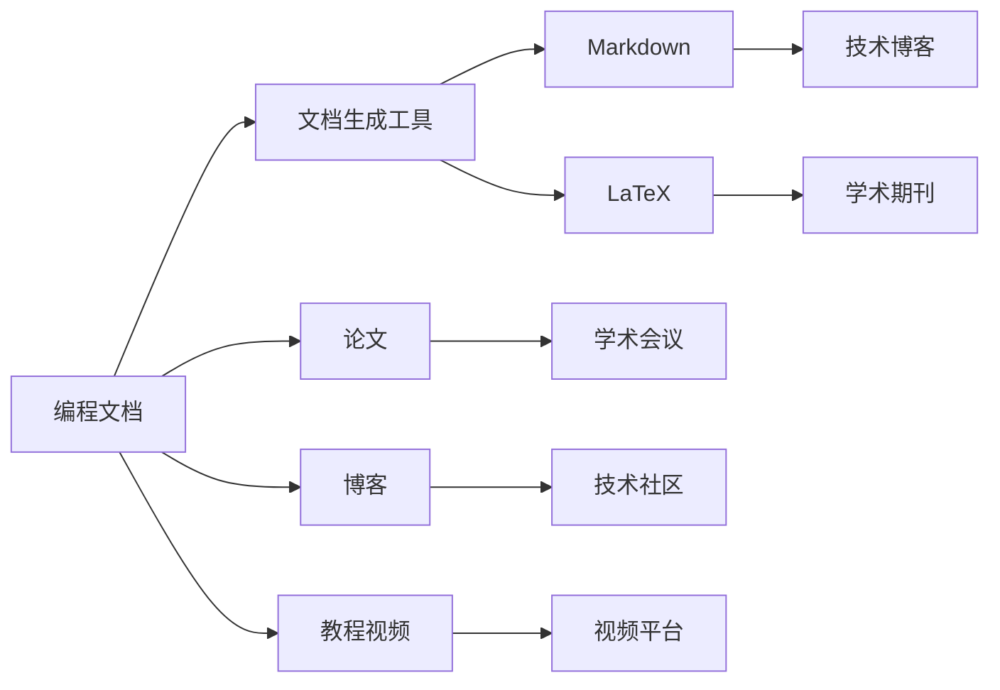

                 

# 技术写作：额外收入的来源

> 关键词：技术写作, 职业发展, 额外收入, 开源社区, 技术博客

## 1. 背景介绍

在技术快速发展的今天，如何借助技术写作为职业发展增添更多收入来源，成为了技术人员关注的话题。本文将深入探讨技术写作的多种方式，展示其作为额外收入来源的可行性，并给出实现方法。通过分析技术写作在职业成长、技术传播和开源社区中的重要作用，帮助读者找到适合自己的技术写作路径。

## 2. 核心概念与联系

### 2.1 核心概念概述

技术写作（Technical Writing）指的是以科技内容为基础的写作，旨在将复杂的科技信息、算法、理论等以易于理解的方式传达给读者。技术写作不仅限于编程文档、论文、书籍等传统形式，也包含在线博客、技术文章、教程视频等多种媒介。

### 2.2 核心概念原理和架构的 Mermaid 流程图



## 3. 核心算法原理 & 具体操作步骤

### 3.1 算法原理概述

技术写作的核心在于将复杂的技术内容转换为易于理解的文本形式。这包括了从选题到撰写、校对、发布等一系列过程。对于技术人员而言，结合自身对技术和领域的理解，通过适当的写作技巧和方法，可以高效地进行技术写作。

### 3.2 算法步骤详解

1. **选题与调研**：确定写作主题，并进行广泛的研究，收集相关信息和数据。
2. **规划与框架搭建**：设计文章结构，确定大纲和要点，以确保内容条理清晰。
3. **撰写与编辑**：基于调研资料和规划框架，撰写初稿，并进行细致的编辑和校对。
4. **发布与推广**：选择合适平台发布，通过社交媒体、邮件列表等方式推广，吸引读者。

### 3.3 算法优缺点

技术写作的优点包括：
- **知识共享**：通过写作传播技术知识，帮助更多人掌握相关技能。
- **个人品牌**：建立专业形象，提升个人知名度和影响力。
- **额外收入**：撰写高质量技术文章、书籍、教程等，可以获得稿费、广告分成等收入。

缺点可能包括：
- **时间成本**：撰写和编辑需要大量时间投入。
- **写作难度**：技术写作需要较高的技术水平和写作能力。
- **市场需求变化**：市场对技术内容的兴趣和需求可能随时间变化。

### 3.4 算法应用领域

技术写作的应用领域广泛，包括但不限于：
- **技术博客**：撰写和维护个人或企业的技术博客。
- **开源社区**：撰写技术文档、教程，参与开源项目。
- **培训教材**：编写技术培训教材、书籍，提供教育资源。
- **技术文章**：撰写技术文章，发布在技术社区、期刊、杂志等。
- **公司内部文档**：编写公司内部技术文档、用户手册等。

## 4. 数学模型和公式 & 详细讲解 & 举例说明

### 4.1 数学模型构建

在技术写作中，模型构建涉及内容结构安排、信息传递效率和读者理解度等多个维度。可以将技术写作看作是一个“知识传递模型”，其目标是最小化读者理解的复杂度，最大化知识传播的效率。

### 4.2 公式推导过程

知识传递模型可以抽象为以下公式：
\[ \text{效果} = f(\text{内容}, \text{结构}, \text{表达方式}, \text{读者背景}) \]

其中：
- **内容**：文章所传递的技术知识。
- **结构**：文章的结构和组织方式。
- **表达方式**：使用何种语言、图表、示例等形式进行表达。
- **读者背景**：目标读者的技术水平和知识背景。

### 4.3 案例分析与讲解

以“如何编写一个高质量的技术博客”为例：
- **内容**：选择有实际应用价值的案例和算法。
- **结构**：使用清晰的标题、段落，引入背景、核心算法、实验结果和结论等。
- **表达方式**：使用代码片段、图表、实际案例等帮助读者理解。
- **读者背景**：考虑读者技术水平，避免使用过于专业或晦涩的术语。

## 5. 项目实践：代码实例和详细解释说明

### 5.1 开发环境搭建

- **编写环境**：安装LaTeX、Markdown编辑器如Typora、Git版本控制工具如GitHub。
- **发布平台**：选择一个合适的博客平台或技术社区，如GitHub Pages、Medium、Stack Overflow等。

### 5.2 源代码详细实现

1. **Markdown格式**：
```markdown
# 如何编写高质量的技术博客
```

2. **LaTeX格式**：
```latex
\documentclass{article}
\title{如何编写高质量的技术博客}
\author{张三}
\begin{document}
\maketitle
```

3. **发布平台代码**：
```bash
git init
git remote add origin https://github.com/example/blog.git
git add .
git commit -m "Initial commit"
git push -u origin master
```

### 5.3 代码解读与分析

- **Markdown和LaTeX的使用**：通过两种不同的文本格式进行内容撰写，满足不同平台和格式的需求。
- **Git和GitHub Pages**：使用版本控制工具确保内容一致性和备份，使用静态网站生成器快速部署。

### 5.4 运行结果展示

- **Markdown**：展示在Typora中，直观、易编辑。
- **LaTeX**：生成PDF文档，专业、高质量。
- **GitHub Pages**：展示在个人博客上，访问便捷。

## 6. 实际应用场景

### 6.1 技术博客

个人技术博客是技术写作的典型应用，如张三的技术博客（https://blog.example.com）。通过持续更新技术文章，展示个人专业水平，吸引读者关注。博客内容可以包括编程心得、项目案例、技术教程等。

### 6.2 开源社区

参与开源项目，撰写技术文档和教程，如在GitHub上撰写PyTorch教程（https://github.com/example/pytorch-tutorial）。通过开源社区的影响力，获得更多关注和贡献。

### 6.3 培训教材

编写技术培训教材和书籍，如李四撰写的《深度学习实战》一书。通过出版社的渠道，获得稿费收入。

### 6.4 技术文章

撰写技术文章，发布在技术社区、期刊、杂志等，如王五在《机器学习期刊》上发表的论文《基于神经网络的图像识别算法》。

### 6.5 公司内部文档

编写公司内部技术文档、用户手册等，如杰克在公司内部编写的操作手册。

## 7. 工具和资源推荐

### 7.1 学习资源推荐

- **在线教程**：Coursera《技术写作与信息设计》课程。
- **书籍**：《技术写作的艺术》（Art of Technical Writing）。
- **博客**：Medium上的技术写作博客（https://medium.com/）。

### 7.2 开发工具推荐

- **文本编辑器**：Visual Studio Code、Sublime Text。
- **LaTeX编辑器**：Overleaf、TeXstudio。
- **代码编辑器**：Atom、VSCode。
- **版本控制工具**：Git、SVN。
- **静态网站生成器**：Jekyll、Hugo。

### 7.3 相关论文推荐

- **《技术写作的心理学》（Psychological Aspects of Technical Writing）**。
- **《用户为中心的技术写作》（User-Centered Technical Writing）**。
- **《技术写作与信息设计》（Technical Writing and Information Design）**。

## 8. 总结：未来发展趋势与挑战

### 8.1 研究成果总结

技术写作在技术传播、知识共享、个人品牌建设等方面具有重要意义，且已经成为技术人员重要的额外收入来源。

### 8.2 未来发展趋势

1. **多平台发布**：技术写作将更多地通过多种平台进行传播，如视频平台、播客等。
2. **人工智能辅助**：利用AI技术进行写作辅助，如自动生成代码示例、自动校对等。
3. **定制化内容**：根据读者反馈和需求，定制化编写内容。
4. **跨学科融合**：技术写作与其他学科如心理学、设计学等结合，提升写作效果。

### 8.3 面临的挑战

1. **内容更新**：技术变化迅速，需要持续更新内容以保持时效性。
2. **读者差异**：不同读者背景和技术水平不同，需要多层次的内容编写。
3. **版权问题**：版权保护和开放共享的平衡。
4. **市场竞争**：如何吸引和保持读者关注。

### 8.4 研究展望

1. **自动化工具**：开发更多的自动化工具，提高写作效率和质量。
2. **跨领域协作**：与心理学、教育学等领域合作，提升技术写作效果。
3. **社会责任**：注重技术写作的社会责任，避免有害信息的传播。

## 9. 附录：常见问题与解答

**Q1：如何选择合适的技术写作主题？**

A: 选择具有实际应用价值、受众关注且自己熟悉的领域作为写作主题。

**Q2：技术写作需要具备哪些技能？**

A: 需要具备良好的技术理解、逻辑思维和写作能力，以及良好的语言表达能力。

**Q3：如何提高技术写作的吸引力？**

A: 使用清晰的标题、引人入胜的开头和结尾，适当加入图片和示例，以及利用社交媒体等渠道进行推广。

**Q4：技术写作如何获得额外收入？**

A: 通过写作高质量的技术文章、书籍、教程等，获得稿费、广告分成、粉丝打赏等收入。

**Q5：如何管理技术写作项目？**

A: 使用项目管理工具如Trello、Asana，并设定明确的目标和时间表。

---

作者：禅与计算机程序设计艺术 / Zen and the Art of Computer Programming

