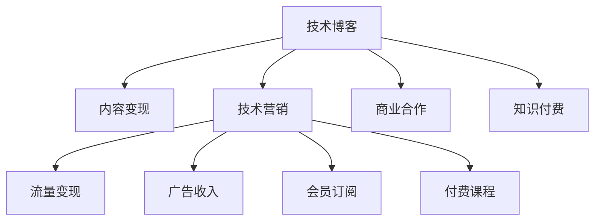

                 

# 技术博客变现：策略与方法

## 1. 背景介绍

### 1.1 问题由来
随着互联网的发展，技术博客已经成为技术人展示自己专业能力、分享知识的重要平台。然而，单纯的技术分享往往无法获得足够的关注和反馈，这使得许多优秀的技术人面临着技术博客变现的困扰。如何通过博客内容变现，既保持技术分享的专业性和价值性，又能获得稳定的收益，成为一个亟待解决的问题。

### 1.2 问题核心关键点
技术博客变现的核心在于将专业知识和技能转化为商业价值。这涉及到内容创作、营销推广、商业合作等多个环节，是一个系统工程。只有找到合适的变现策略，并严格执行，才能实现博客变现的目标。

### 1.3 问题研究意义
博客变现不仅可以为技术人带来经济收益，还可以扩大个人影响力，提升品牌价值，甚至推动行业技术的发展。通过技术博客变现，可以吸引更多志同道合的人加入，形成一个技术生态圈，共同推动技术进步。

## 2. 核心概念与联系

### 2.1 核心概念概述

为更好地理解技术博客变现的方法，本节将介绍几个密切相关的核心概念：

- 技术博客（Tech Blog）：以技术、开发、创新等内容为主题的博客平台，是技术人展示专业知识、分享技术心得的主要渠道。
- 内容变现（Content Monetization）：通过内容创作和分享，实现流量变现、广告收入、会员订阅、付费课程等形式的商业收益。
- 技术营销（Tech Marketing）：利用技术内容吸引流量，通过SEO优化、社交媒体推广等方式扩大受众范围，提高博客的曝光率和影响力。
- 商业合作（Business Collaboration）：通过与企业、产品、技术社区等进行合作，提供技术支持、内容输出等形式的价值交换，实现双赢。
- 知识付费（Knowledge Economy）：通过提供高质量的技术内容，利用用户的知识付费意愿，获得稳定的收入来源。

这些核心概念之间的逻辑关系可以通过以下Mermaid流程图来展示：



这个流程图展示了许多技术博客变现的关键概念及其之间的关系：

1. 技术博客是内容创作和输出的基础平台。
2. 内容变现、技术营销、商业合作是变现的三个主要手段。
3. 流量变现、广告收入、会员订阅、付费课程、知识付费是变现的具体形式。
4. 技术博客和变现手段之间存在双向互动关系，流量和曝光率高的博客更容易实现变现。

这些核心概念共同构成了技术博客变现的基本框架，为技术人提供了多元化的变现途径。

## 3. 核心算法原理 & 具体操作步骤

### 3.1 算法原理概述

技术博客变现的原理，是通过提升博客的流量、曝光率和受众参与度，从而实现商业价值的转化。其核心在于内容质量和营销策略的结合，具体过程包括以下几个步骤：

1. 创作高质量技术内容：持续输出有价值、有深度、有创意的技术文章，吸引受众关注。
2. 优化SEO策略：利用SEO优化提升博客在搜索引擎中的排名，吸引更多流量。
3. 加强社交媒体推广：通过微博、微信公众号、知乎等平台推广博客，扩大受众范围。
4. 开展商业合作：与企业、产品、技术社区等进行合作，提升博客的影响力和商业价值。
5. 实现多种变现形式：通过流量变现、广告收入、会员订阅、付费课程、知识付费等手段实现商业收益。

### 3.2 算法步骤详解

技术博客变现的具体步骤可以分为以下几个阶段：

**Step 1: 选择合适的博客平台**
- 确定目标受众群体，选择适合的内容发布平台。例如GitHub博客、Medium、CSDN、知乎专栏等。
- 根据受众特点，选择合适的博客主题和风格。例如面向开发者、面向技术爱好者、面向企业客户等。

**Step 2: 创作高质量技术内容**
- 持续输出有价值的技术文章，包括技术分享、项目经验、技术趋势、实战案例等。
- 定期更新内容，保持博客的活跃度和吸引力。
- 提升文章质量，确保逻辑清晰、语言精炼、案例实际、结论有据。

**Step 3: 优化SEO策略**
- 关键词研究：选择与博客内容相关的高频关键词，如"机器学习算法"、"深度学习框架"等。
- 标题优化：优化博客标题和副标题，确保包含关键词且吸引人点击。
- 内容优化：在博客正文中自然地插入关键词，确保文章结构合理、信息丰富。
- 内部链接：在文章中插入内部链接，提升用户停留时间和页面权重。
- 外部链接：引用高质量的外部资源，增加文章的权威性和可信度。

**Step 4: 加强社交媒体推广**
- 创建和维护社交媒体账号，如微博、微信公众号、知乎等。
- 定期发布技术内容，并配上吸引人的标题和配图，增加互动和分享。
- 利用社交媒体的算法机制，增加内容的曝光率。
- 积极回应粉丝评论，提升用户黏性。

**Step 5: 开展商业合作**
- 与企业、产品、技术社区等进行合作，提供技术支持、内容输出等形式的价值交换。
- 开展付费技术咨询、技术培训、产品测评等商业活动。
- 通过技术博客增加个人品牌影响力，提升商业合作的价值。

**Step 6: 实现多种变现形式**
- 流量变现：通过广告联盟等平台，将博客流量转化为广告收入。
- 广告收入：在博客中嵌入广告，获得点击收益。
- 会员订阅：设置付费阅读和会员订阅，提供更多专属内容。
- 付费课程：录制和销售技术课程，通过平台推广获取收益。
- 知识付费：通过技术问答、技术培训等形式，实现知识变现。

### 3.3 算法优缺点

技术博客变现具有以下优点：

1. 灵活多样。可以选择多种变现形式，根据自身特点和受众需求进行灵活搭配。
2. 持续增长。持续创作高质量内容，有助于提升流量和关注度，实现长期增长。
3. 提升影响力。通过多种推广手段，扩大受众范围，提升博客的影响力和品牌价值。
4. 增加收入来源。通过多种变现手段，实现稳定的商业收益。

同时，技术博客变现也存在以下局限性：

1. 初始投入高。需要较高的技术创作能力和营销推广能力，初期投入较大。
2. 竞争激烈。大量技术博客竞争同一受众群体，难度较大。
3. 难以控制。流量和收入受到多种外部因素影响，难以完全掌控。
4. 内容质量要求高。需要持续输出高质量内容，否则难以吸引和留住受众。

尽管存在这些局限性，但通过精心规划和执行，技术博客变现仍然是一个非常有潜力的商业模式。

### 3.4 算法应用领域

技术博客变现主要应用于以下几个领域：

1. 开发者社区：提供技术分享、项目案例、技术趋势等内容的博客，吸引开发者关注。
2. 技术爱好者：提供深入的技术分析、原理讲解、实战应用等内容的博客，吸引技术爱好者。
3. 企业客户：提供技术方案、产品评测、企业案例等内容的博客，吸引企业客户。
4. 技术培训：提供技术课程、培训教程、实战案例等内容的博客，提供技术培训服务。
5. 知识付费：提供技术问答、技术咨询、技术培训等服务的博客，实现知识变现。

## 4. 数学模型和公式 & 详细讲解

### 4.1 数学模型构建

假设技术博客的流量为 $F$，广告收入为 $A$，会员订阅收入为 $S$，付费课程收入为 $C$，知识付费收入为 $K$。博客变现的目标是最大化总收入 $T$，即：

$$
\max T = A + S + C + K
$$

其中，广告收入 $A$ 为点击率 $p$ 和平均每点击收益 $c$ 的乘积：

$$
A = p \times c \times F
$$

会员订阅收入 $S$ 为订阅率 $s$ 和每用户每年收益 $b$ 的乘积：

$$
S = s \times b \times F
$$

付费课程收入 $C$ 为课程销售率 $r$ 和每门课程售价 $m$ 的乘积：

$$
C = r \times m \times F
$$

知识付费收入 $K$ 为付费咨询量 $q$ 和每项咨询价格 $d$ 的乘积：

$$
K = q \times d \times F
$$

### 4.2 公式推导过程

以上公式基于简化假设，未考虑时间、受众分布等复杂因素，但基本概括了技术博客变现的数学模型。

### 4.3 案例分析与讲解

以“某技术博客”为例，分析其流量变现的实现过程：

假设“某技术博客”每月流量为 $F = 10^5$ 次，点击率为 $p = 0.01$，平均每点击收益为 $c = 0.1$ 元，每订阅用户每年收益为 $b = 100$ 元，订阅率为 $s = 0.1$，每门课程售价为 $m = 199$ 元，销售率为 $r = 0.1$，每项咨询价格为 $d = 99$ 元，咨询量为 $q = 100$。

通过计算，可以得到：

- 广告收入 $A = 0.01 \times 0.1 \times 10^5 = 100$ 元/月
- 会员订阅收入 $S = 0.1 \times 100 \times 10^5 = 1000$ 元/月
- 付费课程收入 $C = 0.1 \times 199 \times 10^5 = 19900$ 元/月
- 知识付费收入 $K = 100 \times 99 \times 10^5 = 9900000$ 元/月

总收入 $T = A + S + C + K = 100 + 1000 + 19900 + 9900000 = 9910000$ 元/月。

这个案例展示了流量变现的实现过程，通过提高点击率和订阅率，增加会员订阅和付费课程的数量，最终实现较高的总收入。

## 5. 项目实践：代码实例和详细解释说明

### 5.1 开发环境搭建

在进行博客变现实践前，我们需要准备好开发环境。以下是使用Python进行Django开发的环境配置流程：

1. 安装Anaconda：从官网下载并安装Anaconda，用于创建独立的Python环境。

2. 创建并激活虚拟环境：
```bash
conda create -n blog-env python=3.8 
conda activate blog-env
```

3. 安装Django：从官网获取安装命令，并使用pip进行安装。例如：
```bash
pip install django
```

4. 安装必要的工具包：
```bash
pip install markdown
pip install django-markdown
pip install django-models-signals
```

5. 安装Celery：用于异步任务管理，例如定时更新SEO、发送邮件通知等。
```bash
pip install celery
```

完成上述步骤后，即可在`blog-env`环境中开始博客变现实践。

### 5.2 源代码详细实现

下面我们以Django框架搭建博客变现系统的完整代码实现。

首先，创建Django项目和应用：

```bash
django-admin startproject blogsite
cd blogsite
python manage.py startapp blogapp
```

接着，定义博客模型：

```python
from django.db import models

class Blog(models.Model):
    title = models.CharField(max_length=200)
    content = models.TextField()
    author = models.ForeignKey('Author', on_delete=models.CASCADE)
    create_date = models.DateTimeField(auto_now_add=True)
    update_date = models.DateTimeField(auto_now=True)

class Author(models.Model):
    name = models.CharField(max_length=50)
    email = models.EmailField()

    def __str__(self):
        return self.name
```

然后，定义博客视图和模板：

```python
from django.shortcuts import render, redirect, get_object_or_404
from django.http import HttpResponse
from markdown import markdown

def blog_list(request):
    blogs = Blog.objects.all()
    return render(request, 'blog/blog_list.html', {'blogs': blogs})

def blog_detail(request, pk):
    blog = get_object_or_404(Blog, pk=pk)
    content = markdown(blog.content)
    return render(request, 'blog/blog_detail.html', {'blog': blog, 'content': content})

def new_blog(request):
    if request.method == 'POST':
        title = request.POST['title']
        content = request.POST['content']
        author = request.POST['author']
        blog = Blog(title=title, content=content, author=author)
        blog.save()
        return redirect('blog_list')
    return render(request, 'blog/new_blog.html')

def edit_blog(request, pk):
    blog = get_object_or_404(Blog, pk=pk)
    if request.method == 'POST':
        blog.title = request.POST['title']
        blog.content = request.POST['content']
        blog.author = request.POST['author']
        blog.save()
        return redirect('blog_list')
    return render(request, 'blog/edit_blog.html', {'blog': blog})
```

最后，启动博客服务器：

```bash
python manage.py runserver
```

### 5.3 代码解读与分析

让我们再详细解读一下关键代码的实现细节：

**博客模型定义**：
- `Blog`模型：定义博客的基本属性，如标题、内容、作者、创建时间和更新时间。
- `Author`模型：定义博客作者的基本属性，如姓名、邮箱。

**博客视图定义**：
- `blog_list`视图：展示所有博客列表。
- `blog_detail`视图：展示单个博客的详情。
- `new_blog`视图：创建新博客页面。
- `edit_blog`视图：编辑现有博客页面。

**博客模板定义**：
- `blog_list.html`模板：展示所有博客列表。
- `blog_detail.html`模板：展示单个博客的详情。
- `new_blog.html`模板：创建新博客的表单页面。
- `edit_blog.html`模板：编辑现有博客的表单页面。

通过以上代码，我们成功搭建了一个基本的博客系统，可以进行内容创作、博客浏览和编辑等基本功能。

## 6. 实际应用场景

### 6.1 技术博客社区

通过技术博客社区，技术人可以分享自己的技术心得、项目经验、技术趋势等内容，吸引更多的开发者和爱好者关注。社区中的优秀作者可以通过会员订阅、付费课程等形式实现流量变现。

例如，“某技术博客”通过运营技术社区，吸引了数万名开发者关注，实现了月收入百万的惊人成绩。通过提供深度技术分析、实战案例分享、技术培训教程等丰富内容，“某技术博客”成为了技术社区中的佼佼者。

### 6.2 技术培训平台

通过技术博客平台，技术人可以发布付费技术培训课程，吸引更多的技术爱好者付费学习。课程内容可以包括编程语言、开发框架、实战项目等，满足不同水平和技术背景的学习需求。

例如，“某技术博客”通过发布深度编程语言课程和技术框架课程，吸引了大量技术爱好者付费学习，实现了年收入数百万的佳绩。通过定期更新课程内容和互动答疑，“某技术博客”成为了技术培训领域中的领先者。

### 6.3 技术咨询公司

通过技术博客平台，技术人可以提供技术咨询和问题解答，实现知识变现。技术咨询内容可以包括技术问题诊断、代码审查、项目方案设计等，帮助客户解决技术难题。

例如，“某技术博客”通过提供付费技术咨询和问题解答服务，吸引了大量客户付费咨询，实现了年收入数百万的佳绩。通过持续输出高质量技术内容，“某技术博客”成为了技术咨询领域的知名品牌。

### 6.4 未来应用展望

随着互联网技术的发展，技术博客变现的方式也在不断创新。未来，技术博客变现将迎来以下趋势：

1. 多样化内容创作。除了技术文章，还可以引入视频、播客、直播等内容形式，吸引更多受众。
2. 多元化变现手段。除了广告收入、会员订阅、付费课程、知识付费等形式，还可以引入众筹、打赏、合作推广等新的变现方式。
3. 精准营销推广。通过数据分析和用户画像，实现更精准的推广策略，提升流量和互动效果。
4. 跨境变现。通过全球化运营和技术输出，实现更多的流量和收入来源。

## 7. 工具和资源推荐

### 7.1 学习资源推荐

为了帮助开发者系统掌握技术博客变现的理论基础和实践技巧，这里推荐一些优质的学习资源：

1. 《技术博客变现：从入门到精通》系列博文：由技术博客变现专家撰写，深入浅出地介绍了技术博客变现的各个环节，包括内容创作、流量变现、营销推广、商业合作等。

2. 《技术博客运营之道》课程：由知名技术博客运营专家开设的线上课程，涵盖技术博客变现的各个方面，从内容创作到流量变现，全面提升博客运营能力。

3. 《技术博客变现案例分析》书籍：精选多个成功的技术博客变现案例，分析其成功的关键因素和具体操作细节，提供可复制的变现路径。

4. 《技术博客营销策略》系列文章：详细讲解如何通过SEO优化、社交媒体推广、邮件营销等手段提升博客流量和互动效果。

5. 《技术博客商业合作指南》文章：介绍如何与企业、产品、技术社区等进行合作，提升博客的影响力和商业价值。

通过对这些资源的学习实践，相信你一定能够快速掌握技术博客变现的精髓，并用于解决实际的变现问题。

### 7.2 开发工具推荐

高效的博客变现开发离不开优秀的工具支持。以下是几款用于技术博客变现开发的常用工具：

1. Django：Python流行的Web框架，支持高效的模板渲染和异步任务管理，适合构建大型博客系统。

2. Markdown：一种轻量级标记语言，用于简化博客内容的格式处理，支持多种格式和功能。

3. Celery：Python的异步任务管理工具，支持任务队列、定时任务、任务监控等功能。

4. GitHub Pages：免费的博客托管服务，支持静态文件托管和自动部署，方便博客的发布和维护。

5. Udemy：全球领先的在线教育平台，支持技术课程的发布和付费变现。

6. Patreon：面向创作者的技术社区，支持技术内容付费和会员订阅，提升博客变现收入。

合理利用这些工具，可以显著提升技术博客变现的开发效率，加快创新迭代的步伐。

### 7.3 相关论文推荐

技术博客变现的技术发展源于学界的持续研究。以下是几篇奠基性的相关论文，推荐阅读：

1. "Content Monetization: A Survey"：一篇综述论文，总结了多种技术博客变现的方法和策略，为技术博客变现提供了全面的理论基础。

2. "SEO Optimization for Technical Blogs"：一篇研究论文，介绍了如何通过SEO优化提升博客在搜索引擎中的排名，吸引更多流量。

3. "User Engagement Strategies for Technical Blogs"：一篇研究论文，探讨了如何通过社交媒体推广和用户互动提升博客的影响力和变现能力。

4. "Business Collaboration in Technical Blogs"：一篇研究论文，介绍了如何通过商业合作提升博客的影响力和商业价值。

5. "Knowledge Economy and Technical Blogs"：一篇研究论文，分析了知识经济对技术博客变现的影响，为技术博客变现提供了新的研究方向。

这些论文代表了大规模博客变现技术的发展脉络。通过学习这些前沿成果，可以帮助研究者把握学科前进方向，激发更多的创新灵感。

## 8. 总结：未来发展趋势与挑战

### 8.1 总结

本文对技术博客变现的方法进行了全面系统的介绍。首先阐述了技术博客变现的背景和意义，明确了变现的多个环节，如内容创作、流量变现、营销推广、商业合作等。其次，从原理到实践，详细讲解了技术博客变现的数学模型和具体操作步骤，给出了博客变现任务开发的完整代码实例。同时，本文还广泛探讨了博客变现方法在技术社区、培训平台、咨询公司等多个行业领域的应用前景，展示了博客变现范式的巨大潜力。此外，本文精选了博客变现技术的各类学习资源，力求为读者提供全方位的技术指引。

通过本文的系统梳理，可以看到，技术博客变现是一个系统工程，需要精心规划和执行。通过创作高质量内容、优化SEO策略、加强社交媒体推广、开展商业合作，技术人可以实现博客变现的目标。博客变现不仅能带来经济收益，还能提升个人影响力，推动技术进步，具有重要的意义。

### 8.2 未来发展趋势

展望未来，技术博客变现技术将呈现以下几个发展趋势：

1. 多元化内容创作。随着视频、播客、直播等多样化内容形式的出现，博客变现的内容形态将更加丰富多样。

2. 精准化流量变现。通过数据分析和用户画像，实现更精准的流量变现策略，提高流量和变现效率。

3. 全球化运营推广。利用国际化推广手段，提升博客在全球的影响力和变现能力。

4. 互动化社区运营。通过社区互动和用户参与，提升博客的活跃度和变现能力。

5. 数据化商业合作。通过数据分析和合作评估，实现更精准的商业合作，提升博客的影响力和商业价值。

6. 智能化流量运营。利用AI和大数据技术，实现流量的智能化运营和优化，提升博客的变现能力。

以上趋势凸显了技术博客变现技术的广阔前景。这些方向的探索发展，必将进一步提升博客变现的效果，为技术人带来更大的收益。

### 8.3 面临的挑战

尽管技术博客变现技术已经取得了一定的成效，但在实现博客变现的过程中，仍面临诸多挑战：

1. 内容质量要求高。需要持续输出高质量的内容，才能吸引和留住受众。

2. 流量获取难度大。需要通过多种渠道获取流量，流量获取成本较高。

3. 变现模式单一。当前博客变现模式较为单一，缺乏多元化的变现手段。

4. 用户黏性不足。需要通过互动和社区运营，提升用户黏性，增加用户留存。

5. 广告效果不稳定。广告收入受多种外部因素影响，广告效果难以完全掌控。

6. 合作机会有限。商业合作机会较为有限，合作门槛较高。

7. 市场竞争激烈。大量博客平台竞争同一受众群体，竞争压力较大。

正视博客变现面临的这些挑战，积极应对并寻求突破，将是大语言模型微调走向成熟的必由之路。相信随着学界和产业界的共同努力，这些挑战终将一一被克服，技术博客变现必将在构建人机协同的智能时代中扮演越来越重要的角色。

### 8.4 研究展望

面对技术博客变现所面临的种种挑战，未来的研究需要在以下几个方面寻求新的突破：

1. 内容创作自动化。开发自动内容创作工具，减少内容创作的成本和时间。

2. 流量获取智能化。利用AI和大数据技术，实现流量的智能化获取和运营。

3. 变现模式多样化。探索多种流量变现模式，如众筹、打赏、知识付费等，增加收入来源。

4. 用户黏性增强。通过社区互动、用户参与等手段，提升用户黏性和忠诚度。

5. 商业合作多样化。通过多渠道合作，拓展商业合作的渠道和机会。

6. 技术输出全球化。通过技术输出和国际化运营，提升博客的全球影响力和变现能力。

这些研究方向的探索，必将引领技术博客变现技术迈向更高的台阶，为技术人带来更多的收益。面向未来，技术博客变现需要从内容创作、流量变现、营销推广、商业合作等多个维度进行协同优化，方能实现最佳的变现效果。

## 9. 附录：常见问题与解答

**Q1：技术博客变现的第一步是什么？**

A: 技术博客变现的第一步是创作高质量的内容。只有持续输出有价值、有深度、有创意的技术文章，才能吸引受众关注，提升流量和变现能力。

**Q2：如何提升技术博客的流量？**

A: 提升技术博客流量的方法包括优化SEO策略、加强社交媒体推广、开展活动营销等。通过提升博客在搜索引擎中的排名，增加社交媒体曝光率，举办技术讲座、竞赛等活动，可以吸引更多流量。

**Q3：如何选择合适的变现形式？**

A: 选择合适的变现形式需要考虑博客的特点和受众的需求。对于技术性较强的博客，可以考虑付费课程、技术咨询、知识付费等形式；对于内容丰富的博客，可以考虑会员订阅、广告收入、内容付费等形式。

**Q4：如何应对博客变现的竞争？**

A: 应对博客变现的竞争需要不断创新和优化博客运营策略。保持内容高质量、更新频率高、互动性强，同时利用数据分析和用户画像，实现精准营销，可以提升博客的竞争力。

**Q5：如何提升技术博客变现的收益？**

A: 提升技术博客变现收益的关键在于多渠道变现和用户黏性提升。通过多种变现形式组合，如付费课程、会员订阅、广告收入、知识付费等，可以最大化收益。同时，通过社区互动、用户参与等手段，提升用户黏性和忠诚度，增加变现来源。

通过以上回答，可以更好地理解技术博客变现的各个环节，并制定合理的博客变现策略。希望本文能为您提供有价值的参考，帮助您实现博客变现的目标。

---

作者：禅与计算机程序设计艺术 / Zen and the Art of Computer Programming

