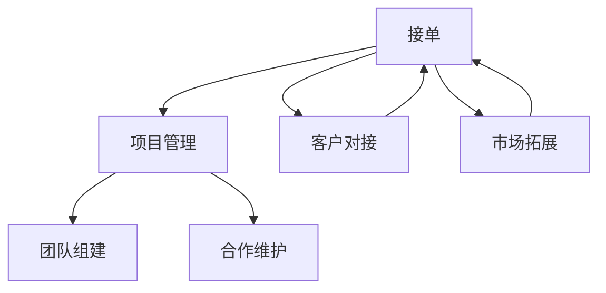

                 

# 技术外包：从接单到建立团队

> 关键词：技术外包,接单,建立团队,项目管理,软件开发,技术合作

## 1. 背景介绍

### 1.1 问题由来

在当今高速发展的科技行业中，技术外包已成为一种重要的商业模式。随着全球化进程的加速，企业越来越倾向于通过技术外包来获取所需的技术资源，以降低成本、加速产品开发和提高竞争力。这一趋势在软件开发、数据分析、云计算等领域尤为显著。

然而，随着外包市场的逐渐成熟，技术外包企业也面临着诸多挑战。如何高效接单，合理管理项目，构建并维护一个高效稳定的团队，成为技术外包企业成长的关键。本文将详细介绍从接单到建立团队的全流程，探讨如何通过系统化的管理和专业化的合作，提升技术外包企业的竞争力。

### 1.2 问题核心关键点

技术外包从接单到建立团队，涉及多个关键环节，包括市场拓展、客户对接、项目管理、团队组建和合作维护。以下是对这些环节的简要概述：

- **市场拓展**：识别潜在客户，制定市场推广策略，提升品牌知名度和市场份额。
- **客户对接**：与客户建立有效的沟通渠道，了解需求，评估项目价值，达成合作协议。
- **项目管理**：制定详细的项目计划，分配任务，监控项目进度，确保按时交付。
- **团队组建**：根据项目需求，招募和选拔合适的技术人员，组建高效协作的团队。
- **合作维护**：建立良好的客户关系，处理客户反馈，确保长期合作和口碑积累。

掌握这些关键环节的策略和方法，将有助于技术外包企业实现高效接单和稳定发展。

## 2. 核心概念与联系

### 2.1 核心概念概述

为更好地理解技术外包的全流程，本节将介绍几个核心概念及其联系：

- **技术外包(Outsourcing)**：将技术任务或项目外包给第三方技术团队，由其承担研发、测试、运维等环节。这种模式可以帮助企业降低成本，加速产品上市，同时专注于核心业务。
- **接单(Acquisition)**：寻找并获取客户项目，与客户签订合同，明确项目要求和报酬。接单是技术外包企业成长的基础。
- **项目管理(Project Management)**：规划、执行和监控项目进展的过程，确保项目按时、按质、按预算完成。
- **团队组建(Team Building)**：根据项目需求，招募和选拔合适的人员，组建高效的团队，实现最佳人力配置。
- **合作维护(Cooperation Maintenance)**：通过持续沟通和反馈机制，维护良好的客户关系，确保合作长期稳定。

这些概念之间存在紧密的联系，从接单开始，通过项目管理、团队组建和合作维护，最终实现技术外包的目标。以下是一个简化的Mermaid流程图，展示了这些概念之间的联系：



该图展示了技术外包全流程的关键环节及其相互关系。接单后，通过项目管理、团队组建和合作维护，确保项目顺利完成并提升客户满意度。

## 3. 核心算法原理 & 具体操作步骤

### 3.1 算法原理概述

技术外包的核心算法原理主要包括接单、项目管理、团队组建和合作维护四个方面。每个环节都有其独特的算法原理和技术细节，但它们共同构成了一个整体的工作流程。

- **接单算法**：通过搜索引擎优化(SEO)、社交媒体营销、行业展会参与等方式，提升品牌知名度和市场曝光率，吸引潜在客户。接单算法还包括客户需求分析，以确定项目的可行性。
- **项目管理算法**：采用敏捷开发、Scrum、Kanban等项目管理方法，通过计划、执行、监控和评估，确保项目按时交付。
- **团队组建算法**：根据项目需求，筛选和招聘合适的技术人员，通过面试、测试等方式评估候选人的技能和适应性。
- **合作维护算法**：建立持续沟通机制，定期汇报项目进展，及时处理客户反馈，通过持续改进提升客户满意度。

### 3.2 算法步骤详解

以下详细介绍每个关键环节的算法步骤：

#### 3.2.1 接单算法

1. **市场拓展**：
   - 通过搜索引擎优化(SEO)提升网站可见性，吸引潜在客户。
   - 参加行业展会和活动，建立品牌影响力。
   - 利用社交媒体和线上广告扩大市场覆盖面。
   - 开发在线平台，提供项目展示和案例展示。

2. **客户对接**：
   - 通过邮件、电话、线上会议等方式与潜在客户建立联系。
   - 了解客户需求和项目背景，明确项目目标和要求。
   - 提供初步的报价和方案，进行需求分析和项目评估。
   - 与客户达成合作协议，签订合同。

#### 3.2.2 项目管理算法

1. **项目规划**：
   - 制定详细的项目计划，包括时间表、任务分配、资源配置。
   - 使用项目管理工具（如JIRA、Trello等）进行任务跟踪和进度监控。
   - 设立里程碑，定期评估项目进展，调整计划以应对变化。

2. **任务执行**：
   - 根据项目计划，分配任务给团队成员。
   - 使用版本控制系统（如Git）管理代码和文档。
   - 采用敏捷开发方法（如Scrum）进行迭代开发，定期回顾和改进。

3. **监控和评估**：
   - 使用指标（如进度、质量、成本等）监控项目进展。
   - 定期进行项目评审，识别风险和问题。
   - 及时调整计划，确保项目按时交付。

#### 3.2.3 团队组建算法

1. **需求分析**：
   - 根据项目需求，列出所需技能和技术栈。
   - 明确项目的复杂性和技术挑战，评估所需人力和时间。

2. **招聘和选拔**：
   - 在招聘网站上发布职位信息，吸引候选人。
   - 通过简历筛选、面试、测试等方式评估候选人的技能和经验。
   - 筛选出最合适的候选人，进行团队组建。

3. **团队协作**：
   - 设立明确的角色和职责，确保团队成员各司其职。
   - 使用协作工具（如Slack、Confluence等）促进团队沟通和协作。
   - 定期进行团队建设活动，提升团队凝聚力和协作效率。

#### 3.2.4 合作维护算法

1. **持续沟通**：
   - 定期与客户进行沟通，了解项目进展和需求变化。
   - 使用项目管理工具（如JIRA）记录和跟踪客户反馈。
   - 及时处理客户提出的问题和需求，确保项目顺利推进。

2. **反馈机制**：
   - 建立反馈机制，定期收集客户对项目和服务的评价。
   - 根据客户反馈进行持续改进，提升服务质量和客户满意度。
   - 通过客户推荐和口碑营销，吸引新客户。

### 3.3 算法优缺点

技术外包的算法具有以下优点：

1. **成本效益**：通过外包，企业可以降低人力成本和运营成本，加速产品上市。
2. **灵活性**：外包企业可以根据项目需求快速组建团队，灵活应对市场变化。
3. **专业性**：外包企业通常具备专业的项目管理经验和技能，提升项目成功率。

同时，技术外包也存在一些缺点：

1. **沟通难度**：客户和外包团队之间可能存在沟通障碍，影响项目进展。
2. **质量控制**：外包团队的工作质量和效率可能无法完全达到客户预期。
3. **合作风险**：长期合作可能面临合同纠纷和信任问题，需要建立稳定的合作关系。

### 3.4 算法应用领域

技术外包的算法广泛应用于软件开发、数据分析、云计算、人工智能等多个领域。以下是几个典型应用场景：

- **软件开发**：为大型企业提供定制软件开发和系统集成服务。
- **数据分析**：为客户提供数据清洗、分析和可视化服务，提升业务决策效率。
- **云计算**：提供云基础设施建设、云应用开发和云运维服务，支持企业数字化转型。
- **人工智能**：提供AI模型训练、部署和维护服务，提升企业智能化水平。

技术外包的算法不仅适用于单一项目，还适用于长期合作和系统集成，为不同领域的企业提供全方位的技术支持。

## 4. 数学模型和公式 & 详细讲解 & 举例说明

### 4.1 数学模型构建

为了更好地理解技术外包的算法，本节将构建一个简化的数学模型。该模型假设技术外包企业在一个固定的时间段内（如一个月）接单、项目管理、团队组建和合作维护，以提升客户满意度和市场份额。

设 $P$ 为一个月内项目管理的成功概率，$T$ 为一个月内团队组建的成功概率，$C$ 为一个月内客户对接的成功概率，$S$ 为一个月内接单的成功概率。模型目标为最大化客户满意度 $S$，同时考虑管理成本和团队成本，建立以下优化模型：

$$
\max S = P \times T \times C \times S
$$

### 4.2 公式推导过程

1. **项目管理成功概率**：
   - 项目管理成功概率 $P$ 取决于项目计划、执行、监控和评估的有效性。
   - 使用敏捷开发方法，设置里程碑和定期评审，可以提升项目管理成功率。

2. **团队组建成功概率**：
   - 团队组建成功概率 $T$ 取决于需求分析、招聘和选拔的有效性。
   - 采用高效的招聘平台和科学的人才评估方法，可以提升团队组建成功率。

3. **客户对接成功概率**：
   - 客户对接成功概率 $C$ 取决于市场拓展、客户分析和销售策略的有效性。
   - 通过SEO、社交媒体和线上广告等渠道，可以提升客户对接成功率。

4. **接单成功概率**：
   - 接单成功概率 $S$ 取决于品牌知名度、市场曝光率和客户对接的有效性。
   - 使用SEO和社交媒体提升品牌知名度，吸引潜在客户。

### 4.3 案例分析与讲解

假设一个技术外包企业一个月内成功接单的概率为 $S=0.8$，项目管理成功概率 $P=0.9$，团队组建成功概率 $T=0.7$，客户对接成功概率 $C=0.85$。则总客户满意度为：

$$
S = P \times T \times C \times S = 0.9 \times 0.7 \times 0.85 \times 0.8 = 0.5085
$$

这意味着在一个月内，该企业能够实现客户满意度的提升，同时控制管理成本和团队成本。通过持续优化这些关键环节，技术外包企业可以不断提升市场竞争力和客户满意度。

## 5. 项目实践：代码实例和详细解释说明

### 5.1 开发环境搭建

在进行技术外包的实践前，需要准备好开发环境。以下是使用Python进行Flask开发的环境配置流程：

1. 安装Python：
   - 从官网下载并安装Python 3.x版本。
   - 确保Python环境配置正确，能够正常运行。

2. 安装Flask：
   - 使用pip安装Flask框架，命令为 `pip install Flask`。

3. 创建Flask应用：
   - 创建Python脚本文件，编写Flask应用代码。
   - 在代码中引入Flask模块，并创建应用实例。
   - 编写路由函数，处理HTTP请求和响应。

4. 运行Flask应用：
   - 在命令行中运行Python脚本，启动Flask应用。
   - 使用浏览器访问应用地址，测试API接口。

### 5.2 源代码详细实现

以下是一个简单的Flask应用示例，用于模拟技术外包企业的接单、项目管理、团队组建和合作维护功能：

```python
from flask import Flask, request, jsonify
app = Flask(__name__)

# 接单接口
@app.route('/acquisition', methods=['POST'])
def acquisition():
    data = request.json
    # 解析客户需求
    client_id = data['client_id']
    project_name = data['project_name']
    project_description = data['project_description']
    # 处理接单逻辑
    acquired = acquire_project(client_id, project_name, project_description)
    return jsonify({'acquired': acquired})

# 项目管理接口
@app.route('/project_management', methods=['POST'])
def project_management():
    data = request.json
    # 解析项目管理数据
    project_id = data['project_id']
    # 处理项目管理逻辑
    manage_project(project_id)
    return jsonify({'managed': True})

# 团队组建接口
@app.route('/team_building', methods=['POST'])
def team_building():
    data = request.json
    # 解析团队组建数据
    team_id = data['team_id']
    team_members = data['team_members']
    # 处理团队组建逻辑
    build_team(team_id, team_members)
    return jsonify({'built': True})

# 合作维护接口
@app.route('/maintenance', methods=['POST'])
def maintenance():
    data = request.json
    # 解析合作维护数据
    client_id = data['client_id']
    # 处理合作维护逻辑
    maintain_relationship(client_id)
    return jsonify({'maintained': True})

if __name__ == '__main__':
    app.run(debug=True)
```

### 5.3 代码解读与分析

这个Flask应用示例简要实现了技术外包企业的核心功能。具体解读如下：

**接单接口**：
- 定义一个POST接口 `"/acquisition"`，用于处理接单请求。
- 从请求中解析客户ID、项目名称和描述，并调用 `acquire_project` 函数处理接单逻辑。
- 返回接单结果的JSON格式响应。

**项目管理接口**：
- 定义一个POST接口 `"/project_management"`，用于处理项目管理请求。
- 从请求中解析项目ID，并调用 `manage_project` 函数处理项目管理逻辑。
- 返回项目管理结果的JSON格式响应。

**团队组建接口**：
- 定义一个POST接口 `"/team_building"`，用于处理团队组建请求。
- 从请求中解析团队ID和成员列表，并调用 `build_team` 函数处理团队组建逻辑。
- 返回团队组建结果的JSON格式响应。

**合作维护接口**：
- 定义一个POST接口 `"/maintenance"`，用于处理合作维护请求。
- 从请求中解析客户ID，并调用 `maintain_relationship` 函数处理合作维护逻辑。
- 返回合作维护结果的JSON格式响应。

这个示例应用通过Flask框架，实现了接单、项目管理、团队组建和合作维护的核心功能。开发者可以根据实际需求，进一步扩展和优化这些功能，提升技术外包企业的管理效率和客户满意度。

## 6. 实际应用场景

### 6.1 软件开发

在软件开发项目中，技术外包企业可以提供定制软件开发、系统集成和云应用开发服务。通过接单、项目管理、团队组建和合作维护的全流程管理，确保项目按时交付，提升客户满意度。

具体应用场景包括：
- 为企业开发定制化管理软件，如ERP系统、CRM系统等。
- 提供云应用开发服务，帮助企业快速上线云应用。
- 提供系统集成服务，帮助企业整合不同系统和平台。

### 6.2 数据分析

在数据分析项目中，技术外包企业可以提供数据清洗、分析和可视化服务，提升企业的数据分析和决策能力。

具体应用场景包括：
- 为企业提供数据分析服务，帮助其挖掘数据中的潜在价值。
- 提供数据可视化服务，帮助企业直观展示数据分析结果。
- 提供数据清洗服务，帮助企业处理和清洗海量数据。

### 6.3 云计算

在云计算项目中，技术外包企业可以提供云基础设施建设、云应用开发和云运维服务，支持企业数字化转型。

具体应用场景包括：
- 提供云基础设施建设服务，帮助企业构建云平台。
- 提供云应用开发服务，帮助企业开发云应用。
- 提供云运维服务，帮助企业维护和管理云应用。

### 6.4 人工智能

在人工智能项目中，技术外包企业可以提供AI模型训练、部署和维护服务，提升企业智能化水平。

具体应用场景包括：
- 为企业提供AI模型训练服务，帮助其构建智能应用。
- 提供AI模型部署服务，帮助企业在生产环境中部署和运行模型。
- 提供AI模型维护服务，帮助企业监控和管理模型性能。

## 7. 工具和资源推荐

### 7.1 学习资源推荐

为了帮助开发者系统掌握技术外包的理论基础和实践技巧，这里推荐一些优质的学习资源：

1. **《软件工程：原理与实践》**：这是一本经典的计算机科学教材，详细介绍了软件工程的基本原理和实践方法，包括项目管理、团队协作等核心内容。
2. **Coursera《软件工程与设计》课程**：由斯坦福大学教授讲解的软件工程课程，涵盖了软件开发和项目管理的基本理论和实践技巧。
3. **Udemy《项目管理实战》课程**：Udemy平台上的一门项目管理实战课程，通过实际案例讲解项目管理的基本方法和工具。
4. **《敏捷项目管理》书籍**：介绍敏捷开发方法和项目管理实践的书籍，适合从事软件开发和项目管理的人员阅读。
5. **《团队协作之道》书籍**：介绍团队协作和沟通技巧的书籍，适合技术外包企业管理人员阅读。

通过学习这些资源，相信你一定能够全面掌握技术外包的理论基础和实践技巧，提升企业的管理效率和客户满意度。

### 7.2 开发工具推荐

高效的开发离不开优秀的工具支持。以下是几款用于技术外包开发的常用工具：

1. **JIRA**：项目管理工具，支持敏捷开发和Scrum管理，方便任务跟踪和进度监控。
2. **Git**：版本控制系统，支持代码管理和协作开发，是技术外包企业必备的工具。
3. **Slack**：团队协作工具，支持即时通讯和文件共享，提升团队沟通效率。
4. **Confluence**：文档管理工具，支持文档共享和协作编辑，方便团队知识共享。
5. **Zoom**：视频会议工具，支持高清视频和音频通话，方便远程协作和客户对接。

合理利用这些工具，可以显著提升技术外包开发和管理的效率，加快创新迭代的步伐。

### 7.3 相关论文推荐

技术外包的研究源于学界的持续研究。以下是几篇奠基性的相关论文，推荐阅读：

1. **"软件工程：现代原则和实践"（P.H. Lä+-°,s et al.）**：全面介绍了软件工程的基本原理和实践方法，是软件开发和项目管理的重要参考。
2. **"项目管理基础"（Kathleen D. Eisenhardt）**：介绍了项目管理的基本概念和工具，适合技术外包企业管理人员阅读。
3. **"敏捷开发：概念与实践"（Alistair Cockburn）**：介绍了敏捷开发的基本方法和工具，适合技术外包企业项目管理人员阅读。
4. **"团队协作之道"（Robert C. Sutton）**：介绍了团队协作和沟通技巧，适合技术外包企业团队成员阅读。
5. **"项目管理过程"（Neville Johnson）**：介绍了项目管理的详细过程和工具，适合技术外包企业项目管理人员阅读。

这些论文代表了大规模技术外包的研究进展，通过学习这些前沿成果，可以帮助研究者把握学科前进方向，激发更多的创新灵感。

## 8. 总结：未来发展趋势与挑战

### 8.1 研究成果总结

本文对技术外包从接单到建立团队的全流程进行了系统介绍，详细讲解了每个关键环节的算法原理和具体操作步骤。通过这些步骤，技术外包企业可以高效接单、合理管理项目、构建并维护高效稳定的团队，提升客户满意度和市场竞争力。

### 8.2 未来发展趋势

展望未来，技术外包的发展趋势主要包括以下几个方面：

1. **技术融合**：技术外包将与人工智能、大数据等前沿技术深度融合，提升企业的智能化和数字化水平。
2. **自动化和智能化**：技术外包将采用自动化和智能化工具，提升项目管理、团队协作和客户维护的效率。
3. **全球化**：技术外包将面向全球市场，拓展业务范围，提升国际化竞争力。
4. **可持续发展**：技术外包将更加注重环境保护和可持续发展，实现绿色转型。
5. **人机协作**：技术外包将更加注重人机协作，提升员工的满意度和工作效率。

### 8.3 面临的挑战

尽管技术外包已经取得了一定的进展，但在迈向更加智能化、普适化应用的过程中，仍面临诸多挑战：

1. **沟通难度**：客户和外包团队之间可能存在沟通障碍，影响项目进展。
2. **质量控制**：外包团队的工作质量和效率可能无法完全达到客户预期。
3. **合作风险**：长期合作可能面临合同纠纷和信任问题，需要建立稳定的合作关系。
4. **人才短缺**：技术外包企业可能面临人才短缺和技能不足的问题，影响项目的顺利实施。
5. **技术更新**：技术外包企业需要持续跟进技术更新和市场变化，保持竞争力。

### 8.4 研究展望

未来的技术外包研究需要在以下几个方面寻求新的突破：

1. **自动化和智能化工具**：开发更加自动化和智能化的项目管理、团队协作和客户维护工具，提升效率和质量。
2. **人机协作机制**：建立更加高效的人机协作机制，提升员工的满意度和工作效率。
3. **全球化市场拓展**：拓展全球市场，提升技术外包企业的国际化竞争力。
4. **可持续发展**：注重环境保护和可持续发展，实现绿色转型。
5. **跨学科研究**：结合计算机科学、经济学、社会学等跨学科知识，提升技术外包研究的深度和广度。

这些研究方向将为技术外包企业带来新的突破，帮助其更好地应对挑战，实现高效接单和稳定发展。

## 9. 附录：常见问题与解答

**Q1：如何提升技术外包企业的客户满意度？**

A: 提升客户满意度是技术外包企业成长的关键。以下是一些提升客户满意度的策略：
1. 建立良好的客户关系，定期沟通客户需求和反馈。
2. 提供高质量的项目交付，确保项目按时、按质、按预算完成。
3. 采用敏捷开发方法，提升项目管理效率和质量。
4. 建立持续改进机制，及时处理客户反馈和问题。

**Q2：如何构建高效稳定的技术外包团队？**

A: 构建高效稳定的团队是技术外包企业的核心竞争力。以下是一些构建高效团队的方法：
1. 根据项目需求，招募和选拔合适的技术人员。
2. 明确团队成员的角色和职责，确保各司其职。
3. 使用协作工具（如Slack、Confluence）促进团队沟通和协作。
4. 定期进行团队建设活动，提升团队凝聚力和协作效率。

**Q3：如何应对技术外包中的沟通障碍？**

A: 应对沟通障碍是技术外包企业需要重视的问题。以下是一些应对策略：
1. 建立清晰的沟通机制，明确沟通渠道和频率。
2. 使用项目管理工具（如JIRA）记录和跟踪沟通内容。
3. 定期召开会议，及时解决沟通问题。
4. 建立信任和合作关系，提升沟通效率和效果。

**Q4：如何提升技术外包企业的市场竞争力？**

A: 提升市场竞争力是技术外包企业的长远目标。以下是一些提升竞争力的策略：
1. 注重技术更新和市场变化，持续跟进行业前沿。
2. 拓展全球市场，提升国际化竞争力。
3. 开发自动化和智能化工具，提升效率和质量。
4. 注重环境保护和可持续发展，实现绿色转型。

通过以上策略，技术外包企业可以提升市场竞争力和客户满意度，实现稳定发展和长期成功。

---

作者：禅与计算机程序设计艺术 / Zen and the Art of Computer Programming

