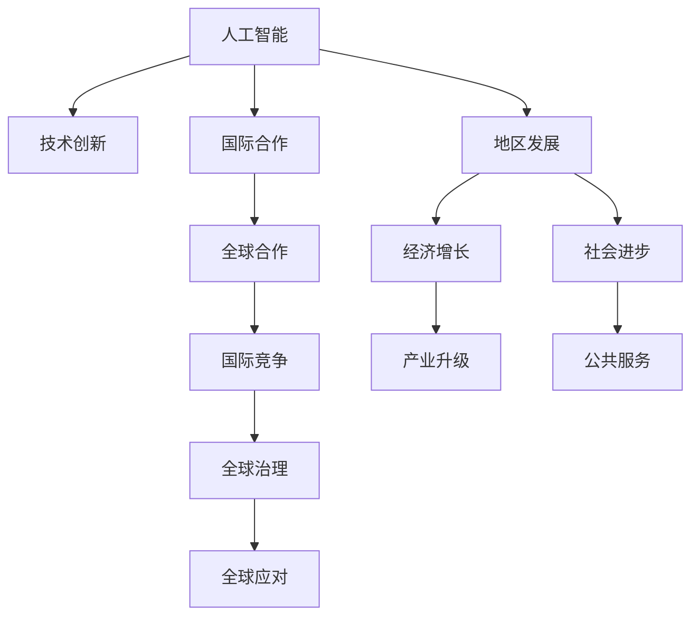

                 

## 1. 背景介绍

### 1.1 问题由来

在当今全球化的时代，技术的进步不仅改变了我们的工作和生活方式，也促进了全球经济的发展和文化的交流。尤其是在IT领域，技术的进步已经深刻影响了各个国家和地区的发展，从地区性的创新到国际性的合作，这一进程正在加速推进。在这样一个背景下，我们有必要深入探讨技术进步如何帮助一个地区实现经济和社会发展的飞跃，以及如何通过技术合作推动全球的共同进步。

### 1.2 问题核心关键点

在信息技术领域，核心技术创新和发展已经成为推动经济社会进步的关键驱动力。无论是云计算、大数据、人工智能还是区块链，这些技术的突破和应用正在重塑各个行业，提升生产效率，改变商业模式。特别是人工智能技术，通过机器学习、深度学习等先进算法，已经在语音识别、图像处理、自然语言处理等众多领域取得了显著的成果，成为推动科技进步和社会发展的重要力量。

然而，尽管人工智能技术在不断进步，但其在实际应用中仍然面临诸多挑战，如数据隐私保护、算法透明性、模型偏见等。这些问题不仅需要技术上的创新来解决，更需要跨学科、跨领域的合作，共同推动技术进步与社会责任的平衡。

### 1.3 问题研究意义

技术进步不仅是经济发展的引擎，更是社会进步的动力。通过深入研究技术如何在不同地区和国际舞台上发挥作用，可以更好地理解技术创新的价值，推动全球经济和社会的共同进步。

1. **技术赋能**：技术进步可以为地区经济发展提供新的动力，推动产业升级和就业结构优化。
2. **社会进步**：技术创新可以改善公共服务，提升教育、医疗等领域的效率和质量。
3. **国际合作**：技术的全球化应用可以促成国际间的技术合作与交流，共同应对全球性挑战。
4. **伦理与责任**：在全球化进程中，需要思考技术的伦理问题和社会责任，确保技术进步不会带来负面影响。

## 2. 核心概念与联系

### 2.1 核心概念概述

为更好地理解技术进步对地区和国际舞台的影响，本节将介绍几个密切相关的核心概念：

- **人工智能**：通过机器学习、深度学习等技术，使计算机具备了理解、学习、推理等人类智能的基本能力。
- **技术创新**：引入新技术、新方法和新产品，推动产业发展和商业模式变革的过程。
- **地区发展**：通过技术创新，促进特定地区经济社会发展，提升其国际竞争力。
- **国际合作**：通过技术交流和合作，推动全球技术进步和共同发展。
- **伦理与责任**：技术进步带来的社会伦理问题，如隐私保护、算法透明性等。

这些核心概念之间的逻辑关系可以通过以下Mermaid流程图来展示：



这个流程图展示了一系列核心概念之间的逻辑关系：

1. 人工智能技术通过技术创新推动地区发展。
2. 地区发展带来经济增长和社会进步，提升国际竞争力。
3. 国际合作进一步推动全球技术进步和共同发展。
4. 伦理与责任问题需要全球共同应对，确保技术进步的正能量。

这些概念共同构成了技术进步的宏观框架，为理解技术在地区和国际舞台上的作用提供了理论依据。

## 3. 核心算法原理 & 具体操作步骤
### 3.1 算法原理概述

人工智能技术，特别是机器学习和大数据技术，已经成为推动社会进步和经济发展的关键力量。在技术进步的过程中，算法原理和技术操作是实现技术创新的核心环节。

在人工智能领域，核心算法包括监督学习、无监督学习、强化学习等，这些算法通过学习数据集中的模式和规律，实现对复杂任务的自动化处理。例如，在自然语言处理领域，监督学习算法通过训练大规模的文本数据，使得计算机具备理解语言的能力；在图像处理领域，深度学习算法通过学习图像特征，实现图像分类、识别等任务。

### 3.2 算法步骤详解

人工智能技术的应用通常包括以下关键步骤：

1. **数据准备**：收集、清洗和标注训练数据，为算法的训练提供基础。
2. **模型选择**：根据任务特点选择合适的算法和模型结构。
3. **模型训练**：利用标注数据训练模型，调整模型参数，优化模型性能。
4. **模型评估**：在测试数据上评估模型性能，确保模型泛化能力。
5. **模型部署**：将训练好的模型部署到实际应用中，进行持续优化。

### 3.3 算法优缺点

人工智能技术在推动地区和国际舞台的发展过程中，具有以下优点：

1. **高效性**：自动化处理复杂任务，提升效率和精度。
2. **可扩展性**：通过大数据和云计算，支持大规模分布式计算。
3. **创新性**：推动技术创新，实现新业务模式和新产品。

同时，也存在一些局限性：

1. **数据隐私**：算法依赖大量数据，可能侵犯用户隐私。
2. **算法透明性**：复杂模型难以解释，可能存在“黑盒”问题。
3. **模型偏见**：算法可能继承数据中的偏见，导致不公平。

### 3.4 算法应用领域

人工智能技术已经广泛应用于各个领域，以下是几个典型应用场景：

- **医疗**：通过图像识别和自然语言处理，辅助医生诊断疾病，提升医疗效率。
- **金融**：利用机器学习算法进行风险评估、智能投顾等，提高金融服务水平。
- **零售**：通过客户数据分析和推荐系统，提升销售效率和客户体验。
- **制造业**：利用预测模型和优化算法，提升生产效率和质量控制。
- **教育**：通过智能教育平台和学习分析，提供个性化教育服务。

## 4. 数学模型和公式 & 详细讲解 & 举例说明

### 4.1 数学模型构建

人工智能算法通常基于数学模型构建，以下是几个典型的数学模型：

1. **线性回归模型**：用于预测连续型变量，模型表达式为 $y = \theta_0 + \theta_1 x_1 + \theta_2 x_2 + ... + \theta_n x_n$。
2. **逻辑回归模型**：用于分类任务，模型表达式为 $P(y=1 | x) = \sigma(\theta_0 + \theta_1 x_1 + \theta_2 x_2 + ... + \theta_n x_n)$。
3. **卷积神经网络(CNN)**：用于图像处理，通过卷积层、池化层和全连接层等组成，模型表达式为 $y = \sigma(\theta * x + b)$。

### 4.2 公式推导过程

以线性回归模型为例，推导其最小二乘法求解过程：

1. **目标函数**：最小化预测值与真实值之间的误差，目标函数为 $J(\theta) = \frac{1}{2m} \sum_{i=1}^m (y_i - \theta_0 - \theta_1 x_{i1} - \theta_2 x_{i2} - ... - \theta_n x_{in})^2$。
2. **梯度下降**：求解 $\theta$ 使得目标函数最小化，即 $\nabla_{\theta} J(\theta) = 0$。
3. **求解过程**：利用矩阵运算求解 $\theta$，得到 $\theta = (X^T X)^{-1} X^T Y$，其中 $X$ 为数据特征矩阵，$Y$ 为真实值向量。

### 4.3 案例分析与讲解

以医疗领域的图像识别为例，讨论如何利用机器学习算法提升诊断准确性：

1. **数据准备**：收集大量医疗影像数据，并进行标注。
2. **模型选择**：选择适当的卷积神经网络模型。
3. **模型训练**：在标注数据上训练模型，调整卷积核大小、池化层数量等参数。
4. **模型评估**：在测试数据上评估模型准确性，使用混淆矩阵、ROC曲线等指标。
5. **模型部署**：将训练好的模型集成到医疗影像分析系统中，实时提供诊断建议。

## 5. 项目实践：代码实例和详细解释说明
### 5.1 开发环境搭建

在进行项目实践前，我们需要准备好开发环境。以下是使用Python进行TensorFlow开发的环境配置流程：

1. 安装Anaconda：从官网下载并安装Anaconda，用于创建独立的Python环境。

2. 创建并激活虚拟环境：
```bash
conda create -n tf-env python=3.8 
conda activate tf-env
```

3. 安装TensorFlow：根据CUDA版本，从官网获取对应的安装命令。例如：
```bash
conda install tensorflow -c conda-forge -c pytorch -c anaconda
```

4. 安装各类工具包：
```bash
pip install numpy pandas scikit-learn matplotlib tqdm jupyter notebook ipython
```

完成上述步骤后，即可在`tf-env`环境中开始项目实践。

### 5.2 源代码详细实现

下面我以医疗影像分类任务为例，给出使用TensorFlow进行卷积神经网络训练的代码实现。

首先，定义数据处理函数：

```python
import tensorflow as tf
from tensorflow.keras import layers

def prepare_data(data_path, batch_size):
    # 读取和预处理数据
    train_dataset = tf.data.Dataset.from_tensor_slices(
        (tf.image.decode_jpeg(tf.io.read_file(data_path)), tf.string_split([tf.io.read_file(data_path)]))
    )
    train_dataset = train_dataset.map(lambda img, label: (img, tf.strings.to_number(label, out_type=tf.int32)))
    train_dataset = train_dataset.shuffle(buffer_size=10000).batch(batch_size)
    return train_dataset
```

然后，定义模型和优化器：

```python
def build_model(input_shape, num_classes):
    model = tf.keras.Sequential([
        layers.Conv2D(32, (3, 3), activation='relu', input_shape=input_shape),
        layers.MaxPooling2D((2, 2)),
        layers.Conv2D(64, (3, 3), activation='relu'),
        layers.MaxPooling2D((2, 2)),
        layers.Conv2D(128, (3, 3), activation='relu'),
        layers.MaxPooling2D((2, 2)),
        layers.Flatten(),
        layers.Dense(128, activation='relu'),
        layers.Dense(num_classes, activation='softmax')
    ])
    optimizer = tf.keras.optimizers.Adam()
    return model, optimizer
```

接着，定义训练和评估函数：

```python
def train_epoch(model, dataset, batch_size, epochs, optimizer):
    model.compile(optimizer=optimizer, loss='sparse_categorical_crossentropy', metrics=['accuracy'])
    model.fit(dataset, epochs=epochs)
    
def evaluate(model, dataset, batch_size):
    model.evaluate(dataset, verbose=0)
```

最后，启动训练流程并在测试集上评估：

```python
epochs = 10
batch_size = 32

input_shape = (128, 128, 3)
num_classes = 5

train_dataset = prepare_data(train_data_path, batch_size)
test_dataset = prepare_data(test_data_path, batch_size)

model, optimizer = build_model(input_shape, num_classes)

train_epoch(model, train_dataset, batch_size, epochs, optimizer)

evaluate(model, test_dataset, batch_size)
```

以上就是使用TensorFlow对医疗影像分类任务进行卷积神经网络微调的完整代码实现。可以看到，得益于TensorFlow的强大封装，我们可以用相对简洁的代码完成卷积神经网络的训练。

### 5.3 代码解读与分析

让我们再详细解读一下关键代码的实现细节：

**prepare_data函数**：
- 定义了一个数据处理函数，用于读取和预处理医疗影像数据，生成TensorFlow的Dataset对象。

**build_model函数**：
- 定义了一个卷积神经网络模型，包括卷积层、池化层和全连接层等组件。

**train_epoch函数**：
- 使用TensorFlow的Sequential模型搭建卷积神经网络，编译模型，指定优化器和损失函数。
- 在训练数据集上调用fit方法，训练模型。

**evaluate函数**：
- 在测试数据集上调用evaluate方法，评估模型性能。

**训练流程**：
- 定义总训练轮数和批大小，开始循环迭代。
- 每个epoch内，先在训练集上训练，输出模型性能。
- 在测试集上评估，给出最终测试结果。

可以看到，TensorFlow框架使得卷积神经网络的微调代码实现变得简洁高效。开发者可以将更多精力放在数据处理、模型改进等高层逻辑上，而不必过多关注底层的实现细节。

当然，工业级的系统实现还需考虑更多因素，如模型的保存和部署、超参数的自动搜索、更灵活的任务适配层等。但核心的微调范式基本与此类似。

## 6. 实际应用场景
### 6.1 智能医疗系统

基于卷积神经网络的医疗影像分类技术，可以广泛应用于智能医疗系统的构建。传统医疗影像分析需要大量专业医师的参与，耗费时间和人力，且诊断精度难以保证。而使用卷积神经网络进行医疗影像分类，可以自动分析影像，快速、准确地识别疾病。

在技术实现上，可以收集大量标注的医疗影像数据，将其作为监督数据，对卷积神经网络进行微调。微调后的网络可以自动识别影像中的病变区域，并标注对应的疾病类别。对于新发现的医疗影像，系统能够自动分析并给出诊断建议，辅助医生进行诊断和治疗决策。

### 6.2 金融风险预测

金融领域需要实时监测市场风险，以便及时做出应对措施，规避潜在风险。传统的风险评估方法依赖专家经验和手动分析，成本高、效率低，且存在主观偏见。基于卷积神经网络的金融风险预测技术，可以为金融领域提供更为客观、高效的风险预测服务。

具体而言，可以收集金融市场的历史数据，包括股票价格、汇率、宏观经济指标等。将数据作为输入，使用卷积神经网络进行特征提取和分析，预测市场变化趋势和风险等级。将微调后的网络应用于实时抓取的市场数据，能够实时预测市场波动，提供预警信息，帮助金融机构规避风险。

### 6.3 智慧交通系统

智慧交通系统需要实时监测交通状况，提供高效、安全的交通服务。传统交通管理依赖人工监控和手动调度，难以应对复杂多变的交通情况。基于卷积神经网络的交通监控技术，可以自动识别交通标志、车辆和行人，提供实时交通数据和预测信息。

在技术实现上，可以部署多台监控摄像头，收集交通视频数据，对视频进行分析和处理。使用卷积神经网络对视频帧进行特征提取，识别出交通标志、车辆和行人，并进行分类和跟踪。将微调后的网络应用于实时交通监控，能够提供实时的交通状况报告，帮助交通管理部门做出决策。

### 6.4 未来应用展望

随着卷积神经网络技术的不断发展，其在实际应用中将会展现出更加广泛的前景。

在智慧医疗领域，基于卷积神经网络的医疗影像分类和分析技术，将进一步提升诊断的准确性和效率，辅助医生进行精准诊疗。

在智能交通领域，基于卷积神经网络的交通监控和分析技术，将提升交通管理的智能化水平，提高交通安全性。

在金融领域，基于卷积神经网络的金融风险预测技术，将为金融市场提供更加精准的风险预警和分析服务。

此外，在智慧城市治理、智能制造、智能零售等多个领域，基于卷积神经网络的技术应用将不断涌现，为经济社会发展提供新的动力。

## 7. 工具和资源推荐
### 7.1 学习资源推荐

为了帮助开发者系统掌握卷积神经网络技术，这里推荐一些优质的学习资源：

1. 《深度学习》书籍：Ian Goodfellow等著，全面介绍了深度学习的原理和应用，是深度学习领域的经典教材。
2. CS231n《卷积神经网络》课程：斯坦福大学开设的计算机视觉课程，涵盖了卷积神经网络的理论和实践，适合初学者和进阶者。
3. Kaggle竞赛平台：提供了大量真实场景下的卷积神经网络应用案例，帮助开发者在实战中提升技能。
4. TensorFlow官方文档：提供了丰富的卷积神经网络样例和API文档，是TensorFlow新手的必备资料。
5. PyTorch官方文档：提供了详细的卷积神经网络教程和代码实现，适合需要快速迭代的研究者。

通过对这些资源的学习实践，相信你一定能够快速掌握卷积神经网络技术的精髓，并用于解决实际的NLP问题。

### 7.2 开发工具推荐

高效的开发离不开优秀的工具支持。以下是几款用于卷积神经网络微调开发的常用工具：

1. TensorFlow：由Google主导开发的深度学习框架，生产部署方便，适合大规模工程应用。
2. PyTorch：基于Python的开源深度学习框架，灵活动态的计算图，适合快速迭代研究。
3. Keras：高层次的神经网络API，易于使用，支持多种后端，如TensorFlow、Theano等。
4. Weights & Biases：模型训练的实验跟踪工具，可以记录和可视化模型训练过程中的各项指标，方便对比和调优。
5. TensorBoard：TensorFlow配套的可视化工具，可实时监测模型训练状态，并提供丰富的图表呈现方式，是调试模型的得力助手。

合理利用这些工具，可以显著提升卷积神经网络微调任务的开发效率，加快创新迭代的步伐。

### 7.3 相关论文推荐

卷积神经网络技术的发展源于学界的持续研究。以下是几篇奠基性的相关论文，推荐阅读：

1. ImageNet Classification with Deep Convolutional Neural Networks：提出卷积神经网络，为计算机视觉任务提供了强大的模型基础。
2. AlexNet：在ImageNet大规模图像识别竞赛中夺冠，展示了卷积神经网络在实际应用中的巨大潜力。
3. ResNet：提出残差连接，解决了深层网络训练中的梯度消失问题，提升了卷积神经网络的深度。
4. DenseNet：提出密集连接，进一步提升了卷积神经网络的特征复用能力，提高了网络效率和准确性。
5. InceptionNet：提出Inception模块，增强了卷积神经网络的多尺度特征提取能力，提升了网络性能。

这些论文代表了大规模卷积神经网络技术的发展脉络。通过学习这些前沿成果，可以帮助研究者把握学科前进方向，激发更多的创新灵感。

## 8. 总结：未来发展趋势与挑战
### 8.1 总结

本文对卷积神经网络技术在地区和国际舞台上的应用进行了全面系统的介绍。首先阐述了卷积神经网络技术在推动地区和国际舞台发展中的重要作用，明确了其在经济、社会、国际合作等多个领域的应用价值。其次，从原理到实践，详细讲解了卷积神经网络的数学模型和关键步骤，给出了卷积神经网络微调的完整代码实例。同时，本文还广泛探讨了卷积神经网络技术在智能医疗、金融风险预测、智慧交通等众多领域的应用前景，展示了其巨大潜力。此外，本文精选了卷积神经网络技术的各类学习资源，力求为读者提供全方位的技术指引。

通过本文的系统梳理，可以看到，卷积神经网络技术在推动地区和国际舞台发展中扮演了重要角色，其高效性、可扩展性和创新性使得其在多个领域得到了广泛应用。未来，伴随技术的不断进步和应用的深入，卷积神经网络技术将会在更广泛的场景中发挥重要作用，推动全球经济和社会的共同进步。

### 8.2 未来发展趋势

展望未来，卷积神经网络技术将呈现以下几个发展趋势：

1. **模型规模扩大**：随着算力成本的下降和数据规模的扩张，卷积神经网络模型的参数量将继续增大，深度和宽度进一步增加，实现更复杂的任务。
2. **分布式计算**：随着数据量的增加，卷积神经网络模型将需要更强的计算能力和更高的分布式计算能力，以满足大规模任务的需求。
3. **迁移学习**：通过迁移学习，在预训练大模型的基础上进行微调，可以实现参数高效、计算高效的网络，加速新任务的开发。
4. **多模态融合**：卷积神经网络不仅适用于图像处理，还可以与其他模态数据结合，实现多模态数据融合，提升数据利用效率。
5. **自监督学习**：通过自监督学习，利用无标签数据训练卷积神经网络，降低对标注数据的依赖，实现更高效的模型训练。

以上趋势凸显了卷积神经网络技术的广阔前景。这些方向的探索发展，必将进一步提升卷积神经网络系统的性能和应用范围，为全球经济和社会的发展提供新的动力。

### 8.3 面临的挑战

尽管卷积神经网络技术已经取得了显著成果，但在迈向更加智能化、普适化应用的过程中，它仍面临诸多挑战：

1. **数据需求**：卷积神经网络依赖大量标注数据，对于特定任务，获取高质量标注数据的成本较高。
2. **计算资源**：大规模卷积神经网络模型的计算资源消耗巨大，硬件设施的限制成为制约因素。
3. **泛化能力**：卷积神经网络在面对不同数据分布时，泛化能力有待提升，模型容易过拟合。
4. **模型解释**：卷积神经网络的决策过程复杂，难以解释，缺乏可解释性。
5. **伦理问题**：卷积神经网络可能继承数据中的偏见，导致不公平，需关注模型伦理问题。

### 8.4 研究展望

面对卷积神经网络技术所面临的挑战，未来的研究需要在以下几个方面寻求新的突破：

1. **数据增强**：通过数据增强技术，提升数据多样性，降低过拟合风险。
2. **迁移学习**：利用预训练模型和迁移学习技术，降低对标注数据的依赖，提升模型的泛化能力。
3. **知识蒸馏**：通过知识蒸馏技术，将复杂模型的知识转移给简单模型，提升模型的效率和泛化能力。
4. **可解释性**：通过模型压缩、可视化等方法，提升卷积神经网络的可解释性，确保模型决策的透明性。
5. **伦理保障**：引入伦理导向的评估指标，过滤和惩罚有偏见、有害的输出倾向，确保模型公平性。

这些研究方向的探索，必将引领卷积神经网络技术迈向更高的台阶，为全球经济和社会的发展提供新的动力。

## 9. 附录：常见问题与解答

**Q1：卷积神经网络是否适用于所有计算机视觉任务？**

A: 卷积神经网络在计算机视觉领域具有广泛的应用，但其适用于某些特定任务，如图像分类、目标检测等，而对于如人脸识别、姿态估计等任务，需要针对性的改进。

**Q2：卷积神经网络在实际应用中如何处理尺寸不一致的图像？**

A: 对于尺寸不一致的图像，通常通过调整图像大小和进行填充来实现统一尺寸。可以使用卷积神经网络中的自适应池化层(Average Pooling)或最大池化层(Max Pooling)进行处理。

**Q3：如何优化卷积神经网络的计算效率？**

A: 优化计算效率的方法包括：
1. 数据增强：通过旋转、翻转等方式扩充训练集。
2. 迁移学习：利用预训练模型，减少从头训练所需的时间和数据。
3. 模型压缩：使用知识蒸馏、剪枝等方法，减小模型参数量。
4. 分布式计算：使用分布式训练框架，提升计算效率。

**Q4：卷积神经网络在处理多尺度图像时如何表现？**

A: 卷积神经网络在处理多尺度图像时，通常通过多尺度卷积层和金字塔池化层等方法，同时捕捉不同尺度的特征，提高模型的泛化能力。

**Q5：卷积神经网络在实际应用中如何处理光照变化和阴影等问题？**

A: 通过数据增强技术，如随机色彩抖动、光照变化等，可以在训练过程中增加数据多样性，提高模型鲁棒性。

---

作者：禅与计算机程序设计艺术 / Zen and the Art of Computer Programming

