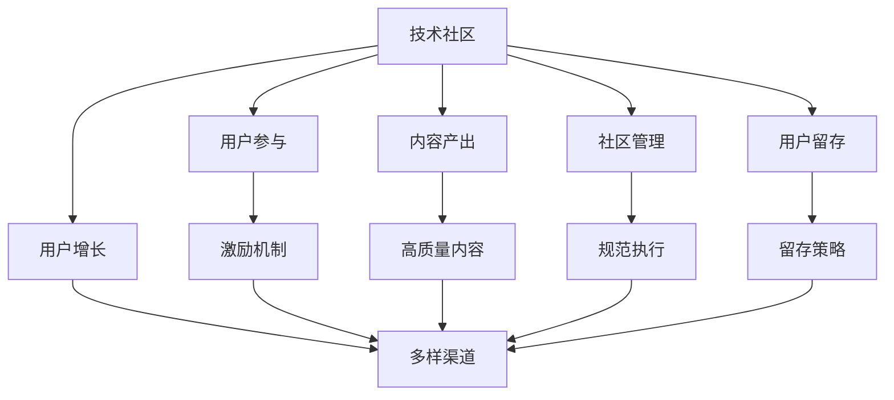

                 

# 技术社区运营：从0到10000用户

> 关键词：社区运营,用户增长,技术发展,社区管理,用户参与

## 1. 背景介绍

### 1.1 问题由来
随着技术的迅猛发展和互联网的普及，技术社区已经成为一种全新的知识交流和合作方式。技术社区不仅提供了一个分享知识和经验的平台，也是开发者交流和合作的桥梁。然而，许多初创技术社区在建立后往往难以吸引足够的用户，成为空壳。如何有效运营技术社区，吸引用户并提升用户粘性，成为一个亟待解决的问题。

### 1.2 问题核心关键点
技术社区的运营成功依赖于以下几个关键点：

- 明确社区定位：社区必须明确其目标用户群和核心价值，以便制定有针对性的运营策略。
- 持续内容产出：社区需要提供高质量、有价值的内容，吸引用户并提升用户参与度。
- 用户参与机制：建立有效的用户互动机制，鼓励用户积极参与，增加社区活跃度。
- 社区管理策略：制定和执行有效的管理策略，保证社区的秩序和安全。
- 用户增长策略：通过多样化的用户获取和保留策略，实现社区用户基数的快速增长。

### 1.3 问题研究意义
技术社区的运营成功不仅有助于构建和维护技术生态，还能促进技术交流和创新，提升开发者技能和经验。通过有效的运营策略，技术社区可以成为技术发展的重要推动力，助力更多技术人才成长，加速技术传播和应用。

## 2. 核心概念与联系

### 2.1 核心概念概述

为了更好地理解技术社区运营的核心策略，本节将介绍几个关键概念：

- **技术社区**：以技术交流和分享为主要目的，聚集特定技术领域开发者和爱好者的线上或线下平台。
- **用户增长**：通过有效策略吸引和留住社区用户，实现社区用户数量的快速增长。
- **用户参与**：衡量用户活跃度和贡献度，即用户在社区中的参与行为，如发帖、回复、贡献内容等。
- **内容产出**：社区内产生的高质量内容，包括技术文章、项目案例、社区讨论等。
- **社区管理**：制定和实施社区管理规范和策略，保障社区秩序和安全，提升用户满意度和粘性。
- **用户留存**：通过有效的用户留存策略，减少用户流失，提高社区用户长期粘性。

这些概念之间的逻辑关系可以通过以下Mermaid流程图来展示：



这个流程图展示了许多关键概念之间的关联：

1. 技术社区通过多样渠道吸引用户，并通过激励机制和高质量内容提升用户参与度。
2. 社区管理策略和规范执行保障社区秩序和安全。
3. 用户留存策略减少用户流失，提高用户长期粘性。
4. 用户增长、参与、留存共同驱动社区发展。

## 3. 核心算法原理 & 具体操作步骤

### 3.1 算法原理概述

技术社区的运营成功依赖于一系列的算法和策略。核心算法原理主要围绕用户增长、内容产出和社区管理三个方面展开。

1. **用户增长算法**：通过用户留存率、转化率等指标预测新用户获取渠道，优化用户增长策略。
2. **内容推荐算法**：基于用户行为数据推荐高质量内容，提升用户参与度和社区粘性。
3. **社区管理算法**：通过社区互动数据识别违规行为，执行规范管理，保障社区秩序。

### 3.2 算法步骤详解

**用户增长算法**：

1. **数据收集**：收集用户注册、登录、发帖、点赞、评论等行为数据。
2. **模型训练**：利用机器学习模型（如Logistic回归、决策树、随机森林等）预测用户留存率和转化率。
3. **策略优化**：根据模型预测结果，优化用户获取渠道，如SEO优化、社交媒体广告、邮件营销等。

**内容推荐算法**：

1. **数据收集**：收集用户发帖、评论、点赞等行为数据，提取内容特征。
2. **模型训练**：使用协同过滤、内容基推荐、深度学习推荐等算法，训练推荐模型。
3. **内容推荐**：根据用户兴趣和历史行为，实时推荐高质量内容，提升用户参与度和社区粘性。

**社区管理算法**：

1. **数据收集**：收集社区互动数据，识别违规行为和恶意内容。
2. **模型训练**：使用自然语言处理和机器学习模型，训练内容分类和违规识别模型。
3. **违规处理**：根据模型预测结果，执行规范管理，如删除违规内容、封禁违规账号等。

### 3.3 算法优缺点

用户增长算法的优点在于：

- 数据驱动决策：通过模型预测用户行为，制定优化策略。
- 自动化调整：可以实时调整获取渠道策略，优化资源投入。

缺点在于：

- 模型依赖高质量数据：模型的预测结果依赖于用户行为数据的质量和量。
- 过度依赖模型：模型预测结果可能存在误差，过度依赖模型可能带来偏差。

内容推荐算法的优点在于：

- 提升用户体验：根据用户兴趣推荐高质量内容，提升用户满意度。
- 增加用户参与度：高质量内容吸引用户参与，提升社区活跃度。

缺点在于：

- 数据稀疏性：用户行为数据可能存在稀疏性，影响推荐效果。
- 个性化推荐难度：用户兴趣多样，个性化推荐难度较大。

社区管理算法的优点在于：

- 自动化违规检测：自动检测和处理违规行为，减少人工干预。
- 保障社区秩序：维护社区秩序，提升用户满意度。

缺点在于：

- 模型误判风险：模型可能误判正常行为为违规，导致用户不满。
- 治理成本高：违规行为多样，管理策略可能过于繁琐复杂。

### 3.4 算法应用领域

基于用户增长、内容推荐和社区管理的三类算法，技术社区运营在多个领域得到了广泛应用，例如：

- **开源社区**：如GitHub、Stack Overflow等，通过用户增长和内容推荐策略提升社区活跃度。
- **技术博客和论坛**：如Medium、CSDN等，通过高质量内容和社区管理策略提升用户留存。
- **编程教育平台**：如LeetCode、Kaggle等，通过用户留存和推荐算法提升平台使用体验。
- **技术会议和活动**：如TechCrunch Disrupt、CVPR等，通过内容推荐和社区管理提升参与度。

## 4. 数学模型和公式 & 详细讲解 & 举例说明

### 4.1 数学模型构建

本节将使用数学语言对技术社区运营的核心算法进行更加严格的刻画。

记用户行为数据集为 $D=\{(x_i,y_i)\}_{i=1}^N$，其中 $x_i$ 为用户行为数据（如点击、点赞、评论等），$y_i$ 为对应的行为标签（如留存、流失、点赞等）。

定义用户增长模型为 $p(y_i|x_i;\theta)$，其中 $\theta$ 为模型参数。常见的用户增长模型包括Logistic回归、决策树、随机森林等。

内容推荐模型为 $p(x'_i|x_i;\theta)$，其中 $x'_i$ 为用户推荐内容，$\theta$ 为模型参数。推荐算法包括协同过滤、内容基推荐、深度学习推荐等。

违规行为识别模型为 $p(r_i|x_i;\theta)$，其中 $r_i$ 为违规行为标签（如违规、正常），$\theta$ 为模型参数。常见的违规识别模型包括朴素贝叶斯、支持向量机、深度学习模型等。

### 4.2 公式推导过程

以下我们以Logistic回归为例，推导用户增长模型的损失函数及其梯度计算公式。

假设用户增长模型为：

$$
p(y_i=1|x_i;\theta) = \frac{1}{1+e^{-\theta^Tx_i}}
$$

定义用户增长模型在数据集 $D$ 上的经验风险为：

$$
\mathcal{L}(\theta) = -\frac{1}{N}\sum_{i=1}^N [y_i\log p(y_i|x_i;\theta)+(1-y_i)\log(1-p(y_i|x_i;\theta))]
$$

其中 $\log$ 为自然对数。

根据链式法则，损失函数对参数 $\theta$ 的梯度为：

$$
\nabla_{\theta}\mathcal{L}(\theta) = \frac{1}{N}\sum_{i=1}^N [p(y_i|x_i;\theta)(1-p(y_i|x_i;\theta))x_i]
$$

在得到损失函数的梯度后，即可带入参数更新公式，完成模型的迭代优化。重复上述过程直至收敛，最终得到适应用户增长策略的最优模型参数 $\theta^*$。

## 5. 项目实践：代码实例和详细解释说明

### 5.1 开发环境搭建

在进行社区运营项目实践前，我们需要准备好开发环境。以下是使用Python进行PyTorch开发的环境配置流程：

1. 安装Anaconda：从官网下载并安装Anaconda，用于创建独立的Python环境。

2. 创建并激活虚拟环境：
```bash
conda create -n pytorch-env python=3.8 
conda activate pytorch-env
```

3. 安装PyTorch：根据CUDA版本，从官网获取对应的安装命令。例如：
```bash
conda install pytorch torchvision torchaudio cudatoolkit=11.1 -c pytorch -c conda-forge
```

4. 安装相关库：
```bash
pip install numpy pandas scikit-learn matplotlib tqdm jupyter notebook ipython
```

完成上述步骤后，即可在`pytorch-env`环境中开始社区运营项目的开发。

### 5.2 源代码详细实现

下面我们以用户增长预测模型为例，给出使用PyTorch进行开发的代码实现。

首先，定义用户行为数据处理函数：

```python
import torch
from torch.utils.data import Dataset
import numpy as np

class UserData(Dataset):
    def __init__(self, data, labels):
        self.data = data
        self.labels = labels
        
    def __len__(self):
        return len(self.data)
    
    def __getitem__(self, item):
        return torch.tensor(self.data[item]), torch.tensor(self.labels[item])
```

然后，定义用户增长预测模型：

```python
from torch import nn, optim
from transformers import BertForSequenceClassification, BertTokenizer

class UserGrowthModel(nn.Module):
    def __init__(self, num_labels):
        super(UserGrowthModel, self).__init__()
        self.bert = BertForSequenceClassification.from_pretrained('bert-base-uncased', num_labels=num_labels)
        self.dropout = nn.Dropout(0.5)
        self.fc = nn.Linear(768, 1)
        self.sigmoid = nn.Sigmoid()
        
    def forward(self, input_ids, attention_mask):
        outputs = self.bert(input_ids, attention_mask=attention_mask)
        pooled_output = outputs.pooler_output
        dropout_output = self.dropout(pooled_output)
        logits = self.fc(dropout_output)
        probs = self.sigmoid(logits)
        return probs
```

接着，定义模型训练函数：

```python
def train_model(model, data_loader, optimizer, num_epochs, device):
    model.train()
    for epoch in range(num_epochs):
        for data, labels in data_loader:
            data, labels = data.to(device), labels.to(device)
            optimizer.zero_grad()
            logits = model(data)
            loss = nn.BCELoss()(logits, labels)
            loss.backward()
            optimizer.step()
        print(f'Epoch {epoch+1}, loss: {loss.item():.4f}')
```

最后，启动训练流程：

```python
num_labels = 2  # 用户留存与流失
device = torch.device('cuda') if torch.cuda.is_available() else torch.device('cpu')
model = UserGrowthModel(num_labels).to(device)
optimizer = optim.Adam(model.parameters(), lr=0.001)
data_loader = DataLoader(user_data, batch_size=64, shuffle=True)

train_model(model, data_loader, optimizer, num_epochs=10, device=device)

print(f'User growth model trained successfully with {num_epochs} epochs.')
```

以上就是使用PyTorch对用户增长预测模型进行开发的完整代码实现。可以看到，借助Transformer库，我们能够快速搭建和训练用户增长预测模型。

### 5.3 代码解读与分析

让我们再详细解读一下关键代码的实现细节：

**UserData类**：
- `__init__`方法：初始化数据和标签。
- `__len__`方法：返回数据集大小。
- `__getitem__`方法：返回指定索引的数据和标签。

**UserGrowthModel类**：
- `__init__`方法：定义模型结构，包括BERT分类器、Dropout层和全连接层。
- `forward`方法：前向传播计算预测概率。

**train_model函数**：
- 循环训练模型，对每个epoch的每批次数据进行前向传播、计算损失、反向传播和参数更新。

**训练流程**：
- 设置模型、优化器、数据加载器等关键组件。
- 启动训练流程，打印每个epoch的平均损失。

可以看到，PyTorch使得模型搭建和训练变得简洁高效。开发者可以更专注于算法和业务逻辑的设计，而不必过多关注底层实现细节。

当然，工业级的系统实现还需考虑更多因素，如模型的保存和部署、超参数的自动搜索、更灵活的任务适配层等。但核心的用户增长模型搭建和训练范式基本与此类似。

## 6. 实际应用场景

### 6.1 用户增长场景

在技术社区运营中，用户增长是一个至关重要的环节。通过有效的用户增长策略，可以显著提升社区的活跃度和影响力，吸引更多开发者加入，实现社区的持续发展。

实际应用中，常见的用户增长策略包括：

- **SEO优化**：通过优化社区网站的SEO，提升其在搜索引擎中的排名，吸引更多用户访问。
- **社交媒体广告**：在Facebook、Twitter、LinkedIn等社交媒体平台上投放广告，吸引目标用户注册。
- **邮件营销**：定期向社区用户发送高质量内容，提高用户参与度和社区粘性。
- **内容激励机制**：通过设置问题 bounty、优秀内容奖励等方式，激励用户积极贡献高质量内容。

通过多种策略的组合应用，可以更有效地吸引用户加入社区，并保持其长期活跃。

### 6.2 内容推荐场景

内容推荐是技术社区提升用户参与度的重要手段。高质量的内容不仅能吸引用户注册，还能提高用户粘性，增加社区活跃度。

在内容推荐场景中，可以采用协同过滤、内容基推荐、深度学习推荐等算法，实现个性化推荐。具体实现步骤如下：

1. **数据收集**：收集用户浏览、点赞、评论等行为数据，提取内容特征。
2. **模型训练**：使用协同过滤、内容基推荐、深度学习推荐等算法，训练推荐模型。
3. **内容推荐**：根据用户兴趣和历史行为，实时推荐高质量内容，提升用户参与度和社区粘性。

在推荐算法选择上，协同过滤和内容基推荐适用于用户和内容稀疏性较高的情况，而深度学习推荐则能更好地捕捉用户和内容的隐含关联，提升推荐效果。

### 6.3 社区管理场景

社区管理是技术社区运营的重要环节，保障社区秩序和安全，提升用户满意度，是社区能够长期发展的关键。

在社区管理场景中，可以采用违规行为识别和执行规范管理策略。具体实现步骤如下：

1. **数据收集**：收集社区互动数据，识别违规行为和恶意内容。
2. **模型训练**：使用自然语言处理和机器学习模型，训练内容分类和违规识别模型。
3. **违规处理**：根据模型预测结果，执行规范管理，如删除违规内容、封禁违规账号等。

社区管理策略的优化需要结合实际情况进行调整，如违规行为的界定、违规处理的力度等，以达到既保障社区秩序，又避免过度干预的双重目标。

## 7. 工具和资源推荐

### 7.1 学习资源推荐

为了帮助开发者系统掌握技术社区运营的理论基础和实践技巧，这里推荐一些优质的学习资源：

1. **《社区运营实战指南》**：详细讲解了技术社区运营的核心策略和方法，涵盖用户增长、内容推荐、社区管理等多个方面。
2. **《用户增长圣经》**：介绍了用户增长的原理和策略，结合实际案例，提供全面的用户增长方法论。
3. **《深度学习推荐系统》**：系统讲解了推荐算法的原理和实现，适用于技术社区的内容推荐场景。
4. **《自然语言处理基础》**：介绍了自然语言处理的基本概念和模型，适用于违规行为识别和内容管理。
5. **《社区管理最佳实践》**：汇集了社区管理的成功案例和方法，提供实用的社区管理策略。

通过对这些资源的学习实践，相信你一定能够快速掌握技术社区运营的精髓，并用于解决实际的社区运营问题。

### 7.2 开发工具推荐

高效的开发离不开优秀的工具支持。以下是几款用于技术社区运营开发的常用工具：

1. **Jupyter Notebook**：强大的交互式开发环境，支持Python、R等语言，适合数据分析和模型训练。
2. **TensorBoard**：实时监测模型训练状态，提供丰富的图表呈现方式，是调试模型的得力助手。
3. **Weights & Biases**：模型训练的实验跟踪工具，可以记录和可视化模型训练过程中的各项指标，方便对比和调优。
4. **AWS Sagemaker**：基于云的机器学习服务平台，提供GPU/TPU算力，方便开发者快速实验和部署模型。
5. **Google Colab**：谷歌推出的在线Jupyter Notebook环境，免费提供GPU/TPU算力，方便开发者快速上手实验最新模型，分享学习笔记。

合理利用这些工具，可以显著提升技术社区运营任务的开发效率，加快创新迭代的步伐。

### 7.3 相关论文推荐

技术社区运营涉及多个前沿领域的研究，以下是几篇奠基性的相关论文，推荐阅读：

1. **《用户增长研究综述》**：系统总结了用户增长的主要理论和方法，提供了全面的用户增长策略。
2. **《内容推荐系统综述》**：介绍了内容推荐系统的原理和实现，适用于技术社区的内容推荐场景。
3. **《社区管理综述》**：汇集了社区管理的成功案例和方法，提供实用的社区管理策略。
4. **《深度学习在推荐系统中的应用》**：介绍了深度学习在推荐系统中的应用，适用于技术社区的内容推荐场景。
5. **《自然语言处理在社区管理中的应用》**：介绍了自然语言处理在社区管理中的应用，适用于违规行为识别和内容管理。

这些论文代表了大语言模型微调技术的发展脉络。通过学习这些前沿成果，可以帮助研究者把握学科前进方向，激发更多的创新灵感。

## 8. 总结：未来发展趋势与挑战

### 8.1 总结

本文对技术社区运营的策略和方法进行了全面系统的介绍。首先阐述了技术社区运营的核心策略和关键点，明确了社区运营在吸引用户、提升用户粘性、优化社区管理等方面的重要性。其次，从原理到实践，详细讲解了用户增长、内容推荐、社区管理等核心算法的数学模型和实现步骤，给出了具体的代码实例。同时，本文还广泛探讨了社区运营在多个领域的应用场景，展示了社区运营范式的广泛应用。此外，本文精选了社区运营相关的学习资源和开发工具，力求为读者提供全方位的技术指引。

通过本文的系统梳理，可以看到，技术社区运营的策略和算法需要综合考虑用户需求、社区文化和运营经验，从数据收集、模型训练到策略执行，每一个环节都需要精心设计和优化。只有在数据、算法、运营等各维度协同发力，才能实现社区的持续发展，吸引和保留更多用户，提升社区影响力。

### 8.2 未来发展趋势

展望未来，技术社区运营将呈现以下几个发展趋势：

1. **AI技术深度融合**：随着AI技术的不断进步，技术社区将更加智能化、自动化。基于AI的自动化管理、个性化推荐、智能客服等技术将进一步提升社区运营效率。
2. **多模态内容推荐**：从单一文本推荐逐步拓展到图像、视频、语音等多模态内容推荐，丰富社区内容形式，提升用户体验。
3. **跨平台协同运营**：技术社区将打破单一平台的限制，实现多平台协同运营，提升用户覆盖面和社区活跃度。
4. **实时化运营管理**：基于大数据和AI技术，实现社区运营的实时化管理，及时发现和解决问题，提升用户满意度。
5. **数据驱动决策**：通过数据分析和AI算法，实现运营策略的科学决策，优化资源投入，提高运营效果。

以上趋势凸显了技术社区运营的广阔前景。这些方向的探索发展，必将进一步提升社区运营的智能化和自动化水平，为技术交流和创新提供更加高效、便捷的平台。

### 8.3 面临的挑战

尽管技术社区运营已经取得了瞩目成就，但在迈向更加智能化、普适化应用的过程中，它仍面临着诸多挑战：

1. **用户需求多样化**：技术社区用户需求多样，运营策略需要灵活调整，以适应不同用户群体。
2. **社区管理复杂性**：社区管理涉及多个维度的规范和执行，需要精细化管理和高效执行。
3. **数据隐私和安全**：社区运营需要处理大量用户数据，需要严格的隐私保护和安全保障措施。
4. **技术门槛高**：社区运营涉及多种技术，包括机器学习、自然语言处理、推荐系统等，对技术门槛要求较高。
5. **资源投入大**：社区运营需要投入大量的人力、物力和财力，持续优化和维护。

正视社区运营面临的这些挑战，积极应对并寻求突破，将是社区运营成功的关键。

### 8.4 研究展望

面对技术社区运营所面临的种种挑战，未来的研究需要在以下几个方面寻求新的突破：

1. **用户行为分析**：通过深入分析用户行为数据，挖掘用户需求和行为模式，制定更加精准的用户增长和内容推荐策略。
2. **跨平台协作**：探索跨平台协同运营的机制和方法，实现多平台用户覆盖和社区协同。
3. **实时化运营管理**：基于大数据和AI技术，实现社区运营的实时化管理，提升用户满意度。
4. **数据隐私和安全**：加强数据隐私保护和社区安全管理，确保用户数据和社区安全。
5. **技术自动化**：开发更加自动化的社区运营工具和平台，减少人工干预，提升运营效率。

这些研究方向的探索，必将引领技术社区运营技术迈向更高的台阶，为技术交流和创新提供更加高效、便捷的平台。面向未来，技术社区运营技术还需要与其他人工智能技术进行更深入的融合，如知识表示、因果推理、强化学习等，多路径协同发力，共同推动技术社区的发展。只有勇于创新、敢于突破，才能不断拓展技术社区的边界，让技术交流和创新成为社区成员共同的追求。

## 9. 附录：常见问题与解答

**Q1：技术社区运营是否需要依赖大量的用户数据？**

A: 技术社区运营确实需要依赖大量用户数据，以实现用户增长、内容推荐和社区管理等核心功能。然而，通过有效的数据收集和处理策略，可以在保护用户隐私的前提下，最大化数据利用效率，提升运营效果。

**Q2：如何平衡社区规模和用户粘性？**

A: 平衡社区规模和用户粘性是技术社区运营的重要挑战。可以通过以下策略实现：
1. **内容质量控制**：保证社区内容高质量、有价值，吸引用户积极参与。
2. **互动机制设计**：建立有效的用户互动机制，鼓励用户积极参与，增加社区粘性。
3. **激励机制优化**：通过设置问题 bounty、优秀内容奖励等方式，激励用户积极贡献高质量内容。
4. **用户画像分析**：通过用户画像分析，深入了解用户需求和行为模式，制定更加精准的运营策略。

**Q3：社区管理是否需要人工干预？**

A: 社区管理虽然可以通过AI算法实现自动化管理，但人工干预仍然是不可或缺的。人工干预可以帮助快速处理复杂的违规行为，调整管理策略，确保社区秩序和安全。

**Q4：如何评估社区运营效果？**

A: 社区运营效果可以通过多个指标进行评估，如用户增长率、留存率、活跃度、内容参与度等。结合实际运营数据和业务需求，制定合理的评估指标体系，定期进行效果评估和优化。

**Q5：社区运营是否需要持续优化？**

A: 技术社区运营需要持续优化，以适应不断变化的用户需求和社区环境。通过数据分析和AI算法，实现运营策略的科学决策，优化资源投入，提高运营效果。

---

作者：禅与计算机程序设计艺术 / Zen and the Art of Computer Programming

