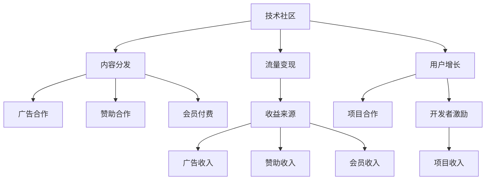

                 

# 技术社区运营：影响力变现

> 关键词：技术社区, 影响力变现, 内容分发, 用户增长, 商业化运营

## 1. 背景介绍

### 1.1 问题由来
在互联网高度发达的今天，技术社区已成为汇聚开发者、工程师、设计师等技术精英的家园。无论是GitHub、Stack Overflow、CSDN，还是开源项目社区，技术社区提供了丰富的技术讨论、知识共享、项目协作等功能，极大地推动了技术交流和创新。然而，技术社区的发展同样面临着商业化的挑战。如何在社区中实现商业变现，同时不损害用户体验和技术氛围，成为社区运营者关注的焦点。

### 1.2 问题核心关键点
为了在技术社区中实现影响力变现，需要解决以下几个关键问题：

- 如何利用社区的流量和内容吸引商业伙伴，实现收益？
- 如何平衡商业化与社区氛围，避免商业操作对社区产生负面影响？
- 如何构建有效的用户增长模型，吸引更多的开发者加入社区？
- 如何整合多种收入来源，形成可持续发展的商业模式？

### 1.3 问题研究意义
实现技术社区的影响力变现，不仅可以为社区带来稳定的资金支持，还能够在吸引人才、拓展项目合作等方面发挥重要作用。这将促进社区的长期健康发展，提升其在全球技术领域的影响力，同时为社区运营者带来丰厚的回报。

## 2. 核心概念与联系

### 2.1 核心概念概述

为更好地理解技术社区的影响力变现策略，本节将介绍几个密切相关的核心概念：

- 技术社区：指由开发者、工程师、设计师等技术精英构成的交流平台，提供技术讨论、知识分享、项目协作等功能。
- 流量变现：指通过汇聚社区的流量，引入广告、赞助、会员等商业合作，实现收益的过程。
- 内容分发：指通过社区平台将高质量内容推送给用户，吸引更多流量和用户参与。
- 用户增长：指通过有效的运营策略和激励机制，吸引更多开发者加入社区，提升社区活跃度和覆盖面。
- 商业化运营：指通过商业模式的构建，实现技术社区的持续发展和收益增长。

这些核心概念之间的逻辑关系可以通过以下Mermaid流程图来展示：



这个流程图展示的技术社区的影响力变现关键环节：

1. 技术社区通过内容分发吸引流量。
2. 流量通过广告、赞助、会员等多种形式变现。
3. 用户增长策略吸引更多开发者加入，提升社区活跃度。
4. 项目合作拓展商业应用，形成多样化的收入来源。

这些概念共同构成了技术社区运营的框架，使其能够有效实现影响力变现，同时保持社区的活力和良性发展。

## 3. 核心算法原理 & 具体操作步骤
### 3.1 算法原理概述

技术社区的影响力变现，本质上是通过有效的内容分发策略，吸引流量和用户，再通过商业模式的构建，将流量和用户变现。其核心思想是：构建高质量的内容体系，通过合理的分发策略，最大化地吸引用户，并通过多种商业化手段实现收益。

形式化地，假设社区中内容总数为 $C$，用户总数为 $U$，广告收入为 $A$，赞助收入为 $S$，会员收入为 $M$，项目收入为 $P$。则影响力变现的目标是最大化这些收入来源，即：

$$
\max \{ A, S, M, P \}
$$

在实践中，我们通常使用以下步骤来实现这一目标：

- 构建高质量的内容体系：通过技术分享、案例分析、开发者访谈等方式，吸引用户关注和参与。
- 设计合理的内容分发策略：利用推荐算法、社区话题等手段，将优质内容推送给目标用户。
- 引入多种商业化手段：广告、赞助、会员、项目合作等，实现多元化的收益来源。
- 实施用户增长策略：通过开发者激励、项目赞助、线上线下活动等方式，吸引更多开发者加入。

### 3.2 算法步骤详解

基于上述核心思想，技术社区的影响力变现过程可以分解为以下步骤：

**Step 1: 构建优质内容**
- 收集和创作高质量的技术内容，包括但不限于技术文章、开源项目、技术培训等。
- 与知名开发者、专家、企业合作，提升内容的专业性和吸引力。

**Step 2: 设计内容分发策略**
- 使用推荐算法（如协同过滤、内容相似性、标签排序等），根据用户兴趣和行为推荐相关内容。
- 开设社区话题、专栏，鼓励用户参与讨论和分享，提升内容的互动性和活跃度。
- 利用数据分析，优化内容分发策略，提升内容的曝光率和用户参与度。

**Step 3: 引入商业化手段**
- 与广告商合作，展示相关产品或服务广告，引入广告收入。
- 引入赞助商支持，通过社区活动或开发者激励等形式，引入赞助收入。
- 提供会员服务，如专业订阅、VIP服务、专属内容等，提升用户黏性和收入。
- 与企业合作，推广开源项目或技术解决方案，引入项目收入。

**Step 4: 实施用户增长策略**
- 提供开发者激励计划，如技术认证、贡献奖励、技术大赛等，吸引更多开发者加入社区。
- 举办线上线下活动，如技术分享会、技术培训、黑客松等，扩大社区的影响力和吸引力。
- 通过社交媒体、邮件营销等方式，推广社区活动和内容，吸引新用户。

### 3.3 算法优缺点

技术社区的影响力变现方法具有以下优点：

1. 多样化收入来源。通过广告、赞助、会员、项目合作等多种形式，实现收益的多样化。
2. 精准的内容分发。推荐算法和社区话题等手段，确保高质量内容精准推送给目标用户。
3. 高效的用户增长。通过开发者激励、线上线下活动等方式，快速吸引更多开发者加入。
4. 可持续的商业模式。社区内容和技术氛围的良性发展，为商业化运营提供了坚实基础。

同时，该方法也存在一定的局限性：

1. 内容制作成本高。高质量内容的制作需要大量人力和技术投入，成本较高。
2. 广告和赞助的效果难以控制。社区商业化操作可能会对社区氛围产生负面影响。
3. 用户忠诚度不高。如果内容分发和商业化操作不当，用户可能流失。
4. 需要持续运营和优化。社区运营需要不断调整策略，以适应市场和技术的变化。

尽管存在这些局限性，但就目前而言，通过内容分发和商业化手段实现影响力变现，仍然是大多数技术社区采用的主流方法。未来相关研究的重点在于如何进一步降低内容制作成本，提高广告和赞助的效果控制，同时兼顾用户增长和技术氛围。

### 3.4 算法应用领域

技术社区的影响力变现方法已经在开源项目、技术培训、技术社区等多个领域得到应用，具体包括：

- 开源项目社区：如GitHub、SourceForge等，通过项目展示、技术分享、开发者激励等手段，实现广告、赞助、会员等多种收入。
- 技术培训平台：如CSDN学院、Coursera等，通过在线课程、技术培训、项目合作等方式，实现商业变现。
- 技术交流平台：如Stack Overflow、知乎等，通过高质量内容的分发和商业化操作，提升平台流量和用户黏性。

除了上述这些经典应用外，技术社区的影响力变现方法还被创新性地应用到更多场景中，如技术博客、开发者社区等，为技术交流和创新提供了新的商业路径。

## 4. 数学模型和公式 & 详细讲解 & 举例说明
### 4.1 数学模型构建

为了更系统地描述技术社区的影响力变现过程，我们建立以下数学模型：

假设社区中内容总数为 $C$，用户总数为 $U$，广告收入为 $A$，赞助收入为 $S$，会员收入为 $M$，项目收入为 $P$。影响变现的目标是最大化这些收入来源。

$$
\max \{ A, S, M, P \}
$$

### 4.2 公式推导过程

以下我们以广告收入为例，推导其计算公式及其与内容分发策略的关系。

广告收入 $A$ 通常由展示次数 $I$ 和点击率 $CVR$ 共同决定，即：

$$
A = I \times CVR
$$

展示次数 $I$ 受内容分发策略的影响，可以通过推荐算法计算：

$$
I = \sum_{c=1}^{C} \sum_{u=1}^{U} f_{cu}(A_u)
$$

其中 $f_{cu}(A_u)$ 为内容 $c$ 在用户 $u$ 上展示的概率，通常与内容的相关性、用户的历史行为等因素有关。

因此，广告收入 $A$ 可以表示为：

$$
A = \sum_{c=1}^{C} \sum_{u=1}^{U} f_{cu}(A_u) \times CVR
$$

### 4.3 案例分析与讲解

以GitHub为例，分析其广告收入的计算方法。

GitHub的广告收入主要由展示次数和点击率决定，展示次数 $I$ 根据内容分发策略计算：

$$
I = \sum_{c=1}^{C} \sum_{u=1}^{U} f_{cu}(A_u)
$$

其中 $f_{cu}(A_u)$ 为内容 $c$ 在用户 $u$ 上展示的概率，GitHub使用协同过滤和内容相似性算法进行推荐，同时根据用户行为进行动态调整。

点击率 $CVR$ 通常由广告内容的相关性、用户的点击行为等因素决定。GitHub通过A/B测试和用户反馈，不断优化广告内容设计，提升点击率。

因此，GitHub的广告收入 $A$ 可以表示为：

$$
A = \sum_{c=1}^{C} \sum_{u=1}^{U} f_{cu}(A_u) \times CVR
$$

通过优化内容和分发策略，GitHub能够最大化广告收入，同时保持社区的活跃度和用户黏性。

## 5. 项目实践：代码实例和详细解释说明
### 5.1 开发环境搭建

在进行影响力变现实践前，我们需要准备好开发环境。以下是使用Python进行Flask开发的环境配置流程：

1. 安装Anaconda：从官网下载并安装Anaconda，用于创建独立的Python环境。

2. 创建并激活虚拟环境：
```bash
conda create -n influence-marketing python=3.8 
conda activate influence-marketing
```

3. 安装Flask：从官网获取Flask库并安装。
```bash
pip install Flask
```

4. 安装相关依赖库：
```bash
pip install pandas numpy requests beautifulsoup4 scikit-learn
```

5. 安装Flask-SQLAlchemy：用于数据库集成。
```bash
pip install flask-sqlalchemy
```

6. 安装Flask-Login：用于用户登录和会话管理。
```bash
pip install flask-login
```

完成上述步骤后，即可在`influence-marketing`环境中开始影响力变现实践。

### 5.2 源代码详细实现

下面我们以社区广告为例，给出使用Flask框架对广告系统进行开发和实现的代码。

首先，定义广告类和用户类：

```python
from flask_login import UserMixin
from werkzeug.security import generate_password_hash, check_password_hash

class Ad:
    def __init__(self, title, url, budget):
        self.title = title
        self.url = url
        self.budget = budget

class User(UserMixin):
    def __init__(self, username, password):
        self.username = username
        self.password = password
```

然后，定义数据库模型和迁移：

```python
from flask_sqlalchemy import SQLAlchemy

db = SQLAlchemy(app)

class User(db.Model):
    id = db.Column(db.Integer, primary_key=True)
    username = db.Column(db.String(80), unique=True, nullable=False)
    password = db.Column(db.String(120), nullable=False)

class Ad(db.Model):
    id = db.Column(db.Integer, primary_key=True)
    title = db.Column(db.String(120), nullable=False)
    url = db.Column(db.String(240), nullable=False)
    budget = db.Column(db.Float, nullable=False)
```

接着，定义用户登录和广告展示逻辑：

```python
from flask import render_template, redirect, url_for, request
from flask_login import login_user, logout_user, login_required

@app.route('/')
def index():
    return render_template('index.html')

@app.route('/login', methods=['GET', 'POST'])
def login():
    if request.method == 'POST':
        username = request.form['username']
        password = request.form['password']
        user = User.query.filter_by(username=username).first()
        if user and check_password_hash(user.password, password):
            login_user(user)
            return redirect(url_for('index'))
        else:
            return render_template('login.html', error='Invalid username or password')
    return render_template('login.html')

@app.route('/logout')
@login_required
def logout():
    logout_user()
    return redirect(url_for('index'))

@app.route('/ads', methods=['GET', 'POST'])
@login_required
def ads():
    if request.method == 'POST':
        title = request.form['title']
        url = request.form['url']
        budget = float(request.form['budget'])
        ad = Ad(title, url, budget)
        db.session.add(ad)
        db.session.commit()
        return redirect(url_for('index'))
    return render_template('ads.html')
```

最后，启动Flask应用：

```python
if __name__ == '__main__':
    app.run(debug=True)
```

以上就是使用Flask框架对社区广告系统进行开发的完整代码实现。可以看到，Flask框架提供了便捷的路由管理和视图处理，使得广告系统的开发和实现变得简洁高效。

### 5.3 代码解读与分析

让我们再详细解读一下关键代码的实现细节：

**User类和Ad类**：
- `UserMixin`：继承自Flask-Login库提供的混合类，自动实现用户身份验证。
- `generate_password_hash`和`check_password_hash`：用于密码的哈希加密和校验。

**数据库模型**：
- 使用Flask-SQLAlchemy库定义用户和广告的模型，并连接数据库。
- `db.Column`：定义模型的字段，并指定数据类型和约束条件。
- `db.Model`：定义模型基类，包含数据库的操作接口。

**用户登录和广告展示逻辑**：
- `@app.route`：定义路由，指定请求方式和处理函数。
- `@login_required`：用于装饰器，确保用户登录后方可访问受保护的页面。
- `request.form`：获取POST请求中的表单数据。
- `db.session.add`：将广告对象添加到数据库。

**Flask应用启动**：
- `app.run`：启动Flask应用，并设置debug模式，方便调试和测试。

通过这些代码实现，我们可以看到，使用Flask框架进行社区广告系统的开发，可以大大降低开发难度和周期。Flask提供了便捷的路由管理、视图处理和用户管理功能，能够快速搭建广告系统，实现流量变现。

当然，实际的广告系统还需要考虑更多因素，如广告投放策略、广告效果分析、广告收入结算等。但核心的广告变现逻辑与上述代码类似，通过构建社区广告系统，社区运营者可以实现基于内容分发和商业化手段的流量变现。

## 6. 实际应用场景
### 6.1 智能问答社区

智能问答社区如知乎、Stack Overflow等，通过高质量内容的提供和有效分发，吸引了大量技术用户。这些社区不仅提供技术交流和知识共享的平台，还通过广告、会员、赞助等多种手段实现收益。

以知乎为例，知乎通过技术分享、问答解答等方式，构建了丰富的内容体系。利用推荐算法和社区话题等手段，知乎能够精准推送高质量内容给目标用户，提升用户活跃度和粘性。同时，知乎通过广告、会员、企业赞助等手段，实现流量变现。

### 6.2 开源项目平台

开源项目平台如GitHub、SourceForge等，通过展示项目、分享代码、协作开发等方式，吸引了大量开发者和技术爱好者。这些平台不仅提供技术交流和合作的平台，还通过广告、赞助、会员等多种手段实现收益。

以GitHub为例，GitHub通过展示开源项目、提供代码仓库和协作工具等方式，吸引了大量开发者加入。利用推荐算法和内容分发策略，GitHub能够精准推送项目和贡献给目标开发者，提升用户活跃度和粘性。同时，GitHub通过广告、会员、企业赞助等手段，实现流量变现。

### 6.3 技术培训平台

技术培训平台如CSDN学院、Coursera等，通过提供技术培训课程、在线学习等方式，吸引了大量技术学习者。这些平台不仅提供技术学习资源，还通过广告、会员、课程收费等多种手段实现收益。

以CSDN学院为例，CSDN学院通过提供高质量的课程和技术培训，吸引了大量技术学习者。利用推荐算法和社区话题等手段，CSDN学院能够精准推送课程和学习资料给目标用户，提升用户活跃度和粘性。同时，CSDN学院通过广告、会员、课程收费等手段，实现流量变现。

### 6.4 未来应用展望

随着技术社区的不断发展，影响力变现方法也在不断演进和创新。未来，技术社区的影响力变现将呈现以下几个发展趋势：

1. 多样化收入来源。除了广告、会员、赞助等传统方式，社区还可以探索新的收入形式，如技术咨询服务、开源项目付费订阅等。
2. 精准的内容分发。通过更先进的推荐算法和数据驱动策略，社区能够更精准地分发高质量内容，提升用户满意度和粘性。
3. 用户参与机制。通过社区治理、用户激励等机制，鼓励用户参与内容创作和社区建设，提升社区的活力和活跃度。
4. 数据驱动的运营决策。通过数据分析和算法优化，社区能够更科学地制定运营策略，提升广告、会员等收入。

这些趋势将使得技术社区的影响力变现更加高效和可持续，为社区运营者带来更丰富的商业价值和用户体验。

## 7. 工具和资源推荐
### 7.1 学习资源推荐

为了帮助开发者系统掌握技术社区的影响力变现理论基础和实践技巧，这里推荐一些优质的学习资源：

1. 《Flask Web Development》：一本全面的Flask开发指南，涵盖路由管理、视图处理、用户管理等核心功能。
2. 《Flask-SQLAlchemy》：Flask-SQLAlchemy库的使用手册，提供便捷的数据库集成功能。
3. 《Flask-Login》：Flask-Login库的使用手册，提供用户身份验证和会话管理功能。
4. 《Flask-PyMySQL》：Flask-PyMySQL库的使用手册，提供数据库操作接口。
5. 《Flask-Admin》：Flask-Admin库的使用手册，提供Web管理界面。

通过对这些资源的学习实践，相信你一定能够快速掌握技术社区的影响力变现精髓，并用于解决实际的社区运营问题。

### 7.2 开发工具推荐

高效的开发离不开优秀的工具支持。以下是几款用于技术社区影响力变现开发的常用工具：

1. Flask：基于Python的轻量级Web框架，灵活高效，适合快速迭代研究。

2. SQLAlchemy：Python的ORM框架，提供便捷的数据库操作接口。

3. Flask-Login：Flask扩展，提供用户身份验证和会话管理功能。

4. Flask-SQLAlchemy：Flask扩展，提供便捷的数据库集成功能。

5. Flask-WTF：Flask扩展，提供表单验证和数据处理功能。

6. Flask-Mail：Flask扩展，提供邮件发送功能。

合理利用这些工具，可以显著提升技术社区的影响力变现任务的开发效率，加快创新迭代的步伐。

### 7.3 相关论文推荐

技术社区的影响力变现研究源于学界的持续研究。以下是几篇奠基性的相关论文，推荐阅读：

1. "A Survey on Social Network Influence Maximization"：综述了影响力传播的算法和模型，为社区影响力变现提供理论基础。

2. "Influence Maximization in Social Networks"：深入研究了社会网络中的影响力最大化问题，提供了多种算法和实现方案。

3. "Social Recommendation Systems: A Survey and Taxonomy"：综述了社交推荐系统的研究和实现，为社区内容分发提供理论支持。

4. "User Growth Strategies in Online Communities"：探讨了在线社区的用户增长策略，提供了多种吸引用户和提升用户黏性的方法。

这些论文代表了大社区影响力变现的研究进展，通过学习这些前沿成果，可以帮助研究者把握学科前进方向，激发更多的创新灵感。

## 8. 总结：未来发展趋势与挑战
### 8.1 总结

本文对技术社区的影响力变现方法进行了全面系统的介绍。首先阐述了技术社区的影响力变现的核心概念和关键问题，明确了社区运营者面临的挑战。其次，从原理到实践，详细讲解了影响力变现的数学模型和关键步骤，给出了社区广告的代码实例和详细解释。同时，本文还广泛探讨了影响力变现方法在智能问答社区、开源项目平台、技术培训平台等多个行业领域的应用前景，展示了其巨大的潜力和优势。此外，本文精选了影响力变现技术的各类学习资源，力求为读者提供全方位的技术指引。

通过本文的系统梳理，可以看到，通过内容分发和商业化手段实现影响力变现，已经成为技术社区的主要运营策略。这些策略不仅提升了社区的流量和用户黏性，还实现了社区的持续发展和商业化运营。未来，伴随技术的不断进步，社区的影响力变现还将迎来更多创新和突破，为社区运营者带来更大的商业价值和用户满意度。

### 8.2 未来发展趋势

展望未来，技术社区的影响力变现将呈现以下几个发展趋势：

1. 内容分发的精准化。通过更先进的推荐算法和数据驱动策略，社区能够更精准地分发高质量内容，提升用户满意度和粘性。
2. 收入来源的多样化。社区可以探索新的收入形式，如技术咨询服务、开源项目付费订阅等，实现更多样化的收益。
3. 用户参与机制的优化。通过社区治理、用户激励等机制，鼓励用户参与内容创作和社区建设，提升社区的活力和活跃度。
4. 数据驱动的运营决策。通过数据分析和算法优化，社区能够更科学地制定运营策略，提升广告、会员等收入。

这些趋势将使得技术社区的影响力变现更加高效和可持续，为社区运营者带来更丰富的商业价值和用户体验。

### 8.3 面临的挑战

尽管技术社区的影响力变现已经取得了显著成就，但在迈向更加智能化、普适化应用的过程中，它仍面临着诸多挑战：

1. 内容制作的成本高。高质量内容的制作需要大量人力和技术投入，成本较高。
2. 广告和赞助的效果难以控制。社区商业化操作可能会对社区氛围产生负面影响。
3. 用户忠诚度不高。如果内容分发和商业化操作不当，用户可能流失。
4. 需要持续运营和优化。社区运营需要不断调整策略，以适应市场和技术的变化。

尽管存在这些挑战，但通过不断的技术创新和运营优化，社区运营者可以在维护良好社区氛围的同时，实现商业变现和用户增长，推动社区的持续发展和繁荣。

### 8.4 研究展望

面对技术社区影响力变现所面临的种种挑战，未来的研究需要在以下几个方面寻求新的突破：

1. 探索无监督和半监督内容分发方法。摆脱对大规模标注数据的依赖，利用自监督学习、主动学习等无监督和半监督范式，最大限度利用非结构化数据，实现更加灵活高效的内容分发。
2. 研究内容创作和分发的协同机制。探索开发者参与内容创作的机制，通过众包、协作等方式，提升内容的质量和多样性，同时保证内容分发的精准性。
3. 引入更多商业化手段。除了广告、会员、赞助等传统方式，社区还可以探索新的商业化手段，如技术咨询服务、开源项目付费订阅等。
4. 优化广告和赞助的投放策略。通过数据分析和算法优化，提高广告和赞助的效果控制，减少对社区氛围的负面影响。
5. 引入更多用户激励机制。通过社区治理、开发者激励等机制，鼓励用户参与内容创作和社区建设，提升社区的活力和活跃度。

这些研究方向的探索，必将引领技术社区的影响力变现技术迈向更高的台阶，为社区运营者带来更大的商业价值和用户满意度。

## 9. 附录：常见问题与解答

**Q1：技术社区如何衡量影响力变现的效果？**

A: 技术社区的影响力变现效果可以通过多种指标进行衡量，包括：

1. 流量指标：如页面访问量、独立访客数、停留时间等，反映社区的吸引力和用户黏性。
2. 广告指标：如广告展示次数、点击率、转化率等，反映广告的效果和收益。
3. 会员指标：如会员数量、订阅率、消费金额等，反映会员服务的收入和用户粘性。
4. 社区参与指标：如内容发布量、评论量、分享量等，反映用户活跃度和参与度。

通过综合分析这些指标，社区运营者可以评估影响力变现的效果，优化运营策略。

**Q2：如何平衡商业化和社区氛围？**

A: 平衡商业化和社区氛围，需要采取以下措施：

1. 严格控制广告质量。选择与社区内容相关的高质量广告，避免低俗、误导性广告对社区氛围产生负面影响。
2. 引入社区审核机制。设立专门的审核团队，对广告和内容进行审核，确保其符合社区规范和价值观。
3. 设置合理的广告位置。将广告和内容分离开来，避免过度商业化，保持社区的纯技术氛围。
4. 用户反馈机制。通过用户反馈，及时调整广告和内容的投放策略，避免对社区产生负面影响。

通过这些措施，社区运营者可以在实现商业化的同时，维护良好的社区氛围和用户体验。

**Q3：如何吸引更多开发者加入社区？**

A: 吸引更多开发者加入社区，可以采取以下策略：

1. 提供高质量的内容。通过技术分享、案例分析、开发者访谈等方式，吸引开发者关注和参与。
2. 提供开发者激励计划。如技术认证、贡献奖励、技术大赛等，激励开发者积极参与社区建设。
3. 举办线上线下活动。如技术分享会、技术培训、黑客松等，扩大社区的影响力和吸引力。
4. 利用社交媒体和邮件营销。通过社交媒体和邮件推广社区活动和内容，吸引更多开发者加入。

通过这些策略，社区运营者可以吸引更多开发者加入，提升社区的活跃度和覆盖面。

**Q4：如何优化广告和赞助的投放策略？**

A: 优化广告和赞助的投放策略，可以采取以下措施：

1. 数据驱动的广告投放。利用数据分析，优化广告的展示位置和频率，提升广告效果。
2. 精准的目标人群定位。通过用户画像和行为分析，精准定位广告的目标人群，提升广告的转化率。
3. 动态的广告投放。根据用户的点击行为和反馈，动态调整广告内容，提升广告的吸引力和转化率。
4. 联合营销策略。与相关企业合作，联合投放广告和活动，提升广告的效果和品牌影响力。

通过这些措施，社区运营者可以优化广告和赞助的投放策略，提高广告效果和收益。

---

作者：禅与计算机程序设计艺术 / Zen and the Art of Computer Programming

