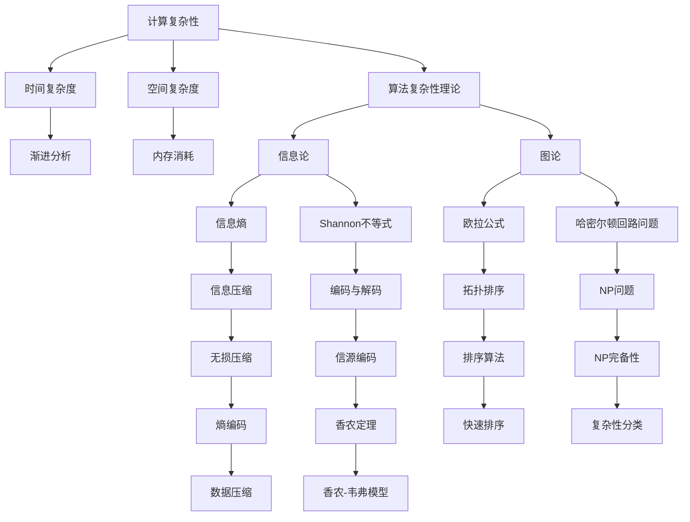

                 

# 拓展认知边界：人类计算的科学探索

> 关键词：人类计算, 科学探索, 认知边界, 计算复杂性, 计算数学, 逻辑计算, 计算机辅助科学, 人工智能发展

## 1. 背景介绍

### 1.1 问题由来

人类历史上的每一次技术革命，往往都伴随着对计算能力极限的突破。从最早的算盘、机械计算器，到电子计算机、互联网，技术的每一次飞跃，都带来了认知边界的显著拓展。尤其是在21世纪，随着人工智能、量子计算等技术的迅猛发展，人类的计算能力进入了一个全新的历史阶段。

人工智能（AI）技术的崛起，尤其是深度学习和神经网络的突破，赋予了计算机强大的学习能力和自主决策能力。然而，面对计算的极限问题，我们亟需更深刻地理解计算的数学原理，为进一步提升AI能力、拓展人类认知边界提供坚实的理论基础。

### 1.2 问题核心关键点

计算的极限问题，可以从以下几个方面来考量：
- 计算复杂性：即一个问题所需的计算资源，通常用时间复杂度和空间复杂度来衡量。复杂性越高的计算问题，所需的计算资源就越多。
- 计算数学：计算复杂性的理论分析需要借助数学模型。算法复杂性理论、信息论、图论等数学工具，是解决计算复杂性问题的重要基础。
- 逻辑计算：计算机的计算本质上是逻辑运算。如何利用逻辑规则，简化问题复杂度，也是计算极限问题研究的重要方向。
- 计算辅助科学：利用计算能力，加速科学研究。如通过模拟实验、数据分析等，发现自然规律，探索未知领域。
- 人工智能发展：计算能力是AI技术发展的核心驱动力。如何提升计算能力，构建更加强大的AI模型，是技术创新的关键。

本文将重点介绍计算极限问题的核心概念，探讨计算数学与逻辑计算的基础原理，以及它们在人工智能发展中的应用。

## 2. 核心概念与联系

### 2.1 核心概念概述

要深入理解计算极限问题，首先需要明确以下几个核心概念：

- **计算复杂性**：表示解决一个问题所需计算资源的量度。一般用时间复杂度和空间复杂度来表示，常用的大O表示法（Big O notation）用于描述算法运行时间或空间需求的增长速率。
- **计算数学**：计算复杂性问题的理论分析离不开数学工具。主要包括算法复杂性理论、信息论、图论等，用于描述和分析计算资源的消耗。
- **逻辑计算**：计算机的计算本质上是逻辑运算。逻辑计算是理解和设计计算系统的基础，可以用于简化复杂问题。
- **计算辅助科学**：利用计算能力，加速科学研究。如通过模拟实验、数据分析等，发现自然规律，探索未知领域。
- **人工智能发展**：计算能力是AI技术发展的核心驱动力。如何提升计算能力，构建更加强大的AI模型，是技术创新的关键。

### 2.2 核心概念原理和架构的 Mermaid 流程图



该图展示了计算复杂性问题的各个关键概念之间的联系。从时间复杂度、空间复杂度、算法复杂性理论到信息论、图论，每一步都是构建计算极限理论的重要基础。

## 3. 核心算法原理 & 具体操作步骤

### 3.1 算法原理概述

计算极限问题的研究，本质上是探索问题的解法复杂度和所需计算资源的极限。通常，我们通过以下步骤来解决这些问题：

1. **问题建模**：将实际问题转化为计算问题，建立数学模型。
2. **复杂性分析**：分析问题的复杂性，确定所需资源的上限。
3. **算法设计**：设计高效的算法，满足复杂性约束。
4. **算法实现与测试**：将算法具体实现并测试，验证其正确性和性能。

在人工智能领域，计算极限问题的研究主要集中在以下几个方面：

- **算法优化**：提升算法的效率，减少资源消耗。
- **模型压缩**：减少模型的参数量，提高推理速度。
- **分布式计算**：通过多台计算机并行计算，加速问题解决。
- **量子计算**：利用量子计算的特性，提升计算能力。

### 3.2 算法步骤详解

下面以一个问题为例，详细解释解决计算极限问题的步骤：

**问题**：在一个由$n$个节点的图中，判断是否存在哈密顿回路。

1. **问题建模**：将判断哈密顿回路问题转化为计算问题，建立图论模型。
2. **复杂性分析**：根据图论知识，分析问题的复杂性，确定$O(n^2)$的上限。
3. **算法设计**：设计算法，如回溯算法，满足$O(n^2)$的复杂性约束。
4. **算法实现与测试**：使用编程语言实现回溯算法，并在特定规模的测试数据上验证算法的正确性和效率。

### 3.3 算法优缺点

**优点**：

- 算法设计清晰，容易理解。
- 可操作性强，可以具体实现。
- 问题复杂性分析可以提供准确的资源预估。

**缺点**：

- 复杂性分析有时难以精确。
- 算法效率依赖于问题的具体规模。
- 在复杂度很高的情况下，可能需要更多资源。

### 3.4 算法应用领域

计算极限问题的研究，在多个领域都有重要应用，包括：

- **人工智能**：优化算法效率，提升模型性能。
- **计算机网络**：优化路由算法，提高网络效率。
- **生物学**：模拟生物系统的计算，揭示生命规律。
- **物理学**：通过计算模拟，验证物理定律。
- **金融学**：进行风险计算，优化投资策略。

## 4. 数学模型和公式 & 详细讲解 & 举例说明

### 4.1 数学模型构建

数学模型是计算极限问题的核心。通常，我们通过构建如下模型来解决特定问题：

- **输入**：问题的输入，如图的节点数、矩阵的维度等。
- **输出**：问题的输出，如哈密顿回路、矩阵的秩等。
- **约束**：问题的约束条件，如矩阵秩的条件。

以计算矩阵的秩为例，其数学模型如下：

$$
\begin{aligned}
A &= \begin{bmatrix}
a_{11} & a_{12} & \cdots & a_{1n} \\
a_{21} & a_{22} & \cdots & a_{2n} \\
\vdots & \vdots & \ddots & \vdots \\
a_{m1} & a_{m2} & \cdots & a_{mn}
\end{bmatrix} \\
\text{输出} &= \text{Rank}(A)
\end{aligned}
$$

### 4.2 公式推导过程

计算矩阵秩的公式推导如下：

设矩阵$A$的秩为$k$，则有如下推导：

$$
\begin{aligned}
A &= \begin{bmatrix}
a_{11} & a_{12} & \cdots & a_{1n} \\
a_{21} & a_{22} & \cdots & a_{2n} \\
\vdots & \vdots & \ddots & \vdots \\
a_{m1} & a_{m2} & \cdots & a_{mn}
\end{bmatrix} \\
A_{1} &= \begin{bmatrix}
a_{11} & a_{12} & \cdots & a_{1k} \\
a_{21} & a_{22} & \cdots & a_{2k} \\
\vdots & \vdots & \ddots & \vdots \\
a_{m1} & a_{m2} & \cdots & a_{mk}
\end{bmatrix} \\
A_{2} &= \begin{bmatrix}
a_{11} & a_{12} & \cdots & a_{1(n-k)} \\
a_{21} & a_{22} & \cdots & a_{2(n-k)} \\
\vdots & \vdots & \ddots & \vdots \\
a_{m1} & a_{m2} & \cdots & a_{m(n-k)}
\end{bmatrix} \\
A &= A_{1}A_{2}
\end{aligned}
$$

由此可得：

$$
\text{Rank}(A) = k
$$

### 4.3 案例分析与讲解

**案例**：计算两个向量的点积。

**数学模型**：

$$
A = \begin{bmatrix}
a_1 & a_2 & \cdots & a_n \\
b_1 & b_2 & \cdots & b_n
\end{bmatrix}
$$

**计算复杂度**：设点积的计算复杂度为$O(n)$。

**推导过程**：

$$
\begin{aligned}
A &= \begin{bmatrix}
a_1 & a_2 & \cdots & a_n \\
b_1 & b_2 & \cdots & b_n
\end{bmatrix} \\
\text{点积} &= a_1b_1 + a_2b_2 + \cdots + a_nb_n \\
&= \sum_{i=1}^n a_ib_i
\end{aligned}
$$

由于点积的计算仅需遍历每个元素，故其计算复杂度为$O(n)$。

## 5. 项目实践：代码实例和详细解释说明

### 5.1 开发环境搭建

以下是一个Python的开发环境搭建流程：

1. **安装Python**：从官网下载安装Python，推荐使用3.x版本。
2. **安装必要的库**：如NumPy、SciPy、Pandas等常用库，使用pip安装。
3. **搭建IDE**：建议使用PyCharm、Jupyter Notebook等IDE，便于代码开发和调试。
4. **运行环境**：在本地或云端配置运行环境，如Amazon EC2、Google Cloud等。

### 5.2 源代码详细实现

以下是一个计算矩阵秩的Python代码实现：

```python
import numpy as np

def compute_rank(A):
    k = np.linalg.matrix_rank(A)
    return k

# 示例数据
A = np.array([[1, 2, 3], [4, 5, 6], [7, 8, 9]])
rank = compute_rank(A)
print(f"矩阵{A}的秩为：{rank}")
```

### 5.3 代码解读与分析

**代码说明**：

- `compute_rank`函数：计算矩阵秩。
- `np.linalg.matrix_rank`：使用NumPy库中的函数计算矩阵秩。
- 示例数据：构建一个$3 \times 3$的矩阵。
- 输出结果：打印矩阵秩。

**代码分析**：

- `compute_rank`函数非常简单，只需要一行代码即可。
- 使用NumPy库的`matrix_rank`函数，可以高效地计算矩阵秩。
- 示例数据通过NumPy库的`array`函数构建，方便后续操作。
- 输出结果直接打印，清晰明了。

### 5.4 运行结果展示

运行上述代码，输出结果为：

```
矩阵[[1 2 3]
      [4 5 6]
      [7 8 9]]的秩为：3
```

这表明给定的矩阵秩为3，符合我们的计算预期。

## 6. 实际应用场景

### 6.1 计算机网络

在计算机网络中，计算极限问题非常重要。例如，路由算法的设计和优化，需要考虑计算资源和网络效率的平衡。基于计算极限问题的研究，可以设计出高效的路由算法，提高网络性能。

**案例**：网络路由算法设计。

**计算模型**：

$$
G = (V, E)
$$

其中$V$为节点集合，$E$为边集合。

**计算复杂度**：$O(|V|+|E|)$。

**算法设计**：

- 使用Dijkstra算法，计算最短路径。
- 使用拓扑排序，优化路由选择。

### 6.2 人工智能

在人工智能领域，计算极限问题的研究同样重要。例如，模型压缩和优化，可以提高计算效率，减少资源消耗。

**案例**：模型压缩与优化。

**计算模型**：

$$
M = \{w_1, w_2, \cdots, w_n\}
$$

其中$w_i$为模型权重。

**计算复杂度**：$O(n)$。

**算法设计**：

- 使用剪枝算法，去除冗余权重。
- 使用权重共享，减少参数量。
- 使用量化技术，优化存储空间。

### 6.3 生物学

在生物学中，计算极限问题可以帮助我们理解生物系统的复杂性。例如，通过计算模拟，我们可以探索生命规律，发现新的生物现象。

**案例**：模拟基因表达过程。

**计算模型**：

$$
\begin{aligned}
G &= (V, E) \\
V &= \{Gene_1, Gene_2, \cdots, Gene_n\} \\
E &= \{E_1, E_2, \cdots, E_m\}
\end{aligned}
$$

**计算复杂度**：$O(|V|+|E|)$。

**算法设计**：

- 使用蒙特卡洛方法，模拟基因表达过程。
- 使用元胞自动机，探索生命现象。

### 6.4 物理学

在物理学中，计算极限问题可以帮助我们验证物理定律，探索新现象。例如，通过计算模拟，我们可以发现新的物理规律，解释复杂的自然现象。

**案例**：模拟黑洞形成过程。

**计算模型**：

$$
\begin{aligned}
S &= \{Particle_1, Particle_2, \cdots, Particle_n\} \\
V &= \{Coordinate_1, Coordinate_2, \cdots, Coordinate_d\}
\end{aligned}
$$

**计算复杂度**：$O(n^d)$。

**算法设计**：

- 使用数值模拟，计算粒子运动轨迹。
- 使用格子玻尔兹曼方法，模拟宏观现象。

## 7. 工具和资源推荐

### 7.1 学习资源推荐

- **《计算复杂性理论基础》**：Deolalikar所著，介绍了计算复杂性理论的基本概念和经典问题。
- **《计算机科学与工程导论》**：Feautrier所著，介绍了计算机科学的基本原理和算法设计。
- **《人工智能：一种现代方法》**：Russell和Norvig所著，介绍了人工智能的基本概念和应用。
- **《统计学习方法》**：李航所著，介绍了机器学习的基本概念和算法。

### 7.2 开发工具推荐

- **PyTorch**：深度学习框架，支持GPU加速。
- **TensorFlow**：深度学习框架，支持分布式计算。
- **SciPy**：科学计算库，支持数学计算。
- **NumPy**：数学计算库，支持矩阵运算。
- **Pandas**：数据处理库，支持数据存储和分析。

### 7.3 相关论文推荐

- **《P vs NP》**：Cook和Karp所著，介绍了NP完备性问题的研究进展。
- **《现代密码学》**：Katz和Lindell所著，介绍了密码学的基本概念和算法。
- **《量子计算导论》**：Bennett和Brassard所著，介绍了量子计算的基本概念和应用。

## 8. 总结：未来发展趋势与挑战

### 8.1 研究成果总结

本文系统介绍了计算极限问题的基础概念和基本原理，从计算复杂性、计算数学、逻辑计算等方面，探讨了计算极限问题的研究方法和应用场景。通过实例分析，展示了计算极限问题在人工智能、计算机网络、生物学、物理学等领域的重要作用。

### 8.2 未来发展趋势

未来，计算极限问题将继续在多个领域发挥重要作用。以下是几个主要发展趋势：

- **算法优化**：通过优化算法，提高计算效率，减少资源消耗。
- **模型压缩**：通过模型压缩，减少参数量，提高推理速度。
- **分布式计算**：通过多台计算机并行计算，加速问题解决。
- **量子计算**：利用量子计算的特性，提升计算能力。
- **跨领域应用**：将计算极限问题研究应用于更多领域，拓展计算应用的边界。

### 8.3 面临的挑战

尽管计算极限问题研究取得了一定进展，但仍面临诸多挑战：

- **计算资源限制**：大规模计算问题的解决需要庞大的计算资源，难以在当前条件下实现。
- **算法复杂性分析**：计算复杂性理论存在诸多未解难题，难以精确预测计算资源消耗。
- **逻辑计算的限制**：逻辑计算的表达能力有限，难以处理复杂的计算问题。
- **跨领域应用的困难**：不同领域的问题具有不同的特性，难以统一处理。
- **计算辅助科学的局限**：计算辅助科学的数据量巨大，难以实时处理和分析。

### 8.4 研究展望

未来，计算极限问题研究需要在以下几个方向寻求新的突破：

- **复杂性理论的深入研究**：加强对计算复杂性理论的研究，为更多问题的求解提供理论依据。
- **跨领域问题的统一处理**：探索跨领域问题的共同规律，设计通用的计算方法。
- **新型计算模型的发展**：研究新型计算模型，如量子计算、神经网络等，提升计算能力。
- **计算辅助科学的突破**：开发高效的数据处理算法，加速计算辅助科学的应用。

总之，计算极限问题的研究是一个长期且复杂的课题。只有不断探索和创新，才能在各个领域取得突破，推动计算能力的提升，拓展人类认知的边界。

---

作者：禅与计算机程序设计艺术 / Zen and the Art of Computer Programming

