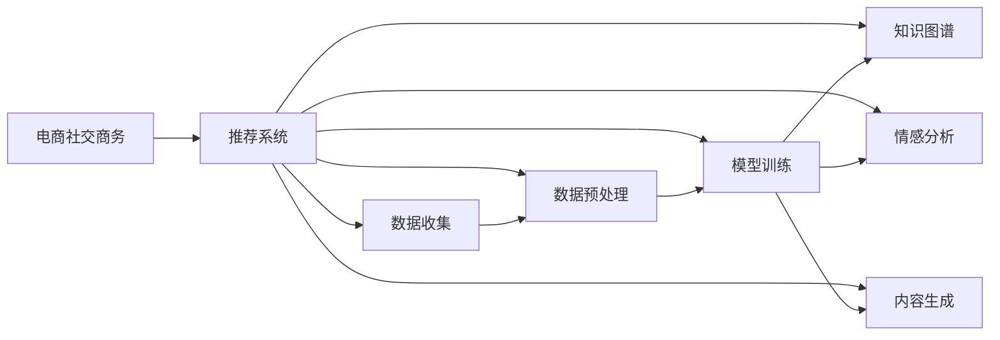

                 

## 1. 背景介绍

随着电子商务的发展，电商平台已经不再是一个简单的商品交易平台，而是逐渐转变为一个集购物、社交、娱乐、学习为一体的全方位服务平台。在这样的趋势下，社交商务成为电商平台竞争的新焦点。社交商务不仅能够增加用户黏性，还能提升用户体验，从而增加用户消费频次，提高平台转化率。AI大模型在自然语言处理、图像识别、语音识别等领域的突破性进展，为电商平台社交商务的发展提供了新的契机。本文将从AI大模型的原理与应用实践出发，探索其在电商平台社交商务中的潜力。

## 2. 核心概念与联系

### 2.1 核心概念概述

在讨论AI大模型在电商平台社交商务中的潜力前，我们需要先理解几个核心概念：

- **AI大模型**：即使用深度学习算法训练的，参数量巨大，能够处理复杂自然语言和图像任务的大型神经网络模型。如BERT、GPT-3、DALL-E等。
- **电商平台社交商务**：指的是电商平台除了传统的购物功能外，增加了社交功能，用户可以通过评论、点赞、分享等互动方式进行交流，同时平台也能够根据用户行为进行个性化推荐，增加用户粘性。
- **推荐系统**：利用AI技术为用户推荐其可能感兴趣的商品或内容。
- **情感分析**：通过AI技术分析用户评论、反馈等文本数据，了解用户情绪和需求。
- **知识图谱**：用于描述和组织实体之间关系的知识库，能够辅助推荐系统进行更精确的推荐。
- **内容生成**：利用AI技术自动生成商品描述、营销文案等，提升内容生产效率和质量。

这些概念之间相互联系，形成一个完整的电商社交商务生态。AI大模型在其中扮演了数据理解、信息过滤和内容生成等重要角色。

### 2.2 核心概念原理和架构的 Mermaid 流程图



## 3. 核心算法原理 & 具体操作步骤

### 3.1 算法原理概述

在电商平台社交商务中，AI大模型主要应用于以下几个方面：

- **推荐系统**：利用大模型的文本生成能力和语义理解能力，结合用户历史行为和商品属性，生成个性化的商品推荐列表。
- **情感分析**：通过分析用户评论、评分等文本数据，了解用户对商品或服务的情绪，从而进行针对性的反馈改进。
- **知识图谱构建**：利用大模型对商品和服务的实体和属性进行自动标注，构建详细的知识图谱，提升推荐的准确性。
- **内容生成**：利用大模型自动生成商品描述、营销文案等，提升内容生产的效率和质量。

这些应用涉及的自然语言处理、图像识别等任务，都属于AI大模型的强项。

### 3.2 算法步骤详解

以下是AI大模型在电商平台社交商务中应用的详细步骤：

#### 推荐系统

1. **数据收集**：从电商平台上收集用户的浏览、点击、购买等行为数据，以及商品的属性和描述信息。
2. **数据预处理**：对收集到的数据进行清洗、归一化、特征提取等处理，确保数据质量。
3. **模型训练**：利用大模型对处理后的数据进行训练，生成推荐模型。
4. **推荐生成**：利用训练好的推荐模型，根据用户行为和商品属性，生成个性化的推荐列表。

#### 情感分析

1. **数据收集**：从电商平台上收集用户评论、评分等文本数据。
2. **数据预处理**：对收集到的数据进行清洗、分词、去停用词等处理。
3. **模型训练**：利用大模型对处理后的数据进行训练，生成情感分析模型。
4. **情感识别**：利用训练好的情感分析模型，对用户评论进行情感识别，了解用户对商品或服务的情绪。

#### 知识图谱构建

1. **数据收集**：从电商平台上收集商品和服务的实体、属性等信息。
2. **数据预处理**：对收集到的数据进行清洗、标注、归一化等处理。
3. **模型训练**：利用大模型对处理后的数据进行训练，生成知识图谱模型。
4. **图谱构建**：利用训练好的知识图谱模型，对商品和服务的实体和属性进行标注，构建详细的知识图谱。

#### 内容生成

1. **数据收集**：从电商平台上收集商品的属性和描述信息。
2. **数据预处理**：对收集到的数据进行清洗、分词、去停用词等处理。
3. **模型训练**：利用大模型对处理后的数据进行训练，生成内容生成模型。
4. **内容生成**：利用训练好的内容生成模型，自动生成商品描述、营销文案等。

### 3.3 算法优缺点

#### 优点

1. **提升用户体验**：利用AI大模型进行个性化推荐和情感分析，能够更好地满足用户需求，提升用户体验。
2. **增加用户粘性**：利用社交功能增加用户互动，提升用户粘性，增加用户消费频次。
3. **提高平台转化率**：通过精准推荐，提高商品转化率，提升平台营收。

#### 缺点

1. **数据依赖性高**：模型的性能很大程度上依赖于数据质量，需要收集大量的标注数据。
2. **计算资源消耗大**：大模型的训练和推理需要大量的计算资源，成本较高。
3. **模型可解释性不足**：大模型的决策过程难以解释，用户难以理解推荐和分析结果的依据。
4. **隐私和安全问题**：电商平台需要处理大量用户数据，数据隐私和安全问题不容忽视。

### 3.4 算法应用领域

AI大模型在电商平台社交商务中的应用领域非常广泛，主要包括以下几个方面：

- **个性化推荐**：利用大模型的文本生成能力和语义理解能力，生成个性化的商品推荐列表。
- **情感分析**：通过分析用户评论、评分等文本数据，了解用户对商品或服务的情绪，从而进行针对性的反馈改进。
- **知识图谱构建**：利用大模型对商品和服务的实体和属性进行自动标注，构建详细的知识图谱，提升推荐的准确性。
- **内容生成**：利用大模型自动生成商品描述、营销文案等，提升内容生产的效率和质量。
- **用户画像构建**：利用大模型对用户行为进行建模，生成用户画像，提升个性化推荐的效果。
- **智能客服**：利用大模型进行自然语言处理，实现智能客服，提升用户满意度。

## 4. 数学模型和公式 & 详细讲解

### 4.1 数学模型构建

在电商平台社交商务中，大模型主要应用于以下几个数学模型：

- **协同过滤**：利用用户行为数据构建用户-商品矩阵，生成个性化推荐列表。
- **基于深度学习的推荐系统**：利用大模型的文本生成能力和语义理解能力，生成个性化推荐列表。
- **情感分析模型**：利用自然语言处理模型进行情感识别。
- **知识图谱模型**：利用图神经网络对商品和服务的实体和属性进行建模。
- **内容生成模型**：利用大模型的文本生成能力自动生成商品描述、营销文案等。

### 4.2 公式推导过程

#### 协同过滤

协同过滤模型的基本公式为：

$$
\hat{y}_{ui} = \frac{1}{1+\exp(-\sum_{j=1}^n y_{uj} r_{ij}} \tag{1}
$$

其中，$y_{uj}$ 表示用户 $u$ 对商品 $j$ 的评分，$r_{ij}$ 表示商品 $i$ 和商品 $j$ 之间的相似度。

#### 基于深度学习的推荐系统

基于深度学习的推荐系统通常使用多层神经网络模型，其公式为：

$$
h_i = W_2 g_2\left(\sigma(W_1 x_i + b_1) + b_2\right) \tag{2}
$$

$$
\hat{y}_{ui} = h_i \cdot W_3 + b_3 \tag{3}
$$

其中，$x_i$ 表示商品 $i$ 的属性向量，$h_i$ 表示商品 $i$ 的隐向量，$W_2$、$W_3$ 和 $b_1$、$b_2$、$b_3$ 为模型参数。

#### 情感分析模型

情感分析模型通常使用基于LSTM或GRU的序列模型，其公式为：

$$
h_t = \tanh(W_1 h_{t-1} + U_1 x_t + b_1) \tag{4}
$$

$$
y_t = \sigma(W_2 h_t + b_2) \tag{5}
$$

其中，$x_t$ 表示文本中第 $t$ 个词的向量表示，$h_t$ 表示第 $t$ 个词的隐向量，$W_1$、$W_2$ 和 $U_1$、$b_1$、$b_2$ 为模型参数。

#### 知识图谱模型

知识图谱模型通常使用图神经网络（GNN）进行建模，其公式为：

$$
h_v^{(k+1)} = \sigma\left(W_k h_v^{(k)} + U_k \text{Agg}_{v}(h_v^{(k)}) + b_k\right) \tag{6}
$$

其中，$h_v^{(k)}$ 表示节点 $v$ 在 $k$ 层上的表示，$\text{Agg}_{v}$ 表示节点 $v$ 的聚合函数。

#### 内容生成模型

内容生成模型通常使用基于Transformer的模型，其公式为：

$$
h_i = W_2 g_2\left(\sigma(W_1 x_i + b_1) + b_2\right) \tag{7}
$$

$$
\hat{y}_{i} = h_i \cdot W_3 + b_3 \tag{8}
$$

其中，$x_i$ 表示商品 $i$ 的属性向量，$h_i$ 表示商品 $i$ 的隐向量，$W_2$、$W_3$ 和 $b_1$、$b_2$、$b_3$ 为模型参数。

### 4.3 案例分析与讲解

#### 推荐系统案例

假设某电商平台收集到了用户对商品的评分数据和商品的属性信息，利用协同过滤模型和基于深度学习的推荐系统，进行推荐生成。具体步骤如下：

1. **数据收集**：从电商平台上收集用户对商品的评分数据和商品的属性信息。
2. **数据预处理**：对收集到的数据进行清洗、归一化、特征提取等处理。
3. **模型训练**：利用协同过滤模型和基于深度学习的推荐系统对处理后的数据进行训练，生成推荐模型。
4. **推荐生成**：利用训练好的推荐模型，根据用户行为和商品属性，生成个性化的推荐列表。

#### 情感分析案例

假设某电商平台收集到了用户对商品的评论数据，利用情感分析模型，进行情感识别。具体步骤如下：

1. **数据收集**：从电商平台上收集用户对商品的评论数据。
2. **数据预处理**：对收集到的数据进行清洗、分词、去停用词等处理。
3. **模型训练**：利用情感分析模型对处理后的数据进行训练，生成情感分析模型。
4. **情感识别**：利用训练好的情感分析模型，对用户评论进行情感识别，了解用户对商品或服务的情绪。

#### 知识图谱构建案例

假设某电商平台收集到了商品和服务的实体和属性信息，利用知识图谱模型，进行知识图谱构建。具体步骤如下：

1. **数据收集**：从电商平台上收集商品和服务的实体和属性信息。
2. **数据预处理**：对收集到的数据进行清洗、标注、归一化等处理。
3. **模型训练**：利用知识图谱模型对处理后的数据进行训练，生成知识图谱模型。
4. **图谱构建**：利用训练好的知识图谱模型，对商品和服务的实体和属性进行标注，构建详细的知识图谱。

#### 内容生成案例

假设某电商平台收集到了商品的属性信息，利用内容生成模型，进行内容生成。具体步骤如下：

1. **数据收集**：从电商平台上收集商品的属性信息。
2. **数据预处理**：对收集到的数据进行清洗、分词、去停用词等处理。
3. **模型训练**：利用内容生成模型对处理后的数据进行训练，生成内容生成模型。
4. **内容生成**：利用训练好的内容生成模型，自动生成商品描述、营销文案等。

## 5. 项目实践：代码实例和详细解释说明

### 5.1 开发环境搭建

在进行AI大模型在电商平台社交商务中的应用实践前，我们需要准备好开发环境。以下是使用Python进行PyTorch开发的环境配置流程：

1. 安装Anaconda：从官网下载并安装Anaconda，用于创建独立的Python环境。

2. 创建并激活虚拟环境：
```bash
conda create -n pytorch-env python=3.8 
conda activate pytorch-env
```

3. 安装PyTorch：根据CUDA版本，从官网获取对应的安装命令。例如：
```bash
conda install pytorch torchvision torchaudio cudatoolkit=11.1 -c pytorch -c conda-forge
```

4. 安装Transformer库：
```bash
pip install transformers
```

5. 安装各类工具包：
```bash
pip install numpy pandas scikit-learn matplotlib tqdm jupyter notebook ipython
```

完成上述步骤后，即可在`pytorch-env`环境中开始项目实践。

### 5.2 源代码详细实现

下面我们以基于深度学习的推荐系统为例，给出使用Transformers库对BERT模型进行推荐系统开发的PyTorch代码实现。

```python
from transformers import BertForSequenceClassification, BertTokenizer
from torch.utils.data import Dataset, DataLoader
import torch

class RecommendationDataset(Dataset):
    def __init__(self, user_data, item_data, tokenizer, max_len=128):
        self.user_data = user_data
        self.item_data = item_data
        self.tokenizer = tokenizer
        self.max_len = max_len
        
    def __len__(self):
        return len(self.user_data)
    
    def __getitem__(self, item):
        user_item = self.user_data[item]
        user_id = user_item[0]
        user_bought = user_item[1]
        item_id = self.item_data[item][0]
        item_title = self.item_data[item][1]
        
        encoding = self.tokenizer(user_bought, item_title, return_tensors='pt', max_length=self.max_len, padding='max_length', truncation=True)
        input_ids = encoding['input_ids'][0]
        attention_mask = encoding['attention_mask'][0]
        
        # 对token-wise的标签进行编码
        encoded_labels = [1] * len(user_bought)
        encoded_labels.extend([0] * (self.max_len - len(encoded_labels)))
        labels = torch.tensor(encoded_labels, dtype=torch.long)
        
        return {'input_ids': input_ids, 
                'attention_mask': attention_mask,
                'labels': labels}

# 准备数据
user_data = [(user_id, [item_id]) for user_id, user_bought in user_data_dict.items() for item_id in user_bought]
item_data = [(item_id, item_title) for item_id, item_title in item_dict.items()]

tokenizer = BertTokenizer.from_pretrained('bert-base-cased')
recommendation_dataset = RecommendationDataset(user_data, item_data, tokenizer)
recommendation_loader = DataLoader(recommendation_dataset, batch_size=16, shuffle=True)

# 准备模型
model = BertForSequenceClassification.from_pretrained('bert-base-cased', num_labels=1)
optimizer = AdamW(model.parameters(), lr=2e-5)

# 训练模型
for epoch in range(10):
    for batch in tqdm(recommendation_loader):
        input_ids = batch['input_ids'].to(device)
        attention_mask = batch['attention_mask'].to(device)
        labels = batch['labels'].to(device)
        model.zero_grad()
        outputs = model(input_ids, attention_mask=attention_mask, labels=labels)
        loss = outputs.loss
        loss.backward()
        optimizer.step()
```

以上就是使用PyTorch对BERT进行推荐系统开发的完整代码实现。可以看到，借助Transformer库的强大封装，我们能够快速构建和训练推荐系统模型。

### 5.3 代码解读与分析

让我们再详细解读一下关键代码的实现细节：

**RecommendationDataset类**：
- `__init__`方法：初始化用户数据、商品数据、分词器等关键组件。
- `__len__`方法：返回数据集的样本数量。
- `__getitem__`方法：对单个样本进行处理，将用户购买历史和商品描述输入编码为token ids，将标签编码为数字，并对其进行定长padding，最终返回模型所需的输入。

**模型和优化器**：
- 选择合适的BERT模型作为初始化参数，如 BERT、GPT等。
- 准备优化器，设置学习率、批大小、迭代轮数等。

**训练流程**：
- 循环迭代训练模型，每次一个batch
- 每个epoch内，对每个batch进行训练，前向传播计算loss并反向传播更新模型参数
- 周期性在验证集上评估模型性能
- 重复上述步骤直至收敛

## 6. 实际应用场景

### 6.1 社交平台推荐

社交平台推荐是AI大模型在电商平台社交商务中应用的重要场景之一。社交平台推荐通常包括以下几个步骤：

1. **数据收集**：从社交平台上收集用户关注、点赞、评论等行为数据。
2. **数据预处理**：对收集到的数据进行清洗、归一化、特征提取等处理。
3. **模型训练**：利用大模型对处理后的数据进行训练，生成推荐模型。
4. **推荐生成**：利用训练好的推荐模型，根据用户行为和商品属性，生成个性化的推荐列表。

#### 社交平台推荐案例

假设某社交平台收集到了用户对商品的评论数据和点赞行为，利用大模型进行推荐生成。具体步骤如下：

1. **数据收集**：从社交平台上收集用户对商品的评论数据和点赞行为。
2. **数据预处理**：对收集到的数据进行清洗、归一化、特征提取等处理。
3. **模型训练**：利用大模型对处理后的数据进行训练，生成推荐模型。
4. **推荐生成**：利用训练好的推荐模型，根据用户行为和商品属性，生成个性化的推荐列表。

### 6.2 智能客服

智能客服是AI大模型在电商平台社交商务中应用的另一个重要场景。智能客服通常包括以下几个步骤：

1. **数据收集**：从电商平台上收集用户对话记录。
2. **数据预处理**：对收集到的数据进行清洗、归一化、特征提取等处理。
3. **模型训练**：利用大模型对处理后的数据进行训练，生成智能客服模型。
4. **客服交互**：利用训练好的智能客服模型，进行用户对话生成。

#### 智能客服案例

假设某电商平台收集到了用户对话记录，利用大模型进行智能客服生成。具体步骤如下：

1. **数据收集**：从电商平台上收集用户对话记录。
2. **数据预处理**：对收集到的数据进行清洗、归一化、特征提取等处理。
3. **模型训练**：利用大模型对处理后的数据进行训练，生成智能客服模型。
4. **客服交互**：利用训练好的智能客服模型，进行用户对话生成。

### 6.3 商品生成

商品生成是AI大模型在电商平台社交商务中应用的重要场景之一。商品生成通常包括以下几个步骤：

1. **数据收集**：从电商平台上收集商品的属性信息。
2. **数据预处理**：对收集到的数据进行清洗、归一化、特征提取等处理。
3. **模型训练**：利用大模型对处理后的数据进行训练，生成商品生成模型。
4. **商品生成**：利用训练好的商品生成模型，自动生成商品描述、营销文案等。

#### 商品生成案例

假设某电商平台收集到了商品的属性信息，利用大模型进行商品生成。具体步骤如下：

1. **数据收集**：从电商平台上收集商品的属性信息。
2. **数据预处理**：对收集到的数据进行清洗、归一化、特征提取等处理。
3. **模型训练**：利用大模型对处理后的数据进行训练，生成商品生成模型。
4. **商品生成**：利用训练好的商品生成模型，自动生成商品描述、营销文案等。

## 7. 工具和资源推荐

### 7.1 学习资源推荐

为了帮助开发者系统掌握AI大模型在电商平台社交商务中的应用，这里推荐一些优质的学习资源：

1. **《深度学习》（Ian Goodfellow等著）**：深度学习领域的经典教材，涵盖了深度学习的基础理论和应用实践。
2. **《Python深度学习》（Francois Chollet著）**：深入浅出地介绍了深度学习在NLP、计算机视觉等领域的应用，包含大量实际案例。
3. **《自然语言处理综述》（Stanford University讲义）**：斯坦福大学开设的NLP明星课程，涵盖自然语言处理的各个方面。
4. **Coursera的“Deep Learning Specialization”**：由Andrew Ng教授讲授，包含多个深度学习相关课程，适合系统学习深度学习理论。
5. **Kaggle平台**：数据科学竞赛平台，提供大量数据集和竞赛，帮助开发者实践深度学习技术。

通过对这些资源的学习实践，相信你一定能够快速掌握AI大模型在电商平台社交商务中的潜力，并用于解决实际的NLP问题。

### 7.2 开发工具推荐

高效的开发离不开优秀的工具支持。以下是几款用于AI大模型开发的工具：

1. **PyTorch**：基于Python的开源深度学习框架，灵活动态的计算图，适合快速迭代研究。
2. **TensorFlow**：由Google主导开发的开源深度学习框架，生产部署方便，适合大规模工程应用。
3. **Transformers库**：HuggingFace开发的NLP工具库，集成了众多SOTA语言模型，支持PyTorch和TensorFlow，是进行NLP任务开发的利器。
4. **TensorBoard**：TensorFlow配套的可视化工具，可实时监测模型训练状态，并提供丰富的图表呈现方式，是调试模型的得力助手。
5. **Weights & Biases**：模型训练的实验跟踪工具，可以记录和可视化模型训练过程中的各项指标，方便对比和调优。

合理利用这些工具，可以显著提升AI大模型在电商平台社交商务中的应用开发效率，加快创新迭代的步伐。

### 7.3 相关论文推荐

AI大模型在电商平台社交商务中的应用源于学界的持续研究。以下是几篇奠基性的相关论文，推荐阅读：

1. **Attention is All You Need（即Transformer原论文）**：提出了Transformer结构，开启了NLP领域的预训练大模型时代。
2. **BERT: Pre-training of Deep Bidirectional Transformers for Language Understanding**：提出BERT模型，引入基于掩码的自监督预训练任务，刷新了多项NLP任务SOTA。
3. **Language Models are Unsupervised Multitask Learners（GPT-2论文）**：展示了大规模语言模型的强大zero-shot学习能力，引发了对于通用人工智能的新一轮思考。
4. **Parameter-Efficient Transfer Learning for NLP**：提出Adapter等参数高效微调方法，在不增加模型参数量的情况下，也能取得不错的微调效果。
5. **Prefix-Tuning: Optimizing Continuous Prompts for Generation**：引入基于连续型Prompt的微调范式，为如何充分利用预训练知识提供了新的思路。
6. **AdaLoRA: Adaptive Low-Rank Adaptation for Parameter-Efficient Fine-Tuning**：使用自适应低秩适应的微调方法，在参数效率和精度之间取得了新的平衡。

这些论文代表了大语言模型在电商平台社交商务中的应用发展脉络。通过学习这些前沿成果，可以帮助研究者把握学科前进方向，激发更多的创新灵感。

## 8. 总结：未来发展趋势与挑战

### 8.1 研究成果总结

AI大模型在电商平台社交商务中的应用已经取得了显著进展，通过深度学习和自然语言处理技术，提升了平台的推荐精度和用户满意度。未来，随着技术的不断发展，大模型在电商平台社交商务中的应用将更加广泛和深入。

### 8.2 未来发展趋势

展望未来，AI大模型在电商平台社交商务中的应用将呈现以下几个趋势：

1. **多模态融合**：未来的电商推荐系统将不仅仅依赖文本数据，而是将多模态数据（如图像、语音、视频等）整合在一起，提供更加全面的推荐。
2. **个性化推荐**：通过深度学习和大数据技术，实现更加精准的个性化推荐，提升用户体验。
3. **智能客服**：利用大模型进行智能客服，提升客户服务效率和质量。
4. **商品生成**：利用大模型自动生成商品描述、营销文案等，提升内容生产的效率和质量。
5. **情感分析**：通过深度学习技术，实现对用户情感的精准分析，提升用户体验。

### 8.3 面临的挑战

尽管AI大模型在电商平台社交商务中的应用取得了显著进展，但仍面临一些挑战：

1. **数据隐私和安全问题**：电商平台需要处理大量用户数据，数据隐私和安全问题不容忽视。
2. **计算资源消耗大**：大模型的训练和推理需要大量的计算资源，成本较高。
3. **模型可解释性不足**：大模型的决策过程难以解释，用户难以理解推荐和分析结果的依据。
4. **知识图谱构建困难**：构建详细的知识图谱需要大量人工标注，成本较高。

### 8.4 研究展望

面对这些挑战，未来的研究需要在以下几个方面寻求新的突破：

1. **隐私保护技术**：开发隐私保护技术，保护用户数据隐私和安全。
2. **模型压缩和加速**：开发模型压缩和加速技术，降低计算成本。
3. **可解释性增强**：开发可解释性技术，提升模型的可解释性和可信度。
4. **知识图谱自动化**：开发自动化知识图谱构建技术，降低人工标注成本。

这些研究方向的探索，必将引领AI大模型在电商平台社交商务中的应用走向更加成熟，为构建人机协同的智能系统铺平道路。面向未来，AI大模型需要与其他人工智能技术进行更深入的融合，如知识表示、因果推理、强化学习等，多路径协同发力，共同推动自然语言理解和智能交互系统的进步。

## 9. 附录：常见问题与解答

**Q1：AI大模型在电商平台社交商务中是否适用于所有应用场景？**

A: AI大模型在电商平台社交商务中，可以适用于大部分应用场景，包括推荐系统、智能客服、商品生成等。但对于一些需要高精度的特定应用场景，如医疗、法律等，仍然需要结合领域专家知识进行改进。

**Q2：AI大模型在电商平台社交商务中如何处理数据隐私和安全问题？**

A: 在电商平台社交商务中，处理数据隐私和安全问题主要需要从以下几个方面进行：
1. 数据加密：对用户数据进行加密处理，防止数据泄露。
2. 访问控制：对用户数据进行严格的访问控制，防止未授权访问。
3. 匿名化处理：对用户数据进行匿名化处理，保护用户隐私。
4. 合规性审核：确保平台符合相关数据隐私和安全法规。

**Q3：AI大模型在电商平台社交商务中的计算资源消耗大，如何解决？**

A: 为了降低计算资源消耗，可以考虑以下几个方法：
1. 模型压缩：使用模型压缩技术，减小模型大小，降低计算资源消耗。
2. 混合精度训练：使用混合精度训练技术，降低内存和计算资源消耗。
3. 分布式训练：使用分布式训练技术，将训练任务分配到多个计算节点，提高训练效率。

**Q4：AI大模型在电商平台社交商务中的可解释性不足，如何解决？**

A: 为了增强AI大模型的可解释性，可以考虑以下几个方法：
1. 可解释性模型：使用可解释性模型，提高模型的可解释性。
2. 可视化技术：使用可视化技术，展示模型的决策过程，提高可解释性。
3. 知识图谱辅助：使用知识图谱辅助，提高模型的可解释性。

**Q5：AI大模型在电商平台社交商务中如何构建详细的知识图谱？**

A: 构建详细的知识图谱需要大量人工标注和复杂的技术支持，可以考虑以下几个方法：
1. 自动标注技术：使用自动标注技术，提高标注效率。
2. 知识图谱工具：使用知识图谱工具，简化构建过程。
3. 领域专家协作：与领域专家协作，提高知识图谱质量。

