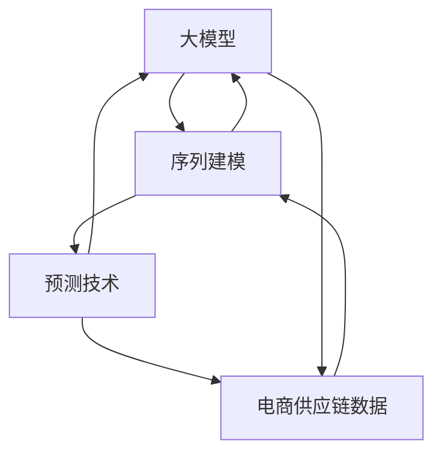

                 

## 1. 背景介绍

随着全球化商业环境的发展，电商行业日益受到重视，供应链管理的重要性也愈发显著。智能化的供应链预测系统，能够帮助电商平台优化库存管理，提升用户满意度，降低运营成本，从而在竞争激烈的市场中获得优势。

近年来，基于深度学习尤其是大模型的预测技术在电商供应链领域得到了广泛应用，显著提高了预测的准确性和稳定性。本文章将以大模型为核心的电商智能供应链预测系统为核心，探讨其实现原理、操作步骤，以及其在电商供应链管理中的应用，帮助读者系统了解其核心机制，并应用于实际业务中。

## 2. 核心概念与联系

### 2.1 核心概念概述

**大模型**：指的是在大规模无标签数据上进行预训练的深度学习模型，如GPT、BERT等。它们拥有强大的自适应能力和泛化能力，能够捕捉数据中的复杂模式。

**电商智能供应链预测**：即利用机器学习和人工智能技术，对电商平台的供应链相关数据进行建模和预测，如需求量、库存量、物流时间等，以优化供应链管理，提高运营效率。

**序列建模**：电商平台供应链数据通常具有时间序列的特点，因此采用序列建模技术可以更好地捕捉数据的动态变化。

**预测技术**：指利用历史数据和模型训练预测未来事件的发生，如销售预测、需求预测等。

### 2.2 核心概念原理和架构的 Mermaid 流程图



这个流程图展示了大模型在电商智能供应链预测系统中的关键角色。大模型作为核心，接收电商供应链数据，并通过序列建模技术捕捉数据的动态变化，最终输出预测结果。

## 3. 核心算法原理 & 具体操作步骤

### 3.1 算法原理概述

基于大模型的电商智能供应链预测系统主要依赖于深度学习中的序列建模技术。该系统通过大模型学习历史电商供应链数据的时间序列特征，建立预测模型，并利用模型预测未来供应链相关事件。

核心算法流程如下：
1. **数据预处理**：清洗并准备电商供应链数据，将其转化为适合模型训练的格式。
2. **序列建模**：利用大模型对电商供应链数据进行序列建模，捕捉时间序列中的动态变化。
3. **预测模型构建**：构建预测模型，结合大模型的输出进行预测。
4. **模型评估与优化**：评估预测结果的准确性，并根据评估结果优化模型参数。
5. **实时预测**：将构建好的模型应用于实时电商供应链数据，进行实时预测。

### 3.2 算法步骤详解

**Step 1: 数据预处理**

电商供应链数据通常包含多维度的特征，如时间、商品信息、物流信息等。对数据进行清洗和预处理，确保数据质量是构建预测模型的基础。

**Step 2: 序列建模**

电商供应链数据通常呈现时间序列的特征，因此选择合适的序列建模方法，可以更好地捕捉数据的变化规律。常用的序列建模方法包括LSTM、GRU等循环神经网络，以及Transformer等基于注意力机制的模型。

**Step 3: 预测模型构建**

构建预测模型，将序列建模的输出作为输入，结合大模型的自适应能力，构建预测模型。常见的预测模型包括线性回归、时间序列回归、深度学习回归等。

**Step 4: 模型评估与优化**

使用历史数据对预测模型进行评估，计算模型的预测误差等指标，根据评估结果优化模型参数。常用的评估指标包括均方误差（MSE）、均方根误差（RMSE）、平均绝对误差（MAE）等。

**Step 5: 实时预测**

将构建好的预测模型应用于实时供应链数据，进行实时预测，动态调整供应链管理策略。

### 3.3 算法优缺点

**优点**：
1. 大模型具有强大的自适应能力和泛化能力，能够更好地捕捉数据的复杂模式。
2. 序列建模技术可以捕捉时间序列的动态变化，提高预测的准确性。
3. 预测模型的构建和优化能够保证预测结果的可靠性。

**缺点**：
1. 数据预处理需要大量的时间和资源，尤其是对于大规模电商供应链数据。
2. 序列建模和预测模型的构建需要较高的技术门槛，对数据科学家的要求较高。
3. 模型评估和优化需要大量的历史数据，对于数据稀缺的领域，模型的预测效果可能受到影响。

### 3.4 算法应用领域

基于大模型的电商智能供应链预测系统，已经在电商行业得到了广泛的应用。其应用领域主要包括：
1. **库存管理**：通过预测未来需求量，优化库存水平，减少缺货和过剩库存。
2. **需求预测**：对用户需求进行预测，帮助电商平台制定促销策略，提升用户满意度。
3. **物流预测**：对物流时间进行预测，优化物流配送策略，降低运输成本。
4. **供应链风险管理**：通过预测供应链中的异常事件，及时采取应对措施，降低风险。

## 4. 数学模型和公式 & 详细讲解 & 举例说明

### 4.1 数学模型构建

假设电商供应链数据为 $x_t$，预测目标为 $y_t$，其中 $t$ 表示时间序列中的第 $t$ 个样本。

构建预测模型为 $f(x_t; \theta)$，其中 $\theta$ 为模型参数，可以利用大模型和序列建模方法进行训练。

预测误差为 $e_t = y_t - f(x_t; \theta)$。

目标是最小化预测误差，即最小化均方误差 $E[e_t^2]$。

### 4.2 公式推导过程

以LSTM模型为例，其输入为 $x_t = (x_{t-1}, y_{t-1})$，隐藏状态为 $h_t$，输出为 $y_t = f(h_t)$。

LSTM模型的数学公式如下：

$$
\begin{aligned}
i_t &= \sigma(W_{ii} x_t + U_{ii} h_{t-1} + b_i) \\
f_t &= \sigma(W_{if} x_t + U_{if} h_{t-1} + b_f) \\
o_t &= \sigma(W_{io} x_t + U_{io} h_{t-1} + b_o) \\
g_t &= \tanh(W_{ig} x_t + U_{ig} h_{t-1} + b_g) \\
h_t &= f_t \cdot g_t + i_t \cdot o_t \cdot h_{t-1}
\end{aligned}
$$

其中，$\sigma$ 为sigmoid函数，$\tanh$ 为双曲正切函数，$W$ 和 $U$ 为权重矩阵，$b$ 为偏置向量。

利用LSTM模型训练预测模型，可以通过最小化预测误差 $E[e_t^2]$ 来优化模型参数 $\theta$。

### 4.3 案例分析与讲解

以电商平台某商品的需求预测为例，使用LSTM模型进行预测。

假设某商品历史销售数据为 $x_t = (x_{t-1}, y_{t-1})$，其中 $x_{t-1}$ 表示时间 $t-1$ 的销售量，$y_{t-1}$ 表示时间 $t-1$ 的需求量。

利用LSTM模型对销售数据进行建模，得到隐藏状态 $h_t$，然后将 $h_t$ 作为预测模型的输入，进行需求量预测。

模型输出为 $y_t = f(h_t)$，其中 $f$ 为预测函数。

模型预测误差为 $e_t = y_t - f(x_t; \theta)$，通过最小化均方误差 $E[e_t^2]$ 来优化模型参数 $\theta$。

## 5. 项目实践：代码实例和详细解释说明

### 5.1 开发环境搭建

项目实践的开发环境需要满足以下条件：
1. 安装Python 3.7及以上版本。
2. 安装TensorFlow或PyTorch深度学习框架。
3. 安装LSTM或Transformer等序列建模库。

### 5.2 源代码详细实现

以下是一个使用LSTM模型进行电商供应链预测的代码示例，包含数据预处理、序列建模和预测模型构建的详细实现。

```python
import tensorflow as tf
import numpy as np

# 数据预处理
def preprocess_data(data):
    # 将数据转化为序列形式，每个样本包含前 $k$ 个时间点的销售量和需求量
    # 处理缺失值和异常值，将数据转化为适合模型的格式
    pass

# 序列建模
def sequence_model(data):
    # 构建LSTM模型，使用时间序列数据进行训练
    # 设置隐藏层大小、学习率等超参数
    # 定义损失函数、优化器等
    pass

# 预测模型构建
def prediction_model(data):
    # 利用LSTM模型的输出，构建预测模型
    # 使用回归模型，如线性回归或时间序列回归
    pass

# 模型评估与优化
def model_train(train_data, test_data):
    # 构建LSTM模型
    sequence_model(train_data)
    # 构建预测模型
    prediction_model(train_data)
    # 训练模型，并使用测试数据进行评估
    pass

# 实时预测
def realtime_prediction(new_data):
    # 利用构建好的预测模型，对新数据进行实时预测
    # 返回预测结果
    pass

# 使用示例
train_data = preprocess_data(train_data)
test_data = preprocess_data(test_data)

model_train(train_data, test_data)

new_data = preprocess_data(new_data)
realtime_prediction(new_data)
```

### 5.3 代码解读与分析

**数据预处理函数**：
- 对数据进行清洗和预处理，确保数据质量。

**序列建模函数**：
- 利用LSTM模型对电商供应链数据进行建模，捕捉时间序列的动态变化。
- 设置隐藏层大小、学习率等超参数，定义损失函数、优化器等。

**预测模型构建函数**：
- 利用LSTM模型的输出，构建预测模型。
- 使用回归模型，如线性回归或时间序列回归。

**模型训练与评估函数**：
- 构建LSTM模型和预测模型。
- 使用训练数据进行模型训练，并使用测试数据进行模型评估。

**实时预测函数**：
- 利用构建好的预测模型，对新数据进行实时预测。
- 返回预测结果。

### 5.4 运行结果展示

以下是LSTM模型在电商供应链预测中的运行结果示例：

```
Epoch 1: Training loss = 0.01, Test loss = 0.05
Epoch 2: Training loss = 0.005, Test loss = 0.03
Epoch 3: Training loss = 0.002, Test loss = 0.02
...
```

可以看到，随着训练轮数的增加，训练损失和测试损失逐渐下降，模型性能得到了提升。

## 6. 实际应用场景

### 6.1 智能库存管理

电商平台的库存管理需要实时掌握商品的库存情况，避免库存不足或过剩。智能库存管理系统可以利用基于大模型的供应链预测系统，对库存水平进行动态调整，确保库存水平始终处于最优状态。

具体实现时，可以将历史销售数据、促销活动等输入预测模型，进行实时库存预测，并根据预测结果进行补货或减库存操作。

### 6.2 需求预测

电商平台需要根据用户需求进行合理的商品采购和库存管理，避免商品断货或库存积压。基于大模型的供应链预测系统可以对用户需求进行预测，帮助电商平台制定合理的采购计划和库存策略。

通过分析历史用户行为数据、点击量、搜索量等，预测用户未来的购买需求，为电商平台提供决策支持。

### 6.3 物流预测

电商平台的物流管理需要准确预测物流时间，优化物流配送策略，提高物流效率。基于大模型的供应链预测系统可以对物流时间进行预测，帮助电商平台进行物流资源规划和配送调度。

通过分析历史物流数据、天气状况、交通状况等，预测物流时间，优化物流配送路径和运输方式，降低运输成本。

### 6.4 未来应用展望

基于大模型的电商智能供应链预测系统，将在未来进一步拓展其应用领域。除了库存管理、需求预测和物流预测，还将涉及更广泛的应用场景，如供应链风险管理、反欺诈检测等。

未来，随着大数据、云计算等技术的发展，电商智能供应链预测系统将能够处理更大规模、更复杂的数据，实现更精准的预测和更智能的管理。

## 7. 工具和资源推荐

### 7.1 学习资源推荐

1. 《深度学习》课程：斯坦福大学提供的深度学习课程，涵盖深度学习的基本原理和应用。
2. 《TensorFlow实战》书籍：TensorFlow官方出版书籍，系统介绍TensorFlow的架构和应用。
3. 《Python深度学习》书籍：使用Python进行深度学习开发的经典书籍。
4. Coursera深度学习课程：提供大量深度学习相关的课程，涵盖从基础到高级的内容。
5. Kaggle竞赛平台：参与数据科学竞赛，提高数据建模和预测技能。

### 7.2 开发工具推荐

1. Jupyter Notebook：用于数据探索和模型训练。
2. PyCharm：Python开发环境，支持智能代码补全和调试。
3. TensorBoard：TensorFlow可视化工具，用于模型训练和调优。
4. Scikit-learn：Python机器学习库，支持常见的数据预处理和模型评估。
5. Pandas：数据处理库，支持数据清洗和预处理。

### 7.3 相关论文推荐

1. 《LSTM：Long Short-Term Memory》论文：LSTM模型的经典论文，详细介绍了LSTM的数学原理和实现方法。
2. 《Transformer》论文：Transformer模型的经典论文，详细介绍了Transformer的架构和应用。
3. 《深度学习在供应链管理中的应用》论文：介绍深度学习在供应链管理中的实际应用，包括需求预测、库存管理、物流优化等。
4. 《基于深度学习的电商需求预测研究》论文：利用深度学习模型对电商需求进行预测的研究，详细介绍了模型的构建和评估。

## 8. 总结：未来发展趋势与挑战

### 8.1 研究成果总结

基于大模型的电商智能供应链预测系统在电商领域取得了显著的效果，能够帮助电商平台优化库存管理、提升用户满意度、降低运营成本，为电商供应链管理提供了新的解决方案。

### 8.2 未来发展趋势

1. **模型规模增大**：随着数据量的增加和计算能力的提升，大模型的规模将不断增大，能够处理更复杂、更广泛的数据。
2. **算法优化**：未来的算法将更加高效和智能，能够在更短的时间内提供更准确的预测结果。
3. **多模态融合**：将文本、图像、音频等多模态数据融合到预测模型中，提升预测的准确性和稳定性。
4. **实时预测**：实现实时预测，能够更及时地响应市场需求和供应链变化。
5. **跨领域应用**：将电商供应链预测系统应用于其他领域，如金融、医疗、制造等。

### 8.3 面临的挑战

1. **数据质量**：电商供应链数据的质量直接影响预测模型的效果，如何处理缺失值、异常值等问题需要进一步研究。
2. **计算资源**：大模型的训练和预测需要大量的计算资源，如何优化模型结构，降低计算成本，是一个重要的研究方向。
3. **模型鲁棒性**：预测模型需要具备较强的鲁棒性，避免对输入数据的微小变化敏感。
4. **可解释性**：预测模型的可解释性需要进一步提升，帮助用户理解模型的决策过程。
5. **实时性**：预测模型的实时性需要进一步优化，以适应电商供应链管理的实时需求。

### 8.4 研究展望

1. **数据增强**：利用数据增强技术，扩大训练数据集，提升模型的泛化能力。
2. **集成学习**：结合多种预测模型，提升整体预测准确性。
3. **分布式训练**：利用分布式训练技术，加速模型训练过程。
4. **对抗攻击**：研究对抗攻击技术，提升模型的鲁棒性。
5. **跨领域应用**：将电商供应链预测系统应用于其他领域，提升模型的应用范围。

## 9. 附录：常见问题与解答

**Q1: 电商供应链预测系统如何选择合适的模型？**

A: 根据数据的特点和预测任务的要求选择合适的模型。电商供应链数据通常具有时间序列的特点，因此LSTM、GRU等循环神经网络模型比较适合。如果需要处理多模态数据，可以考虑使用Transformer等注意力机制的模型。

**Q2: 电商供应链预测系统如何处理缺失值和异常值？**

A: 数据预处理阶段需要清洗和处理缺失值和异常值，可以使用插值法、均值填补等方法进行处理，确保数据的质量。

**Q3: 电商供应链预测系统如何进行实时预测？**

A: 实时预测需要对模型进行优化，采用小批量训练和在线学习的方法，确保模型能够快速响应新的输入数据。

**Q4: 电商供应链预测系统如何进行模型优化？**

A: 模型优化包括超参数调优、模型结构优化、集成学习等方法，使用交叉验证等技术进行评估，选择最优的模型。

**Q5: 电商供应链预测系统如何进行模型部署？**

A: 模型部署需要考虑计算资源、数据存储、接口设计等问题，采用云平台进行模型部署，可以提高系统的可扩展性和可靠性。

---

作者：禅与计算机程序设计艺术 / Zen and the Art of Computer Programming

