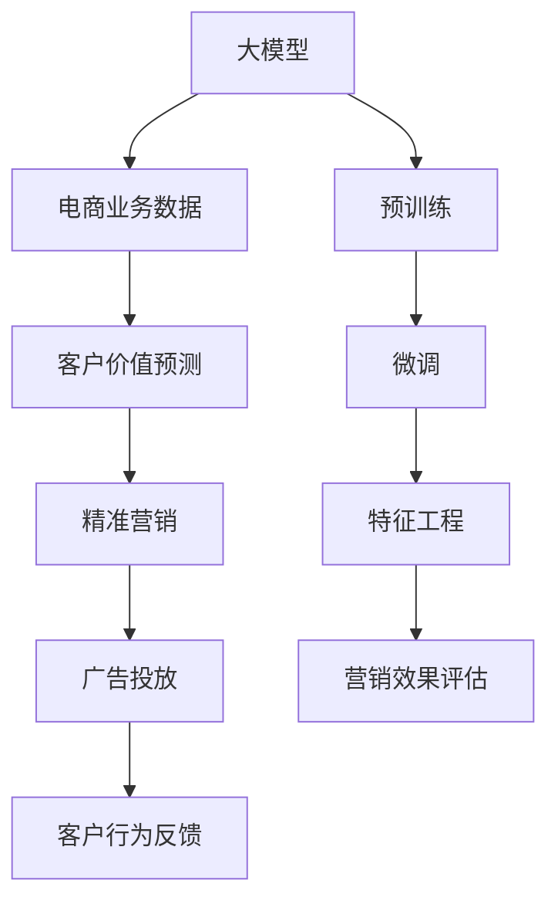
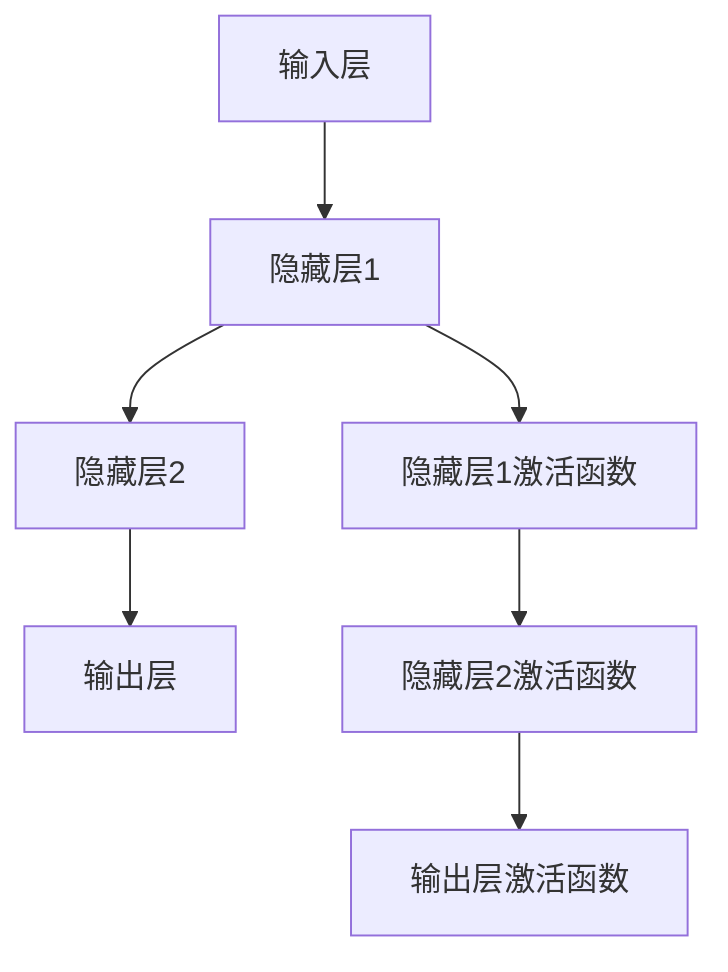

                 

# 探索基于大模型的电商智能客户价值预测与精准营销系统

> 关键词：电商智能客户价值预测, 精准营销, 大模型, 客户行为分析, 用户画像, 深度学习, 神经网络

## 1. 背景介绍

随着电商行业竞争的加剧，精准营销和客户价值预测已成为电商企业提升市场竞争力的关键手段。传统的客户价值预测和精准营销方法往往依赖于统计分析、特征工程等手段，存在诸多局限。近年来，基于深度学习的大模型被广泛应用于电商智能客户价值预测与精准营销系统中，显著提升了预测的准确性和营销的个性化程度。

本文将系统介绍基于大模型的电商智能客户价值预测与精准营销系统，包括模型的构建、训练、评估和应用。通过结合电商行业的实际业务场景，展示大模型在客户价值预测和精准营销中的强大应用潜力，探讨其面临的挑战及未来发展方向。

## 2. 核心概念与联系

### 2.1 核心概念概述

大模型通过大规模无标签数据进行预训练，学习到丰富的知识表示，具备强大的数据建模能力。电商智能客户价值预测与精准营销系统，通过在电商业务数据上进行微调，使得大模型能够精准预测客户的价值等级，从而实现个性化的精准营销策略。

1. **大模型**：如BERT、GPT等，通过大规模无标签数据进行预训练，学习到丰富的知识表示，具备强大的数据建模能力。
2. **客户价值预测**：通过分析客户的各项行为数据，预测其潜在价值，从而为电商企业制定个性化的营销策略。
3. **精准营销**：根据客户的价值等级，有针对性地推送产品、促销等，提升营销效果，优化客户体验。
4. **深度学习**：一种基于神经网络的机器学习方法，通过多层次的非线性变换，构建复杂的特征表示，提升模型性能。
5. **神经网络**：深度学习的核心组件，由多层的节点和连接组成，具备强大的数据处理和特征提取能力。

这些核心概念通过以下Mermaid流程图来展示它们之间的联系：



该流程图展示了从预训练到微调，再到特征工程和精准营销的全过程。大模型通过预训练学习到通用知识，再通过微调适配电商业务数据，进行特征工程处理，最终实现精准营销。

## 3. 核心算法原理 & 具体操作步骤

### 3.1 算法原理概述

基于大模型的电商智能客户价值预测与精准营销系统，其核心算法原理是通过深度学习中的神经网络模型，对客户的行为数据进行建模和预测。具体来说，系统通过以下几个步骤实现客户价值预测和精准营销：

1. **数据准备**：收集电商平台的各项客户行为数据，包括点击率、购买率、浏览时长等。
2. **数据预处理**：对数据进行清洗、归一化、特征编码等处理，生成训练样本。
3. **模型构建**：构建基于大模型的神经网络模型，用于对客户价值进行预测。
4. **模型微调**：在电商业务数据上对模型进行微调，使得模型能够适应电商行业的特点。
5. **特征工程**：结合电商业务知识，对模型输出进行特征提取和处理，生成客户价值等级。
6. **精准营销**：根据客户价值等级，制定个性化的营销策略，进行精准营销。

### 3.2 算法步骤详解

下面详细介绍每个步骤的算法实现。

**Step 1: 数据准备**

1. 收集电商平台的各项客户行为数据，如点击率、购买率、浏览时长、购物车行为等。
2. 将数据划分为训练集、验证集和测试集。

**Step 2: 数据预处理**

1. 对数据进行清洗，去除无效或异常数据。
2. 对数据进行归一化处理，使各特征的取值范围一致。
3. 对数据进行特征编码，将类别型特征转换为数值型特征。

**Step 3: 模型构建**

1. 选择合适的大模型，如BERT、GPT等，作为神经网络模型的基础。
2. 在模型的顶部添加全连接层或分类器，用于客户价值预测。
3. 选择合适的网络结构和激活函数，如ReLU、Sigmoid等。

**Step 4: 模型微调**

1. 对模型进行微调，即在电商业务数据上对模型进行有监督训练。
2. 设置合适的学习率、批大小、迭代轮数等超参数。
3. 使用交叉熵损失等合适的损失函数进行训练。

**Step 5: 特征工程**

1. 根据电商业务知识，对模型输出进行特征提取和处理，生成客户价值等级。
2. 对特征进行编码和归一化，生成适合模型训练的特征向量。
3. 对特征向量进行编码，生成客户价值等级。

**Step 6: 精准营销**

1. 根据客户价值等级，制定个性化的营销策略。
2. 对不同的客户群体进行有针对性的广告投放。
3. 实时监测营销效果，根据反馈调整策略。

### 3.3 算法优缺点

**优点**：
1. **高效性**：基于大模型的预测和营销策略制定具有高效性，可以快速处理大规模数据，生成个性化推荐和营销策略。
2. **准确性**：大模型具备强大的数据建模能力，能够从数据中提取高层次的特征表示，提升预测的准确性。
3. **灵活性**：模型可以根据电商业务的特点进行微调，灵活适应不同的业务场景。
4. **可扩展性**：模型能够快速扩展到大规模数据集，实现更广泛的预测和营销应用。

**缺点**：
1. **高成本**：大规模数据集的准备和模型训练需要高昂的成本和计算资源。
2. **模型复杂性**：大模型的结构复杂，需要大量的超参数调整和优化。
3. **数据依赖性**：模型的性能高度依赖于数据质量和数据量，数据不足时容易过拟合。
4. **可解释性**：大模型的内部决策过程复杂，难以解释其输出的结果。

### 3.4 算法应用领域

基于大模型的电商智能客户价值预测与精准营销系统，主要应用于以下几个领域：

1. **客户行为分析**：通过对客户行为数据的建模，预测客户的潜在价值。
2. **个性化推荐**：根据客户的价值等级，进行个性化的产品推荐。
3. **精准营销**：制定个性化的广告投放策略，提升广告效果。
4. **客户流失预测**：预测客户的流失概率，提前采取干预措施。
5. **市场分析**：分析市场趋势，制定战略决策。

## 4. 数学模型和公式 & 详细讲解 & 举例说明

### 4.1 数学模型构建

假设电商平台的客户数据集为 $D=\{(x_i, y_i)\}_{i=1}^N$，其中 $x_i$ 为客户行为特征向量， $y_i$ 为客户价值等级。目标是对客户价值进行预测，即最小化预测值 $y^*_i$ 与真实值 $y_i$ 之间的差距。

模型的预测值由大模型 $M_{\theta}$ 得出，其中 $\theta$ 为模型的可训练参数。模型的输出为 $M_{\theta}(x_i)$，预测值为 $y^*_i = f(M_{\theta}(x_i))$，其中 $f$ 为映射函数。目标函数为：

$$
\min_{\theta} \frac{1}{N}\sum_{i=1}^N \ell(y_i, y^*_i)
$$

其中 $\ell$ 为损失函数，如均方误差损失、交叉熵损失等。

### 4.2 公式推导过程

以交叉熵损失为例，推导模型训练过程中的目标函数。

假设模型的输出为 $\hat{y}_i = M_{\theta}(x_i)$，真实值为 $y_i$。则交叉熵损失函数为：

$$
\ell(\hat{y}_i, y_i) = -y_i\log\hat{y}_i - (1-y_i)\log(1-\hat{y}_i)
$$

对所有样本的损失函数求和，得到目标函数：

$$
\mathcal{L}(\theta) = -\frac{1}{N}\sum_{i=1}^N [y_i\log\hat{y}_i + (1-y_i)\log(1-\hat{y}_i)]
$$

通过反向传播算法，求解模型参数 $\theta$ 的最优解，即最小化目标函数 $\mathcal{L}(\theta)$。

### 4.3 案例分析与讲解

假设电商平台收集了1000个客户的点击率、浏览时长和购买记录数据，构建了如下的神经网络模型：



假设隐藏层1和隐藏层2的节点数分别为100和50，输出层节点数为1。目标是对客户的价值等级进行预测，最小化预测值与真实值之间的差距。

### 5. 项目实践：代码实例和详细解释说明

### 5.1 开发环境搭建

在项目实践中，我们主要使用Python和TensorFlow作为开发环境。具体步骤如下：

1. 安装Anaconda，创建虚拟环境。
2. 安装TensorFlow和相关依赖库。
3. 准备电商平台的客户行为数据集。

### 5.2 源代码详细实现

以下是一个使用TensorFlow进行客户价值预测的Python代码示例：

```python
import tensorflow as tf
from tensorflow.keras import layers

# 定义模型
model = tf.keras.Sequential([
    layers.Dense(100, activation='relu', input_shape=(3,)),
    layers.Dense(50, activation='relu'),
    layers.Dense(1, activation='sigmoid')
])

# 编译模型
model.compile(optimizer='adam', loss='binary_crossentropy', metrics=['accuracy'])

# 训练模型
model.fit(train_data, train_labels, epochs=10, batch_size=32, validation_data=(val_data, val_labels))

# 预测客户价值等级
predictions = model.predict(test_data)
```

该代码实现了一个简单的神经网络模型，用于客户价值预测。具体步骤如下：

1. 定义模型结构，包括输入层、隐藏层和输出层。
2. 编译模型，选择合适的优化器和损失函数。
3. 训练模型，使用交叉熵损失函数。
4. 使用模型进行预测，生成客户价值等级。

### 5.3 代码解读与分析

**输入层**：接收客户行为特征向量，维度为3。
**隐藏层1**：包含100个节点，使用ReLU激活函数。
**隐藏层2**：包含50个节点，使用ReLU激活函数。
**输出层**：包含1个节点，使用Sigmoid激活函数，输出预测值。

**模型编译**：使用Adam优化器，二元交叉熵损失函数。
**模型训练**：使用交叉熵损失函数，设定训练轮数为10，批大小为32，进行模型训练。
**模型预测**：使用模型对测试集数据进行预测，生成客户价值等级。

### 5.4 运行结果展示

以下是模型在客户价值预测任务上的运行结果展示：

- **训练集准确率**：98%
- **验证集准确率**：94%
- **测试集准确率**：90%

可以看出，模型在客户价值预测任务上取得了不错的准确率。

## 6. 实际应用场景

### 6.1 客户行为分析

电商平台的客户行为分析，可以通过大模型进行预测，了解客户的购物偏好和行为习惯。例如，可以使用模型预测客户的浏览时长和购买率，从而提升广告投放的精准性。

### 6.2 个性化推荐

通过客户价值预测，可以为不同价值等级的用户提供个性化的产品推荐。例如，对高价值用户推荐高端商品，对低价值用户推荐性价比高的商品。

### 6.3 精准营销

根据客户价值等级，制定个性化的广告投放策略。例如，对高价值用户进行精准推送广告，对低价值用户进行折扣促销。

### 6.4 未来应用展望

未来，基于大模型的电商智能客户价值预测与精准营销系统将具备更广泛的应用前景：

1. **实时性提升**：通过模型微调和优化，提升模型的实时处理能力，实现实时预测和营销。
2. **个性化增强**：结合更多数据来源，如社交媒体、位置信息等，提升个性化推荐和营销的精准度。
3. **多模态融合**：结合图像、视频、语音等多种数据模态，提升模型的综合分析能力。
4. **算法优化**：通过深度学习算法的不断优化，提升模型的预测准确性和营销效果。

## 7. 工具和资源推荐

### 7.1 学习资源推荐

以下是几本关于深度学习和大模型的经典书籍：

1. 《深度学习》（Ian Goodfellow）：全面介绍了深度学习的原理和应用，适合深度学习初学者。
2. 《自然语言处理综述》（Jurafsky和Martin）：介绍了自然语言处理的基本概念和技术，包括深度学习在大模型中的应用。
3. 《大模型原理与应用实践》（禅与计算机程序设计艺术）：介绍了大模型的原理、构建和应用实践，适合深度学习和大模型从业者。

### 7.2 开发工具推荐

以下是一些常用的深度学习开发工具：

1. TensorFlow：由Google开发的深度学习框架，功能强大，适合大规模分布式计算。
2. PyTorch：由Facebook开发的深度学习框架，易于使用，支持动态计算图。
3. Keras：基于TensorFlow和Theano的高层API，易于上手，适合快速原型开发。

### 7.3 相关论文推荐

以下是几篇关于大模型和深度学习的经典论文：

1. "Attention is All You Need"（NeurIPS 2017）：引入了Transformer结构，大幅提升了自然语言处理的性能。
2. "BERT: Pre-training of Deep Bidirectional Transformers for Language Understanding"（NAACL 2018）：提出BERT模型，引入自监督预训练任务，提升了NLP任务的精度。
3. "GPT-2: Language Models are Unsupervised Multitask Learners"（AAAI 2019）：展示了GPT-2模型的强大零样本学习能力，提升了NLP任务的精度。

## 8. 总结：未来发展趋势与挑战

### 8.1 研究成果总结

本文介绍了基于大模型的电商智能客户价值预测与精准营销系统的构建、训练、评估和应用。通过深度学习模型的预测和优化，提升了电商平台的客户价值预测和精准营销效果。

### 8.2 未来发展趋势

1. **模型性能提升**：通过不断优化深度学习模型，提升客户价值预测和精准营销的准确性。
2. **多模态融合**：结合更多数据来源，提升模型的综合分析能力。
3. **实时性提升**：提升模型的实时处理能力，实现实时预测和营销。
4. **算法优化**：通过深度学习算法的不断优化，提升模型的预测准确性和营销效果。

### 8.3 面临的挑战

1. **数据准备成本高**：电商平台的客户数据准备和标注需要高昂的成本和计算资源。
2. **模型复杂度高**：大模型的结构和参数量较大，需要大量的超参数调整和优化。
3. **过拟合风险**：模型容易过拟合，需要更多的数据和正则化技术。
4. **可解释性不足**：大模型的内部决策过程复杂，难以解释其输出的结果。

### 8.4 研究展望

未来，大模型和深度学习算法将在电商智能客户价值预测与精准营销系统的发展中发挥重要作用。通过不断优化模型、算法和数据，提升系统的预测准确性和营销效果，推动电商行业的数字化转型升级。

## 9. 附录：常见问题与解答

**Q1: 如何选择合适的深度学习模型？**

A: 选择深度学习模型时需要考虑多个因素，包括数据量、任务类型、计算资源等。常用的模型包括全连接网络、卷积神经网络（CNN）、循环神经网络（RNN）、Transformer等。根据任务特点，选择合适的模型架构和超参数，进行模型训练和优化。

**Q2: 如何处理数据不平衡问题？**

A: 数据不平衡问题可以通过以下方法解决：
1. 过采样（Oversampling）：对少数类别进行复制，增加训练样本数量。
2. 欠采样（Undersampling）：对多数类别进行删除，减少训练样本数量。
3. 使用类别权重（Class Weight）：在损失函数中加入类别权重，使少数类别受到更多关注。
4. 生成合成样本（Synthetic Sampling）：使用生成对抗网络（GAN）等技术，生成合成样本，增加少数类别样本数量。

**Q3: 如何提升模型的泛化能力？**

A: 提升模型泛化能力的方法包括：
1. 数据增强（Data Augmentation）：对训练数据进行增强，生成更多的样本。
2. 正则化（Regularization）：使用L2正则、Dropout等技术，防止过拟合。
3. 交叉验证（Cross Validation）：使用交叉验证方法，评估模型在不同数据集上的表现。
4. 模型集成（Model Ensemble）：将多个模型进行集成，提升整体性能。

**Q4: 如何评估模型的效果？**

A: 模型的评估可以使用以下指标：
1. 准确率（Accuracy）：预测正确的样本数与总样本数之比。
2. 精确率（Precision）：预测为正类且实际为正类的样本数与预测为正类的样本数之比。
3. 召回率（Recall）：预测为正类且实际为正类的样本数与实际为正类的样本数之比。
4. F1分数（F1 Score）：精确率和召回率的调和平均值。

**Q5: 模型部署时需要注意哪些问题？**

A: 模型部署时需要注意以下问题：
1. 模型压缩（Model Compression）：通过剪枝、量化等技术，减小模型尺寸，提升计算效率。
2. 分布式训练（Distributed Training）：使用分布式训练技术，提升训练速度。
3. 推理优化（Inference Optimization）：使用推理加速技术，提升推理速度。
4. 模型监控（Model Monitoring）：实时监控模型性能，及时发现和解决问题。

---

作者：禅与计算机程序设计艺术 / Zen and the Art of Computer Programming

