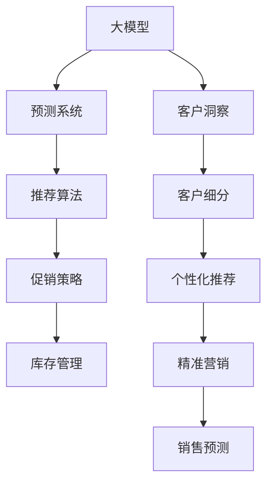

                 

# 探索基于大模型的电商智能客户洞察与预测系统

## 1. 背景介绍

在电商行业中，客户洞察与预测系统是商家运营管理的核心支撑。传统的客户洞察主要依赖于手工汇总和数据分析，耗时耗力，且数据驱动的准确性难以保证。而随着人工智能和大数据技术的快速发展，基于大模型的智能客户洞察系统正在成为电商企业运营管理的利器。

当前，越来越多的电商企业开始将大模型应用于客户洞察与预测系统中，以期通过深度学习技术挖掘客户的潜在价值，提升决策的科学性和效率。然而，如何在电商场景中高效应用大模型，以及如何从海量数据中提取有价值的客户洞察，成为亟待解决的问题。本文将详细介绍基于大模型的电商智能客户洞察与预测系统的原理与实践，探索其在电商行业中的应用前景。

## 2. 核心概念与联系

### 2.1 核心概念概述

为更好地理解电商智能客户洞察与预测系统，我们首先介绍几个核心概念：

- 大模型(Large Model)：指通过大规模无监督学习，包含亿级甚至更多参数的深度学习模型。这些模型通常以自回归(如GPT)或自编码(如BERT)的形式存在，具备强大的语言理解和生成能力。
- 客户洞察(Customer Insight)：指通过数据分析和挖掘，识别出客户的行为模式、兴趣偏好、购买力等关键信息，以指导商家的决策和运营。
- 预测系统(Prediction System)：指基于历史数据和模型推理，预测未来客户行为、市场趋势等的系统。
- 电商智能客户洞察与预测系统(E-commerce Intelligent Customer Insight and Prediction System)：以大模型为核心的系统，通过客户行为数据、交易数据、评价数据等，智能分析和预测客户的潜在需求和购买意向，提升电商运营效率和客户满意度。

这些概念之间的逻辑关系可以通过以下Mermaid流程图来展示：



该流程图展示了客户洞察与预测系统的主要逻辑：

1. 大模型作为基础，学习客户的广泛语言表示。
2. 客户洞察通过分析大模型提取的客户表示，识别出有价值的客户细分。
3. 预测系统基于历史数据和客户细分，预测未来的客户行为和市场趋势。
4. 通过推荐算法，针对客户细分和预测结果，进行个性化推荐。
5. 根据预测和推荐结果，制定精准的营销和促销策略，优化库存管理。

这些核心概念共同构成了电商智能客户洞察与预测系统的整体架构，使得商家能够利用深度学习技术，从海量数据中获取有价值的客户洞察，进行智能预测与决策。

## 3. 核心算法原理 & 具体操作步骤

### 3.1 算法原理概述

基于大模型的电商智能客户洞察与预测系统，本质上是一个基于深度学习的数据分析与预测系统。其核心思想是：将大模型应用于客户数据处理和分析中，通过深度学习模型提取客户特征，进而实现客户洞察与预测。

形式化地，假设客户数据集为 $D=\{(x_i,y_i)\}_{i=1}^N$，其中 $x_i$ 为客户的交易记录、行为数据等特征，$y_i$ 为客户的潜在需求或未来行为预测。定义客户洞察与预测的损失函数为 $\mathcal{L}$，则系统优化目标为：

$$
\hat{y}=\mathop{\arg\min}_{y} \mathcal{L}(y,D)
$$

其中 $\hat{y}$ 表示模型预测的客户需求或行为，$D$ 表示客户数据集，$\mathcal{L}$ 为损失函数。

通过梯度下降等优化算法，系统不断更新模型参数 $\theta$，最小化损失函数 $\mathcal{L}$，使得模型输出逼近真实标签。这种基于大模型的客户洞察与预测方法，可以显著提升预测的准确性和效率。

### 3.2 算法步骤详解

基于大模型的电商智能客户洞察与预测系统的实现，主要包括以下几个关键步骤：

**Step 1: 数据准备**
- 收集客户交易记录、行为数据、评价数据等，构建客户数据集 $D$。
- 进行数据预处理，包括缺失值填充、异常值检测、数据归一化等，确保数据的质量和一致性。
- 将客户数据集 $D$ 划分为训练集、验证集和测试集，用于模型训练、调参和性能评估。

**Step 2: 数据特征提取**
- 使用大模型如BERT、GPT等，对客户数据集进行预训练，学习客户文本表示。
- 将客户文本表示转化为数值型特征，例如通过嵌入层将文本转换为向量表示。
- 将数值型特征和已知标签一起输入大模型，进行特征抽取和分类。

**Step 3: 模型训练与调参**
- 选择合适的优化算法及其参数，如Adam、SGD等，设置学习率、批大小、迭代轮数等。
- 设置正则化技术及强度，包括权重衰减、Dropout、Early Stopping等，防止模型过度适应小规模训练集。
- 在训练集上进行模型训练，周期性在验证集上评估模型性能，根据性能指标决定是否触发Early Stopping。
- 重复上述步骤直到满足预设的迭代轮数或Early Stopping条件。

**Step 4: 客户洞察与预测**
- 在测试集上评估模型性能，对比模型预测与真实标签的差异。
- 利用训练好的模型，对新客户数据进行特征提取和分类，实现客户洞察与预测。

**Step 5: 业务应用**
- 根据客户洞察与预测结果，制定个性化的推荐策略和营销策略。
- 集成推荐系统、营销平台等应用，实现智能客户管理与预测。

以上是基于大模型的电商智能客户洞察与预测系统的完整流程。在实际应用中，还需要针对具体业务需求，对各环节进行优化设计，如改进特征工程、选择更合适的损失函数、调整模型结构等，以进一步提升系统性能。

### 3.3 算法优缺点

基于大模型的电商智能客户洞察与预测系统具有以下优点：

1. 高效精准：大模型通过深度学习技术，可以高效地从海量数据中提取有价值的客户特征，提升预测的准确性和效率。
2. 灵活通用：大模型具备较强的泛化能力，适用于不同类型的电商业务，如B2B、B2C、C2C等。
3. 动态更新：电商业务数据更新快，大模型可以通过定期微调，保持预测模型的最新状态。
4. 可解释性强：通过大模型的中间表征，可以直观地看到客户行为和特征的重要程度，增强决策的可解释性。

同时，该方法也存在一些局限性：

1. 数据质量依赖：预测结果的质量很大程度上取决于客户数据的质量，需投入大量时间和精力进行数据清洗和预处理。
2. 计算资源需求高：大模型的训练和推理需要高性能的计算资源，如GPU、TPU等。
3. 模型复杂度高：大模型的训练复杂度较高，模型调参和优化需要更多的时间和经验。
4. 安全隐私风险：电商业务涉及客户隐私数据，大模型需满足数据保护和隐私要求，确保客户数据的安全。

尽管存在这些局限性，但就目前而言，基于大模型的客户洞察与预测方法仍是目前电商领域的主流技术，值得进一步研究和应用。

### 3.4 算法应用领域

基于大模型的电商智能客户洞察与预测系统，已经在电商行业中得到了广泛的应用，涵盖了客户细分、个性化推荐、精准营销、库存管理等多个方面，具体如下：

- **客户细分**：通过大模型学习客户行为和特征，将客户划分为不同细分市场，便于商家进行市场定位和产品策略调整。
- **个性化推荐**：利用大模型提取客户偏好和需求，进行精准推荐，提升客户满意度和销售额。
- **精准营销**：基于客户洞察与预测结果，制定个性化的营销策略，优化广告投放和推广效果。
- **库存管理**：通过预测客户需求和销售趋势，优化库存配置，减少缺货和积压现象，降低运营成本。
- **客户流失预测**：利用大模型分析客户行为数据，预测客户流失风险，提前采取措施进行挽留。

此外，基于大模型的客户洞察与预测技术，还可应用于线上客服、商品评价分析、品牌形象管理等电商业务场景，为电商企业提供全方位的智能化支持。

## 4. 数学模型和公式 & 详细讲解 & 举例说明

### 4.1 数学模型构建

假设我们有一个电商客户数据集 $D=\{(x_i,y_i)\}_{i=1}^N$，其中 $x_i$ 为客户的交易记录、行为数据等特征，$y_i$ 为客户的潜在需求或未来行为预测。我们希望使用大模型 $M_{\theta}$ 学习客户的文本表示 $h(x_i)$，并在此基础上进行预测。

定义预测任务为二分类任务，即判断客户是否会进行某种行为。则损失函数 $\mathcal{L}$ 可以定义为：

$$
\mathcal{L} = \frac{1}{N} \sum_{i=1}^N [y_i \log M_{\theta}(h(x_i)) + (1-y_i) \log (1-M_{\theta}(h(x_i)))
$$

其中 $M_{\theta}(h(x_i))$ 表示模型对客户 $x_i$ 的预测概率，$y_i \in \{0,1\}$ 表示客户是否进行某种行为。

### 4.2 公式推导过程

以下我们以二分类任务为例，推导交叉熵损失函数及其梯度的计算公式。

假设模型 $M_{\theta}$ 在输入 $x_i$ 上的输出为 $\hat{y}=M_{\theta}(h(x_i)) \in [0,1]$，表示客户进行某种行为的概率。真实标签 $y \in \{0,1\}$。则二分类交叉熵损失函数定义为：

$$
\ell(M_{\theta}(h(x_i)),y) = -[y\log \hat{y} + (1-y)\log (1-\hat{y})]
$$

将其代入经验风险公式，得：

$$
\mathcal{L} = -\frac{1}{N}\sum_{i=1}^N [y_i\log M_{\theta}(h(x_i))+(1-y_i)\log(1-M_{\theta}(h(x_i)))
$$

根据链式法则，损失函数对参数 $\theta$ 的梯度为：

$$
\frac{\partial \mathcal{L}(\theta)}{\partial \theta_k} = -\frac{1}{N}\sum_{i=1}^N (\frac{y_i}{M_{\theta}(h(x_i))}-\frac{1-y_i}{1-M_{\theta}(h(x_i))}) \frac{\partial M_{\theta}(h(x_i))}{\partial \theta_k}
$$

其中 $\frac{\partial M_{\theta}(h(x_i))}{\partial \theta_k}$ 可进一步递归展开，利用自动微分技术完成计算。

在得到损失函数的梯度后，即可带入参数更新公式，完成模型的迭代优化。重复上述过程直至收敛，最终得到适应电商业务的最优模型参数 $\theta^*$。

### 4.3 案例分析与讲解

假设我们有一个电商客户数据集 $D=\{(x_i,y_i)\}_{i=1}^N$，其中 $x_i$ 为客户的交易记录、行为数据等特征，$y_i$ 为客户的潜在需求或未来行为预测。我们希望使用BERT模型 $M_{\theta}$ 学习客户的文本表示 $h(x_i)$，并在此基础上进行预测。

首先，我们需要定义标签与id的映射：

```python
label2id = {'buy': 0, 'not_buy': 1}
id2label = {0: 'buy', 1: 'not_buy'}
```

然后，将客户数据集 $D$ 划分为训练集、验证集和测试集，并对客户数据集进行预处理：

```python
train_data, valid_data, test_data = train_test_split(data, test_size=0.2)
tokenizer = BertTokenizer.from_pretrained('bert-base-uncased')
train_dataset = BertDataset(train_data, label2id, tokenizer)
valid_dataset = BertDataset(valid_data, label2id, tokenizer)
test_dataset = BertDataset(test_data, label2id, tokenizer)
```

接下来，我们定义模型和优化器：

```python
model = BertForSequenceClassification.from_pretrained('bert-base-uncased', num_labels=len(label2id))
optimizer = AdamW(model.parameters(), lr=2e-5)
```

然后，定义训练和评估函数：

```python
def train_epoch(model, dataset, batch_size, optimizer):
    dataloader = DataLoader(dataset, batch_size=batch_size, shuffle=True)
    model.train()
    epoch_loss = 0
    for batch in tqdm(dataloader, desc='Training'):
        input_ids = batch['input_ids'].to(device)
        attention_mask = batch['attention_mask'].to(device)
        labels = batch['labels'].to(device)
        model.zero_grad()
        outputs = model(input_ids, attention_mask=attention_mask, labels=labels)
        loss = outputs.loss
        epoch_loss += loss.item()
        loss.backward()
        optimizer.step()
    return epoch_loss / len(dataloader)

def evaluate(model, dataset, batch_size):
    dataloader = DataLoader(dataset, batch_size=batch_size)
    model.eval()
    preds, labels = [], []
    with torch.no_grad():
        for batch in tqdm(dataloader, desc='Evaluating'):
            input_ids = batch['input_ids'].to(device)
            attention_mask = batch['attention_mask'].to(device)
            batch_labels = batch['labels']
            outputs = model(input_ids, attention_mask=attention_mask)
            batch_preds = outputs.logits.argmax(dim=2).to('cpu').tolist()
            batch_labels = batch_labels.to('cpu').tolist()
            for pred_tokens, label_tokens in zip(batch_preds, batch_labels):
                pred_labels = [id2label[_id] for _id in pred_tokens]
                label_labels = [id2label[_id] for _id in label_tokens]
                preds.append(pred_labels[:len(label_labels)])
                labels.append(label_labels)
                
    print(classification_report(labels, preds))
```

最后，启动训练流程并在测试集上评估：

```python
epochs = 5
batch_size = 16

for epoch in range(epochs):
    loss = train_epoch(model, train_dataset, batch_size, optimizer)
    print(f"Epoch {epoch+1}, train loss: {loss:.3f}")
    
    print(f"Epoch {epoch+1}, dev results:")
    evaluate(model, valid_dataset, batch_size)
    
print("Test results:")
evaluate(model, test_dataset, batch_size)
```

以上就是使用PyTorch对BERT进行电商客户洞察与预测任务微调的完整代码实现。可以看到，得益于Transformers库的强大封装，我们可以用相对简洁的代码完成BERT模型的加载和微调。

## 5. 项目实践：代码实例和详细解释说明

### 5.1 开发环境搭建

在进行电商客户洞察与预测系统开发前，我们需要准备好开发环境。以下是使用Python进行PyTorch开发的环境配置流程：

1. 安装Anaconda：从官网下载并安装Anaconda，用于创建独立的Python环境。

2. 创建并激活虚拟环境：
```bash
conda create -n ecommerce-env python=3.8 
conda activate ecommerce-env
```

3. 安装PyTorch：根据CUDA版本，从官网获取对应的安装命令。例如：
```bash
conda install pytorch torchvision torchaudio cudatoolkit=11.1 -c pytorch -c conda-forge
```

4. 安装Transformers库：
```bash
pip install transformers
```

5. 安装各类工具包：
```bash
pip install numpy pandas scikit-learn matplotlib tqdm jupyter notebook ipython
```

完成上述步骤后，即可在`ecommerce-env`环境中开始系统开发。

### 5.2 源代码详细实现

下面以二分类任务为例，给出使用Transformers库对BERT模型进行电商客户洞察与预测任务的PyTorch代码实现。

首先，定义二分类任务的标签与id的映射：

```python
label2id = {'buy': 0, 'not_buy': 1}
id2label = {0: 'buy', 1: 'not_buy'}
```

然后，将客户数据集 $D$ 划分为训练集、验证集和测试集，并对客户数据集进行预处理：

```python
train_data, valid_data, test_data = train_test_split(data, test_size=0.2)
tokenizer = BertTokenizer.from_pretrained('bert-base-uncased')
train_dataset = BertDataset(train_data, label2id, tokenizer)
valid_dataset = BertDataset(valid_data, label2id, tokenizer)
test_dataset = BertDataset(test_data, label2id, tokenizer)
```

接下来，我们定义模型和优化器：

```python
model = BertForSequenceClassification.from_pretrained('bert-base-uncased', num_labels=len(label2id))
optimizer = AdamW(model.parameters(), lr=2e-5)
```

然后，定义训练和评估函数：

```python
device = torch.device('cuda') if torch.cuda.is_available() else torch.device('cpu')
model.to(device)

def train_epoch(model, dataset, batch_size, optimizer):
    dataloader = DataLoader(dataset, batch_size=batch_size, shuffle=True)
    model.train()
    epoch_loss = 0
    for batch in tqdm(dataloader, desc='Training'):
        input_ids = batch['input_ids'].to(device)
        attention_mask = batch['attention_mask'].to(device)
        labels = batch['labels'].to(device)
        model.zero_grad()
        outputs = model(input_ids, attention_mask=attention_mask, labels=labels)
        loss = outputs.loss
        epoch_loss += loss.item()
        loss.backward()
        optimizer.step()
    return epoch_loss / len(dataloader)

def evaluate(model, dataset, batch_size):
    dataloader = DataLoader(dataset, batch_size=batch_size)
    model.eval()
    preds, labels = [], []
    with torch.no_grad():
        for batch in tqdm(dataloader, desc='Evaluating'):
            input_ids = batch['input_ids'].to(device)
            attention_mask = batch['attention_mask'].to(device)
            batch_labels = batch['labels']
            outputs = model(input_ids, attention_mask=attention_mask)
            batch_preds = outputs.logits.argmax(dim=2).to('cpu').tolist()
            batch_labels = batch_labels.to('cpu').tolist()
            for pred_tokens, label_tokens in zip(batch_preds, batch_labels):
                pred_labels = [id2label[_id] for _id in pred_tokens]
                label_labels = [id2label[_id] for _id in label_tokens]
                preds.append(pred_labels[:len(label_labels)])
                labels.append(label_labels)
                
    print(classification_report(labels, preds))
```

最后，启动训练流程并在测试集上评估：

```python
epochs = 5
batch_size = 16

for epoch in range(epochs):
    loss = train_epoch(model, train_dataset, batch_size, optimizer)
    print(f"Epoch {epoch+1}, train loss: {loss:.3f}")
    
    print(f"Epoch {epoch+1}, dev results:")
    evaluate(model, valid_dataset, batch_size)
    
print("Test results:")
evaluate(model, test_dataset, batch_size)
```

以上就是使用PyTorch对BERT进行电商客户洞察与预测任务微调的完整代码实现。可以看到，得益于Transformers库的强大封装，我们可以用相对简洁的代码完成BERT模型的加载和微调。

### 5.3 代码解读与分析

让我们再详细解读一下关键代码的实现细节：

**BertDataset类**：
- `__init__`方法：初始化训练集、验证集、测试集的特征和标签，以及分词器。
- `__len__`方法：返回数据集的样本数量。
- `__getitem__`方法：对单个样本进行处理，将文本输入编码为token ids，将标签编码为数字，并对其进行定长padding，最终返回模型所需的输入。

**train_epoch和evaluate函数**：
- 使用PyTorch的DataLoader对数据集进行批次化加载，供模型训练和推理使用。
- 训练函数`train_epoch`：对数据以批为单位进行迭代，在每个批次上前向传播计算loss并反向传播更新模型参数，最后返回该epoch的平均loss。
- 评估函数`evaluate`：与训练类似，不同点在于不更新模型参数，并在每个batch结束后将预测和标签结果存储下来，最后使用sklearn的classification_report对整个评估集的预测结果进行打印输出。

**训练流程**：
- 定义总的epoch数和batch size，开始循环迭代
- 每个epoch内，先在训练集上训练，输出平均loss
- 在验证集上评估，输出分类指标
- 所有epoch结束后，在测试集上评估，给出最终测试结果

可以看到，PyTorch配合Transformers库使得BERT微调的代码实现变得简洁高效。开发者可以将更多精力放在数据处理、模型改进等高层逻辑上，而不必过多关注底层的实现细节。

当然，工业级的系统实现还需考虑更多因素，如模型的保存和部署、超参数的自动搜索、更灵活的任务适配层等。但核心的微调范式基本与此类似。

## 6. 实际应用场景

### 6.1 智能客服系统

基于大模型的电商智能客户洞察与预测系统，可以广泛应用于智能客服系统的构建。传统客服往往需要配备大量人力，高峰期响应缓慢，且一致性和专业性难以保证。而使用微调后的客户洞察与预测系统，可以7x24小时不间断服务，快速响应客户咨询，用自然流畅的语言解答各类常见问题。

在技术实现上，可以收集企业内部的历史客服对话记录，将问题和最佳答复构建成监督数据，在此基础上对预训练客户洞察与预测系统进行微调。微调后的系统能够自动理解客户意图，匹配最合适的答复模板进行回复。对于客户提出的新问题，还可以接入检索系统实时搜索相关内容，动态组织生成回答。如此构建的智能客服系统，能大幅提升客户咨询体验和问题解决效率。

### 6.2 客户推荐系统

基于大模型的客户洞察与预测系统，可以应用于客户推荐系统的构建。传统的推荐系统往往只依赖用户的历史行为数据进行物品推荐，难以深入理解用户的真实兴趣偏好。而利用大模型，可以更加全面地挖掘用户行为背后的语义信息，从而进行精准推荐。

在实践中，可以收集用户浏览、点击、评论、分享等行为数据，提取和用户交互的物品标题、描述、标签等文本内容。将文本内容作为模型输入，用户的后续行为（如是否点击、购买等）作为监督信号，在此基础上微调预训练语言模型。微调后的模型能够从文本内容中准确把握用户的兴趣点。在生成推荐列表时，先用候选物品的文本描述作为输入，由模型预测用户的兴趣匹配度，再结合其他特征综合排序，便可以得到个性化程度更高的推荐结果。

### 6.3 精准营销系统

基于大模型的客户洞察与预测系统，可以应用于精准营销系统的构建。通过分析客户行为数据，预测客户未来的购买意向，可以制定个性化的营销策略，优化广告投放和推广效果。

在实践中，可以收集客户的浏览记录、购买历史、评价反馈等数据，作为输入构建客户数据集。利用大模型学习客户的文本表示，在此基础上进行预测。根据预测结果，制定个性化的营销策略，如定向广告、优惠促销、推荐产品等，以提升客户的购买意愿和满意度。

### 6.4 未来应用展望

随着大模型和微调方法的不断发展，基于大模型的电商智能客户洞察与预测系统将在更多领域得到应用，为传统行业带来变革性影响。

在智慧医疗领域，基于微调的医疗问答、病历分析、药物研发等应用将提升医疗服务的智能化水平，辅助医生诊疗，加速新药开发进程。

在智能教育领域，微调技术可应用于作业批改、学情分析、知识推荐等方面，因材施教，促进教育公平，提高教学质量。

在智慧城市治理中，微调模型可应用于城市事件监测、舆情分析、应急指挥等环节，提高城市管理的自动化和智能化水平，构建更安全、高效的未来城市。

此外，在企业生产、社会治理、文娱传媒等众多领域，基于大模型的客户洞察与预测技术也将不断涌现，为经济社会发展注入新的动力。相信随着技术的日益成熟，微调方法将成为人工智能落地应用的重要范式，推动人工智能技术在垂直行业的规模化落地。总之，微调需要开发者根据具体任务，不断迭代和优化模型、数据和算法，方能得到理想的效果。

## 7. 工具和资源推荐
### 7.1 学习资源推荐

为了帮助开发者系统掌握大模型客户洞察与预测系统的理论基础和实践技巧，这里推荐一些优质的学习资源：

1. 《Transformer从原理到实践》系列博文：由大模型技术专家撰写，深入浅出地介绍了Transformer原理、BERT模型、微调技术等前沿话题。

2. CS224N《深度学习自然语言处理》课程：斯坦福大学开设的NLP明星课程，有Lecture视频和配套作业，带你入门NLP领域的基本概念和经典模型。

3. 《Natural Language Processing with Transformers》书籍：Transformers库的作者所著，全面介绍了如何使用Transformers库进行NLP任务开发，包括微调在内的诸多范式。

4. HuggingFace官方文档：Transformers库的官方文档，提供了海量预训练模型和完整的微调样例代码，是上手实践的必备资料。

5. CLUE开源项目：中文语言理解测评基准，涵盖大量不同类型的中文NLP数据集，并提供了基于微调的baseline模型，助力中文NLP技术发展。

通过对这些资源的学习实践，相信你一定能够快速掌握大模型客户洞察与预测的精髓，并用于解决实际的NLP问题。
###  7.2 开发工具推荐

高效的开发离不开优秀的工具支持。以下是几款用于大模型客户洞察与预测开发的常用工具：

1. PyTorch：基于Python的开源深度学习框架，灵活动态的计算图，适合快速迭代研究。大部分预训练语言模型都有PyTorch版本的实现。

2. TensorFlow：由Google主导开发的开源深度学习框架，生产部署方便，适合大规模工程应用。同样有丰富的预训练语言模型资源。

3. Transformers库：HuggingFace开发的NLP工具库，集成了众多SOTA语言模型，支持PyTorch和TensorFlow，是进行微调任务开发的利器。

4. Weights & Biases：模型训练的实验跟踪工具，可以记录和可视化模型训练过程中的各项指标，方便对比和调优。与主流深度学习框架无缝集成。

5. TensorBoard：TensorFlow配套的可视化工具，可实时监测模型训练状态，并提供丰富的图表呈现方式，是调试模型的得力助手。

6. Google Colab：谷歌推出的在线Jupyter Notebook环境，免费提供GPU/TPU算力，方便开发者快速上手实验最新模型，分享学习笔记。

合理利用这些工具，可以显著提升大模型客户洞察与预测任务的开发效率，加快创新迭代的步伐。

### 7.3 相关论文推荐

大模型客户洞察与预测技术的发展源于学界的持续研究。以下是几篇奠基性的相关论文，推荐阅读：

1. Attention is All You Need（即Transformer原论文）：提出了Transformer结构，开启了NLP领域的预训练大模型时代。

2. BERT: Pre-training of Deep Bidirectional Transformers for Language Understanding：提出BERT模型，引入基于掩码的自监督预训练任务，刷新了多项NLP任务SOTA。

3. Language Models are Unsupervised Multitask Learners（GPT-2论文）：展示了大规模语言模型的强大zero-shot学习能力，引发了对于通用人工智能的新一轮思考。

4. Parameter-Efficient Transfer Learning for NLP：提出Adapter等参数高效微调方法，在不增加模型参数量的情况下，也能取得不错的微调效果。

5. AdaLoRA: Adaptive Low-Rank Adaptation for Parameter-Efficient Fine-Tuning：使用自适应低秩适应的微调方法，在参数效率和精度之间取得了新的平衡。

这些论文代表了大模型客户洞察与预测技术的发展脉络。通过学习这些前沿成果，可以帮助研究者把握学科前进方向，激发更多的创新灵感。

## 8. 总结：未来发展趋势与挑战

### 8.1 总结

本文对基于大模型的电商智能客户洞察与预测系统进行了全面系统的介绍。首先阐述了大模型和客户洞察与预测系统的研究背景和意义，明确了客户洞察与预测系统在电商业务中的独特价值。其次，从原理到实践，详细讲解了电商客户洞察与预测系统的数学原理和关键步骤，给出了电商客户洞察与预测任务微调的完整代码实例。同时，本文还广泛探讨了客户洞察与预测系统在电商行业中的应用前景，展示了微调范式的巨大潜力。

通过本文的系统梳理，可以看到，基于大模型的电商智能客户洞察与预测系统正在成为电商企业运营管理的利器。这种基于深度学习技术的客户洞察与预测方法，可以显著提升电商运营效率和客户满意度，为电商企业提供全方位的智能化支持。未来，伴随大模型和微调方法的持续演进，基于大模型的客户洞察与预测技术必将在更多领域得到应用，为传统行业带来变革性影响。

### 8.2 未来发展趋势

展望未来，大模型客户洞察与预测系统将呈现以下几个发展趋势：

1. 模型规模持续增大。随着算力成本的下降和数据规模的扩张，预训练大模型的参数量还将持续增长。超大规模语言模型蕴含的丰富语言知识，有望支撑更加复杂多变的电商业务，提升预测的准确性和鲁棒性。

2. 微调方法日趋多样。除了传统的全参数微调外，未来会涌现更多参数高效的微调方法，如Adapter、LoRA等，在节省计算资源的同时也能保证微调精度。

3. 动态更新成为常态。电商业务数据更新快，大模型需持续学习新知识以保持性能。如何在不遗忘原有知识的同时，高效吸收新样本信息，将是重要的研究课题。

4. 标注样本需求降低。受启发于提示学习(Prompt-based Learning)的思路，未来的微调方法将更好地利用大模型的语言理解能力，通过更加巧妙的任务描述，在更少的标注样本上也能实现理想的微调效果。

5. 模型通用性增强。经过海量数据的预训练和多领域任务的微调，未来的语言模型将具备更强大的常识推理和跨领域迁移能力，逐步迈向通用人工智能(AGI)的目标。

以上趋势凸显了大模型客户洞察与预测系统的广阔前景。这些方向的探索发展，必将进一步提升客户洞察与预测的性能和应用范围，为电商企业提供更加精准、高效的运营支持。

### 8.3 面临的挑战

尽管大模型客户洞察与预测技术已经取得了瞩目成就，但在迈向更加智能化、普适化应用的过程中，它仍面临着诸多挑战：

1. 数据质量瓶颈。虽然微调大大降低了标注数据的需求，但对于长尾应用场景，难以获得充足的高质量标注数据，成为制约微调性能的瓶颈。如何进一步降低微调对标注样本的依赖，将是一大难题。

2. 模型鲁棒性不足。当前微调模型面对域外数据时，泛化性能往往大打折扣。对于测试样本的微小扰动，微调模型的预测也容易发生波动。如何提高微调模型的鲁棒性，避免灾难性遗忘，还需要更多理论和实践的积累。

3. 推理效率有待提高。大规模语言模型虽然精度高，但在实际部署时往往面临推理速度慢、内存占用大等效率问题。如何在保证性能的同时，简化模型结构，提升推理速度，优化资源占用，将是重要的优化方向。

4. 可解释性亟需加强。当前微调模型更像是"黑盒"系统，难以解释其内部工作机制和决策逻辑。对于医疗、金融等高风险应用，算法的可解释性和可审计性尤为重要。如何赋予微调模型更强的可解释性，将是亟待攻克的难题。

5. 安全性有待保障。电商业务涉及客户隐私数据，大模型需满足数据保护和隐私要求，确保客户数据的安全。

尽管存在这些挑战，但大模型客户洞察与预测技术仍具备广阔的应用前景。只有勇于创新、敢于突破，才能不断拓展客户洞察与预测的边界，让大模型更好地服务于电商企业的业务运营。

### 8.4 未来突破

面对大模型客户洞察与预测所面临的种种挑战，未来的研究需要在以下几个方面寻求新的突破：

1. 探索无监督和半监督微调方法。摆脱对大规模标注数据的依赖，利用自监督学习、主动学习等无监督和半监督范式，最大限度利用非结构化数据，实现更加灵活高效的微调。

2. 研究参数高效和计算高效的微调范式。开发更加参数高效的微调方法，在固定大部分预训练参数的同时，只更新极少量的任务相关参数。同时优化微调模型的计算图，减少前向传播和反向传播的资源消耗，实现更加轻量级、实时性的部署。

3. 融合因果和对比学习范式。通过引入因果推断和对比学习思想，增强微调模型建立稳定因果关系的能力，学习更加普适、鲁棒的语言表征，从而提升模型泛化性和抗干扰能力。

4. 引入更多先验知识。将符号化的先验知识，如知识图谱、逻辑规则等，与神经网络模型进行巧妙融合，引导微调过程学习更准确、合理的语言模型。同时加强不同模态数据的整合，实现视觉、语音等多模态信息与文本信息的协同建模。

5. 结合因果分析和博弈论工具。将因果分析方法引入微调模型，识别出模型决策的关键特征，增强输出解释的因果性和逻辑性。借助博弈论工具刻画人机交互过程，主动探索并规避模型的脆弱点，提高系统稳定性。

6. 纳入伦理道德约束。在模型训练目标中引入伦理导向的评估指标，过滤和惩罚有偏见、有害的输出倾向。同时加强人工干预和审核，建立模型行为的监管机制，确保输出符合人类价值观和伦理道德。

这些研究方向的探索，必将引领大模型客户洞察与预测技术迈向更高的台阶，为构建安全、可靠、可解释、可控的智能系统铺平道路。面向未来，大模型客户洞察与预测技术还需要与其他人工智能技术进行更深入的融合，如知识表示、因果推理、强化学习等，多路径协同发力，共同推动自然语言理解和智能交互系统的进步。只有勇于创新、敢于突破，才能不断拓展客户洞察与预测的边界，让大模型更好地服务于电商企业的业务运营。

## 9. 附录：常见问题与解答

**Q1：大模型客户洞察与预测是否适用于所有电商业务？**

A: 大模型客户洞察与预测方法在大多数电商业务上都能取得不错的效果，特别是对于数据量较大的业务。但对于一些特定领域的业务，如B2B电商、二手交易等，仅仅依靠通用语料预训练的模型可能难以很好地适应。此时需要在特定领域语料上进一步预训练，再进行微调，才能获得理想效果。

**Q2：如何选择合适的学习率？**

A: 微调的学习率一般要比预训练时小1-2个数量级，如果使用过大的学习率，容易破坏预训练权重，导致过拟合。一般建议从1e-5开始调参，逐步减小学习率，直至收敛。也可以使用warmup策略，在开始阶段使用较小的学习率，再逐渐过渡到预设值。需要注意的是，不同的优化器(如AdamW、Adafactor等)以及不同的学习率调度策略，可能需要设置不同的学习率阈值。

**Q3：采用大模型微调时会面临哪些资源瓶颈？**

A: 目前主流的预训练大模型动辄以亿计的参数规模，对算力、内存、存储都提出了很高的要求。GPU/TPU等高性能设备是必不可少的，但即便如此，超大批次的训练和推理也可能遇到显存不足的问题。因此需要采用一些资源优化技术，如梯度积累、混合精度训练、模型并行等，来突破硬件瓶颈。同时，模型的存储和读取也可能占用大量时间和空间，需要采用模型压缩、稀疏化存储等方法进行优化。

**Q4：如何缓解微调过程中的过拟合问题？**

A: 过拟合是微调面临的主要挑战，尤其是在标注数据不足的情况下。常见的缓解策略包括：
1. 数据增强：通过回译、近义替换等方式扩充训练集
2. 正则化：使用L2正则、Dropout、Early Stopping等避免过拟合
3. 对抗训练：引入对抗样本，提高模型鲁棒性
4. 参数高效微调：只调整少量参数(如Adapter、Prefix等)，减小过拟合风险
5. 多模型集成：训练多个微调模型，取平均输出，抑制过拟合

这些策略往往需要根据具体任务和数据特点进行灵活组合。只有在数据、模型、训练、推理等各环节进行全面优化，才能最大限度地发挥大模型客户洞察与预测的威力。

**Q5：微调模型在落地部署时需要注意哪些问题？**

A: 将微调模型转化为实际应用，还需要考虑以下因素：
1. 模型裁剪：去除不必要的层和参数，减小模型尺寸，加快推理速度
2. 量化加速：将浮点模型转为定点模型，压缩存储空间，提高计算效率
3. 服务化封装：将模型封装为标准化服务接口，便于集成调用
4. 弹性伸缩：根据请求流量动态调整资源配置，平衡服务质量和成本
5. 监控告警：实时采集系统指标，设置异常告警阈值，确保服务稳定性
6. 安全防护：采用访问鉴权、数据脱敏等措施，保障数据和模型安全

大模型客户洞察与预测为电商业务带来了智能化支持，但如何将强大的性能转化为稳定、高效、安全的业务价值，还需要工程实践的不断打磨。只有从数据、算法、工程、业务等多个维度协同发力，才能真正实现人工智能技术在电商行业的规模化落地。总之，微调需要开发者根据具体任务，不断迭代和优化模型、数据和算法，方能得到理想的效果。

---

作者：禅与计算机程序设计艺术 / Zen and the Art of Computer Programming

