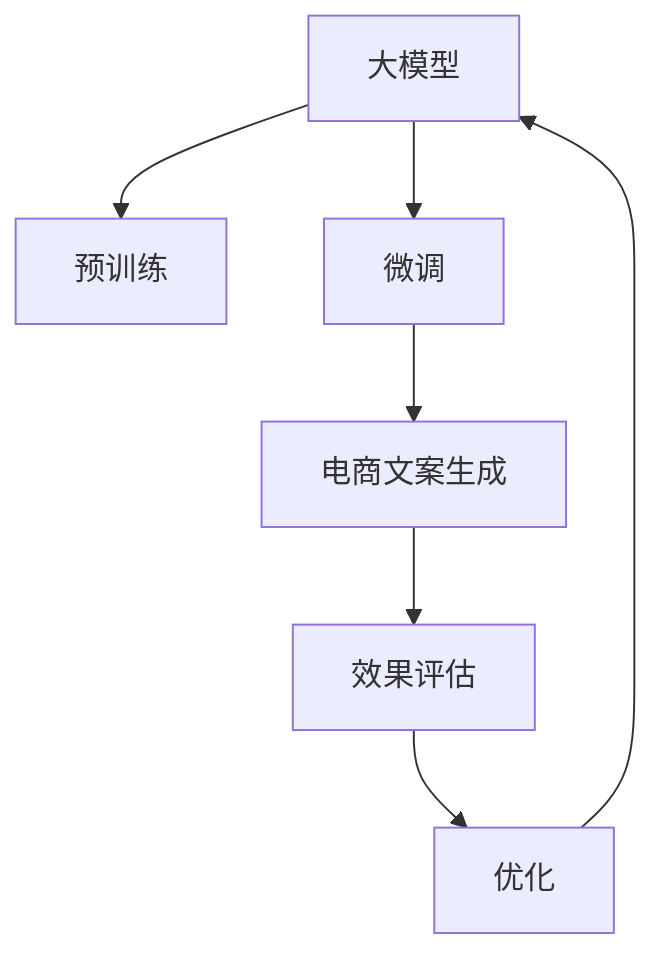

                 

# 探索基于大模型的电商智能营销文案生成系统

> 关键词：大模型,营销文案生成,自然语言处理(NLP),深度学习,预训练,微调,Fine-Tuning,电商智能营销

## 1. 背景介绍

### 1.1 问题由来

随着电商行业竞争的日益激烈，商家们纷纷寻找新的营销手段，以提高销售转化率。传统的搜索引擎优化(SEO)和付费广告(Search Ads, Display Ads)方式，成本高昂且效果难以持续。而基于大模型的智能营销文案生成系统，可以借助强大的自然语言处理能力，自动生成高质量的电商文案，大幅降低人力成本，提升营销效果。

具体来说，智能营销文案生成系统可以在电商产品描述、推广信息、广告语等文案创作中发挥作用，快速生成有吸引力的文案，节省时间成本，并提升用户点击率和购买率。同时，基于大模型的文案生成系统可以持续迭代优化，适应不同产品、不同用户群体的需求，实现个性化推荐和精准营销。

### 1.2 问题核心关键点

智能营销文案生成系统本质上是一种自然语言处理(NLP)技术，其核心在于通过大模型进行预训练和微调，生成符合特定电商场景需求的文案文本。因此，本文将重点介绍基于大模型的文案生成技术，包括预训练方法、微调技术、生成的文案效果评估等关键点。

本文的核心问题主要包括：

- 如何选择合适的预训练模型进行电商文案生成？
- 如何将预训练模型进行微调以适应电商场景？
- 如何评价生成的文案是否符合电商需求？
- 如何利用大模型的力量优化电商文案生成的效果？

## 2. 核心概念与联系

### 2.1 核心概念概述

在基于大模型的智能营销文案生成系统中，涉及到的核心概念包括：

- **大模型(Large Model)**：指基于Transformer架构的大规模预训练语言模型，如GPT-3、BERT、T5等。这些模型通过大规模语料进行预训练，具备强大的语言理解和生成能力。

- **预训练(Pre-training)**：指在大规模无标签文本数据上进行自监督学习任务，学习通用的语言表示，如语言建模、掩码语言模型等。预训练模型通过海量语料学的到丰富的语言知识和语义表示。

- **微调(Fine-tuning)**：指在预训练模型的基础上，通过有标签的数据进行微调，使其适应特定领域和任务。例如，电商营销文案生成系统可以通过电商领域的文本数据进行微调，学习电商广告语、产品描述等特定任务的文本生成。

- **自然语言处理(NLP)**：指使用计算机科学和人工智能技术，让计算机理解、分析、生成自然语言文本的技术。智能营销文案生成系统正是一种基于NLP技术的自动化文案生成工具。

- **深度学习(Deep Learning)**：指通过多层神经网络模型进行数据处理和特征提取的机器学习技术。预训练大模型通常基于深度学习架构进行训练，如BERT、GPT等。

- **电商智能营销**：指结合电商平台的数据、用户行为和营销策略，通过智能算法自动生成广告、促销信息等电商文案，提升电商转化率和经济效益。

这些核心概念共同构成了智能营销文案生成系统的基础架构，帮助其高效、准确地生成符合电商需求的文案。

### 2.2 核心概念联系

这些核心概念之间的逻辑关系可以通过以下Mermaid流程图来展示：



这个流程图展示了智能营销文案生成系统的核心流程：

1. 大模型通过预训练学习通用的语言表示。
2. 在电商场景的数据上进行微调，学习特定领域的语言表示。
3. 生成符合电商需求的高质量文案。
4. 对文案效果进行评估和优化，持续提升文案质量。
5. 通过优化后的大模型，重新开始预训练，形成良性循环。

## 3. 核心算法原理 & 具体操作步骤
### 3.1 算法原理概述

智能营销文案生成系统的核心算法原理是预训练和微调技术。具体来说，系统首先使用大规模无标签数据进行预训练，获得通用的语言模型。然后在电商领域的相关文本数据上进行微调，学习电商文案生成的特定知识。微调后的模型可以接受电商场景的任务输入，生成满足需求的文案。

形式化地，假设预训练模型为 $M_{\theta}$，其中 $\theta$ 为预训练得到的模型参数。电商领域的任务为 $T$，包括文案生成、广告语生成、产品描述生成等。假设任务 $T$ 的标注数据集为 $D=\{(x_i,y_i)\}_{i=1}^N$，其中 $x_i$ 为电商场景的输入文本，$y_i$ 为对应的生成文本。微调的目标是找到新的模型参数 $\hat{\theta}$，使得：

$$
\hat{\theta}=\mathop{\arg\min}_{\theta} \mathcal{L}(M_{\theta},D)
$$

其中 $\mathcal{L}$ 为针对任务 $T$ 设计的损失函数，用于衡量模型生成文本与真实标签之间的差异。

### 3.2 算法步骤详解

基于大模型的智能营销文案生成系统主要包括以下几个关键步骤：

**Step 1: 准备预训练模型和数据集**

- 选择合适的预训练语言模型 $M_{\theta}$，如BERT、GPT等。
- 收集电商领域的相关文本数据，如广告语、产品描述、促销信息等。将标注数据集 $D$ 划分为训练集、验证集和测试集。

**Step 2: 添加任务适配层**

- 根据电商文案生成的任务需求，设计合适的输出层和损失函数。
- 例如，对于文本生成任务，通常在顶层添加解码器输出概率分布，并以负对数似然为损失函数。

**Step 3: 设置微调超参数**

- 选择合适的优化算法及其参数，如AdamW、SGD等。
- 设置学习率、批大小、迭代轮数等。
- 设置正则化技术及强度，如L2正则、Dropout、Early Stopping等。

**Step 4: 执行梯度训练**

- 将电商数据集分批次输入模型，前向传播计算损失函数。
- 反向传播计算参数梯度，根据设定的优化算法和学习率更新模型参数。
- 周期性在验证集上评估模型性能，根据性能指标决定是否触发 Early Stopping。
- 重复上述步骤直到满足预设的迭代轮数或 Early Stopping 条件。

**Step 5: 测试和部署**

- 在测试集上评估微调后模型的性能，对比微调前后的文案质量。
- 使用微调后的模型对新输入进行推理预测，生成电商文案。
- 持续收集新的电商数据，定期重新微调模型，以适应数据分布的变化。

以上是基于大模型的智能营销文案生成系统的一般流程。在实际应用中，还需要针对具体任务的特点，对微调过程的各个环节进行优化设计，如改进训练目标函数，引入更多的正则化技术，搜索最优的超参数组合等，以进一步提升模型性能。

### 3.3 算法优缺点

基于大模型的智能营销文案生成系统具有以下优点：

- 生成文案质量高。预训练模型通过海量文本数据学习到丰富的语言知识和语义表示，微调后能够生成符合电商场景需求的文案。
- 自动化程度高。生成文案的过程全自动，节省人力成本。
- 适应性强。预训练模型具备广泛的领域适用性，微调后能够适应不同的电商场景。
- 可扩展性强。模型可以持续迭代优化，适应电商市场的多样化需求。

同时，该方法也存在一些局限性：

- 依赖标注数据。文案生成的效果很大程度上取决于标注数据的质量和数量，标注数据的获取成本较高。
- 模型复杂度高。预训练和微调需要高性能计算资源，模型的存储和推理消耗较大。
- 生成文案存在偏差。预训练模型可能存在性别、种族等偏见，生成的文案也可能具有相应的偏见。
- 对抗样本敏感。生成的文案可能被对抗样本攻击，导致系统安全性问题。

尽管存在这些局限性，但就目前而言，基于大模型的智能营销文案生成方法仍然是最主流的电商文案生成范式。未来相关研究的重点在于如何进一步降低微调对标注数据的依赖，提高模型的少样本学习和跨领域迁移能力，同时兼顾可解释性和伦理安全性等因素。

### 3.4 算法应用领域

智能营销文案生成系统已经在电商领域得到了广泛的应用，覆盖了广告文案生成、产品描述生成、促销信息生成等多个场景，为电商平台带来了显著的效益。

- **广告文案生成**：自动生成广告语、横幅广告等，提升广告点击率和转化率。
- **产品描述生成**：根据商品信息生成详细的产品描述，提高商品展示效果。
- **促销信息生成**：自动生成促销信息、折扣广告，吸引用户点击购买。

除了电商领域，智能营销文案生成系统还应用于社交媒体、旅游景区等场景，通过生成有吸引力的文案，提升品牌曝光度和用户参与度。随着预训练语言模型和微调方法的不断进步，相信智能文案生成系统将在更多领域发挥更大的作用。

## 4. 数学模型和公式 & 详细讲解  
### 4.1 数学模型构建

本节将使用数学语言对基于大模型的电商智能营销文案生成过程进行更加严格的刻画。

记预训练语言模型为 $M_{\theta}$，其中 $\theta$ 为预训练得到的模型参数。假设电商文案生成的任务为 $T$，训练集为 $D=\{(x_i,y_i)\}_{i=1}^N$，其中 $x_i$ 为电商场景的输入文本，$y_i$ 为对应的生成文本。

定义模型 $M_{\theta}$ 在数据样本 $(x,y)$ 上的损失函数为 $\ell(M_{\theta}(x),y)$，则在数据集 $D$ 上的经验风险为：

$$
\mathcal{L}(\theta) = \frac{1}{N} \sum_{i=1}^N \ell(M_{\theta}(x_i),y_i)
$$

微调的优化目标是最小化经验风险，即找到最优参数：

$$
\theta^* = \mathop{\arg\min}_{\theta} \mathcal{L}(\theta)
$$

在实践中，我们通常使用基于梯度的优化算法（如SGD、Adam等）来近似求解上述最优化问题。设 $\eta$ 为学习率，$\lambda$ 为正则化系数，则参数的更新公式为：

$$
\theta \leftarrow \theta - \eta \nabla_{\theta}\mathcal{L}(\theta) - \eta\lambda\theta
$$

其中 $\nabla_{\theta}\mathcal{L}(\theta)$ 为损失函数对参数 $\theta$ 的梯度，可通过反向传播算法高效计算。

### 4.2 公式推导过程

以下我们以文本生成任务为例，推导负对数似然损失函数及其梯度的计算公式。

假设模型 $M_{\theta}$ 在输入 $x$ 上的输出为 $\hat{y}=M_{\theta}(x) \in [0,1]$，表示样本属于正类的概率。真实标签 $y \in \{0,1\}$。则负对数似然损失函数定义为：

$$
\ell(M_{\theta}(x),y) = -[y\log \hat{y} + (1-y)\log (1-\hat{y})]
$$

将其代入经验风险公式，得：

$$
\mathcal{L}(\theta) = -\frac{1}{N}\sum_{i=1}^N [y_i\log M_{\theta}(x_i)+(1-y_i)\log(1-M_{\theta}(x_i))]
$$

根据链式法则，损失函数对参数 $\theta_k$ 的梯度为：

$$
\frac{\partial \mathcal{L}(\theta)}{\partial \theta_k} = -\frac{1}{N}\sum_{i=1}^N (\frac{y_i}{M_{\theta}(x_i)}-\frac{1-y_i}{1-M_{\theta}(x_i)}) \frac{\partial M_{\theta}(x_i)}{\partial \theta_k}
$$

其中 $\frac{\partial M_{\theta}(x_i)}{\partial \theta_k}$ 可进一步递归展开，利用自动微分技术完成计算。

在得到损失函数的梯度后，即可带入参数更新公式，完成模型的迭代优化。重复上述过程直至收敛，最终得到适应电商文案生成任务的最优模型参数 $\theta^*$。

## 5. 项目实践：代码实例和详细解释说明
### 5.1 开发环境搭建

在进行智能营销文案生成系统的实践前，我们需要准备好开发环境。以下是使用Python进行PyTorch开发的环境配置流程：

1. 安装Anaconda：从官网下载并安装Anaconda，用于创建独立的Python环境。

2. 创建并激活虚拟环境：
```bash
conda create -n pytorch-env python=3.8 
conda activate pytorch-env
```

3. 安装PyTorch：根据CUDA版本，从官网获取对应的安装命令。例如：
```bash
conda install pytorch torchvision torchaudio cudatoolkit=11.1 -c pytorch -c conda-forge
```

4. 安装Transformer库：
```bash
pip install transformers
```

5. 安装各类工具包：
```bash
pip install numpy pandas scikit-learn matplotlib tqdm jupyter notebook ipython
```

完成上述步骤后，即可在`pytorch-env`环境中开始智能营销文案生成系统的开发。

### 5.2 源代码详细实现

下面我们以广告文案生成任务为例，给出使用Transformers库对BERT模型进行智能营销文案生成的PyTorch代码实现。

首先，定义广告文案生成的数据处理函数：

```python
from transformers import BertTokenizer
from torch.utils.data import Dataset
import torch

class AdDataset(Dataset):
    def __init__(self, texts, labels, tokenizer, max_len=128):
        self.texts = texts
        self.labels = labels
        self.tokenizer = tokenizer
        self.max_len = max_len
        
    def __len__(self):
        return len(self.texts)
    
    def __getitem__(self, item):
        text = self.texts[item]
        label = self.labels[item]
        
        encoding = self.tokenizer(text, return_tensors='pt', max_length=self.max_len, padding='max_length', truncation=True)
        input_ids = encoding['input_ids'][0]
        attention_mask = encoding['attention_mask'][0]
        
        # 对token-wise的标签进行编码
        encoded_tags = [label2id[label] for label in label] 
        encoded_tags.extend([label2id['O']] * (self.max_len - len(encoded_tags)))
        labels = torch.tensor(encoded_tags, dtype=torch.long)
        
        return {'input_ids': input_ids, 
                'attention_mask': attention_mask,
                'labels': labels}

# 标签与id的映射
label2id = {'O': 0, 'good': 1, 'bad': 2}
id2label = {v: k for k, v in label2id.items()}

# 创建dataset
tokenizer = BertTokenizer.from_pretrained('bert-base-cased')

train_dataset = AdDataset(train_texts, train_labels, tokenizer)
dev_dataset = AdDataset(dev_texts, dev_labels, tokenizer)
test_dataset = AdDataset(test_texts, test_labels, tokenizer)
```

然后，定义模型和优化器：

```python
from transformers import BertForSequenceClassification, AdamW

model = BertForSequenceClassification.from_pretrained('bert-base-cased', num_labels=len(label2id))

optimizer = AdamW(model.parameters(), lr=2e-5)
```

接着，定义训练和评估函数：

```python
from torch.utils.data import DataLoader
from tqdm import tqdm
from sklearn.metrics import classification_report

device = torch.device('cuda') if torch.cuda.is_available() else torch.device('cpu')
model.to(device)

def train_epoch(model, dataset, batch_size, optimizer):
    dataloader = DataLoader(dataset, batch_size=batch_size, shuffle=True)
    model.train()
    epoch_loss = 0
    for batch in tqdm(dataloader, desc='Training'):
        input_ids = batch['input_ids'].to(device)
        attention_mask = batch['attention_mask'].to(device)
        labels = batch['labels'].to(device)
        model.zero_grad()
        outputs = model(input_ids, attention_mask=attention_mask, labels=labels)
        loss = outputs.loss
        epoch_loss += loss.item()
        loss.backward()
        optimizer.step()
    return epoch_loss / len(dataloader)

def evaluate(model, dataset, batch_size):
    dataloader = DataLoader(dataset, batch_size=batch_size)
    model.eval()
    preds, labels = [], []
    with torch.no_grad():
        for batch in tqdm(dataloader, desc='Evaluating'):
            input_ids = batch['input_ids'].to(device)
            attention_mask = batch['attention_mask'].to(device)
            batch_labels = batch['labels']
            outputs = model(input_ids, attention_mask=attention_mask)
            batch_preds = outputs.logits.argmax(dim=2).to('cpu').tolist()
            batch_labels = batch_labels.to('cpu').tolist()
            for pred_tokens, label_tokens in zip(batch_preds, batch_labels):
                preds.append(pred_tokens[:len(label_tokens)])
                labels.append(label_tokens)
                
    print(classification_report(labels, preds))
```

最后，启动训练流程并在测试集上评估：

```python
epochs = 5
batch_size = 16

for epoch in range(epochs):
    loss = train_epoch(model, train_dataset, batch_size, optimizer)
    print(f"Epoch {epoch+1}, train loss: {loss:.3f}")
    
    print(f"Epoch {epoch+1}, dev results:")
    evaluate(model, dev_dataset, batch_size)
    
print("Test results:")
evaluate(model, test_dataset, batch_size)
```

以上就是使用PyTorch对BERT进行广告文案生成任务的智能营销文案生成系统的完整代码实现。可以看到，得益于Transformers库的强大封装，我们可以用相对简洁的代码完成BERT模型的加载和微调。

### 5.3 代码解读与分析

让我们再详细解读一下关键代码的实现细节：

**AdDataset类**：
- `__init__`方法：初始化文本、标签、分词器等关键组件。
- `__len__`方法：返回数据集的样本数量。
- `__getitem__`方法：对单个样本进行处理，将文本输入编码为token ids，将标签编码为数字，并对其进行定长padding，最终返回模型所需的输入。

**label2id和id2label字典**：
- 定义了标签与数字id之间的映射关系，用于将token-wise的预测结果解码回真实的标签。

**训练和评估函数**：
- 使用PyTorch的DataLoader对数据集进行批次化加载，供模型训练和推理使用。
- 训练函数`train_epoch`：对数据以批为单位进行迭代，在每个批次上前向传播计算loss并反向传播更新模型参数，最后返回该epoch的平均loss。
- 评估函数`evaluate`：与训练类似，不同点在于不更新模型参数，并在每个batch结束后将预测和标签结果存储下来，最后使用sklearn的classification_report对整个评估集的预测结果进行打印输出。

**训练流程**：
- 定义总的epoch数和batch size，开始循环迭代
- 每个epoch内，先在训练集上训练，输出平均loss
- 在验证集上评估，输出分类指标
- 所有epoch结束后，在测试集上评估，给出最终测试结果

可以看到，PyTorch配合Transformers库使得BERT微调的代码实现变得简洁高效。开发者可以将更多精力放在数据处理、模型改进等高层逻辑上，而不必过多关注底层的实现细节。

当然，工业级的系统实现还需考虑更多因素，如模型的保存和部署、超参数的自动搜索、更灵活的任务适配层等。但核心的微调范式基本与此类似。

## 6. 实际应用场景
### 6.1 电商平台智能推荐

智能营销文案生成系统在电商平台中具有重要应用价值。通过分析用户行为数据，动态生成个性化的广告文案和产品描述，可以提升用户点击率和转化率，增加电商平台收益。

在技术实现上，系统可以收集用户浏览、点击、购买等行为数据，分析用户的兴趣偏好和购买习惯。然后利用预训练的模型进行微调，生成符合用户需求的广告文案和产品描述。将生成的文案嵌入到电商网站中，可以显著提升用户体验和购买意愿。

### 6.2 社交媒体广告

社交媒体平台如微信、微博等，拥有庞大的用户基础和活跃的社交氛围。通过智能营销文案生成系统，可以自动生成符合平台风格和用户喜好的广告文案，大幅提升广告点击率和互动率。

具体而言，系统可以从用户的历史互动数据中提取兴趣标签和偏好类型，利用这些信息生成针对性的广告文案。将生成的文案发布到社交媒体上，通过精准投放和智能推荐，吸引用户点击和参与，提升品牌知名度和用户粘性。

### 6.3 旅游景区营销

旅游景区是一个典型的B2C市场，需要持续进行营销推广。通过智能营销文案生成系统，可以自动生成具有吸引力的景区介绍、景点推广文案等，提升景区曝光度和游客参与度。

系统可以根据景区的特色和用户群体的需求，自动生成符合需求的文案。将生成的文案嵌入到景区网站和社交媒体上，可以吸引更多游客关注和参与，提升景区的品牌价值和旅游收入。

### 6.4 未来应用展望

随着智能营销文案生成技术的不断发展，未来的应用场景将更加广泛，覆盖更多垂直行业。

在智能家居领域，智能营销文案生成系统可以自动生成符合用户需求的家庭场景和设备使用指导，提升用户满意度和智能家居产品的普及率。

在医疗健康领域，系统可以自动生成患者咨询、医疗信息、健康提示等文案，提升用户的健康意识和医疗服务体验。

在教育培训领域，智能营销文案生成系统可以自动生成课程介绍、学习提示、考试指导等文案，提升教育培训机构的品牌影响力和用户体验。

此外，在金融、物流、公共服务等多个领域，基于大模型的智能营销文案生成系统也将不断涌现，为各个行业带来新的市场机遇和创新应用。

## 7. 工具和资源推荐
### 7.1 学习资源推荐

为了帮助开发者系统掌握智能营销文案生成系统的理论和实践技巧，这里推荐一些优质的学习资源：

1. 《深度学习与自然语言处理》书籍：由斯坦福大学教授撰写，全面介绍了深度学习和自然语言处理的基础知识和前沿技术。

2. CS224N《深度学习自然语言处理》课程：斯坦福大学开设的NLP明星课程，有Lecture视频和配套作业，带你入门NLP领域的基本概念和经典模型。

3. 《Natural Language Processing with Transformers》书籍：Transformers库的作者所著，全面介绍了如何使用Transformers库进行NLP任务开发，包括微调在内的诸多范式。

4. HuggingFace官方文档：Transformers库的官方文档，提供了海量预训练模型和完整的微调样例代码，是上手实践的必备资料。

5. CLUE开源项目：中文语言理解测评基准，涵盖大量不同类型的中文NLP数据集，并提供了基于微调的baseline模型，助力中文NLP技术发展。

通过对这些资源的学习实践，相信你一定能够快速掌握智能营销文案生成系统的精髓，并用于解决实际的NLP问题。
###  7.2 开发工具推荐

高效的开发离不开优秀的工具支持。以下是几款用于智能营销文案生成系统开发的常用工具：

1. PyTorch：基于Python的开源深度学习框架，灵活动态的计算图，适合快速迭代研究。大部分预训练语言模型都有PyTorch版本的实现。

2. TensorFlow：由Google主导开发的开源深度学习框架，生产部署方便，适合大规模工程应用。同样有丰富的预训练语言模型资源。

3. Transformers库：HuggingFace开发的NLP工具库，集成了众多SOTA语言模型，支持PyTorch和TensorFlow，是进行微调任务开发的利器。

4. Weights & Biases：模型训练的实验跟踪工具，可以记录和可视化模型训练过程中的各项指标，方便对比和调优。与主流深度学习框架无缝集成。

5. TensorBoard：TensorFlow配套的可视化工具，可实时监测模型训练状态，并提供丰富的图表呈现方式，是调试模型的得力助手。

6. Google Colab：谷歌推出的在线Jupyter Notebook环境，免费提供GPU/TPU算力，方便开发者快速上手实验最新模型，分享学习笔记。

合理利用这些工具，可以显著提升智能营销文案生成系统的开发效率，加快创新迭代的步伐。

### 7.3 相关论文推荐

智能营销文案生成系统的发展源于学界的持续研究。以下是几篇奠基性的相关论文，推荐阅读：

1. Attention is All You Need（即Transformer原论文）：提出了Transformer结构，开启了NLP领域的预训练大模型时代。

2. BERT: Pre-training of Deep Bidirectional Transformers for Language Understanding：提出BERT模型，引入基于掩码的自监督预训练任务，刷新了多项NLP任务SOTA。

3. Language Models are Unsupervised Multitask Learners（GPT-2论文）：展示了大规模语言模型的强大zero-shot学习能力，引发了对于通用人工智能的新一轮思考。

4. Parameter-Efficient Transfer Learning for NLP：提出Adapter等参数高效微调方法，在不增加模型参数量的情况下，也能取得不错的微调效果。

5. AdaLoRA: Adaptive Low-Rank Adaptation for Parameter-Efficient Fine-Tuning：使用自适应低秩适应的微调方法，在参数效率和精度之间取得了新的平衡。

这些论文代表了大语言模型微调技术的发展脉络。通过学习这些前沿成果，可以帮助研究者把握学科前进方向，激发更多的创新灵感。

## 8. 总结：未来发展趋势与挑战

### 8.1 总结

本文对基于大模型的智能营销文案生成系统进行了全面系统的介绍。首先阐述了智能营销文案生成系统的研究背景和意义，明确了预训练模型进行微调以生成电商文案的独特价值。其次，从原理到实践，详细讲解了微调的数学原理和关键步骤，给出了智能营销文案生成系统的完整代码实例。同时，本文还广泛探讨了智能营销文案生成系统在电商、社交媒体、旅游景区等场景的应用前景，展示了其巨大的潜力和应用价值。此外，本文精选了智能营销文案生成系统的学习资源和开发工具，力求为读者提供全方位的技术指引。

通过本文的系统梳理，可以看到，基于大模型的智能营销文案生成系统在提升电商转化率、丰富社交媒体内容、增强景区曝光度等方面具有重要应用价值。受益于大规模语料的预训练和微调方法，该系统能够快速生成高质量的电商文案，为电商、社交媒体、旅游景区等垂直行业带来显著的效益。未来，伴随预训练语言模型和微调方法的不断演进，基于大模型的智能营销文案生成系统必将在更多领域发挥重要作用，为各行业的数字化转型和智能化升级提供新的动力。

### 8.2 未来发展趋势

展望未来，智能营销文案生成系统的发展趋势包括：

1. 生成文案质量进一步提升。得益于更先进的预训练和微调技术，智能营销文案生成系统将生成更加精准、吸引人的文案，提升用户体验和广告效果。

2. 跨模态生成能力增强。未来的系统不仅能够生成文本文案，还能生成图像、视频等多模态内容，实现更丰富、更生动的广告形式。

3. 个性化推荐更加精准。智能营销文案生成系统将结合用户行为数据，生成更加个性化、针对性的文案，提升点击率和转化率。

4. 多任务学习成为常态。系统将具备多任务学习能力，能够同时处理多种营销任务，提升整体营销效果。

5. 低成本、高效能成为目标。随着计算资源的丰富和算法优化，智能营销文案生成系统将更加高效、低成本，更易于落地部署。

6. 系统安全性更加重视。系统将引入更多安全机制，防止对抗攻击和数据泄露，保障用户隐私和系统安全。

这些趋势凸显了智能营销文案生成系统的重要地位和发展前景。未来的系统将通过不断优化和创新，提升文案生成的质量和效率，为电商、社交媒体、旅游景区等多个领域带来新的变革和机遇。

### 8.3 面临的挑战

尽管智能营销文案生成系统已经取得了显著的进展，但在迈向更加智能化、普适化应用的过程中，它仍面临着诸多挑战：

1. 标注数据瓶颈。高质量的标注数据是微调系统性能的关键，标注成本较高，难以覆盖所有场景和需求。如何降低标注成本，提高数据利用效率，将是未来的重要课题。

2. 对抗攻击风险。生成的文案可能被对抗样本攻击，导致系统安全性问题。如何增强系统的鲁棒性和安全性，防止对抗攻击，将是重要的研究方向。

3. 内容生成多样性。自动生成的文案可能存在重复、陈旧等问题，缺乏多样性和新颖性。如何生成更具创意和差异化的文案，增强用户兴趣，将是未来的挑战。

4. 跨领域适应性。系统在面对不同领域、不同任务的文案生成时，可能存在适应性不足的问题。如何增强系统的泛化能力，适应更多领域的文案生成需求，将是重要的研究方向。

5. 生成效果可解释性。自动生成的文案可能缺乏可解释性，难以解释其生成逻辑和决策过程。如何增强系统的可解释性，提升用户信任和满意度，将是重要的研究方向。

6. 用户体验一致性。系统生成的文案需要与用户的历史互动数据保持一致性，避免生成不协调的文案。如何设计更高效的用户互动机制，提升用户体验，将是重要的研究方向。

这些挑战表明，智能营销文案生成系统在向更高效、更智能、更安全的方向演进过程中，还需不断进行技术创新和改进。只有通过持续努力，才能实现系统的广泛应用和落地，为各行业的数字化转型和智能化升级带来新的活力。

### 8.4 研究展望

面向未来，智能营销文案生成系统的研究展望包括：

1. 探索无监督和半监督微调方法。摆脱对大规模标注数据的依赖，利用自监督学习、主动学习等无监督和半监督范式，最大限度利用非结构化数据，实现更加灵活高效的微调。

2. 研究参数高效和计算高效的微调范式。开发更加参数高效的微调方法，在固定大部分预训练参数的同时，只更新极少量的任务相关参数。同时优化微调模型的计算图，减少前向传播和反向传播的资源消耗，实现更加轻量级、实时性的部署。

3. 融合因果和对比学习范式。通过引入因果推断和对比学习思想，增强智能营销文案生成系统的稳定性和鲁棒性，学习更加普适、鲁棒的语言表征，从而提升系统的泛化性和抗干扰能力。

4. 引入更多先验知识。将符号化的先验知识，如知识图谱、逻辑规则等，与神经网络模型进行巧妙融合，引导微调过程学习更准确、合理的语言模型。同时加强不同模态数据的整合，实现视觉、语音等多模态信息与文本信息的协同建模。

5. 结合因果分析和博弈论工具。将因果分析方法引入智能营销文案生成系统，识别出系统决策的关键特征，增强输出解释的因果性和逻辑性。借助博弈论工具刻画人机交互过程，主动探索并规避系统的脆弱点，提高系统稳定性。

6. 纳入伦理道德约束。在模型训练目标中引入伦理导向的评估指标，过滤和惩罚有偏见、有害的输出倾向。同时加强人工干预和审核，建立模型行为的监管机制，确保输出符合人类价值观和伦理道德。

这些研究方向的探索，必将引领智能营销文案生成系统迈向更高的台阶，为电商、社交媒体、旅游景区等多个领域带来新的变革和机遇。相信随着学界和产业界的共同努力，这些挑战终将一一被克服，智能营销文案生成系统必将在构建人机协同的智能时代中扮演越来越重要的角色。

## 9. 附录：常见问题与解答

**Q1：智能营销文案生成系统是否适用于所有电商场景？**

A: 智能营销文案生成系统适用于大多数电商场景，特别是具有较高用户参与度、关注度、互动性的电商平台。但对于一些需要特殊个性化定制的电商平台，如奢侈品、定制化产品等，系统需要进一步优化适配。

**Q2：智能营销文案生成系统如何保证生成的文案质量？**

A: 智能营销文案生成系统通过预训练模型和微调，生成符合电商场景的文案。为了保证文案质量，系统需要进行多轮优化和调整，包括文本多样性、广告效果评估、用户反馈收集等环节。同时，系统会持续收集用户行为数据，进行动态调整，确保文案生成效果的持续优化。

**Q3：智能营销文案生成系统如何保证文案生成的安全性？**

A: 智能营销文案生成系统需要引入安全机制，防止对抗样本攻击和数据泄露。常见的安全措施包括对抗样本检测、数据加密、用户隐私保护等。同时，系统需要引入人工审核机制，确保生成的文案符合法律法规和伦理道德标准。

**Q4：智能营销文案生成系统在电商领域的应用效果如何？**

A: 智能营销文案生成系统在电商领域的应用效果显著。通过对电商数据的学习和微调，系统能够生成符合电商场景的广告文案、产品描述、促销信息等，大幅提升用户点击率和转化率，增加电商平台收益。同时，系统能够持续迭代优化，适应电商市场的多样化需求，保持高效性。

**Q5：智能营销文案生成系统如何进行持续优化？**

A: 智能营销文案生成系统需要进行持续优化，以适应电商市场的不断变化。优化手段包括：
1. 数据收集：持续收集用户行为数据，更新电商数据集。
2. 模型微调：定期对模型进行微调，适应新的电商需求。
3. 算法改进：引入先进的预训练和微调算法，提升系统性能。
4. 用户反馈：收集用户对生成文案的反馈，进行动态调整。

通过持续优化，智能营销文案生成系统能够更好地适应电商市场的变化，提升文案生成的效果和用户满意度。

---

作者：禅与计算机程序设计艺术 / Zen and the Art of Computer Programming

