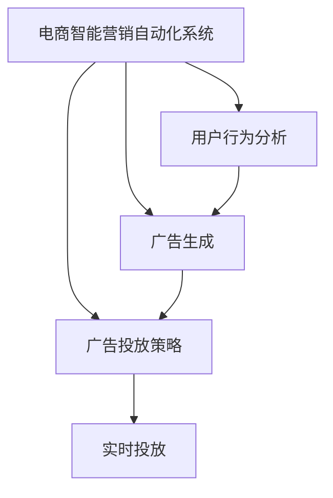

                 

# 探索基于大模型的电商智能营销自动化系统

## 1. 背景介绍

### 1.1 问题由来

随着电商市场的不断壮大，越来越多的商家开始重视数据驱动的智能营销。然而，传统的手工运营模式已经难以适应快速变化的市场需求。如何借助技术手段，自动化地进行市场细分、客户细分、广告投放等操作，提升营销效果和ROI，是电商商家面临的重要课题。

### 1.2 问题核心关键点

基于大模型的电商智能营销自动化系统，通过自动化分析用户行为数据，生成广告创意和投放策略，能够大幅提升电商广告投放的精准度和效果。其核心在于：

- 使用大规模预训练语言模型作为智能分析的核心。
- 自动分析用户行为，预测用户兴趣，生成个性化广告。
- 自动化生成投放策略，实时优化广告投放效果。
- 通过大模型微调，提升广告生成和投放策略的个性化和精准度。

### 1.3 问题研究意义

构建基于大模型的电商智能营销自动化系统，具有以下重要意义：

1. 提升广告效果。借助大模型分析用户行为，生成更加个性化、精准的广告创意和投放策略，提升广告点击率和转化率。
2. 降低运营成本。自动化广告生成和投放，减少人工干预，降低人力运营成本。
3. 快速响应市场变化。实时生成和调整广告策略，快速响应市场趋势和用户需求的变化。
4. 提高市场竞争力。通过精准营销，锁定目标客户群体，提高市场份额和品牌影响力。
5. 促进数字化转型。将传统营销流程自动化，推进电商企业的数字化转型和智能化升级。

## 2. 核心概念与联系

### 2.1 核心概念概述

为更好地理解基于大模型的电商智能营销自动化系统，本节将介绍几个密切相关的核心概念：

- 电商智能营销自动化系统(E-Commerce Intelligent Marketing Automation System)：利用人工智能技术，自动化地进行电商市场分析和广告投放的系统。包括用户行为分析、广告生成、投放策略优化等环节。
- 大模型(Large Model)：指基于大规模预训练语言模型，能够自动学习复杂语义关系，具备强大语言理解和生成能力的模型，如GPT、BERT等。
- 预训练(Pre-training)：指在大规模无标签文本数据上，通过自监督学习任务训练模型，使其学习到通用的语言表示。
- 微调(Fine-tuning)：指在预训练模型的基础上，使用下游任务的少量标注数据，通过有监督学习优化模型在特定任务上的性能。
- 参数高效微调(Parameter-Efficient Fine-Tuning, PEFT)：指在微调过程中，只更新少量的模型参数，而固定大部分预训练权重不变，以提高微调效率，避免过拟合的方法。
- 广告生成(Advertising Generation)：指根据用户行为数据，自动生成个性化广告创意的过程。
- 广告投放策略(Advertising Placement Strategy)：指根据用户行为和广告效果，自动调整广告投放时间、位置、频次等策略的过程。

这些核心概念之间的逻辑关系可以通过以下Mermaid流程图来展示：



这个流程图展示了大模型智能营销自动化系统的核心流程：

1. 从用户行为分析中提取特征，生成广告创意。
2. 自动生成广告投放策略。
3. 根据广告策略，实时投放广告。

这些核心概念共同构成了大模型智能营销自动化系统的关键组件，使其能够高效、智能地进行市场分析和广告投放。

## 3. 核心算法原理 & 具体操作步骤
### 3.1 算法原理概述

基于大模型的电商智能营销自动化系统，本质上是一个数据驱动的智能决策系统。其核心算法原理包括：

- 使用大规模预训练语言模型作为基础模型，自动分析用户行为，预测用户兴趣，生成个性化广告。
- 根据广告效果，实时调整广告投放策略，优化投放效果。
- 利用大模型微调技术，提升广告生成和投放策略的个性化和精准度。

具体而言，系统首先通过预训练模型对用户行为数据进行分析，提取用户特征。然后，使用微调技术对这些特征进行优化，生成个性化的广告创意和投放策略。最后，通过广告投放平台，自动化地投放广告，并实时监测和优化广告效果。

### 3.2 算法步骤详解

基于大模型的电商智能营销自动化系统，主要包括以下几个关键步骤：

**Step 1: 数据预处理**
- 收集用户行为数据，如浏览记录、点击记录、购买记录等。
- 清洗和标注数据，生成适合模型训练的标注样本。

**Step 2: 用户行为分析**
- 使用大模型自动分析用户行为数据，提取关键特征。
- 使用Transformer等深度学习模型，对用户行为数据进行编码。

**Step 3: 广告生成**
- 利用微调技术，将预训练模型转化为广告生成模型。
- 根据用户特征，自动生成个性化广告创意。

**Step 4: 广告投放策略优化**
- 根据广告投放效果，使用回归、分类等算法，优化广告投放策略。
- 实时调整广告投放时间、位置、频次等参数，提升广告效果。

**Step 5: 广告投放**
- 根据优化后的广告策略，自动化投放广告。
- 实时监测广告效果，记录投放数据，持续优化模型。

**Step 6: 用户反馈处理**
- 收集用户对广告的反馈，如点击率、转化率、投诉率等。
- 根据用户反馈，进一步优化广告创意和投放策略。

### 3.3 算法优缺点

基于大模型的电商智能营销自动化系统，具有以下优点：

1. 高效自动化。系统能够自动分析用户行为，生成个性化广告，优化广告投放策略，大幅提升广告投放效率。
2. 精准度提升。通过大模型微调，生成的广告更加精准，能够更好地匹配用户兴趣，提升广告效果。
3. 快速响应。系统能够实时监测广告效果，并快速调整投放策略，适应市场变化。
4. 成本降低。自动化广告生成和投放，减少人工干预，降低人力运营成本。

同时，该系统也存在一些局限性：

1. 数据依赖。系统的效果高度依赖于用户行为数据的质量和数量，获取高质量数据成本较高。
2. 模型复杂度。大模型参数量庞大，训练和推理资源消耗大，难以在低成本设备上运行。
3. 微调风险。微调过程中可能会破坏预训练模型的某些部分，影响广告生成和投放的准确性。
4. 可解释性不足。模型生成广告和优化策略的逻辑不透明，难以解释和调试。

尽管存在这些局限性，但就目前而言，基于大模型的电商智能营销自动化系统仍然是智能营销技术落地的重要范式。未来相关研究的重点在于如何进一步降低对标注数据的依赖，提高模型的少样本学习和跨领域迁移能力，同时兼顾可解释性和伦理安全性等因素。

### 3.4 算法应用领域

基于大模型的电商智能营销自动化系统，已经在电商广告投放、用户行为分析、个性化推荐等多个领域得到了广泛的应用，展示了其强大的生命力和应用潜力：

1. 电商广告投放：利用用户行为数据，自动生成和投放个性化广告，提升广告效果和转化率。
2. 用户行为分析：自动分析用户行为数据，提取关键特征，理解用户兴趣和需求。
3. 个性化推荐：根据用户兴趣，自动生成个性化推荐内容，提升用户体验和转化率。
4. 客户细分：自动划分客户群体，实现精准营销和资源优化。
5. 广告效果评估：自动评估广告效果，优化广告投放策略，提升广告预算使用效率。

此外，基于大模型的电商智能营销自动化系统，还被创新性地应用到更多场景中，如客户服务、市场分析、渠道管理等，为电商企业的数字化转型提供了新的动力。

## 4. 数学模型和公式 & 详细讲解
### 4.1 数学模型构建

本节将使用数学语言对基于大模型的电商智能营销自动化系统的算法过程进行更加严格的刻画。

记用户行为数据集为 $D=\{(x_i,y_i)\}_{i=1}^N, x_i \in \mathcal{X}, y_i \in \mathcal{Y}$，其中 $\mathcal{X}$ 为输入空间，$\mathcal{Y}$ 为输出空间。定义用户行为特征提取函数为 $f: \mathcal{X} \rightarrow \mathcal{F}$，其中 $\mathcal{F}$ 为特征空间。假设微调任务的训练集为 $D=\{(x_i,y_i)\}_{i=1}^N$，其中 $x_i$ 为用户行为数据，$y_i$ 为广告效果。

定义模型 $M_{\theta}$ 在用户行为特征 $f(x_i)$ 上的损失函数为 $\ell(M_{\theta}(f(x_i)),y_i)$，则在数据集 $D$ 上的经验风险为：

$$
\mathcal{L}(\theta) = \frac{1}{N}\sum_{i=1}^N \ell(M_{\theta}(f(x_i)),y_i)
$$

微调的优化目标是最小化经验风险，即找到最优参数：

$$
\theta^* = \mathop{\arg\min}_{\theta} \mathcal{L}(\theta)
$$

在实践中，我们通常使用基于梯度的优化算法（如SGD、Adam等）来近似求解上述最优化问题。设 $\eta$ 为学习率，$\lambda$ 为正则化系数，则参数的更新公式为：

$$
\theta \leftarrow \theta - \eta \nabla_{\theta}\mathcal{L}(\theta) - \eta\lambda\theta
$$

其中 $\nabla_{\theta}\mathcal{L}(\theta)$ 为损失函数对参数 $\theta$ 的梯度，可通过反向传播算法高效计算。

### 4.2 公式推导过程

以下我们以二分类任务为例，推导交叉熵损失函数及其梯度的计算公式。

假设模型 $M_{\theta}$ 在用户行为特征 $f(x_i)$ 上的输出为 $\hat{y}=M_{\theta}(f(x_i)) \in [0,1]$，表示用户对广告的反应。真实标签 $y \in \{0,1\}$。则二分类交叉熵损失函数定义为：

$$
\ell(M_{\theta}(f(x_i)),y) = -[y\log \hat{y} + (1-y)\log (1-\hat{y})]
$$

将其代入经验风险公式，得：

$$
\mathcal{L}(\theta) = -\frac{1}{N}\sum_{i=1}^N [y_i\log M_{\theta}(f(x_i))+(1-y_i)\log(1-M_{\theta}(f(x_i)))
$$

根据链式法则，损失函数对参数 $\theta_k$ 的梯度为：

$$
\frac{\partial \mathcal{L}(\theta)}{\partial \theta_k} = -\frac{1}{N}\sum_{i=1}^N (\frac{y_i}{M_{\theta}(f(x_i))}-\frac{1-y_i}{1-M_{\theta}(f(x_i))}) \frac{\partial M_{\theta}(f(x_i))}{\partial \theta_k}
$$

其中 $\frac{\partial M_{\theta}(f(x_i))}{\partial \theta_k}$ 可进一步递归展开，利用自动微分技术完成计算。

在得到损失函数的梯度后，即可带入参数更新公式，完成模型的迭代优化。重复上述过程直至收敛，最终得到适应下游任务的最优模型参数 $\theta^*$。

## 5. 项目实践：代码实例和详细解释说明
### 5.1 开发环境搭建

在进行基于大模型的电商智能营销自动化系统的开发前，我们需要准备好开发环境。以下是使用Python进行PyTorch开发的环境配置流程：

1. 安装Anaconda：从官网下载并安装Anaconda，用于创建独立的Python环境。

2. 创建并激活虚拟环境：
```bash
conda create -n pytorch-env python=3.8 
conda activate pytorch-env
```

3. 安装PyTorch：根据CUDA版本，从官网获取对应的安装命令。例如：
```bash
conda install pytorch torchvision torchaudio cudatoolkit=11.1 -c pytorch -c conda-forge
```

4. 安装Transformers库：
```bash
pip install transformers
```

5. 安装各类工具包：
```bash
pip install numpy pandas scikit-learn matplotlib tqdm jupyter notebook ipython
```

完成上述步骤后，即可在`pytorch-env`环境中开始系统开发。

### 5.2 源代码详细实现

下面我们以广告生成任务为例，给出使用Transformers库对GPT模型进行电商广告生成微调的PyTorch代码实现。

首先，定义广告生成任务的数据处理函数：

```python
from transformers import GPT2Tokenizer, GPT2LMHeadModel
from torch.utils.data import Dataset
import torch

class AdDataset(Dataset):
    def __init__(self, texts, labels, tokenizer, max_len=128):
        self.texts = texts
        self.labels = labels
        self.tokenizer = tokenizer
        self.max_len = max_len
        
    def __len__(self):
        return len(self.texts)
    
    def __getitem__(self, item):
        text = self.texts[item]
        label = self.labels[item]
        
        encoding = self.tokenizer(text, return_tensors='pt', max_length=self.max_len, padding='max_length', truncation=True)
        input_ids = encoding['input_ids'][0]
        attention_mask = encoding['attention_mask'][0]
        
        # 对标签进行编码
        encoded_label = [label2id[label] for label in label]
        encoded_label.extend([label2id['O']] * (self.max_len - len(encoded_label)))
        labels = torch.tensor(encoded_label, dtype=torch.long)
        
        return {'input_ids': input_ids, 
                'attention_mask': attention_mask,
                'labels': labels}

# 标签与id的映射
label2id = {'O': 0, 'buy': 1, 'click': 2, 'view': 3, 'crawl': 4}
id2label = {v: k for k, v in label2id.items()}

# 创建dataset
tokenizer = GPT2Tokenizer.from_pretrained('gpt2')

train_dataset = AdDataset(train_texts, train_labels, tokenizer)
dev_dataset = AdDataset(dev_texts, dev_labels, tokenizer)
test_dataset = AdDataset(test_texts, test_labels, tokenizer)
```

然后，定义模型和优化器：

```python
from transformers import GPT2LMHeadModel, AdamW

model = GPT2LMHeadModel.from_pretrained('gpt2')
model.num_labels = len(label2id)

optimizer = AdamW(model.parameters(), lr=2e-5)
```

接着，定义训练和评估函数：

```python
from torch.utils.data import DataLoader
from tqdm import tqdm
from sklearn.metrics import accuracy_score, precision_score, recall_score, f1_score

device = torch.device('cuda') if torch.cuda.is_available() else torch.device('cpu')
model.to(device)

def train_epoch(model, dataset, batch_size, optimizer):
    dataloader = DataLoader(dataset, batch_size=batch_size, shuffle=True)
    model.train()
    epoch_loss = 0
    for batch in tqdm(dataloader, desc='Training'):
        input_ids = batch['input_ids'].to(device)
        attention_mask = batch['attention_mask'].to(device)
        labels = batch['labels'].to(device)
        model.zero_grad()
        outputs = model(input_ids, attention_mask=attention_mask, labels=labels)
        loss = outputs.loss
        epoch_loss += loss.item()
        loss.backward()
        optimizer.step()
    return epoch_loss / len(dataloader)

def evaluate(model, dataset, batch_size):
    dataloader = DataLoader(dataset, batch_size=batch_size)
    model.eval()
    preds, labels = [], []
    with torch.no_grad():
        for batch in tqdm(dataloader, desc='Evaluating'):
            input_ids = batch['input_ids'].to(device)
            attention_mask = batch['attention_mask'].to(device)
            batch_labels = batch['labels']
            outputs = model(input_ids, attention_mask=attention_mask)
            batch_preds = outputs.logits.argmax(dim=2).to('cpu').tolist()
            batch_labels = batch_labels.to('cpu').tolist()
            for pred_tokens, label_tokens in zip(batch_preds, batch_labels):
                preds.append(pred_tokens[:len(label_tokens)])
                labels.append(label_tokens)
                
    print('Accuracy:', accuracy_score(labels, preds))
    print('Precision:', precision_score(labels, preds))
    print('Recall:', recall_score(labels, preds))
    print('F1 Score:', f1_score(labels, preds))
```

最后，启动训练流程并在测试集上评估：

```python
epochs = 5
batch_size = 16

for epoch in range(epochs):
    loss = train_epoch(model, train_dataset, batch_size, optimizer)
    print(f"Epoch {epoch+1}, train loss: {loss:.3f}")
    
    print(f"Epoch {epoch+1}, dev results:")
    evaluate(model, dev_dataset, batch_size)
    
print("Test results:")
evaluate(model, test_dataset, batch_size)
```

以上就是使用PyTorch对GPT进行电商广告生成任务微调的完整代码实现。可以看到，得益于Transformers库的强大封装，我们可以用相对简洁的代码完成GPT模型的加载和微调。

### 5.3 代码解读与分析

让我们再详细解读一下关键代码的实现细节：

**AdDataset类**：
- `__init__`方法：初始化广告文本、标签、分词器等关键组件。
- `__len__`方法：返回数据集的样本数量。
- `__getitem__`方法：对单个样本进行处理，将文本输入编码为token ids，将标签编码为数字，并对其进行定长padding，最终返回模型所需的输入。

**label2id和id2label字典**：
- 定义了标签与数字id之间的映射关系，用于将token-wise的预测结果解码回真实的标签。

**训练和评估函数**：
- 使用PyTorch的DataLoader对数据集进行批次化加载，供模型训练和推理使用。
- 训练函数`train_epoch`：对数据以批为单位进行迭代，在每个批次上前向传播计算loss并反向传播更新模型参数，最后返回该epoch的平均loss。
- 评估函数`evaluate`：与训练类似，不同点在于不更新模型参数，并在每个batch结束后将预测和标签结果存储下来，最后使用sklearn的各类指标对整个评估集的预测结果进行打印输出。

**训练流程**：
- 定义总的epoch数和batch size，开始循环迭代
- 每个epoch内，先在训练集上训练，输出平均loss
- 在验证集上评估，输出各类评估指标
- 所有epoch结束后，在测试集上评估，给出最终测试结果

可以看到，PyTorch配合Transformers库使得GPT微调的代码实现变得简洁高效。开发者可以将更多精力放在数据处理、模型改进等高层逻辑上，而不必过多关注底层的实现细节。

当然，工业级的系统实现还需考虑更多因素，如模型的保存和部署、超参数的自动搜索、更灵活的任务适配层等。但核心的微调范式基本与此类似。

## 6. 实际应用场景
### 6.1 智能推荐系统

基于大模型的电商智能营销自动化系统，可以广泛应用于智能推荐系统，实现更加精准的个性化推荐。

传统推荐系统往往依赖用户的历史行为数据，难以兼顾多样性和新颖性。而使用基于大模型的电商智能推荐系统，可以自动分析用户行为，生成个性化的广告创意和投放策略，实现更精准、多样化的推荐。

在技术实现上，可以收集用户浏览、点击、购买等行为数据，提取和用户交互的物品标题、描述、标签等文本内容。将文本内容作为模型输入，用户的后续行为（如是否点击、购买等）作为监督信号，在此基础上微调预训练语言模型。微调后的模型能够从文本内容中准确把握用户的兴趣点。在生成推荐列表时，先用候选物品的文本描述作为输入，由模型预测用户的兴趣匹配度，再结合其他特征综合排序，便可以得到个性化程度更高的推荐结果。

### 6.2 广告效果优化

传统的广告投放往往需要手动设计广告创意和投放策略，难以实时优化广告效果。基于大模型的电商智能营销自动化系统，可以自动分析广告投放数据，生成优化策略，实时调整广告投放参数，提升广告效果。

具体而言，可以收集广告的点击率、转化率、展示次数等数据，使用回归、分类等算法，对广告投放时间、位置、频次等参数进行优化。模型将自动生成优化后的广告投放策略，实时调整广告投放计划，提升广告预算使用效率。

### 6.3 市场细分

传统的市场细分依赖手动设计和问卷调查，难以全面、客观地分析市场和客户。基于大模型的电商智能营销自动化系统，可以自动分析用户行为数据，划分客户群体，实现更加全面、精准的市场细分。

在技术实现上，可以收集用户的行为数据，如浏览记录、点击记录、购买记录等。使用大模型自动分析这些数据，提取关键特征，划分客户群体，实现精准的市场细分。

### 6.4 客户关系管理

传统的客户关系管理依赖手动记录和维护客户信息，难以实时更新和处理客户需求。基于大模型的电商智能营销自动化系统，可以自动分析客户行为数据，生成客户画像，实现更加高效、自动化的客户关系管理。

在技术实现上，可以收集客户的行为数据，如购买记录、服务请求等。使用大模型自动分析这些数据，生成客户画像，实现自动化的客户关系管理。系统可以根据客户画像，自动推荐个性化的服务方案，提升客户满意度和忠诚度。

## 7. 工具和资源推荐
### 7.1 学习资源推荐

为了帮助开发者系统掌握大模型智能营销自动化技术的理论基础和实践技巧，这里推荐一些优质的学习资源：

1. 《深度学习理论与实践》系列博文：由深度学习专家撰写，涵盖深度学习基础、模型训练、模型评估等多个方面，适合初学者和进阶者。

2. 《深度学习中的注意力机制》课程：斯坦福大学开设的深度学习课程，重点讲解注意力机制在NLP任务中的应用，适合深度学习从业者。

3. 《广告推荐系统》书籍：深入讲解广告推荐系统的原理和实现，涵盖推荐算法、用户画像等多个方面，适合广告从业者和推荐系统开发者。

4. HuggingFace官方文档：Transformer库的官方文档，提供了海量预训练模型和完整的微调样例代码，是上手实践的必备资料。

5. AdKF-ND项目：AdKF-ND（Kaggle广告竞赛）项目的官方文档，展示了广告推荐系统的最新研究进展，适合了解前沿技术。

通过对这些资源的学习实践，相信你一定能够快速掌握大模型智能营销自动化技术的精髓，并用于解决实际的广告推荐问题。
###  7.2 开发工具推荐

高效的开发离不开优秀的工具支持。以下是几款用于大模型智能营销自动化系统开发的常用工具：

1. PyTorch：基于Python的开源深度学习框架，灵活动态的计算图，适合快速迭代研究。大部分预训练语言模型都有PyTorch版本的实现。

2. TensorFlow：由Google主导开发的开源深度学习框架，生产部署方便，适合大规模工程应用。同样有丰富的预训练语言模型资源。

3. Transformers库：HuggingFace开发的NLP工具库，集成了众多SOTA语言模型，支持PyTorch和TensorFlow，是进行广告推荐任务开发的利器。

4. Weights & Biases：模型训练的实验跟踪工具，可以记录和可视化模型训练过程中的各项指标，方便对比和调优。与主流深度学习框架无缝集成。

5. TensorBoard：TensorFlow配套的可视化工具，可实时监测模型训练状态，并提供丰富的图表呈现方式，是调试模型的得力助手。

6. Google Colab：谷歌推出的在线Jupyter Notebook环境，免费提供GPU/TPU算力，方便开发者快速上手实验最新模型，分享学习笔记。

合理利用这些工具，可以显著提升大模型智能营销自动化系统的开发效率，加快创新迭代的步伐。

### 7.3 相关论文推荐

大模型和智能营销自动化技术的发展源于学界的持续研究。以下是几篇奠基性的相关论文，推荐阅读：

1. Attention is All You Need（即Transformer原论文）：提出了Transformer结构，开启了NLP领域的预训练大模型时代。

2. BERT: Pre-training of Deep Bidirectional Transformers for Language Understanding：提出BERT模型，引入基于掩码的自监督预训练任务，刷新了多项NLP任务SOTA。

3. Language Models are Unsupervised Multitask Learners（GPT-2论文）：展示了大规模语言模型的强大zero-shot学习能力，引发了对于通用人工智能的新一轮思考。

4. Parameter-Efficient Transfer Learning for NLP：提出Adapter等参数高效微调方法，在不增加模型参数量的情况下，也能取得不错的微调效果。

5. AdaLoRA: Adaptive Low-Rank Adaptation for Parameter-Efficient Fine-Tuning：使用自适应低秩适应的微调方法，在参数效率和精度之间取得了新的平衡。

这些论文代表了大模型智能营销自动化技术的发展脉络。通过学习这些前沿成果，可以帮助研究者把握学科前进方向，激发更多的创新灵感。

## 8. 总结：未来发展趋势与挑战

### 8.1 总结

本文对基于大模型的电商智能营销自动化系统进行了全面系统的介绍。首先阐述了电商智能营销自动化系统的背景和意义，明确了其通过自动分析用户行为，生成个性化广告，自动化投放广告的核心价值。其次，从原理到实践，详细讲解了广告生成、投放策略优化等关键步骤，给出了广告生成任务的完整代码实例。同时，本文还广泛探讨了智能推荐系统、广告效果优化、市场细分、客户关系管理等实际应用场景，展示了智能营销自动化技术的广泛应用前景。此外，本文精选了智能营销自动化技术的各类学习资源，力求为读者提供全方位的技术指引。

通过本文的系统梳理，可以看到，基于大模型的电商智能营销自动化系统正在成为电商营销自动化技术落地的重要范式，极大地提升了电商广告投放的精准度和效果，降低了运营成本，加速了电商企业的数字化转型进程。未来，伴随大语言模型和微调方法的不断演进，基于大模型的电商智能营销自动化系统必将在电商营销自动化技术中发挥更大的作用，推动电商企业向更加智能化、自动化、高效化的方向发展。

### 8.2 未来发展趋势

展望未来，大模型智能营销自动化系统将呈现以下几个发展趋势：

1. 数据自动化采集。随着数据采集技术的不断进步，系统将能够自动化采集用户行为数据，实时分析市场趋势，实现智能营销的自动化和实时化。
2. 广告生成个性化提升。通过持续学习和微调，广告生成模型将能够更加精准地匹配用户兴趣，提升广告的点击率和转化率。
3. 广告投放策略优化。结合用户行为数据和市场反馈，系统将能够自动调整广告投放策略，实现广告预算的最大化使用。
4. 市场细分精准化。基于大模型的智能营销自动化系统将能够更全面、精准地分析市场和客户，实现精细化的市场细分和客户管理。
5. 推荐系统优化。结合用户画像和广告效果，系统将能够自动生成更加个性化的推荐结果，提升用户满意度和转化率。
6. 多模态数据融合。结合用户行为数据和市场反馈，系统将能够自动调整广告投放策略，实现广告预算的最大化使用。

以上趋势凸显了大模型智能营销自动化技术的广阔前景。这些方向的探索发展，必将进一步提升广告生成和投放的精准度，推动电商营销自动化技术向更加智能化、自动化、高效化的方向发展。

### 8.3 面临的挑战

尽管大模型智能营销自动化系统已经取得了瞩目成就，但在迈向更加智能化、普适化应用的过程中，它仍面临着诸多挑战：

1. 数据依赖。系统的效果高度依赖于用户行为数据的质量和数量，获取高质量数据成本较高。如何进一步降低对标注数据的依赖，提高系统的少样本学习和跨领域迁移能力，还需要更多理论和实践的积累。
2. 模型鲁棒性不足。当前模型面对域外数据时，泛化性能往往大打折扣。对于测试样本的微小扰动，模型也容易发生波动。如何提高模型的鲁棒性，避免灾难性遗忘，还需要更多理论和实践的积累。
3. 广告效果不稳定。广告生成和投放策略的优化往往需要大量的试错和调整，难以保证每次优化都能取得理想效果。如何构建更加稳定、可靠的优化算法，确保广告投放效果的稳定性，将是重要的研究方向。
4. 计算资源消耗大。大规模语言模型的训练和推理资源消耗大，难以在低成本设备上运行。如何优化模型结构，提高计算效率，降低资源消耗，将是重要的优化方向。
5. 用户隐私保护。用户行为数据的采集和使用涉及隐私保护问题，如何确保用户数据安全，避免数据滥用，将是重要的研究课题。
6. 模型公平性。大模型可能存在固有的偏见和歧视，如何确保模型输出公平，避免对特定群体的不公，将是重要的研究方向。

尽管存在这些挑战，但就目前而言，基于大模型的电商智能营销自动化系统仍然是智能营销技术落地的重要范式。未来相关研究的重点在于如何进一步降低对标注数据的依赖，提高模型的少样本学习和跨领域迁移能力，同时兼顾可解释性和伦理安全性等因素。

### 8.4 研究展望

面对大模型智能营销自动化系统所面临的挑战，未来的研究需要在以下几个方面寻求新的突破：

1. 探索无监督和半监督广告生成方法。摆脱对大规模标注数据的依赖，利用自监督学习、主动学习等无监督和半监督范式，最大限度利用非结构化数据，实现更加灵活高效的广告生成。
2. 研究参数高效和计算高效的广告生成方法。开发更加参数高效的广告生成方法，在固定大部分预训练参数的情况下，只更新极少量的任务相关参数。同时优化广告生成模型的计算图，减少前向传播和反向传播的资源消耗，实现更加轻量级、实时性的广告生成。
3. 引入更多先验知识。将符号化的先验知识，如知识图谱、逻辑规则等，与神经网络模型进行巧妙融合，引导广告生成过程学习更准确、合理的语言模型。同时加强不同模态数据的整合，实现视觉、语音等多模态信息与文本信息的协同建模。
4. 结合因果分析和博弈论工具。将因果分析方法引入广告生成模型，识别出模型决策的关键特征，增强输出解释的因果性和逻辑性。借助博弈论工具刻画人机交互过程，主动探索并规避模型的脆弱点，提高系统稳定性。
5. 纳入伦理道德约束。在模型训练目标中引入伦理导向的评估指标，过滤和惩罚有偏见、有害的输出倾向。同时加强人工干预和审核，建立模型行为的监管机制，确保输出符合人类价值观和伦理道德。

这些研究方向的探索，必将引领大模型智能营销自动化技术迈向更高的台阶，为构建安全、可靠、可解释、可控的智能系统铺平道路。面向未来，大模型智能营销自动化技术还需要与其他人工智能技术进行更深入的融合，如知识表示、因果推理、强化学习等，多路径协同发力，共同推动电商营销自动化技术的发展。只有勇于创新、敢于突破，才能不断拓展语言模型的边界，让智能技术更好地造福电商企业。

## 9. 附录：常见问题与解答

**Q1：如何评估广告生成模型的效果？**

A: 广告生成模型的效果可以通过以下指标进行评估：

1. 准确率：模型预测的广告类别与真实标签是否一致。
2. 点击率：用户点击广告的概率。
3. 转化率：用户完成购买等最终行为的概率。
4. A/B测试：通过对比不同广告生成的广告点击率和转化率，评估模型的效果。

**Q2：如何在保证广告效果的前提下，降低广告预算？**

A: 降低广告预算的同时保证广告效果，可以通过以下策略实现：

1. 精准定位：通过广告生成模型的精准定位，将广告投放给最有可能产生购买行为的用户。
2. 优化投放时间：选择用户活跃的时间段进行广告投放，提升广告点击率。
3. 广告素材优化：根据用户画像和行为数据，生成更加个性化、吸引人的广告素材。
4. 动态调整：根据实时反馈数据，动态调整广告投放策略，优化广告效果。

**Q3：如何避免广告生成模型对用户隐私的侵犯？**

A: 保护用户隐私是广告生成模型开发过程中必须重视的问题，以下是一些建议：

1. 匿名化处理：在收集用户数据时，使用匿名化处理，避免泄露用户身份信息。
2. 数据加密：对用户数据进行加密处理，确保数据传输和存储的安全性。
3. 合法合规：遵守相关法律法规，确保数据采集和使用的合法合规。
4. 用户知情：在收集用户数据前，确保用户知情同意，并提供隐私保护措施。

**Q4：广告生成模型在实际应用中，如何避免过拟合？**

A: 避免广告生成模型过拟合，可以从以下几个方面入手：

1. 数据扩充：通过数据增强技术，扩充训练集，避免模型对训练集过度拟合。
2. 正则化：使用L2正则、Dropout等正则化技术，防止模型过度适应训练数据。
3. 早停法：根据验证集性能，设置早停阈值，避免过拟合。
4. 参数高效微调：只更新极少量的模型参数，避免过拟合。

**Q5：如何处理广告投放策略优化中的数据稀疏性问题？**

A: 广告投放策略优化中的数据稀疏性问题可以通过以下策略解决：

1. 数据增强：通过数据增强技术，扩充训练集，减少数据稀疏性。
2. 迁移学习：利用在其他领域预训练的语言模型，提升广告生成模型的泛化能力。
3. 小样本学习：利用小样本学习技术，从少量标注数据中提取有用的信息，提升广告投放策略的优化效果。
4. 多任务学习：结合多个相关任务，共享参数，提高广告投放策略的优化效果。

这些方法可以相互结合，提升广告投放策略优化的效果，避免数据稀疏性问题对模型的影响。

---

作者：禅与计算机程序设计艺术 / Zen and the Art of Computer Programming

