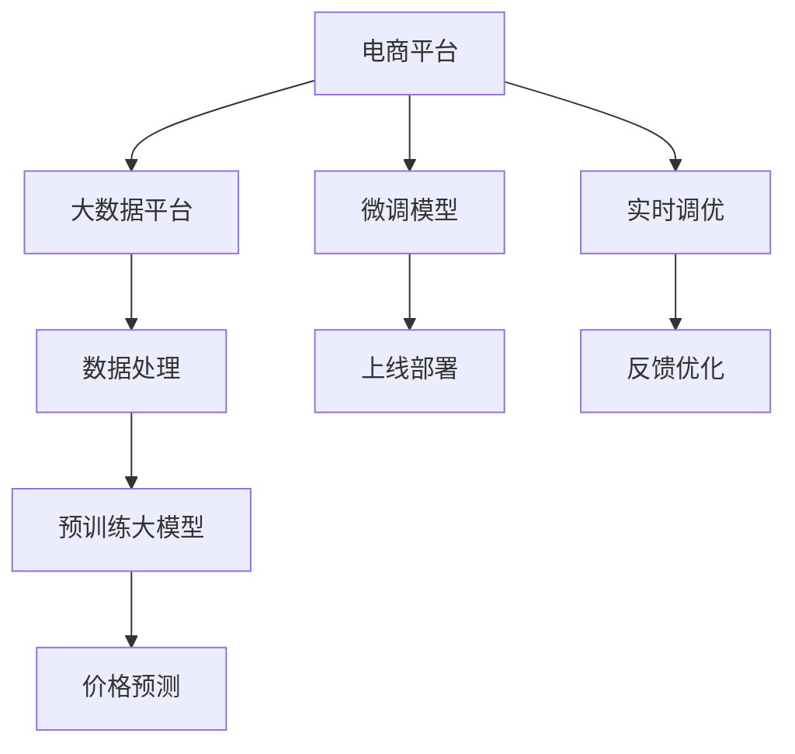

                 

# 探索大模型在电商平台价格预测中的潜力

## 1. 背景介绍

在数字化转型的大潮中，电商平台正在通过数据驱动的方式，不断优化商品价格策略，提升销售业绩。然而，价格预测作为其核心环节，依旧面临诸多挑战。传统的方法如回归模型、时间序列分析等，因依赖大量的特征工程，难以应对复杂的市场动态。而大模型凭借其强大的自适应能力，为电商平台价格预测带来了新的希望。

本文将详细探讨大模型在电商平台价格预测中的应用，从核心概念、算法原理到具体实践，全面解析其潜力与挑战。首先，我们将明确价格预测的核心概念，并深入分析其与大模型的联系。

## 2. 核心概念与联系

### 2.1 核心概念概述

为更好地理解大模型在价格预测中的应用，我们需要先了解以下核心概念：

- **价格预测(Pricing Prediction)**：通过预测商品在未来的价格，帮助电商平台制定更加精准的价格策略。
- **大模型(Large Model)**：指以自回归（如GPT）或自编码（如BERT）等架构为代表的大规模预训练语言模型，具备强大的语义理解和生成能力。
- **迁移学习(Transfer Learning)**：指将一个领域学到的知识，迁移到另一个相关领域的学习方法。大模型的预训练过程即是一种迁移学习方式。

### 2.2 核心概念原理和架构的 Mermaid 流程图



此图展示了电商平台利用大模型进行价格预测的整个流程：

1. 电商平台从大数据平台获取数据。
2. 数据经过处理后，输入到预训练大模型中。
3. 大模型通过迁移学习获取价格预测的能力。
4. 微调模型以适应特定电商平台的需求。
5. 模型上线部署，并进行实时调优和反馈优化。

### 2.3 核心概念间的联系

大模型在电商平台价格预测中的应用，主要体现在以下几个方面：

- **迁移学习**：利用大模型的预训练能力，快速获得价格预测的基础模型，减少从头训练的时间和成本。
- **微调**：针对特定电商平台的业务需求，通过少量标注数据对大模型进行微调，提升预测精度。
- **实时调优**：实时处理市场变化，通过反馈机制不断优化模型参数，提高价格预测的动态响应能力。

## 3. 核心算法原理 & 具体操作步骤

### 3.1 算法原理概述

基于大模型的价格预测，本质上是一种有监督学习的迁移学习过程。其核心思想是：将预训练的大模型作为基础模型，通过在电商平台的历史销售数据上进行微调，使其能够预测商品未来价格。

具体而言，假设电商平台历史销售数据为 $\{(x_i, y_i)\}_{i=1}^N$，其中 $x_i$ 为商品的特征向量，$y_i$ 为对应的价格。目标是找到最优的模型参数 $\theta^*$，使得模型在未见过的样本上能够获得好的预测性能：

$$
\theta^* = \mathop{\arg\min}_{\theta} \mathcal{L}(M_{\theta}, D)
$$

其中 $\mathcal{L}$ 为损失函数，$D$ 为电商平台历史销售数据集。

### 3.2 算法步骤详解

基于大模型的价格预测一般包括以下几个关键步骤：

**Step 1: 准备数据和模型**
- 收集电商平台的销售历史数据，包括商品特征和价格标签。
- 选择合适的预训练语言模型，如GPT、BERT等，作为基础模型。

**Step 2: 数据预处理**
- 清洗和标准化销售数据，去除异常值和噪声。
- 将数据转化为模型所需的输入格式，如TensorFlow、PyTorch格式。

**Step 3: 微调模型**
- 在历史销售数据上，使用一小部分标注数据对预训练模型进行微调。
- 选择合适的损失函数，如均方误差损失、交叉熵损失等。
- 设置合适的学习率和优化算法，如Adam、SGD等。

**Step 4: 评估和部署**
- 在验证集上评估微调后模型的性能，调整模型参数。
- 部署模型到实际应用中，进行实时价格预测。
- 持续收集新数据，周期性重新微调模型，以适应市场变化。

### 3.3 算法优缺点

基于大模型的价格预测具有以下优点：

- **通用性强**：大模型在预训练阶段已经学习了大量的语言知识，可以直接应用到多种任务中，无需重新训练。
- **精度高**：预训练模型通过大量数据的训练，具备较高的预测精度，能够处理复杂的市场动态。
- **参数高效**：可以通过参数高效微调方法，如LoRA、Prefix等，只调整少量参数，减少计算成本。

同时，该方法也存在一定的局限性：

- **依赖标注数据**：微调过程需要标注数据进行指导，标注数据的质量和数量直接影响模型效果。
- **过拟合风险**：微调模型在特定数据集上表现较好，但面对新数据时可能泛化能力不足。
- **资源消耗大**：大模型计算量大，对计算资源和存储资源有较高要求。

尽管有这些局限性，但就目前而言，基于大模型的价格预测方法仍是最主流的选择。未来相关研究的重点在于如何进一步降低对标注数据的依赖，提高模型的泛化能力和计算效率。

### 3.4 算法应用领域

基于大模型的价格预测在电商平台中具有广泛的应用场景：

- **价格动态调整**：实时监测市场价格变化，动态调整商品价格，以应对竞争和促销活动。
- **库存管理**：根据预测价格调整库存水平，优化存货成本和缺货风险。
- **推荐系统**：预测用户对商品价格的接受程度，指导个性化推荐策略，提升用户满意度。
- **风险评估**：预测价格波动，评估商品的市场风险，辅助风险控制。

## 4. 数学模型和公式 & 详细讲解 & 举例说明

### 4.1 数学模型构建

我们假设模型 $M_{\theta}$ 的输入为商品特征向量 $x_i$，输出为价格预测值 $\hat{y}_i$。则价格预测的数学模型可表示为：

$$
\hat{y}_i = M_{\theta}(x_i)
$$

目标是最小化预测值与实际价格之间的差异，常用的损失函数为均方误差损失函数：

$$
\mathcal{L} = \frac{1}{N} \sum_{i=1}^N (\hat{y}_i - y_i)^2
$$

### 4.2 公式推导过程

我们将均方误差损失函数代入模型参数更新公式中，有：

$$
\frac{\partial \mathcal{L}}{\partial \theta} = -\frac{2}{N} \sum_{i=1}^N (\hat{y}_i - y_i) \frac{\partial M_{\theta}(x_i)}{\partial \theta}
$$

其中 $\frac{\partial M_{\theta}(x_i)}{\partial \theta}$ 为模型的导数，通常需要通过反向传播算法计算。

### 4.3 案例分析与讲解

以一个简单的电商平台价格预测任务为例，假设我们有一个线性回归模型：

$$
\hat{y}_i = \theta_0 + \theta_1 x_{i1} + \theta_2 x_{i2} + \ldots + \theta_k x_{ik}
$$

其中 $\theta_0, \theta_1, \ldots, \theta_k$ 为模型参数。假设我们有以下数据集：

| 特征   | 商品价格 |
| ------ | ------- |
| 属性1   | 20.00   |
| 属性2   | 30.00   |
| 属性3   | 40.00   |
| 属性4   | 50.00   |

则均方误差损失函数为：

$$
\mathcal{L} = \frac{1}{4} [(20-20)^2 + (30-30)^2 + (40-40)^2 + (50-50)^2]
$$

计算得到 $\mathcal{L} = 0$，因此模型已经很好地拟合了数据。

## 5. 项目实践：代码实例和详细解释说明

### 5.1 开发环境搭建

在进行价格预测实践前，我们需要准备好开发环境。以下是使用Python进行TensorFlow开发的环境配置流程：

1. 安装Anaconda：从官网下载并安装Anaconda，用于创建独立的Python环境。

2. 创建并激活虚拟环境：
```bash
conda create -n tf-env python=3.8 
conda activate tf-env
```

3. 安装TensorFlow：根据CUDA版本，从官网获取对应的安装命令。例如：
```bash
conda install tensorflow tensorflow-gpu -c pytorch
```

4. 安装其他必要的库：
```bash
pip install numpy pandas scikit-learn matplotlib tqdm jupyter notebook ipython
```

完成上述步骤后，即可在`tf-env`环境中开始价格预测实践。

### 5.2 源代码详细实现

下面我们以电商平台价格预测任务为例，给出使用TensorFlow进行价格预测的代码实现。

首先，定义数据预处理函数：

```python
import tensorflow as tf
import numpy as np
from tensorflow.keras import layers, models

def preprocess_data(data, feature_cols, label_col):
    features = {}
    for col in feature_cols:
        features[col] = data[col].values
    features[label_col] = data[label_col].values
    features = pd.DataFrame(features)
    return features
```

然后，定义模型和训练函数：

```python
def create_model():
    model = models.Sequential([
        layers.Dense(32, activation='relu', input_shape=(len(feature_cols),)),
        layers.Dense(1)
    ])
    model.compile(optimizer=tf.keras.optimizers.Adam(0.01), loss='mse')
    return model

def train_model(model, train_features, train_labels, epochs=10):
    model.fit(train_features, train_labels, epochs=epochs, validation_split=0.2)
```

接下来，定义价格预测函数：

```python
def predict_price(model, test_features):
    test_predictions = model.predict(test_features)
    return test_predictions
```

最后，启动训练流程并在测试集上评估：

```python
from sklearn.model_selection import train_test_split

# 假设数据集已加载为pandas DataFrame
features = preprocess_data(data, feature_cols, label_col)
train_features, test_features, train_labels, test_labels = train_test_split(features, labels, test_size=0.2)

# 创建并训练模型
model = create_model()
train_model(model, train_features, train_labels)

# 在测试集上评估模型
test_predictions = predict_price(model, test_features)
print('Test MSE:', np.mean((test_labels - test_predictions)**2))
```

以上就是使用TensorFlow进行电商平台价格预测任务的完整代码实现。可以看到，TensorFlow的API使得模型训练和预测变得简洁高效。

### 5.3 代码解读与分析

让我们再详细解读一下关键代码的实现细节：

**preprocess_data函数**：
- 定义了数据预处理的基本逻辑，将特征和标签提取为NumPy数组，并将DataFrame格式的数据转化为字典格式。

**create_model函数**：
- 定义了一个包含两层全连接神经网络的模型，第一层为隐藏层，第二层为输出层，输出为商品价格的预测值。

**train_model函数**：
- 使用`fit`方法进行模型训练，设定训练轮数和验证集比例。

**predict_price函数**：
- 使用模型进行预测，返回预测结果。

**训练流程**：
- 将数据集拆分为训练集和测试集，用训练集训练模型，并在测试集上评估模型性能。

可以看到，TensorFlow提供了便捷的API，使得模型构建、训练和预测变得非常直观。开发者可以根据具体任务，对模型结构进行灵活调整，以满足实际需求。

## 6. 实际应用场景

### 6.1 智能定价策略

基于大模型的价格预测，电商平台可以实时调整商品价格，制定更加精准的定价策略。通过历史销售数据进行微调，模型能够准确预测商品的市场需求和价格变化，从而指导定价决策。例如，某商品在促销期间价格大幅下降，模型预测该商品未来价格将回升，电商平台即可提前调整价格，避免价格战对利润的影响。

### 6.2 库存优化管理

预测商品的未来价格，电商平台可以更好地进行库存管理。通过预测未来价格，平台可以优化商品的库存水平，减少库存积压和缺货风险。例如，某商品在未来价格预期下降，平台可以通过促销等方式加速销售，避免过多库存积压。同时，对于价格预期上涨的商品，平台可以增加库存，满足未来需求。

### 6.3 个性化推荐

电商平台可以利用价格预测模型进行个性化推荐，提升用户体验。通过预测用户对商品价格的接受程度，平台可以推荐更符合用户期望的商品，提高用户的购买意愿。例如，某用户倾向于购买低价商品，平台可以推荐一些价格预期下降的商品，满足其需求。

### 6.4 风险管理

电商平台可以利用价格预测模型进行风险管理，减少市场波动对业务的影响。通过预测价格波动，平台可以提前调整风险控制策略，降低市场风险。例如，某商品在未来价格预期大幅上涨，平台可以增加采购量，降低成本。

## 7. 工具和资源推荐

### 7.1 学习资源推荐

为了帮助开发者系统掌握基于大模型的价格预测理论基础和实践技巧，这里推荐一些优质的学习资源：

1. 《深度学习》系列书籍：深入浅出地介绍了深度学习的理论基础和实践应用，适合初学者和进阶者。

2. CS231n《深度学习视觉》课程：斯坦福大学开设的计算机视觉经典课程，涵盖深度学习在计算机视觉中的应用，包括图像识别、目标检测等。

3. 《TensorFlow实战》书籍：TensorFlow官方出版的实战书籍，全面介绍了TensorFlow的各个模块和应用场景。

4. Kaggle在线竞赛平台：提供大量数据集和开源代码，适合进行数据科学和机器学习的实践和研究。

5. GitHub开源项目：集成了大量的预训练模型和微调代码，适合学习者的学习和参考。

通过对这些资源的学习实践，相信你一定能够快速掌握基于大模型的价格预测精髓，并用于解决实际的电商平台问题。

### 7.2 开发工具推荐

高效的开发离不开优秀的工具支持。以下是几款用于基于大模型的价格预测开发的常用工具：

1. TensorFlow：由Google主导开发的开源深度学习框架，生产部署方便，适合大规模工程应用。

2. PyTorch：基于Python的开源深度学习框架，灵活动态的计算图，适合快速迭代研究。

3. Jupyter Notebook：支持多种编程语言，适合进行数据处理和模型训练，方便协作和共享。

4. Weights & Biases：模型训练的实验跟踪工具，可以记录和可视化模型训练过程中的各项指标，方便对比和调优。

5. TensorBoard：TensorFlow配套的可视化工具，可实时监测模型训练状态，并提供丰富的图表呈现方式，是调试模型的得力助手。

合理利用这些工具，可以显著提升基于大模型的价格预测任务的开发效率，加快创新迭代的步伐。

### 7.3 相关论文推荐

大模型和价格预测技术的发展源于学界的持续研究。以下是几篇奠基性的相关论文，推荐阅读：

1. Attention is All You Need：提出了Transformer结构，开启了NLP领域的预训练大模型时代。

2. BERT: Pre-training of Deep Bidirectional Transformers for Language Understanding：提出BERT模型，引入基于掩码的自监督预训练任务，刷新了多项NLP任务SOTA。

3. Learning Transferable Feature Extraction with Deep Transferable Networks：提出大模型迁移学习的方法，显著提升了迁移学习的性能。

4. Understanding the Difficulties of Transfer Learning：深入分析了迁移学习中的挑战和解决方案，为后续研究提供了理论基础。

5. Multi-Task Learning as Transfer Learning for Sequential Models：研究了多任务学习在时间序列预测中的应用，进一步提升了预测模型的性能。

这些论文代表了大模型在价格预测中的研究脉络。通过学习这些前沿成果，可以帮助研究者把握学科前进方向，激发更多的创新灵感。

## 8. 总结：未来发展趋势与挑战

### 8.1 总结

本文对基于大模型的电商平台价格预测方法进行了全面系统的介绍。首先阐述了价格预测的核心概念，并深入分析了其与大模型的联系。其次，从原理到实践，详细讲解了基于大模型的价格预测数学模型和算法步骤，给出了价格预测任务开发的完整代码实例。同时，本文还广泛探讨了基于大模型的价格预测在电商平台中的应用场景，展示了其潜力。

通过本文的系统梳理，可以看到，基于大模型的价格预测方法为电商平台带来了新的希望。其强大的自适应能力和高精度预测能力，有望在电商场景中大放异彩。

### 8.2 未来发展趋势

展望未来，大模型在电商平台价格预测中的应用将呈现以下几个发展趋势：

1. **模型规模持续增大**：随着算力成本的下降和数据规模的扩张，预训练语言模型的参数量还将持续增长。超大规模语言模型蕴含的丰富语言知识，有望支撑更加复杂多变的价格预测任务。

2. **微调方法日趋多样**：除了传统的全参数微调外，未来会涌现更多参数高效的微调方法，如LoRA、Prefix等，在节省计算资源的同时也能保证微调精度。

3. **持续学习成为常态**：随着市场数据分布的不断变化，价格预测模型也需要持续学习新知识以保持性能。如何在不遗忘原有知识的同时，高效吸收新样本信息，将成为重要的研究课题。

4. **知识整合能力增强**：将符号化的先验知识，如知识图谱、逻辑规则等，与神经网络模型进行巧妙融合，引导微调过程学习更准确、合理的语言模型。同时加强不同模态数据的整合，实现视觉、语音等多模态信息与文本信息的协同建模。

5. **多任务学习**：将多个价格预测任务整合，利用模型共享隐含的知识，提高预测的效率和精度。例如，同时预测商品价格、销售量、市场份额等指标。

6. **动态定价**：实时监测市场价格变化，动态调整商品价格，以应对竞争和促销活动。通过历史销售数据进行微调，模型能够准确预测商品的市场需求和价格变化，从而指导定价决策。

以上趋势凸显了大模型在电商平台价格预测中的巨大潜力。这些方向的探索发展，必将进一步提升电商平台价格预测的精度和实时性，为业务优化和客户体验带来新的突破。

### 8.3 面临的挑战

尽管大模型在电商平台价格预测中已经取得了显著效果，但在迈向更加智能化、普适化应用的过程中，它仍面临诸多挑战：

1. **数据依赖问题**：微调过程需要大量的标注数据，获取高质量标注数据的成本较高。如何进一步降低微调对标注数据的依赖，将是未来研究的重要方向。

2. **泛化能力不足**：大模型面对特定市场数据时，泛化能力可能不够强。如何在保持模型泛化能力的同时，提升其在新数据上的预测精度，还需要更多理论和实践的积累。

3. **计算成本高昂**：大模型的计算量较大，对计算资源和存储资源有较高要求。如何在保证模型精度的同时，降低计算成本，仍是未来的重要课题。

4. **模型可解释性不足**：大模型的决策过程通常缺乏可解释性，难以对其推理逻辑进行分析和调试。如何赋予模型更强的可解释性，将是亟待攻克的难题。

5. **模型鲁棒性不足**：大模型容易受到对抗样本的攻击，导致预测结果出现偏差。如何增强模型的鲁棒性，提高其对抗样本的抵抗能力，将是一个重要的研究方向。

6. **数据隐私问题**：电商平台涉及大量用户隐私数据，如何保护数据隐私，避免数据泄露，将是未来研究的重要课题。

这些挑战都需要在未来的研究中加以解决，才能使大模型在电商平台价格预测中得到更广泛的应用。

### 8.4 研究展望

未来研究需要在以下几个方面寻求新的突破：

1. **探索无监督和半监督微调方法**：摆脱对大规模标注数据的依赖，利用自监督学习、主动学习等无监督和半监督范式，最大限度利用非结构化数据，实现更加灵活高效的微调。

2. **研究参数高效和计算高效的微调范式**：开发更加参数高效的微调方法，在固定大部分预训练参数的同时，只更新极少量的任务相关参数。同时优化微调模型的计算图，减少前向传播和反向传播的资源消耗，实现更加轻量级、实时性的部署。

3. **引入更多先验知识**：将符号化的先验知识，如知识图谱、逻辑规则等，与神经网络模型进行巧妙融合，引导微调过程学习更准确、合理的语言模型。同时加强不同模态数据的整合，实现视觉、语音等多模态信息与文本信息的协同建模。

4. **结合因果分析和博弈论工具**：将因果分析方法引入微调模型，识别出模型决策的关键特征，增强输出解释的因果性和逻辑性。借助博弈论工具刻画人机交互过程，主动探索并规避模型的脆弱点，提高系统稳定性。

5. **纳入伦理道德约束**：在模型训练目标中引入伦理导向的评估指标，过滤和惩罚有偏见、有害的输出倾向。同时加强人工干预和审核，建立模型行为的监管机制，确保输出符合人类价值观和伦理道德。

这些研究方向的探索，必将引领基于大模型的价格预测技术迈向更高的台阶，为电商平台的智能化转型提供有力支持。面向未来，大模型价格预测技术还需要与其他人工智能技术进行更深入的融合，如知识表示、因果推理、强化学习等，多路径协同发力，共同推动电商平台的数字化转型。

## 9. 附录：常见问题与解答

**Q1：电商平台价格预测需要哪些特征？**

A: 电商平台价格预测需要收集商品的多种特征，包括但不限于：
1. 商品类别：例如，是否为电子产品、服饰等。
2. 商品品质：例如，品牌、尺寸、颜色等。
3. 商品价格历史：例如，过去的销售价格、促销价格等。
4. 市场趋势：例如，宏观经济数据、季节性变化等。
5. 竞争对手信息：例如，竞争对手的价格、促销活动等。

**Q2：电商平台价格预测的模型如何选择？**

A: 电商平台价格预测的模型选择需考虑多个因素：
1. 数据规模：对于小规模数据集，可以选择线性回归、决策树等简单模型。对于大规模数据集，可以选择神经网络、支持向量机等复杂模型。
2. 预测精度：需要根据实际需求选择预测精度较高的模型，如XGBoost、LightGBM等。
3. 计算资源：需要考虑模型的计算资源消耗，避免过度依赖GPU等高性能设备。
4. 可解释性：需要考虑模型的可解释性，以便于业务理解和调整。

**Q3：电商平台价格预测的模型如何训练？**

A: 电商平台价格预测的模型训练一般包括以下步骤：
1. 数据预处理：清洗和标准化销售数据，去除异常值和噪声。
2. 特征工程：设计合适的特征，提升模型预测能力。
3. 模型选择：选择合适的模型架构，如线性回归、神经网络等。
4. 模型训练：在历史销售数据上训练模型，优化模型参数。
5. 模型评估：在验证集上评估模型性能，调整模型参数。

**Q4：电商平台价格预测的模型如何部署？**

A: 电商平台价格预测的模型部署一般包括以下步骤：
1. 模型优化：对模型进行裁剪、量化等优化，减少资源消耗。
2. 模型封装：将模型封装为API接口，便于集成调用。
3. 服务器搭建：部署到服务器上，支持高并发访问。
4. 监控告警：实时采集模型性能指标，设置告警阈值，确保系统稳定。

通过以上步骤，电商平台可以构建稳定、高效的预测系统，为业务决策提供有力支持。

**Q5：电商平台价格预测的模型如何优化？**

A: 电商平台价格预测的模型优化一般包括以下步骤：
1. 数据更新：持续收集新数据，更新模型。
2. 模型调整：根据市场变化，调整模型参数。
3. 算法改进：优化算法，提高模型效率和精度。
4. 硬件升级：升级服务器设备，提升计算能力。
5. 系统优化：优化系统架构，提高响应速度和稳定性。

通过以上优化，电商平台可以不断提升价格预测模型的性能，适应市场变化，提高业务决策的准确性。

---

作者：禅与计算机程序设计艺术 / Zen and the Art of Computer Programming

