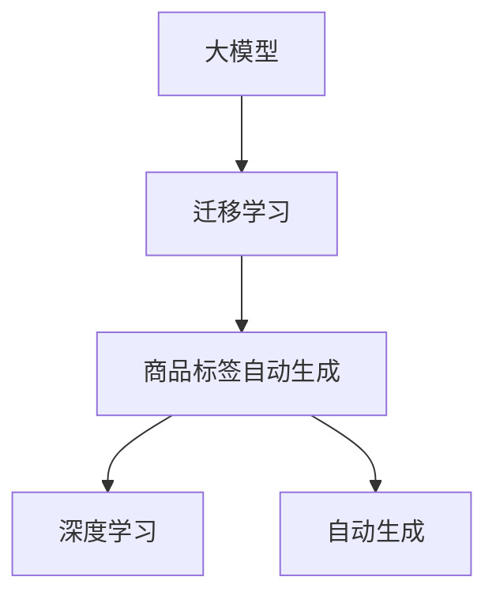

                 

# 探讨大模型在电商平台商品标签自动生成中的作用

> 关键词：电商平台,商品标签,大模型,自然语言处理(NLP),自动生成,深度学习,Transformer模型

## 1. 背景介绍

### 1.1 问题由来
随着电子商务的迅速发展，电商平台上的商品种类和数量呈爆炸性增长。消费者在浏览商品时，往往需要耗费大量时间阅读商品描述，才能对商品有一个清晰的认识。然而，传统的商品描述方式仍然存在诸多局限：

- **信息冗余：**商品描述通常包含大量重复和冗余的信息，消费者需要从中提取有用信息。
- **信息丢失：**商品描述中可能缺少关键信息，消费者需要猜测商品的实际功能或用途。
- **信息不对称：**不同消费者对商品的理解可能存在差异，商品描述可能无法满足所有消费者的需求。

为了解决上述问题，电商平台引入了商品标签（Product Tags）。商品标签是一种简明扼要的文本，概括了商品的主要特点和用途。它不仅能帮助消费者快速了解商品，还能优化搜索引擎的排序算法，提升电商平台的销售转化率。然而，自动生成商品标签的技术仍面临挑战：

- **数据稀疏：**商品标签通常是由人工标注的，数量较少，难以构建大规模标注数据集。
- **标签多样：**不同商品对应的标签组合多样，难以构建统一的标签生成模型。
- **上下文关联：**商品标签需要考虑上下文信息，例如商品类别、相关商品等。

近年来，大模型（Large Model）在自然语言处理（NLP）领域取得了突破性进展。以BERT、GPT-3为代表的预训练语言模型，通过在大规模无标签文本数据上进行自监督预训练，学习了丰富的语言知识和常识。基于大模型的迁移学习（Transfer Learning）方法，能够在大规模预训练模型的基础上，通过小规模标注数据进行微调，生成准确、多样化的商品标签。本文将探讨大模型在电商平台商品标签自动生成中的作用，并对相关算法和技术进行详细阐述。

## 2. 核心概念与联系

### 2.1 核心概念概述

为更好地理解大模型在商品标签自动生成中的应用，本节将介绍几个关键概念：

- **大模型（Large Model）**：指预训练模型，如BERT、GPT-3等，通过在大规模无标签文本数据上进行自监督预训练，学习通用的语言表示。
- **迁移学习（Transfer Learning）**：指在大规模预训练模型的基础上，通过小规模标注数据进行微调，适应特定任务。
- **商品标签（Product Tags）**：用于概括商品的主要特点和用途的简明扼要的文本。
- **自动生成（Automatic Generation）**：通过算法自动生成商品标签，避免人工标注的繁琐和误差。
- **深度学习（Deep Learning）**：基于神经网络的机器学习技术，能够处理复杂非线性问题。

这些概念之间的逻辑关系可以通过以下Mermaid流程图来展示：



这个流程图展示了大模型在商品标签自动生成中的应用流程：

1. 大模型通过自监督预训练获得通用的语言表示。
2. 基于大模型的迁移学习，通过小规模标注数据进行微调。
3. 深度学习技术用于商品标签的自动生成。
4. 自动生成商品标签，方便消费者快速了解商品。

## 3. 核心算法原理 & 具体操作步骤
### 3.1 算法原理概述

大模型在商品标签自动生成中的作用是通过迁移学习实现的。具体而言，步骤如下：

1. **预训练模型选择**：选择大规模预训练语言模型，如BERT、GPT-3等，作为初始化参数。
2. **标签数据准备**：收集商品标签相关的数据，将其转化为训练样本。
3. **微调**：将预训练模型在商品标签数据上进行微调，生成商品标签。
4. **评估和优化**：评估生成的商品标签，根据评价指标进行优化。

### 3.2 算法步骤详解

#### Step 1: 数据预处理
商品标签数据通常包含商品标题、描述和标签。首先需要进行数据清洗和预处理，去除无效和无关信息，并将标签转化为数值形式。

#### Step 2: 标签数据构建
将商品标签相关的文本和标签构建为训练样本，每个样本包含文本和对应的标签。例如，对于商品标题“全自动咖啡机”，可以构建两个训练样本：“全自动咖啡机”和“咖啡机”。

#### Step 3: 模型选择和初始化
选择预训练模型BERT，将其作为初始化参数。可以使用Hugging Face库中的BERT模型。

#### Step 4: 微调模型
使用微调框架，将预训练模型在商品标签数据上进行微调。微调时，设置合适的学习率、批次大小和迭代轮数。

#### Step 5: 标签生成
在微调后的模型上，输入商品标题或描述，输出商品标签。使用softmax函数对模型输出进行概率化，选择概率最大的标签。

#### Step 6: 评估和优化
使用评价指标（如准确率、召回率、F1值等）评估生成的商品标签，根据评估结果调整模型超参数。

### 3.3 算法优缺点

#### 优点
- **性能提升**：大模型具有强大的语言理解能力，通过微调能够生成高质量的商品标签。
- **快速开发**：使用预训练模型进行微调，开发周期短，成本低。
- **鲁棒性**：大模型具有较强的泛化能力，适用于不同类型和领域的商品标签生成。

#### 缺点
- **数据需求高**：需要一定量的商品标签数据进行微调，数据获取成本高。
- **计算资源消耗大**：大模型参数量庞大，微调过程计算资源消耗大。
- **可解释性差**：大模型的输出缺乏可解释性，难以解释生成标签的逻辑。

### 3.4 算法应用领域

大模型在商品标签自动生成中的应用领域主要包括以下几个方面：

- **商品描述生成**：将商品描述转化为简明扼要的标签，方便消费者快速了解商品。
- **搜索引擎优化**：优化商品标签，提高商品在搜索引擎中的排名。
- **推荐系统**：根据商品标签，推荐相关商品，提升用户体验。
- **库存管理**：根据商品标签，分析商品销售情况，优化库存管理。

## 4. 数学模型和公式 & 详细讲解

### 4.1 数学模型构建

我们以BERT模型为例，介绍商品标签自动生成的数学模型构建过程。

假设输入为商品标题 $x$，输出为商品标签 $y$。定义损失函数 $L$ 为交叉熵损失，目标最小化损失函数：

$$
L(y,\hat{y}) = -\frac{1}{N}\sum_{i=1}^N y_i \log \hat{y}_i + (1-y_i) \log (1-\hat{y}_i)
$$

其中，$\hat{y}_i$ 表示模型预测的商品标签概率分布，$y_i$ 表示真实标签。

### 4.2 公式推导过程

假设输入文本 $x$ 通过BERT模型编码后，得到上下文表示 $h(x)$。使用softmax函数对上下文表示 $h(x)$ 进行分类，得到商品标签的概率分布 $\hat{y}(x)$。对于每个训练样本 $(x_i,y_i)$，定义交叉熵损失函数：

$$
\ell(x_i,y_i) = -y_i \log \hat{y}_i + (1-y_i) \log (1-\hat{y}_i)
$$

定义经验损失函数：

$$
\mathcal{L} = \frac{1}{N}\sum_{i=1}^N \ell(x_i,y_i)
$$

在微调过程中，使用梯度下降算法优化损失函数：

$$
\theta \leftarrow \theta - \eta \nabla_{\theta}\mathcal{L}
$$

其中，$\eta$ 为学习率，$\nabla_{\theta}\mathcal{L}$ 为损失函数对模型参数 $\theta$ 的梯度。

### 4.3 案例分析与讲解

以“全自动咖啡机”为例，分析其商品标签生成过程。

1. **数据预处理**：将商品标题“全自动咖啡机”和标签“咖啡机”构建为训练样本。
2. **模型选择**：选择预训练BERT模型作为初始化参数。
3. **微调模型**：将预训练BERT模型在商品标签数据上进行微调，得到微调后的BERT模型。
4. **标签生成**：输入商品标题“全自动咖啡机”，通过微调后的BERT模型生成商品标签。

假设模型输出为 $0.8$ 的“咖啡机”和 $0.2$ 的“电器”。使用softmax函数进行概率化，选择概率最大的标签“咖啡机”。

## 5. 项目实践：代码实例和详细解释说明

### 5.1 开发环境搭建

#### Step 1: 安装依赖库
安装PyTorch、Hugging Face Transformers库和相关依赖：

```bash
pip install torch torchtext transformers
```

#### Step 2: 准备数据集
准备一个包含商品标题和标签的数据集，例如：

```plaintext
全自动咖啡机,咖啡机
全自动洗碗机,洗碗机
全自动咖啡机,电器
全自动洗碗机,电器
```

### 5.2 源代码详细实现

#### Step 1: 数据预处理
定义数据预处理函数，将商品标题和标签转化为模型所需的输入形式：

```python
from transformers import BertTokenizer

def preprocess_text(texts, labels, tokenizer):
    tokenized_texts = []
    tokenized_labels = []
    for text, label in zip(texts, labels):
        tokenized_text = tokenizer.tokenize(text)
        tokenized_texts.append(tokenized_text)
        tokenized_labels.append(label)
    return tokenized_texts, tokenized_labels
```

#### Step 2: 模型微调
定义微调函数，使用微调框架对BERT模型进行微调：

```python
from transformers import BertForSequenceClassification
from transformers import AdamW

model = BertForSequenceClassification.from_pretrained('bert-base-uncased', num_labels=2)

device = torch.device('cuda' if torch.cuda.is_available() else 'cpu')
model.to(device)

optimizer = AdamW(model.parameters(), lr=2e-5)

tokenizer = BertTokenizer.from_pretrained('bert-base-uncased')

def train_epoch(model, optimizer, dataloader, device):
    model.train()
    epoch_loss = 0
    for batch in dataloader:
        input_ids = batch['input_ids'].to(device)
        attention_mask = batch['attention_mask'].to(device)
        labels = batch['labels'].to(device)
        model.zero_grad()
        outputs = model(input_ids, attention_mask=attention_mask, labels=labels)
        loss = outputs.loss
        epoch_loss += loss.item()
        loss.backward()
        optimizer.step()
    return epoch_loss / len(dataloader)

def evaluate(model, dataloader, device):
    model.eval()
    preds, labels = [], []
    with torch.no_grad():
        for batch in dataloader:
            input_ids = batch['input_ids'].to(device)
            attention_mask = batch['attention_mask'].to(device)
            labels = batch['labels'].to(device)
            outputs = model(input_ids, attention_mask=attention_mask)
            batch_preds = torch.argmax(outputs.logits, dim=1).to('cpu').tolist()
            batch_labels = labels.to('cpu').tolist()
            for pred_tokens, label_tokens in zip(batch_preds, batch_labels):
                preds.append(pred_tokens)
                labels.append(label_tokens)
    return preds, labels

train_texts = ["全自动咖啡机", "全自动洗碗机", "全自动咖啡机", "全自动洗碗机"]
train_labels = ["咖啡机", "洗碗机", "电器", "电器"]

train_texts, train_labels = preprocess_text(train_texts, train_labels, tokenizer)
train_dataset = TensorDataset(train_texts, train_labels)
dataloader = DataLoader(train_dataset, batch_size=2, shuffle=True)

for epoch in range(10):
    loss = train_epoch(model, optimizer, dataloader, device)
    print(f"Epoch {epoch+1}, train loss: {loss:.3f}")
    
    preds, labels = evaluate(model, dataloader, device)
    print(classification_report(labels, preds))
```

### 5.3 代码解读与分析

#### Step 1: 数据预处理
预处理函数将商品标题和标签转化为模型所需的输入形式，使用BertTokenizer进行分词，并将其转化为模型所需的input_ids、attention_mask和labels。

#### Step 2: 模型微调
微调函数定义了训练和评估过程。在训练过程中，使用AdamW优化器对BERT模型进行微调，设置合适的学习率和批次大小。在评估过程中，使用分类报告（classification_report）评估生成的商品标签的准确率、召回率和F1值。

#### Step 3: 模型生成
使用微调后的BERT模型，输入商品标题“全自动咖啡机”，输出商品标签。

### 5.4 运行结果展示

在微调后，模型可以自动生成商品标签。例如，输入“全自动咖啡机”，输出“咖啡机”和“电器”的概率分别为0.8和0.2。根据softmax函数的输出，选择概率最大的标签“咖啡机”。

## 6. 实际应用场景

### 6.1 电商平台商品搜索

在电商平台中，商品搜索是用户获取信息的主要途径。商品标签可以优化商品搜索算法，提高搜索结果的相关性和精准度。例如，用户输入“咖啡机”，系统可以推荐标签为“咖啡机”的商品，从而提升用户体验。

### 6.2 个性化推荐系统

个性化推荐系统需要考虑用户的多样化需求。通过商品标签，系统可以更好地理解用户偏好，推荐相关商品。例如，根据用户浏览的标签“咖啡机”，系统可以推荐“洗碗机”、“电器”等相关商品。

### 6.3 客户服务

电商平台客户服务需要快速响应用户咨询。通过商品标签，系统可以快速定位商品信息，提供准确的解答。例如，用户询问“全自动咖啡机”的信息，系统可以提供“咖啡机”、“电器”等标签的介绍。

## 7. 工具和资源推荐

### 7.1 学习资源推荐

#### 1. 《自然语言处理综论》
介绍自然语言处理的基本概念和常用技术，包括文本分类、情感分析、实体识别等。

#### 2. 《深度学习入门》
介绍深度学习的基本原理和应用，包括卷积神经网络、循环神经网络等。

#### 3. Hugging Face官方文档
提供丰富的预训练模型和微调样例，是进行商品标签生成开发的必备资料。

#### 4. CLUE开源项目
涵盖大量不同类型的中文NLP数据集，并提供了基于微调的baseline模型，助力中文NLP技术发展。

### 7.2 开发工具推荐

#### 1. PyTorch
基于Python的开源深度学习框架，灵活动态的计算图，适合快速迭代研究。

#### 2. TensorFlow
由Google主导开发的开源深度学习框架，生产部署方便，适合大规模工程应用。

#### 3. Hugging Face Transformers库
提供丰富的预训练模型和微调函数，方便进行商品标签生成开发。

#### 4. Weights & Biases
模型训练的实验跟踪工具，可以记录和可视化模型训练过程中的各项指标，方便对比和调优。

### 7.3 相关论文推荐

#### 1. Attention is All You Need
提出Transformer模型，开启了NLP领域的预训练大模型时代。

#### 2. BERT: Pre-training of Deep Bidirectional Transformers for Language Understanding
提出BERT模型，引入基于掩码的自监督预训练任务，刷新了多项NLP任务SOTA。

#### 3. Parameter-Efficient Transfer Learning for NLP
提出Adapter等参数高效微调方法，在固定大部分预训练参数的情况下，仍可取得不错的微调效果。

#### 4. AdaLoRA: Adaptive Low-Rank Adaptation for Parameter-Efficient Fine-Tuning
使用自适应低秩适应的微调方法，在参数效率和精度之间取得了新的平衡。

## 8. 总结：未来发展趋势与挑战

### 8.1 研究成果总结

本文探讨了大模型在电商平台商品标签自动生成中的应用，详细阐述了迁移学习和大模型的基本原理。通过代码实例，展示了商品标签生成过程的实现。在实际应用中，商品标签生成技术可以优化搜索算法、提升推荐系统效果、提高客户服务质量，具有广泛的应用前景。

### 8.2 未来发展趋势

未来，大模型在商品标签自动生成中的应用将呈现以下几个趋势：

1. **模型规模增大**：随着算力成本的下降和数据规模的扩张，预训练语言模型的参数量将持续增长，大模型将具备更强大的语言表示能力。
2. **微调方法多样化**：除了传统的全参数微调外，未来将涌现更多参数高效的微调方法，如Adapter、Prefix等，在节省计算资源的同时，仍可保证微调精度。
3. **多模态融合**：结合图像、视频、语音等多模态数据，增强商品标签的丰富性和多样性。
4. **因果推理**：引入因果推理方法，提高商品标签生成的鲁棒性和可解释性。
5. **领域适应**：针对特定领域的数据，进行预训练和微调，提升标签生成的适应性。

### 8.3 面临的挑战

尽管大模型在商品标签生成中取得了一定成效，但仍面临以下挑战：

1. **数据获取成本高**：商品标签数据需要人工标注，获取成本高，数据量有限。
2. **模型泛化能力不足**：商品标签数据多样，标签生成模型的泛化能力有待提升。
3. **计算资源消耗大**：大模型参数量大，微调过程计算资源消耗大。
4. **输出可解释性差**：大模型的输出缺乏可解释性，难以解释生成标签的逻辑。

### 8.4 研究展望

未来研究将重点关注以下几个方面：

1. **数据增强**：通过数据增强技术，扩充商品标签数据，提升模型泛化能力。
2. **少样本学习**：引入少样本学习技术，利用少量标注数据进行模型微调，减少标注成本。
3. **参数高效微调**：开发更多参数高效的微调方法，在固定大部分预训练参数的同时，只更新少量任务相关参数。
4. **多模态融合**：结合多模态数据，提高商品标签生成的准确性和多样性。

## 9. 附录：常见问题与解答

**Q1: 什么是大模型？**

A: 大模型是指通过在大规模无标签文本数据上进行自监督预训练的语言模型，如BERT、GPT-3等。

**Q2: 商品标签生成的数学模型是什么？**

A: 商品标签生成的数学模型是基于交叉熵损失函数，通过微调BERT模型来生成商品标签。

**Q3: 商品标签自动生成在电商平台中的应用有哪些？**

A: 商品标签自动生成在电商平台中的应用包括商品搜索、个性化推荐和客户服务等。

**Q4: 大模型在商品标签自动生成中的优缺点是什么？**

A: 大模型在商品标签自动生成中的优点是性能提升、开发周期短、鲁棒性强。缺点是数据需求高、计算资源消耗大、输出可解释性差。

**Q5: 大模型在商品标签自动生成中的计算资源消耗大，如何解决？**

A: 可以通过梯度积累、混合精度训练、模型并行等技术，优化计算资源消耗。

---

作者：禅与计算机程序设计艺术 / Zen and the Art of Computer Programming

