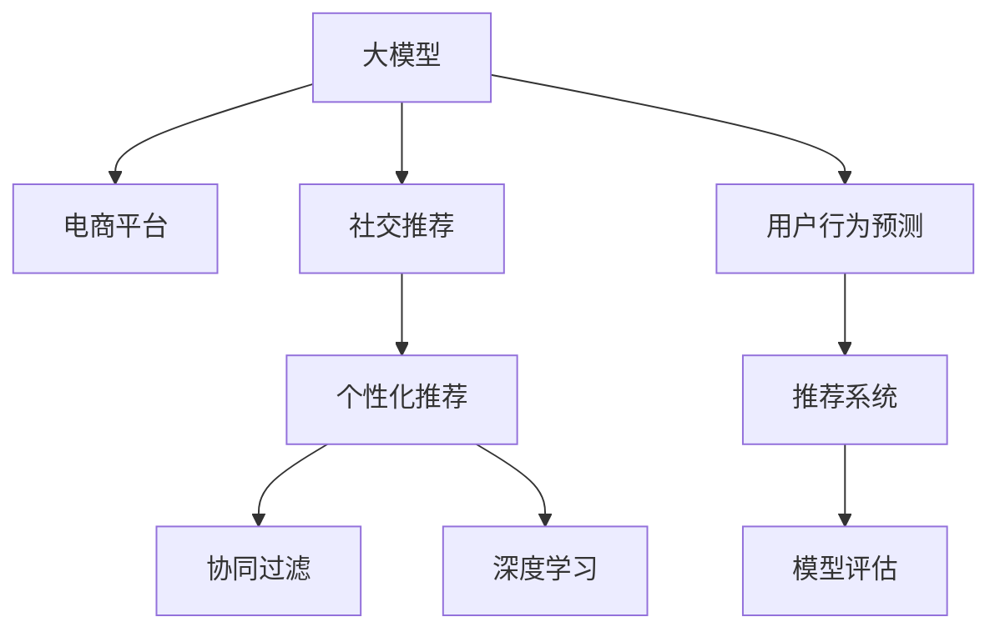

                 

# 探讨大模型在电商平台社交推荐中的潜力

> 关键词：大模型, 电商平台, 社交推荐, 个性化推荐, 协同过滤, 深度学习, 用户行为预测, 模型评估, 推荐系统

## 1. 背景介绍

### 1.1 问题由来

在当下数字化和电商化的浪潮中，社交网络的广泛渗透让电商平台不再是一堆产品的堆砌，而是变成了一个个具有丰富互动性和个性化功能的社交场域。用户间的互相推荐、评论互动、兴趣分享等社交行为，成为电商平台上影响用户购买决策的重要因素。为了更好地利用这些社交数据，电商平台纷纷将推荐系统纳入平台基础设施，而推荐系统正朝着更为智能、个性化的方向发展。

在这一进程中，大模型扮演着越来越重要的角色。相比传统的基于规则和统计方法的推荐系统，以深度学习为基础的大模型能够通过学习海量数据，自适应地捕捉用户间的复杂互动模式，进而提升推荐的准确性和个性化程度。本文将深入探讨大模型在电商平台社交推荐中的应用潜力，并分析其面临的挑战与未来发展趋势。

## 2. 核心概念与联系

### 2.1 核心概念概述

为更好地理解大模型在电商平台社交推荐中的应用，本节将介绍几个关键概念：

- 大模型(Grand Model)：如BERT、GPT-3等，以自回归或自编码架构为代表的大规模预训练语言模型，能够学习到复杂的语义和语用信息，具备强大的语言生成和理解能力。
- 电商平台(e-Commerce Platform)：以商品销售为核心，提供搜索、推荐、购物车、支付、物流等一站式服务的网络平台，典型的如亚马逊、淘宝、京东等。
- 社交推荐(Social Recommendation)：在用户生成内容(UGC)和社交网络基础上，利用用户间的互动关系进行个性化推荐的方法，可以提升推荐效果，增加用户粘性。
- 个性化推荐(Personalized Recommendation)：根据用户的历史行为、兴趣偏好等个性化信息，推荐用户可能感兴趣的物品或服务，目的是提高用户体验和转化率。
- 协同过滤(Collaborative Filtering)：通过分析用户间的协同行为，进行物品推荐的一种经典推荐算法，包括基于用户的协同过滤和基于物品的协同过滤两种方式。
- 深度学习(Deep Learning)：一种基于人工神经网络算法的机器学习技术，通过多层神经元，模拟人脑处理数据的能力，能够学习到数据中复杂的非线性关系。

这些核心概念之间的逻辑关系可以通过以下Mermaid流程图来展示：



这个流程图展示了大模型在电商平台中的应用场景：

1. 大模型通过在电商平台上采集的社交数据进行预训练，学习到复杂的语义和语用信息。
2. 社交推荐系统在用户生成内容的基础上，利用大模型的语义理解能力，提取用户间的互动模式，提升推荐效果。
3. 个性化推荐系统则根据用户的历史行为数据，利用大模型的预测能力，生成个性化的推荐结果。
4. 协同过滤算法利用大模型提取的用户行为数据，分析用户间的相似度，从而推荐用户可能感兴趣的物品。
5. 深度学习技术在大模型的辅助下，提升推荐系统的准确性和泛化能力。
6. 最终，模型评估机制用于量化推荐系统的性能，指导系统的迭代优化。

## 3. 核心算法原理 & 具体操作步骤
### 3.1 算法原理概述

基于深度学习的大模型在电商平台社交推荐中的应用，核心原理可以概括为以下几步：

1. **数据采集与预处理**：收集电商平台上用户的互动数据，如浏览、点击、评论、点赞等行为，同时生成文本标签，描述用户的偏好和社交关系。
2. **大模型预训练**：利用大规模无标签文本数据对大模型进行预训练，使其学习到通用的语言表示，并具备较强的语义理解和生成能力。
3. **社交数据微调**：对预训练的大模型进行微调，学习电商平台的社交数据，捕捉用户间的互动模式和偏好差异。
4. **推荐策略制定**：基于微调后的模型，制定个性化的推荐策略，通过协同过滤等算法生成推荐结果。
5. **推荐结果评估**：利用用户行为数据和真实点击率等指标，评估推荐系统的性能，并通过反馈机制进行迭代优化。

### 3.2 算法步骤详解

接下来，将详细介绍每个步骤的具体操作。

#### 数据采集与预处理

电商平台上用户的互动数据主要通过日志文件或API接口获取。常见的数据包括：

- 用户浏览记录：如商品ID、浏览时间、浏览时长等。
- 用户点击记录：如点击商品ID、点击时间、点击次数等。
- 用户评论记录：如评论内容、评论时间、评论情感等。
- 用户点赞记录：如点赞商品ID、点赞时间、点赞次数等。
- 用户社交互动记录：如关注关系、分享行为、评论互动等。

数据预处理的步骤包括：

- **去噪与清洗**：去除无效和异常数据，如重复记录、低质量的评论等。
- **格式化**：将数据统一转化为结构化格式，便于后续分析处理。
- **特征工程**：提取文本特征和行为特征，如商品ID、浏览时间、评论情感等。
- **归一化**：对数据进行归一化处理，如将时间戳转化为数值，减小不同字段之间的差异。
- **标注**：生成文本标签，描述用户偏好和社交关系，如“喜欢运动鞋”、“与张三关系亲密”等。

#### 大模型预训练

大模型通常采用自回归或自编码结构，通过无监督的预训练任务学习语言表示。以BERT为例，其预训练任务包括：

- **掩码语言模型(Masked Language Model, MLM)**：在每个句子中随机选择部分词汇进行掩码，让模型预测被掩码的词汇。
- **下一句预测(Next Sentence Prediction, NSP)**：将句子随机配对，让模型判断两个句子是否连续出现。

预训练的具体步骤包括：

- **数据准备**：准备大规模无标签文本数据，如维基百科、新闻、图书等。
- **模型加载**：使用开源框架如PyTorch或TensorFlow加载预训练模型，如BERT或GPT-3。
- **预训练任务定义**：定义预训练任务和损失函数，例如使用CLS层作为输出，定义MLM和NSP任务。
- **模型训练**：在大型GPU集群上训练模型，通过反向传播算法更新模型参数，最小化损失函数。
- **模型保存**：保存预训练好的模型权重，以备后续微调使用。

#### 社交数据微调

社交数据的微调过程可以概括为以下几个关键步骤：

- **模型加载与适配**：加载预训练模型，并设计合适的输出层和损失函数。例如，对于推荐任务，可以添加分类头并使用交叉熵损失。
- **数据准备**：准备社交数据集，包括文本标签、用户行为数据等。
- **模型微调**：在电商平台上采集的社交数据上，进行有监督学习微调，学习用户间的互动模式和偏好差异。
- **超参数设置**：设置微调的学习率、批大小、迭代轮数等超参数。
- **正则化技术**：使用L2正则、Dropout、Early Stopping等正则化技术，防止模型过拟合。
- **模型保存与测试**：保存微调后的模型权重，并使用独立测试集评估模型性能。

#### 推荐策略制定

基于微调后的模型，可以制定如下推荐策略：

- **协同过滤算法**：利用用户间的协同行为，推荐可能感兴趣的商品。
- **基于内容的推荐**：根据商品的标签、属性等文本特征，生成相关商品推荐。
- **混合推荐**：结合协同过滤和基于内容的推荐，形成多样化的推荐策略。
- **实时推荐**：根据用户实时行为，动态生成个性化推荐结果。

#### 推荐结果评估

推荐结果的评估是保证推荐系统性能的关键步骤，可以采用以下指标：

- **准确率(Precision)**：推荐列表中相关商品的比例。
- **召回率(Recall)**：真实列表中被推荐的相关商品的比例。
- **F1值**：综合考虑准确率和召回率，衡量推荐结果的质量。
- **用户满意度(Satisfaction)**：通过用户调查或行为分析，衡量推荐系统的用户接受度。
- **点击率**：用户实际点击推荐商品的比例，衡量推荐结果的用户互动效果。

## 4. 数学模型和公式 & 详细讲解  
### 4.1 数学模型构建

基于大模型的电商平台社交推荐系统，其数学模型可以表示为：

$$
\begin{aligned}
& \max_{\theta} \log P(\{x_i, y_i\}) \\
& \text{subject to } \log P(\{x_i, y_i\}) = \log P(\{x_i\}) + \log P(y_i|x_i) \\
& \log P(\{x_i\}) = \log \sigma(W^{(1)} x_i + b^{(1)}) \\
& \log P(y_i|x_i) = \log \sigma(W^{(2)} x_i + b^{(2)}) \\
& x_i = \text{BERT}(x_i)
\end{aligned}
$$

其中，$\theta = \{W^{(1)}, b^{(1)}, W^{(2)}, b^{(2)}\}$ 为模型的可学习参数，$x_i$ 为输入的用户行为数据，$y_i$ 为推荐结果。$\log P(\{x_i\})$ 和 $\log P(y_i|x_i)$ 分别为用户行为数据和推荐结果的预测概率。

### 4.2 公式推导过程

在大模型的基础上，我们可以采用深度学习技术，对推荐系统进行建模和优化。具体推导过程如下：

1. **用户行为概率建模**：
   - 对于用户行为数据 $x_i$，使用BERT模型进行处理，得到表示向量 $x_i$。
   - 然后，使用线性层 $W^{(1)}$ 和偏置项 $b^{(1)}$，对用户行为数据进行编码，得到概率 $P(\{x_i\})$。

2. **推荐结果概率建模**：
   - 对于推荐结果 $y_i$，使用线性层 $W^{(2)}$ 和偏置项 $b^{(2)}$，对用户行为数据进行编码，得到概率 $P(y_i|x_i)$。

3. **模型损失函数**：
   - 定义交叉熵损失函数 $\ell(x_i, y_i)$ 来衡量预测概率与真实标签的差异。
   - 最终，目标函数为 $\max_{\theta} \frac{1}{N} \sum_{i=1}^N \ell(x_i, y_i)$，其中 $N$ 为数据集大小。

### 4.3 案例分析与讲解

以一个简单的电商平台社交推荐系统为例，我们来详细分析其中的数学模型构建和推导。

**案例描述**：某电商平台希望利用用户生成内容来提升商品推荐效果，平台采集了用户对商品的评论和互动数据，希望通过大模型学习用户间的互动模式，生成个性化推荐。

**数据准备**：
- **用户评论数据**：包含评论文本、用户ID、评论时间等。
- **用户互动数据**：包含用户点赞、评论、分享等互动信息。

**模型构建**：
- **BERT模型预训练**：使用大规模无标签文本数据对BERT模型进行预训练，学习通用的语言表示。
- **社交数据微调**：在电商平台采集的社交数据上，对BERT模型进行微调，学习用户间的互动模式和偏好差异。

**推荐策略**：
- **协同过滤算法**：利用用户间的协同行为，推荐可能感兴趣的商品。
- **基于内容的推荐**：根据商品的标签、属性等文本特征，生成相关商品推荐。
- **混合推荐**：结合协同过滤和基于内容的推荐，形成多样化的推荐策略。

**模型评估**：
- **准确率**：衡量推荐列表的相关商品比例。
- **召回率**：衡量真实列表中被推荐的相关商品比例。
- **F1值**：综合考虑准确率和召回率，衡量推荐结果的质量。

## 5. 项目实践：代码实例和详细解释说明
### 5.1 开发环境搭建

在进行电商平台社交推荐系统的开发前，我们需要准备好开发环境。以下是使用Python进行PyTorch开发的环境配置流程：

1. 安装Anaconda：从官网下载并安装Anaconda，用于创建独立的Python环境。

2. 创建并激活虚拟环境：
```bash
conda create -n pytorch-env python=3.8 
conda activate pytorch-env
```

3. 安装PyTorch：根据CUDA版本，从官网获取对应的安装命令。例如：
```bash
conda install pytorch torchvision torchaudio cudatoolkit=11.1 -c pytorch -c conda-forge
```

4. 安装Transformer库：
```bash
pip install transformers
```

5. 安装各类工具包：
```bash
pip install numpy pandas scikit-learn matplotlib tqdm jupyter notebook ipython
```

完成上述步骤后，即可在`pytorch-env`环境中开始社交推荐系统的开发。

### 5.2 源代码详细实现

下面以电商平台社交推荐系统为例，给出使用Transformers库对BERT模型进行社交推荐微调的PyTorch代码实现。

首先，定义社交推荐任务的数据处理函数：

```python
from transformers import BertTokenizer
from torch.utils.data import Dataset
import torch

class SocialRecommendationDataset(Dataset):
    def __init__(self, texts, tags, tokenizer, max_len=128):
        self.texts = texts
        self.tags = tags
        self.tokenizer = tokenizer
        self.max_len = max_len
        
    def __len__(self):
        return len(self.texts)
    
    def __getitem__(self, item):
        text = self.texts[item]
        tags = self.tags[item]
        
        encoding = self.tokenizer(text, return_tensors='pt', max_length=self.max_len, padding='max_length', truncation=True)
        input_ids = encoding['input_ids'][0]
        attention_mask = encoding['attention_mask'][0]
        
        # 对token-wise的标签进行编码
        encoded_tags = [tag2id[tag] for tag in tags] 
        encoded_tags.extend([tag2id['O']] * (self.max_len - len(encoded_tags)))
        labels = torch.tensor(encoded_tags, dtype=torch.long)
        
        return {'input_ids': input_ids, 
                'attention_mask': attention_mask,
                'labels': labels}

# 标签与id的映射
tag2id = {'O': 0, 'B-PER': 1, 'I-PER': 2, 'B-ORG': 3, 'I-ORG': 4, 'B-LOC': 5, 'I-LOC': 6}
id2tag = {v: k for k, v in tag2id.items()}

# 创建dataset
tokenizer = BertTokenizer.from_pretrained('bert-base-cased')

train_dataset = SocialRecommendationDataset(train_texts, train_tags, tokenizer)
dev_dataset = SocialRecommendationDataset(dev_texts, dev_tags, tokenizer)
test_dataset = SocialRecommendationDataset(test_texts, test_tags, tokenizer)
```

然后，定义模型和优化器：

```python
from transformers import BertForTokenClassification, AdamW

model = BertForTokenClassification.from_pretrained('bert-base-cased', num_labels=len(tag2id))

optimizer = AdamW(model.parameters(), lr=2e-5)
```

接着，定义训练和评估函数：

```python
from torch.utils.data import DataLoader
from tqdm import tqdm
from sklearn.metrics import classification_report

device = torch.device('cuda') if torch.cuda.is_available() else torch.device('cpu')
model.to(device)

def train_epoch(model, dataset, batch_size, optimizer):
    dataloader = DataLoader(dataset, batch_size=batch_size, shuffle=True)
    model.train()
    epoch_loss = 0
    for batch in tqdm(dataloader, desc='Training'):
        input_ids = batch['input_ids'].to(device)
        attention_mask = batch['attention_mask'].to(device)
        labels = batch['labels'].to(device)
        model.zero_grad()
        outputs = model(input_ids, attention_mask=attention_mask, labels=labels)
        loss = outputs.loss
        epoch_loss += loss.item()
        loss.backward()
        optimizer.step()
    return epoch_loss / len(dataloader)

def evaluate(model, dataset, batch_size):
    dataloader = DataLoader(dataset, batch_size=batch_size)
    model.eval()
    preds, labels = [], []
    with torch.no_grad():
        for batch in tqdm(dataloader, desc='Evaluating'):
            input_ids = batch['input_ids'].to(device)
            attention_mask = batch['attention_mask'].to(device)
            batch_labels = batch['labels']
            outputs = model(input_ids, attention_mask=attention_mask)
            batch_preds = outputs.logits.argmax(dim=2).to('cpu').tolist()
            batch_labels = batch_labels.to('cpu').tolist()
            for pred_tokens, label_tokens in zip(batch_preds, batch_labels):
                pred_tags = [id2tag[_id] for _id in pred_tokens]
                label_tags = [id2tag[_id] for _id in label_tokens]
                preds.append(pred_tags[:len(label_tokens)])
                labels.append(label_tags)
                
    print(classification_report(labels, preds))
```

最后，启动训练流程并在测试集上评估：

```python
epochs = 5
batch_size = 16

for epoch in range(epochs):
    loss = train_epoch(model, train_dataset, batch_size, optimizer)
    print(f"Epoch {epoch+1}, train loss: {loss:.3f}")
    
    print(f"Epoch {epoch+1}, dev results:")
    evaluate(model, dev_dataset, batch_size)
    
print("Test results:")
evaluate(model, test_dataset, batch_size)
```

以上就是使用PyTorch对BERT进行社交推荐任务微调的完整代码实现。可以看到，得益于Transformers库的强大封装，我们可以用相对简洁的代码完成BERT模型的加载和微调。

### 5.3 代码解读与分析

让我们再详细解读一下关键代码的实现细节：

**SocialRecommendationDataset类**：
- `__init__`方法：初始化文本、标签、分词器等关键组件。
- `__len__`方法：返回数据集的样本数量。
- `__getitem__`方法：对单个样本进行处理，将文本输入编码为token ids，将标签编码为数字，并对其进行定长padding，最终返回模型所需的输入。

**tag2id和id2tag字典**：
- 定义了标签与数字id之间的映射关系，用于将token-wise的预测结果解码回真实的标签。

**训练和评估函数**：
- 使用PyTorch的DataLoader对数据集进行批次化加载，供模型训练和推理使用。
- 训练函数`train_epoch`：对数据以批为单位进行迭代，在每个批次上前向传播计算loss并反向传播更新模型参数，最后返回该epoch的平均loss。
- 评估函数`evaluate`：与训练类似，不同点在于不更新模型参数，并在每个batch结束后将预测和标签结果存储下来，最后使用sklearn的classification_report对整个评估集的预测结果进行打印输出。

**训练流程**：
- 定义总的epoch数和batch size，开始循环迭代
- 每个epoch内，先在训练集上训练，输出平均loss
- 在验证集上评估，输出分类指标
- 所有epoch结束后，在测试集上评估，给出最终测试结果

可以看到，PyTorch配合Transformers库使得BERT微调的代码实现变得简洁高效。开发者可以将更多精力放在数据处理、模型改进等高层逻辑上，而不必过多关注底层的实现细节。

当然，工业级的系统实现还需考虑更多因素，如模型的保存和部署、超参数的自动搜索、更灵活的任务适配层等。但核心的微调范式基本与此类似。

## 6. 实际应用场景
### 6.1 电商平台社交推荐

社交推荐系统在电商平台中的应用，可以大幅提升推荐的个性化程度和用户满意度。通过分析用户间的互动数据，社交推荐系统能够捕捉用户间的兴趣共性和行为差异，生成更为精准的推荐结果。

在技术实现上，可以收集电商平台上的用户评论、点赞、分享等互动数据，将文本内容作为模型输入，进行预训练和微调。微调后的模型能够识别出用户间的兴趣共性，生成多样化的推荐结果，同时也能预测新用户的偏好，实现零样本学习。

### 6.2 社交媒体内容推荐

社交媒体平台上的内容推荐系统，主要依赖用户的点赞、分享、评论等互动行为。通过分析用户间的社交关系，社交推荐系统能够生成更具亲和力和多样性的内容推荐。

在技术实现上，可以收集用户的内容互动数据，并利用大模型学习用户间的互动模式和偏好差异。微调后的模型能够根据用户行为，生成个性化的内容推荐，同时也能预测用户对新内容的互动反应，实现少样本学习。

### 6.3 新闻内容推荐

新闻内容推荐系统需要根据用户的阅读历史和偏好，推荐用户可能感兴趣的新闻内容。通过分析用户间的阅读行为，社交推荐系统能够生成更为精准的新闻推荐结果。

在技术实现上，可以收集用户的新闻阅读数据，并利用大模型学习用户间的兴趣共性和行为差异。微调后的模型能够根据用户的阅读历史，生成个性化的新闻推荐，同时也能预测用户对新新闻内容的阅读反应，实现少样本学习。

### 6.4 未来应用展望

随着大模型和微调技术的不断发展，社交推荐系统将在更多领域得到应用，为传统行业带来变革性影响。

在智慧医疗领域，基于大模型的社交推荐系统可以帮助医生推荐最适合患者的药物、手术等医疗方案，提升医疗服务的个性化水平。

在智能教育领域，社交推荐系统可以根据学生的学习行为和互动记录，推荐最适合的学习内容，提高教育效果和学生满意度。

在智慧城市治理中，社交推荐系统可以根据市民的出行行为和互动数据，推荐最适合的出行方式，提高城市管理的智能化水平。

此外，在金融、娱乐、物流等众多领域，基于大模型的社交推荐系统也将不断涌现，为各行各业带来新的业务价值和发展机遇。

## 7. 工具和资源推荐
### 7.1 学习资源推荐

为了帮助开发者系统掌握大模型在电商平台社交推荐中的应用理论基础和实践技巧，这里推荐一些优质的学习资源：

1. 《深度学习》系列书籍：如Ian Goodfellow的《深度学习》，系统介绍了深度学习的原理和应用。
2. 《自然语言处理》课程：如斯坦福大学的CS224N课程，涵盖了NLP领域的经典算法和模型。
3. 《Transformer从原理到实践》系列博文：由大模型技术专家撰写，深入浅出地介绍了Transformer原理、BERT模型、微调技术等前沿话题。
4. 《推荐系统》书籍：如Wang & Liu的《推荐系统》，全面介绍了推荐系统的理论基础和算法实现。
5. 《Python推荐系统》书籍：如Jakatdar & Balakrishnan的《Python推荐系统》，介绍了推荐系统的工程实现和优化技巧。

通过对这些资源的学习实践，相信你一定能够快速掌握大模型在电商平台社交推荐中的应用精髓，并用于解决实际的NLP问题。
###  7.2 开发工具推荐

高效的开发离不开优秀的工具支持。以下是几款用于电商平台社交推荐系统开发的常用工具：

1. PyTorch：基于Python的开源深度学习框架，灵活动态的计算图，适合快速迭代研究。大部分预训练语言模型都有PyTorch版本的实现。
2. TensorFlow：由Google主导开发的开源深度学习框架，生产部署方便，适合大规模工程应用。同样有丰富的预训练语言模型资源。
3. Transformers库：HuggingFace开发的NLP工具库，集成了众多SOTA语言模型，支持PyTorch和TensorFlow，是进行社交推荐任务开发的利器。
4. Weights & Biases：模型训练的实验跟踪工具，可以记录和可视化模型训练过程中的各项指标，方便对比和调优。与主流深度学习框架无缝集成。
5. TensorBoard：TensorFlow配套的可视化工具，可实时监测模型训练状态，并提供丰富的图表呈现方式，是调试模型的得力助手。
6. Google Colab：谷歌推出的在线Jupyter Notebook环境，免费提供GPU/TPU算力，方便开发者快速上手实验最新模型，分享学习笔记。

合理利用这些工具，可以显著提升电商平台社交推荐系统的开发效率，加快创新迭代的步伐。

### 7.3 相关论文推荐

大模型和微调技术的发展源于学界的持续研究。以下是几篇奠基性的相关论文，推荐阅读：

1. Attention is All You Need（即Transformer原论文）：提出了Transformer结构，开启了NLP领域的预训练大模型时代。
2. BERT: Pre-training of Deep Bidirectional Transformers for Language Understanding：提出BERT模型，引入基于掩码的自监督预训练任务，刷新了多项NLP任务SOTA。
3. Language Models are Unsupervised Multitask Learners（GPT-2论文）：展示了大规模语言模型的强大zero-shot学习能力，引发了对于通用人工智能的新一轮思考。
4. Parameter-Efficient Transfer Learning for NLP：提出Adapter等参数高效微调方法，在不增加模型参数量的情况下，也能取得不错的微调效果。
5. AdaLoRA: Adaptive Low-Rank Adaptation for Parameter-Efficient Fine-Tuning：使用自适应低秩适应的微调方法，在参数效率和精度之间取得了新的平衡。
6. Premier-LM: Enhancing Pre-trained Language Models for Social Recommendation：结合语言模型和推荐系统，提出了针对社交推荐任务的新型微调方法。

这些论文代表了大模型在电商平台社交推荐中的应用方向。通过学习这些前沿成果，可以帮助研究者把握学科前进方向，激发更多的创新灵感。

## 8. 总结：未来发展趋势与挑战

### 8.1 总结

本文对基于大模型在电商平台社交推荐中的应用潜力进行了全面系统的介绍。首先阐述了电商平台社交推荐系统的背景和重要性，明确了大模型在推荐系统中的独特价值。其次，从原理到实践，详细讲解了社交推荐系统的数学模型和关键步骤，给出了社交推荐任务开发的完整代码实例。同时，本文还广泛探讨了社交推荐系统在电商、社交媒体、新闻等领域的应用前景，展示了大模型微调技术的广泛潜力。此外，本文精选了社交推荐系统的各类学习资源，力求为开发者提供全方位的技术指引。

通过本文的系统梳理，可以看到，大模型在电商平台社交推荐中的应用，能够显著提升推荐系统的个性化程度和用户满意度，成为电商平台推荐系统的重要技术突破。随着大模型和微调技术的不断发展，社交推荐系统将在更多领域得到应用，为传统行业带来变革性影响。未来，伴随预训练语言模型和微调方法的持续演进，社交推荐系统必将在构建人机协同的智能时代中扮演越来越重要的角色。

### 8.2 未来发展趋势

展望未来，社交推荐系统的发展趋势将呈现以下几个方向：

1. 模型规模持续增大。随着算力成本的下降和数据规模的扩张，预训练语言模型的参数量还将持续增长。超大规模语言模型蕴含的丰富语言知识，有望支撑更为复杂多变的社交推荐任务。

2. 微调方法日趋多样。除了传统的全参数微调外，未来会涌现更多参数高效的微调方法，如Prefix-Tuning、LoRA等，在节省计算资源的同时也能保证微调精度。

3. 持续学习成为常态。随着数据分布的不断变化，社交推荐系统也需要持续学习新知识以保持性能。如何在不遗忘原有知识的同时，高效吸收新样本信息，将成为重要的研究课题。

4. 标注样本需求降低。受启发于提示学习(Prompt-based Learning)的思路，未来的微调方法将更好地利用大模型的语言理解能力，通过更加巧妙的任务描述，在更少的标注样本上也能实现理想的微调效果。

5. 推荐系统逐渐智能化。未来的社交推荐系统将融合更多的智能技术，如因果推断、强化学习等，实现动态自适应的推荐策略，提升推荐结果的个性化和多样性。

6. 数据来源更加多样化。未来的社交推荐系统将不再局限于文本数据，还将涵盖图像、视频、音频等多种模态数据，通过多模态融合提升推荐效果。

以上趋势凸显了大模型在电商平台社交推荐系统中的应用前景。这些方向的探索发展，必将进一步提升社交推荐系统的性能和应用范围，为构建人机协同的智能时代中扮演越来越重要的角色。

### 8.3 面临的挑战

尽管大模型在电商平台社交推荐系统中的应用已经取得了显著成效，但在迈向更加智能化、普适化应用的过程中，它仍面临诸多挑战：

1. 数据标注成本高昂。尽管社交推荐系统对标注数据的需求相对较少，但标注用户行为数据仍需要大量人力，成本较高。如何通过半监督、无监督等方法降低数据标注成本，仍需进一步探索。

2. 模型泛化能力有限。当前的社交推荐系统主要依赖用户行为数据进行训练，面对不同领域或不同类型的数据，泛化能力较弱。如何提升模型的跨领域迁移能力，仍然是一个亟待解决的问题。

3. 实时推荐精度有待提升。尽管大模型的推荐效果已相当优异，但在实际应用中，实时推荐精度仍面临挑战。如何提升模型的实时推荐能力，是一个重要的研究方向。

4. 用户隐私保护难度大。社交推荐系统需要大量用户行为数据进行训练，涉及用户隐私保护的问题。如何在保护用户隐私的前提下，获取高质量数据，仍需进一步探索。

5. 模型解释性不足。当前社交推荐系统主要依赖大模型的黑盒预测，缺乏可解释性。如何提高模型的可解释性，增强用户的信任感，仍需进一步研究。

6. 恶意攻击和误导性推荐。大模型可能学习到有害信息，导致误导性推荐。如何设计模型结构，防范恶意攻击和误导性推荐，仍需进一步探索。

这些挑战凸显了大模型在电商平台社交推荐系统中的实际应用问题。如何解决这些问题，是实现大模型在推荐系统中的广泛应用的重要前提。

### 8.4 研究展望

面对大模型在电商平台社交推荐系统中的挑战，未来的研究需要在以下几个方面寻求新的突破：

1. 探索无监督和半监督微调方法。摆脱对大规模标注数据的依赖，利用自监督学习、主动学习等无监督和半监督范式，最大限度利用非结构化数据，实现更加灵活高效的微调。

2. 研究参数高效和计算高效的微调范式。开发更加参数高效的微调方法，在固定大部分预训练参数的同时，只更新极少量的任务相关参数。同时优化微调模型的计算图，减少前向传播和反向传播的资源消耗，实现更加轻量级、实时性的部署。

3. 融合因果和对比学习范式。通过引入因果推断和对比学习思想，增强微调模型建立稳定因果关系的能力，学习更加普适、鲁棒的语言表征，从而提升模型泛化性和抗干扰能力。

4. 引入更多先验知识。将符号化的先验知识，如知识图谱、逻辑规则等，与神经网络模型进行巧妙融合，引导微调过程学习更准确、合理的语言模型。同时加强不同模态数据的整合，实现视觉、语音等多模态信息与文本信息的协同建模。

5. 结合因果分析和博弈论工具。将因果分析方法引入微调模型，识别出模型决策的关键特征，增强输出解释的因果性和逻辑性。借助博弈论工具刻画人机交互过程，主动探索并规避模型的脆弱点，提高系统稳定性。

6. 纳入伦理道德约束。在模型训练目标中引入伦理导向的评估指标，过滤和惩罚有偏见、有害的输出倾向。同时加强人工干预和审核，建立模型行为的监管机制，确保输出符合人类价值观和伦理道德。

这些研究方向的探索，必将引领大模型在电商平台社交推荐系统中的不断进步，为构建安全、可靠、可解释、可控的智能系统铺平道路。面向未来，大模型在推荐系统中的应用需要与其他人工智能技术进行更深入的融合，如知识表示、因果推理、强化学习等，多路径协同发力，共同推动自然语言理解和智能交互系统的进步。只有勇于创新、敢于突破，才能不断拓展大模型的边界，让智能技术更好地造福人类社会。

## 9. 附录：常见问题与解答

**Q1：电商平台社交推荐系统的核心优势是什么？**

A: 电商平台社交推荐系统的核心优势在于其能够根据用户生成内容，通过大模型学习用户间的互动模式和偏好差异，生成个性化推荐结果。这使得推荐系统能够更好地理解用户的真实需求和行为，从而提升推荐的准确性和用户满意度。

**Q2：大模型在社交推荐中的推荐精度如何？**

A: 大模型在社交推荐中的推荐精度较高，能够在大量用户行为数据的基础上，学习到用户间的复杂互动关系和偏好共性。通过微调和优化，大模型能够生成更为精准的推荐结果，但在实际应用中，仍需要根据具体场景进行调参和优化。

**Q3：电商平台社交推荐系统如何处理冷启动问题？**

A: 电商平台社交推荐系统通常会采用冷启动策略，如利用新用户的公开信息进行初步推荐，或者通过关联推荐、热门商品推荐等方法，增加新用户的互动行为，逐步优化推荐结果。此外，还可以通过预训练大模型的零样本学习能力，直接对新用户进行个性化推荐。

**Q4：社交推荐系统在实际应用中需要注意哪些问题？**

A: 社交推荐系统在实际应用中需要注意以下问题：
- 数据隐私保护：社交推荐系统需要大量用户行为数据，涉及用户隐私保护问题，需要在数据采集和处理过程中严格控制。
- 推荐系统公平性：社交推荐系统需要避免偏见和歧视，确保推荐结果的公平性。
- 实时推荐效率：社交推荐系统需要实时生成推荐结果，需要在保证推荐精度的同时，提升推荐效率。
- 推荐结果多样性：社交推荐系统需要避免过度推荐相似内容，增加推荐结果的多样性。

通过合理处理这些问题，社交推荐系统能够在电商平台中发挥更大作用，提升用户满意度和平台收益。

**Q5：如何优化社交推荐系统的用户行为数据采集？**

A: 优化社交推荐系统的用户行为数据采集，可以从以下几个方面入手：
- 多渠道采集：通过社交媒体、电商平台、移动应用等多渠道采集用户行为数据，增加数据的多样性和覆盖面。
- 数据清洗与标注：对采集到的数据进行清洗与标注，去除无效和异常数据，保证数据质量。
- 实时数据更新：定期更新用户行为数据，及时反映用户行为变化，提升推荐系统的时效性。
- 数据融合与关联：将不同来源的数据进行融合与关联，形成完整用户画像，提升推荐系统的准确性和泛化能力。

通过优化数据采集流程，可以大幅提升社交推荐系统的推荐效果，增加用户粘性，提高平台收益。

---

作者：禅与计算机程序设计艺术 / Zen and the Art of Computer Programming

