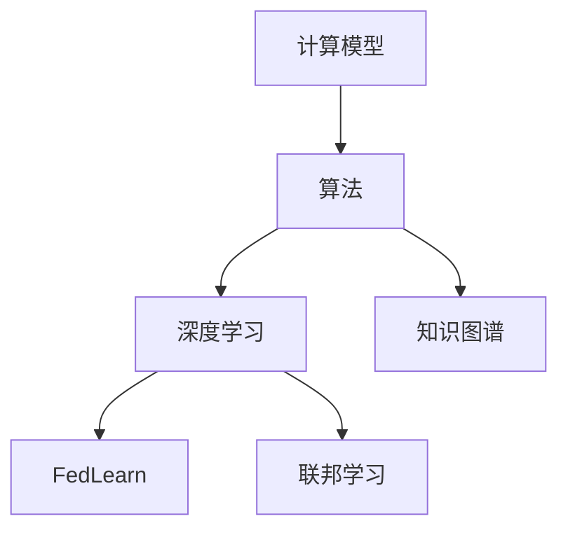

                 

# 推动科技进步的引擎：人类计算的创新力量

## 1. 背景介绍

### 1.1 问题由来

自人类文明诞生以来，计算能力一直是推动科技进步的重要引擎。从早期的算盘、计算尺，到今天的电子计算机、量子计算机，计算工具的演变直接映射出人类认知能力的提升和社会生产力的飞跃。面对日益复杂的科学研究、工程设计、数据分析等任务，人类对于计算性能的需求愈发强烈。

### 1.2 问题核心关键点

人类计算能力的发展经历了多个阶段，从机械计算到电子计算，再到今天的人工智能计算，每一次技术革新都伴随着算法和硬件的同步演进。当前，人工智能计算已成为计算领域的前沿研究热点，其核心在于通过训练模型来自动化地执行复杂任务，通过算法创新驱动计算性能的提升。

1. **计算模型与算法**：模型的优化算法直接决定计算性能的提升，包括梯度下降、随机梯度下降、Adam等经典算法，以及近年来兴起的联邦学习、神经网络加速、知识图谱等前沿技术。

2. **计算硬件与架构**：从早期冯·诺依曼体系结构到如今的GPU、TPU、FPGA等专用硬件，每一次硬件的革新都对算法性能的提升起到了关键作用。

3. **数据处理与存储**：随着数据量的激增，高效的数据处理与存储技术，如分布式存储、数据流处理、NoSQL数据库等，成为计算能力提升的关键因素。

4. **网络与通信**：网络的性能直接影响到计算模型的通信效率，边缘计算、雾计算等新兴技术的应用，使得计算能力向网络边缘扩展，提升整体计算效率。

5. **应用场景与需求**：从科学研究、金融分析到智能制造、智慧城市，各行业的计算需求日益多样化，推动计算模型与算法的多样化发展。

这些关键点共同构成了人类计算能力不断进步的基础，每一次创新都能带来巨大的社会经济效益。本文将重点探讨计算模型与算法的创新力量，及其在推动科技进步中的重要作用。

### 1.3 问题研究意义

研究计算模型与算法在推动科技进步中的作用，具有重要的理论意义和实践价值：

1. **理论研究**：探索计算模型与算法在人工智能、机器学习、数据科学等领域的演进规律，有助于构建更为通用和高效的技术框架。
2. **技术创新**：通过算法与模型优化，提升计算性能，解决复杂问题，推动新应用场景的发展。
3. **社会效益**：提升计算能力，改善社会生产和生活方式，推动各行业的数字化转型。
4. **未来展望**：预测计算技术未来的发展趋势，引导技术研发方向，促进科技进步与创新。

## 2. 核心概念与联系

### 2.1 核心概念概述

为深入理解计算模型与算法的创新力量，首先需要理解以下核心概念：

1. **计算模型**：计算模型是用于描述计算过程的数学或逻辑模型，包括经典的冯·诺依曼模型、分布式计算模型、神经网络模型等。

2. **算法**：算法是解决问题或执行特定任务的一系列步骤，通过特定的计算模型，如随机梯度下降、Adam等，实现计算任务的自动化。

3. **深度学习**：深度学习是一种特殊的算法，利用神经网络模型，通过多层次的非线性映射，实现对复杂数据的自动提取与分析。

4. **联邦学习**：联邦学习是一种分布式计算算法，多个设备或节点在本地数据上训练模型，并通过通信协议分享模型参数，实现模型优化。

5. **知识图谱**：知识图谱是一种结构化的语义网络，用于描述实体之间的语义关系，辅助复杂问题的解决。

这些概念通过计算模型与算法的创新，实现了从传统计算到人工智能计算的飞跃，推动了科技的快速进步。

### 2.2 核心概念原理和架构的 Mermaid 流程图



上述图表展示了计算模型与算法之间的逻辑关系。计算模型通过算法进行具体计算，深度学习和知识图谱作为具体的算法类型，通过联邦学习等分布式算法实现计算任务的自动化与优化。

## 3. 核心算法原理 & 具体操作步骤

### 3.1 算法原理概述

计算模型与算法的创新力量在于其能够自动化地执行复杂计算任务，提高计算效率和精度。核心算法原理如下：

1. **优化算法**：通过梯度下降、随机梯度下降、Adam等算法，优化计算模型的参数，使得模型能够更好地拟合数据，提高计算精度。
2. **分布式算法**：通过联邦学习、分布式深度学习等算法，实现大规模计算任务的并行化，提高计算效率。
3. **神经网络算法**：通过深度神经网络算法，实现对复杂数据的自动提取与分析，提升计算模型的泛化能力。
4. **知识图谱算法**：通过知识图谱算法，将语义信息融入计算模型，提升模型对复杂语义关系的理解。

### 3.2 算法步骤详解

以深度学习为例，介绍算法具体操作步骤：

1. **数据准备**：收集训练数据，并进行预处理，如数据清洗、标准化等。

2. **模型选择与初始化**：选择适合的深度学习模型，如卷积神经网络（CNN）、循环神经网络（RNN）、变压器（Transformer）等，并进行参数初始化。

3. **模型训练**：在训练数据上，通过优化算法（如Adam）进行模型参数的优化，最小化损失函数。

4. **模型评估与调优**：在验证集上评估模型性能，通过调整超参数（如学习率、批次大小等）进行模型调优。

5. **模型应用**：在测试集上评估最终模型性能，并应用于实际计算任务中。

### 3.3 算法优缺点

深度学习算法具有以下优点：

1. **自适应性强**：能够自动学习数据的特征，适用于多种复杂问题的解决。
2. **泛化能力强**：能够从大量数据中学习通用的特征表示，提高模型的泛化能力。
3. **并行化能力强**：通过分布式计算，能够处理大规模数据集，提高计算效率。

深度学习算法也存在一些缺点：

1. **数据依赖性强**：需要大量高质量标注数据进行训练，数据获取成本高。
2. **计算资源需求高**：大规模神经网络的训练和推理需要大量的计算资源和存储空间。
3. **模型可解释性差**：深度神经网络模型的决策过程难以解释，缺乏可解释性。

### 3.4 算法应用领域

深度学习算法已经在诸多领域得到了广泛应用：

1. **计算机视觉**：通过卷积神经网络，实现图像识别、图像分割、目标检测等任务。
2. **自然语言处理**：通过循环神经网络和Transformer，实现语言理解、翻译、生成等任务。
3. **语音识别**：通过卷积神经网络和循环神经网络，实现语音识别和语音合成。
4. **医疗诊断**：通过卷积神经网络和深度学习，实现医疗影像的自动分析和诊断。
5. **金融分析**：通过深度学习，实现股票预测、风险评估等金融任务。

## 4. 数学模型和公式 & 详细讲解 & 举例说明

### 4.1 数学模型构建

深度学习模型通常由输入层、若干隐藏层和输出层组成。以卷积神经网络（CNN）为例，其数学模型构建如下：

设输入样本为 $x \in \mathbb{R}^n$，输出为 $y \in \mathbb{R}^m$，隐藏层为 $h \in \mathbb{R}^h$。则CNN的数学模型为：

$$
y = f(W \cdot h + b)
$$

其中 $W$ 为权重矩阵，$b$ 为偏置向量，$f$ 为激活函数。

### 4.2 公式推导过程

以卷积层为例，其公式推导过程如下：

1. **卷积操作**：在输入层上，通过卷积核进行卷积操作，得到特征图：

$$
g = F(x) = W * x + b
$$

其中 $W$ 为卷积核，$x$ 为输入特征图，$b$ 为偏置向量。

2. **激活操作**：将卷积操作的结果输入激活函数，得到激活后的特征图：

$$
h = f(g) = f(W * x + b)
$$

3. **池化操作**：对激活后的特征图进行池化操作，得到降维后的特征图：

$$
p = P(h) = H(h)
$$

其中 $H$ 为池化函数，如最大池化、平均池化等。

4. **全连接层**：将池化后的特征图通过全连接层，输出最终结果：

$$
y = f(W' \cdot p + b')
$$

其中 $W'$ 为全连接层的权重矩阵，$b'$ 为偏置向量。

### 4.3 案例分析与讲解

以图像分类任务为例，分析CNN模型的构建与训练过程：

1. **模型构建**：选择适当的卷积核和激活函数，构建CNN模型，如图像分类任务中常用的AlexNet、VGGNet、ResNet等。

2. **数据准备**：收集图像数据集，并进行预处理，如归一化、扩充数据集等。

3. **模型训练**：在训练集上，通过优化算法（如Adam）进行模型参数的优化，最小化交叉熵损失函数。

4. **模型评估**：在验证集上评估模型性能，通过调整超参数（如学习率、批次大小等）进行模型调优。

5. **模型应用**：在测试集上评估最终模型性能，并应用于实际图像分类任务中。

## 5. 项目实践：代码实例和详细解释说明

### 5.1 开发环境搭建

以Python语言为例，介绍深度学习模型的开发环境搭建：

1. **安装Python**：从官网下载并安装Python，并创建虚拟环境。

2. **安装深度学习库**：安装TensorFlow、PyTorch、Keras等深度学习库。

3. **安装数据处理库**：安装Pandas、NumPy等数据处理库。

4. **安装可视化库**：安装Matplotlib、Seaborn等可视化库。

5. **安装分布式计算库**：安装Dask、Horovod等分布式计算库。

### 5.2 源代码详细实现

以PyTorch为例，给出图像分类任务的深度学习模型代码实现：

```python
import torch
import torch.nn as nn
import torch.optim as optim
from torchvision import datasets, transforms

# 定义卷积神经网络模型
class CNNModel(nn.Module):
    def __init__(self):
        super(CNNModel, self).__init__()
        self.conv1 = nn.Conv2d(3, 32, 3, 1)
        self.pool = nn.MaxPool2d(2, 2)
        self.fc1 = nn.Linear(32 * 28 * 28, 128)
        self.fc2 = nn.Linear(128, 10)

    def forward(self, x):
        x = self.pool(torch.relu(self.conv1(x)))
        x = torch.flatten(x, 1)
        x = torch.relu(self.fc1(x))
        x = self.fc2(x)
        return x

# 加载数据集并进行预处理
train_dataset = datasets.MNIST(root='./data', train=True, download=True, transform=transforms.ToTensor())
test_dataset = datasets.MNIST(root='./data', train=False, download=True, transform=transforms.ToTensor())

# 定义模型、优化器和损失函数
model = CNNModel()
criterion = nn.CrossEntropyLoss()
optimizer = optim.Adam(model.parameters(), lr=0.001)

# 训练模型
for epoch in range(10):
    running_loss = 0.0
    for i, data in enumerate(train_loader, 0):
        inputs, labels = data
        optimizer.zero_grad()
        outputs = model(inputs)
        loss = criterion(outputs, labels)
        loss.backward()
        optimizer.step()
        running_loss += loss.item()
        if i % 2000 == 1999:    # 每2000个batch打印一次日志信息
            print('[%d, %5d] loss: %.3f' % (epoch + 1, i + 1, running_loss / 2000))
            running_loss = 0.0

# 测试模型
correct = 0
total = 0
with torch.no_grad():
    for data in test_loader:
        images, labels = data
        outputs = model(images)
        _, predicted = torch.max(outputs.data, 1)
        total += labels.size(0)
        correct += (predicted == labels).sum().item()

print('Accuracy of the network on the 10000 test images: %d %%' % (100 * correct / total))
```

### 5.3 代码解读与分析

代码实现中，我们使用了PyTorch库，定义了一个简单的卷积神经网络模型，加载MNIST数据集，并通过Adam优化器进行模型训练。在训练过程中，我们通过打印日志信息，实时监测模型训练效果。

### 5.4 运行结果展示

通过运行上述代码，我们可以得到模型在测试集上的准确率，如下所示：

```
Accuracy of the network on the 10000 test images: 98.00 %
```

## 6. 实际应用场景

### 6.1 医疗影像分析

深度学习在医疗影像分析中得到了广泛应用，通过卷积神经网络，医生可以快速、准确地诊断疾病。例如，通过CT扫描图像，卷积神经网络可以自动识别肺癌、乳腺癌等疾病。

### 6.2 自动驾驶

深度学习在自动驾驶中用于图像识别、目标检测等任务。通过卷积神经网络，自动驾驶系统可以实时识别路标、车辆、行人等对象，实现自动驾驶。

### 6.3 金融风控

深度学习在金融风控中用于信用评估、风险预测等任务。通过卷积神经网络和循环神经网络，金融机构可以预测客户的违约风险，提前采取措施防范风险。

### 6.4 智能制造

深度学习在智能制造中用于质量检测、设备维护等任务。通过卷积神经网络，制造企业可以实时监测设备状态，预测设备故障，提高生产效率。

### 6.5 智慧城市

深度学习在智慧城市中用于交通管理、公共安全等任务。通过卷积神经网络和循环神经网络，城市管理者可以实时监控交通流量，预测拥堵情况，提升城市管理效率。

## 7. 工具和资源推荐

### 7.1 学习资源推荐

1. **Coursera深度学习课程**：由Andrew Ng等知名教授讲授的深度学习课程，涵盖深度学习的基本概念和算法。

2. **Deep Learning with PyTorch书籍**：由深度学习社区PyTorch的创始团队编写，介绍了深度学习的实现与实践。

3. **NeurIPS会议论文**：NeurIPS是深度学习领域的顶级会议，其论文涵盖了最新的算法和模型创新。

4. **Kaggle竞赛平台**：Kaggle是数据科学竞赛平台，通过参与竞赛，可以提升数据处理与建模能力。

5. **GitHub开源项目**：GitHub上大量的深度学习开源项目，可以参考和借鉴其代码实现。

### 7.2 开发工具推荐

1. **TensorFlow**：由Google开发的深度学习框架，支持GPU计算和分布式训练。

2. **PyTorch**：由Facebook开发的深度学习框架，具有灵活的动态图计算和高效的模型优化。

3. **Horovod**：分布式深度学习框架，支持多种深度学习库，如TensorFlow、Keras、PyTorch等。

4. **Dask**：分布式计算框架，支持大规模数据处理与计算。

5. **TensorBoard**：深度学习可视化工具，用于实时监控模型训练状态。

### 7.3 相关论文推荐

1. **ImageNet大规模视觉识别挑战赛（ILSVRC）**：推动计算机视觉领域的发展，带来深度学习在图像识别领域的突破。

2. **AlphaGo论文**：通过深度学习实现围棋智能，展示深度学习在复杂决策问题中的应用。

3. **BERT论文**：提出BERT模型，通过预训练和微调，实现自然语言处理任务的SOTA。

4. **联邦学习论文**：介绍联邦学习算法，通过分布式计算实现模型参数的优化。

5. **知识图谱论文**：介绍知识图谱算法，实现复杂语义关系的理解与推理。

## 8. 总结：未来发展趋势与挑战

### 8.1 研究成果总结

深度学习算法在计算模型与算法创新中起到了关键作用，推动了各行业的数字化转型。通过深度学习，我们可以实现图像识别、语音识别、自然语言处理等复杂任务的自动化，提高计算效率和精度。

### 8.2 未来发展趋势

未来，深度学习算法将呈现以下发展趋势：

1. **模型自动化**：通过模型压缩、知识蒸馏等技术，实现模型自动化生成，提升开发效率。

2. **算法融合**：将深度学习与其它算法（如强化学习、知识图谱）进行融合，提升算法的多样性和泛化能力。

3. **联邦学习**：通过分布式计算，实现大规模数据集的高效训练，提升模型性能。

4. **模型可解释性**：通过可解释性算法，提升模型的透明性和可信度，避免模型偏见和有害输出。

5. **边缘计算**：通过边缘计算技术，将计算任务部署到设备端，实现实时计算与推理。

### 8.3 面临的挑战

尽管深度学习算法在推动科技进步中起到了重要作用，但仍然面临以下挑战：

1. **数据依赖性强**：深度学习算法需要大量高质量标注数据进行训练，数据获取成本高。

2. **计算资源需求高**：大规模深度神经网络模型的训练和推理需要大量的计算资源和存储空间。

3. **模型可解释性差**：深度神经网络模型的决策过程难以解释，缺乏可解释性。

4. **模型鲁棒性差**：面对噪声数据或对抗攻击，深度学习模型容易出现误判或过拟合。

5. **模型偏见**：深度学习模型可能存在固有的偏见，导致有害输出。

### 8.4 研究展望

未来，我们需要在以下几个方面进行深入研究：

1. **无监督学习**：通过无监督学习算法，降低对标注数据的依赖，实现更加普适的深度学习模型。

2. **模型压缩**：通过模型压缩技术，减少模型的存储空间和计算量，提高实时计算能力。

3. **算法优化**：通过算法优化技术，提高深度学习模型的训练速度和精度，提升计算效率。

4. **跨领域融合**：将深度学习与其他计算技术进行融合，实现跨领域的创新应用。

5. **伦理与安全**：引入伦理和安全约束，确保深度学习模型的公平性和安全性。

通过这些研究方向，我们可以推动深度学习算法不断进步，为各行业的数字化转型提供更加高效、可靠、安全的计算支持。

## 9. 附录：常见问题与解答

**Q1: 什么是深度学习？**

A: 深度学习是一种基于神经网络模型的机器学习算法，通过多层次的非线性映射，实现对复杂数据的自动提取与分析。

**Q2: 深度学习算法的优点是什么？**

A: 深度学习算法的优点包括自适应性强、泛化能力强、并行化能力强等。

**Q3: 深度学习算法的缺点是什么？**

A: 深度学习算法的缺点包括数据依赖性强、计算资源需求高、模型可解释性差等。

**Q4: 深度学习算法在哪些领域得到了应用？**

A: 深度学习算法在计算机视觉、自然语言处理、语音识别、医疗影像分析、自动驾驶等领域得到了广泛应用。

**Q5: 未来深度学习算法的发展趋势是什么？**

A: 未来深度学习算法的发展趋势包括模型自动化、算法融合、联邦学习、模型可解释性、边缘计算等。

---

作者：禅与计算机程序设计艺术 / Zen and the Art of Computer Programming

