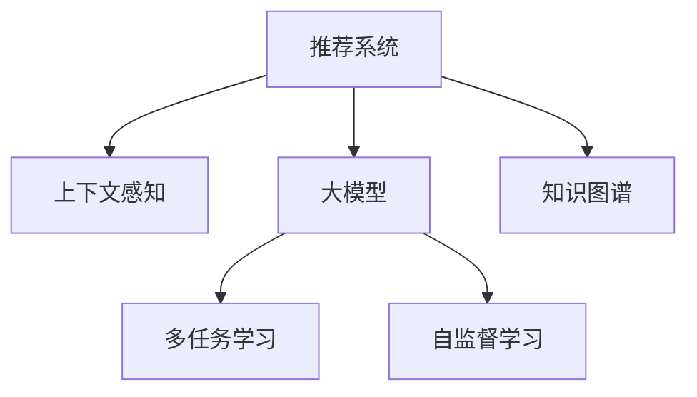

                 

# 推荐系统中的上下文感知建模：大模型的多任务学习

> 关键词：上下文感知, 大模型, 多任务学习, 推荐系统, 自监督学习, 知识图谱, 特征抽取

## 1. 背景介绍

### 1.1 问题由来
推荐系统在电子商务、新闻媒体、社交网络等多个领域广泛应用，旨在为用户推荐个性化商品、内容或服务。传统的推荐系统主要基于用户历史行为数据，通过协同过滤、矩阵分解等算法，构建用户-物品的相似度矩阵。然而，随着用户行为数据的稀疏化和多维度特性，这些方法逐渐暴露出计算成本高、特征利用不足等问题。

近年来，深度学习方法被引入推荐系统，显著提升了模型的表现。基于大模型的推荐系统，通过在大规模数据上进行预训练，学习到丰富的语义特征和隐式关联，具备更强的泛化能力和特征抽取能力。然而，由于大模型资源需求高、计算复杂度大，如何在低成本、高效率的前提下，充分挖掘上下文信息，提升推荐系统的性能，成为一个重要挑战。

### 1.2 问题核心关键点
推荐系统中的上下文感知建模问题，核心在于如何从用户行为数据中提取丰富的上下文信息，并将其转化为可供推荐的特征表示。常见的上下文包括用户基本信息、时间、地点、互动历史等，如何有效利用这些上下文信息，提升推荐质量，是当前研究的热点。

本文聚焦于基于大模型的多任务学习方法，探讨如何在推荐系统中，利用预训练语言模型（如BERT、GPT等），通过多任务学习，学习到更加丰富的上下文特征，并应用于推荐系统。这种多任务学习范式，能够显著提升模型的上下文感知能力，降低对标注数据的依赖，提高推荐系统的精准度和效率。

### 1.3 问题研究意义
在推荐系统中引入上下文感知建模，对于提升推荐的个性化程度、丰富推荐内容、拓展应用场景，具有重要意义：

1. 提升个性化推荐效果：通过多任务学习，学习到用户上下文的多维度特征，能够更好地理解用户偏好，提升推荐的精准度。
2. 提高推荐系统效率：多任务学习能够共享预训练知识，减少模型参数量，降低计算成本，加速推荐系统的部署和迭代。
3. 拓展推荐应用场景：上下文感知建模可以应用于各种类型的推荐任务，如商品推荐、内容推荐、广告推荐等，具备广泛的应用前景。
4. 增强推荐系统鲁棒性：上下文感知建模能够减少冷启动问题，提高模型对新数据和新场景的适应性。

## 2. 核心概念与联系

### 2.1 核心概念概述

为更好地理解基于大模型的推荐系统多任务学习，本节将介绍几个密切相关的核心概念：

- 推荐系统(Recommendation System)：通过用户的历史行为数据，为用户推荐个性化商品、内容或服务的技术。
- 上下文感知(Context-awareness)：推荐系统在推荐过程中，考虑用户行为发生时的上下文信息，如时间、地点、社交关系等，以提高推荐精准度。
- 大模型(Large Model)：指在大规模数据上进行预训练的深度神经网络模型，具备强大的特征抽取能力和泛化能力。
- 多任务学习(Multi-task Learning)：通过学习多个相关任务，共享预训练知识，提高模型的泛化能力和特征利用率。
- 自监督学习(Self-supervised Learning)：指利用无标签数据，通过设计自监督任务，自动学习模型参数的技术。
- 知识图谱(Knowledge Graph)：通过有向图结构，表示实体之间的语义关系，用于提升推荐系统的关联性和准确性。

这些核心概念之间的逻辑关系可以通过以下Mermaid流程图来展示：



这个流程图展示了大模型在推荐系统中的应用框架，即通过多任务学习，学习到上下文感知的多维度特征，提升推荐效果。

## 3. 核心算法原理 & 具体操作步骤
### 3.1 算法原理概述

基于大模型的推荐系统多任务学习，本质上是一个多任务的联合学习过程。其核心思想是：利用预训练语言模型作为特征提取器，通过在多个相关任务上进行微调，学习到不同任务的共性和特异性特征，最终用于推荐系统的特征抽取和输出。

具体而言，假设预训练语言模型为 $M_{\theta}$，其中 $\theta$ 为预训练得到的模型参数。给定推荐系统中的多个任务 $T=\{T_1,T_2,...,T_K\}$，每个任务的标注数据集为 $D_k=\{(x_i,y_i)\}_{i=1}^N$，其中 $x_i$ 为输入特征，$y_i$ 为任务标签。微调的目标是找到新的模型参数 $\hat{\theta}$，使得：

$$
\hat{\theta}=\mathop{\arg\min}_{\theta} \sum_{k=1}^K \mathcal{L}_k(M_{\theta},D_k)
$$

其中 $\mathcal{L}_k$ 为任务 $T_k$ 的损失函数，用于衡量模型预测输出与真实标签之间的差异。常见的损失函数包括交叉熵损失、均方误差损失等。

通过梯度下降等优化算法，微调过程不断更新模型参数 $\theta$，最小化总损失函数，使得模型输出逼近真实标签。由于 $\theta$ 已经通过预训练获得了较好的初始化，因此即便在多个小规模数据集上进行微调，也能较快收敛到理想的模型参数 $\hat{\theta}$。

### 3.2 算法步骤详解

基于大模型的推荐系统多任务学习一般包括以下几个关键步骤：

**Step 1: 准备预训练模型和数据集**
- 选择合适的预训练语言模型 $M_{\theta}$ 作为初始化参数，如 BERT、GPT等。
- 准备推荐系统中的多个任务 $T=\{T_1,T_2,...,T_K\}$ 的标注数据集 $D_k$，划分为训练集、验证集和测试集。一般要求标注数据与预训练数据的分布不要差异过大。

**Step 2: 设计多任务适配层**
- 根据任务类型，在预训练模型顶层设计合适的输出层和损失函数。
- 对于分类任务，通常在顶层添加线性分类器和交叉熵损失函数。
- 对于生成任务，通常使用语言模型的解码器输出概率分布，并以负对数似然为损失函数。

**Step 3: 设置多任务超参数**
- 选择合适的优化算法及其参数，如 AdamW、SGD 等，设置学习率、批大小、迭代轮数等。
- 设置正则化技术及强度，包括权重衰减、Dropout、Early Stopping等。
- 确定冻结预训练参数的策略，如仅微调顶层，或全部参数都参与微调。

**Step 4: 执行多任务梯度训练**
- 将训练集数据分批次输入模型，前向传播计算损失函数。
- 反向传播计算参数梯度，根据设定的优化算法和学习率更新模型参数。
- 周期性在验证集上评估模型性能，根据性能指标决定是否触发 Early Stopping。
- 重复上述步骤直到满足预设的迭代轮数或 Early Stopping 条件。

**Step 5: 测试和部署**
- 在测试集上评估微调后模型 $M_{\hat{\theta}}$ 的性能，对比微调前后的精度提升。
- 使用微调后的模型对新样本进行推理预测，集成到实际的应用系统中。
- 持续收集新的数据，定期重新微调模型，以适应数据分布的变化。

以上是基于大模型的推荐系统多任务学习的一般流程。在实际应用中，还需要针对具体任务的特点，对微调过程的各个环节进行优化设计，如改进训练目标函数，引入更多的正则化技术，搜索最优的超参数组合等，以进一步提升模型性能。

### 3.3 算法优缺点

基于大模型的推荐系统多任务学习方法具有以下优点：
1. 简单高效。通过多任务学习，可以共享预训练知识，减少单个任务上的参数量，降低计算成本。
2. 泛化能力更强。多任务学习能够提升模型的泛化能力，对于新任务的适应性更强。
3. 特征提取更全面。大模型的上下文感知建模，能够学习到更多维度的特征，提升推荐系统的效果。
4. 性能提升显著。多任务学习使得模型在推荐任务上的表现，相较于单任务微调有显著提升。

同时，该方法也存在一定的局限性：
1. 对标注数据依赖较大。多任务学习需要多个任务的标注数据，对于标注数据需求较高。
2. 计算资源消耗大。多任务学习需要并行处理多个任务的数据，对计算资源的要求较高。
3. 模型复杂度较高。多任务学习模型参数量较大，模型结构复杂，部署和维护成本较高。

尽管存在这些局限性，但就目前而言，基于大模型的多任务学习仍然是大规模推荐系统的首选方法。未来相关研究的重点在于如何进一步降低对标注数据的依赖，提高模型的效率，同时兼顾可解释性和伦理安全性等因素。

### 3.4 算法应用领域

基于大模型的多任务学习在推荐系统中已经得到了广泛的应用，覆盖了多个推荐任务，例如：

- 商品推荐：如电商平台的商品推荐、社交媒体上的商品广告推荐等。通过多任务学习，学习到商品的多维度特征，提高推荐精准度。
- 内容推荐：如新闻网站的内容推荐、视频网站的影视推荐等。通过多任务学习，学习到内容的多维度特征，提升推荐相关性。
- 广告推荐：如搜索引擎的广告推荐、社交媒体的广告推荐等。通过多任务学习，学习到广告的多维度特征，提高广告投放效果。

除了上述这些经典任务外，多任务学习还创新性地应用于更多场景中，如基于知识图谱的推荐系统、基于少样本学习的推荐模型等，为推荐系统带来了新的突破。随着预训练语言模型和多任务学习的持续演进，相信推荐系统必将在更多领域得到应用，为电子商务、内容分发、社交媒体等领域带来新的变革。

## 4. 数学模型和公式 & 详细讲解 & 举例说明

### 4.1 数学模型构建

本节将使用数学语言对基于大模型的推荐系统多任务学习过程进行更加严格的刻画。

记预训练语言模型为 $M_{\theta}$，其中 $\theta$ 为预训练得到的模型参数。假设推荐系统中的多个任务 $T=\{T_1,T_2,...,T_K\}$，每个任务的训练集为 $D_k=\{(x_i,y_i)\}_{i=1}^N$。

定义模型 $M_{\theta}$ 在数据样本 $(x,y)$ 上的损失函数为 $\ell(M_{\theta}(x),y)$，则在数据集 $D_k$ 上的经验风险为：

$$
\mathcal{L}_k(\theta) = \frac{1}{N}\sum_{i=1}^N \ell(M_{\theta}(x_i),y_i)
$$

多任务学习的优化目标是最小化总经验风险，即找到最优参数：

$$
\theta^* = \mathop{\arg\min}_{\theta} \sum_{k=1}^K \mathcal{L}_k(\theta)
$$

在实践中，我们通常使用基于梯度的优化算法（如SGD、Adam等）来近似求解上述最优化问题。设 $\eta$ 为学习率，$\lambda$ 为正则化系数，则参数的更新公式为：

$$
\theta \leftarrow \theta - \eta \sum_{k=1}^K \nabla_{\theta}\mathcal{L}_k(\theta) - \eta\lambda\theta
$$

其中 $\nabla_{\theta}\mathcal{L}_k(\theta)$ 为任务 $T_k$ 的损失函数对参数 $\theta$ 的梯度，可通过反向传播算法高效计算。

### 4.2 公式推导过程

以下我们以商品推荐任务为例，推导多任务学习损失函数的构建过程。

假设商品推荐任务 $T_1$ 中，输入为商品 $x$，输出为商品的点击概率 $y$。模型 $M_{\theta}$ 的输出为商品的预测点击概率。定义任务 $T_1$ 的交叉熵损失函数为：

$$
\ell(M_{\theta}(x),y) = -y\log M_{\theta}(x) - (1-y)\log(1-M_{\theta}(x))
$$

将上述损失函数代入经验风险公式，得：

$$
\mathcal{L}_1(\theta) = -\frac{1}{N}\sum_{i=1}^N [y_i\log M_{\theta}(x_i)+(1-y_i)\log(1-M_{\theta}(x_i))]
$$

同理，假设内容推荐任务 $T_2$ 中，输入为内容 $x$，输出为内容的点击概率 $y$。模型 $M_{\theta}$ 的输出为内容的预测点击概率。定义任务 $T_2$ 的交叉熵损失函数为：

$$
\ell(M_{\theta}(x),y) = -y\log M_{\theta}(x) - (1-y)\log(1-M_{\theta}(x))
$$

将上述损失函数代入经验风险公式，得：

$$
\mathcal{L}_2(\theta) = -\frac{1}{N}\sum_{i=1}^N [y_i\log M_{\theta}(x_i)+(1-y_i)\log(1-M_{\theta}(x_i))]
$$

以此类推，可以构建其他推荐任务的损失函数。在实践中，为了减少计算量，通常将不同任务的损失函数加权组合，得到总损失函数：

$$
\mathcal{L}(\theta) = \sum_{k=1}^K \alpha_k\mathcal{L}_k(\theta)
$$

其中 $\alpha_k$ 为任务 $T_k$ 的权重，用于调节不同任务在总损失函数中的影响程度。

在得到总损失函数后，即可带入参数更新公式，完成模型的迭代优化。重复上述过程直至收敛，最终得到适应推荐任务的最优模型参数 $\theta^*$。

## 5. 项目实践：代码实例和详细解释说明

### 5.1 开发环境搭建

在进行多任务学习实践前，我们需要准备好开发环境。以下是使用Python进行PyTorch开发的环境配置流程：

1. 安装Anaconda：从官网下载并安装Anaconda，用于创建独立的Python环境。

2. 创建并激活虚拟环境：
```bash
conda create -n pytorch-env python=3.8 
conda activate pytorch-env
```

3. 安装PyTorch：根据CUDA版本，从官网获取对应的安装命令。例如：
```bash
conda install pytorch torchvision torchaudio cudatoolkit=11.1 -c pytorch -c conda-forge
```

4. 安装Transformers库：
```bash
pip install transformers
```

5. 安装各类工具包：
```bash
pip install numpy pandas scikit-learn matplotlib tqdm jupyter notebook ipython
```

完成上述步骤后，即可在`pytorch-env`环境中开始多任务学习实践。

### 5.2 源代码详细实现

下面我以商品推荐任务为例，给出使用Transformers库对BERT模型进行多任务学习的PyTorch代码实现。

首先，定义推荐任务的数据处理函数：

```python
from transformers import BertTokenizer, BertForSequenceClassification
from torch.utils.data import Dataset, DataLoader
import torch

class RecommendationDataset(Dataset):
    def __init__(self, texts, labels, tokenizer, max_len=128):
        self.texts = texts
        self.labels = labels
        self.tokenizer = tokenizer
        self.max_len = max_len
        
    def __len__(self):
        return len(self.texts)
    
    def __getitem__(self, item):
        text = self.texts[item]
        label = self.labels[item]
        
        encoding = self.tokenizer(text, return_tensors='pt', max_length=self.max_len, padding='max_length', truncation=True)
        input_ids = encoding['input_ids'][0]
        attention_mask = encoding['attention_mask'][0]
        
        # 对label进行one-hot编码
        label = torch.tensor([label], dtype=torch.long)
        label = label.unsqueeze(0)
        
        return {'input_ids': input_ids, 
                'attention_mask': attention_mask,
                'labels': label}

# 标签与id的映射
label2id = {'buy': 1, 'not_buy': 0}
id2label = {v: k for k, v in label2id.items()}

# 创建dataset
tokenizer = BertTokenizer.from_pretrained('bert-base-cased')

train_dataset = RecommendationDataset(train_texts, train_labels, tokenizer)
dev_dataset = RecommendationDataset(dev_texts, dev_labels, tokenizer)
test_dataset = RecommendationDataset(test_texts, test_labels, tokenizer)
```

然后，定义模型和优化器：

```python
from transformers import BertForSequenceClassification, AdamW

model = BertForSequenceClassification.from_pretrained('bert-base-cased', num_labels=2)

optimizer = AdamW(model.parameters(), lr=2e-5)
```

接着，定义训练和评估函数：

```python
from tqdm import tqdm
from sklearn.metrics import accuracy_score

device = torch.device('cuda') if torch.cuda.is_available() else torch.device('cpu')
model.to(device)

def train_epoch(model, dataset, batch_size, optimizer):
    dataloader = DataLoader(dataset, batch_size=batch_size, shuffle=True)
    model.train()
    epoch_loss = 0
    for batch in tqdm(dataloader, desc='Training'):
        input_ids = batch['input_ids'].to(device)
        attention_mask = batch['attention_mask'].to(device)
        labels = batch['labels'].to(device)
        model.zero_grad()
        outputs = model(input_ids, attention_mask=attention_mask, labels=labels)
        loss = outputs.loss
        epoch_loss += loss.item()
        loss.backward()
        optimizer.step()
    return epoch_loss / len(dataloader)

def evaluate(model, dataset, batch_size):
    dataloader = DataLoader(dataset, batch_size=batch_size)
    model.eval()
    preds, labels = [], []
    with torch.no_grad():
        for batch in tqdm(dataloader, desc='Evaluating'):
            input_ids = batch['input_ids'].to(device)
            attention_mask = batch['attention_mask'].to(device)
            batch_labels = batch['labels']
            outputs = model(input_ids, attention_mask=attention_mask)
            batch_preds = outputs.logits.argmax(dim=2).to('cpu').tolist()
            batch_labels = batch_labels.to('cpu').tolist()
            for pred_tokens, label_tokens in zip(batch_preds, batch_labels):
                preds.append(pred_tokens)
                labels.append(label_tokens)
                
    print('Accuracy:', accuracy_score(labels, preds))
```

最后，启动训练流程并在测试集上评估：

```python
epochs = 5
batch_size = 16

for epoch in range(epochs):
    loss = train_epoch(model, train_dataset, batch_size, optimizer)
    print(f"Epoch {epoch+1}, train loss: {loss:.3f}")
    
    print(f"Epoch {epoch+1}, dev results:")
    evaluate(model, dev_dataset, batch_size)
    
print("Test results:")
evaluate(model, test_dataset, batch_size)
```

以上就是使用PyTorch对BERT进行多任务学习的商品推荐任务的完整代码实现。可以看到，得益于Transformers库的强大封装，我们可以用相对简洁的代码完成BERT模型的多任务学习。

### 5.3 代码解读与分析

让我们再详细解读一下关键代码的实现细节：

**RecommendationDataset类**：
- `__init__`方法：初始化文本、标签、分词器等关键组件。
- `__len__`方法：返回数据集的样本数量。
- `__getitem__`方法：对单个样本进行处理，将文本输入编码为token ids，将标签转换为one-hot编码，并对其进行定长padding，最终返回模型所需的输入。

**label2id和id2label字典**：
- 定义了标签与数字id之间的映射关系，用于将预测结果解码回真实的标签。

**训练和评估函数**：
- 使用PyTorch的DataLoader对数据集进行批次化加载，供模型训练和推理使用。
- 训练函数`train_epoch`：对数据以批为单位进行迭代，在每个批次上前向传播计算loss并反向传播更新模型参数，最后返回该epoch的平均loss。
- 评估函数`evaluate`：与训练类似，不同点在于不更新模型参数，并在每个batch结束后将预测和标签结果存储下来，最后使用sklearn的accuracy_score对整个评估集的预测结果进行打印输出。

**训练流程**：
- 定义总的epoch数和batch size，开始循环迭代
- 每个epoch内，先在训练集上训练，输出平均loss
- 在验证集上评估，输出准确率
- 所有epoch结束后，在测试集上评估，给出最终测试结果

可以看到，PyTorch配合Transformers库使得BERT多任务学习的代码实现变得简洁高效。开发者可以将更多精力放在数据处理、模型改进等高层逻辑上，而不必过多关注底层的实现细节。

当然，工业级的系统实现还需考虑更多因素，如模型的保存和部署、超参数的自动搜索、更灵活的任务适配层等。但核心的多任务学习范式基本与此类似。

## 6. 实际应用场景
### 6.1 电商商品推荐

基于大模型多任务学习的电商商品推荐系统，可以显著提升用户的购物体验，增加商品转化率。传统推荐系统往往依赖用户的历史购买记录，忽略了时间、地点、社交关系等上下文信息。而利用多任务学习，学习到更多维度的商品特征，可以更好地理解用户偏好，提供个性化的商品推荐。

在技术实现上，可以收集用户的浏览、点击、评价、分享等行为数据，提取和商品交互的文本内容。将文本内容作为模型输入，商品的分类标签作为监督信号，在此基础上对预训练模型进行多任务学习。多任务学习后的模型能够从文本内容中准确把握用户的兴趣点，从而推荐符合其兴趣的商品，提高用户的满意度。

### 6.2 新闻内容推荐

新闻媒体推荐系统通常面临内容量庞大、类别多样的挑战。利用多任务学习，可以学习到不同新闻类别和内容类型的特征，提高推荐的个性化和相关性。例如，可以为每篇新闻文章设计分类任务，学习其所属的新闻类别，为视频新闻设计分类和情感分析任务，学习视频的情感倾向。通过多任务学习，推荐系统能够综合不同维度的信息，为用户推荐符合其兴趣和情感的内容。

此外，多任务学习还可以结合用户的历史浏览记录和社交关系，推荐符合用户兴趣和行为的新闻内容。例如，对于一篇新发布的新闻，可以利用多任务学习预测其与用户兴趣的匹配度，同时结合社交网络信息，推荐与用户社交关系相关的新闻内容，提升用户的阅读体验。

### 6.3 视频广告推荐

视频广告推荐系统通常面临点击率低、广告效果难以评估等问题。通过多任务学习，可以学习到视频的多个特征，如时长、类别、质量等，提升广告的点击率和效果评估。例如，可以设计分类任务，预测视频所属的类别；设计情感分析任务，预测视频的情感倾向；设计评分任务，预测视频的用户评分。通过多任务学习，推荐系统能够综合不同维度的信息，为用户推荐符合其兴趣和情感的视频广告。

此外，多任务学习还可以结合用户的历史观看记录和社交关系，推荐符合用户兴趣和行为的视频广告。例如，对于一段新发布的视频广告，可以利用多任务学习预测其与用户兴趣的匹配度，同时结合社交网络信息，推荐与用户社交关系相关的视频广告，提升广告的点击率和效果。

### 6.4 未来应用展望

随着多任务学习和大模型的不断发展，其在推荐系统中的应用前景将更加广阔。

在智慧医疗领域，基于多任务学习的推荐系统可以推荐个性化的医疗内容，如健康文章、医疗知识等，提升用户的健康知识和医疗水平。

在智能教育领域，多任务学习推荐系统可以推荐个性化的学习内容，如视频课程、练习题目等，提升学生的学习效果和兴趣。

在智慧城市治理中，多任务学习推荐系统可以推荐个性化的公共服务信息，如交通信息、天气预警等，提升城市管理的智能化水平。

此外，在金融投资、娱乐传媒等众多领域，基于多任务学习的大模型推荐系统也将不断涌现，为各行各业带来新的变革。相信随着技术的日益成熟，多任务学习范式将成为推荐系统的重要技术范式，推动人工智能技术在各行业的广泛应用。

## 7. 工具和资源推荐
### 7.1 学习资源推荐

为了帮助开发者系统掌握多任务学习在推荐系统中的应用，这里推荐一些优质的学习资源：

1. 《Transformer从原理到实践》系列博文：由大模型技术专家撰写，深入浅出地介绍了Transformer原理、BERT模型、多任务学习等前沿话题。

2. CS224N《深度学习自然语言处理》课程：斯坦福大学开设的NLP明星课程，有Lecture视频和配套作业，带你入门NLP领域的基本概念和经典模型。

3. 《Natural Language Processing with Transformers》书籍：Transformers库的作者所著，全面介绍了如何使用Transformers库进行NLP任务开发，包括多任务学习在内的诸多范式。

4. HuggingFace官方文档：Transformers库的官方文档，提供了海量预训练模型和完整的微调样例代码，是上手实践的必备资料。

5. KDD Cup推荐系统竞赛数据集：包含电商、新闻、广告等多个推荐任务的数据集，提供基准模型和优化策略，助力推荐系统技术发展。

通过对这些资源的学习实践，相信你一定能够快速掌握大模型多任务学习的精髓，并用于解决实际的推荐系统问题。
###  7.2 开发工具推荐

高效的开发离不开优秀的工具支持。以下是几款用于大模型多任务学习开发的常用工具：

1. PyTorch：基于Python的开源深度学习框架，灵活动态的计算图，适合快速迭代研究。大部分预训练语言模型都有PyTorch版本的实现。

2. TensorFlow：由Google主导开发的开源深度学习框架，生产部署方便，适合大规模工程应用。同样有丰富的预训练语言模型资源。

3. Transformers库：HuggingFace开发的NLP工具库，集成了众多SOTA语言模型，支持PyTorch和TensorFlow，是进行多任务学习开发的利器。

4. Weights & Biases：模型训练的实验跟踪工具，可以记录和可视化模型训练过程中的各项指标，方便对比和调优。与主流深度学习框架无缝集成。

5. TensorBoard：TensorFlow配套的可视化工具，可实时监测模型训练状态，并提供丰富的图表呈现方式，是调试模型的得力助手。

6. Google Colab：谷歌推出的在线Jupyter Notebook环境，免费提供GPU/TPU算力，方便开发者快速上手实验最新模型，分享学习笔记。

合理利用这些工具，可以显著提升大模型多任务学习任务的开发效率，加快创新迭代的步伐。

### 7.3 相关论文推荐

大模型多任务学习在推荐系统中的应用源于学界的持续研究。以下是几篇奠基性的相关论文，推荐阅读：

1. Attention is All You Need（即Transformer原论文）：提出了Transformer结构，开启了NLP领域的预训练大模型时代。

2. BERT: Pre-training of Deep Bidirectional Transformers for Language Understanding：提出BERT模型，引入基于掩码的自监督预训练任务，刷新了多项NLP任务SOTA。

3. Multi-task Learning from Noisy Label Data：提出基于自监督的多任务学习框架，利用大量无标签数据，训练出鲁棒的多任务模型。

4. Multi-task Learning Using Multiple Task-Specific Models and a Structured Loss Objective：提出多任务学习的自适应学习框架，动态调整模型参数，提升模型泛化能力。

5. Knowledge Distillation for Multi-task Learning：提出多任务学习的知识蒸馏方法，通过单一任务模型的指导，提升多任务学习的效果。

这些论文代表了大模型多任务学习的发展脉络。通过学习这些前沿成果，可以帮助研究者把握学科前进方向，激发更多的创新灵感。

## 8. 总结：未来发展趋势与挑战

### 8.1 总结

本文对基于大模型的推荐系统多任务学习方法进行了全面系统的介绍。首先阐述了大模型和上下文感知建模在推荐系统中的研究背景和意义，明确了多任务学习在提升推荐系统上下文感知能力、降低标注数据依赖、提高推荐系统效率等方面的重要作用。其次，从原理到实践，详细讲解了多任务学习的数学原理和关键步骤，给出了多任务学习任务开发的完整代码实例。同时，本文还广泛探讨了多任务学习在多个推荐任务中的应用场景，展示了多任务学习范式的巨大潜力。

通过本文的系统梳理，可以看到，基于大模型的多任务学习在推荐系统中具有广阔的应用前景，能够显著提升推荐的个性化程度、提高推荐系统的效率和效果。多任务学习通过学习多个相关任务，共享预训练知识，显著提升了模型的泛化能力和特征利用率，是推荐系统的重要技术范式。

### 8.2 未来发展趋势

展望未来，大模型多任务学习在推荐系统中的应用将呈现以下几个发展趋势：

1. 上下文感知能力更强。多任务学习能够利用上下文信息，提升模型的多维度特征表示能力，提高推荐的个性化程度。

2. 泛化能力更强。多任务学习通过共享预训练知识，能够提升模型在不同任务上的泛化能力，对于新任务的适应性更强。

3. 少样本学习更加普及。多任务学习能够利用预训练知识，通过少量样本进行微调，提高模型的鲁棒性和泛化能力。

4. 多任务学习更加灵活。未来的多任务学习模型将具备更强的模型适配能力和任务组合灵活性，能够适应更广泛的应用场景。

5. 多任务学习更加高效。随着硬件计算能力的提升，多任务学习模型将具备更高的并行处理能力，能够更快地进行模型训练和推理。

6. 多任务学习更加安全。未来的多任务学习模型将更加注重数据隐私和安全，通过差分隐私、联邦学习等技术，保护用户数据隐私。

以上趋势凸显了大模型多任务学习在推荐系统中的广阔前景。这些方向的探索发展，必将进一步提升推荐系统的性能和应用范围，为电子商务、内容分发、社交媒体等领域带来新的变革。

### 8.3 面临的挑战

尽管大模型多任务学习在推荐系统中已经取得了一定的进展，但在迈向更加智能化、普适化应用的过程中，它仍面临着诸多挑战：

1. 标注数据需求较高。多任务学习需要多个任务的标注数据，对于标注数据需求较高。对于长尾应用场景，难以获得充足的高质量标注数据。

2. 计算资源消耗大。多任务学习需要并行处理多个任务的数据，对计算资源的要求较高。

3. 模型复杂度较高。多任务学习模型参数量较大，模型结构复杂，部署和维护成本较高。

4. 模型可解释性不足。多任务学习模型通常较为复杂，难以进行直观的解释和分析。

5. 数据隐私和安全问题。多任务学习模型在处理用户数据时，需要特别注意数据隐私和安全问题，避免数据泄露和滥用。

6. 模型训练和调参难度大。多任务学习模型涉及多个任务和多个超参数，训练和调参难度较大。

尽管存在这些挑战，但多任务学习在大模型推荐系统中的前景广阔，相信随着技术的不断进步和实践的积累，这些挑战终将逐步得到解决，多任务学习范式必将在推荐系统中发挥更大的作用。

### 8.4 研究展望

面对多任务学习在推荐系统中所面临的挑战，未来的研究需要在以下几个方面寻求新的突破：

1. 探索无监督和半监督多任务学习方法。摆脱对大量标注数据的依赖，利用自监督学习、主动学习等无监督和半监督范式，最大限度利用非结构化数据，实现更加灵活高效的多任务学习。

2. 研究参数高效和计算高效的多任务学习范式。开发更加参数高效的多任务学习方法，在固定大部分预训练参数的同时，只更新极少量的任务相关参数。同时优化多任务学习的计算图，减少前向传播和反向传播的资源消耗，实现更加轻量级、实时性的部署。

3. 融合因果和对比学习范式。通过引入因果推断和对比学习思想，增强多任务学习模型的因果关系建模能力，学习更加普适、鲁棒的语言表征，从而提升模型泛化性和抗干扰能力。

4. 引入更多先验知识。将符号化的先验知识，如知识图谱、逻辑规则等，与神经网络模型进行巧妙融合，引导多任务学习过程学习更准确、合理的语言模型。同时加强不同模态数据的整合，实现视觉、语音等多模态信息与文本信息的协同建模。

5. 结合因果分析和博弈论工具。将因果分析方法引入多任务学习模型，识别出模型决策的关键特征，增强输出解释的因果性和逻辑性。借助博弈论工具刻画人机交互过程，主动探索并规避模型的脆弱点，提高系统稳定性。

6. 纳入伦理道德约束。在多任务学习模型的训练目标中引入伦理导向的评估指标，过滤和惩罚有偏见、有害的输出倾向。同时加强人工干预和审核，建立模型行为的监管机制，确保输出符合人类价值观和伦理道德。

这些研究方向的探索，必将引领大模型多任务学习技术迈向更高的台阶，为构建安全、可靠、可解释、可控的智能系统铺平道路。面向未来，大模型多任务学习技术还需要与其他人工智能技术进行更深入的融合，如知识表示、因果推理、强化学习等，多路径协同发力，共同推动自然语言理解和智能交互系统的进步。只有勇于创新、敢于突破，才能不断拓展语言模型的边界，让智能技术更好地造福人类社会。

## 9. 附录：常见问题与解答

**Q1：多任务学习在大模型推荐系统中的应用有哪些？**

A: 多任务学习在大模型推荐系统中的应用包括商品推荐、内容推荐、广告推荐等。通过多任务学习，学习到不同任务的共性和特异性特征，从而提升推荐系统的精准度和效果。

**Q2：如何设计多任务适配层？**

A: 多任务适配层的设计应根据具体任务类型进行。例如，对于分类任务，通常在顶层添加线性分类器和交叉熵损失函数；对于生成任务，通常使用语言模型的解码器输出概率分布，并以负对数似然为损失函数。同时，需要设置合适的输出层和损失函数，以最小化推荐系统的总体损失。

**Q3：多任务学习如何共享预训练知识？**

A: 多任务学习通过共享预训练知识，能够显著提高模型的泛化能力和特征利用率。具体而言，可以利用预训练模型在多个任务上的表现，通过权重共享或任务级特征融合，提升模型的性能。同时，可以通过多任务学习，减少单个任务上的参数量，降低计算成本。

**Q4：多任务学习在推荐系统中的优势是什么？**

A: 多任务学习在推荐系统中的优势包括：
1. 提升推荐系统的精准度：通过学习多个相关任务，能够更好地理解用户偏好，提升推荐的个性化程度。
2. 提高推荐系统效率：多任务学习能够共享预训练知识，减少模型参数量，降低计算成本，加速推荐系统的部署和迭代。
3. 增强推荐系统鲁棒性：多任务学习能够减少冷启动问题，提高模型对新数据和新场景的适应性。

**Q5：多任务学习在推荐系统中的局限性有哪些？**

A: 多任务学习在推荐系统中的局限性包括：
1. 对标注数据依赖较大：多任务学习需要多个任务的标注数据，对于标注数据需求较高。
2. 计算资源消耗大：多任务学习需要并行处理多个任务的数据，对计算资源的要求较高。
3. 模型复杂度较高：多任务学习模型参数量较大，模型结构复杂，部署和维护成本较高。
4. 模型可解释性不足：多任务学习模型通常较为复杂，难以进行直观的解释和分析。
5. 数据隐私和安全问题：多任务学习模型在处理用户数据时，需要特别注意数据隐私和安全问题，避免数据泄露和滥用。
6. 模型训练和调参难度大：多任务学习模型涉及多个任务和多个超参数，训练和调参难度较大。

**Q6：如何优化多任务学习的训练过程？**

A: 多任务学习的训练过程可以通过以下方式进行优化：
1. 数据增强：通过回译、近义替换等方式扩充训练集，增加数据多样性。
2. 正则化：使用L2正则、Dropout、Early Stopping等避免模型过拟合。
3. 参数共享：通过共享预训练权重，减少模型的参数量，提高训练效率。
4. 多模型集成：训练多个多任务学习模型，取平均输出，抑制过拟合。
5. 学习率调优：采用学习率调度策略，如warmup、cosine annealing等，优化模型收敛速度。

这些优化方法可以结合具体任务和数据特点，灵活应用，提升多任务学习模型的性能和效果。

**Q7：多任务学习在推荐系统中的未来发展方向是什么？**

A: 多任务学习在推荐系统中的未来发展方向包括：
1. 上下文感知能力更强：通过学习上下文信息，提升推荐的个性化程度。
2. 泛化能力更强：通过共享预训练知识，提升模型在不同任务上的泛化能力，对于新任务的适应性更强。
3. 少样本学习更加普及：通过预训练知识，利用少量样本进行微调，提高模型的鲁棒性和泛化能力。
4. 多任务学习更加灵活：未来的多任务学习模型将具备更强的模型适配能力和任务组合灵活性，能够适应更广泛的应用场景。
5. 多任务学习更加高效：随着硬件计算能力的提升，多任务学习模型将具备更高的并行处理能力，能够更快地进行模型训练和推理。
6. 多任务学习更加安全：未来的多任务学习模型将更加注重数据隐私和安全，通过差分隐私、联邦学习等技术，保护用户数据隐私。

这些发展方向将进一步提升多任务学习模型的性能和应用范围，为推荐系统带来新的变革。

---

作者：禅与计算机程序设计艺术 / Zen and the Art of Computer Programming

