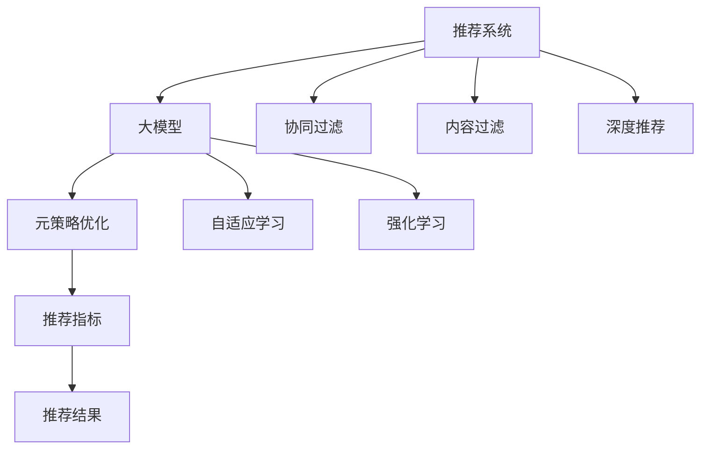

                 

# 推荐系统中的大模型元策略优化与选择

> 关键词：推荐系统,大模型,元策略优化,推荐算法,自适应学习,推荐指标,深度强化学习,应用实例

## 1. 背景介绍

推荐系统已经成为互联网时代最重要的技术之一，其应用范围涵盖电商、新闻、社交网络等多个领域。传统的推荐方法大多基于协同过滤、内容过滤等模型，存在数据稀疏性、冷启动、推荐多样性等问题，难以实现长尾个性化推荐。近年来，大模型方法逐渐崭露头角，基于深度学习的推荐系统逐步成为主流。

大模型推荐系统利用深度神经网络进行用户行为建模和物品特征学习，可以自动从海量的用户行为数据中挖掘出潜在的用户兴趣和物品属性。然而，大模型的训练和优化过程存在大量的超参数，如何合理选择和优化这些参数，在性能和效率之间找到平衡，是大模型推荐系统面临的重要问题。

## 2. 核心概念与联系

### 2.1 核心概念概述

为了深入理解大模型在推荐系统中的应用，我们首先需要对一些关键概念进行详细阐述：

- 推荐系统(Recommender System)：根据用户历史行为或物品属性，为用户推荐感兴趣的物品的系统。常见的推荐方法包括基于协同过滤、基于内容的推荐、深度推荐等。

- 大模型(Big Model)：指使用深度神经网络进行建模的推荐系统。相较于传统模型，大模型可以处理更复杂、更高维度的数据，具备更强的泛化能力。

- 元策略(Meta-Strategy)：指推荐系统中超参数选择、模型结构、训练过程等方面的策略。包括元学习、自适应学习、强化学习等方法。

- 推荐指标(Metric)：评估推荐系统性能的指标，如准确率、召回率、点击率、用户满意度等。

- 自适应学习(Adaptive Learning)：指根据实时数据反馈，动态调整模型参数和超参数的优化过程。

- 深度强化学习(Deep Reinforcement Learning, DRL)：利用深度神经网络模拟强化学习中的Q值计算，实现智能推荐。

- 应用实例(Real-world Application)：具体应用推荐系统技术解决实际问题，如电商平台个性化推荐、新闻网站推荐、社交媒体信息流等。

这些概念之间的关系可以通过以下Mermaid流程图来展示：



这个流程图展示了推荐系统中各个概念之间的逻辑关系：

1. 推荐系统通过协同过滤、内容过滤、深度推荐等方法进行物品推荐。
2. 大模型是深度推荐的主要技术手段，可以处理复杂数据，具备强大的泛化能力。
3. 元策略优化和自适应学习是提升大模型推荐性能的关键，包括超参数调优和动态调整。
4. 强化学习是实现智能推荐的重要手段，能够自适应环境变化，探索更优的推荐策略。
5. 推荐指标用于评估推荐结果的质量，如准确率、召回率、点击率等。

这些概念共同构成了大模型推荐系统的核心框架，使得推荐系统能够在大数据和高维度的背景下，实现个性化、多样化的物品推荐。

## 3. 核心算法原理 & 具体操作步骤

### 3.1 算法原理概述

大模型推荐系统的核心算法原理可以概括为：通过深度神经网络学习用户行为和物品特征，利用元策略优化和自适应学习，动态调整模型参数和超参数，提升推荐结果的精度和多样性。

具体步骤如下：

1. **数据预处理**：将用户行为数据和物品属性数据进行预处理，转化为神经网络可以处理的格式。

2. **模型构建**：选择合适的神经网络结构，如序列模型、深度神经网络等，并初始化模型参数。

3. **训练过程**：利用用户行为数据和物品属性数据对模型进行训练，并通过元策略优化和自适应学习，动态调整模型超参数。

4. **推荐结果生成**：将训练好的模型应用于实时数据，生成推荐结果。

5. **结果评估**：使用推荐指标对推荐结果进行评估，并根据评估结果反馈，进一步优化模型和超参数。

### 3.2 算法步骤详解

以深度推荐系统为例，具体描述训练和推荐过程：

**Step 1: 数据预处理**
- 将用户历史行为数据（如浏览记录、点击记录、评分记录等）和物品属性数据（如商品属性、类别、价格等）进行预处理，转化为one-hot编码或序列格式。

**Step 2: 模型构建**
- 选择深度神经网络结构，如前馈神经网络、卷积神经网络、循环神经网络等。
- 初始化模型参数，并设置模型的超参数，如学习率、批量大小、迭代轮数等。

**Step 3: 训练过程**
- 将预处理后的数据集分为训练集、验证集和测试集。
- 利用训练集对模型进行前向传播和反向传播，更新模型参数和超参数。
- 在验证集上评估模型性能，调整超参数和模型结构。
- 在测试集上评估模型性能，得出最终的推荐模型。

**Step 4: 推荐结果生成**
- 收集用户的实时行为数据，通过前向传播计算得到推荐结果。
- 利用自适应学习算法（如AdaGrad、Adam等）实时调整模型参数，提高推荐精度和多样性。

**Step 5: 结果评估**
- 利用推荐指标（如准确率、召回率、点击率等）评估推荐结果的质量。
- 根据评估结果反馈，进一步优化模型和超参数。

### 3.3 算法优缺点

大模型推荐系统有以下优点：

1. **高效性**：大模型可以处理大规模数据，具备较强的泛化能力，能够捕捉用户行为和物品属性的复杂关系。
2. **多样性**：通过深度学习算法，大模型可以推荐更加丰富多样的物品，提升用户的满意度。
3. **可扩展性**：大模型可以并行处理大量用户行为数据，具有较好的可扩展性。
4. **自动化**：自动化的元策略优化和自适应学习可以避免人工调参的繁琐，提高模型训练效率。

同时，大模型推荐系统也存在以下缺点：

1. **数据需求大**：大模型需要大量标注数据进行预训练和微调，数据获取成本较高。
2. **模型复杂**：深度神经网络结构复杂，训练和优化过程较慢，存在过拟合的风险。
3. **计算资源需求高**：大模型需要高性能计算资源，硬件成本较高。
4. **解释性差**：大模型黑盒化，难以解释推荐结果的逻辑。

## 4. 数学模型和公式 & 详细讲解

### 4.1 数学模型构建

推荐系统的数学模型可以概括为：用户行为表示 $X$ 和物品特征表示 $Y$，通过学习函数 $f$，生成推荐结果 $R$。其中 $f$ 为深度神经网络模型，推荐结果 $R$ 为 $X$ 和 $Y$ 的映射结果。

记用户行为表示为 $X = [x_1, x_2, ..., x_n]$，物品特征表示为 $Y = [y_1, y_2, ..., y_m]$，推荐结果为 $R = [r_1, r_2, ..., r_m]$。推荐系统的目标是最小化损失函数 $L(R, Y)$，使其与真实标签 $Y$ 尽可能接近。

**推荐模型的线性回归模型**：

$$
R = f(X, W) = XW
$$

其中 $W$ 为模型的权重参数。

**推荐模型的非线性模型**：

$$
R = f(X, W) = g(XW)
$$

其中 $g$ 为非线性激活函数，如ReLU、sigmoid等。

**推荐模型的神经网络模型**：

$$
R = f(X, W) = \sigma(XW + b)
$$

其中 $\sigma$ 为激活函数，$b$ 为偏置项。

### 4.2 公式推导过程

以深度推荐系统为例，推导推荐模型的梯度下降算法：

**梯度下降算法**：

$$
\theta_{k+1} = \theta_k - \eta \nabla L(R, Y)
$$

其中 $\theta$ 为模型参数，$\eta$ 为学习率，$L$ 为损失函数。

假设推荐模型为 $f(X, W) = \sigma(XW + b)$，损失函数为交叉熵损失函数：

$$
L(R, Y) = -\frac{1}{N}\sum_{i=1}^N \sum_{j=1}^m y_j \log f(X_j, W)
$$

根据链式法则，损失函数对 $W$ 的梯度为：

$$
\frac{\partial L}{\partial W} = -\frac{1}{N}\sum_{i=1}^N \sum_{j=1}^m \frac{y_j}{f(X_j, W)}
$$

因此，梯度下降算法更新权重参数的公式为：

$$
W \leftarrow W - \eta \frac{1}{N}\sum_{i=1}^N \sum_{j=1}^m \frac{y_j}{f(X_j, W)}
$$

**自适应学习算法**：

自适应学习算法（如AdaGrad、Adam等）通过动态调整学习率，解决梯度下降算法中学习率固定的缺点，提高训练效率和模型精度。

以Adam算法为例，更新规则为：

$$
m_t = \beta_1 m_{t-1} + (1-\beta_1)g_t
$$

$$
v_t = \beta_2 v_{t-1} + (1-\beta_2)g_t^2
$$

$$
W_{t+1} = W_t - \frac{\eta}{\sqrt{v_t + \epsilon}}m_t
$$

其中 $m_t$ 和 $v_t$ 分别为梯度和平方梯度的一阶矩估计和二阶矩估计，$\beta_1$ 和 $\beta_2$ 为指数衰减率，$\epsilon$ 为数值稳定性项。

### 4.3 案例分析与讲解

**案例1: 基于内容的推荐系统**

基于内容的推荐系统利用用户和物品的属性数据进行推荐。设用户行为表示为 $X = [x_1, x_2, ..., x_n]$，物品特征表示为 $Y = [y_1, y_2, ..., y_m]$，推荐结果为 $R = [r_1, r_2, ..., r_m]$。

假设推荐模型为线性模型：

$$
R = f(X, W) = XW
$$

其中 $W$ 为权重参数。

训练过程中，利用交叉熵损失函数：

$$
L(R, Y) = -\frac{1}{N}\sum_{i=1}^N \sum_{j=1}^m y_j \log f(X_j, W)
$$

通过梯度下降算法更新权重参数：

$$
W \leftarrow W - \eta \frac{1}{N}\sum_{i=1}^N \sum_{j=1}^m \frac{y_j}{f(X_j, W)}
$$

**案例2: 基于协同过滤的推荐系统**

基于协同过滤的推荐系统利用用户和物品的评分数据进行推荐。设用户行为表示为 $X = [x_1, x_2, ..., x_n]$，物品特征表示为 $Y = [y_1, y_2, ..., y_m]$，推荐结果为 $R = [r_1, r_2, ..., r_m]$。

假设推荐模型为非线性模型：

$$
R = f(X, W) = g(XW + b)
$$

其中 $g$ 为非线性激活函数，如sigmoid。

训练过程中，利用交叉熵损失函数：

$$
L(R, Y) = -\frac{1}{N}\sum_{i=1}^N \sum_{j=1}^m y_j \log f(X_j, W)
$$

通过梯度下降算法更新权重参数：

$$
W \leftarrow W - \eta \frac{1}{N}\sum_{i=1}^N \sum_{j=1}^m \frac{y_j}{f(X_j, W)}
$$

## 5. 项目实践：代码实例和详细解释说明

### 5.1 开发环境搭建

在进行大模型推荐系统的开发实践前，我们需要准备好开发环境。以下是使用Python进行TensorFlow开发的常见环境配置流程：

1. 安装Anaconda：从官网下载并安装Anaconda，用于创建独立的Python环境。

2. 创建并激活虚拟环境：
```bash
conda create -n tf-env python=3.8 
conda activate tf-env
```

3. 安装TensorFlow：根据CUDA版本，从官网获取对应的安装命令。例如：
```bash
conda install tensorflow tensorflow-gpu=2.7 -c conda-forge
```

4. 安装相关库：
```bash
pip install pandas numpy sklearn scipy jupyter notebook matplotlib
```

5. 安装Google Colab：从官网下载并安装Google Colab，用于远程GPU计算和共享学习笔记。

完成上述步骤后，即可在`tf-env`环境中开始大模型推荐系统的开发实践。

### 5.2 源代码详细实现

这里我们以基于深度推荐系统的推荐系统为例，给出TensorFlow代码实现。

首先，定义数据处理函数：

```python
import tensorflow as tf
import numpy as np

def load_data():
    # 加载用户行为数据和物品属性数据
    X_train = ...
    Y_train = ...
    X_test = ...
    Y_test = ...
    
    return X_train, Y_train, X_test, Y_test
```

然后，定义推荐模型：

```python
class RecommendationModel(tf.keras.Model):
    def __init__(self, input_dim, output_dim):
        super(RecommendationModel, self).__init__()
        self.dense_layer = tf.keras.layers.Dense(units=hidden_units, activation='relu')
        self.output_layer = tf.keras.layers.Dense(units=output_dim, activation='sigmoid')
        
    def call(self, x):
        x = self.dense_layer(x)
        x = self.output_layer(x)
        return x
```

接着，定义优化器和损失函数：

```python
def train_epoch(model, X_train, Y_train):
    optimizer = tf.keras.optimizers.Adam(learning_rate=0.001)
    loss_fn = tf.keras.losses.BinaryCrossentropy(from_logits=True)
    
    for i in range(epochs):
        with tf.GradientTape() as tape:
            y_pred = model(X_train)
            loss = loss_fn(y_pred, Y_train)
        grads = tape.gradient(loss, model.trainable_variables)
        optimizer.apply_gradients(zip(grads, model.trainable_variables))
```

最后，启动训练流程：

```python
X_train, Y_train, X_test, Y_test = load_data()
model = RecommendationModel(input_dim, output_dim)
train_epoch(model, X_train, Y_train)
```

以上就是基于TensorFlow实现深度推荐系统的完整代码实现。可以看到，TensorFlow的高级API使得模型定义和训练过程非常简单高效。

### 5.3 代码解读与分析

让我们再详细解读一下关键代码的实现细节：

**RecommendationModel类**：
- `__init__`方法：初始化深度推荐模型的神经网络层。
- `call`方法：定义前向传播过程，通过密集层和输出层计算推荐结果。

**train_epoch函数**：
- 定义优化器（Adam）和损失函数（BinaryCrossentropy）。
- 循环迭代训练数据，计算损失函数并反向传播更新模型参数。

**训练流程**：
- 加载数据集。
- 定义推荐模型。
- 在训练集上迭代训练，更新模型参数。

## 6. 实际应用场景

### 6.1 电商平台个性化推荐

电商平台的推荐系统利用用户行为数据进行个性化推荐，帮助用户发现更多感兴趣的商品。大模型推荐系统可以学习用户的浏览、购买、评价等行为，通过深度学习算法生成推荐结果，提升用户的购物体验和满意度。

在技术实现上，可以收集用户的浏览记录、点击记录、评分记录等行为数据，并将其转化为推荐模型的输入。利用深度推荐系统，可以预测用户对各个商品的兴趣，生成推荐列表。推荐结果可以通过实时调整模型参数和超参数，保证推荐精度和多样性。

### 6.2 新闻网站信息流推荐

新闻网站的信息流推荐系统利用用户浏览记录和点击记录进行推荐，帮助用户获取感兴趣的新闻内容。大模型推荐系统可以学习用户的阅读偏好和行为模式，通过深度学习算法生成推荐结果，提升用户的阅读体验和信息获取效率。

在技术实现上，可以收集用户的浏览记录和点击记录，并将其转化为推荐模型的输入。利用深度推荐系统，可以预测用户对各个新闻文章的兴趣，生成推荐列表。推荐结果可以通过实时调整模型参数和超参数，保证推荐精度和多样性。

### 6.3 社交媒体信息流推荐

社交媒体的信息流推荐系统利用用户的关注、点赞、评论等行为进行推荐，帮助用户发现更多感兴趣的内容。大模型推荐系统可以学习用户的兴趣偏好和社交关系，通过深度学习算法生成推荐结果，提升用户的内容消费体验和社交互动频率。

在技术实现上，可以收集用户的关注关系、点赞记录、评论记录等行为数据，并将其转化为推荐模型的输入。利用深度推荐系统，可以预测用户对各个内容的兴趣，生成推荐列表。推荐结果可以通过实时调整模型参数和超参数，保证推荐精度和多样性。

### 6.4 未来应用展望

随着大模型推荐系统技术的发展，未来的推荐系统将呈现以下几个趋势：

1. **深度学习和元策略优化相结合**：深度学习算法和元策略优化将共同推进推荐系统的性能提升，提高推荐精度和多样性。
2. **自适应学习与强化学习结合**：自适应学习算法和强化学习算法将进一步提升推荐系统的智能性，实现更高效的推荐。
3. **跨模态推荐系统**：利用图像、视频等多模态信息，结合文本推荐算法，提升推荐系统的多样性和丰富度。
4. **实时推荐系统**：通过在线学习算法，实时调整推荐模型，实现即时推荐。
5. **个性化推荐与社交推荐结合**：利用用户社交关系信息，结合个性化推荐算法，提升推荐系统的多样性和公平性。
6. **推荐结果的透明性**：通过可解释性算法，提高推荐系统的透明性和可信度。

这些趋势将推动推荐系统向更加智能化、个性化、多样化方向发展，为用户提供更好的推荐体验。

## 7. 工具和资源推荐

### 7.1 学习资源推荐

为了帮助开发者系统掌握大模型推荐系统的理论基础和实践技巧，这里推荐一些优质的学习资源：

1. 《深度学习入门》系列博文：由大模型技术专家撰写，深入浅出地介绍了深度学习在推荐系统中的应用。

2. 《Recommender Systems》课程：斯坦福大学开设的推荐系统经典课程，有Lecture视频和配套作业，带你入门推荐系统领域的基本概念和经典算法。

3. 《Handbook of Recommendation Systems》书籍：推荐系统领域的经典著作，涵盖了推荐系统的各种算法和应用。

4. RecSys开源项目：推荐系统领域的开源项目，提供了多种推荐算法的代码实现，方便实践应用。

5. Kaggle竞赛：参加推荐系统相关的Kaggle竞赛，实践推荐算法，提升推荐系统开发能力。

通过对这些资源的学习实践，相信你一定能够快速掌握大模型推荐系统的精髓，并用于解决实际的推荐问题。

### 7.2 开发工具推荐

高效的开发离不开优秀的工具支持。以下是几款用于大模型推荐系统开发的常用工具：

1. TensorFlow：由Google主导开发的深度学习框架，生产部署方便，适合大规模工程应用。

2. PyTorch：基于Python的开源深度学习框架，灵活动态的计算图，适合快速迭代研究。

3. Keras：高层次的神经网络API，简洁易用，适合快速搭建推荐模型。

4. Weights & Biases：模型训练的实验跟踪工具，可以记录和可视化模型训练过程中的各项指标，方便对比和调优。

5. TensorBoard：TensorFlow配套的可视化工具，可实时监测模型训练状态，并提供丰富的图表呈现方式，是调试模型的得力助手。

6. HuggingFace Transformers库：NLP工具库，集成了众多SOTA语言模型，支持TensorFlow和PyTorch，是进行推荐任务开发的利器。

合理利用这些工具，可以显著提升大模型推荐系统的开发效率，加快创新迭代的步伐。

### 7.3 相关论文推荐

大模型推荐系统的发展源于学界的持续研究。以下是几篇奠基性的相关论文，推荐阅读：

1. Attention is All You Need：提出了Transformer结构，开启了NLP领域的预训练大模型时代。

2. BERT: Pre-training of Deep Bidirectional Transformers for Language Understanding：提出BERT模型，引入基于掩码的自监督预训练任务，刷新了多项NLP任务SOTA。

3. Deep Factorization Machines for Recommender Systems：提出了基于深度学习的多维交叉因子模型，刷新了多个推荐系统任务的SOTA。

4. Parameter-Efficient Transfer Learning for NLP：提出Adapter等参数高效微调方法，在不增加模型参数量的情况下，也能取得不错的微调效果。

5. Deep Neural Network Recommender System：利用深度神经网络进行推荐系统建模，实现了显著的推荐精度提升。

这些论文代表了大模型推荐系统的发展脉络。通过学习这些前沿成果，可以帮助研究者把握学科前进方向，激发更多的创新灵感。

## 8. 总结：未来发展趋势与挑战

### 8.1 总结

本文对基于大模型的大规模推荐系统进行了全面系统的介绍。首先阐述了大模型推荐系统的研究背景和意义，明确了深度学习在推荐系统中的应用价值。其次，从原理到实践，详细讲解了推荐系统的数学模型和关键算法步骤，给出了推荐系统的完整代码实现。同时，本文还广泛探讨了大模型推荐系统在电商、新闻、社交媒体等多个行业领域的应用前景，展示了大模型推荐系统的巨大潜力。

通过本文的系统梳理，可以看到，基于深度学习的大模型推荐系统已经成为推荐系统领域的重要技术手段，具备更强的泛化能力和更好的推荐效果。未来，伴随深度学习算法和元策略优化方法的不断发展，推荐系统必将在更多领域得到应用，为各行各业带来变革性影响。

### 8.2 未来发展趋势

展望未来，大模型推荐系统将呈现以下几个发展趋势：

1. **深度学习和元策略优化相结合**：深度学习算法和元策略优化将共同推进推荐系统的性能提升，提高推荐精度和多样性。
2. **自适应学习与强化学习结合**：自适应学习算法和强化学习算法将进一步提升推荐系统的智能性，实现更高效的推荐。
3. **跨模态推荐系统**：利用图像、视频等多模态信息，结合文本推荐算法，提升推荐系统的多样性和丰富度。
4. **实时推荐系统**：通过在线学习算法，实时调整推荐模型，实现即时推荐。
5. **个性化推荐与社交推荐结合**：利用用户社交关系信息，结合个性化推荐算法，提升推荐系统的多样性和公平性。
6. **推荐结果的透明性**：通过可解释性算法，提高推荐系统的透明性和可信度。

这些趋势凸显了大模型推荐系统的广阔前景。这些方向的探索发展，必将进一步提升推荐系统的效果和应用范围，为推荐系统的发展带来新的突破。

### 8.3 面临的挑战

尽管大模型推荐系统已经取得了瞩目成就，但在迈向更加智能化、个性化、多样化应用的过程中，它仍面临诸多挑战：

1. **数据需求大**：大模型推荐系统需要大量标注数据进行预训练和微调，数据获取成本较高。
2. **模型复杂**：深度神经网络结构复杂，训练和优化过程较慢，存在过拟合的风险。
3. **计算资源需求高**：大模型需要高性能计算资源，硬件成本较高。
4. **推荐结果的透明性**：大模型推荐系统缺乏解释性，难以理解推荐结果的逻辑。

### 8.4 研究展望

面对大模型推荐系统所面临的挑战，未来的研究需要在以下几个方面寻求新的突破：

1. **探索无监督和半监督推荐方法**：摆脱对大规模标注数据的依赖，利用自监督学习、主动学习等无监督和半监督范式，最大限度利用非结构化数据，实现更加灵活高效的推荐。
2. **研究参数高效和计算高效的推荐范式**：开发更加参数高效的推荐方法，在固定大部分预训练参数的同时，只更新极少量的任务相关参数。同时优化推荐模型的计算图，减少前向传播和反向传播的资源消耗，实现更加轻量级、实时性的部署。
3. **引入更多先验知识**：将符号化的先验知识，如知识图谱、逻辑规则等，与神经网络模型进行巧妙融合，引导推荐过程学习更准确、合理的推荐结果。
4. **结合因果分析和博弈论工具**：将因果分析方法引入推荐模型，识别出模型决策的关键特征，增强推荐结果的因果性和逻辑性。借助博弈论工具刻画人机交互过程，主动探索并规避推荐模型的脆弱点，提高系统稳定性。
5. **纳入伦理道德约束**：在推荐模型训练目标中引入伦理导向的评估指标，过滤和惩罚有偏见、有害的输出倾向。同时加强人工干预和审核，建立推荐模型的监管机制，确保输出符合人类价值观和伦理道德。

这些研究方向的探索，必将引领大模型推荐系统技术迈向更高的台阶，为构建智能推荐系统提供新的理论基础和技术手段。

## 9. 附录：常见问题与解答

**Q1: 大模型推荐系统是否适用于所有推荐场景？**

A: 大模型推荐系统在大多数推荐场景中都能取得不错的效果，特别是对于数据量较大的任务。但对于一些特定领域（如长尾商品推荐、冷启动推荐等），仅依赖通用语料预训练的模型可能难以很好地适应。此时需要在特定领域语料上进一步预训练，再进行微调，才能获得理想效果。此外，对于一些需要时效性、个性化很强的任务，如实时推荐、个性化推荐等，大模型推荐系统也需要针对性的改进优化。

**Q2: 如何选择合适的超参数？**

A: 超参数的选择通常需要结合具体场景和数据特点，通过交叉验证、网格搜索等方法进行调优。常见的超参数包括学习率、批量大小、迭代轮数、隐藏层单元数等。一般建议从预设的初始值开始，逐步减小学习率，增加批量大小，增加迭代轮数，直到模型收敛或性能不再提升。需要注意的是，不同的优化器（如Adam、SGD等）可能需要设置不同的超参数组合。

**Q3: 大模型推荐系统面临哪些资源瓶颈？**

A: 大模型推荐系统需要大量的计算资源和存储空间，训练和推理过程较慢，存在过拟合的风险。因此需要采用一些资源优化技术，如梯度积累、混合精度训练、模型并行等，来突破硬件瓶颈。同时，模型的存储和读取也可能占用大量时间和空间，需要采用模型压缩、稀疏化存储等方法进行优化。

**Q4: 如何缓解大模型推荐系统中的过拟合问题？**

A: 过拟合是推荐系统面临的主要挑战，尤其是在标注数据不足的情况下。常见的缓解策略包括：
1. 数据增强：通过回译、近义替换等方式扩充训练集
2. 正则化：使用L2正则、Dropout、Early Stopping等避免过拟合
3. 对抗训练：引入对抗样本，提高模型鲁棒性
4. 参数高效微调：只调整少量参数（如Adapter、Prefix等），减小过拟合风险

这些策略往往需要根据具体任务和数据特点进行灵活组合。只有在数据、模型、训练、推理等各环节进行全面优化，才能最大限度地发挥大模型推荐系统的威力。

**Q5: 大模型推荐系统如何提升推荐精度和多样性？**

A: 大模型推荐系统可以通过以下几个方面提升推荐精度和多样性：
1. 深度学习算法：通过复杂的神经网络结构，学习用户行为和物品属性的复杂关系，提升推荐精度。
2. 元策略优化：通过自适应学习算法和强化学习算法，动态调整模型参数和超参数，提升推荐效果。
3. 数据增强：通过数据增强技术，扩充训练集，避免数据稀疏性问题。
4. 模型融合：通过模型融合技术，结合多个推荐模型的输出，提升推荐精度和多样性。
5. 实时调整：通过在线学习算法，实时调整推荐模型，保证推荐结果的实时性和多样性。

这些方法可以相互结合，根据具体任务和数据特点进行优化，提升推荐系统的性能。

---

作者：禅与计算机程序设计艺术 / Zen and the Art of Computer Programming

