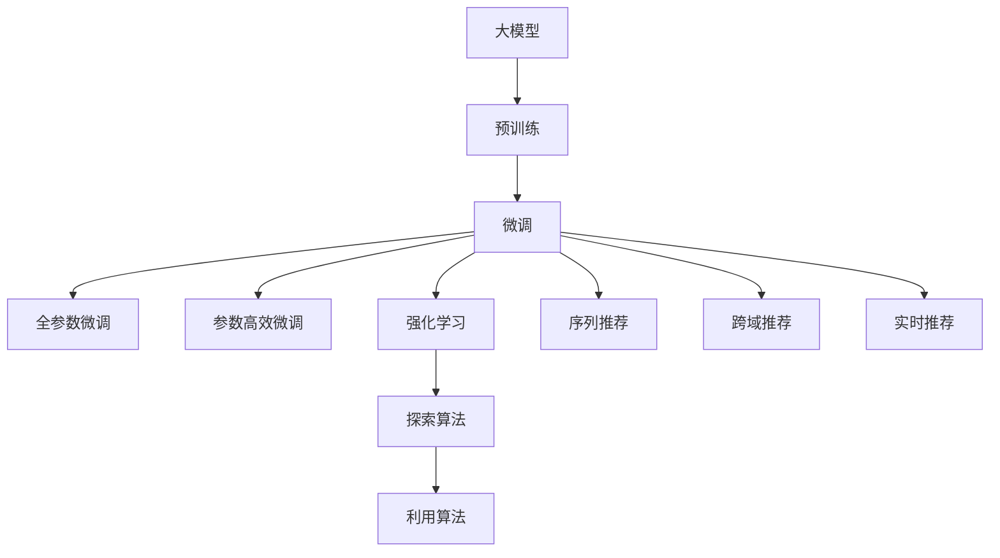

                 

# 推荐系统中的大模型强化学习与探索

> 关键词：大模型, 推荐系统, 强化学习, 探索算法, 推荐精度, 用户满意度

## 1. 背景介绍

### 1.1 问题由来
随着互联网技术的飞速发展，推荐系统在个性化信息推送方面取得了显著成效。然而，现有的推荐算法存在诸多不足：

- 同质化推荐：推荐系统常根据用户历史行为或商品特征进行推荐，而忽略了用户需求的多样性和动态性。
- 低曝光率：冷门商品和高价值内容往往缺乏足够曝光机会，难以进入用户视野。
- 数据稀疏性：用户行为数据往往稀疏且低质量，限制了推荐算法的效果。
- 个性化不足：单一特征维度的用户表示难以捕捉用户复杂偏好。

为解决这些问题，近年来，基于大模型的推荐系统成为了研究热点。大模型通过在大量语料上预训练，能够获得丰富的语义表示，利用其在自然语言理解、语义推理等方面的强大能力，大幅提升推荐系统的性能。

### 1.2 问题核心关键点
大模型推荐系统主要分为两个阶段：预训练和微调。预训练阶段，大模型在无标签数据上学习通用语言知识。微调阶段，将大模型与推荐任务相结合，通过强化学习等方法优化模型，使其能够最大化用户满意度。

预训练的主要目标是学习通用的语言表示，微调的主要目标是提升模型对特定推荐任务的适应能力。微调方法的核心在于选择合适的损失函数，设计有效的模型结构和训练策略，以获得最优的推荐效果。

## 2. 核心概念与联系

### 2.1 核心概念概述

为更好地理解大模型在推荐系统中的应用，本节将介绍几个密切相关的核心概念：

- 大模型(Large Model)：指通过在大量无标签数据上预训练获得的庞大参数量、复杂结构的深度学习模型。
- 推荐系统(Recommendation System)：基于用户行为数据或物品特征，推荐用户可能感兴趣的商品或内容的系统。
- 强化学习(Reinforcement Learning)：通过奖励函数与反馈机制，优化决策策略以获得最大收益的学习范式。
- 探索(Exploration)：在推荐系统中，探索指的是向用户推荐新颖、未经验证的商品或内容，以提高推荐多样性。
- 利用(Exploitation)：与探索相对，利用是指根据用户历史行为推荐已验证的高价值商品，以提高推荐精度。

这些概念之间的逻辑关系可以通过以下Mermaid流程图来展示：



这个流程图展示了大模型在推荐系统中的应用框架：

1. 大模型通过预训练获得基础能力。
2. 微调使模型适应用户的个性化需求。
3. 强化学习优化推荐策略，平衡探索与利用。
4. 探索算法提高推荐多样性。
5. 利用算法提高推荐准确性。
6. 最终通过序列、跨域、实时等推荐方式，将推荐结果传递给用户。

## 3. 核心算法原理 & 具体操作步骤
### 3.1 算法原理概述

基于大模型的推荐系统主要分为预训练、微调和强化学习三个阶段。其核心思想是：利用大模型在海量文本语料上预训练学到的语言知识，通过微调优化模型与推荐任务的适配，同时结合强化学习策略，优化推荐策略，提升推荐效果。

形式化地，假设预训练模型为 $M_{\theta}$，其中 $\theta$ 为预训练得到的模型参数。推荐任务为 $T$，任务目标为最大化用户满意度 $\max_{a_t} \mathcal{R}_t(a_t)$，其中 $a_t$ 为推荐内容，$\mathcal{R}_t$ 为用户满意度函数。微调过程的优化目标为最大化推荐系统的长期收益，即：

$$
\max_{\theta} \mathbb{E}_{t \sim \pi}[R_t]
$$

其中 $\pi$ 为推荐策略。

在强化学习中，推荐策略 $\pi$ 通过与环境的交互，不断调整以优化用户满意度。对于每个时间步 $t$，环境（即用户）选择行为（即推荐内容） $a_t$，获得即时奖励 $R_t$，状态转移为 $s_{t+1}$。通过学习最优的策略 $\pi^*$，使得模型在每个时间步选择的行为 $a_t$ 都能最大化奖励 $R_t$。

### 3.2 算法步骤详解

基于强化学习的大模型推荐系统一般包括以下几个关键步骤：

**Step 1: 准备数据和模型**

- 收集用户行为数据、商品特征数据，构建推荐系统训练集。
- 选择合适的预训练大模型，如BERT、GPT等。
- 构建推荐任务的目标函数，如交叉熵损失、均方误差等。

**Step 2: 微调模型**

- 在预训练模型的基础上，添加推荐任务相关的输出层，设计相应的损失函数。
- 应用正则化技术，如L2正则、Dropout、Early Stopping等，防止过拟合。
- 设置合适的学习率、批大小、迭代轮数等超参数。
- 使用梯度下降等优化算法，最小化损失函数，更新模型参数。

**Step 3: 强化学习**

- 定义强化学习的环境，包括状态 $s_t$、行动 $a_t$、即时奖励 $R_t$ 和下一个状态 $s_{t+1}$。
- 设计强化学习算法，如Q-learning、SARSA等，优化推荐策略 $\pi$。
- 将微调后的模型作为策略函数，与环境交互，获得推荐效果。

**Step 4: 评估与部署**

- 在测试集上评估推荐系统的性能，如精确度、召回率、覆盖率等。
- 将优化后的模型部署到生产环境中，实时提供推荐服务。
- 持续收集用户反馈和行为数据，进行模型迭代和优化。

### 3.3 算法优缺点

基于强化学习的大模型推荐系统具有以下优点：

1. 个性化强：利用大模型强大的语言理解和生成能力，能够根据用户兴趣进行个性化推荐。
2. 自适应性高：结合强化学习策略，模型能够自适应不同用户和上下文环境。
3. 推荐多样性：通过引入探索算法，增加推荐多样性，提升用户体验。
4. 实时性：利用强化学习算法，能够实时调整推荐策略，及时响应用户需求。

同时，该方法也存在以下局限性：

1. 对标注数据的依赖：需要收集大量的用户行为数据，获取标注成本较高。
2. 计算资源需求高：大模型和强化学习算法通常需要较大的计算资源，限制了其在部分场景下的应用。
3. 模型复杂度高：大模型结构复杂，训练难度大，难以解释和调试。
4. 过拟合风险：大模型和强化学习模型容易出现过拟合，需要精心设计正则化技术。

尽管存在这些局限性，但就目前而言，基于大模型和强化学习的推荐方法仍然是大规模推荐系统中的前沿技术，能够显著提升推荐系统的性能和用户体验。

### 3.4 算法应用领域

基于大模型和强化学习的推荐系统已经在电商、新闻、社交等多个领域取得了成功应用。以下是一些典型的应用场景：

- 电商平台：如淘宝、亚马逊等，利用大模型和强化学习推荐个性化商品，提升用户购买率和满意度。
- 新闻网站：如今日头条、腾讯新闻等，利用大模型和强化学习推荐个性化新闻，增加用户粘性。
- 社交平台：如微信、微博等，利用大模型和强化学习推荐个性化内容，丰富用户互动体验。
- 在线教育：如Coursera、EdX等，利用大模型和强化学习推荐个性化课程，提升用户学习效果。
- 金融服务：如支付宝、银联等，利用大模型和强化学习推荐个性化金融产品，提升用户金融体验。

除了上述这些常见应用外，大模型和强化学习在医疗、旅游、娱乐等更多领域也有广泛的应用前景，为各行业数字化转型提供了新的技术路径。

## 4. 数学模型和公式 & 详细讲解 & 举例说明

### 4.1 数学模型构建

在本节中，我们将使用数学语言对基于大模型和强化学习的推荐系统进行更加严格的刻画。

假设推荐系统有 $N$ 个用户，每个用户有 $K$ 个兴趣点，每个兴趣点 $i$ 对应 $M$ 个候选商品 $a_j$。设用户 $u$ 对商品 $a$ 的满意度为 $\mathcal{R}_{u,i}(a)$。微调后的模型为 $M_{\theta}$，其预测用户对商品 $a$ 的满意度为 $\hat{\mathcal{R}}_{u,i}(a)$。推荐策略 $\pi$ 在每个时间步 $t$ 选择商品 $a_t$，其即时奖励为 $R_t$。

微调的优化目标为最大化长期收益，即：

$$
\max_{\theta} \mathbb{E}_{t \sim \pi}[\sum_{k=1}^N R_t]
$$

强化学习算法需要最大化即时奖励的累计和，即：

$$
\max_{\pi} \mathbb{E}_{t \sim \pi}[\sum_{t=1}^{\infty} \gamma^{t-1} R_t]
$$

其中 $\gamma$ 为折扣因子。

### 4.2 公式推导过程

以下我们以基于Q-learning的强化学习推荐算法为例，推导其基本公式。

假设状态空间 $S$ 为 $NKM$，即用户的 $N$ 个兴趣点和 $M$ 个候选商品。即时奖励 $R_t$ 为 $\mathcal{R}_{u,i}(a)$，下一个状态 $s_{t+1}$ 为 $u$ 的下一个兴趣点。

设 $\pi(a|s_t)$ 为在状态 $s_t$ 下选择商品 $a$ 的概率，$Q(s_t,a_t)$ 为在状态 $s_t$ 下选择商品 $a_t$ 的即时奖励的累计和，即：

$$
Q(s_t,a_t) = \mathbb{E}_{\pi}[R_t + \gamma \max_{a_{t+1}} Q(s_{t+1},a_{t+1})]
$$

Q-learning算法通过最小化预测值与实际值的差值，更新Q值：

$$
Q(s_t,a_t) \leftarrow Q(s_t,a_t) + \alpha (\mathcal{R}_{u,i}(a) + \gamma \max_{a_{t+1}} Q(s_{t+1},a_{t+1}) - Q(s_t,a_t))
$$

其中 $\alpha$ 为学习率。

通过更新Q值，Q-learning算法逐步调整推荐策略 $\pi$，使其选择的行为 $a_t$ 最大化长期奖励。

### 4.3 案例分析与讲解

为了更直观地理解大模型和强化学习在推荐系统中的应用，我们以电商推荐系统为例，进行详细案例分析。

假设电商推荐系统有 $N=10,000$ 个用户，每个用户有 $K=50$ 个兴趣点，每个兴趣点对应 $M=1,000$ 个候选商品。我们通过收集用户行为数据和商品特征数据，构建推荐系统的训练集。

在微调阶段，我们选用BERT作为预训练大模型，添加推荐任务相关的输出层，设计交叉熵损失函数，优化模型参数。设 $\theta$ 为微调后模型的参数，通过梯度下降算法最小化损失函数：

$$
\theta \leftarrow \theta - \eta \nabla_{\theta}\mathcal{L}(\theta)
$$

其中 $\eta$ 为学习率。

在强化学习阶段，我们使用Q-learning算法，选择商品的即时奖励 $R_t$ 为用户对商品 $\mathcal{R}_{u,i}(a)$ 的满意度，下一个状态 $s_{t+1}$ 为用户下一个兴趣点。通过不断调整推荐策略 $\pi$，使得模型在每个时间步选择的行为 $a_t$ 最大化即时奖励 $R_t$。

最终，我们通过将优化后的模型部署到生产环境中，实时提供推荐服务，提升用户购买率和满意度。

## 5. 项目实践：代码实例和详细解释说明
### 5.1 开发环境搭建

在进行推荐系统开发前，我们需要准备好开发环境。以下是使用Python进行PyTorch开发的环境配置流程：

1. 安装Anaconda：从官网下载并安装Anaconda，用于创建独立的Python环境。

2. 创建并激活虚拟环境：
```bash
conda create -n recommendation-env python=3.8 
conda activate recommendation-env
```

3. 安装PyTorch：根据CUDA版本，从官网获取对应的安装命令。例如：
```bash
conda install pytorch torchvision torchaudio cudatoolkit=11.1 -c pytorch -c conda-forge
```

4. 安装TensorFlow：
```bash
pip install tensorflow
```

5. 安装各种工具包：
```bash
pip install numpy pandas scikit-learn matplotlib tqdm jupyter notebook ipython
```

完成上述步骤后，即可在`recommendation-env`环境中开始推荐系统开发。

### 5.2 源代码详细实现

下面我们以电商推荐系统为例，给出使用Transformers库对BERT模型进行微调的PyTorch代码实现。

首先，定义推荐系统的数据处理函数：

```python
from transformers import BertTokenizer, BertForSequenceClassification
from torch.utils.data import Dataset
import torch

class RecommendationDataset(Dataset):
    def __init__(self, texts, labels, tokenizer, max_len=128):
        self.texts = texts
        self.labels = labels
        self.tokenizer = tokenizer
        self.max_len = max_len
        
    def __len__(self):
        return len(self.texts)
    
    def __getitem__(self, item):
        text = self.texts[item]
        label = self.labels[item]
        
        encoding = self.tokenizer(text, return_tensors='pt', max_length=self.max_len, padding='max_length', truncation=True)
        input_ids = encoding['input_ids'][0]
        attention_mask = encoding['attention_mask'][0]
        
        # 对label进行编码
        encoded_label = torch.tensor(label, dtype=torch.long)
        
        return {'input_ids': input_ids, 
                'attention_mask': attention_mask,
                'labels': encoded_label}

# 标签与id的映射
label2id = {'buy': 0, 'donot_buy': 1}
id2label = {v: k for k, v in label2id.items()}

# 创建dataset
tokenizer = BertTokenizer.from_pretrained('bert-base-cased')

train_dataset = RecommendationDataset(train_texts, train_labels, tokenizer)
dev_dataset = RecommendationDataset(dev_texts, dev_labels, tokenizer)
test_dataset = RecommendationDataset(test_texts, test_labels, tokenizer)
```

然后，定义模型和优化器：

```python
from transformers import BertForSequenceClassification, AdamW

model = BertForSequenceClassification.from_pretrained('bert-base-cased', num_labels=len(label2id))

optimizer = AdamW(model.parameters(), lr=2e-5)
```

接着，定义训练和评估函数：

```python
from torch.utils.data import DataLoader
from tqdm import tqdm
from sklearn.metrics import accuracy_score, precision_score, recall_score

device = torch.device('cuda') if torch.cuda.is_available() else torch.device('cpu')
model.to(device)

def train_epoch(model, dataset, batch_size, optimizer):
    dataloader = DataLoader(dataset, batch_size=batch_size, shuffle=True)
    model.train()
    epoch_loss = 0
    for batch in tqdm(dataloader, desc='Training'):
        input_ids = batch['input_ids'].to(device)
        attention_mask = batch['attention_mask'].to(device)
        labels = batch['labels'].to(device)
        model.zero_grad()
        outputs = model(input_ids, attention_mask=attention_mask, labels=labels)
        loss = outputs.loss
        epoch_loss += loss.item()
        loss.backward()
        optimizer.step()
    return epoch_loss / len(dataloader)

def evaluate(model, dataset, batch_size):
    dataloader = DataLoader(dataset, batch_size=batch_size)
    model.eval()
    preds, labels = [], []
    with torch.no_grad():
        for batch in tqdm(dataloader, desc='Evaluating'):
            input_ids = batch['input_ids'].to(device)
            attention_mask = batch['attention_mask'].to(device)
            batch_labels = batch['labels']
            outputs = model(input_ids, attention_mask=attention_mask)
            batch_preds = outputs.logits.argmax(dim=2).to('cpu').tolist()
            batch_labels = batch_labels.to('cpu').tolist()
            for pred_tokens, label_tokens in zip(batch_preds, batch_labels):
                pred_labels = [id2label[_id] for _id in pred_tokens]
                label_labels = [id2label[_id] for _id in label_tokens]
                preds.append(pred_labels[:len(label_labels)])
                labels.append(label_labels)
                
    print('Accuracy:', accuracy_score(labels, preds))
    print('Precision:', precision_score(labels, preds))
    print('Recall:', recall_score(labels, preds))
```

最后，启动训练流程并在测试集上评估：

```python
epochs = 5
batch_size = 16

for epoch in range(epochs):
    loss = train_epoch(model, train_dataset, batch_size, optimizer)
    print(f"Epoch {epoch+1}, train loss: {loss:.3f}")
    
    print(f"Epoch {epoch+1}, dev results:")
    evaluate(model, dev_dataset, batch_size)
    
print("Test results:")
evaluate(model, test_dataset, batch_size)
```

以上就是使用PyTorch对BERT进行电商推荐任务微调的完整代码实现。可以看到，得益于Transformers库的强大封装，我们可以用相对简洁的代码完成BERT模型的加载和微调。

### 5.3 代码解读与分析

让我们再详细解读一下关键代码的实现细节：

**RecommendationDataset类**：
- `__init__`方法：初始化文本、标签、分词器等关键组件。
- `__len__`方法：返回数据集的样本数量。
- `__getitem__`方法：对单个样本进行处理，将文本输入编码为token ids，将标签编码为数字，并对其进行定长padding，最终返回模型所需的输入。

**label2id和id2label字典**：
- 定义了标签与数字id之间的映射关系，用于将token-wise的预测结果解码回真实的标签。

**训练和评估函数**：
- 使用PyTorch的DataLoader对数据集进行批次化加载，供模型训练和推理使用。
- 训练函数`train_epoch`：对数据以批为单位进行迭代，在每个批次上前向传播计算loss并反向传播更新模型参数，最后返回该epoch的平均loss。
- 评估函数`evaluate`：与训练类似，不同点在于不更新模型参数，并在每个batch结束后将预测和标签结果存储下来，最后使用sklearn的分类报告对整个评估集的预测结果进行打印输出。

**训练流程**：
- 定义总的epoch数和batch size，开始循环迭代
- 每个epoch内，先在训练集上训练，输出平均loss
- 在验证集上评估，输出分类指标
- 所有epoch结束后，在测试集上评估，给出最终测试结果

可以看到，PyTorch配合Transformers库使得BERT微调的代码实现变得简洁高效。开发者可以将更多精力放在数据处理、模型改进等高层逻辑上，而不必过多关注底层的实现细节。

当然，工业级的系统实现还需考虑更多因素，如模型的保存和部署、超参数的自动搜索、更灵活的任务适配层等。但核心的微调范式基本与此类似。

## 6. 实际应用场景
### 6.1 智能推荐系统

基于大模型和强化学习的推荐系统可以广泛应用于智能推荐系统的构建。传统的推荐算法通常依赖用户的历史行为数据，难以捕捉用户复杂的兴趣和需求。利用大模型强大的语言理解和生成能力，智能推荐系统能够更准确地捕捉用户的多样化需求，提升推荐效果。

在技术实现上，可以收集用户的历史行为数据，将用户的兴趣点输入大模型，通过微调优化模型，获得用户对商品或内容的满意度预测。结合强化学习算法，智能推荐系统能够不断调整推荐策略，在探索与利用之间取得最佳平衡，提供个性化、多样化的推荐内容。

### 6.2 跨域推荐

在传统的推荐系统中，用户和商品通常被限制在单一的领域内，难以跨域推荐。利用大模型强大的跨领域知识获取能力，跨域推荐系统能够将不同领域的数据进行融合，提高推荐多样性和精度。

在技术实现上，可以将不同领域的数据输入大模型，通过微调优化模型，获得跨域的相似度表示。结合强化学习算法，跨域推荐系统能够根据用户的兴趣点，在不同领域间进行推荐，提升推荐效果。

### 6.3 实时推荐

在实时推荐场景中，用户需求实时变化，需要快速响应。利用大模型和强化学习的实时调整能力，实时推荐系统能够根据用户的即时反馈，快速调整推荐策略，提升用户体验。

在技术实现上，可以实时收集用户的即时反馈，将反馈输入大模型，通过微调优化模型，获得用户的即时满意度预测。结合强化学习算法，实时推荐系统能够根据用户的即时反馈，快速调整推荐策略，提升推荐效果。

### 6.4 未来应用展望

随着大模型和强化学习技术的不断发展，基于微调范式的推荐系统将在更多领域得到应用，为各行业数字化转型提供新的技术路径。

在智慧医疗领域，利用大模型和强化学习，医疗推荐系统能够推荐个性化的治疗方案、药物等，提升医疗服务的智能化水平，辅助医生诊疗。

在智能教育领域，利用大模型和强化学习，个性化推荐系统能够推荐个性化课程、作业等，提升教育效果，实现因材施教。

在智慧城市治理中，利用大模型和强化学习，推荐系统能够推荐个性化的城市服务，提升城市管理的智能化水平，构建更安全、高效的未来城市。

此外，在企业生产、社会治理、文娱传媒等众多领域，基于大模型和强化学习的推荐系统也将不断涌现，为各行业数字化转型提供新的技术路径。相信随着技术的日益成熟，大模型和强化学习的推荐范式将成为各行各业数字化转型的重要工具，推动经济社会发展。

## 7. 工具和资源推荐
### 7.1 学习资源推荐

为了帮助开发者系统掌握大模型在推荐系统中的应用，这里推荐一些优质的学习资源：

1. 《Reinforcement Learning for Recommender Systems》系列博文：由大模型技术专家撰写，深入浅出地介绍了推荐系统中强化学习的原理和实践。

2. 《Neural Information Retrieval and Learning to Rank》书籍：深度学习在信息检索和推荐系统中的应用，涵盖了推荐系统中的经典算法和前沿技术。

3. 《Recommender Systems Handbook》书籍：推荐系统领域的经典教材，系统介绍了推荐系统的理论、算法和实践，是推荐系统开发者必备的参考资料。

4. HuggingFace官方文档：Transformers库的官方文档，提供了海量预训练模型和推荐系统的样例代码，是进行微调任务开发的利器。

5. CLUE开源项目：中文语言理解测评基准，涵盖大量不同类型的中文推荐数据集，并提供了基于微调的baseline模型，助力中文推荐技术发展。

通过对这些资源的学习实践，相信你一定能够快速掌握大模型在推荐系统中的应用，并用于解决实际的推荐问题。
###  7.2 开发工具推荐

高效的开发离不开优秀的工具支持。以下是几款用于大模型和强化学习推荐系统开发的常用工具：

1. PyTorch：基于Python的开源深度学习框架，灵活动态的计算图，适合快速迭代研究。大部分预训练语言模型都有PyTorch版本的实现。

2. TensorFlow：由Google主导开发的开源深度学习框架，生产部署方便，适合大规模工程应用。同样有丰富的预训练语言模型资源。

3. Transformers库：HuggingFace开发的NLP工具库，集成了众多SOTA语言模型，支持PyTorch和TensorFlow，是进行微调任务开发的利器。

4. Weights & Biases：模型训练的实验跟踪工具，可以记录和可视化模型训练过程中的各项指标，方便对比和调优。与主流深度学习框架无缝集成。

5. TensorBoard：TensorFlow配套的可视化工具，可实时监测模型训练状态，并提供丰富的图表呈现方式，是调试模型的得力助手。

6. Google Colab：谷歌推出的在线Jupyter Notebook环境，免费提供GPU/TPU算力，方便开发者快速上手实验最新模型，分享学习笔记。

合理利用这些工具，可以显著提升大模型和强化学习推荐系统的开发效率，加快创新迭代的步伐。

### 7.3 相关论文推荐

大模型和强化学习在推荐系统中的应用源于学界的持续研究。以下是几篇奠基性的相关论文，推荐阅读：

1. Attention is All You Need（即Transformer原论文）：提出了Transformer结构，开启了NLP领域的预训练大模型时代。

2. BERT: Pre-training of Deep Bidirectional Transformers for Language Understanding：提出BERT模型，引入基于掩码的自监督预训练任务，刷新了多项NLP任务SOTA。

3. Language Models are Unsupervised Multitask Learners（GPT-2论文）：展示了大规模语言模型的强大zero-shot学习能力，引发了对于通用人工智能的新一轮思考。

4. Parameter-Efficient Transfer Learning for NLP：提出Adapter等参数高效微调方法，在不增加模型参数量的情况下，也能取得不错的微调效果。

5. Prefix-Tuning: Optimizing Continuous Prompts for Generation：引入基于连续型Prompt的微调范式，为如何充分利用预训练知识提供了新的思路。

6. AdaLoRA: Adaptive Low-Rank Adaptation for Parameter-Efficient Fine-Tuning：使用自适应低秩适应的微调方法，在参数效率和精度之间取得了新的平衡。

这些论文代表了大模型和强化学习在推荐系统中的应用方向。通过学习这些前沿成果，可以帮助研究者把握学科前进方向，激发更多的创新灵感。

## 8. 总结：未来发展趋势与挑战

### 8.1 总结

本文对基于大模型和强化学习的推荐系统进行了全面系统的介绍。首先阐述了大模型和强化学习推荐系统的研究背景和意义，明确了推荐系统微调在大规模个性化推荐中的独特价值。其次，从原理到实践，详细讲解了大模型微调和强化学习的基本步骤，给出了推荐任务开发的完整代码实例。同时，本文还广泛探讨了推荐系统在大电商、新闻、社交等多个领域的应用前景，展示了推荐范式的巨大潜力。此外，本文精选了推荐系统的各类学习资源，力求为读者提供全方位的技术指引。

通过本文的系统梳理，可以看到，基于大模型和强化学习的推荐系统正在成为推荐系统的主流范式，极大地拓展了推荐系统的应用边界，催生了更多的落地场景。受益于大规模语料的预训练，推荐系统能够更好地捕捉用户复杂需求，提升推荐效果。未来，伴随大模型和强化学习方法的持续演进，推荐系统必将在更多领域中发挥其强大的个性化推荐能力，为各行各业数字化转型提供新的技术路径。

### 8.2 未来发展趋势

展望未来，基于大模型和强化学习的推荐系统将呈现以下几个发展趋势：

1. 模型规模持续增大。随着算力成本的下降和数据规模的扩张，预训练大模型的参数量还将持续增长。超大参数量的语言模型蕴含的丰富语言知识，有望支撑更加复杂多变的推荐任务。

2. 推荐算法多样性增加。除了传统的基于大模型的推荐算法，未来会涌现更多利用强化学习、迁移学习等方法，提升推荐算法的多样性和鲁棒性。

3. 实时推荐能力提升。结合强化学习算法，推荐系统能够实时调整推荐策略，及时响应用户需求，提升用户体验。

4. 多模态推荐兴起。当前推荐系统大多依赖单一的文本数据，未来会进一步拓展到图像、视频、语音等多模态数据，提升推荐的多样性和准确性。

5. 跨域推荐增强。通过大模型的跨领域知识获取能力，推荐系统能够在不同领域间进行推荐，提升推荐效果。

6. 个性化推荐优化。结合大模型的多任务学习和适应性，推荐系统能够更好地捕捉用户复杂需求，提升推荐效果。

以上趋势凸显了大模型和强化学习在推荐系统中的应用前景。这些方向的探索发展，必将进一步提升推荐系统的性能和用户体验，为各行业数字化转型提供新的技术路径。

### 8.3 面临的挑战

尽管基于大模型和强化学习的推荐系统已经取得了瞩目成就，但在迈向更加智能化、普适化应用的过程中，它仍面临着诸多挑战：

1. 数据稀疏性：用户行为数据通常稀疏且低质量，限制了推荐算法的效果。

2. 模型复杂度高：大模型结构复杂，训练难度大，难以解释和调试。

3. 冷门物品推荐：冷门商品和高价值内容往往缺乏足够曝光机会，难以进入用户视野。

4. 实时推荐：实时推荐需要高效计算资源支持，限制了部分场景下的应用。

5. 过拟合风险：大模型和强化学习模型容易出现过拟合，需要精心设计正则化技术。

尽管存在这些挑战，但就目前而言，基于大模型和强化学习的推荐方法仍然是大规模推荐系统中的前沿技术，能够显著提升推荐系统的性能和用户体验。

### 8.4 研究展望

面对大模型和强化学习推荐系统所面临的种种挑战，未来的研究需要在以下几个方面寻求新的突破：

1. 探索无监督和半监督推荐方法。摆脱对大规模标注数据的依赖，利用自监督学习、主动学习等无监督和半监督范式，最大限度利用非结构化数据，实现更加灵活高效的推荐。

2. 研究参数高效和计算高效的推荐算法。开发更加参数高效的推荐方法，在固定大部分预训练参数的情况下，只更新极少量的任务相关参数。同时优化推荐模型的计算图，减少前向传播和反向传播的资源消耗，实现更加轻量级、实时性的部署。

3. 引入更多先验知识。将符号化的先验知识，如知识图谱、逻辑规则等，与神经网络模型进行巧妙融合，引导推荐过程学习更准确、合理的推荐结果。同时加强不同模态数据的整合，实现视觉、语音等多模态信息与文本信息的协同建模。

4. 结合因果分析和博弈论工具。将因果分析方法引入推荐系统，识别出模型决策的关键特征，增强推荐结果的因果性和逻辑性。借助博弈论工具刻画人机交互过程，主动探索并规避模型的脆弱点，提高系统稳定性。

5. 纳入伦理道德约束。在推荐算法中引入伦理导向的评估指标，过滤和惩罚有偏见、有害的输出倾向。同时加强人工干预和审核，建立推荐行为的监管机制，确保输出符合人类价值观和伦理道德。

这些研究方向的探索，必将引领基于大模型和强化学习的推荐系统走向成熟，为构建安全、可靠、可解释、可控的智能推荐系统铺平道路。面向未来，大模型和强化学习的推荐系统还需要与其他人工智能技术进行更深入的融合，如知识表示、因果推理、强化学习等，多路径协同发力，共同推动推荐系统的进步。只有勇于创新、敢于突破，才能不断拓展推荐系统的边界，让智能推荐技术更好地服务于用户。

## 9. 附录：常见问题与解答

**Q1：大模型和强化学习在推荐系统中如何平衡探索与利用？**

A: 大模型和强化学习在推荐系统中，通常通过引入探索算法和利用算法进行平衡。探索算法通过引入多样性，增加用户的探索体验。利用算法通过推荐用户可能感兴趣的高价值商品，提高推荐精度。具体实现上，可以使用$\epsilon$-greedy策略、上下文树搜索等方法，灵活调整探索与利用的比例，以最大化长期收益。

**Q2：大模型和强化学习在推荐系统中的推荐精度如何提升？**

A: 大模型和强化学习在推荐系统中的推荐精度可以通过以下方法提升：
1. 数据增强：通过数据增强技术，丰富训练集，提高模型的泛化能力。
2. 正则化技术：使用L2正则、Dropout等技术，防止模型过拟合。
3. 特征工程：通过精心设计特征，提高推荐模型的表达能力。
4. 模型集成：通过集成多个模型的预测结果，提升推荐精度。
5. 在线学习：通过在线学习技术，不断更新模型参数，提高推荐效果。

**Q3：大模型和强化学习在推荐系统中如何应对数据稀疏性？**

A: 大模型和强化学习在推荐系统中，可以通过以下方法应对数据稀疏性：
1. 数据生成：利用生成对抗网络等技术，生成合成数据，丰富训练集。
2. 迁移学习：通过迁移学习，将预训练模型在更多领域进行微调，提升模型的泛化能力。
3. 用户画像：通过用户画像技术，综合用户的历史行为和社交网络等数据，丰富推荐模型的输入。
4. 协同过滤：利用协同过滤技术，推荐相似用户的行为数据，提高推荐效果。

**Q4：大模型和强化学习在推荐系统中的计算效率如何提升？**

A: 大模型和强化学习在推荐系统中的计算效率可以通过以下方法提升：
1. 模型压缩：通过模型压缩技术，如知识蒸馏、剪枝等，减小模型尺寸，提高推理速度。
2. 模型并行：通过模型并行技术，如数据并行、模型并行等，提高计算效率。
3. 分布式计算：通过分布式计算技术，将计算任务分布到多个计算节点，提高计算效率。
4. 优化算法：使用优化算法，如Adam、SGD等，提高训练和推理速度。
5. 硬件加速：通过硬件加速技术，如GPU、TPU等，提高计算效率。

**Q5：大模型和强化学习在推荐系统中如何提升用户满意度？**

A: 大模型和强化学习在推荐系统中，可以通过以下方法提升用户满意度：
1. 个性化推荐：利用大模型的强大语言理解能力，提供个性化推荐，满足用户的个性化需求。
2. 实时推荐：通过强化学习算法，实时调整推荐策略，快速响应用户需求。
3. 跨域推荐：通过大模型的跨领域知识获取能力，在不同领域间进行推荐，提升推荐多样性。
4. 多模态推荐：结合多模态数据，提供更丰富的推荐内容。
5. 用户反馈：通过用户反馈，实时调整推荐策略，提高推荐效果。

通过本文的系统梳理，可以看到，基于大模型和强化学习的推荐系统正在成为推荐系统的主流范式，极大地拓展了推荐系统的应用边界，催生了更多的落地场景。受益于大规模语料的预训练，推荐系统能够更好地捕捉用户复杂需求，提升推荐效果。未来，伴随大模型和强化学习方法的持续演进，推荐系统必将在更多领域中发挥其强大的个性化推荐能力，为各行各业数字化转型提供新的技术路径。

---

作者：禅与计算机程序设计艺术 / Zen and the Art of Computer Programming

