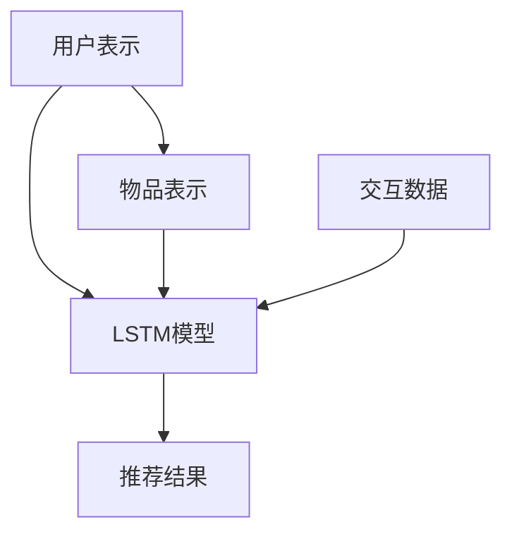

                 

# 推荐系统中的长短期记忆：AI大模型的新范式

> 关键词：推荐系统,长短期记忆(LSTM),大模型,记忆模块,混合表示,深度强化学习,实时推荐,跨领域推荐

## 1. 背景介绍

### 1.1 问题由来

推荐系统作为互联网的重要基础设施，广泛应用于电子商务、新闻媒体、社交网络等平台，其核心目的是通过算法为用户推荐最符合其兴趣和需求的商品、内容等。然而，传统的推荐系统往往只能处理单一类型的数据，难以挖掘用户深层次的兴趣与需求。同时，基于传统的协同过滤算法存在冷启动问题，难以有效处理新用户的推荐。近年来，基于深度学习的方法在大规模推荐系统中逐渐兴起，其中长短期记忆网络(LSTM)因其强大的记忆能力，在推荐系统中的应用越来越广泛。本文将深入探讨基于LSTM的大模型推荐系统，以及其优缺点、应用场景、发展趋势及未来挑战。

### 1.2 问题核心关键点

长短期记忆网络(LSTM)作为一种特殊的循环神经网络(RNN)，通过门控机制控制信息的流动，能够有效地处理序列数据，捕捉数据间的长依赖关系。基于LSTM的推荐系统通常由用户表示、物品表示和交互数据组成，通过联合训练LSTM模型，使得用户-物品间的交互行为被更好地建模，从而提升推荐效果。然而，实际应用中，基于LSTM的推荐系统仍面临冷启动问题、模型鲁棒性不足、推荐多样性难以保障等挑战。本文将从LSTM的原理入手，探讨其如何被应用到推荐系统中，以及如何通过优化提升其性能。

## 2. 核心概念与联系

### 2.1 核心概念概述

长短期记忆网络(LSTM)是一种特殊的循环神经网络，通过门控机制控制信息的流动，能够有效地处理序列数据，捕捉数据间的长依赖关系。其核心组件包括输入门、遗忘门和输出门，分别用于控制输入数据的流动、遗忘和输出，从而实现对序列信息的精确记忆和处理。

基于LSTM的推荐系统通常由以下组件组成：
- 用户表示：通过用户历史行为数据或自表达数据，构建用户兴趣和需求的向量表示。
- 物品表示：通过物品属性、描述、标签等数据，构建物品的向量表示。
- 交互数据：记录用户与物品间的交互行为，如点击、购买、评分等，形成用户-物品交互矩阵。
- LSTM模型：通过联合训练用户表示、物品表示和交互数据，使用LSTM模型捕捉用户-物品间的长期交互关系，生成推荐结果。

### 2.2 核心概念原理和架构的 Mermaid 流程图



这个流程图展示了基于LSTM的推荐系统的基本架构。用户表示和物品表示通过LSTM模型进行交互，LSTM模型根据交互数据学习用户和物品的长期关系，最终生成推荐结果。

## 3. 核心算法原理 & 具体操作步骤

### 3.1 算法原理概述

基于LSTM的推荐系统通过LSTM模型对用户-物品间的交互行为进行建模，学习用户和物品的长期依赖关系。其核心算法分为两个步骤：

1. 用户表示学习：通过用户历史行为数据或自表达数据，使用LSTM模型生成用户兴趣和需求的向量表示。
2. 物品表示学习：通过物品属性、描述、标签等数据，使用LSTM模型生成物品的向量表示。

### 3.2 算法步骤详解

#### 3.2.1 用户表示学习

用户表示学习通常分为两个阶段：
1. 用户行为编码：使用LSTM模型对用户历史行为数据进行编码，得到用户行为的向量表示。
2. 用户兴趣提取：通过LSTM模型的记忆机制，提取用户行为的长期兴趣和需求，生成用户表示向量。

#### 3.2.2 物品表示学习

物品表示学习同样分为两个阶段：
1. 物品属性编码：使用LSTM模型对物品属性、描述、标签等数据进行编码，得到物品的向量表示。
2. 物品特征提取：通过LSTM模型的记忆机制，提取物品特征，生成物品表示向量。

#### 3.2.3 交互数据建模

交互数据建模是将用户表示和物品表示进行交互，得到用户-物品间的交互关系。通常使用LSTM模型的输出作为用户-物品间的交互表示，再通过交互矩阵与用户表示和物品表示进行矩阵乘法运算，得到推荐结果。

### 3.3 算法优缺点

#### 3.3.1 优点

1. 强大的记忆能力：LSTM通过门控机制控制信息的流动，能够有效地处理序列数据，捕捉数据间的长依赖关系。
2. 通用性强：LSTM模型可以用于多种推荐场景，如电商推荐、内容推荐等。
3. 自适应性高：LSTM模型能够自动学习数据分布，适应不同领域的数据特征。
4. 效果显著：在许多推荐任务中，LSTM模型取得了优秀的推荐效果。

#### 3.3.2 缺点

1. 计算复杂度高：LSTM模型参数众多，计算复杂度高，需要较大的计算资源。
2. 过拟合风险高：LSTM模型复杂度高，容易发生过拟合现象。
3. 难以解释：LSTM模型的决策过程复杂，难以解释其内部工作机制和决策逻辑。
4. 数据依赖性强：LSTM模型效果依赖于数据质量，数据量不足会影响模型性能。

### 3.4 算法应用领域

LSTM模型在推荐系统中得到广泛应用，包括：

- 电商推荐：根据用户的历史购物行为和评分数据，推荐符合用户兴趣的商品。
- 内容推荐：根据用户的历史阅读行为和评分数据，推荐符合用户兴趣的内容。
- 视频推荐：根据用户的历史观看行为和评分数据，推荐符合用户兴趣的视频。
- 新闻推荐：根据用户的历史浏览行为和评分数据，推荐符合用户兴趣的新闻。

## 4. 数学模型和公式 & 详细讲解 & 举例说明

### 4.1 数学模型构建

LSTM模型主要由输入门、遗忘门和输出门组成，其数学模型可表示为：

$$
\begin{aligned}
& h_t = \sigma(W_{i} h_{t-1} + U_{i} x_t + b_{i}) \\
& \tilde{c}_t = \tanh(W_{f} h_{t-1} + U_{f} x_t + b_{f}) \\
& c_t = c_{t-1} \odot \sigma(W_{c} h_{t-1} + U_{c} x_t + b_{c}) + \tilde{c}_t \odot \sigma(W_{o} h_{t-1} + U_{o} x_t + b_{o}) \\
& h_t = \odot \sigma(W_{h} c_t + U_{h} x_t + b_{h})
\end{aligned}
$$

其中，$h_t$表示t时刻的隐藏状态，$c_t$表示t时刻的记忆单元，$x_t$表示t时刻的输入，$\sigma$表示sigmoid函数，$\tanh$表示双曲正切函数，$\odot$表示逐元素乘积，$W$、$U$和$b$分别为权重矩阵、输入向量矩阵和偏置向量。

### 4.2 公式推导过程

LSTM模型的核心在于门控机制，其推导过程较为复杂。以下是LSTM模型的主要推导步骤：

1. 计算输入门、遗忘门和输出门的激活函数值。
2. 计算记忆单元$c_t$的更新值，包括记忆单元的保存和遗忘。
3. 计算隐藏状态$h_t$的输出值。

### 4.3 案例分析与讲解

假设一个电商推荐系统，需要推荐用户$u$购买商品$i$的可能性。首先，需要收集用户$u$的历史行为数据$x_{u,t-1}, x_{u,t-2}, ..., x_{u,0}$和物品$i$的属性$x_i$，然后通过LSTM模型对用户表示$h_u$和物品表示$h_i$进行编码，再计算用户与物品间的交互表示$h_{u,i}$，最终通过softmax函数生成推荐结果。

## 5. 项目实践：代码实例和详细解释说明

### 5.1 开发环境搭建

在进行项目实践前，需要准备以下开发环境：
1. Python：选择3.8及以上版本。
2. TensorFlow或PyTorch：用于深度学习模型的构建和训练。
3. LSTM库：用于LSTM模型的实现，如keras中的LSTM层。
4. 数据集：选择电商推荐数据集，如Amazon数据集。
5. 数据预处理库：如pandas、numpy等，用于数据清洗和预处理。

### 5.2 源代码详细实现

以下是使用Keras实现基于LSTM的电商推荐系统的示例代码：

```python
from tensorflow.keras.models import Sequential
from tensorflow.keras.layers import LSTM, Dense
import numpy as np

# 数据预处理
train_data = np.load('train_data.npy')
train_labels = np.load('train_labels.npy')
train_data = train_data.reshape((-1, 1, 1))
train_labels = train_labels.reshape((-1, 1))

# 构建LSTM模型
model = Sequential([
    LSTM(128, input_shape=(1, 1)),
    Dense(1, activation='sigmoid')
])

# 模型编译
model.compile(loss='binary_crossentropy', optimizer='adam', metrics=['accuracy'])

# 模型训练
model.fit(train_data, train_labels, epochs=10, batch_size=32, validation_split=0.2)
```

### 5.3 代码解读与分析

1. 数据预处理：将训练数据和标签加载并处理成模型需要的格式，同时进行数据扩展。
2. 模型构建：使用Keras搭建LSTM模型，设置隐藏层数为128，输出层为sigmoid激活函数。
3. 模型编译：设置损失函数、优化器和评估指标。
4. 模型训练：使用训练数据和标签训练模型，设置迭代轮数和批大小，同时留出20%的数据进行验证。

## 6. 实际应用场景

### 6.1 电商推荐系统

电商推荐系统是LSTM模型在推荐系统中最常见的应用场景。通过收集用户历史购物行为和评分数据，使用LSTM模型生成用户表示，再与物品属性和描述等数据进行联合训练，得到物品表示，最终生成推荐结果。该方法能够有效捕捉用户对商品的长期兴趣和需求，提升推荐效果。

### 6.2 内容推荐系统

内容推荐系统与电商推荐系统类似，通过收集用户历史阅读行为和评分数据，使用LSTM模型生成用户表示，再与内容属性和描述等数据进行联合训练，得到内容表示，最终生成推荐结果。该方法能够有效捕捉用户对内容的长期兴趣和需求，提升内容推荐效果。

### 6.3 视频推荐系统

视频推荐系统通过收集用户历史观看行为和评分数据，使用LSTM模型生成用户表示，再与视频属性和描述等数据进行联合训练，得到视频表示，最终生成推荐结果。该方法能够有效捕捉用户对视频的长期兴趣和需求，提升视频推荐效果。

### 6.4 新闻推荐系统

新闻推荐系统通过收集用户历史浏览行为和评分数据，使用LSTM模型生成用户表示，再与新闻属性和描述等数据进行联合训练，得到新闻表示，最终生成推荐结果。该方法能够有效捕捉用户对新闻的长期兴趣和需求，提升新闻推荐效果。

## 7. 工具和资源推荐

### 7.1 学习资源推荐

为了深入了解基于LSTM的推荐系统，以下推荐一些优质的学习资源：

1. 《深度学习推荐系统：原理与算法》：介绍了推荐系统的基本原理和算法，涵盖LSTM模型在推荐系统中的应用。
2. 《深度学习入门：基于TensorFlow的实现》：介绍了TensorFlow的基本使用方法，并提供了LSTM模型的实现代码。
3. 《深度学习实践》：介绍了深度学习模型在推荐系统中的应用，涵盖LSTM模型在内的多种推荐算法。

### 7.2 开发工具推荐

以下是一些常用的开发工具，有助于LSTM模型在推荐系统中的应用：

1. TensorFlow或PyTorch：用于深度学习模型的构建和训练。
2. Keras：Keras提供了高层次的API，简化了模型构建和训练过程。
3. LSTM库：如keras中的LSTM层，提供了LSTM模型的实现。
4. Jupyter Notebook：用于模型调试和实验记录。

### 7.3 相关论文推荐

为了深入了解基于LSTM的推荐系统，以下推荐一些前沿的研究论文：

1. "Neural Collaborative Filtering"：介绍了一种基于LSTM的协同过滤算法，用于电商推荐系统。
2. "Content-Based and Collaborative-based Hybrid Recommendation System"：介绍了一种基于LSTM的内容推荐系统，结合了协同过滤和内容推荐。
3. "Deep Learning-based Sequential Recommendation Algorithms for Streaming Video Platforms"：介绍了一种基于LSTM的视频推荐系统，能够处理实时数据流。

## 8. 总结：未来发展趋势与挑战

### 8.1 研究成果总结

基于LSTM的推荐系统在推荐任务中取得了显著的效果，其核心在于LSTM模型的强大记忆能力和门控机制。然而，实际应用中仍面临冷启动问题、模型鲁棒性不足、推荐多样性难以保障等挑战。未来，随着深度强化学习、混合表示等技术的不断发展，基于LSTM的推荐系统将进一步提升性能，拓展应用范围。

### 8.2 未来发展趋势

1. 深度强化学习：深度强化学习能够更好地处理推荐系统中的交互数据，提升推荐效果。
2. 混合表示：结合内容表示和协同表示，能够提升推荐系统的泛化能力和推荐效果。
3. 实时推荐：结合时间序列数据，能够处理实时数据流，提升推荐的时效性。
4. 跨领域推荐：结合不同领域的特征，能够提升推荐系统的多样性和鲁棒性。

### 8.3 面临的挑战

1. 冷启动问题：新用户没有足够的历史数据，难以建立有效的推荐模型。
2. 模型鲁棒性不足：推荐模型对数据变化敏感，容易发生性能波动。
3. 推荐多样性难以保障：推荐模型容易出现集中推荐现象，难以满足用户多样化的需求。
4. 数据依赖性强：推荐模型效果依赖于数据质量，数据量不足会影响模型性能。

### 8.4 研究展望

未来，基于LSTM的推荐系统需要在以下方面进行改进：

1. 改进冷启动问题：采用半监督学习、迁移学习等方法，处理新用户的推荐。
2. 提升模型鲁棒性：采用对抗训练、正则化等方法，提升推荐模型的鲁棒性。
3. 保障推荐多样性：采用多样性增强等方法，提升推荐模型对用户多样化的支持能力。
4. 减少数据依赖：采用知识图谱、专家规则等方法，提高推荐模型的泛化能力。

## 9. 附录：常见问题与解答

**Q1：LSTM模型为什么具有强大的记忆能力？**

A: LSTM模型通过门控机制控制信息的流动，能够有效地处理序列数据，捕捉数据间的长依赖关系。其核心在于记忆单元$c_t$和遗忘门$\sigma$，能够控制信息的选择和遗忘，从而实现对序列信息的精确记忆。

**Q2：如何处理LSTM模型的过拟合问题？**

A: 可以通过以下方法处理LSTM模型的过拟合问题：
1. 数据增强：通过回译、近义替换等方式扩充训练集。
2. 正则化：使用L2正则、Dropout等方法防止过拟合。
3. 对抗训练：引入对抗样本，提高模型的鲁棒性。
4. 提前停止：在验证集上监控性能，提前停止训练。

**Q3：LSTM模型在推荐系统中的优缺点有哪些？**

A: 优点：
1. 强大的记忆能力：LSTM模型通过门控机制控制信息的流动，能够有效地处理序列数据，捕捉数据间的长依赖关系。
2. 通用性强：LSTM模型可以用于多种推荐场景，如电商推荐、内容推荐等。
3. 自适应性高：LSTM模型能够自动学习数据分布，适应不同领域的数据特征。

缺点：
1. 计算复杂度高：LSTM模型参数众多，计算复杂度高，需要较大的计算资源。
2. 过拟合风险高：LSTM模型复杂度高，容易发生过拟合现象。
3. 难以解释：LSTM模型的决策过程复杂，难以解释其内部工作机制和决策逻辑。
4. 数据依赖性强：LSTM模型效果依赖于数据质量，数据量不足会影响模型性能。

**Q4：LSTM模型在推荐系统中的应用有哪些？**

A: LSTM模型在推荐系统中得到广泛应用，包括：
1. 电商推荐：根据用户的历史购物行为和评分数据，推荐符合用户兴趣的商品。
2. 内容推荐：根据用户的历史阅读行为和评分数据，推荐符合用户兴趣的内容。
3. 视频推荐：根据用户的历史观看行为和评分数据，推荐符合用户兴趣的视频。
4. 新闻推荐：根据用户的历史浏览行为和评分数据，推荐符合用户兴趣的新闻。

---

作者：禅与计算机程序设计艺术 / Zen and the Art of Computer Programming

