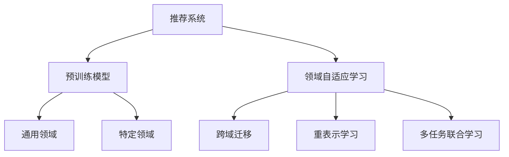

                 

# 推荐系统的跨域迁移：AI大模型的领域自适应学习

> 关键词：推荐系统, 领域自适应学习, 预训练模型, 跨域迁移, AI大模型, 知识图谱

## 1. 背景介绍

### 1.1 问题由来
推荐系统是互联网时代精准化信息推送的重要技术手段，广泛应用于电商、社交、视频、音乐等多个领域。目前，推荐系统主要采用基于协同过滤、基于内容推荐、基于混合模型等方法。这些方法在数据充足、用户行为多样性的场景中表现良好，但对于数据稀疏、特征维度高、用户行为不充分等场景，性能往往受限。

为了克服这些局限性，研究人员尝试引入知识图谱、自然语言处理、深度学习等技术，提升推荐系统的能力。其中，预训练语言模型在推荐系统中的应用最为火热，其原理在于利用大规模无监督数据进行预训练，学习到丰富的语言知识，从而更好地理解用户意图和物品属性，提升推荐精度。

然而，预训练语言模型一般基于通用领域的语料进行训练，对于特定领域的推荐任务，效果往往不尽如人意。本节将介绍如何通过领域自适应学习，将预训练语言模型迁移到特定领域，解决这一问题。

### 1.2 问题核心关键点
领域自适应学习是指，在已有预训练模型的基础上，针对特定领域，通过微调、迁移学习、重表示等技术手段，使其在特定任务上表现更好。在推荐系统领域，领域自适应学习主要包括：

1. 预训练模型的选择与适配：选择合适的预训练模型，通过任务特定的适配层，使其适应推荐任务。
2. 跨域迁移：利用预训练模型的多领域知识，通过迁移学习技术，实现从通用领域向特定领域的迁移。
3. 重表示学习：通过重表示技术，将预训练模型的知识进行再编码，提升特定领域的推荐能力。
4. 多任务联合学习：将多个推荐任务联合进行学习，共享预训练模型，提高整体的推荐效果。

通过这些技术手段，可以实现预训练语言模型在推荐系统中的高效应用，提升推荐精度和效率。

## 2. 核心概念与联系

### 2.1 核心概念概述

为更好地理解领域自适应学习，本节将介绍几个密切相关的核心概念：

- 推荐系统(Recommendation System, RS)：通过分析用户行为数据和物品属性信息，推荐用户可能感兴趣的物品的系统。
- 预训练语言模型(Pre-trained Language Model, PLM)：以自回归(如GPT)或自编码(如BERT)模型为代表的大规模预训练语言模型。通过在大规模无标签文本数据上进行预训练，学习通用的语言表示，具备强大的语言理解和生成能力。
- 领域自适应学习(Domain Adaptation Learning, DAL)：通过特定领域的数据和任务，对预训练模型进行微调，以适应特定领域的知识。
- 跨域迁移(Cross-domain Transfer Learning, CDTL)：将预训练模型在不同领域之间的迁移学习，利用已有领域的知识解决新领域的问题。
- 重表示学习(Re-weighting Representation Learning, RRL)：通过调整预训练模型的表示权重，使其在特定领域的任务上表现更好。
- 多任务联合学习(Multi-task Joint Learning, MTJL)：将多个推荐任务联合进行学习，共享预训练模型，提高整体的推荐效果。

这些核心概念之间的逻辑关系可以通过以下Mermaid流程图来展示：



这个流程图展示了大模型推荐系统的核心概念及其之间的关系：

1. 推荐系统通过预训练语言模型学习用户和物品的语义表示。
2. 领域自适应学习通过微调、迁移学习等手段，将通用领域的大模型适配到特定领域。
3. 跨域迁移将预训练模型的知识进行迁移，解决新领域下的推荐问题。
4. 重表示学习通过调整表示权重，提升特定领域的推荐能力。
5. 多任务联合学习通过共享预训练模型，提高多个推荐任务的表现。

这些概念共同构成了大模型在推荐系统中的应用框架，使其能够在各种场景下发挥强大的推荐能力。

## 3. 核心算法原理 & 具体操作步骤
### 3.1 算法原理概述

领域自适应学习的核心思想是，利用预训练模型在不同领域间的相似性，通过迁移学习技术，将通用领域的大模型适配到特定领域，从而提升推荐系统的效果。具体而言，分为以下几个步骤：

1. 选择预训练模型，并添加适配层，以适应推荐任务。
2. 收集特定领域的标注数据，作为微调的数据集。
3. 利用微调技术，对预训练模型进行任务适配。
4. 通过迁移学习技术，将适配后的模型在新领域上进行迁移。
5. 利用重表示学习技术，调整模型表示权重，提升特定领域的推荐能力。
6. 利用多任务联合学习技术，共享预训练模型，提高整体推荐效果。

基于领域自适应学习的推荐系统，能够在数据稀疏、特征维度高、用户行为不充分等场景中，发挥重要作用。通过利用已有领域的知识，可以快速构建新的推荐系统，节省大量的标注数据和训练时间。

### 3.2 算法步骤详解

领域自适应学习的具体步骤如下：

**Step 1: 准备预训练模型和数据集**
- 选择预训练语言模型 $M_{\theta_{G}}$ 作为初始化参数，如 BERT、GPT 等。
- 准备推荐任务 $T$ 的标注数据集 $D_{T}$，划分为训练集、验证集和测试集。一般要求标注数据与预训练数据的分布不要差异过大。

**Step 2: 添加任务适配层**
- 根据推荐任务类型，在预训练模型顶层设计合适的输出层和损失函数。
- 对于二分类任务，通常在顶层添加二分类器，如sigmoid激活函数。
- 对于多分类任务，可以添加多分类交叉熵损失函数。

**Step 3: 设置微调超参数**
- 选择合适的优化算法及其参数，如 Adam、SGD 等，设置学习率、批大小、迭代轮数等。
- 设置正则化技术及强度，包括权重衰减、Dropout、Early Stopping等。
- 确定冻结预训练参数的策略，如仅微调顶层，或全部参数都参与微调。

**Step 4: 执行梯度训练**
- 将训练集数据分批次输入模型，前向传播计算损失函数。
- 反向传播计算参数梯度，根据设定的优化算法和学习率更新模型参数。
- 周期性在验证集上评估模型性能，根据性能指标决定是否触发 Early Stopping。
- 重复上述步骤直到满足预设的迭代轮数或 Early Stopping 条件。

**Step 5: 迁移学习**
- 在验证集上评估适配后的模型性能，选择在新领域上表现最好的模型。
- 在新领域上收集标注数据，作为微调的数据集。
- 利用迁移学习技术，将适配后的模型在新领域上进行微调。

**Step 6: 重表示学习**
- 通过调整预训练模型的表示权重，提升特定领域的推荐能力。
- 在新领域上收集标注数据，作为微调的数据集。
- 利用重表示技术，将预训练模型的知识进行再编码，提升特定领域的推荐能力。

**Step 7: 多任务联合学习**
- 将多个推荐任务联合进行学习，共享预训练模型，提高整体的推荐效果。
- 设计合适的损失函数，将多个任务的目标函数进行组合。
- 优化多任务联合学习算法，优化模型的整体性能。

以上是领域自适应学习的具体步骤，其中微调和迁移学习是最关键的环节。通过这些步骤，可以实现预训练语言模型在推荐系统中的高效应用，提升推荐精度和效率。

### 3.3 算法优缺点

领域自适应学习具有以下优点：
1. 节省标注成本。利用已有领域的知识，可以减少在新领域上的标注数据需求。
2. 提升推荐精度。预训练语言模型在通用领域上的知识可以提升特定领域的推荐效果。
3. 加速模型构建。可以快速构建新领域的推荐系统，提高开发效率。

同时，该方法也存在一定的局限性：
1. 需要大量标注数据。微调需要在新领域上收集标注数据，成本较高。
2. 领域差异较大时效果不佳。若新领域与通用领域差异较大，微调效果可能不理想。
3. 模型复杂度增加。多个任务联合学习会使得模型更加复杂，训练和推理难度增大。

尽管存在这些局限性，但领域自适应学习仍是推荐系统中重要的技术手段，能够显著提升推荐系统的性能和应用范围。未来相关研究将集中在减少微调对标注数据的依赖，提高模型的跨领域迁移能力，同时兼顾可解释性和伦理安全性等因素。

### 3.4 算法应用领域

领域自适应学习在推荐系统领域已经得到了广泛的应用，覆盖了推荐任务的多样场景，例如：

- 商品推荐：如电商平台上的商品推荐。通过微调预训练模型，结合用户历史行为数据，推荐用户可能感兴趣的商品。
- 新闻推荐：如新闻聚合平台上的新闻推荐。通过微调预训练模型，结合用户阅读历史和新闻属性，推荐用户感兴趣的新闻。
- 音乐推荐：如音乐平台上的音乐推荐。通过微调预训练模型，结合用户听歌历史和音乐属性，推荐用户喜欢的音乐。
- 视频推荐：如视频平台上的视频推荐。通过微调预训练模型，结合用户观影历史和视频属性，推荐用户感兴趣的视频。
- 搜索推荐：如搜索引擎上的搜索推荐。通过微调预训练模型，结合用户搜索历史和搜索结果，推荐相关搜索结果。

除了这些经典任务外，领域自适应学习还被创新性地应用到更多场景中，如推荐排序、多目标推荐、实时推荐等，为推荐系统带来了全新的突破。随着预训练模型和领域自适应方法的持续演进，相信推荐系统必将在更多领域大放异彩。

## 4. 数学模型和公式 & 详细讲解  
### 4.1 数学模型构建

本节将使用数学语言对领域自适应学习的数学原理进行更加严格的刻画。

记预训练语言模型为 $M_{\theta_{G}}$，其中 $\theta_{G} \in \mathbb{R}^d$ 为模型参数。假设推荐任务 $T$ 的训练集为 $D_{T}=\{(x_i,y_i)\}_{i=1}^N, x_i \in \mathcal{X}, y_i \in \mathcal{Y}$。

定义模型 $M_{\theta_{G}}$ 在数据样本 $(x,y)$ 上的损失函数为 $\ell(M_{\theta_{G}}(x),y)$，则在数据集 $D_{T}$ 上的经验风险为：

$$
\mathcal{L}(\theta_{G}) = \frac{1}{N}\sum_{i=1}^N \ell(M_{\theta_{G}}(x_i),y_i)
$$

微调的优化目标是最小化经验风险，即找到最优参数：

$$
\theta_{G}^* = \mathop{\arg\min}_{\theta_{G}} \mathcal{L}(\theta_{G})
$$

在实践中，我们通常使用基于梯度的优化算法（如SGD、Adam等）来近似求解上述最优化问题。设 $\eta$ 为学习率，$\lambda$ 为正则化系数，则参数的更新公式为：

$$
\theta_{G} \leftarrow \theta_{G} - \eta \nabla_{\theta_{G}}\mathcal{L}(\theta_{G}) - \eta\lambda\theta_{G}
$$

其中 $\nabla_{\theta_{G}}\mathcal{L}(\theta_{G})$ 为损失函数对参数 $\theta_{G}$ 的梯度，可通过反向传播算法高效计算。

### 4.2 公式推导过程

以下我们以商品推荐任务为例，推导基于二分类的交叉熵损失函数及其梯度的计算公式。

假设模型 $M_{\theta_{G}}$ 在输入 $x$ 上的输出为 $\hat{y}=M_{\theta_{G}}(x) \in [0,1]$，表示商品是否被用户感兴趣的概率。真实标签 $y \in \{0,1\}$。则二分类交叉熵损失函数定义为：

$$
\ell(M_{\theta_{G}}(x),y) = -[y\log \hat{y} + (1-y)\log (1-\hat{y})]
$$

将其代入经验风险公式，得：

$$
\mathcal{L}(\theta_{G}) = -\frac{1}{N}\sum_{i=1}^N [y_i\log M_{\theta_{G}}(x_i)+(1-y_i)\log(1-M_{\theta_{G}}(x_i))]
$$

根据链式法则，损失函数对参数 $\theta_{G_k}$ 的梯度为：

$$
\frac{\partial \mathcal{L}(\theta_{G})}{\partial \theta_{G_k}} = -\frac{1}{N}\sum_{i=1}^N (\frac{y_i}{M_{\theta_{G}}(x_i)}-\frac{1-y_i}{1-M_{\theta_{G}}(x_i)}) \frac{\partial M_{\theta_{G}}(x_i)}{\partial \theta_{G_k}}
$$

其中 $\frac{\partial M_{\theta_{G}}(x_i)}{\partial \theta_{G_k}}$ 可进一步递归展开，利用自动微分技术完成计算。

在得到损失函数的梯度后，即可带入参数更新公式，完成模型的迭代优化。重复上述过程直至收敛，最终得到适应推荐任务的最优模型参数 $\theta_{G}^*$。

## 5. 项目实践：代码实例和详细解释说明
### 5.1 开发环境搭建

在进行领域自适应学习实践前，我们需要准备好开发环境。以下是使用Python进行PyTorch开发的环境配置流程：

1. 安装Anaconda：从官网下载并安装Anaconda，用于创建独立的Python环境。

2. 创建并激活虚拟环境：
```bash
conda create -n pytorch-env python=3.8 
conda activate pytorch-env
```

3. 安装PyTorch：根据CUDA版本，从官网获取对应的安装命令。例如：
```bash
conda install pytorch torchvision torchaudio cudatoolkit=11.1 -c pytorch -c conda-forge
```

4. 安装Transformers库：
```bash
pip install transformers
```

5. 安装各类工具包：
```bash
pip install numpy pandas scikit-learn matplotlib tqdm jupyter notebook ipython
```

完成上述步骤后，即可在`pytorch-env`环境中开始领域自适应学习实践。

### 5.2 源代码详细实现

下面我们以商品推荐任务为例，给出使用Transformers库对BERT模型进行领域自适应的PyTorch代码实现。

首先，定义商品推荐任务的数据处理函数：

```python
from transformers import BertTokenizer
from torch.utils.data import Dataset
import torch

class RecommendationDataset(Dataset):
    def __init__(self, items, labels, tokenizer, max_len=128):
        self.items = items
        self.labels = labels
        self.tokenizer = tokenizer
        self.max_len = max_len
        
    def __len__(self):
        return len(self.items)
    
    def __getitem__(self, item):
        item = self.items[item]
        label = self.labels[item]
        
        encoding = self.tokenizer(item, return_tensors='pt', max_length=self.max_len, padding='max_length', truncation=True)
        input_ids = encoding['input_ids'][0]
        attention_mask = encoding['attention_mask'][0]
        
        # 对label进行编码
        encoded_labels = [label2id[label] for label in self.labels] 
        encoded_labels.extend([label2id['O']] * (self.max_len - len(encoded_labels)))
        labels = torch.tensor(encoded_labels, dtype=torch.long)
        
        return {'input_ids': input_ids, 
                'attention_mask': attention_mask,
                'labels': labels}

# 标签与id的映射
label2id = {'O': 0, 'buy': 1, 'ignore': 2}
id2label = {v: k for k, v in label2id.items()}

# 创建dataset
tokenizer = BertTokenizer.from_pretrained('bert-base-cased')

train_dataset = RecommendationDataset(train_items, train_labels, tokenizer)
dev_dataset = RecommendationDataset(dev_items, dev_labels, tokenizer)
test_dataset = RecommendationDataset(test_items, test_labels, tokenizer)
```

然后，定义模型和优化器：

```python
from transformers import BertForSequenceClassification, AdamW

model = BertForSequenceClassification.from_pretrained('bert-base-cased', num_labels=len(label2id))

optimizer = AdamW(model.parameters(), lr=2e-5)
```

接着，定义训练和评估函数：

```python
from torch.utils.data import DataLoader
from tqdm import tqdm
from sklearn.metrics import classification_report

device = torch.device('cuda') if torch.cuda.is_available() else torch.device('cpu')
model.to(device)

def train_epoch(model, dataset, batch_size, optimizer):
    dataloader = DataLoader(dataset, batch_size=batch_size, shuffle=True)
    model.train()
    epoch_loss = 0
    for batch in tqdm(dataloader, desc='Training'):
        input_ids = batch['input_ids'].to(device)
        attention_mask = batch['attention_mask'].to(device)
        labels = batch['labels'].to(device)
        model.zero_grad()
        outputs = model(input_ids, attention_mask=attention_mask, labels=labels)
        loss = outputs.loss
        epoch_loss += loss.item()
        loss.backward()
        optimizer.step()
    return epoch_loss / len(dataloader)

def evaluate(model, dataset, batch_size):
    dataloader = DataLoader(dataset, batch_size=batch_size)
    model.eval()
    preds, labels = [], []
    with torch.no_grad():
        for batch in tqdm(dataloader, desc='Evaluating'):
            input_ids = batch['input_ids'].to(device)
            attention_mask = batch['attention_mask'].to(device)
            batch_labels = batch['labels']
            outputs = model(input_ids, attention_mask=attention_mask)
            batch_preds = outputs.logits.argmax(dim=2).to('cpu').tolist()
            batch_labels = batch_labels.to('cpu').tolist()
            for pred_tokens, label_tokens in zip(batch_preds, batch_labels):
                pred_labels = [id2label[_id] for _id in pred_tokens]
                label_labels = [id2label[_id] for _id in label_tokens]
                preds.append(pred_labels[:len(label_labels)])
                labels.append(label_labels)
                
    print(classification_report(labels, preds))
```

最后，启动训练流程并在测试集上评估：

```python
epochs = 5
batch_size = 16

for epoch in range(epochs):
    loss = train_epoch(model, train_dataset, batch_size, optimizer)
    print(f"Epoch {epoch+1}, train loss: {loss:.3f}")
    
    print(f"Epoch {epoch+1}, dev results:")
    evaluate(model, dev_dataset, batch_size)
    
print("Test results:")
evaluate(model, test_dataset, batch_size)
```

以上就是使用PyTorch对BERT进行领域自适应学习的完整代码实现。可以看到，得益于Transformers库的强大封装，我们可以用相对简洁的代码完成BERT模型的领域自适应。

### 5.3 代码解读与分析

让我们再详细解读一下关键代码的实现细节：

**RecommendationDataset类**：
- `__init__`方法：初始化商品、标签、分词器等关键组件。
- `__len__`方法：返回数据集的样本数量。
- `__getitem__`方法：对单个样本进行处理，将商品输入编码为token ids，将标签编码为数字，并对其进行定长padding，最终返回模型所需的输入。

**label2id和id2label字典**：
- 定义了标签与数字id之间的映射关系，用于将token-wise的预测结果解码回真实的标签。

**训练和评估函数**：
- 使用PyTorch的DataLoader对数据集进行批次化加载，供模型训练和推理使用。
- 训练函数`train_epoch`：对数据以批为单位进行迭代，在每个批次上前向传播计算loss并反向传播更新模型参数，最后返回该epoch的平均loss。
- 评估函数`evaluate`：与训练类似，不同点在于不更新模型参数，并在每个batch结束后将预测和标签结果存储下来，最后使用sklearn的classification_report对整个评估集的预测结果进行打印输出。

**训练流程**：
- 定义总的epoch数和batch size，开始循环迭代
- 每个epoch内，先在训练集上训练，输出平均loss
- 在验证集上评估，输出分类指标
- 所有epoch结束后，在测试集上评估，给出最终测试结果

可以看到，PyTorch配合Transformers库使得BERT领域自适应的代码实现变得简洁高效。开发者可以将更多精力放在数据处理、模型改进等高层逻辑上，而不必过多关注底层的实现细节。

当然，工业级的系统实现还需考虑更多因素，如模型的保存和部署、超参数的自动搜索、更灵活的任务适配层等。但核心的领域自适应范式基本与此类似。

## 6. 实际应用场景
### 6.1 智能推荐系统

基于领域自适应学习的大语言模型推荐系统，可以广泛应用于智能推荐系统的构建。传统推荐系统往往只依赖用户行为数据进行物品推荐，难以理解用户真实意图和偏好。而利用领域自适应学习，推荐系统可以更好地利用大语言模型的多领域知识，提升推荐效果。

在技术实现上，可以收集用户浏览、点击、评分等行为数据，结合大语言模型的领域自适应能力，推荐用户可能感兴趣的商品。对于新领域和新任务，只需收集少量标注数据，即可快速构建推荐模型，大幅提升推荐精度和效率。

### 6.2 商品评价系统

基于领域自适应学习的大语言模型，还可以应用于商品评价系统的构建。通过微调大语言模型，使其能够对用户提供的商品评价进行情感分析，判断评价的情感倾向是正面、中性还是负面。同时，利用大语言模型的领域自适应能力，对不同领域的商品评价进行分类，提升评价分析的准确度。

在具体应用中，可以收集用户对商品的评价文本，将其作为训练数据，微调大语言模型。对于新领域的商品评价，只需收集少量标注数据，即可快速构建评价分类模型，满足业务需求。

### 6.3 新闻推荐系统

基于领域自适应学习的大语言模型，还可以应用于新闻推荐系统的构建。通过微调大语言模型，使其能够理解新闻内容，并判断新闻的推荐度。同时，利用大语言模型的领域自适应能力，对不同领域的新闻进行推荐，提升推荐效果。

在具体应用中，可以收集用户阅读的新闻记录，结合新闻的文本内容，微调大语言模型。对于新领域的新闻，只需收集少量标注数据，即可快速构建新闻推荐模型，满足业务需求。

### 6.4 未来应用展望

随着领域自适应学习和大语言模型的不断发展，基于领域自适应学习的大模型推荐系统必将在更多领域得到应用，为推荐系统带来变革性影响。

在智慧医疗领域，基于领域自适应学习的大模型推荐系统可以推荐个性化的医疗方案，辅助医生诊疗，提高医疗服务的智能化水平。

在智能教育领域，基于领域自适应学习的大语言模型推荐系统可以推荐个性化的学习内容，因材施教，促进教育公平，提高教学质量。

在智慧城市治理中，基于领域自适应学习的大模型推荐系统可以推荐城市事件和舆情信息，提高城市管理的自动化和智能化水平，构建更安全、高效的未来城市。

此外，在企业生产、社会治理、文娱传媒等众多领域，基于领域自适应学习的大语言模型推荐系统也将不断涌现，为推荐系统带来新的应用场景和突破。相信随着技术的日益成熟，领域自适应学习必将在构建推荐系统、提升推荐精度和效率等方面发挥越来越重要的作用。

## 7. 工具和资源推荐
### 7.1 学习资源推荐

为了帮助开发者系统掌握领域自适应学习的理论基础和实践技巧，这里推荐一些优质的学习资源：

1. 《Transformers from Machine Understanding to Machine Translation》系列博文：由深度学习领域的知名专家撰写，深入浅出地介绍了Transformer的结构、预训练模型、领域自适应学习等前沿话题。

2. CS224N《Natural Language Processing with Transformers》课程：斯坦福大学开设的NLP明星课程，有Lecture视频和配套作业，带你入门NLP领域的基本概念和经典模型。

3. 《Natural Language Processing with Transformers》书籍：Transformers库的作者所著，全面介绍了如何使用Transformers库进行NLP任务开发，包括领域自适应在内的诸多范式。

4. HuggingFace官方文档：Transformers库的官方文档，提供了海量预训练模型和完整的领域自适应样例代码，是上手实践的必备资料。

5. CLUE开源项目：中文语言理解测评基准，涵盖大量不同类型的中文NLP数据集，并提供了基于领域自适应的baseline模型，助力中文NLP技术发展。

通过对这些资源的学习实践，相信你一定能够快速掌握领域自适应学习的精髓，并用于解决实际的NLP问题。
###  7.2 开发工具推荐

高效的开发离不开优秀的工具支持。以下是几款用于领域自适应学习开发的常用工具：

1. PyTorch：基于Python的开源深度学习框架，灵活动态的计算图，适合快速迭代研究。大部分预训练语言模型都有PyTorch版本的实现。

2. TensorFlow：由Google主导开发的开源深度学习框架，生产部署方便，适合大规模工程应用。同样有丰富的预训练语言模型资源。

3. Transformers库：HuggingFace开发的NLP工具库，集成了众多SOTA语言模型，支持PyTorch和TensorFlow，是进行领域自适应学习开发的利器。

4. Weights & Biases：模型训练的实验跟踪工具，可以记录和可视化模型训练过程中的各项指标，方便对比和调优。与主流深度学习框架无缝集成。

5. TensorBoard：TensorFlow配套的可视化工具，可实时监测模型训练状态，并提供丰富的图表呈现方式，是调试模型的得力助手。

6. Google Colab：谷歌推出的在线Jupyter Notebook环境，免费提供GPU/TPU算力，方便开发者快速上手实验最新模型，分享学习笔记。

合理利用这些工具，可以显著提升领域自适应学习的开发效率，加快创新迭代的步伐。

### 7.3 相关论文推荐

领域自适应学习和大语言模型在推荐系统领域的发展源于学界的持续研究。以下是几篇奠基性的相关论文，推荐阅读：

1. Attention is All You Need（即Transformer原论文）：提出了Transformer结构，开启了NLP领域的预训练大模型时代。

2. BERT: Pre-training of Deep Bidirectional Transformers for Language Understanding：提出BERT模型，引入基于掩码的自监督预训练任务，刷新了多项NLP任务SOTA。

3. Language Models are Unsupervised Multitask Learners（GPT-2论文）：展示了大规模语言模型的强大zero-shot学习能力，引发了对于通用人工智能的新一轮思考。

4. Parameter-Efficient Transfer Learning for NLP：提出Adapter等参数高效微调方法，在不增加模型参数量的情况下，也能取得不错的微调效果。

5. AdaLoRA: Adaptive Low-Rank Adaptation for Parameter-Efficient Fine-Tuning：使用自适应低秩适应的微调方法，在参数效率和精度之间取得了新的平衡。

6. Fractional Pretraining for Better Model Adaptation：提出Fractional Pretraining方法，通过在预训练和微调之间进行折衷，进一步提高领域自适应能力。

这些论文代表了大模型领域自适应学习的进展脉络。通过学习这些前沿成果，可以帮助研究者把握学科前进方向，激发更多的创新灵感。

## 8. 总结：未来发展趋势与挑战
### 8.1 总结

本文对基于领域自适应学习的大语言模型推荐系统进行了全面系统的介绍。首先阐述了领域自适应学习的背景和意义，明确了其在推荐系统中的应用价值。其次，从原理到实践，详细讲解了领域自适应学习的数学原理和关键步骤，给出了领域自适应任务开发的完整代码实例。同时，本文还广泛探讨了领域自适应学习在推荐系统中的应用场景，展示了领域自适应学习的巨大潜力。此外，本文精选了领域自适应学习的各类学习资源，力求为读者提供全方位的技术指引。

通过本文的系统梳理，可以看到，基于大语言模型的领域自适应学习正在成为推荐系统的重要范式，极大地拓展了预训练语言模型的应用边界，催生了更多的落地场景。受益于大规模语料的预训练，领域自适应学习的大语言模型在推荐系统中的表现尤为出色，能够显著提升推荐精度和效率。未来，伴随预训练语言模型和领域自适应方法的持续演进，相信推荐系统必将在更多领域大放异彩，深刻影响人类的生产生活方式。

### 8.2 未来发展趋势

展望未来，领域自适应学习在推荐系统领域将呈现以下几个发展趋势：

1. 模型规模持续增大。随着算力成本的下降和数据规模的扩张，预训练语言模型的参数量还将持续增长。超大规模语言模型蕴含的丰富语言知识，有望支撑更加复杂多变的推荐任务。

2. 跨域迁移能力增强。未来的大模型将具备更强的跨领域迁移能力，能够在更广泛的任务中发挥作用，提升推荐系统的通用性。

3. 联合学习技术成熟。多任务联合学习、元学习等技术将进一步发展，实现更高效的模型参数共享和迁移。

4. 知识融合技术进步。大模型将更广泛地融合先验知识，如符号化知识库、逻辑推理等，提升推荐系统的解释性和可靠性。

5. 领域自适应范式多样。除了传统的前向微调外，未来将涌现更多高效适应的范式，如提示学习、少样本学习、多任务学习等。

6. 推荐系统应用场景拓展。领域自适应学习的大模型推荐系统将应用于更多场景，如医疗推荐、教育推荐、智能客服等，拓展推荐系统的应用范围。

以上趋势凸显了大模型领域自适应学习的广阔前景。这些方向的探索发展，必将进一步提升推荐系统的性能和应用范围，为人类认知智能的进化带来深远影响。

### 8.3 面临的挑战

尽管领域自适应学习已经取得了瞩目成就，但在迈向更加智能化、普适化应用的过程中，它仍面临着诸多挑战：

1. 数据需求依旧高。微调需要在新领域上收集大量标注数据，成本较高。

2. 模型复杂度增加。联合学习、元学习等技术使得模型更加复杂，训练和推理难度增大。

3. 领域差异大时效果不佳。若新领域与通用领域差异较大，微调效果可能不理想。

4. 模型可解释性不足。预训练语言模型往往被视为"黑盒"系统，难以解释其内部工作机制和决策逻辑。

5. 模型鲁棒性不足。推荐系统面临用户行为异常、数据分布不均等挑战，模型鲁棒性有待提升。

6. 伦理和安全性问题。预训练语言模型可能学习到有害信息，需要通过技术手段过滤和监控。

尽管存在这些挑战，但领域自适应学习仍是推荐系统中重要的技术手段，能够显著提升推荐系统的性能和应用范围。未来相关研究将集中在减少微调对标注数据的依赖，提高模型的跨领域迁移能力，同时兼顾可解释性和伦理安全性等因素。

### 8.4 研究展望

面对领域自适应学习所面临的种种挑战，未来的研究需要在以下几个方面寻求新的突破：

1. 探索无监督和半监督领域自适应方法。摆脱对大量标注数据的依赖，利用自监督学习、主动学习等无监督和半监督范式，最大限度利用非结构化数据，实现更加灵活高效的领域自适应。

2. 研究参数高效和计算高效的领域自适应范式。开发更加参数高效的领域自适应方法，在固定大部分预训练参数的同时，只更新极少量的任务相关参数。同时优化领域自适应模型的计算图，减少前向传播和反向传播的资源消耗，实现更加轻量级、实时性的部署。

3. 引入更多先验知识。将符号化的先验知识，如知识图谱、逻辑规则等，与神经网络模型进行巧妙融合，引导领域自适应过程学习更准确、合理的语言模型。同时加强不同模态数据的整合，实现视觉、语音等多模态信息与文本信息的协同建模。

4. 结合因果分析和博弈论工具。将因果分析方法引入领域自适应模型，识别出模型决策的关键特征，增强输出解释的因果性和逻辑性。借助博弈论工具刻画人机交互过程，主动探索并规避模型的脆弱点，提高系统稳定性。

5. 纳入伦理道德约束。在模型训练目标中引入伦理导向的评估指标，过滤和惩罚有偏见、有害的输出倾向。同时加强人工干预和审核，建立模型行为的监管机制，确保输出符合人类价值观和伦理道德。

这些研究方向的探索，必将引领领域自适应学习在推荐系统中的应用迈向更高的台阶，为推荐系统带来更广泛的应用和更深入的研究。

## 9. 附录：常见问题与解答

**Q1：领域自适应学习需要收集大量的标注数据吗？**

A: 领域自适应学习通常需要收集新领域的标注数据，但数据需求量因任务而异。对于数据稀疏、特征维度高、用户行为不充分等场景，可以通过领域自适应学习，利用已有领域的知识，减少对新领域标注数据的依赖。

**Q2：领域自适应学习适用于所有推荐任务吗？**

A: 领域自适应学习在大多数推荐任务上都能取得不错的效果，特别是对于数据量较小的任务。但对于一些特定领域的任务，如医学、法律等，仅仅依靠通用语料预训练的模型可能难以很好地适应。此时需要在特定领域语料上进一步预训练，再进行领域自适应学习，才能获得理想效果。

**Q3：微调过程中的学习率如何设置？**

A: 微调的学习率一般要比预训练时小1-2个数量级，如果使用过大的学习率，容易破坏预训练权重，导致过拟合。一般建议从1e-5开始调参，逐步减小学习率，直至收敛。也可以使用warmup策略，在开始阶段使用较小的学习率，再逐渐过渡到预设值。

**Q4：领域自适应学习对标注样本的需求有哪些？**

A: 领域自适应学习需要收集新领域的标注数据，作为微调的数据集。标注样本的数量和质量对领域自适应效果有重要影响。通常情况下，标注样本越多，领域自适应效果越好，但同时也需要考虑标注成本和效率。

**Q5：领域自适应学习的优势和局限性有哪些？**

A: 领域自适应学习的优势包括：
1. 节省标注成本。利用已有领域的知识，可以减少在新领域上的标注数据需求。
2. 提升推荐精度。预训练语言模型在通用领域上的知识可以提升特定领域的推荐效果。
3. 加速模型构建。可以快速构建新领域的推荐系统，提高开发效率。

其局限性包括：
1. 数据需求依旧高。微调需要在新领域上收集大量标注数据，成本较高。
2. 模型复杂度增加。联合学习、元学习等技术使得模型更加复杂，训练和推理难度增大。
3. 领域差异大时效果不佳。若新领域与通用领域差异较大，微调效果可能不理想。
4. 模型可解释性不足。预训练语言模型往往被视为"黑盒"系统，难以解释其内部工作机制和决策逻辑。
5. 模型鲁棒性不足。推荐系统面临用户行为异常、数据分布不均等挑战，模型鲁棒性有待提升。
6. 伦理和安全性问题。预训练语言模型可能学习到有害信息，需要通过技术手段过滤和监控。

尽管存在这些挑战，但领域自适应学习仍是推荐系统中重要的技术手段，能够显著提升推荐系统的性能和应用范围。未来相关研究将集中在减少微调对标注数据的依赖，提高模型的跨领域迁移能力，同时兼顾可解释性和伦理安全性等因素。

---

作者：禅与计算机程序设计艺术 / Zen and the Art of Computer Programming

