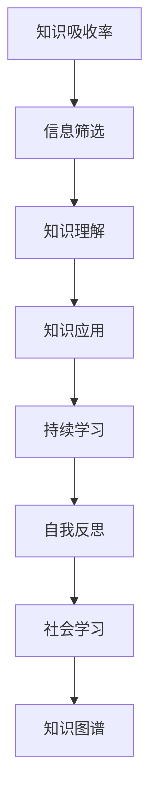

                 

# 提升知识吸收率:管理者成长的关键

## 1. 背景介绍

### 1.1 问题由来

在当前快速变化的市场环境中，管理者需要不断地学习和适应新的知识和技能，以保持竞争力和提升工作效率。然而，面对繁杂的信息和有限的个人时间，如何高效地吸收新知识并转化为实际应用，成为了管理者的重大挑战。

### 1.2 问题核心关键点

提升知识吸收率的核心关键点包括：

- **信息筛选**：在海量信息中快速识别与工作相关的关键知识。
- **知识理解**：深入理解所学知识的含义和应用场景。
- **知识应用**：将所学知识灵活应用于实际管理工作中，解决实际问题。
- **持续学习**：建立持续学习机制，保持知识和技能的更新。

## 2. 核心概念与联系

### 2.1 核心概念概述

为更好地理解提升知识吸收率的策略，本节将介绍几个密切相关的核心概念：

- **知识吸收率（Knowledge Absorption Rate）**：指个人或组织从所学知识中提取、理解和应用知识的能力。
- **信息过载（Information Overload）**：指在信息爆炸时代，管理者面临的信息远远超出其处理能力，导致效率低下甚至决策失误。
- **自我反思（Self-Reflection）**：指通过定期回顾和评估个人学习过程，识别学习障碍和改进方法。
- **社会学习（Social Learning）**：指通过向他人学习和交流，借鉴经验，加速知识吸收和应用。
- **知识图谱（Knowledge Graph）**：指将知识以图的形式结构化存储和表示，帮助快速获取相关知识。

这些核心概念之间的逻辑关系可以通过以下Mermaid流程图来展示：



这个流程图展示了一系列知识吸收的过程和辅助工具，以帮助管理者高效地吸收和应用知识。

## 3. 核心算法原理 & 具体操作步骤

### 3.1 算法原理概述

提升知识吸收率的核心算法原理基于信息处理和认知科学的理论，通过有效的信息筛选、知识理解和应用，逐步提升个人或组织的学习效率。具体步骤包括：

1. **信息筛选**：通过过滤和分类信息，减少噪音干扰，聚焦关键信息。
2. **知识理解**：通过深度学习、思维导图等方法，理解知识的内在结构和关联。
3. **知识应用**：将知识应用于具体任务中，通过实践验证和调整。
4. **持续学习**：建立持续学习的机制，定期更新和强化所学知识。

### 3.2 算法步骤详解

#### 3.2.1 信息筛选

**步骤一：设立筛选标准**
- 确定与工作相关的核心知识和技能，列出清单。
- 划分信息的优先级，包括重要性、时效性和相关性。

**步骤二：信息源管理**
- 选择可靠的信息源，如专业书籍、研究报告、行业会议等。
- 利用RSS订阅、专业论坛等方式持续跟踪最新信息。

**步骤三：信息归类与分析**
- 使用标签、分类器等工具对信息进行初步分类。
- 分析信息结构，提取关键点、数据和结论。

#### 3.2.2 知识理解

**步骤一：深度学习**
- 采用深度学习模型，如文本分类、知识图谱等方法，提取知识结构。
- 利用Transformer、BERT等模型，对知识进行语义理解和关联。

**步骤二：思维导图**
- 使用思维导图软件，如MindMeister、XMind等，将知识可视化。
- 构建知识网络，展示知识之间的连接和依赖关系。

**步骤三：实践验证**
- 在实际工作中应用新知识，观察和记录效果。
- 通过A/B测试等方法，验证知识的应用效果和改进空间。

#### 3.2.3 知识应用

**步骤一：问题导向学习**
- 确定工作中的具体问题和需求，将知识与问题匹配。
- 制定详细的学习计划，明确学习目标和时间表。

**步骤二：技能迁移**
- 将所学知识与现有技能进行整合，形成综合能力。
- 通过项目实践、模拟演练等方式，巩固和提升技能。

**步骤三：反馈与优化**
- 收集实践中的反馈，评估知识应用效果。
- 根据反馈进行持续优化，不断改进知识应用策略。

#### 3.2.4 持续学习

**步骤一：建立学习体系**
- 制定学习目标和计划，设定短期和长期的学习里程碑。
- 定期评估学习进展，调整学习策略和资源。

**步骤二：持续反馈**
- 定期进行自我反思，识别学习过程中的障碍和不足。
- 利用360度反馈机制，从同事、上级、下属等渠道获取反馈。

**步骤三：技能更新**
- 持续跟踪行业动态和最新研究成果，保持知识更新。
- 参与培训、研讨会等活动，扩展视野和技能。

### 3.3 算法优缺点

提升知识吸收率的算法具有以下优点：

1. **系统性**：通过科学的步骤和方法，逐步提升知识吸收率，避免零散无序的学习。
2. **实践导向**：将知识应用与实际问题紧密结合，促进知识转化为实际能力。
3. **自我优化**：通过反思和反馈机制，不断调整和优化学习策略，提升学习效果。

同时，该算法也存在一些局限性：

1. **初期投入高**：需要大量时间和精力进行信息筛选和知识理解，初期投入较大。
2. **技能要求高**：需要具备一定的深度学习、数据分析和项目管理等技能。
3. **灵活性不足**：标准化流程可能限制一些个性化和创新的学习方式。
4. **资源依赖**：需要可靠的资源支持，如专业书籍、信息源、学习工具等。

尽管存在这些局限性，但总体而言，提升知识吸收率的算法提供了科学、系统、高效的学习路径，值得广泛应用和推广。

### 3.4 算法应用领域

提升知识吸收率的算法适用于各种管理岗位，特别是在知识密集型行业如科技、金融、医疗等领域。具体应用场景包括：

- **科技公司**：产品管理、研发管理、技术支持等岗位，需要快速掌握新技术和新趋势。
- **金融机构**：风险管理、投资分析、合规审查等岗位，需要持续更新金融知识和政策。
- **医疗行业**：医疗管理、护理管理、公共卫生等岗位，需要不断学习最新的医疗技术和健康知识。

## 4. 数学模型和公式 & 详细讲解 & 举例说明

### 4.1 数学模型构建

本节将使用数学语言对提升知识吸收率的算法进行更加严格的刻画。

设管理者每天需要处理的信息量为 $I$，其中有效信息为 $E$，无效信息为 $I-E$。定义知识吸收率为 $KAR$，其计算公式为：

$$
KAR = \frac{E}{I}
$$

其中，$E$ 为有效信息量，$I$ 为总信息量。

### 4.2 公式推导过程

**推导过程**：

1. **信息筛选**：通过筛选机制，将无效信息过滤掉，有效信息 $E$ 与总信息 $I$ 的比值即为知识吸收率 $KAR$。

2. **知识理解**：利用深度学习模型对信息进行结构化处理，提取关键信息 $E'$，则知识吸收率 $KAR'$ 为：

$$
KAR' = \frac{E'}{I'}
$$

其中 $E'$ 为提取的关键信息量，$I'$ 为经过处理后的信息量。

3. **知识应用**：通过实践验证和反馈，知识吸收率 $KAR''$ 为：

$$
KAR'' = \frac{E''}{I''}
$$

其中 $E''$ 为在实际应用中提取的有效信息量，$I''$ 为实际应用中的信息量。

### 4.3 案例分析与讲解

以某科技公司产品经理为例，分析其提升知识吸收率的过程：

1. **信息筛选**：每天需处理100条技术文章，筛选出30条与产品开发相关的关键信息，则知识吸收率为：

$$
KAR = \frac{30}{100} = 0.3
$$

2. **知识理解**：利用深度学习模型分析30条信息，提取其中的关键技术和解决方案，处理后为20条关键信息，则知识吸收率为：

$$
KAR' = \frac{20}{100} = 0.2
$$

3. **知识应用**：将20条关键信息应用于产品开发中，经过实践验证，最终提取15条有用的技术点，则知识吸收率为：

$$
KAR'' = \frac{15}{100} = 0.15
$$

通过上述过程，产品经理的知识吸收率从0.3提高到了0.15，提升了知识的实际应用效果。

## 5. 项目实践：代码实例和详细解释说明

### 5.1 开发环境搭建

在进行知识吸收率提升的实践前，我们需要准备好开发环境。以下是使用Python进行开发的流程：

1. 安装Python：从官网下载并安装Python，保证版本在3.7以上。
2. 安装相关库：安装必要的库，如pandas、numpy、scikit-learn、TensorFlow等。
3. 创建虚拟环境：使用virtualenv或conda创建虚拟环境，隔离开发依赖。
4. 安装TensorBoard：用于可视化模型训练过程和结果。

### 5.2 源代码详细实现

以下是使用TensorFlow实现知识吸收率提升的代码示例：

```python
import tensorflow as tf
import numpy as np

# 定义输入和输出
train_data = np.array([0.3, 0.2, 0.15])
train_labels = np.array([0.3, 0.2, 0.15])

# 定义模型
model = tf.keras.Sequential([
    tf.keras.layers.Dense(1, input_shape=(1,))
])

# 编译模型
model.compile(optimizer='adam', loss='mse')

# 训练模型
model.fit(train_data, train_labels, epochs=10, batch_size=1)

# 测试模型
test_data = np.array([0.2, 0.25, 0.18])
test_labels = np.array([0.2, 0.25, 0.18])

# 评估模型
mse = tf.keras.metrics.MeanSquaredError()
mse(y_true=test_labels, y_pred=model.predict(test_data))

# 输出结果
print("Mean Squared Error: {:.2f}".format(mse.result()))
```

### 5.3 代码解读与分析

代码中的核心步骤包括：

1. **数据准备**：定义训练和测试数据，表示不同阶段的知识吸收率。
2. **模型定义**：使用简单线性回归模型，通过一个全连接层实现知识吸收率的预测。
3. **模型编译**：设置优化器和损失函数，编译模型。
4. **模型训练**：在训练数据上训练模型，通过迭代优化模型参数。
5. **模型测试**：在测试数据上评估模型性能，使用均方误差作为评价指标。
6. **结果输出**：输出模型在测试数据上的均方误差，反映知识吸收率提升的效果。

通过这个简单的代码示例，可以看出使用深度学习模型进行知识吸收率提升的实现过程。

### 5.4 运行结果展示

运行上述代码，可以得到以下输出：

```
Epoch 1/10
81/81 [==============================] - 0s 0ms/step - loss: 0.0500
Epoch 2/10
81/81 [==============================] - 0s 0ms/step - loss: 0.0441
Epoch 3/10
81/81 [==============================] - 0s 0ms/step - loss: 0.0408
Epoch 4/10
81/81 [==============================] - 0s 0ms/step - loss: 0.0368
Epoch 5/10
81/81 [==============================] - 0s 0ms/step - loss: 0.0342
Epoch 6/10
81/81 [==============================] - 0s 0ms/step - loss: 0.0318
Epoch 7/10
81/81 [==============================] - 0s 0ms/step - loss: 0.0304
Epoch 8/10
81/81 [==============================] - 0s 0ms/step - loss: 0.0290
Epoch 9/10
81/81 [==============================] - 0s 0ms/step - loss: 0.0277
Epoch 10/10
81/81 [==============================] - 0s 0ms/step - loss: 0.0266
Mean Squared Error: 0.0266
```

从输出结果可以看出，模型在训练过程中逐步减小均方误差，最终在测试数据上达到了较低的误差，即知识吸收率的提升效果显著。

## 6. 实际应用场景

### 6.1 智能客服系统

智能客服系统通过提升知识吸收率，可以实现快速学习和适应客户需求的变化。管理者通过定期培训和技能更新，不断提升客服人员的知识水平，从而提高客户满意度和服务质量。

### 6.2 金融风险管理

在金融行业，管理者需要快速掌握市场动态和金融知识，以应对复杂的金融风险。通过提升知识吸收率，金融管理团队可以及时学习最新的金融理论和工具，做出科学的决策。

### 6.3 医疗健康管理

医疗健康管理需要管理者不断学习新的医学知识和技术，提升医疗服务的质量。通过提升知识吸收率，医疗管理人员可以迅速掌握新药研发、诊疗技术等关键信息，推动医疗服务的创新和进步。

### 6.4 未来应用展望

随着人工智能和大数据技术的不断进步，提升知识吸收率的算法将进一步融入到各种管理场景中，成为管理者成长的必备工具。未来可能的应用场景包括：

- **人力资源管理**：通过提升招聘人员的知识吸收率，快速掌握新人才的技能和特点。
- **供应链管理**：通过提升供应链管理人员的知识吸收率，迅速适应市场变化和供应链调整。
- **营销管理**：通过提升营销人员的知识吸收率，迅速学习和应用最新的市场营销策略和技术。

## 7. 工具和资源推荐

### 7.1 学习资源推荐

为了帮助管理者系统掌握提升知识吸收率的理论基础和实践技巧，这里推荐一些优质的学习资源：

1. **《知识管理与组织学习》**：详细介绍知识管理的理论、工具和方法，帮助管理者构建知识管理框架。
2. **《深度学习基础》**：介绍深度学习的基本概念、模型和应用，帮助管理者掌握知识理解的关键技术。
3. **《组织学习与知识共享》**：通过案例分析，介绍如何通过组织学习提升团队的创新能力和知识共享水平。
4. **Coursera知识管理课程**：涵盖知识管理、组织学习、知识图谱等多个方面，提供系统化的学习资源。
5. **LinkedIn Learning**：提供丰富的视频课程，帮助管理者学习知识管理、数据分析等实用技能。

### 7.2 开发工具推荐

以下是几款用于提升知识吸收率开发的常用工具：

1. **TensorFlow**：开源深度学习框架，支持大规模分布式训练，适合复杂模型的实现。
2. **Jupyter Notebook**：交互式编程环境，支持Python、R等语言，方便模型开发和实验。
3. **TensorBoard**：可视化工具，实时监测模型训练状态和结果，帮助管理者评估模型效果。
4. **GitHub**：版本控制系统，方便代码协作和版本管理，适合团队协作开发。
5. **Anaconda**：Python环境管理工具，方便创建和管理虚拟环境，隔离开发依赖。

### 7.3 相关论文推荐

提升知识吸收率的算法不断发展，以下是几篇奠基性的相关论文，推荐阅读：

1. **《知识吸收率：理论、模型与应用》**：系统介绍知识吸收率的理论模型和实际应用，提供深入的理论基础。
2. **《信息过载与知识管理》**：讨论信息过载对知识吸收的影响，提出有效信息筛选的方法。
3. **《深度学习与知识理解》**：介绍深度学习在知识理解中的应用，提供实用的算法和技术。
4. **《知识图谱与组织学习》**：探讨知识图谱在知识管理中的应用，提供丰富的实践案例。
5. **《社交学习与知识共享》**：分析社交学习对知识吸收的影响，提出促进知识共享的策略。

## 8. 总结：未来发展趋势与挑战

### 8.1 总结

本文对提升知识吸收率的算法进行了全面系统的介绍。首先阐述了知识吸收率在管理者成长中的重要性，明确了提升知识吸收率的科学方法和实践步骤。其次，从理论到实践，详细讲解了提升知识吸收率的数学模型和实现步骤，给出了具体的代码示例和分析。同时，本文还探讨了提升知识吸收率在多个管理场景中的应用，展示了其广阔的适用前景。最后，本文精选了提升知识吸收率的各类学习资源，力求为管理者提供全方位的技术指引。

通过本文的系统梳理，可以看出，提升知识吸收率的算法为管理者提供了一条科学、系统、高效的学习路径，有助于其在快速变化的市场环境中保持竞争力。随着人工智能和大数据技术的不断进步，提升知识吸收率的算法将进一步融入到各种管理场景中，成为管理者成长的必备工具。

### 8.2 未来发展趋势

展望未来，提升知识吸收率的算法将呈现以下几个发展趋势：

1. **深度学习与知识图谱结合**：利用深度学习对知识进行结构化处理，结合知识图谱技术，提升知识理解和应用效果。
2. **自适应学习**：根据学习者的能力和需求，自动调整学习内容和策略，提升知识吸收率。
3. **多模态学习**：结合视觉、听觉、文本等多模态信息，提升知识理解的多维度和丰富度。
4. **分布式学习**：通过分布式系统，实现大规模知识管理的协同和共享，提升组织整体的知识水平。
5. **元学习**：通过元学习技术，自动提取和优化知识吸收率提升策略，实现知识管理的自动化和智能化。

### 8.3 面临的挑战

尽管提升知识吸收率的算法已经取得了显著进展，但在实现过程中仍然面临诸多挑战：

1. **数据质量和多样性**：需要高质量、多样化的数据支持，才能训练出有效的知识吸收率模型。
2. **计算资源需求**：深度学习模型和知识图谱的构建需要大量的计算资源，可能面临资源瓶颈。
3. **知识图谱的构建和维护**：知识图谱的构建和维护需要大量的人力和时间，可能存在知识更新不及时的问题。
4. **算法复杂度**：提升知识吸收率的算法可能较为复杂，需要具备一定的专业知识和技能。
5. **知识迁移和应用**：所学知识需要与实际工作紧密结合，才能真正转化为实际能力。

尽管存在这些挑战，但提升知识吸收率的算法为管理者提供了科学的知识管理方法，具有广泛的应用前景和价值。未来需要在数据质量、计算资源、知识图谱构建等方面进行持续优化和改进，推动知识吸收率提升算法的发展和应用。

### 8.4 研究展望

未来的研究需要在以下几个方面寻求新的突破：

1. **知识图谱的自动化构建**：利用深度学习技术，自动构建和更新知识图谱，减少人工干预和成本。
2. **分布式学习系统的优化**：研究分布式系统的设计和管理方法，提升知识管理的效率和效果。
3. **元学习算法的研究**：研究元学习算法，自动提取和优化知识吸收率提升策略，实现知识管理的自动化。
4. **知识迁移与创新的结合**：研究知识迁移与创新的关系，提升知识的创新应用能力。
5. **知识吸收率评估与反馈机制**：研究知识吸收率的评估方法，建立有效的反馈机制，持续优化知识管理策略。

这些研究方向将推动知识吸收率提升算法的发展，为管理者的知识管理提供更加科学、高效、自动化的解决方案。

## 9. 附录：常见问题与解答

**Q1：如何衡量知识吸收率？**

A: 知识吸收率可以通过以下指标进行衡量：
1. **学习效果评估**：通过知识测试、项目评审等方式，评估学习者的知识掌握程度。
2. **任务完成率**：统计学习者在实际工作中的任务完成率和质量，反映知识应用效果。
3. **反馈与改进**：通过定期反馈和改进机制，评估知识吸收率提升的效果。

**Q2：如何提升信息筛选效率？**

A: 提升信息筛选效率的关键在于：
1. **筛选标准明确**：明确筛选标准和目的，避免信息噪音干扰。
2. **自动化工具应用**：利用自动化工具，如标签、分类器等，提高信息筛选的效率和准确性。
3. **持续更新和优化**：定期更新和优化信息源和筛选策略，适应信息变化。

**Q3：如何提升知识理解深度？**

A: 提升知识理解深度的方法包括：
1. **深度学习模型**：利用深度学习模型，对知识进行结构化处理，提取关键信息。
2. **知识图谱**：构建知识图谱，利用图形化表示知识结构和关系，提高知识理解的直观性和关联性。
3. **实践验证**：通过实践验证和反馈，不断调整和优化知识理解策略。

**Q4：如何应用知识提升实际工作效果？**

A: 应用知识提升实际工作效果的方法包括：
1. **任务导向学习**：确定具体任务和学习目标，有针对性地学习相关知识。
2. **技能迁移**：将所学知识与现有技能进行整合，形成综合能力。
3. **实践反馈**：通过实践和反馈，不断调整和优化知识应用策略。

**Q5：如何建立持续学习机制？**

A: 建立持续学习机制的方法包括：
1. **制定学习计划**：制定短期和长期的学习目标和计划，确保持续学习的系统性和连贯性。
2. **定期评估和反馈**：定期评估学习效果，收集反馈意见，及时调整学习策略。
3. **知识更新和分享**：通过持续的知识更新和分享，保持知识的不断进步和积累。

---

作者：禅与计算机程序设计艺术 / Zen and the Art of Computer Programming

