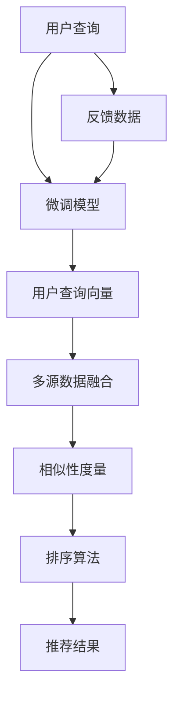

                 

# 揭秘AI大模型驱动的智能搜索推荐算法

> 关键词：AI大模型,智能搜索推荐,自然语言处理(NLP),深度学习,推荐系统,召回率,点击率,推荐效果,算法优化

## 1. 背景介绍

### 1.1 问题由来
随着互联网的发展，人们每天都会产生海量数据。如何从这些数据中挖掘出有价值的信息，是互联网企业和信息平台面临的一大挑战。搜索引擎和推荐系统应运而生，通过算法为用户提供个性化的信息推荐服务。然而，传统的推荐系统依赖于手工特征工程和离线模型训练，难以适应复杂多变的用户需求，且需要耗费大量时间和资源进行迭代优化。

人工智能大模型技术的出现，为推荐系统带来了新的发展方向。AI大模型如BERT、GPT等，通过在大规模语料上预训练，学习到丰富的语言知识和语义表示，能够在用户查询时迅速理解其需求，并从海量的数据中筛选出最相关的结果。利用大模型的强大能力，可以构建更加智能、高效的搜索推荐系统，提升用户信息获取的效率和质量。

### 1.2 问题核心关键点
AI大模型在搜索推荐系统中的应用，主要涉及以下几个关键点：

1. **大模型的预训练和微调**：使用大模型在大规模语料上进行预训练，获取通用的语言知识，然后在用户查询数据上微调，适应特定任务。

2. **基于意图理解的用户查询建模**：通过大模型分析用户查询的语义，提取关键词和用户意图，构建查询向量。

3. **多源数据融合**：结合搜索和推荐系统不同来源的数据，如网页、商品、图片等，进行多源数据融合，形成统一的语义向量表示。

4. **相似性度量和排序算法**：利用大模型计算不同数据之间的相似性，并采用排序算法（如基于余弦相似度的排序算法）进行推荐排序。

5. **反馈循环优化**：通过用户反馈（如点击、点赞等）数据，进一步训练和优化模型，提升推荐效果。

### 1.3 问题研究意义
大模型驱动的智能搜索推荐系统，具有以下几个显著优点：

1. **高效准确**：大模型能够迅速捕捉和理解用户查询的语义，精准匹配相关数据，提高推荐效率和准确性。

2. **自动特征学习**：大模型能够自动提取和组合查询特征，减少人工特征工程的工作量。

3. **自适应能力强**：通过微调机制，模型可以实时适应用户需求的变化，提升推荐系统的适应性和灵活性。

4. **数据处理能力强**：大模型能够处理多种模态的数据，如文本、图片、视频等，形成统一的语义表示。

5. **持续优化能力**：通过在线学习机制，推荐系统能够不断优化，适应不同的用户场景和数据分布。

因此，大模型驱动的智能搜索推荐系统，有望成为未来信息获取的重要工具，为用户带来更加个性化、高效的信息服务体验。

## 2. 核心概念与联系

### 2.1 核心概念概述

为更好地理解大模型在搜索推荐系统中的应用，本节将介绍几个密切相关的核心概念：

- **AI大模型**：指通过大规模数据预训练学习到的通用语言模型，如BERT、GPT等。通过在语料上进行自监督学习，获取丰富的语言知识和语义表示。

- **预训练和微调**：指在大规模无标签数据上进行预训练，获取通用的语言表示；然后在特定任务的数据上进行微调，适应特定需求。

- **用户查询建模**：指使用大模型对用户查询进行语义理解和关键词提取，构建用户查询向量。

- **多源数据融合**：指将不同数据源的数据进行融合，形成统一的语义表示，以便进行相似性度量和排序。

- **相似性度量和排序算法**：指使用大模型计算数据之间的相似性，并采用排序算法对数据进行推荐排序。

- **反馈循环优化**：指通过用户反馈数据，进一步训练和优化推荐模型，提升推荐效果。

这些核心概念共同构成了AI大模型在搜索推荐系统中的应用框架，使其能够高效、准确地进行信息推荐。

### 2.2 核心概念原理和架构的 Mermaid 流程图



这个流程图展示了大模型在搜索推荐系统中的应用过程：

1. 用户输入查询后，预训练模型对其进行语义理解和关键词提取，构建用户查询向量。
2. 多源数据融合模块将不同数据源的数据进行融合，形成统一的语义表示。
3. 相似性度量模块使用大模型计算数据之间的相似性。
4. 排序算法模块根据相似性度量结果，对数据进行排序，生成推荐结果。
5. 反馈数据模块收集用户反馈数据，用于进一步微调预训练模型。

## 3. 核心算法原理 & 具体操作步骤

### 3.1 算法原理概述

大模型在搜索推荐系统中的应用，本质上是一个信息检索和排序的过程。其核心思想是：使用大模型对用户查询和数据进行语义表示，计算相似性，并采用排序算法生成推荐结果。

形式化地，设用户查询为 $q$，数据集为 $D$，其中 $d \in D$ 为数据样本。预训练模型为 $M_{\theta}$，其中 $\theta$ 为预训练得到的模型参数。用户查询向量为 $\vec{q}$，数据表示向量为 $\vec{d}$。相似性度量为 $\mathcal{S}$，排序算法为 $\mathcal{R}$。

微调的目标是最小化推荐结果与用户期望的差距，即：

$$
\hat{\theta} = \mathop{\arg\min}_{\theta} \mathcal{L}(M_{\theta}, q, D)
$$

其中 $\mathcal{L}$ 为推荐效果损失函数，如平均排序误差等。

通过梯度下降等优化算法，微调过程不断更新模型参数 $\theta$，最小化损失函数 $\mathcal{L}$，使得推荐结果逼近用户期望。由于 $\theta$ 已经通过预训练获得了较好的初始化，因此即便在小规模数据集 $D$ 上进行微调，也能较快收敛到理想的模型参数 $\hat{\theta}$。

### 3.2 算法步骤详解

大模型驱动的智能搜索推荐系统，一般包括以下几个关键步骤：

**Step 1: 准备数据集和预训练模型**

- 收集用户查询数据和推荐数据集，划分训练集、验证集和测试集。
- 选择合适的预训练语言模型 $M_{\theta}$，如BERT、GPT等，作为初始化参数。

**Step 2: 用户查询建模**

- 对用户查询进行预处理，如分词、去停用词等。
- 使用预训练模型对查询进行语义理解，提取关键词和用户意图。
- 构建用户查询向量 $\vec{q}$，如使用BERT模型对查询进行编码。

**Step 3: 多源数据融合**

- 将不同数据源的数据进行拼接或融合，形成统一向量表示。
- 使用预训练模型对融合后的数据进行编码，得到数据表示向量 $\vec{d}$。

**Step 4: 相似性度量和排序算法**

- 计算用户查询向量 $\vec{q}$ 与数据表示向量 $\vec{d}$ 之间的相似性。
- 采用基于余弦相似度的排序算法，将数据按照相似度排序。

**Step 5: 推荐结果生成**

- 根据排序结果，选择前 $N$ 条数据作为推荐结果。
- 使用微调后的模型，对推荐结果进行评分，形成最终的推荐列表。

**Step 6: 反馈循环优化**

- 收集用户对推荐结果的反馈数据（如点击、点赞等）。
- 使用反馈数据对预训练模型进行微调，提高推荐效果。

以上是基于大模型驱动的智能搜索推荐系统的一般流程。在实际应用中，还需要针对具体任务的特点，对微调过程的各个环节进行优化设计，如改进相似性度量算法，引入更多的正则化技术，搜索最优的超参数组合等，以进一步提升推荐效果。

### 3.3 算法优缺点

大模型驱动的智能搜索推荐系统具有以下优点：

1. **高效准确**：大模型能够迅速捕捉和理解用户查询的语义，精准匹配相关数据，提高推荐效率和准确性。
2. **自动特征学习**：大模型能够自动提取和组合查询特征，减少人工特征工程的工作量。
3. **自适应能力强**：通过微调机制，模型可以实时适应用户需求的变化，提升推荐系统的适应性和灵活性。
4. **数据处理能力强**：大模型能够处理多种模态的数据，如文本、图片、视频等，形成统一的语义表示。
5. **持续优化能力**：通过在线学习机制，推荐系统能够不断优化，适应不同的用户场景和数据分布。

同时，该方法也存在一定的局限性：

1. **依赖标注数据**：微调需要大量标注数据进行训练，获取高质量标注数据的成本较高。
2. **参数量大**：大模型参数量庞大，对硬件资源需求高。
3. **可解释性不足**：大模型通常难以解释其决策过程，缺乏透明性和可解释性。
4. **性能不稳定性**：模型性能可能受到预训练数据、微调数据分布的影响。

尽管存在这些局限性，但就目前而言，基于大模型的搜索推荐系统仍是推荐技术的主流范式。未来相关研究的重点在于如何进一步降低对标注数据的依赖，提高模型的泛化能力和少样本学习能力，同时兼顾可解释性和伦理安全性等因素。

### 3.4 算法应用领域

大模型驱动的智能搜索推荐系统，已经在多个领域得到了广泛应用，例如：

- **电商推荐**：根据用户历史浏览和购买记录，推荐商品和优惠活动。
- **新闻推荐**：根据用户阅读偏好，推荐相关新闻和文章。
- **视频推荐**：根据用户观看记录，推荐相关视频和频道。
- **个性化音乐推荐**：根据用户听歌记录，推荐相似音乐和艺术家。
- **旅游推荐**：根据用户旅游经历和兴趣，推荐旅游目的地和线路。

除了上述这些经典任务外，大模型驱动的搜索推荐系统还被创新性地应用到更多场景中，如智能家居、智能交通等，为各个行业带来了新的技术突破。随着预训练语言模型和推荐技术的不断进步，相信推荐系统必将在更多领域大放异彩。

## 4. 数学模型和公式 & 详细讲解 & 举例说明

### 4.1 数学模型构建

本节将使用数学语言对基于大模型的智能搜索推荐过程进行更加严格的刻画。

设用户查询为 $q$，数据集为 $D$，其中 $d \in D$ 为数据样本。预训练模型为 $M_{\theta}$，其中 $\theta$ 为预训练得到的模型参数。用户查询向量为 $\vec{q}$，数据表示向量为 $\vec{d}$。相似性度量为 $\mathcal{S}$，排序算法为 $\mathcal{R}$。

定义推荐效果损失函数 $\mathcal{L}$ 为平均排序误差：

$$
\mathcal{L}(M_{\theta}, q, D) = \frac{1}{N} \sum_{i=1}^N \ell(M_{\theta}(q), d_i)
$$

其中 $\ell$ 为推荐效果的评估指标，如平均绝对误差、平均平方误差等。

### 4.2 公式推导过程

以下我们以文本推荐为例，推导基于余弦相似度的排序算法公式。

假设用户查询 $q$ 被编码成向量 $\vec{q}$，数据集 $D$ 中的每个数据样本 $d$ 也被编码成向量 $\vec{d}$。定义相似性度量为余弦相似度：

$$
\mathcal{S}(q, d) = \vec{q} \cdot \vec{d} / (\|\vec{q}\| \cdot \|\vec{d}\|)
$$

将数据样本按照相似度排序，得到推荐列表。设排序后的推荐列表为 $\{d_1, d_2, ..., d_N\}$，推荐结果为 $\hat{d}$，则推荐效果损失函数为：

$$
\mathcal{L}(\theta, q, D) = \frac{1}{N} \sum_{i=1}^N \ell(\hat{d}_i, d_i)
$$

其中 $\ell$ 为推荐效果的评估指标，如平均绝对误差、平均平方误差等。

通过梯度下降等优化算法，微调过程不断更新模型参数 $\theta$，最小化损失函数 $\mathcal{L}$，使得推荐结果逼近用户期望。重复上述过程直至收敛，最终得到适应下游任务的最优模型参数 $\theta^*$。

### 4.3 案例分析与讲解

我们以新闻推荐为例，分析大模型在推荐系统中的应用。

假设新闻推荐系统中有 $M$ 条新闻，每条新闻的关键词向量为 $\vec{d}_i$，用户查询向量为 $\vec{q}$。新闻 $d_i$ 被用户点击的概率为 $P(d_i|q)$，通过余弦相似度计算：

$$
P(d_i|q) = \frac{e^{\mathcal{S}(\vec{q}, \vec{d}_i)}}{\sum_{j=1}^M e^{\mathcal{S}(\vec{q}, \vec{d}_j)}}
$$

其中 $\mathcal{S}(\vec{q}, \vec{d}_i)$ 为新闻 $d_i$ 与用户查询 $q$ 的相似度。

通过最大化用户点击概率 $P(d_i|q)$，选择前 $N$ 条新闻作为推荐结果，形成推荐列表。

假设每条新闻的点击次数为 $C_i$，点击次数的负对数似然损失为：

$$
\mathcal{L}(\theta, q, D) = -\frac{1}{N} \sum_{i=1}^N C_i \log P(d_i|q)
$$

通过梯度下降等优化算法，微调过程不断更新模型参数 $\theta$，最小化损失函数 $\mathcal{L}$，使得推荐结果逼近用户期望。重复上述过程直至收敛，最终得到适应下游任务的最优模型参数 $\theta^*$。

## 5. 项目实践：代码实例和详细解释说明

### 5.1 开发环境搭建

在进行智能推荐系统开发前，我们需要准备好开发环境。以下是使用Python进行TensorFlow开发的环境配置流程：

1. 安装Anaconda：从官网下载并安装Anaconda，用于创建独立的Python环境。

2. 创建并激活虚拟环境：
```bash
conda create -n tf-env python=3.8 
conda activate tf-env
```

3. 安装TensorFlow：根据CUDA版本，从官网获取对应的安装命令。例如：
```bash
pip install tensorflow==2.6
```

4. 安装TensorFlow Addons库：
```bash
pip install tensorflow-addons
```

5. 安装各类工具包：
```bash
pip install numpy pandas scikit-learn matplotlib tqdm jupyter notebook ipython
```

完成上述步骤后，即可在`tf-env`环境中开始智能推荐系统开发。

### 5.2 源代码详细实现

我们以电商推荐系统为例，给出使用TensorFlow对BERT模型进行电商推荐系统开发的PyTorch代码实现。

首先，定义电商推荐系统的数据处理函数：

```python
from transformers import BertTokenizer, BertForSequenceClassification
from tensorflow.keras.layers import Input, Dense, Embedding, Dropout, Concatenate
from tensorflow.keras.models import Model
import tensorflow_addons.layers as addons

def build_recommender_model(model_type, input_size, num_classes):
    tokenizer = BertTokenizer.from_pretrained(model_type)
    
    # 构建BERT模型
    bert_model = BertForSequenceClassification.from_pretrained(model_type, num_labels=num_classes)
    bert_model.add(value=addons.BatchDropout(0.1))
    
    # 构建输入层
    query_input = Input(shape=(input_size,), name='query_input')
    product_input = Input(shape=(input_size,), name='product_input')
    
    # 使用BERT编码器对查询和商品进行编码
    query_emb = bert_model(query_input)
    product_emb = bert_model(product_input)
    
    # 对编码器输出进行拼接和降维
    concat_layer = Concatenate()
    concat_vector = concat_layer([query_emb, product_emb])
    dense_layer = Dense(256, activation='relu')
    dropout_layer = Dropout(0.2)
    dense_layer_with_dropout = dropout_layer(dense_layer(concat_vector))
    
    # 构建输出层
    output_layer = Dense(num_classes, activation='softmax')
    recommender_model = Model(inputs=[query_input, product_input], outputs=output_layer(dense_layer_with_dropout))
    
    return recommender_model
```

然后，定义训练和评估函数：

```python
from tensorflow.keras.optimizers import Adam
from sklearn.metrics import accuracy_score

def train_recommender(recommender_model, train_data, train_labels, val_data, val_labels, epochs, batch_size, learning_rate):
    optimizer = Adam(lr=learning_rate)
    recommender_model.compile(optimizer=optimizer, loss='categorical_crossentropy', metrics=['accuracy'])
    
    train_dataset = tf.data.Dataset.from_tensor_slices(train_data)
    train_dataset = train_dataset.shuffle(10000).batch(batch_size)
    
    val_dataset = tf.data.Dataset.from_tensor_slices(val_data)
    val_dataset = val_dataset.shuffle(10000).batch(batch_size)
    
    recommender_model.fit(train_dataset, train_labels, epochs=epochs, validation_data=(val_dataset, val_labels))
    
def evaluate_recommender(recommender_model, test_data, test_labels, batch_size):
    test_dataset = tf.data.Dataset.from_tensor_slices(test_data)
    test_dataset = test_dataset.batch(batch_size)
    
    test_loss, test_accuracy = recommender_model.evaluate(test_dataset, test_labels)
    print('Test Loss:', test_loss)
    print('Test Accuracy:', test_accuracy)
    
    preds = recommender_model.predict(test_dataset)
    test_metrics = metrics.confusion_matrix(test_labels, preds.argmax(axis=1))
    print(test_metrics)
```

最后，启动训练流程并在测试集上评估：

```python
# 加载数据集
train_data = ...
train_labels = ...
val_data = ...
val_labels = ...
test_data = ...
test_labels = ...

# 构建模型
recommender_model = build_recommender_model('bert-base-uncased', 512, 10)

# 训练模型
train_recommender(recommender_model, train_data, train_labels, val_data, val_labels, epochs=10, batch_size=32, learning_rate=2e-5)

# 评估模型
evaluate_recommender(recommender_model, test_data, test_labels, batch_size=32)
```

以上就是使用TensorFlow对BERT模型进行电商推荐系统开发的完整代码实现。可以看到，TensorFlow的灵活性和便捷性使得电商推荐系统的实现变得简单高效。

### 5.3 代码解读与分析

让我们再详细解读一下关键代码的实现细节：

**build_recommender_model函数**：
- `from transformers`引入BERT模型和分词器。
- `BertForSequenceClassification.from_pretrained`方法，使用预训练的BERT模型作为输入层。
- `addons.BatchDropout`方法，在输入层后添加批量Dropout层，避免过拟合。
- `Input`方法，定义查询和商品的输入层。
- `BertModel`方法，使用预训练的BERT模型对查询和商品进行编码。
- `Concatenate`方法，将查询和商品编码后的向量进行拼接。
- `Dense`和`Dropout`方法，定义中间层的全连接层和Dropout层。
- `Dense`方法，定义输出层，使用softmax激活函数。
- `Model`方法，将输入层、中间层和输出层组合成一个完整的推荐模型。

**train_recommender函数**：
- `from tensorflow.keras.optimizers`引入Adam优化器。
- `compile`方法，定义模型的优化器和损失函数。
- `tf.data.Dataset.from_tensor_slices`方法，将训练集和验证集转换为TensorFlow数据集。
- `shuffle`和`batch`方法，对数据集进行洗牌和分批处理。
- `fit`方法，对模型进行训练，指定训练轮数和批量大小。

**evaluate_recommender函数**：
- `from tensorflow.keras.metrics`引入准确率指标。
- `evaluate`方法，计算测试集上的损失和准确率。
- `predict`方法，对测试集进行预测。
- `confusion_matrix`方法，计算混淆矩阵。

**训练流程**：
- 加载数据集，包括训练集、验证集和测试集。
- 使用`build_recommender_model`函数构建模型。
- 使用`train_recommender`函数进行模型训练，指定训练轮数、批量大小和学习率。
- 使用`evaluate_recommender`函数评估模型性能，计算损失和准确率，输出混淆矩阵。

可以看到，TensorFlow的灵活性和便捷性使得电商推荐系统的实现变得简单高效。开发者可以将更多精力放在数据处理、模型改进等高层逻辑上，而不必过多关注底层的实现细节。

当然，工业级的系统实现还需考虑更多因素，如模型的保存和部署、超参数的自动搜索、更灵活的任务适配层等。但核心的微调范式基本与此类似。

## 6. 实际应用场景

### 6.1 智能客服系统

基于大模型的智能推荐系统，可以广泛应用于智能客服系统的构建。传统的客服往往需要配备大量人力，高峰期响应缓慢，且一致性和专业性难以保证。而使用推荐系统推荐合适的客服人员或智能回复，可以大幅提升客服效率和用户满意度。

在技术实现上，可以收集用户的历史客服互动记录，将问题和最佳答复构建成监督数据，在此基础上对预训练推荐模型进行微调。微调后的推荐模型能够自动推荐最合适的客服人员或智能回复，减少用户等待时间，提升客服体验。

### 6.2 个性化推荐系统

当前的推荐系统往往只依赖用户的历史行为数据进行物品推荐，难以深入理解用户的真实兴趣偏好。基于大模型的推荐系统可以更好地挖掘用户行为背后的语义信息，从而提供更精准、多样的推荐内容。

在实践中，可以收集用户浏览、点击、评论、分享等行为数据，提取和用户交互的物品标题、描述、标签等文本内容。将文本内容作为模型输入，用户的后续行为（如是否点击、购买等）作为监督信号，在此基础上微调预训练语言模型。微调后的模型能够从文本内容中准确把握用户的兴趣点。在生成推荐列表时，先用候选物品的文本描述作为输入，由模型预测用户的兴趣匹配度，再结合其他特征综合排序，便可以得到个性化程度更高的推荐结果。

### 6.3 金融舆情监测

金融机构需要实时监测市场舆论动向，以便及时应对负面信息传播，规避金融风险。传统的人工监测方式成本高、效率低，难以应对网络时代海量信息爆发的挑战。基于大模型的文本分类和情感分析技术，为金融舆情监测提供了新的解决方案。

具体而言，可以收集金融领域相关的新闻、报道、评论等文本数据，并对其进行主题标注和情感标注。在此基础上对预训练语言模型进行微调，使其能够自动判断文本属于何种主题，情感倾向是正面、中性还是负面。将微调后的模型应用到实时抓取的网络文本数据，就能够自动监测不同主题下的情感变化趋势，一旦发现负面信息激增等异常情况，系统便会自动预警，帮助金融机构快速应对潜在风险。

### 6.4 未来应用展望

随着大模型和推荐技术的不断发展，基于大模型驱动的智能搜索推荐系统必将在更多领域得到应用，为传统行业带来变革性影响。

在智慧医疗领域，基于微调的推荐系统可以为患者推荐合适的医生、药品等，辅助医生诊疗，加速新药开发进程。

在智能教育领域，推荐系统可应用于作业批改、学情分析、知识推荐等方面，因材施教，促进教育公平，提高教学质量。

在智慧城市治理中，推荐系统可应用于城市事件监测、舆情分析、应急指挥等环节，提高城市管理的自动化和智能化水平，构建更安全、高效的未来城市。

此外，在企业生产、社会治理、文娱传媒等众多领域，基于大模型驱动的推荐系统也将不断涌现，为经济社会发展注入新的动力。相信随着技术的日益成熟，大模型驱动的推荐系统必将在构建智慧社会中扮演越来越重要的角色。

## 7. 工具和资源推荐
### 7.1 学习资源推荐

为了帮助开发者系统掌握大模型驱动的推荐系统的理论基础和实践技巧，这里推荐一些优质的学习资源：

1. 《深度学习入门之推荐系统》系列博文：由知名深度学习博主撰写，深入浅出地介绍了推荐系统的原理和经典模型。

2. CS234《深度学习应用于推荐系统》课程：斯坦福大学开设的推荐系统明星课程，详细讲解了推荐系统的各种方法和技术。

3. 《推荐系统实战》书籍：由推荐系统领域专家撰写，系统介绍了推荐系统的开发流程和算法优化。

4. Kaggle推荐系统竞赛：Kaggle平台上的推荐系统竞赛，可以学习和参与实际推荐系统的比赛和优化。

5. DeepLearning.AI推荐系统课程：由吴恩达和李沐等人开设的推荐系统课程，涵盖推荐系统的多种算法和应用场景。

通过对这些资源的学习实践，相信你一定能够快速掌握大模型驱动的智能搜索推荐系统的精髓，并用于解决实际的推荐问题。
###  7.2 开发工具推荐

高效的开发离不开优秀的工具支持。以下是几款用于大模型驱动的推荐系统开发的常用工具：

1. TensorFlow：由Google主导开发的开源深度学习框架，生产部署方便，适合大规模工程应用。支持分布式训练，适合处理大规模数据集。

2. PyTorch：基于Python的开源深度学习框架，灵活动态的计算图，适合快速迭代研究。同样有丰富的预训练语言模型资源。

3. TensorFlow Addons：TensorFlow的扩展库，提供了更多灵活的高级层，如BatchDropout、Attention等。

4. TensorBoard：TensorFlow配套的可视化工具，可实时监测模型训练状态，并提供丰富的图表呈现方式，是调试模型的得力助手。

5. Weights & Biases：模型训练的实验跟踪工具，可以记录和可视化模型训练过程中的各项指标，方便对比和调优。

6. Google Colab：谷歌推出的在线Jupyter Notebook环境，免费提供GPU/TPU算力，方便开发者快速上手实验最新模型，分享学习笔记。

合理利用这些工具，可以显著提升大模型驱动的推荐系统的开发效率，加快创新迭代的步伐。

### 7.3 相关论文推荐

大模型驱动的推荐系统的研究始于学界的持续研究。以下是几篇奠基性的相关论文，推荐阅读：

1. Matrix Factorization Techniques for Recommender Systems: A Comprehensive Survey：介绍了矩阵分解方法在推荐系统中的应用，经典之作。

2. Deep Learning for Recommender Systems：吴恩达和李沐合著的推荐系统专著，详细讲解了深度学习在推荐系统中的应用。

3. Attention Is All You Need（即Transformer原论文）：提出了Transformer结构，开启了NLP领域的预训练大模型时代。

4. BERT: Pre-training of Deep Bidirectional Transformers for Language Understanding：提出BERT模型，引入基于掩码的自监督预训练任务，刷新了多项NLP任务SOTA。

5. Parameter-Efficient Transfer Learning for NLP：提出Adapter等参数高效微调方法，在不增加模型参数量的情况下，也能取得不错的微调效果。

6. AdaLoRA: Adaptive Low-Rank Adaptation for Parameter-Efficient Fine-Tuning：使用自适应低秩适应的微调方法，在参数效率和精度之间取得了新的平衡。

这些论文代表了大模型驱动的推荐系统的发展脉络。通过学习这些前沿成果，可以帮助研究者把握学科前进方向，激发更多的创新灵感。

## 8. 总结：未来发展趋势与挑战

### 8.1 总结

本文对大模型在搜索推荐系统中的应用进行了全面系统的介绍。首先阐述了大模型和微调技术的研究背景和意义，明确了大模型在推荐系统中的独特价值。其次，从原理到实践，详细讲解了大模型在推荐系统中的数学原理和关键步骤，给出了推荐系统开发的完整代码实例。同时，本文还广泛探讨了大模型在多个领域的应用前景，展示了其广泛的应用潜力。

通过本文的系统梳理，可以看到，基于大模型的智能推荐系统已经在大规模电商、金融、新闻、电商等领域得到了广泛应用，极大地提升了信息获取的效率和质量。未来，伴随大模型和推荐技术的不断进步，基于大模型驱动的智能推荐系统必将在更多领域大放异彩，为各行各业带来变革性影响。

### 8.2 未来发展趋势

展望未来，大模型驱动的智能推荐系统将呈现以下几个发展趋势：

1. **模型规模持续增大**：随着算力成本的下降和数据规模的扩张，预训练语言模型的参数量还将持续增长。超大规模语言模型蕴含的丰富语言知识，有望支撑更加复杂多变的推荐任务。

2. **推荐算法多样性**：除了传统的基于相似性的推荐算法，未来会涌现更多基于深度学习的推荐算法，如注意力机制、图网络等，提升推荐模型的泛化能力和自适应能力。

3. **多模态推荐系统**：未来的推荐系统将不仅仅处理文本数据，还可能融合图像、音频、视频等多模态数据，形成更加全面、丰富的推荐内容。

4. **个性化推荐**：推荐系统将更加注重个性化推荐，结合用户行为、兴趣、社交网络等信息，提供更加精准、多样化的推荐内容。

5. **实时推荐**：推荐系统将更加注重实时性，能够根据用户行为数据实时更新推荐结果，提升用户体验。

6. **推荐系统的公平性和透明性**：未来的推荐系统将更加注重公平性和透明性，避免偏见和歧视，提升推荐系统的可解释性和可信度。

以上趋势凸显了大模型驱动的推荐系统的广阔前景。这些方向的探索发展，必将进一步提升推荐系统的性能和应用范围，为各行各业带来新的价值和机遇。

### 8.3 面临的挑战

尽管大模型驱动的推荐系统已经取得了瞩目成就，但在迈向更加智能化、普适化应用的过程中，它仍面临着诸多挑战：

1. **标注成本瓶颈**：微调需要大量标注数据进行训练，获取高质量标注数据的成本较高。如何进一步降低微调对标注样本的依赖，将是一大难题。

2. **模型鲁棒性不足**：当前微调模型面对域外数据时，泛化性能往往大打折扣。对于测试样本的微小扰动，微调模型的预测也容易发生波动。如何提高微调模型的鲁棒性，避免灾难性遗忘，还需要更多理论和实践的积累。

3. **推荐效果的可解释性不足**：当前推荐系统通常缺乏透明的推荐逻辑，难以解释其推荐决策过程。对于金融、医疗等高风险应用，算法的可解释性和可审计性尤为重要。如何赋予推荐系统更强的可解释性，将是亟待攻克的难题。

4. **隐私保护问题**：推荐系统需要收集和处理大量的用户数据，如何保护用户隐私，避免数据滥用，是一个重要的挑战。

5. **算力资源限制**：大模型驱动的推荐系统需要大量的计算资源进行训练和推理，如何高效利用算力，优化推荐系统的性能和资源消耗，也是一个重要的挑战。

尽管存在这些挑战，但随着技术的发展和研究的深入，大模型驱动的推荐系统必将在各个领域发挥更大的作用，带来更多的价值和创新。

### 8.4 研究展望

面向未来，大模型驱动的推荐系统需要在以下几个方面进行深入研究：

1. **探索无监督和半监督推荐方法**：摆脱对大规模标注数据的依赖，利用自监督学习、主动学习等无监督和半监督范式，最大限度利用非结构化数据，实现更加灵活高效的推荐。

2. **研究参数高效和计算高效的推荐范式**：开发更加参数高效的推荐方法，在固定大部分预训练参数的同时，只更新极少量的任务相关参数。同时优化推荐模型的计算图，减少前向传播和反向传播的资源消耗，实现更加轻量级、实时性的部署。

3. **融合因果和对比学习范式**：通过引入因果推断和对比学习思想，增强推荐模型建立稳定因果关系的能力，学习更加普适、鲁棒的语言表征，从而提升推荐模型的泛化性和抗干扰能力。

4. **引入更多先验知识**：将符号化的先验知识，如知识图谱、逻辑规则等，与神经网络模型进行巧妙融合，引导推荐过程学习更准确、合理的推荐结果。同时加强不同模态数据的整合，实现视觉、语音等多模态信息与文本信息的协同建模。

5. **结合因果分析和博弈论工具**：将因果分析方法引入推荐模型，识别出推荐决策的关键特征，增强推荐系统的解释性和可信度。借助博弈论工具刻画人机交互过程，主动探索并规避推荐系统的脆弱点，提高系统稳定性。

6. **纳入伦理道德约束**：在推荐目标中引入伦理导向的评估指标，过滤和惩罚有偏见、有害的推荐结果。同时加强人工干预和审核，建立推荐行为的监管机制，确保推荐结果符合人类价值观和伦理道德。

这些研究方向将引领大模型驱动的推荐系统走向更高的台阶，为构建安全、可靠、可解释、可控的推荐系统铺平道路。面向未来，大模型驱动的推荐系统还需要与其他人工智能技术进行更深入的融合，如知识表示、因果推理、强化学习等，多路径协同发力，共同推动推荐系统的进步。只有勇于创新、敢于突破，才能不断拓展推荐系统的边界，让推荐系统更好地造福人类社会。

## 9. 附录：常见问题与解答

**Q1：大模型在推荐系统中为何能取得更好的效果？**

A: 大模型通过在大规模语料上进行预训练，学习到了丰富的语言知识和语义表示，能够在用户查询时迅速理解其需求，并从海量的数据中筛选出最相关的结果。这种强大的语言理解能力使得大模型在推荐系统中能够实现更加精准、高效的推荐，提升用户信息获取的效率和质量。

**Q2：微调时如何选择合适的学习率？**

A: 微调学习率一般要比预训练时小1-2个数量级，以避免破坏预训练权重。具体设置可参考以下步骤：
1. 从一个小值（如1e-5）开始，逐步减小学习率。
2. 监控模型性能，若性能提升明显，则保持该学习率；若性能提升不明显，则减小学习率。
3. 一般建议设置学习率衰减策略，如学习率逐渐降低的Cosine Annealing等。

**Q3：大模型推荐系统面临哪些挑战？**

A: 大模型推荐系统面临以下挑战：
1. 标注成本高：微调需要大量标注数据进行训练，获取高质量标注数据的成本较高。
2. 模型鲁棒性不足：面对域外数据，泛化性能往往大打折扣。
3. 可解释性不足：推荐系统通常缺乏透明的推荐逻辑。
4. 隐私保护问题：推荐系统需要收集和处理大量的用户数据，如何保护用户隐私。
5. 算力资源限制：大模型推荐系统需要大量的计算资源进行训练和推理。

尽管存在这些挑战，但随着技术的发展和研究的深入，大模型推荐系统必将在各个领域发挥更大的作用，带来更多的价值和创新。

**Q4：推荐系统如何提高推荐效果？**

A: 推荐系统提高推荐效果的几个关键点：
1. 数据质量：收集高质量的用户行为数据和推荐数据，确保数据的多样性和代表性。
2. 模型优化：使用先进的深度学习模型，如BERT、GPT等，并在推荐模型上进行微调。
3. 特征工程：提取并组合多维度特征，如用户特征、物品特征、时间特征等。
4. 排序算法：选择合适的相似度度量和排序算法，如基于余弦相似度的排序算法。
5. 在线学习：通过用户反馈数据，不断优化推荐模型，提升推荐效果。

通过以上几个方面的优化，可以显著提高推荐系统的性能和用户体验。

---

作者：禅与计算机程序设计艺术 / Zen and the Art of Computer Programming

