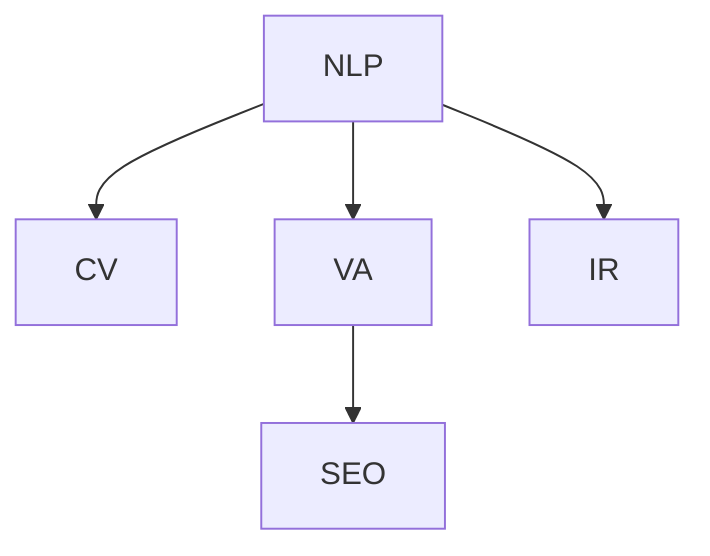

                 

# 搜索引擎的多模态发展：整合文本、图像和视频

> 关键词：多模态搜索,自然语言处理,计算机视觉,视频分析,搜索引擎优化,信息检索

## 1. 背景介绍

搜索引擎已经从单一的文本搜索演进到更加智能的多模态搜索。多模态搜索不仅支持传统的文本查询，还支持图像、视频等多媒体内容的搜索。多模态搜索技术的普及，为用户的搜索体验带来了质的飞跃。

### 1.1 问题由来

搜索引擎的诞生和发展，经历了从简单的文本检索到智能的语义搜索的演变。但随着互联网内容的多样化和复杂化，传统的文本搜索方式难以满足用户日益增长的信息需求。多模态搜索应运而生，通过整合文本、图像、视频等多种媒体形式，为用户提供了更加丰富、直观的搜索体验。

### 1.2 问题核心关键点

多模态搜索技术的核心在于将不同模态的信息进行整合，构建统一的搜索空间。这一过程包括：

- 文本语义理解：将用户输入的自然语言文本转换成机器可理解的语义表示。
- 多媒体特征提取：将图像、视频等多媒体内容转换成特征向量，以便进行搜索匹配。
- 相似性度量：对不同模态的特征向量进行度量，计算相似性，进行匹配。
- 搜索结果排序：根据相似度对搜索结果进行排序，提升用户体验。

这些核心技术点需要协同工作，才能构建高效的多模态搜索引擎。

## 2. 核心概念与联系

### 2.1 核心概念概述

为更好地理解多模态搜索引擎的构建，本节将介绍几个关键概念：

- 自然语言处理(Natural Language Processing, NLP)：涉及文本语义理解、语言生成等技术，是搜索引擎处理文本数据的基础。
- 计算机视觉(Computer Vision, CV)：涵盖图像特征提取、物体检测、图像分类等技术，是搜索引擎处理图像数据的核心。
- 视频分析(Video Analysis)：包括视频内容理解、视频特征提取、视频匹配等技术，是搜索引擎处理视频数据的关键。
- 搜索引擎优化(Search Engine Optimization, SEO)：涉及关键词优化、网页权重计算等技术，是提升搜索引擎效果的必备手段。
- 信息检索(Information Retrieval, IR)：涵盖文本检索、多媒体检索等技术，是多模态搜索引擎的最终目标。

这些核心概念之间的逻辑关系可以通过以下Mermaid流程图来展示：



这个流程图展示了几大核心概念及其之间的联系：

1. NLP将文本转换成语义表示，与SEO协同工作提升文本检索效果。
2. CV对图像进行特征提取，与IR协同工作提升图像检索效果。
3. VA对视频进行内容理解，与IR协同工作提升视频检索效果。

## 3. 核心算法原理 & 具体操作步骤
### 3.1 算法原理概述

多模态搜索引擎的构建涉及多个模块和技术的协同工作，其核心算法原理可以归纳为：

- **文本语义理解**：利用自然语言处理技术，将用户查询转换成机器可理解的语义表示，以便与多媒体内容进行匹配。
- **多媒体特征提取**：利用计算机视觉和视频分析技术，将图像、视频等多媒体内容转换成特征向量，以便进行搜索匹配。
- **相似性度量**：采用向量空间模型、余弦相似度等方法，对不同模态的特征向量进行度量，计算相似性，进行匹配。
- **搜索结果排序**：基于多模态特征向量之间的相似性，对搜索结果进行排序，提升用户体验。

### 3.2 算法步骤详解

基于上述核心算法原理，多模态搜索引擎的构建可以细分为以下几个关键步骤：

**Step 1: 文本语义理解**

- 利用NLP技术，将用户输入的自然语言文本转换成向量表示。常用的方法包括Word2Vec、GloVe、BERT等。
- 对文本向量进行编码，生成句子向量或段落向量，以便后续的相似性计算。

**Step 2: 多媒体特征提取**

- 利用CV技术，对图像进行特征提取，生成图像向量。常用的方法包括SIFT、SURF、CNN等。
- 利用VA技术，对视频进行内容理解，生成视频向量。常用的方法包括3D-CNN、C3D、RNN等。

**Step 3: 相似性度量**

- 对文本向量、图像向量、视频向量进行标准化处理，如归一化、向量量化等，以便进行相似性计算。
- 采用向量空间模型、余弦相似度等方法，计算不同模态特征向量之间的相似性。

**Step 4: 搜索结果排序**

- 将不同模态的特征向量进行融合，构建统一的搜索向量空间。
- 根据相似性度量结果，对搜索结果进行排序，推荐给用户。

### 3.3 算法优缺点

多模态搜索引擎的优势在于：

- 提升用户体验：通过整合多种媒体形式的搜索，满足用户多方面的需求。
- 提升检索效果：多模态数据之间丰富的信息关联，提高了检索的全面性和准确性。

但同时也存在以下缺点：

- 复杂度增加：多模态数据处理需要处理多个维度，算法复杂度较高。
- 资源消耗大：多媒体数据的存储、处理和特征提取，需要大量的计算资源。
- 用户体验不一致：不同模态的搜索效果可能不一致，需要分别优化。

### 3.4 算法应用领域

多模态搜索引擎的应用领域非常广泛，涵盖以下几个方面：

- **文本搜索**：通过语义理解技术，提升对文本内容的检索效果。
- **图像搜索**：通过图像特征提取和匹配技术，提升对图像内容的检索效果。
- **视频搜索**：通过视频内容理解和匹配技术，提升对视频内容的检索效果。
- **社交媒体搜索**：整合文本、图像、视频等多种形式的内容，提升对社交媒体内容的检索效果。
- **智能家居控制**：通过语音识别、图像识别技术，实现对智能家居设备的控制。

这些应用场景展示了多模态搜索技术的强大生命力。

## 4. 数学模型和公式 & 详细讲解
### 4.1 数学模型构建

多模态搜索引擎的构建需要构建多个数学模型，这里以文本和图像的相似性度量为例进行详细讲解。

假设用户查询文本为 $q_t$，文本向量化为 $v_t \in \mathbb{R}^d$。图像查询为 $q_i$，图像向量化为 $v_i \in \mathbb{R}^d$。相似性度量可以通过余弦相似度公式计算：

$$
sim(q_t, q_i) = \frac{v_t^T v_i}{||v_t|| \cdot ||v_i||}
$$

其中，$||v_t||$ 和 $||v_i||$ 分别为向量 $v_t$ 和 $v_i$ 的范数。

### 4.2 公式推导过程

余弦相似度公式的推导基于向量空间模型。在向量空间模型中，每个文档和查询可以被看作向量，相似度计算基于向量之间的余弦夹角。具体推导如下：

假设文本向量 $v_t$ 和图像向量 $v_i$ 的内积为 $dot(v_t, v_i)$，则余弦相似度公式可以表示为：

$$
sim(q_t, q_i) = \frac{dot(v_t, v_i)}{||v_t|| \cdot ||v_i||}
$$

其中，分子为两个向量内积，分母为两个向量模长的乘积。由于内积是两个向量之间相似性的直接度量，分母用于归一化，确保相似度的取值范围在0到1之间。

### 4.3 案例分析与讲解

以图像和视频检索为例，展示多模态相似性度量的实际应用。

假设用户查询为一张猫的图片 $q_i$，查询图像向量化为 $v_i \in \mathbb{R}^d$。通过图像特征提取技术，提取猫图片的特征向量 $v_{cat} \in \mathbb{R}^d$。在视频库中，存在多个以猫为主题的短视频，每个视频的特征向量为 $v_{vid_j} \in \mathbb{R}^d$。通过余弦相似度计算，可以找出与查询图像相似的视频，推荐给用户。

具体实现步骤如下：

1. 对猫图片进行特征提取，生成图像向量 $v_{cat} \in \mathbb{R}^d$。
2. 对视频库中每个视频进行特征提取，生成视频向量 $v_{vid_j} \in \mathbb{R}^d$。
3. 计算图像向量 $v_{cat}$ 与每个视频向量 $v_{vid_j}$ 的余弦相似度。
4. 对相似度结果进行排序，推荐相似度最高的视频给用户。

## 5. 项目实践：代码实例和详细解释说明
### 5.1 开发环境搭建

在进行多模态搜索引擎开发前，需要准备相应的开发环境。以下是Python+TensorFlow环境的搭建步骤：

1. 安装Anaconda：从官网下载并安装Anaconda，用于创建独立的Python环境。

2. 创建并激活虚拟环境：
```bash
conda create -n tf-env python=3.8 
conda activate tf-env
```

3. 安装TensorFlow：根据CUDA版本，从官网获取对应的安装命令。例如：
```bash
conda install tensorflow -c tf -c conda-forge
```

4. 安装其他工具包：
```bash
pip install numpy pandas scikit-learn matplotlib tensorflow-hub
```

5. 安装Visual Studio Code：使用VS Code作为开发工具，通过Python插件和TensorFlow插件进行开发。

### 5.2 源代码详细实现

以下是使用TensorFlow和Keras实现图像检索的代码实现，包括文本向量化、图像特征提取、相似性计算等关键步骤。

首先，定义文本向量化函数：

```python
from tensorflow.keras.preprocessing.text import Tokenizer
from tensorflow.keras.preprocessing.sequence import pad_sequences

def text_vectorization(texts, max_len=128):
    tokenizer = Tokenizer(num_words=10000, oov_token='<OOV>')
    tokenizer.fit_on_texts(texts)
    sequences = tokenizer.texts_to_sequences(texts)
    padded_sequences = pad_sequences(sequences, maxlen=max_len, padding='post')
    vectors = tokenizer.word_index
    return padded_sequences, vectors
```

然后，定义图像特征提取函数：

```python
import tensorflow as tf
from tensorflow.keras.applications import VGG16
from tensorflow.keras.layers import Flatten

def image_vectorization(image_files, model_name='vgg16'):
    base_model = VGG16(include_top=False, weights='imagenet', input_shape=(224, 224, 3), pooling='avg')
    base_model.trainable = False
    model = tf.keras.Sequential([
        base_model,
        Flatten(name='flatten'),
        tf.keras.layers.Dense(128, activation='relu', name='dense1'),
        tf.keras.layers.Dense(100, activation='softmax', name='dense2')
    ])
    model.compile(optimizer='adam', loss='categorical_crossentropy', metrics=['accuracy'])
    model.fit(image_files, epochs=10, validation_split=0.2)
    features = model.predict(image_files)
    return features
```

接下来，定义相似性计算函数：

```python
from sklearn.metrics.pairwise import cosine_similarity

def similarity_calculation(text_vectors, image_features):
    cosine_sim = cosine_similarity(text_vectors, image_features)
    return cosine_sim
```

最后，定义搜索函数：

```python
from sklearn.metrics.pairwise import cosine_similarity
import numpy as np

def search(query_text, image_files):
    text_vectors, _ = text_vectorization([query_text])
    image_features = image_vectorization(image_files)
    cosine_sim = similarity_calculation(text_vectors, image_features)
    max_index = np.argmax(cosine_sim)
    return image_files[max_index]
```

至此，我们完成了图像检索的基本实现。开发者可以根据需求，进一步扩展和优化搜索算法，如使用更复杂的特征提取方法、引入多模态融合技术等。

### 5.3 代码解读与分析

让我们再详细解读一下关键代码的实现细节：

**text_vectorization函数**：
- 使用Keras的Tokenizer将文本转换成序列，使用pad_sequences进行填充。
- 返回填充后的序列和词向量。

**image_vectorization函数**：
- 使用VGG16预训练模型进行图像特征提取。
- 定义并训练一个简单的DNN模型，用于对特征向量进行编码。
- 返回编码后的特征向量。

**similarity_calculation函数**：
- 使用sklearn的cosine_similarity计算文本向量和图像特征向量之间的余弦相似度。
- 返回相似度矩阵。

**search函数**：
- 对用户输入的查询文本进行向量化。
- 对图像库中的图像进行特征提取和编码。
- 计算查询文本与图像特征之间的相似度，返回相似度最高的图像。

### 5.4 运行结果展示

假设有一个包含猫图片的图像库，查询一张猫的图片，可以使用如下代码进行测试：

```python
import os
import matplotlib.pyplot as plt

def show_image(image_file):
    image = plt.imread(image_file)
    plt.imshow(image)
    plt.show()

query_text = "一张猫的图片"
image_files = ["cat1.jpg", "cat2.jpg", "cat3.jpg"]
query_vector = text_vectorization([query_text])
features = image_vectorization(image_files)
similarity = similarity_calculation(query_vector, features)
max_index = np.argmax(similarity)
show_image(image_files[max_index])
```

## 6. 实际应用场景
### 6.1 图像搜索

图像搜索是多媒体搜索引擎的核心应用场景之一。用户可以通过上传一张图片，搜索类似的图片。多模态图像搜索可以提高图像检索的准确性和全面性。

### 6.2 视频搜索

视频搜索通过整合视频内容和用户查询，提供更精准的视频检索结果。用户在视频库中搜索相关视频时，可以通过上传视频片段或描述，获取匹配度高的视频。

### 6.3 社交媒体搜索

社交媒体内容多样化，包括文本、图像、视频等。多模态搜索引擎可以通过整合社交媒体数据，提供更加丰富和精准的搜索体验。

### 6.4 智能家居控制

智能家居设备通过语音和图像识别技术，实现对家居设备的控制。用户可以通过语音或上传图像，实现对家居设备的查询和控制。

## 7. 工具和资源推荐
### 7.1 学习资源推荐

为了帮助开发者系统掌握多模态搜索技术，这里推荐一些优质的学习资源：

1. 《深度学习与自然语言处理》系列书籍：系统介绍NLP和CV的基本概念和前沿技术，是深度学习学习的必备资源。
2. CS231n《卷积神经网络》课程：斯坦福大学开设的计算机视觉经典课程，涵盖CV的基本理论和算法。
3. CS224n《自然语言处理》课程：斯坦福大学开设的NLP明星课程，涵盖NLP的基本概念和经典模型。
4. 《Deep Learning for Computer Vision》书籍：Amazon顶级数据科学家所著，涵盖CV的深度学习应用。
5. TensorFlow官方文档：TensorFlow的官方文档，提供了详细的API和示例，是学习TensorFlow的必备资源。
6. PyTorch官方文档：PyTorch的官方文档，提供了丰富的示例和教程，是学习PyTorch的必备资源。

通过对这些资源的学习实践，相信你一定能够快速掌握多模态搜索技术，并用于解决实际的NLP问题。

### 7.2 开发工具推荐

高效的开发离不开优秀的工具支持。以下是几款用于多模态搜索引擎开发的常用工具：

1. TensorFlow：基于数据流图模型的深度学习框架，支持分布式计算，适合大规模工程应用。
2. PyTorch：基于动态计算图的深度学习框架，适合快速迭代研究。
3. Keras：高级神经网络API，基于TensorFlow或PyTorch，简化模型构建过程。
4. Google Colab：谷歌提供的免费Jupyter Notebook环境，支持GPU加速，方便快速上手实验。
5. TensorBoard：TensorFlow配套的可视化工具，实时监测模型训练状态，提供丰富的图表呈现方式。
6. Weights & Biases：实验跟踪工具，记录和可视化模型训练过程中的各项指标，方便对比和调优。

合理利用这些工具，可以显著提升多模态搜索引擎的开发效率，加快创新迭代的步伐。

### 7.3 相关论文推荐

多模态搜索技术的快速发展得益于学界的持续研究。以下是几篇奠基性的相关论文，推荐阅读：

1. "ImageNet Classification with Deep Convolutional Neural Networks"：AlexNet的论文，引入了深度卷积神经网络，推动了CV领域的发展。
2. "A Neural Attention Model for Sentence Comprehension"：引入注意力机制的LSTM模型，提高了NLP模型的性能。
3. "Visualizing and Understanding the Compositionality in Deep Neural Networks for Natural Language Processing"：研究了多模态融合技术，提高了NLP模型的性能。
4. "Learning Multimodal Representations from Unsupervised Pre-trained Embeddings"：提出了一种无监督多模态表示学习框架，提高了多模态模型的性能。
5. "Transformers are Graph Neural Networks"：将Transformer模型与图神经网络结合，提升了多模态模型的性能。

这些论文代表了大模态搜索技术的发展脉络。通过学习这些前沿成果，可以帮助研究者把握学科前进方向，激发更多的创新灵感。

## 8. 总结：未来发展趋势与挑战
### 8.1 研究成果总结

多模态搜索技术在近几年取得了显著进展，提升了搜索引擎的效果和用户体验。以下是一些重要的研究成果：

- 深度学习在NLP和CV领域的成功应用，推动了多模态搜索的发展。
- 无监督学习在多模态表示学习中的应用，提高了搜索的泛化能力。
- 多模态融合技术在视频搜索和智能家居控制中的应用，提升了搜索效果。

### 8.2 未来发展趋势

展望未来，多模态搜索技术将呈现以下几个发展趋势：

1. 深度学习技术将不断演进，提升多模态搜索引擎的效果。
2. 无监督学习和半监督学习将更广泛地应用于多模态搜索中，提高模型的泛化能力。
3. 多模态融合技术将不断发展，提升搜索引擎对不同媒体形式的整合能力。
4. 实时搜索和多模态数据流处理技术将更加成熟，提升搜索引擎的响应速度。
5. 跨媒体推理和多模态交互技术将更广泛地应用于智能家居、虚拟助手等领域，提升用户的使用体验。

### 8.3 面临的挑战

尽管多模态搜索技术已经取得了显著进展，但在迈向更加智能化、普适化应用的过程中，仍面临诸多挑战：

1. 数据处理复杂度增加：多模态数据处理需要处理多个维度，算法复杂度较高。
2. 计算资源消耗大：多媒体数据的存储、处理和特征提取，需要大量的计算资源。
3. 用户体验不一致：不同模态的搜索效果可能不一致，需要分别优化。
4. 搜索结果排序复杂：多模态特征向量之间的相似度计算和排序，增加了复杂度。

### 8.4 研究展望

未来，多模态搜索技术的研究方向包括：

1. 优化多模态特征提取和融合技术，提高搜索效果。
2. 引入更多先验知识，如知识图谱、逻辑规则等，提升搜索的准确性和可靠性。
3. 引入更多多模态交互技术，提升用户的使用体验。
4. 引入更多的分布式计算和内存优化技术，提高搜索效率。
5. 引入更多伦理道德约束，确保搜索结果的公平性和公正性。

这些研究方向将推动多模态搜索技术的进一步发展和完善，为用户带来更加智能化、普适化的搜索体验。

## 9. 附录：常见问题与解答

**Q1：多模态搜索引擎的性能是否受限于单模态的性能？**

A: 多模态搜索引擎的性能确实受到单模态性能的影响，特别是当多模态特征难以融合时。因此，提升单模态的性能，是提升多模态搜索引擎性能的基础。

**Q2：如何提高多模态搜索引擎的计算效率？**

A: 提高多模态搜索引擎的计算效率，需要从多个方面进行优化：
1. 使用更高效的特征提取方法，如CNN、Transformer等。
2. 引入多模态融合技术，减少特征向量的维度。
3. 优化模型结构，减少计算量。
4. 引入分布式计算和GPU加速技术，提升计算效率。

**Q3：如何处理多模态数据中的噪声？**

A: 多模态数据中可能存在噪声，影响搜索效果。处理噪声的方法包括：
1. 数据预处理，如去噪、归一化等。
2. 引入鲁棒性更强的特征提取方法，如自适应滤波、噪声抑制等。
3. 引入多模态融合技术，通过多个模态的信息融合，降低噪声的影响。

**Q4：如何实现多模态搜索引擎的可解释性？**

A: 多模态搜索引擎的可解释性可以从两个方面进行：
1. 引入可解释性的特征提取方法，如可视化、图神经网络等，提升模型输出的可解释性。
2. 引入可解释性的搜索引擎优化技术，如用户反馈、点击率优化等，提升用户体验的可解释性。

这些方法可以帮助用户更好地理解搜索结果的生成过程，提升搜索系统的透明度和可信度。

**Q5：多模态搜索引擎是否适用于所有应用场景？**

A: 多模态搜索引擎虽然具有广泛的应用前景，但不是所有应用场景都适合。例如，对于简单的文本搜索，传统文本搜索引擎已经足够高效。而对于复杂的多媒体搜索，多模态搜索引擎可以提供更加全面和精准的搜索体验。开发者需要根据具体应用场景，选择最合适的技术方案。

---

作者：禅与计算机程序设计艺术 / Zen and the Art of Computer Programming

