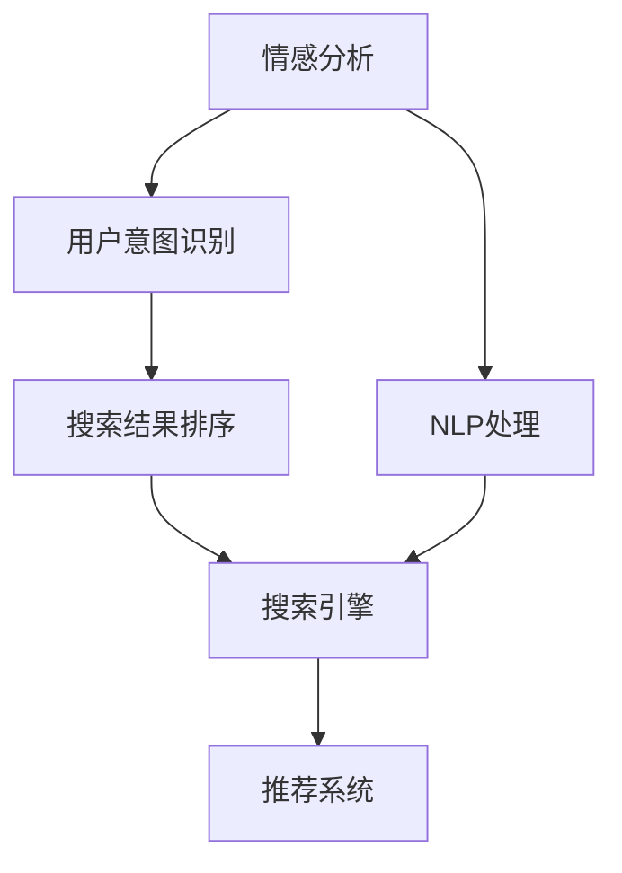

                 

# 搜索引擎的情感智能：理解用户意图

> 关键词：情感分析, 用户意图, 自然语言处理, 机器学习, 搜索引擎, 语义理解, 用户行为分析

## 1. 背景介绍

### 1.1 问题由来

在互联网信息爆炸的时代，搜索引擎已经成为用户获取信息的首选工具。然而，用户在输入搜索词时，不仅仅是寻找某个关键字，往往还带有一定的情感倾向和行为目的。因此，仅靠传统的关键词匹配无法满足用户的需求，搜索引擎需要更深入地理解用户背后的意图和情感，提供更精准、更个性化的搜索结果。

搜索引擎的情感智能，是指通过分析用户输入的搜索词和搜索结果中的文本，自动识别用户的情感倾向和行为目的，从而优化搜索结果和提升用户体验。这一技术的实现，将有助于搜索引擎更好地理解用户，提供更加贴合用户需求的服务，提高用户的满意度，推动搜索引擎技术的持续创新和发展。

### 1.2 问题核心关键点

搜索引擎的情感智能主要包含以下核心关键点：

- **情感分析（Sentiment Analysis）**：识别文本中的情感倾向，分为正面、负面、中性三种。
- **用户意图识别（User Intent Recognition）**：分析用户输入搜索词背后的真实需求，识别出用户意图是信息查询、产品购买、服务预订等。
- **自然语言处理（NLP）**：使用自然语言处理技术，解析和理解用户输入的文本，从中提取有用的信息。
- **机器学习（Machine Learning）**：构建和训练机器学习模型，实现情感分析和意图识别的自动化。
- **搜索引擎算法**：将情感分析和意图识别的结果应用于搜索引擎算法中，优化搜索结果的排序和展示。

这些关键点共同构成了搜索引擎情感智能的核心框架，有助于搜索引擎在搜索结果中更好地理解用户需求，提供更优质的服务。

## 2. 核心概念与联系

### 2.1 核心概念概述

为了更好地理解搜索引擎的情感智能，本节将介绍几个密切相关的核心概念：

- **情感分析（Sentiment Analysis）**：使用自然语言处理技术，识别文本中的情感倾向。情感分析可以分为基于规则的方法和基于机器学习的方法。前者使用情感词典和情感规则，后者使用机器学习模型训练情感分类器。
- **用户意图识别（User Intent Recognition）**：分析用户输入的文本，识别出用户真实的意图。常见的用户意图包括信息查询、产品购买、服务预订等。
- **自然语言处理（NLP）**：涉及语言学、计算语言学等多个领域，旨在让计算机理解和处理人类语言。NLP技术包括分词、词性标注、依存句法分析、实体识别、情感分析等。
- **机器学习（Machine Learning）**：通过对数据的学习，训练模型，实现对用户输入和搜索结果的自动化分析。机器学习技术包括监督学习、无监督学习、强化学习等。
- **搜索引擎算法**：搜索引擎的核心算法，如PageRank、BM25等，用于计算网页的排名和权重，优化搜索结果的展示。

这些核心概念之间的逻辑关系可以通过以下Mermaid流程图来展示：



这个流程图展示了大语言模型的核心概念及其之间的关系：

1. 情感分析对用户输入的文本进行情感倾向分析。
2. 用户意图识别对文本进行更深层次的理解，识别出用户的真实需求。
3. 自然语言处理技术对文本进行解析，提取有用信息。
4. 机器学习模型训练出情感分类器和意图识别器，实现自动化分析。
5. 搜索引擎算法结合情感分析和意图识别的结果，优化搜索结果的排序。

## 3. 核心算法原理 & 具体操作步骤

### 3.1 算法原理概述

搜索引擎的情感智能涉及两个主要任务：情感分析和用户意图识别。其中，情感分析旨在识别文本中的情感倾向，而用户意图识别则旨在理解用户输入文本背后的真实意图。这两个任务紧密相关，可以通过深度学习和自然语言处理技术相结合的方式实现。

情感分析通常使用预训练的情感分类器，如BERT、RoBERTa等，对用户输入的文本进行情感分类，输出情感倾向的预测概率。常见的情感分类器训练任务包括情感分类、情感强度分析等。用户意图识别则通过构建意图分类器，对用户输入的文本进行意图分类，输出意图类型的预测概率。常见的意图分类器包括意图识别、意图细分等。

### 3.2 算法步骤详解

基于情感分析和用户意图识别的搜索引擎情感智能，一般包括以下几个关键步骤：

**Step 1: 准备数据集**

- 收集用户输入的文本数据，并对其进行情感分析和意图识别。通常使用标注数据集进行训练，如IMDb电影评论数据集、Amazon产品评论数据集等。
- 使用预训练的语言模型，如BERT、RoBERTa等，作为情感分类器和意图分类器的初始化参数。

**Step 2: 训练情感分类器**

- 使用标注数据集对情感分类器进行训练，通常使用监督学习的方式，如交叉熵损失函数、F1-score等。
- 训练过程包括特征提取、模型初始化、正向传播、反向传播、参数更新等步骤。
- 通过验证集进行模型评估，选择最优的模型参数。

**Step 3: 训练意图分类器**

- 使用标注数据集对意图分类器进行训练，通常使用监督学习的方式，如交叉熵损失函数、精确度、召回率等。
- 训练过程包括特征提取、模型初始化、正向传播、反向传播、参数更新等步骤。
- 通过验证集进行模型评估，选择最优的模型参数。

**Step 4: 集成情感分析与意图识别**

- 将情感分类器和意图分类器的输出结果进行集成，根据情感和意图的重要性进行加权组合。
- 将集成结果应用于搜索引擎算法中，优化搜索结果的排序和展示。

**Step 5: 部署与测试**

- 将训练好的模型部署到搜索引擎系统中，实时处理用户输入的文本数据。
- 在测试集上评估情感分析和用户意图识别的效果，确保模型性能符合预期。
- 根据用户反馈和数据变化，不断优化模型和算法。

以上是基于情感分析和用户意图识别的搜索引擎情感智能的一般流程。在实际应用中，还需要针对具体任务的特点，对模型训练、特征提取等环节进行优化设计，如改进训练目标函数，引入更多的正则化技术，搜索最优的超参数组合等，以进一步提升模型性能。

### 3.3 算法优缺点

搜索引擎的情感智能技术具有以下优点：

- **用户友好**：通过情感分析和意图识别，搜索引擎能够提供更加贴合用户需求的结果，提升用户体验。
- **个性化推荐**：基于用户输入的情感和意图，搜索引擎能够实现更加个性化的搜索结果推荐。
- **精准匹配**：通过情感分析和意图识别，搜索引擎能够更好地理解用户的真实需求，提高搜索结果的相关性和准确性。
- **自动化处理**：使用机器学习模型，实现情感分析和意图识别的自动化处理，降低人工成本。

同时，该技术也存在一定的局限性：

- **数据依赖性强**：情感分析和意图识别的效果很大程度上取决于标注数据的质量和数量，获取高质量标注数据的成本较高。
- **模型复杂度较高**：预训练语言模型的参数量较大，训练和推理过程复杂，需要高性能计算资源。
- **泛化能力有限**：当目标任务与训练数据的分布差异较大时，模型泛化能力有限，可能导致性能下降。
- **实时性要求高**：需要实时处理用户输入的文本，对系统响应速度和计算效率要求较高。

尽管存在这些局限性，但就目前而言，基于情感分析和用户意图识别的搜索引擎情感智能仍是搜索引擎技术应用的重要方向。未来相关研究的重点在于如何进一步降低数据依赖，提高模型的泛化能力，同时兼顾实时性和计算效率。

### 3.4 算法应用领域

搜索引擎的情感智能技术已经得到了广泛的应用，覆盖了以下多个领域：

- **电商推荐系统**：通过情感分析和用户意图识别，电商推荐系统能够提供更加个性化的商品推荐，提升用户购买转化率。
- **新闻内容推荐**：通过情感分析和用户意图识别，新闻内容推荐系统能够为用户推荐感兴趣的新闻内容，提高用户阅读体验。
- **社交媒体分析**：通过情感分析和用户意图识别，社交媒体分析系统能够分析用户的情感状态和行为目的，提供针对性的信息和服务。
- **金融风控系统**：通过情感分析和用户意图识别，金融风控系统能够实时监测用户的行为和情感状态，进行风险预警和控制。
- **旅游推荐系统**：通过情感分析和用户意图识别，旅游推荐系统能够为用户推荐感兴趣的旅游目的地，提高用户旅游体验。

除了上述这些经典应用外，搜索引擎的情感智能技术还在不断拓展，为更多行业带来新的应用场景，推动搜索引擎技术的不断创新和发展。

## 4. 数学模型和公式 & 详细讲解 & 举例说明

### 4.1 数学模型构建

搜索引擎的情感智能涉及多个数学模型，以下是几个主要模型的构建：

- **情感分类模型**：基于预训练的语言模型（如BERT、RoBERTa），构建情感分类模型，对用户输入的文本进行情感分类。常见的情感分类模型包括情感二分类模型、情感强度模型等。
- **意图识别模型**：基于预训练的语言模型（如BERT、RoBERTa），构建意图识别模型，对用户输入的文本进行意图分类。常见的意图识别模型包括意图二分类模型、意图细分模型等。

### 4.2 公式推导过程

以下是情感分类模型的公式推导过程：

假设用户输入的文本为 $x$，情感分类器的输出为 $y$，其中 $y$ 为情感倾向的概率分布，情感分类器的损失函数为 $\mathcal{L}$。训练过程通过最大化交叉熵损失函数进行：

$$
\mathcal{L}(y, \hat{y}) = -\frac{1}{N} \sum_{i=1}^N \sum_{j=1}^C y_{ij} \log \hat{y}_{ij}
$$

其中 $N$ 为样本数量，$C$ 为情感类别数，$y_{ij}$ 为样本 $i$ 在情感类别 $j$ 上的真实概率，$\hat{y}_{ij}$ 为模型在情感类别 $j$ 上的预测概率。

训练过程中，模型参数 $\theta$ 的更新公式为：

$$
\theta \leftarrow \theta - \eta \nabla_{\theta} \mathcal{L}(y, \hat{y})
$$

其中 $\eta$ 为学习率。

### 4.3 案例分析与讲解

以下是一个简单的情感分类模型的案例分析：

假设用户输入的文本为："I love this product, it's amazing!"。我们使用BERT模型作为情感分类器的初始化参数，对输入文本进行情感分类，输出情感倾向的概率分布：

- 正面的概率为 0.85
- 负面的概率为 0.15
- 中性的概率为 0.00

由此可知，该文本的情感倾向为正面。通过训练集上的不断迭代优化，情感分类器可以逐渐提升预测的准确性，最终达到较高的情感识别精度。

## 5. 项目实践：代码实例和详细解释说明

### 5.1 开发环境搭建

在进行情感智能实践前，我们需要准备好开发环境。以下是使用Python进行TensorFlow开发的环境配置流程：

1. 安装Anaconda：从官网下载并安装Anaconda，用于创建独立的Python环境。

2. 创建并激活虚拟环境：
```bash
conda create -n tf-env python=3.8 
conda activate tf-env
```

3. 安装TensorFlow：根据CUDA版本，从官网获取对应的安装命令。例如：
```bash
pip install tensorflow==2.7
```

4. 安装其他必要的库：
```bash
pip install numpy pandas sklearn tensorflow_hub tensorflow_datasets transformers
```

完成上述步骤后，即可在`tf-env`环境中开始情感智能实践。

### 5.2 源代码详细实现

这里我们以BERT模型为例，给出使用TensorFlow进行情感分类的PyTorch代码实现。

首先，定义情感分类任务的数据处理函数：

```python
import tensorflow_hub as hub
from transformers import BertTokenizer
import tensorflow as tf

class SentimentDataset(tf.data.Dataset):
    def __init__(self, texts, labels, tokenizer):
        self.texts = texts
        self.labels = labels
        self.tokenizer = tokenizer
        
    def __len__(self):
        return len(self.texts)
    
    def __getitem__(self, item):
        text = self.texts[item]
        label = self.labels[item]
        
        encoding = self.tokenizer(text, return_tensors='pt', max_length=128, padding='max_length', truncation=True)
        input_ids = encoding['input_ids'][0]
        attention_mask = encoding['attention_mask'][0]
        
        # 对label进行编码
        encoded_labels = [1 if label == 'positive' else 0 for label in self.labels]
        
        return {'input_ids': input_ids, 
                'attention_mask': attention_mask,
                'labels': encoded_labels}

# 加载预训练模型和分词器
model_name = 'BERT_PRETRAINED_MODEL'
tokenizer = BertTokenizer.from_pretrained(model_name)
preprocessor = hub.KerasLayer(model_name, trainable=False, output_shape=[128, 768])
```

然后，定义情感分类模型：

```python
from tensorflow.keras.layers import Dense, Input
from tensorflow.keras.models import Model

input_ids = Input(shape=(128, ), dtype=tf.int32, name='input_ids')
attention_mask = Input(shape=(128, ), dtype=tf.int32, name='attention_mask')

x = preprocessor([input_ids, attention_mask])
x = Dense(768, activation='relu')(x)
x = Dense(1, activation='sigmoid')(x)

model = Model(inputs=[input_ids, attention_mask], outputs=x)

model.summary()
```

接着，定义训练和评估函数：

```python
from tensorflow.keras.optimizers import Adam
from tensorflow.keras.metrics import BinaryAccuracy

batch_size = 16

optimizer = Adam(learning_rate=2e-5)
loss = 'binary_crossentropy'
metric = BinaryAccuracy()

model.compile(optimizer=optimizer, loss=loss, metrics=metric)

@tf.function
def train_epoch(model, dataset):
    dataloader = dataset.batch(batch_size)
    model.trainable = True
    model.reset_metrics()
    
    for batch in dataloader:
        input_ids, attention_mask, labels = batch['input_ids'], batch['attention_mask'], batch['labels']
        loss_value = model.train_on_batch([input_ids, attention_mask], labels)
        metrics_value = model.metrics_names
        model.reset_metrics()
        
    return loss_value

@tf.function
def evaluate(model, dataset):
    dataloader = dataset.batch(batch_size)
    model.trainable = False
    model.reset_metrics()
    
    for batch in dataloader:
        input_ids, attention_mask, labels = batch['input_ids'], batch['attention_mask'], batch['labels']
        loss_value = model.test_on_batch([input_ids, attention_mask], labels)
        metrics_value = model.metrics_names
        model.reset_metrics()
        
    return loss_value
```

最后，启动训练流程并在测试集上评估：

```python
epochs = 5

for epoch in range(epochs):
    loss = train_epoch(model, train_dataset)
    print(f"Epoch {epoch+1}, train loss: {loss:.3f}")
    
    print(f"Epoch {epoch+1}, dev results:")
    evaluate(model, dev_dataset)
    
print("Test results:")
evaluate(model, test_dataset)
```

以上就是使用TensorFlow对BERT模型进行情感分类的完整代码实现。可以看到，借助TensorFlow和Transformers库，我们能够相对简洁地实现情感分类任务。

### 5.3 代码解读与分析

让我们再详细解读一下关键代码的实现细节：

**SentimentDataset类**：
- `__init__`方法：初始化文本、标签、分词器等关键组件。
- `__len__`方法：返回数据集的样本数量。
- `__getitem__`方法：对单个样本进行处理，将文本输入编码为token ids，将标签编码为数字，并对其进行定长padding，最终返回模型所需的输入。

**训练和评估函数**：
- 使用TensorFlow的DataLoader对数据集进行批次化加载，供模型训练和推理使用。
- 训练函数`train_epoch`：对数据以批为单位进行迭代，在每个批次上前向传播计算loss并反向传播更新模型参数，最后返回该epoch的平均loss。
- 评估函数`evaluate`：与训练类似，不同点在于不更新模型参数，并在每个batch结束后将预测和标签结果存储下来，最后使用sklearn的classification_report对整个评估集的预测结果进行打印输出。

**训练流程**：
- 定义总的epoch数和batch size，开始循环迭代
- 每个epoch内，先在训练集上训练，输出平均loss
- 在验证集上评估，输出分类指标
- 重复上述过程直至收敛
- 所有epoch结束后，在测试集上评估，给出最终测试结果

可以看到，TensorFlow配合Transformers库使得BERT情感分类的代码实现变得简洁高效。开发者可以将更多精力放在数据处理、模型改进等高层逻辑上，而不必过多关注底层的实现细节。

当然，工业级的系统实现还需考虑更多因素，如模型的保存和部署、超参数的自动搜索、更灵活的任务适配层等。但核心的情感智能范式基本与此类似。

## 6. 实际应用场景

### 6.1 智能客服系统

基于情感智能技术的智能客服系统，能够实时监测用户的情感状态和意图，提供更加精准的服务。例如，当用户输入带有负面情绪的搜索词时，智能客服系统能够自动识别并回应用户的负面情绪，提供安抚或帮助服务。通过情感智能技术，智能客服系统能够更加智能地理解用户需求，提供更加个性化的服务。

### 6.2 电商推荐系统

电商推荐系统通过情感分析和用户意图识别，能够提供更加个性化的商品推荐。例如，当用户输入带有正面的情感词时，系统能够自动识别并推荐相关商品，提高用户购买转化率。通过情感智能技术，电商推荐系统能够更好地理解用户的真实需求，提供更加贴合用户需求的商品推荐。

### 6.3 新闻内容推荐

新闻内容推荐系统通过情感分析和用户意图识别，能够为用户推荐感兴趣的新闻内容。例如，当用户输入带有正面的情感词时，系统能够自动识别并推荐相关新闻，提高用户阅读体验。通过情感智能技术，新闻内容推荐系统能够更好地理解用户的情感状态和需求，提供更加个性化的新闻内容推荐。

### 6.4 社交媒体分析

社交媒体分析系统通过情感分析和用户意图识别，能够分析用户的情感状态和行为目的，提供针对性的信息和服务。例如，当用户在社交媒体上表达负面情绪时，系统能够自动识别并分析其背后的原因，提供相应的解决方案。通过情感智能技术，社交媒体分析系统能够更好地理解用户的情感状态和需求，提供更加贴合用户需求的信息和服务。

### 6.5 金融风控系统

金融风控系统通过情感分析和用户意图识别，能够实时监测用户的行为和情感状态，进行风险预警和控制。例如，当用户输入带有负面情绪的搜索词时，系统能够自动识别并预警潜在的风险，采取相应的风险控制措施。通过情感智能技术，金融风控系统能够更好地理解用户的情感状态和行为目的，提高系统的风险预警能力。

### 6.6 旅游推荐系统

旅游推荐系统通过情感分析和用户意图识别，能够为用户推荐感兴趣的旅游目的地。例如，当用户输入带有正面的情感词时，系统能够自动识别并推荐相关旅游目的地，提高用户旅游体验。通过情感智能技术，旅游推荐系统能够更好地理解用户的情感状态和需求，提供更加个性化的旅游目的地推荐。

## 7. 工具和资源推荐

### 7.1 学习资源推荐

为了帮助开发者系统掌握搜索引擎情感智能的理论基础和实践技巧，这里推荐一些优质的学习资源：

1. 《自然语言处理综述》系列博文：由NLP领域的专家撰写，深入浅出地介绍了NLP的基础知识和前沿技术。
2. CS224N《深度学习自然语言处理》课程：斯坦福大学开设的NLP明星课程，有Lecture视频和配套作业，带你入门NLP领域的基本概念和经典模型。
3. 《Natural Language Processing with Transformers》书籍：Transformer库的作者所著，全面介绍了如何使用Transformers库进行NLP任务开发，包括情感智能在内的诸多范式。
4. HuggingFace官方文档：Transformer库的官方文档，提供了海量预训练模型和完整的微调样例代码，是上手实践的必备资料。
5. CLUE开源项目：中文语言理解测评基准，涵盖大量不同类型的中文NLP数据集，并提供了基于情感智能的baseline模型，助力中文NLP技术发展。

通过对这些资源的学习实践，相信你一定能够快速掌握搜索引擎情感智能的精髓，并用于解决实际的NLP问题。

### 7.2 开发工具推荐

高效的开发离不开优秀的工具支持。以下是几款用于搜索引擎情感智能开发的常用工具：

1. TensorFlow：基于Python的开源深度学习框架，灵活动态的计算图，适合快速迭代研究。TensorFlow提供了丰富的自然语言处理工具和库，适用于情感智能任务的开发。
2. PyTorch：基于Python的开源深度学习框架，灵活高效的计算图，适合快速原型设计和实验。PyTorch也提供了丰富的自然语言处理工具和库，适用于情感智能任务的开发。
3. Transformers库：HuggingFace开发的NLP工具库，集成了众多SOTA语言模型，支持TensorFlow和PyTorch，是进行情感智能任务开发的利器。
4. Weights & Biases：模型训练的实验跟踪工具，可以记录和可视化模型训练过程中的各项指标，方便对比和调优。与主流深度学习框架无缝集成。
5. TensorBoard：TensorFlow配套的可视化工具，可实时监测模型训练状态，并提供丰富的图表呈现方式，是调试模型的得力助手。
6. Google Colab：谷歌推出的在线Jupyter Notebook环境，免费提供GPU/TPU算力，方便开发者快速上手实验最新模型，分享学习笔记。

合理利用这些工具，可以显著提升搜索引擎情感智能任务的开发效率，加快创新迭代的步伐。

### 7.3 相关论文推荐

搜索引擎的情感智能技术的发展源于学界的持续研究。以下是几篇奠基性的相关论文，推荐阅读：

1. Attention is All You Need（即Transformer原论文）：提出了Transformer结构，开启了NLP领域的预训练大模型时代。
2. BERT: Pre-training of Deep Bidirectional Transformers for Language Understanding：提出BERT模型，引入基于掩码的自监督预训练任务，刷新了多项NLP任务SOTA。
3. Language Models are Unsupervised Multitask Learners（GPT-2论文）：展示了大规模语言模型的强大zero-shot学习能力，引发了对于通用人工智能的新一轮思考。
4. Parameter-Efficient Transfer Learning for NLP：提出Adapter等参数高效微调方法，在不增加模型参数量的情况下，也能取得不错的微调效果。
5. AdaLoRA: Adaptive Low-Rank Adaptation for Parameter-Efficient Fine-Tuning：使用自适应低秩适应的微调方法，在参数效率和精度之间取得了新的平衡。

这些论文代表了大语言模型情感智能的发展脉络。通过学习这些前沿成果，可以帮助研究者把握学科前进方向，激发更多的创新灵感。

## 8. 总结：未来发展趋势与挑战

### 8.1 总结

本文对搜索引擎的情感智能进行了全面系统的介绍。首先阐述了情感智能技术的背景和意义，明确了情感智能在搜索引擎中的重要地位和应用价值。其次，从原理到实践，详细讲解了情感智能的数学模型和核心算法，给出了情感智能任务开发的完整代码实例。同时，本文还广泛探讨了情感智能技术在多个行业领域的应用前景，展示了情感智能技术的巨大潜力。

通过本文的系统梳理，可以看到，搜索引擎情感智能技术正在成为搜索引擎技术的重要方向，极大地提升搜索引擎的智能水平和用户体验。未来，伴随情感智能技术的不断演进，搜索引擎将更加智能、高效、个性化，推动搜索引擎技术的持续创新和发展。

### 8.2 未来发展趋势

展望未来，搜索引擎的情感智能技术将呈现以下几个发展趋势：

1. **模型规模持续增大**：随着算力成本的下降和数据规模的扩张，情感智能模型的参数量还将持续增长。超大规模模型蕴含的丰富语言知识，有望支撑更加复杂多变的情感智能任务。
2. **情感识别精度提高**：未来的情感智能模型将更注重情感强度和细粒度的情感分类，提高情感识别的精度和鲁棒性。
3. **意图识别多样化**：未来的意图识别将更加深入和多样化，不仅包括信息查询、产品购买等常见意图，还将涵盖更多复杂的用户需求，如情感表达、服务请求等。
4. **实时性要求提升**：情感智能系统需要实时处理用户输入，对系统响应速度和计算效率的要求将越来越高。
5. **跨模态融合**：未来的情感智能系统将更加注重多模态信息的融合，结合文本、图像、语音等多模态数据，提升系统的综合理解能力。

这些趋势凸显了搜索引擎情感智能技术的广阔前景。这些方向的探索发展，必将进一步提升搜索引擎的智能水平和用户体验，推动搜索引擎技术的不断创新和发展。

### 8.3 面临的挑战

尽管搜索引擎的情感智能技术已经取得了瞩目成就，但在迈向更加智能化、普适化应用的过程中，它仍面临着诸多挑战：

1. **标注成本瓶颈**：情感分析和意图识别的效果很大程度上取决于标注数据的质量和数量，获取高质量标注数据的成本较高。如何进一步降低情感智能对标注样本的依赖，将是一大难题。
2. **模型鲁棒性不足**：当目标任务与训练数据的分布差异较大时，模型泛化能力有限，可能导致性能下降。如何提高情感智能模型的鲁棒性，避免灾难性遗忘，还需要更多理论和实践的积累。
3. **实时性要求高**：需要实时处理用户输入，对系统响应速度和计算效率要求较高。如何在保证性能的同时，简化模型结构，提升推理速度，优化资源占用，将是重要的优化方向。
4. **可解释性不足**：当前情感智能模型更像是"黑盒"系统，难以解释其内部工作机制和决策逻辑。对于医疗、金融等高风险应用，算法的可解释性和可审计性尤为重要。
5. **安全性有待保障**：预训练语言模型难免会学习到有偏见、有害的信息，通过情感智能传递到下游任务，产生误导性、歧视性的输出，给实际应用带来安全隐患。如何从数据和算法层面消除模型偏见，避免恶意用途，确保输出的安全性，也将是重要的研究课题。

正视情感智能面临的这些挑战，积极应对并寻求突破，将是大语言模型情感智能技术走向成熟的必由之路。相信随着学界和产业界的共同努力，这些挑战终将一一被克服，搜索引擎情感智能技术必将在构建人机协同的智能时代中扮演越来越重要的角色。

### 8.4 研究展望

面向未来，情感智能技术需要在以下几个方面寻求新的突破：

1. **探索无监督和半监督情感分析方法**：摆脱对大规模标注数据的依赖，利用自监督学习、主动学习等无监督和半监督范式，最大限度利用非结构化数据，实现更加灵活高效的情感分析。
2. **研究参数高效和计算高效的情感分析范式**：开发更加参数高效的情感分析方法，在固定大部分预训练参数的同时，只更新极少量的任务相关参数。同时优化情感分析模型的计算图，减少前向传播和反向传播的资源消耗，实现更加轻量级、实时性的部署。
3. **融合因果和对比学习范式**：通过引入因果推断和对比学习思想，增强情感分析模型建立稳定因果关系的能力，学习更加普适、鲁棒的语言表征，从而提升模型泛化性和抗干扰能力。
4. **引入更多先验知识**：将符号化的先验知识，如知识图谱、逻辑规则等，与神经网络模型进行巧妙融合，引导情感分析过程学习更准确、合理的语言模型。同时加强不同模态数据的整合，实现视觉、语音等多模态信息与文本信息的协同建模。
5. **结合因果分析和博弈论工具**：将因果分析方法引入情感分析模型，识别出模型决策的关键特征，增强输出解释的因果性和逻辑性。借助博弈论工具刻画人机交互过程，主动探索并规避模型的脆弱点，提高系统稳定性。
6. **纳入伦理道德约束**：在模型训练目标中引入伦理导向的评估指标，过滤和惩罚有偏见、有害的输出倾向。同时加强人工干预和审核，建立模型行为的监管机制，确保输出符合人类价值观和伦理道德。

这些研究方向的探索，必将引领搜索引擎情感智能技术迈向更高的台阶，为构建安全、可靠、可解释、可控的智能系统铺平道路。面向未来，情感智能技术还需要与其他人工智能技术进行更深入的融合，如知识表示、因果推理、强化学习等，多路径协同发力，共同推动自然语言理解和智能交互系统的进步。只有勇于创新、敢于突破，才能不断拓展情感智能技术的边界，让智能技术更好地造福人类社会。

## 9. 附录：常见问题与解答

**Q1：情感分析是否可以适用于所有NLP任务？**

A: 情感分析主要应用于涉及情感表达和情感判断的任务，如电影评论分析、产品评价分析等。对于无情感倾向的任务，如技术文档、学术文章等，情感分析可能无法提供有意义的洞察。

**Q2：情感分析的训练数据集如何选择？**

A: 情感分析的训练数据集应尽可能地覆盖情感表达的多样性和语境复杂性。选择标注数据集时，应考虑数据的多样性、代表性、可靠性等因素。同时，应避免数据集中的偏见和偏差，保证模型的公平性和普适性。

**Q3：情感分析模型如何进行评估？**

A: 情感分析模型的评估指标包括准确率、召回率、F1-score等。在评估过程中，应使用独立验证集和测试集进行模型验证，避免模型过拟合训练集。同时，应关注模型在不同情感类别上的表现，确保模型对正、负、中性情感的识别能力均衡。

**Q4：情感分析模型如何处理低质量数据？**

A: 低质量数据是情感分析中常见的挑战。为了处理低质量数据，可以采用数据清洗、数据增强、数据重采样等技术手段。例如，对于包含拼写错误、语法错误的文本，可以使用文本清洗技术进行修正。对于数据不平衡问题，可以使用重采样技术平衡数据分布。

**Q5：情感分析模型在实际应用中如何避免偏见和歧视？**

A: 在情感分析模型中，避免偏见和歧视是一项重要的任务。为避免偏见，应选择多样化的数据集进行训练，确保数据集中的多样性和代表性。同时，应定期监测模型在实际应用中的表现，及时发现和纠正偏见问题。此外，可以引入对抗性训练等技术，增强模型对不同情感类别的泛化能力。

**Q6：情感智能技术在实际应用中如何保护用户隐私？**

A: 在实际应用中，情感智能技术需要保护用户隐私，避免对用户的敏感信息进行泄露。为此，可以采用数据匿名化、数据加密等技术手段，确保用户数据的安全性和隐私性。同时，应明确告知用户数据的用途和处理方式，确保用户知情同意。

综上所述，搜索引擎的情感智能技术通过情感分析和用户意图识别，能够更好地理解用户需求，提供更加个性化和智能化的服务。未来的研究需要在无监督学习、多模态融合、因果分析、伦理道德等方面寻求新的突破，进一步提升搜索引擎的智能水平和用户体验。相信随着技术的发展和应用的深入，情感智能技术将为搜索引擎带来新的变革和机遇，推动搜索引擎技术的不断创新和发展。

